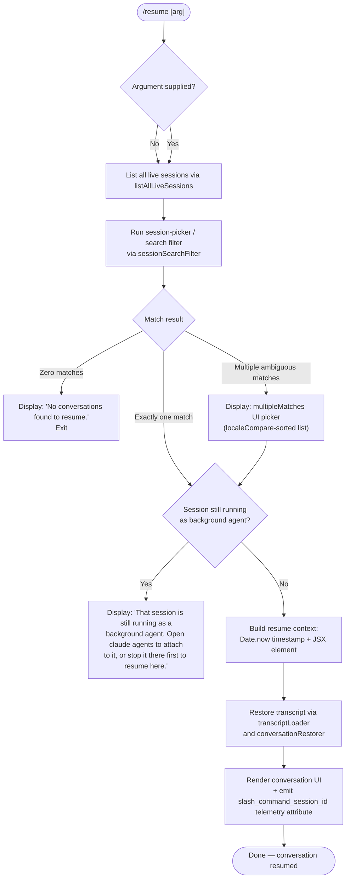

# `/resume`

> Analysis basis: CC v2.1.145 bundle.js (AST extraction + Claude interpretation)
> Minimum version: v2.1.145

---

## Overview

`/resume` (alias: `/continue`) allows the user to re-enter a previous Claude Code conversation by supplying a conversation ID or a search term. The command fetches all live sessions, applies optional fuzzy/prefix matching against the provided argument, and renders an interactive session-picker UI before restoring the selected conversation's full transcript state.

---

## Registration

| Field | Value |
|---|---|
| type | `local-jsx` |
| name | `resume` |
| description | `Resume a previous conversation` |
| aliases | `["continue"]` |
| argumentHint | `[conversation id or search term]` |
| module_id | `LXq` |
| load_inline | `true` |
| loc_byte | `11271177` |
| loc_byte_end | `11271374` |
| loc_line | `6662` |
| arbor_handler.name | `vN7` |
| arbor_handler.fqn | `claude-2.1.145::vN7` |
| arbor_handler.kind | `AsyncFunction` |
| arbor_handler.resolution_path | `module_id` |
| arbor_handler.n_hits | `0` |

Analysis basis: CC v2.1.145 bundle.js:+11271177

---

## Input Branching

Four distinct paths exist based on (a) whether a search argument is provided, (b) whether the matched session is currently running as a background agent, and (c) whether zero or multiple sessions match. A Mermaid flowchart is used accordingly.



Analysis basis: CC v2.1.145 bundle.js:+11269665, +11269779, +11270000, +11270214

---

## Behavioral Spec

### 1. Session Listing

```
async function listLiveSessions(context):
    rawSessions = await sessionStore.listAllLiveSessions()
    return rawSessions
        .filter(session => session is eligible)   // via sessionEligibilityFilter
        .map(session => normalizeSession(session)) // toLowerCase etc.
```

`listAllLiveSessions` is reached via `_LH` → `A.listAllLiveSessions`.
Analysis basis: CC v2.1.145 bundle.js:+8725153

---

### 2. Session Search / Filter (`IkH` — sessionSearchFilter)

```
function sessionSearchFilter(sessions, rawArg, nowMs):
    nowMs = Date.now()
    worktreeLines = runGit(["worktree", "list", "--porcelain"])
    worktrees = parseWorktreePorcelain(worktreeLines)
        // strips "worktree " prefix (9 chars), normalizes via NFC

    if rawArg is empty:
        sorted = sessions.sort(localeCompare)
        return { kind: "all", sessions: sorted }

    parts = rawArg.split(" ")
    // Try prefix/UUID match first (startsWith check)
    exact = sessions.find(s => s.id.startsWith(parts[0]))
    if exact:
        return { kind: "single", session: exact }

    // Fall back to fuzzy filter
    candidates = sessions.filter(s =>
        s.id.startsWith(rawArg) OR
        s.title.toLowerCase().includes(rawArg.toLowerCase())
    ).sort(localeCompare)

    if candidates.length == 0:
        return { kind: "none" }
    if candidates.length == 1:
        return { kind: "single", session: candidates[0] }
    return { kind: "multiple", sessions: candidates }
```

Key literals used: `"worktree"`, `"list"`, `"--porcelain"`, `"worktree "` (prefix, 9 chars), `"NFC"`.
Analysis basis: CC v2.1.145 bundle.js:+11266544, +11266579, +11266769, +11266794, +11266807, +11266838, +11266851, +11266946, +11266965, +11266992, +11267025

Telemetry fired during worktree detection: `tengu_worktree_detection`
Analysis basis: CC v2.1.145 bundle.js:+11266688

---

### 3. Background-Agent Guard (`vN7` → literal string check)

```
function checkBackgroundAgent(session):
    if session.isBackgroundAgent == true:
        display(
            "That session is still running as a background agent. " +
            "Open `claude agents` to attach to it, or stop it there first to resume here."
        )
        return BLOCKED
    return OK
```

Exact message string begins with `"That session is still running as a background agent."` (bundle.js:+11269779).
Analysis basis: CC v2.1.145 bundle.js:+11269779

---

### 4. No-Match Path

```
function handleNoMatch():
    display("No conversations found to resume.")
    return EXIT
```

Literal: `"No conversations found to resume."` (bundle.js:+11270214).
Analysis basis: CC v2.1.145 bundle.js:+11270214

---

### 5. Transcript Restoration (`IkH` + `Y_` + `KLH`)

```
async function restoreConversation(session, nowMs):
    // Build resume timestamp
    resumeTs = Date.now()

    // Load full transcript from session store
    transcript = await transcriptLoader(session.id)
        // internally calls conversationRestorer (KLH) which:
        //   - reads conversation chain via chainBuilder (qLH)
        //   - resolves parent links and deduplicates (DF7, OF7)
        //   - applies compact boundaries ("compact_boundary" marker)
        //   - reconstructs message sequence with timestamps

    // Build JSX element for the resumed conversation
    element = vD.createElement(ConversationView, {
        session: session,
        transcript: transcript,
        resumedAt: resumeTs
    })

    // Emit session metadata attribute
    emit("slash_command_session_id", session.id)   // bundle.js:+11270475
    emit("slash_command_title",      session.title) // bundle.js:+11270699

    return element
```

The conversation restorer (`KLH`) internally queries maps indexed by keys including: `"summary"`, `"last-prompt"`, `"custom-title"`, `"ai-title"`, `"tag"`, `"agent-name"`, `"agent-color"`, `"agent-setting"`, `"mode"`, `"permission-mode"`, `"isolation-latch"`, `"worktree-state"`, `"pr-link"`, `"bridge-session"`, `"file-history-snapshot"`, `"attribution-snapshot"`, `"content-replacement"`, `"fork-context-ref"`, `"marble-origami-commit"`, `"marble-origami-snapshot"`.
Analysis basis: CC v2.1.145 bundle.js:+11270065, +11270091, +11270136, +11266579, +12206021, +12194653

---

### 6. Completion Renderer (`AXq`)

```
function renderCompletionEntry(session):
    label = M6.bold(session.displayTitle)
    // pads entry to fixed width and appends metadata
    return formattedEntry
```

Uses `M6.bold` for display formatting.
Analysis basis: CC v2.1.145 bundle.js:+11270749, +11267267

---

### 7. Session-Not-Found / Multiple-Match UI keys

The implementation uses two named outcome sentinels surfaced to the UI layer:

| Sentinel | Meaning |
|---|---|
| `"sessionNotFound"` | Zero sessions matched the supplied argument |
| `"multipleMatches"` | More than one session matched; picker shown |

Analysis basis: CC v2.1.145 bundle.js:+11267232, +11267303

---

### 8. Conversation Picker Interaction (`rP6` + `wd`)

```
function buildCompletionCandidates(sessions, arg):
    // lowercased comparison of arg against session IDs and titles
    filtered = sessions
        .filter(s => matchesTerm(s, arg.toLowerCase()))
        .sort(localeCompare)
        .slice(0, MAX_CANDIDATES)   // constant: 40 (bundle.js:+14680569)
    padWidth = max(filtered.map(s => s.id.length))  // "  " padding (bundle.js:+14678598)
    return filtered.map(s => formatCandidate(s, padWidth))
```

Maximum displayed candidates: **40** (bundle.js:+14680569).
Analysis basis: CC v2.1.145 bundle.js:+12207753, +12207771, +14680569

---

## State & Side Effects

| Item | Detail |
|---|---|
| Telemetry — `tengu_worktree_detection` | Fired during git worktree detection step (bundle.js:+11266688) |
| Telemetry — `tengu_transcript_phantom_parent` | Fired when a phantom parent link is detected during transcript reconstruction (bundle.js:+12212442) |
| Telemetry — `tengu_transcript_parent_cycle` | Fired when a cycle is detected in transcript parent chain (bundle.js:+12216001) |
| Telemetry — `tengu_chain_parent_cycle` | Fired in chain builder when cycle detected (bundle.js:+12194519) |
| Telemetry — `tengu_chain_timestamp_fallback` | Fired when timestamp is unavailable and fallback is used (bundle.js:+12194668) |
| Telemetry — `tengu_chain_parallel_tr_recovered` | Fired when parallel turn recovery occurs (bundle.js:+12196534) |
| Telemetry — `tengu_relink_walk_broken` | Fired during relink walk when chain broken (bundle.js:+12194029) |
| appState changes | Sets `slash_command_session_id` and `slash_command_title` attributes on the active conversation |
| Session metadata attributes written | `summary`, `last-prompt`, `custom-title`, `ai-title`, `tag`, `agent-name`, `agent-color`, `agent-setting`, `mode`, `permission-mode`, `isolation-latch`, `worktree-state`, `pr-link`, `bridge-session`, `file-history-snapshot`, `attribution-snapshot`, `content-replacement`, `fork-context-ref`, `marble-origami-commit`, `marble-origami-snapshot` |
| Sound | None observed in depth-2 traversal |
| Hook registration | None observed in depth-2 traversal |
| Background agent block | Emits user-visible message and aborts resume when target session is a live background agent |
| Git side effect | Runs `git worktree list --porcelain` to enumerate worktree paths for session matching |

---

## Version History

| Version | Change |
|---|---|
| v2.1.145 | Initial analysis |

---

## Common Mistakes

1. **Providing an ambiguous search term** — if the term matches more than one session title or ID prefix, the command shows a picker rather than resuming immediately. Supply a more specific UUID prefix to skip the picker.
2. **Trying to resume a live background agent session** — sessions currently running as background agents cannot be resumed directly. Use `claude agents` to attach or stop them first.
3. **Expecting `/resume` to work with no prior sessions** — if no conversations exist, the command prints `"No conversations found to resume."` and exits. Create a conversation first.
4. **Assuming `/continue` behaves differently** — it is a registered alias for `/resume` and executes the identical code path.
5. **Supplying a case-sensitive search term** — the filter lowercases both the argument and the session metadata before comparison; case-sensitivity does not affect matching.

---

## Appendix — Identifier Mapping

> For bundle debugging only. Identifiers change across versions.

| Identifier | Role |
|---|---|
| `vN7` | Main async handler for `/resume` (arbor_handler) |
| `KXq` | Session eligibility pre-filter (filters and maps raw sessions) |
| `_LH` | Session listing bridge; resolves `listAllLiveSessions` |
| `IkH` | Session search / filter function (worktree detection + argument matching) |
| `Y_` | Conversation restorer orchestrator |
| `KLH` | Conversation state loader / metadata reader |
| `qLH` | Conversation chain builder (parent-link resolution) |
| `DF7` | Chain deduplication and timestamp resolution |
| `OF7` | Chain ordering / compact-boundary processor |
| `rP6` | Session completion candidate builder |
| `wd` | Session search coordinator (delegates to `IkH`, `dSq`, `lkH`) |
| `dSq` | Deep file-system scan for conversation artifacts |
| `lkH` | Binary transcript loader (Buffer-based) |
| `AXq` | Completion entry renderer (uses bold formatting) |
| `NH` | Logger / error reporter utility |
| `OM` | Session selection output helper |
| `Dr` | Conversation display renderer |
| `O6H` | Conversation state map initialiser (sets all metadata keys) |
| `ESq` | Transcript entry sequencer |
| `VF7` | Low-level binary transcript file parser |
| `ZF7` | Alternate binary transcript parser |
| `vF7` | Synchronous transcript file reader |
| `Pi` | Background-agent test predicate |
| `GH` | String conversion utility |
| `xH` | String coercion utility |
| `x_` | Error construction utility |
| `Hq` | Session header formatter |
| `JOA` | Header field renderer |
| `mhK` | LRU / shift-push queue for recent sessions |
| `f4H` | Final JSX composition step |
| `q_` | Home directory resolver |
| `IV` | Ink/React primitive (used by `q_`) |
| `$X8` | Session ID → path resolver |
| `qE6` | Path → conversation artefact loader |
| `lF` | Projects directory path builder |
| `sG` | Directory listing walker |
| `tU` | File-system primitive for `IF7` |
| `IF7` | Individual conversation file loader |
| `QSq` | Conversation state assembler (calls `O6H`) |
| `jc_` | Conversation metadata extractor |
| `Ic_` | Compact-boundary message transformer |
| `IG6` | Message normaliser |
| `kc_` | Filter predicate for message types (`wF7`, `jF7`) |
| `wF7` | Array-type content validator |
| `jF7` | Some-match content validator |
| `HrH` | Message map helper |
| `gW8` | Date-parse utility for timestamps |
| `YF7` | NaN-safe message filter |
| `USq` | Session usage aggregator |
| `QW8` | Conversation metadata getter/setter A |
| `dW8` | Conversation metadata array expander |
| `rXH` | Raw transcript binary protocol parser |
| `iCK` | BOM detection for binary transcripts |
| `rCK` | NDJSON line parser |
| `aCK` | Substring JSON record extractor |
| `oCK` | Indexed JSON record extractor |
| `gSq` | Binary search helper (`A.at`) |
| `EF7` | Buffer compare helper |
| `KH` | Buffer/stream pairing utility |
| `_H` | Ref-based timeout handler (variant) |
| `e` | Ref-based timeout handler (variant G) |
| `s` | Ref-based timeout handler (variant W) |
| `MH` | Streaming queue processor |
| `ONH` | MCP server connection orchestrator |
| `y_K` | MCP update applier |
| `nL5` | MCP client list aggregator |
| `Z6` | Daemon process spawner |
| `bT6` | Low-memory check helper |
| `vs_` | Background PTY host spawner |
| `Is_` | Daemon socket connector |
| `Rs_` | Session lifecycle manager (create/retire) |
| `D` | Daemon session dispatcher |
| `w` | Worker session pool manager |
| `kx` | Daemon shutdown coordinator |
| `oN` | Daemon control message sender |
| `N` | Away-summary trigger / generation gatekeeper |
| `D98` | Away-summary API call handler |
| `u1q` | UUID generator |
| `Z_5` | Away-summary sub-scheduler |
| `Lrq` | Rate-limit checker |
| `h` | Away-summary focus/blur debouncer |
| `rF` | Away-summary result handler |
| `R38` | UI state reader for away-summary |
| `A8` | <!-- TODO: not found in depth-2 traversal; needs --depth 4 --> |
| `sB7` | Conversation metadata serialiser |
| `bp` | Binary protocol helper |
| `B_A` | Argument parser / option destructurer |
| `p_A` | Option pattern matcher |
| `U_A` | Option value replacer |
| `jX` | Session join helper |
| `EO` | Path abbreviation helper |
| `S9` | Error code normaliser |
| `In_` | Permission-allow resolver |
| `g` | MCP tool-use filter |
| `A6` | Tool-use record accessor |
| `YH` | MCP orphaned-permission checker |
| `c` | Permission granter |
| `i` | Permission allow/deny coordinator |
| `vq` | Markdown/text splitter |
| `ox` | Regex pattern library for `vq` |
| `pb` | Text replacement helper |
| `IG6` | (see above — message normaliser) |
| `e8` | Identity/passthrough helper |
| `Q` | Conversation log file reader+deleter |
| `w06` | Log file read helper |
| `YMq` | Log file unlink helper |

---

Note: index built via Arbor fallback; some signals (telemetry, literals) may be missing — see arbor-fallback.js.