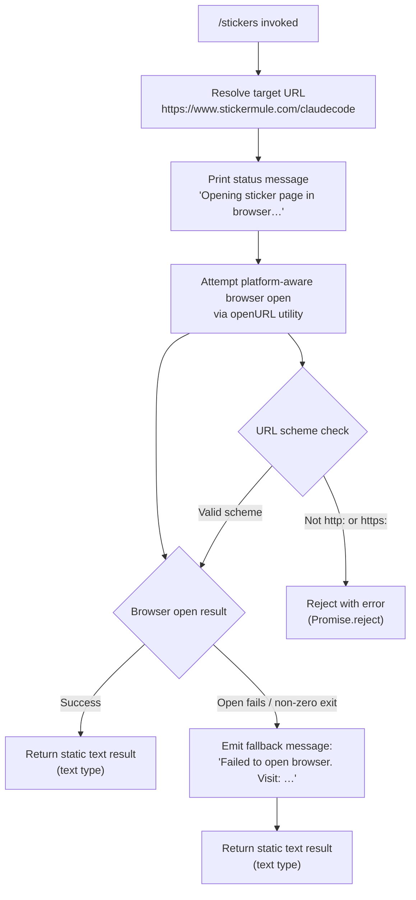

```markdown
---
type: feature-spec
feature: "stickers"
cc_version: "2.1.145"
updated: "2026-06-01"
tags: ["stickers", "commands", "slash-commands"]
source: "bundle-analysis"
bundle_verified: true
analysis_basis: "CC v2.1.145 bundle.js (AST extraction + Claude interpretation)"
author: "ryujaeuk <ryujaeuk@gmail.com>"
repository: "https://github.com/MyLittleLuckyDog/cc-gnothi"
license: "AGPL-3.0-only"
---

# `/stickers`

> Analysis basis: CC v2.1.145 bundle.js (AST extraction + Claude interpretation)
> Minimum version: v2.1.145

---

## Overview

The `/stickers` command opens the official Claude Code sticker ordering page (`https://www.stickermule.com/claudecode`) in the user's default system browser. It is a simple utility command with no agent interaction — it resolves a fixed URL, attempts a platform-aware browser launch, prints a status message to the console, and returns a static text result. If the browser cannot be opened, it emits a fallback message containing the URL for manual navigation.

---

## Registration

| Field | Value |
|---|---|
| type | `local` |
| name | `stickers` |
| description | `Order Claude Code stickers` |
| loc_byte | `11672563` |
| loc_byte_end | `11672723` |
| loc_line | `7210` |
| supportsNonInteractive | `false` |
| module_id | `yZq` |
| load_inline | `true` |
| arbor_handler.name | `gR7` |
| arbor_handler.fqn | `claude-2.1.145::gR7` |
| arbor_handler.kind | `AsyncFunction` |
| arbor_handler.resolution_path | `module_id` |
| arbor_handler.n_hits | `0` |

Analysis basis: CC v2.1.145 bundle.js:+11672563

---

## Input Branching

The command execution has three distinct outcome paths (success, browser-open failure with fallback message, and unexpected error), so a Mermaid flowchart is used.



Analysis basis: CC v2.1.145 bundle.js:+11672296, +6434319, +6434341, +11672366, +11672437, +11672353

---

## Behavioral Spec

### 1. Handler Entry Point

The Arbor-resolved handler `gR7` (AsyncFunction, resolved via `module_id` → `yZq`) is the command's sole entry point.

```
async function stickersHandler(context):
    targetURL = "https://www.stickermule.com/claudecode"
    call openURLInBrowser(targetURL)
    return { type: "text", content: "Opening sticker page in browser…" }
```

Analysis basis: CC v2.1.145 bundle.js:+11672296, +11672299, +11672353, +11672366

### 2. URL Scheme Validation (`q04` / `urlSchemeValidator`)

Before any system call is made, the URL-opener utility validates that the target URL begins with `http:` or `https:`. Any other scheme causes an immediate `Promise.reject`.

```
function validateURLScheme(url):
    if url does not start with "http:" and not "https:":
        return Promise.reject(new Error("invalid scheme"))
    // proceed
```

Analysis basis: CC v2.1.145 bundle.js:+6434269, +6434319, +6434341

### 3. Platform-Aware Browser Launch (`nq` / `openURLInBrowser`)

After scheme validation passes, the open-URL function selects a platform-specific shell command based on `process.platform`.

```
async function openURLInBrowser(url):
    validateURLScheme(url)          // throws on invalid scheme

    platform = process.platform

    if platform == "darwin":
        command = "open"
        args    = [url]
    else if platform == "win32":
        command = "rundll32"
        args    = ["url,OpenURL", url]
    else:                           // Linux / other POSIX
        command = "xdg-open"
        args    = [url]

    exitCode = await spawnChild(command, args)   // calls aj (child-spawn)

    if exitCode != 0:
        emit("Failed to open browser. Visit: https://www.stickermule.com/claudecode")
```

Analysis basis: CC v2.1.145 bundle.js:+6434556, +6434569, +6434594, +6434628, +6434644, +6434677, +6434728, +6434740, +6434802, +6434809, +11672437

### 4. Result Construction

Regardless of whether the browser opened successfully or the fallback message was emitted, the handler returns a static object of `type: "text"` containing the status string `"Opening sticker page in browser…"`.

```
function buildResult():
    return {
        type: "text",
        text: "Opening sticker page in browser…"
    }
```

Analysis basis: CC v2.1.145 bundle.js:+11672353, +11672366

### 5. Subprocess / Environment Utilities

The call graph reveals a chain of lower-level utilities invoked transitively:

- **`Y8` → `Y_` → `QXH`** (`browserOpenSubsystem`): orchestrates the full open-URL pipeline including child-process management, free-memory checks (`FZ8.freemem`), and dispose/cleanup hooks.
- **`Y_` → `D`** (`childProcessRunner`): the generic async child-process executor. It checks available system memory, enforces a 2000 ms poll interval (`2000`, bundle.js:+14655040), and recurses with a bounded retry strategy.
- **`b6` → `AC6` → `q_`** (`asyncStoreContext`): retrieves the current async-local-storage context to propagate environment variables or cancellation tokens into spawned child processes.
- **`NH`** (`errorLogger`): logs errors via `gc.logError` when child-process operations fail; pushes failure records into `GCH` (a shared error accumulator).
- **`I`** (`logLevelFilter`): checks whether `debug` logging is active before emitting low-level diagnostics (bundle.js:+201601).

Analysis basis: CC v2.1.145 bundle.js:+1039160, +1039271, +1039803, +961017, +961417, +965908, +40313, +201601

---

## State & Side Effects

| Item | Detail |
|---|---|
| Telemetry | `tengu_bg_spare_enable` (bundle.js:+14654747); `tengu_bg_spare_spawn` (bundle.js:+14655107) — both fired from the background-spare child-process subsystem, not directly from the stickers command itself |
| Hook registration | No hooks registered by this command |
| appState changes | None — command is read-only / side-effect-free with respect to app state |
| Browser side effect | Spawns a platform-specific process (`open` / `rundll32` / `xdg-open`) to open `https://www.stickermule.com/claudecode` |
| Stdout / UI | Prints `"Opening sticker page in browser…"` on success; prints `"Failed to open browser. Visit: https://www.stickermule.com/claudecode"` on failure |
| supportsNonInteractive | `false` — command must not be invoked in non-interactive (headless) mode |
| Memory check | The child-process runner (`D`) reads `os.freemem()` before spawning; behaviour under low-memory conditions is governed by general CC child-process policy, not stickers-specific logic |
| Poll interval | Child-process runner uses a 2000 ms internal interval (bundle.js:+14655040) |

---

## Version History

| Version | Change |
|---|---|
| v2.1.145 | Initial analysis |

---

## Common Mistakes

1. **Running in non-interactive mode**: `/stickers` sets `supportsNonInteractive: false`. Invoking it from a CI pipeline or `--no-interactive` session will be rejected by the command dispatcher before the handler is even called.
2. **Expecting agent output**: This command does not invoke Claude or produce AI-generated content. It returns a fixed text string and opens a browser — any expectation of model output is incorrect.
3. **Firewall / sandbox environments**: In environments where `open`, `xdg-open`, or `rundll32` are blocked, the command will emit the fallback message with the URL rather than silently failing. The return value is still `type: "text"`, so callers should not treat a non-error return as proof that the browser actually opened.
4. **Custom URL schemes**: The scheme validator (`urlSchemeValidator` / `q04`) hard-rejects anything that is not `http:` or `https:`. This is a lower-level guard; the stickers URL is always `https:` so this does not affect normal use, but custom wrappers that rewrite the URL must preserve the scheme.
5. **Memory-constrained hosts**: The transitive child-process runner checks `os.freemem()` before spawning. On heavily constrained hosts the browser-open subprocess may be deferred or skipped by the general CC child-process manager; this is not stickers-specific but can cause silent no-ops.

---

## Appendix — Identifier Mapping

> For bundle debugging only. Identifiers change across versions.

| Identifier | Role |
|---|---|
| `gR7` | Main async handler for `/stickers` (Arbor-resolved, AsyncFunction, module `yZq`) |
| `nq` | Open-URL dispatcher — validates scheme, selects platform command, spawns child |
| `q04` | URL scheme validator — rejects non-http(s) URLs with `Promise.reject` |
| `aj` | Child-process spawn helper called by the URL opener |
| `Y8` | Browser-open subsystem entry — wraps `Y_` with context setup |
| `Y_` | Core browser-open orchestrator — calls `QXH`, `D`, `YCK`, `_N`, `I`, `A8`, `NH` |
| `QXH` | Child-process pipeline builder — wires VDA, Qm8, dm8, lm8, RYA, S96, gm8, MDA, SYA, CYA, yYA, hYA, $YA, LDA, x96, qDA, KDA, mYA |
| `D` | Generic async child-process runner — polls at 2000 ms, checks freemem, emits telemetry |
| `YCK` | String-coercion utility used inside the orchestrator |
| `_N` | Internal helper called by core browser-open orchestrator |
| `I` | Log-level / debug-filter function |
| `A8` | Auxiliary helper called by core browser-open orchestrator |
| `NH` | Error logger — pushes to `GCH` accumulator, calls `gc.logError` |
| `b6` | Async-store context accessor entry point |
| `AC6` | Async-local-storage getter — calls `_C6.getStore()` and `Mc` |
| `q_` | Inner context resolver — calls `IV` |
```

Note: index built via Arbor fallback; some signals (telemetry, literals) may be missing — see arbor-fallback.js.