# `/team-onboarding`

> Analysis basis: CC v2.1.145 bundle.js (AST extraction + Claude interpretation)
> Minimum version: v2.1.145

---

## Overview

`/team-onboarding` is a `prompt`-type slash command that analyzes the invoking user's local Claude Code session transcripts (up to a configurable look-back window, defaulting to 365 days) and co-authors a personalized `ONBOARDING.md` guide that teammates can paste directly into Claude Code for an interactive ramp-up walkthrough. The command drives a structured two-turn conversation: it immediately produces a concrete draft guide (no up-front questions), then asks three targeted review questions before writing the final file.

---

## Registration

| Field | Value |
|---|---|
| `type` | `prompt` |
| `name` | `team-onboarding` |
| `description` | Help teammates ramp on Claude Code with a guide from your usage |
| `isHidden` | `false` |
| `handler_method` | `getPromptForCommand` |
| `handler_method_start` (byte) | 12012605 |
| `handler_method_end` (byte) | 12013261 |
| `loc_byte` | 12012267 |
| `loc_byte_end` | 12013262 |
| `loc_line` | 7894 |
| `prompt_body.length` | 4539 characters |
| `prompt_body.trace` | `identifier→$ (local→1 ext vars)` |
| `arbor_handler.name` | `getPromptForCommand` |
| `arbor_handler.kind` | `Method` |
| `arbor_handler.fqn` | `claude-2.1.145::getPromptForCommand` |
| `arbor_handler.resolution_path` | `direct` |
| `arbor_handler.n_hits` | 2 |
| `handler_method_start` | `12012605` |
| `handler_method_end` | `12013261` |

Analysis basis: CC v2.1.145 bundle.js:+12012267

---

## Input Branching

The handler exhibits more than three distinct execution paths (usage-data scan, MCP config read, git identity resolution, template substitution, and optional early-exit on zero sessions), so a Mermaid flowchart is used.

```mermaid
flowchart TD
    A(["/team-onboarding invoked"]) --> B["Emit telemetry: tengu_team_onboarding_invoked\n(bundle.js:+12012865)"]
    B --> C["Compute look-back window\nMath.min/max/floor → clamp days\n(bundle.js:+12012808–12012826)\nDefault ceiling: 365 days (bundle.js:+12012854)"]
    C --> D["Scan transcript directory via usageDataReader\n(ip7 / usageDataReader)\nReaddir → filter .jsonl → parse sessions\n(bundle.js:+12012989)"]
    D --> E{Sessions found?}
    E -- "~0 sessions" --> F["Mark work-type breakdown as TODO\nin prompt context"]
    E -- "sessions exist" --> G["Classify sessions into task types\nbuild_feature / debug_fix / improve_quality\nanalyze_data / plan_design / prototype / write_docs\nTop 3-5 with percentages"]
    F --> H["Read .mcp.json via mcpConfigReader\n(np7 / mcpConfigReader)\n(bundle.js:+12003773)"]
    G --> H
    H --> I{.mcp.json present?}
    I -- "no / ENOENT" --> J["MCP servers section: empty"]
    I -- "yes" --> K["Parse mcpServers entries\n(name + urlOrigin)\n(bundle.js:+12003390)"]
    K --> J
    J --> L["Resolve git user.name + remote origin\n(gitIdentityResolver / Y_)\n(bundle.js:+12003954–12004048)"]
    L --> M["Substitute template variables:\n{{WINDOW_DAYS}} → computed days\n{{USAGE_DATA}} → JSON usage blob\n{{GUIDE_TEMPLATE}} → guide template\n(bundle.js:+12013011–12013086)"]
    M --> N["Emit telemetry: tengu_flint_harbor_prompt\n(bundle.js:+12012642)"]
    N --> O["Dispatch prompt to agent\n(getPromptForCommand / Arbor direct)"]
    O --> P["Agent emits acknowledgment line immediately\n(first visible output)"]
    P --> Q["Agent writes draft ONBOARDING.md\nASCII bar charts, real numbers\n(bundle.js:+12013107 via Vz8)"]
    Q --> R["Agent posts Review section\n3 numbered questions"]
    R --> S{User replies?}
    S -- "provides answers" --> T["Update ONBOARDING.md with\nteam name, tips, starter task"]
    T --> U["Emit telemetry: tengu_team_onboarding_generated\n(bundle.js:+12013130)"]
    U --> V(["Close: 'Saved to ONBOARDING.md. Drop it…'"])
    S -- "sends edits" --> W["Apply edits to ONBOARDING.md"]
    W --> V
```



---

## Behavioral Spec

### 1. Handler Entry Point

The Arbor symbol graph resolves the handler directly as `getPromptForCommand` (FQN: `claude-2.1.145::getPromptForCommand`, `resolution_path: direct`, `n_hits: 2`). The synthetic call-graph entry `__handler_team-onboarding` is BFS bookkeeping only; `getPromptForCommand` is the true handler.

Analysis basis: CC v2.1.145 bundle.js:+12012605

### 2. Look-Back Window Computation

```
function computeLookbackDays(rawInput):
    # Clamps the user-supplied (or default) day count to a safe range
    raw = rawInput OR DEFAULT_DAYS
    floored = Math.floor(raw)
    clamped = Math.max(1, Math.min(floored, MAX_DAYS))   # MAX_DAYS = 365
    return clamped
```

Maximum look-back ceiling: **365 days** (bundle.js:+12012854).
Math operations confirmed at bundle.js:+12012808 (`Math.min`), :+12012817 (`Math.max`), :+12012826 (`Math.floor`).

### 3. Usage Data Reader (`usageDataReader` / `ip7`)

```
async function usageDataReader(transcriptDir, windowDays):
    cutoffMs = Date.now() - windowDays * 24 * 60 * 1000   # ms conversion
    files = await fs.readdir(transcriptDir)
    jsonlFiles = files.filter(f => extname(f) === ".jsonl")
    sessions = await Promise.all(
        jsonlFiles.map(async filePath =>
            stat = await fs.stat(join(transcriptDir, filePath))
            if not stat.isFile(): return null
            raw = await fs.readFile(filePath)
            lines = raw.split("\n").slice(0, MAX_LINES)   # MAX_LINES = 10
            return parseSessionDescriptors(lines, filePath)
        )
    )
    return sessions.filter(Boolean)
```

- Directory traversal reads the user's local projects transcript store.
- Filters for `.jsonl` extension (bundle.js:+12001223).
- Parses up to 10 lines per file (bundle.js:+12001619) to extract session descriptors.
- Time window constant derivation: `24 * 60 * 1000` ms (bundle.js:+12001108–12001117).
- MCP tool-call detection uses the string `"name":"mcp__` as a marker (bundle.js:+12001802) and `"content":[` (bundle.js:+12002152) for content presence.
- PR-number extraction uses regex `gp7`, `Qp7`, and `dp7` against session content (bundle.js:+12001943, :+12001999, :+12002174).
- Session descriptor limit: top **3** signals per session (bundle.js:+12002255).

Analysis basis: CC v2.1.145 bundle.js:+12012989, :+12001095–12002292

### 4. MCP Config Reader (`mcpConfigReader` / `np7`)

```
async function mcpConfigReader(workspaceRoot):
    configPath = join(workspaceRoot, ".mcp.json")     # literal: bundle.js:+12003334
    try:
        raw = await fs.readFile(configPath, "utf8")   # encoding: bundle.js:+12003347
        parsed = JSON.parse(raw)
        servers = parsed["mcpServers"] ?? {}          # key: bundle.js:+12003390
        return normalizeMcpServers(servers)
    catch ENOENT:
        return {}
```

- Reads `.mcp.json` from the workspace root (bundle.js:+12003334).
- Extracts the `mcpServers` map (bundle.js:+12003390); each entry's `name` and `urlOrigin` are used by the agent to infer purpose and access instructions.
- On `ENOENT` the MCP section of the guide is left empty (no error surfaced to user).

Analysis basis: CC v2.1.145 bundle.js:+12003773

### 5. Git Identity Resolver (`gitIdentityResolver` / `Y_`)

```
async function gitIdentityResolver():
    userName = await runGit(["config", "user.name"])    # bundle.js:+12003957–12003973
    remoteUrl = await runGit(["remote", "get-url", "origin"])  # bundle.js:+12004029–12004048
    repoName = basename(remoteUrl)                      # bundle.js:+12004145
    return { userName, remoteUrl, repoName }
```

- Used to populate `generatedBy` in the guide header (falls back gracefully if missing).
- `OW8.basename` extracts the repository name from the remote URL (bundle.js:+12004145).
- Internally delegates to the subprocess runner (`Y_` → `QXH`) which handles timeouts, retries, and process lifecycle management (bundle.js:+12003954).

Analysis basis: CC v2.1.145 bundle.js:+12003954

### 6. Template Variable Substitution

```
function buildPromptBody(windowDays, usageData, guideTemplate):
    body = PROMPT_TEMPLATE_BASE                          # 4539-char base
    body = body.replaceAll("{{WINDOW_DAYS}}", String(windowDays))   # bundle.js:+12012998, :+12013011
    body = body.replaceAll("{{USAGE_DATA}}", JSON.stringify(usageData))  # bundle.js:+12013086
    body = body.replaceAll("{{GUIDE_TEMPLATE}}", guideTemplate)     # bundle.js:+12013051
    return body
```

Three template placeholders are substituted at runtime (bundle.js:+12013011, :+12013051, :+12013086). The return type is `"text"` (bundle.js:+12013245).

Analysis basis: CC v2.1.145 bundle.js:+12012998–12013107

### 7. Prompt Instruction Summary (Agent Behavior)

The 4539-character prompt (`prompt_body.length: 4539`, `prompt_body.trace: identifier→$ (local→1 ext vars)`) instructs the agent to execute the following sequence. **No verbatim quotation** beyond short citation fragments is reproduced here per copyright policy.

**Step 1 — Immediate acknowledgment (no delay):**  
The very first visible output must be a single acknowledgment line referencing the look-back window duration. The prompt explicitly forbids any extended thinking, classification, or tool calls before this line is emitted. This is framed as a UX concern: the guide creator sees a blank screen until the line appears.

**Step 2 — Work-type classification:**  
The agent reads `sessionDescriptors` (title, `prNumbers`, first user message) and classifies each session into one of seven canonical task types:

| Internal key | Display label |
|---|---|
| `build_feature` | Build Feature |
| `debug_fix` | Debug Fix |
| `improve_quality` | Improve Quality |
| `analyze_data` | Analyze Data |
| `plan_design` | Plan Design |
| `prototype` | Prototype |
| `write_docs` | Write Docs |

Top 3–5 categories with rough percentages are selected. Review sessions map to the type of artifact being reviewed (code review → Improve Quality; doc review → Write Docs; design review → Plan Design). New categories are only invented when no existing type fits. If there are approximately zero sessions, the breakdown is left as a TODO placeholder.

**Step 3 — Gather remaining context:**  
Repositories: starts with `currentRepo`, scans workspace for sibling directories. MCP servers: infers purpose and access path from `name` + `urlOrigin`. Team Tips and Get Started sections are intentionally left as TODO placeholders to be filled after the Review exchange.

**Step 4 — Write `ONBOARDING.md`:**  
Uses the `{{GUIDE_TEMPLATE}}` skeleton with real numbers substituted (no placeholders left in the rendered output). ASCII bar charts use `█` (filled) and `░` (empty) at 20 characters wide. `generatedBy` is used for the author name; omitted if absent. An HTML comment instruction at the bottom of the template is preserved exactly.

**Step 5 — Render and close turn 1:**  
The guide is rendered in a fenced code block. A `---` horizontal rule followed by a `**Review**` heading visually separates the guide from three numbered follow-up questions:
1. Team name confirmation (or request if unknown).
2. Starter task for newcomers (ticket or doc link, optional).
3. Team tips not already in `CLAUDE.md`.

**Post-review turn:**  
After the user replies, the agent updates `ONBOARDING.md` with the supplied team name, tips, and starter task, then closes with a fixed non-paraphrased confirmation line referencing `ONBOARDING.md`. Any subsequent edits from the user are applied to the file.

Analysis basis: CC v2.1.145 bundle.js:+12012605–12013261

### 8. Guide Sharing / Harbor Integration (`Vz8`)

`Vz8` is reached from the handler and emits `tengu_flint_harbor_prompt` (bundle.js:+12012642) and `tengu_flint_harbor_share` (bundle.js:+9003035). This indicates the command participates in the Flint Harbor subsystem, which handles prompt sharing and collaboration state.

Analysis basis: CC v2.1.145 bundle.js:+12013107 (`Vz8` call), :+9003035 (`tengu_flint_harbor_share`)

---

## State & Side Effects

| Item | Detail |
|---|---|
| **Telemetry — invocation** | `tengu_team_onboarding_invoked` (bundle.js:+12012865) — fired immediately on handler entry |
| **Telemetry — prompt dispatch** | `tengu_flint_harbor_prompt` (bundle.js:+12012642) — fired when prompt is sent to agent |
| **Telemetry — guide generated** | `tengu_team_onboarding_generated` (bundle.js:+12013130) — fired after guide is produced |
| **Telemetry — harbor share** | `tengu_flint_harbor_share` (bundle.js:+9003035) — Flint Harbor sharing event |
| **Telemetry — config error** | `tengu_config_parse_error` (bundle.js:+3169876) — fired if config read fails |
| **Telemetry — feature flags** | `tengu_feature_ok` (bundle.js:+955923), `tengu_feature_bad` (bundle.js:+955981) |
| **Telemetry — background daemon** | `tengu_bg_dispatch_sigkill_escalate`, `tengu_bg_dispatch_low_mem`, `tengu_bg_spare_enable`, `tengu_bg_spare_claim`, `tengu_bg_spare_claim_fail`, `tengu_bg_spare_spawn`, `tengu_bg_low_mem_mb`, `tengu_daemon_control`, `tengu_bg_dispatch_low_mem` — background process management, not specific to this command |
| **Telemetry — Growthbook** | `growthbook_experiment` (bundle.js:+3140988) — A/B experiment event |
| **File writes** | Writes `ONBOARDING.md` in the current workspace directory on guide completion |
| **File reads** | Reads `~/.claude/projects/**/*.jsonl` transcripts; reads `.mcp.json` from workspace root |
| **Process spawns** | `git config user.name` and `git remote get-url origin` subprocess calls |
| **Hook registration** | `YxL` registers a file watcher (`jo6.watchFile`) on config path; unregisters with `jo6.unwatchFile` on teardown (bundle.js:+3165635, :+3165962) |
| **appState changes** | Feature flag state read via `OCH` / `VyK.has` (bundle.js:+938067); experiment state managed via `k$H`, `x1_`, `U56` sets (bundle.js:+3147007–3147030) |
| **Sound** | None detected in depth-2 traversal |

---

## Version History

| Version | Change |
|---|---|
| v2.1.145 | Initial analysis — command introduced; two-turn co-authoring flow with Flint Harbor integration |

---

## Common Mistakes

1. **Running in a directory with no transcripts.** If the local Claude Code projects directory contains no `.jsonl` files within the look-back window, the agent will leave the work-type breakdown as a TODO and generate a mostly-empty guide. Invoke from a machine where Claude Code has been actively used.

2. **Expecting an interactive Q&A before the guide.** The prompt explicitly instructs the agent to produce a full draft immediately without asking questions first. Users who expect the agent to ask about their team upfront will find a complete (if draft-quality) guide already written.

3. **Missing `.mcp.json`.** If no `.mcp.json` exists in the workspace root, the MCP Servers section of the guide will be empty. Users should ensure their MCP configuration is present before invoking the command if they want server setup instructions included.

4. **Assuming the 365-day ceiling is configurable at invocation.** The maximum look-back window is hard-clamped to 365 days by `Math.min/max/floor` in the handler (bundle.js:+12012808–12012854). Passing a larger value will be silently clamped.

5. **Editing `ONBOARDING.md` manually before the Review turn.** The agent writes the file after the Review exchange. Manual edits made to `ONBOARDING.md` between the draft render and the Review reply may be overwritten when the agent applies the Review answers.

6. **Forgetting to distribute the file.** The guide is saved to `ONBOARDING.md` in the current workspace. The command's closing line instructs the user to drop the file into team docs — this is a manual step; the command does not push or share the file automatically.

---

## Appendix — Identifier Mapping

> For bundle debugging only. Identifiers change across versions.

| Identifier | Role |
|---|---|
| `__handler_team-onboarding` | Synthetic BFS entry point for the command handler (not a real bundle symbol) |
| `Z6` | Session/conversation context builder; constructs prompt context objects |
| `F56` | Context field initializer (called from context builder) |
| `g56` | Context field setter (called from context builder) |
| `ls` | Prompt-context string formatter |
| `xH` | String coercion / encoding helper |
| `pF` | Permission/policy flag reader |
| `su` | Permission check orchestrator; calls `iCL`, `WO`, `T96` |
| `qo6` | Experiment / feature-flag deduplication gate; uses `x1_` and `k$H` |
| `b1_` | Growthbook experiment event emitter; fires `GrowthbookExperimentEvent` |
| `r0H` | Feature-flag result normalizer |
| `au` | Random-bytes token generator (32-byte hex, bundle.js:+3172783) |
| `RH` | JSON serializer wrapper (`JSON.stringify`) |
| `pbL` | Post-experiment payload builder |
| `U1_` | Feature-flag state transition handler |
| `Ej9` | Log-path resolver (calls `LpH`) |
| `g_` | App state accessor (calls `Gu`) |
| `Kv9` | Feature-flag value extractor |
| `OCH` | Feature-flag set membership check (`VyK.has`) |
| `h6` | Config file loader; dispatches to `R$H`, watches via `YxL` |
| `U6` | Config directory path resolver |
| `a1_` | Config change notifier |
| `R$H` | Core config reader; reads, parses, backs up config files |
| `q` | Filesystem module reference (sync I/O: `readFileSync`, `statSync`, `mkdirSync`, etc.) |
| `u6` | JSON parser wrapper (`JSON.parse`) |
| `hR` | Path prefix stripper (`startsWith` / `slice`) |
| `_` | Filesystem async module reference (`readdirStringSync`, `statSync`, `toUpperCase`) |
| `A8` | Error classifier / error-code checker |
| `Wv9` | Workspace sibling-directory scanner; walks parent dirs for repos |
| `I` | Message/event formatter; handles debug logging and content shaping |
| `NH` | Error logger; pushes to `GCH`, calls `gc.logError` |
| `d` | App-wide state store / global config accessor |
| `qq_` | Backup path constructor (`DY.join` + `l8`) |
| `w` | Background daemon process manager; handles spawn, SIGKILL escalation, memory checks |
| `YxL` | Config file watcher; sets up `watchFile` / `unwatchFile` lifecycle |
| `cl` | Config reload callback |
| `h9` | Signal/hook registration (`w6A.register`) |
| `ip7` | Usage data pipeline orchestrator; calls `usageDataScanner`, `mcpConfigReader`, `gitIdentityResolver` |
| `q_` | Async utility wrapper (calls `IV`) |
| `IV` | Promise/async primitive |
| `tG` | Project directory path builder |
| `UV` | Project-path join helper |
| `EO` | Path sanitizer / relative-path normalizer |
| `H` | General-purpose utility / string helper; also background retry timer |
| `GSK` | Absolute-value / hash helper (`Math.abs`, `PCH`) |
| `Vyq` | Usage data scanner; reads `.jsonl` transcripts, extracts session descriptors |
| `S9` | Error absorber (calls `A8`) |
| `K` | Collection mapper / filter helper |
| `L` | Async task queue item wrapper |
| `f` | Stream/file handle abstraction |
| `O` | File-stat result wrapper (`isFile`) |
| `k8` | Stat result accessor |
| `$` | Session line splitter; also top-level variable holding prompt body reference |
| `dvq` | Session descriptor builder; calls `Jl`, `Q1`, `KT6`, `RH` |
| `z` | Background session state machine; handles stopped/running states |
| `hH` | Background session "stopped" state handler |
| `CH` | Background session "running" state handler |
| `oN` | Background session initializer; pushes to `uF` queue |
| `kx` | Background session race/exit handler (`Promise.race`, `process.exit`) |
| `D` | Background daemon orchestrator; manages memory, spawns, retires sessions |
| `bT6` | Platform detector (`macos` literal, calls `c6`, `Z6`) |
| `vs_` | Background spare session spawner; uses `Bun.spawn`, handles PTY host |
| `np7` | MCP config reader; reads `.mcp.json`, parses `mcpServers` |
| `O8` | MCP entry normalizer |
| `lp7` | Guide template loader |
| `Y_` | Git identity resolver; runs `git config user.name` and `git remote get-url origin` |
| `QXH` | Subprocess runner / child-process manager (timeout, kill, pipe) |
| `VDA` | Process argument builder (win32 `.exe`/`cmd` shim) |
| `Qm8` | Stdout stream accumulator |
| `dm8` | Stderr stream accumulator |
| `lm8` | All-output stream combiner |
| `RYA` | Numeric timeout validator (`Number.isFinite`) |
| `S96` | Child-process error classifier |
| `gm8` | Reflect-based method applicator |
| `MDA` | Process exit-event listener |
| `SYA` | Timeout-race wrapper (`Promise.race`, `setTimeout`, `clearTimeout`) |
| `CYA` | Process kill helper |
| `yYA` | Process spawn setup (bound) |
| `hYA` | Process kill finalizer (bound) |
| `LDA` | Multi-process parallel launcher (`Promise.all`) |
| `x96` | Process environment builder |
| `qDA` | Stdio pipe configurator |
| `KDA` | Child-process registry adder |
| `mYA` | Stream reader binder |
| `YCK` | String-type coercion for process output |
| `_N` | Output post-processor |
| `lXH` | Git remote URL parser; extracts host and repo path |
| `pCK` | URL normalizer |
| `Z1` | URL component extractor (`indexOf` / `slice`) |
| `Vz8` | Flint Harbor integration; emits `tengu_flint_harbor_prompt` and `tengu_flint_harbor_share` |
| `Hq` | Harbor prompt dispatcher (calls `JOA`) |
| `JOA` | Harbor message formatter (calls `xH`) |