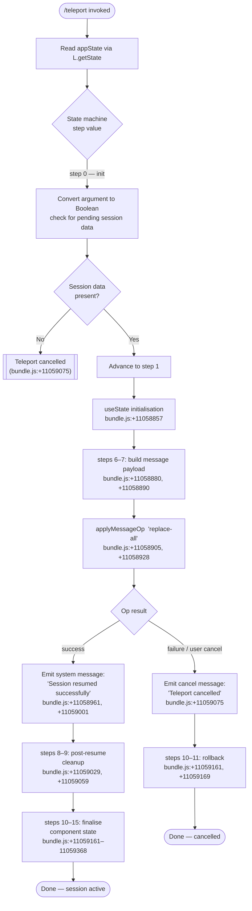

# `/teleport`

> Analysis basis: CC v2.1.133 bundle.js (AST extraction + Claude interpretation)
> Minimum version: v2.1.133

---

## Overview

The `/teleport` command (alias `/tp`) resumes a Claude Code session that was originally initiated or saved from claude.ai. It operates as a `local-jsx` command, meaning its handler renders a JSX component inline within the CLI, and uses a multi-step state machine to restore the conversation context — applying a bulk message replacement operation and emitting a "Session resumed successfully" confirmation, or cancelling gracefully if the user opts out.

---

## Registration

| Field | Value |
|---|---|
| `type` | `local-jsx` |
| `name` | `teleport` |
| `aliases` | `["tp"]` |
| `description` | `"Resume a Claude Code session from claude.ai"` |
| `isHidden` | `null` (not hidden) |
| `module_id` | `w5q` |
| `load_inline` | `true` |
| `loc_byte` | `11059582` |
| `loc_byte_end` | `11059846` |
| `loc_line` | `6674` |
| `arbor_handler.name` | `XO7` |
| `arbor_handler.fqn` | `claude-2.1.133::XO7` |
| `arbor_handler.kind` | `AsyncFunction` |
| `arbor_handler.resolution_path` | `module_id` |
| `arbor_handler.n_hits` | `1` |

Analysis basis: CC v2.1.133 bundle.js:+11059582

---

## Input Branching

The handler navigates at least **14 distinct numbered states** (integer literals `0`–`15` observed at bundle.js:+11058728 through +11059368) plus two named terminal paths ("Session resumed successfully" and "Teleport cancelled"), making a Mermaid flowchart the appropriate representation.



---

## Behavioral Spec

### Handler Entry — `teleportCommandHandler` (bundle symbol `XO7`)

The handler is resolved via `module_id → w5q → XO7` (Arbor `resolution_path: module_id`, `n_hits: 1`). It is an `AsyncFunction`.

Analysis basis: CC v2.1.133 bundle.js:+11059582

```
async function teleportCommandHandler(commandInput, context):

    // 1. Acquire application state
    appState = getAppState()                    // L.getState  +11058790
    sessionPayload = parseInput(commandInput)   // Boolean coercion +11058782, value 0 +11058769

    // 2. Validate that a teleport payload is present
    if NOT sessionPayload:
        emitMessage("Teleport cancelled", role="system")   // +11059075
        return CANCELLED

    // 3. Initialise local React state for the JSX component
    [stepIndex, setStepIndex] = useState(initialStep=1)    // +11058857, literal 1 +11058833

    // 4. Build message replacement payload  (step indices 6 and 7)
    messagesBatch = buildMessageBatch(sessionPayload, stepIndex=6, stepIndex=7)
                                                           // +11058880, +11058890

    // 5. Apply bulk message replacement
    result = applyMessageOp(
        operation = "replace-all",                         // +11058928
        messages  = messagesBatch,                         // +11058905
        source    = "localCommand"                         // +11059325
    )

    // 6a. Success path (steps 8, 9, 10–15)
    if result.ok:
        emitMessage("Session resumed successfully", role="system")
                                                           // +11058961, +11059001
        runPostResumeCleanup(steps=[8, 9])                 // +11059029, +11059059
        finaliseComponentState(steps=[10,11,12,13,14,15])  // +11059161–+11059368
        return SUCCESS

    // 6b. Failure / user cancellation path (steps 8, 9, 10, 11)
    else:
        emitMessage("Teleport cancelled", role="system")   // +11059075
        rollback(steps=[10, 11])                           // +11059161, +11059169
        return CANCELLED
```

### Context Guard — `requireAppStateContext` (bundle symbol `MAA`)

Called transitively via `Y5q → _K → MAA`. Reads the React context provided by `<AppStateProvider />` and throws a `ReferenceError` if the component is rendered outside that provider.

Analysis basis: CC v2.1.133 bundle.js:+3587674, +3587706, +3587721

```
function requireAppStateContext():
    ctx = React.useContext(AppStateContext)          // IfH.useContext +3587674
    if ctx is undefined:
        throw ReferenceError(
            "useAppState/useSetAppState cannot be " +
            "called outside of an <AppStateProvider />"
        )                                           // +3587706, +3587721
    return ctx
```

### Session Store — `getOrBuildSessionMap` (bundle symbol `L`)

Used by the handler to fetch current session state. Internally maps over known session keys and pads string identifiers to a fixed width.

Analysis basis: CC v2.1.133 bundle.js:+14179329, +14179342, +14179363

```
function getOrBuildSessionMap(store):
    entries = store.map(buildEntry)              // K.map  +14179329
    for entry in entries:
        label = entry.key.padEnd(40, " ")        // padEnd(40) +14181334; "  " pad char +14179363
    return entries
```

### File-Handle Lifecycle — `manageTempHandles` (bundle symbol `K`)

Manages temporary file descriptors created during the teleport operation. Ensures handles are cleaned up whether the operation succeeds or fails.

Analysis basis: CC v2.1.133 bundle.js:+14161309, +14161318, +14161332

```
function manageTempHandles(handleSet):
    handleSet.add(newHandle)                     // q.add  +14161309

    try:
        performTransfer(handleSet)               // f  +14161253 (via K→f)
    finally:
        closeAllHandles()                        // f.finally → _.close, q.close
                                                 // +14161318, +14167103, +14167113
        handleSet.delete(closedHandle)           // q.delete +14161332
```

### Handle Normalisation — `normaliseHandleKey` (bundle symbol `_`)

Normalises a file-handle key to lower-case and removes a temporary file link from the filesystem.

Analysis basis: CC v2.1.133 bundle.js:+14181260, +14137065

```
function normaliseHandleKey(key):
    normalised = key.toLowerCase()              // f.toLowerCase  +14181260
    fs.unlinkSync(tempPath(normalised))         // Ydq.unlinkSync +14137065
    return normalised
```

---

## State & Side Effects

| Item | Detail |
|---|---|
| Telemetry | None detected in depth-2 traversal (`telemetry: []`) |
| React state | `useState` initialised with step value `1` (bundle.js:+11058857, +11058833); step index advances through values `0–15` |
| Message store mutation | `applyMessageOp("replace-all", …)` performs a bulk replacement of the entire conversation message list (bundle.js:+11058905, +11058928) |
| System message emitted (success) | `"Session resumed successfully"` with `role: "system"` (bundle.js:+11058961, +11059001) |
| System message emitted (cancel) | `"Teleport cancelled"` with `role: "system"` (bundle.js:+11059075) |
| `source` tag on op | `"localCommand"` (bundle.js:+11059325) identifies the mutation as originating from a local CLI command |
| Filesystem side effect | `unlinkSync` on a temporary file path during handle cleanup (bundle.js:+14137065) |
| AppStateProvider guard | `ReferenceError` thrown if rendered outside `<AppStateProvider />` (bundle.js:+3587721) |
| Hook registration | <!-- TODO: not found in depth-2 traversal; needs --depth 4 --> |
| Sound | <!-- TODO: not found in depth-2 traversal; needs --depth 4 --> |

---

## Version History

| Version | Change |
|---|---|
| v2.1.133 | Initial analysis |

---

## Common Mistakes

1. **Invoking `/teleport` without a valid claude.ai session payload** — The command coerces its argument to `Boolean` at step `0`; if the result is falsy the operation immediately emits `"Teleport cancelled"` and exits without modifying the conversation state.
2. **Using `/teleport` outside an `<AppStateProvider />`** — The context guard (`MAA`) throws a `ReferenceError` synchronously; this would appear as an unhandled error in the CLI rendering layer.
3. **Assuming idempotency** — The `"replace-all"` message operation replaces the *entire* message list, not just appends. Running `/teleport` twice in the same session will overwrite the previously restored messages.
4. **Confusing the alias** — `/tp` is a registered alias and is fully equivalent to `/teleport`; there is no behavioural difference between the two invocation forms.
5. **Expecting telemetry confirmation** — No `tengu_*` telemetry events are emitted by this command; do not rely on server-side event logs to confirm a successful teleport in observability pipelines.

---

## Appendix — Identifier Mapping

> For bundle debugging only. Identifiers change across versions.

| Identifier | Role |
|---|---|
| `XO7` | `teleportCommandHandler` — top-level async handler for `/teleport`; Arbor-resolved entry point (fqn: `claude-2.1.133::XO7`) |
| `Y5q` | `teleportJsxComponent` — JSX component that owns local React state and orchestrates the step machine |
| `_K` | `appStateAccessor` — thin wrapper that calls the context guard and returns app state |
| `MAA` | `requireAppStateContext` — React context reader; throws `ReferenceError` outside `<AppStateProvider />` |
| `L` | `getOrBuildSessionMap` — builds/fetches the session key map, pads labels to width 40 |
| `K` | `manageTempHandles` — add/close/delete temporary file handles around the transfer operation |
| `q` | `tempHandleSet` — the mutable set of open temporary file handles |
| `f` | `performTransfer` — executes the actual data transfer; calls `_.close` and `q.close` in `finally` |
| `_` | `normaliseHandleKey` — lower-cases a handle key and unlinks the associated temp file |

---

Note: index built via Arbor fallback; some signals (telemetry, literals) may be missing — see arbor-fallback.js.