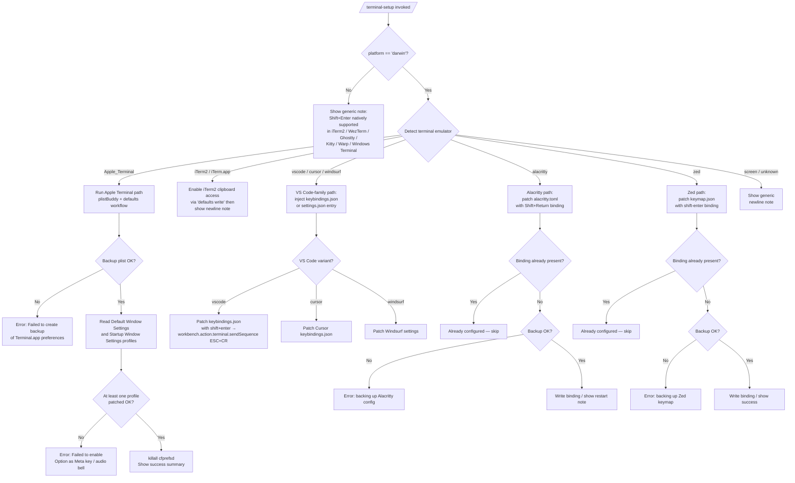

# `/terminal-setup`

> Analysis basis: CC v2.1.145 bundle.js (AST extraction + Claude interpretation)
> Minimum version: v2.1.145

---

## Overview

`/terminal-setup` installs a Shift+Enter key binding that sends a newline sequence in the user's terminal, enabling multi-line input without submitting. It detects the active terminal emulator (Apple Terminal, iTerm2, VS Code, Cursor, Windsurf, Alacritty, Zed, and others) and applies the appropriate configuration mutation — plist edits, JSON keybinding injection, or TOML patching — for the detected environment. The command is platform-aware and restricts most configuration paths to macOS.

---

## Registration

| Field | Value |
|---|---|
| type | `local-jsx` |
| name | `terminal-setup` |
| description | Install Shift+Enter key binding for newlines |
| loc_byte | 11417510 |
| loc_byte_end | 11418142 |
| loc_line | 6970 |
| module_id | `jU9` |
| load_inline | `true` |
| arbor_handler.name | `SoL` |
| arbor_handler.fqn | `claude-2.1.145::SoL` |
| arbor_handler.kind | `AsyncFunction` |
| arbor_handler.resolution_path | `module_id` |
| arbor_handler.n_hits | 1 |

Analysis basis: CC v2.1.145 bundle.js:+11417510

---

## Input Branching

The handler detects the platform and terminal emulator across 6+ distinct paths; a Mermaid flowchart is used.



---

## Behavioral Spec

### Top-level Handler (`SoL`)

```
async function terminalSetupHandler(context):
    platform = os.platform()           // ht.platform  bundle.js:+3912970

    if platform != "darwin":
        showNote("iTerm2, WezTerm, Ghostty, Kitty, Warp, and Windows Terminal "
                 "support Shift+Enter natively.")
        return

    terminalIdent = detectTerminal()   // wU9          bundle.js:+3913166
    setupResult   = Bt6(terminalIdent) // Bt6          bundle.js:+3913297

    if terminalIdent includes "iTerm":
        // additional clipboard-access step via wU9
        pass

    renderStatus(setupResult)          // gt6          bundle.js:+3914440
```

Analysis basis: CC v2.1.145 bundle.js:+3912970

---

### Terminal Detection (`wU9`)

```
function detectTerminal():
    // Reads TERM_PROGRAM, LC_TERMINAL, or process environment
    // Checks for known identifiers (case-insensitive trim)
    // Returns one of:
    //   "Apple_Terminal", "com.googlecode.iterm2", "iTerm.app",
    //   "screen", "vscode", "cursor", "windsurf", "alacritty", "zed"
    // Falls back to "your current terminal" for unknowns
    raw = readEnvOrDefault()           // Y8  bundle.js:+3912005
    trimmed = raw.trim()               // A.trim  bundle.js:+3912086
    return classifyTerminal(trimmed)   // jA  bundle.js:+3912110
```

Analysis basis: CC v2.1.145 bundle.js:+3911962

---

### Apple Terminal Configuration (`CoL`)

The most complex path. Uses `PlistBuddy` and `defaults` to mutate Terminal.app preferences.

```
async function configureAppleTerminal():
    // 1. Read plist path:
    //    ~/Library/Preferences/com.apple.Terminal.plist
    plistPath = joinPath(homedir(),
                         "Library", "Preferences",
                         "com.apple.Terminal.plist")
    //    bundle.js:+3907181

    // 2. Export plist to a temp file via:
    //    defaults export com.apple.Terminal <tmpfile>
    exportOk = runCommand("defaults", "export",
                           "com.apple.Terminal", tmpfile)
    // If backup fails → throw "Failed to create backup of
    //   Terminal.app preferences, bailing out"  bundle.js:+3919241

    // 3. Read "Default Window Settings" key   bundle.js:+3919379
    defaultProfile = plistBuddyRead(plistPath,
                                    "Default Window Settings")
    if not defaultProfile:
        throw "Failed to read default Terminal.app profile"
    //    bundle.js:+3919439

    // 4. Read "Startup Window Settings" key   bundle.js:+3919556
    startupProfile = plistBuddyRead(plistPath,
                                    "Startup Window Settings")
    if not startupProfile:
        throw "Failed to read startup Terminal.app profile"
    //    bundle.js:+3919616

    // 5. For each profile: enable Option-as-Meta, disable audio bell
    //    Uses /usr/libexec/PlistBuddy -c   bundle.js:+3918468
    results = []
    for profile in [defaultProfile, startupProfile]:
        ok = applyProfilePatch(plistPath, profile)  // OU9 / zU9
        results.push(ok)

    if all(results) == false:
        throw "Failed to enable Option as Meta key or disable "
              "audio bell for any Terminal.app profile"
        //    bundle.js:+3919826

    // 6. Flush prefs daemon
    runCommand("killall", "cfprefsd")  // bundle.js:+3919925 / +3919936

    // 7. Emit success items
    emitItem("- Enabled \"Use Option as Meta key\"")  // bundle.js:+3920045
    emitItem("- Switched to visual bell")            // bundle.js:+3920107
    emitItem("Shift+Return will now enter a newline.")// bundle.js:+3920152
    emitItem("Option+Enter will now enter a newline.")// bundle.js:+3920201
    emitItem("You must restart Terminal.app for changes to take effect.")
    //    bundle.js:+3920286
```

Analysis basis: CC v2.1.145 bundle.js:+3919195

---

### PlistBuddy Sub-command Runner (`LU9`)

```
async function runPlistBuddyCommand(plistPath, command):
    // Uses /usr/libexec/PlistBuddy -c <command> <plistPath>
    // bundle.js:+3918468
    args = ["/usr/libexec/PlistBuddy", "-c", command, plistPath]
    result = await spawnAndCapture(args)  // Y8  bundle.js:+3907301
    return result.stdout.trim()
```

Analysis basis: CC v2.1.145 bundle.js:+3919223

---

### Profile Patcher — Default Profile (`OU9`)

```
async function patchDefaultProfile(plistPath, profileName):
    // Applies PlistBuddy commands to set:
    //   UseOptionAsMetaKey = true
    //   Bell = false (visual bell)
    // Uses /usr/libexec/PlistBuddy -c   bundle.js:+3918465
    return runPlistBuddyPatch(plistPath, profileName)
```

Analysis basis: CC v2.1.145 bundle.js:+3919696

---

### Profile Patcher — Startup Profile (`zU9`)

```
async function patchStartupProfile(plistPath, profileName):
    // Mirrors patchDefaultProfile for the "Startup Window Settings" profile
    // bundle.js:+3919711
    return runPlistBuddyPatch(plistPath, profileName)
```

Analysis basis: CC v2.1.145 bundle.js:+3919711

---

### Backup and Restore Helper (`Ut6`)

```
async function backupAndRestore(plistPath, operation):
    // operation: "no_backup" | "import" | "failed" | "restored"
    //   bundle.js:+3907588, +3907740, +3907797, +3907874
    if operation == "no_backup":
        return  // nothing to restore

    backupPath = derivedBackupPath(plistPath)  // koL  bundle.js:+3907562
    if operation == "import":
        stat = fs.stat(backupPath)             // j5_.stat  bundle.js:+3907651
        runCommand("defaults", "import",       // bundle.js:+3907740
                   "com.apple.Terminal", backupPath)
    elif operation == "failed":
        markFailed()
    elif operation == "restored":
        markRestored()
```

Analysis basis: CC v2.1.145 bundle.js:+3907562

---

### VS Code Family Configuration (`G5_`)

Handles `vscode`, `cursor`, and `windsurf` terminals.

```
async function configureVSCodeFamily(terminalKind):
    // Warn if running in remote server context
    if isRemoteServer(terminalKind):     // T5_  bundle.js:+3916461
        //  checks .vscode-server / .cursor-server / .windsurf-server
        //  bundle.js:+3910622 / +3910652 / +3910682
        emitWarning("VSCode")            // bundle.js:+3916446, +3916479

    keybindingsPath = resolveKeybindingsPath(terminalKind)
    //   N5_: path resolution per OS / variant  bundle.js:+3917113
    //   win32 → AppData/Roaming/Code/User      bundle.js:+3915069
    //   darwin → Application Support/Code/User bundle.js:+3915158
    //   linux  → .config/Code/User             bundle.js:+3915198
    //   filename: "keybindings.json"            bundle.js:+3917132

    fs.mkdir(keybindingsPath.dir, {recursive: true})  // c0.mkdir  +3917162
    existing = fs.readFile(keybindingsPath.full,
                           "utf-8") ?? "[]"           // +3917222 / +3917195

    parsed = parseJSON(existing)                      // rC6  +3917263
    // Check if shift+enter binding already present   // L.find  +3917689

    if bindingExists(parsed, "shift+enter"):          // bundle.js:+3917581
        return alreadyConfigured()

    backup = randomBackupCopy(keybindingsPath.full)   // CM6.randomBytes  +3917313
    fs.copyFile(src, backup)                          // c0.copyFile  +3917376

    // Build new binding entry:
    //   key:     "shift+enter"                       bundle.js:+3917581
    //   command: "workbench.action.terminal.sendSequence"  bundle.js:+3917603
    //   args:    { text: "\x1b\r" }                  bundle.js:+3917655
    //   when:    "terminalFocus"                     bundle.js:+3917670
    newEntry = buildBinding("shift+enter",
                             "workbench.action.terminal.sendSequence",
                             {text: ESC_CR},
                             "terminalFocus")

    patched = insertBinding(parsed, newEntry)         // OwA  +3918059
    fs.writeFile(keybindingsPath.full,
                 JSON.stringify(patched))             // c0.writeFile  +3918081
    emitSuccess()
```

Analysis basis: CC v2.1.145 bundle.js:+3916461

---

### VS Code Settings-JSON Path (`W5_`)

A parallel variant that patches `settings.json` instead of `keybindings.json`.

```
async function configureVSCodeSettings(terminalKind):
    settingsPath = resolveSettingsPath(terminalKind)
    //   filename: "settings.json"   bundle.js:+3915370
    existing = fs.readFile(settingsPath, "utf-8") ?? "{}"  // bundle.js:+3915397
    parsed   = parseJSON(existing)                  // rC6  +3915491
    // check for existing binding → Array.isArray   bundle.js:+3915532
    // backup → CM6.randomBytes                     bundle.js:+3915897
    // copy → c0.copyFile                           bundle.js:+3915948
    // patch → $wA                                  bundle.js:+3915773
    // write → c0.writeFile                         bundle.js:+3916084
```

Analysis basis: CC v2.1.145 bundle.js:+3915325

---

### Alacritty Configuration (`boL`)

```
async function configureAlacritty():
    candidates = buildAlacrittyConfigPaths()
    //   includes "alacritty.toml"  bundle.js:+3920930
    //   checks homedir() + platform  bundle.js:+3920969 / +3921026
    configPath = candidates.find(existsOnDisk)

    if not configPath:
        throw "No valid config path found for Alacritty"
        //    bundle.js:+3921291

    content = fs.readFile(configPath, "utf-8")  // c0.readFile  +3921178

    // Check if already configured:
    //   looks for 'mods = "Shift"' and 'key = "Return"'
    //   bundle.js:+3921359 / +3921389
    if alreadyHasBinding(content):
        emitInfo("Alacritty Shift+Enter key binding already configured")
        //    bundle.js:+3921432
        return

    backup = randomBackupCopy(configPath)       // CM6.randomBytes  +3921531
    ok = fs.copyFile(configPath, backup)        // c0.copyFile  +3921594
    if not ok:
        throw "Error backing up existing Alacritty config. Bailing out."
        //    bundle.js:+3921642

    fs.mkdir(configPath.dir, {recursive: true}) // c0.mkdir  +3921790
    newContent = appendAlacrittyBinding(content)
    fs.writeFile(configPath, newContent)        // c0.writeFile  +3921960

    emitSuccess("Installed Alacritty Shift+Enter key binding")
    //    bundle.js:+3922016
    emitNote("You may need to restart Alacritty for changes to take effect")
    //    bundle.js:+3922086
```

Analysis basis: CC v2.1.145 bundle.js:+3920901

---

### Zed Configuration (`xoL`)

```
async function configureZed():
    keymapPath = joinPath(homedir(), ..., "keymap.json")
    //   filename: "keymap.json"  bundle.js:+3922445
    fs.mkdir(keymapPath.dir, {recursive: true})  // c0.mkdir  +3922470
    content = fs.readFile(keymapPath, "utf-8")   // c0.readFile  +3922525
    parsed  = parseJSON(content)                 // S9  +3922577

    // Check for existing "shift-enter" binding   bundle.js:+3922611
    if parsed includes {key: "shift-enter"}:
        emitInfo("Zed Shift+Enter key binding already configured")
        //    bundle.js:+3922651
        return

    backup = randomBackupCopy(keymapPath)         // CM6.randomBytes  +3922744
    ok = fs.copyFile(keymapPath, backup)          // c0.copyFile  +3922807
    if not ok:
        throw "Error backing up existing Zed keymap. Bailing out."
        //    bundle.js:+3922855

    // Build Zed keybinding entry:
    //   context: "Terminal"              bundle.js:+3923064
    //   key:     "shift-enter"           bundle.js:+3922611
    //   command: "terminal::SendText"    bundle.js:+3923100
    newEntry = buildZedBinding("Terminal", "shift-enter", "terminal::SendText")
    patched  = insertBinding(parsed, newEntry)    // L.push  +3923048
    fs.writeFile(keymapPath,
                 JSON.stringify(patched))         // c0.writeFile  +3923140

    emitSuccess("Installed Zed Shift+Enter key binding")  // bundle.js:+3923211
```

Analysis basis: CC v2.1.145 bundle.js:+3922395

---

### iTerm2 Clipboard Access (`wU9` secondary path)

```
async function enableITerm2ClipboardAccess():
    domain  = "com.googlecode.iterm2"           // bundle.js:+3912027
    key     = "AllowClipboardAccess"            // bundle.js:+3912051

    current = runCommand("defaults", "read", domain, key)
    if current == "1":
        emitInfo("iTerm2 clipboard access already enabled")
        //    bundle.js:+3912126
        return

    ok = runCommand("defaults", "write",        // bundle.js:+3912214
                    domain, key, "-bool", "YES")// bundle.js:+3912269
    if not ok:
        emitWarning("Couldn't update iTerm2 clipboard setting.")
        //    bundle.js:+3912320
        return

    emitSuccess(
        "Enabled \"Applications in terminal may access clipboard\" in iTerm2")
    //    bundle.js:+3912411
    emitNote(
        "Restart iTerm2 for this to take effect. "
        "Undo: defaults write com.googlecode.iterm2 "
        "AllowClipboardAccess -bool false")
    //    bundle.js:+3912494
```

Analysis basis: CC v2.1.145 bundle.js:+3912005

---

### Remote Server Detection (`T5_`)

```
function isRemoteServer(terminalKind):
    // Checks if any of the following directories exist in HOME:
    //   ".vscode-server"   bundle.js:+3910622
    //   ".cursor-server"   bundle.js:+3910652
    //   ".windsurf-server" bundle.js:+3910682
    // Returns true if running inside a remote development session
    return (
        directoryExists(join(homedir(), ".vscode-server"))  ||
        directoryExists(join(homedir(), ".cursor-server"))  ||
        directoryExists(join(homedir(), ".windsurf-server"))
    )
```

Analysis basis: CC v2.1.145 bundle.js:+3910611

---

### Dispatch Table (`gt6`)

```
async function dispatchTerminalSetup(terminalIdent):
    // Routes to the appropriate configurator based on detected terminal
    switch terminalIdent:
        case "Apple_Terminal":   return configureAppleTerminal()    // CoL
        case "vscode":           return configureVSCodeFamily(...)  // G5_
        case "cursor":           return configureVSCodeFamily(...)  // W5_
        case "windsurf":         return configureVSCodeFamily(...)
        case "alacritty":        return configureAlacritty()        // boL
        case "zed":              return configureZed()              // xoL
        default:                 return showGenericNote()
    // bundle.js:+3911293
```

Analysis basis: CC v2.1.145 bundle.js:+3911293

---

## State & Side Effects

| Item | Detail |
|---|---|
| Telemetry | `tengu_config_auth_loss_prevented` (bundle.js:+3164632) |
| Telemetry | `tengu_bg_spare_enable` (bundle.js:+14654747) |
| Telemetry | `tengu_bg_low_mem_mb` (bundle.js:+12029322) |
| Telemetry | `tengu_bg_spare_spawn` (bundle.js:+14655107) |
| Telemetry | `tengu_config_lock_contention` (bundle.js:+3167295) |
| Telemetry | `tengu_config_stale_write` (bundle.js:+3167431) |
| Telemetry | `tengu_config_parse_error` (bundle.js:+3169876) |
| Telemetry | `tengu_feature_ok` (bundle.js:+955923) |
| File mutations | `~/Library/Preferences/com.apple.Terminal.plist` (Apple Terminal path) |
| File mutations | `keybindings.json` / `settings.json` in VS Code user directory (VS Code family) |
| File mutations | `alacritty.toml` in platform config directory (Alacritty) |
| File mutations | `~/.config/zed/keymap.json` or equivalent (Zed) |
| Backup creation | Each terminal path creates a random-bytes-named backup before mutating (`CM6.randomBytes` / `c0.copyFile`) |
| Process execution | `defaults export/read/write` (macOS system tool) |
| Process execution | `/usr/libexec/PlistBuddy -c` (Apple Terminal only) |
| Process execution | `killall cfprefsd` after Apple Terminal plist mutation (bundle.js:+3919925) |
| appState changes | None identified at depth-2 traversal |
| Sound | None identified |
| Platform guard | Entire configuration flow is gated on `platform == "darwin"`; non-macOS systems receive an informational note only (bundle.js:+3912970) |

---

## Version History

| Version | Change |
|---|---|
| v2.1.145 | Initial analysis |

---

## Common Mistakes

1. **Running on a non-macOS host**: The command silently shows a note about terminals with native Shift+Enter support instead of modifying any files. No error is raised; the user must interpret the note as "no action taken."
2. **Running inside a remote VS Code / Cursor / Windsurf session**: The command emits a warning (not an error) and still attempts the configuration, but the keybindings file it writes is on the remote server, not the local machine where the key event originates.
3. **Not restarting the terminal after setup**: Apple Terminal requires a full restart; the command appends an explicit reminder (bundle.js:+3920286). Alacritty may also require a restart (bundle.js:+3922086). Changes are silently ineffective until then.
4. **Expecting idempotence without a restart**: For Apple Terminal, `killall cfprefsd` is executed to flush the preferences daemon, but the running terminal process still holds the old configuration. Re-running the command after a partial failure may find the plist in an inconsistent state.
5. **Assuming all terminals are supported**: Only `Apple_Terminal`, `iTerm2`, `vscode`, `cursor`, `windsurf`, `alacritty`, and `zed` receive active configuration. All others (including `screen`, WezTerm, Ghostty, Kitty, Warp, and Windows Terminal) are told they already support Shift+Enter natively and receive no file modifications.

---

## Appendix — Identifier Mapping

> For bundle debugging only. Identifiers change across versions.

| Identifier | Role |
|---|---|
| `SoL` | Top-level async handler for `/terminal-setup` |
| `wU9` | Terminal detection + iTerm2 clipboard-access helper |
| `gt6` | Dispatch table: routes detected terminal to configurator |
| `CoL` | Apple Terminal configurator (plist + PlistBuddy) |
| `LU9` | PlistBuddy sub-command runner |
| `bBH` | Plist path builder (`~/Library/Preferences/com.apple.Terminal.plist`) |
| `OU9` | Default-profile patcher (PlistBuddy) |
| `zU9` | Startup-profile patcher (PlistBuddy) |
| `CBH` | Shared plist-write helper |
| `Ut6` | Backup/restore controller for Apple Terminal plist |
| `koL` | Backup path deriver for plist |
| `G5_` | VS Code family configurator (keybindings.json) |
| `W5_` | VS Code family configurator (settings.json variant) |
| `T5_` | Remote server detection (`.vscode-server` etc.) |
| `N5_` | VS Code user-config directory resolver (per OS) |
| `boL` | Alacritty configurator |
| `xoL` | Zed configurator |
| `RBH` | Config save/backup orchestrator (general) |
| `H8` | Global config write helper |
| `hO` | Project config write helper |
| `Aq_` | Config-with-lock writer |
| `R$H` | Config file reader |
| `_q_` | Project config writer |
| `NH` | Shell command executor (captures stdout/stderr) |
| `Y8` | Process spawn helper |
| `Y_` | Low-level spawn implementation |
| `b6` | Process output stream reader |
| `NoL` | Shell command fire-and-forget helper |
| `Hq` | Traffic-priority queue helper |
| `mhK` | Request queue shift/push manager |
| `xH` | String coercion utility |
| `x_` | Error-to-string converter |
| `jA` | ANSI color string renderer |
| `l$H` | ANSI color code mapper |
| `iF` | Fallback inline formatter |
| `rC6` | JSON parse with error recovery |
| `hR` | JSON comment stripper |
| `S9` | Safe JSON parse wrapper |
| `IC` | Hyperlink renderer |
| `nP` | Hyperlink eligibility checker |
| `OwA` | JSON keybinding patcher (VS Code keybindings.json) |
| `$wA` | JSON keybinding patcher (VS Code settings.json) |
| `yp8` | JSON AST insert helper |
| `HwA` | JSON AST node inserter |
| `hp8` | JSON AST remove/modify helper |
| `nC6` | JSON AST substring extractor |
| `D` | Telemetry event emitter |
| `Z6` | Telemetry event dispatcher |
| `h6` | Telemetry batch flusher |
| `dvq` | Telemetry dispose/flush |
| `bT6` | Background-spare-process telemetry |
| `vs_` | Background PTY daemon spawner |
| `EMq` | PTY socket path builder |
| `ZMq` | PTY lock path builder |
| `Gd` | PTY spare path builder |
| `ek` | Spawn environment builder |
| `g75` | Spawn argument assembler |
| `l75` | PTY spawn helper |
| `U1` | Subprocess stdio handler |
| `E3` | Config telemetry event constructor |
| `HU9` | Config path resolver |
| `w5_` | Config directory path builder |
| `GC6` | Config path joiner |
| `RBH` | Onboarding-complete config writer |
| `hH` | Sync config writer |
| `I` | API request sender |
| `R$K` | Streaming API request handler |
| `y$K` | Request retry controller |
| `RH` | JSON serializer (request body) |
| `B4` | Request header builder |
| `RSH` | Auth token resolver |
| `Bt6` | Terminal-kind-to-display-name mapper |
| `I5_` | VS Code settings reader |
| `RoL` | VS Code config path resolver |
| `v5_` | Telemetry hit recorder (variant) |
| `Z5_` | Telemetry hit recorder (variant) |
| `V5_` | Telemetry hit recorder (variant) |
| `E5_` | Telemetry hit recorder (variant) |
| `BpH` | Timestamp-tagged telemetry constructor |
| `UpH` | Request metadata attacher |
| `n56` | Error logger |
| `qq_` | Backup directory entry builder |
| `y96` | Atomic file writer |
| `B69` | Config object merger |
| `DN` | Config diff logger |
| `wU9` | iTerm2 clipboard detection + enable |
| `u6` | JSON.parse wrapper |
| `Wv9` | Config schema validator |
| `_` | Identity / passthrough utility |
| `d` | Debug logger |
| `A8` | Process exit handler |