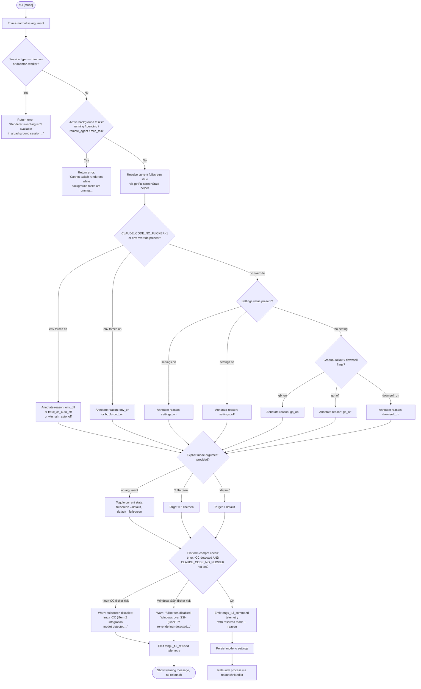

# `/tui`

> Analysis basis: CC v2.1.145 bundle.js (AST extraction + Claude interpretation)
> Minimum version: v2.1.145

---

## Overview

The `/tui` command allows the user to switch the terminal UI renderer between `default` (scrolling) and `fullscreen` (alternate-screen) modes at runtime. It validates the requested mode against environmental constraints (tmux control-mode, Windows-over-SSH), checks for active background tasks, then relaunches the Claude Code process with the new renderer if all guards pass.

---

## Registration

| Field | Value |
|---|---|
| type | `local-jsx` |
| name | `tui` |
| description | `Set the terminal UI renderer (default \| fullscreen)` |
| argumentHint | `[default\|fullscreen]` |
| module_id | `A0q` |
| load_inline | `true` |
| loc_byte | `11441206` |
| loc_byte_end | `11441388` |
| loc_line | `6973` |
| arbor_handler.name | `Ry7` |
| arbor_handler.fqn | `claude-2.1.145::Ry7` |
| arbor_handler.kind | `AsyncFunction` |
| arbor_handler.resolution_path | `module_id` |
| arbor_handler.n_hits | `0` |

Analysis basis: CC v2.1.145 bundle.js:+11441206

---

## Input Branching

The handler has 5+ distinct decision paths (background-session guard, background-task guard, env-variable overrides, platform compatibility checks, mode validity), so a Mermaid flowchart is used.



Analysis basis: CC v2.1.145 bundle.js:+11439181 through +11440933

---

## Behavioral Spec

### 1 — Argument Normalisation

```
async function tuiCommandHandler(rawArg):
    trimmed = rawArg.trim()                        // +11439181
    lower   = trimmed.toLowerCase()                // implied via getFullscreenState path
    // accepted tokens: "fullscreen", "default", ""
    return lower
```

Analysis basis: CC v2.1.145 bundle.js:+11439181

---

### 2 — Background-Session Guard

```
function assertForegroundSession(sessionType):
    // sessionType comes from getSessionKind helper (T1 → ZMH)
    if sessionType in ["daemon", "daemon-worker"]:   // +2173485, +2173499
        return Error(
            "Renderer switching isn't available in a background session" +
            " — press ← to detach and run /tui from a foreground session."
        )                                             // +11439484
    return OK
```

Analysis basis: CC v2.1.145 bundle.js:+11439470, +11439484

---

### 3 — Background-Task Guard

```
function assertNoActiveTasks(taskList):
    activeStates = ["running", "pending", "remote_agent", "mcp_task"]
                                                      // +11439848, +11439870, +11439891, +11439916
    for task in Object.values(taskList):              // +11439809
        if task.status in activeStates:
            return Error(
                "Cannot switch renderers while background tasks are running" +
                " — wait for them to finish (or stop them via /tasks), then run /tui again."
            )                                         // +11439978
    return OK
```

Telemetry fired when the guard fires: `tengu_tui_refused` (CC v2.1.145 bundle.js:+11439937)

Analysis basis: CC v2.1.145 bundle.js:+11439809–11439978

---

### 4 — Fullscreen-State Resolution (`getFullscreenState`)

`getFullscreenState` (obfuscated: `F$H`) calls several sub-helpers to determine the *effective* fullscreen flag and its reason string. The reason is one of the following string tokens:

| Reason token | Meaning |
|---|---|
| `bg_forced_on` | Background flag forces fullscreen on |
| `env_off` | `CLAUDE_CODE_DISABLE_ALTERNATE_SCREEN` env var set |
| `env_on` | `CLAUDE_CODE_FORCE_FULLSCREEN_UPSELL` env var set |
| `tmux_cc_auto_off` | tmux control-mode (`-CC`) detected automatically |
| `win_ssh_auto_off` | Windows-over-SSH (ConPTY) detected automatically |
| `settings_on` | User settings explicitly enable fullscreen |
| `settings_off` | User settings explicitly disable fullscreen |
| `downsell_on` | Gradual-rollout downsell flag active |
| `gb_on` / `gb_off` | Gradual-rollout gate active |

```
function getFullscreenState(env, settings, platformInfo):
    // Priority order (highest first):
    if env.CLAUDE_CODE_NO_FLICKER == "1":
        return { enabled: false, reason: "env_off" }    // +3339017
    if env.CLAUDE_CODE_FORCE_FULLSCREEN_UPSELL set:
        return { enabled: true,  reason: "env_on" }     // +3339075
    if platformInfo.isTmuxControlMode:
        return { enabled: false, reason: "tmux_cc_auto_off" }  // +3339099
    if platformInfo.isWindowsOverSSH:
        return { enabled: false, reason: "win_ssh_auto_off" }  // +3339133
    if settings.fullscreen == true:
        return { enabled: true,  reason: "settings_on" }       // +3339192
    if settings.fullscreen == false:
        return { enabled: false, reason: "settings_off" }      // +3339226
    if gradualRollout.downsell:
        return { enabled: false, reason: "downsell_on" }       // +3339299
    if gradualRollout.gate == "on":
        return { enabled: true,  reason: "gb_on" }             // +3339364
    return { enabled: false, reason: "gb_off" }                // +3339372
```

Analysis basis: CC v2.1.145 bundle.js:+11440149, +3338987–3339372

---

### 5 — Platform Compatibility Checks

Two auto-disable conditions are checked when the user requests `fullscreen` and no `CLAUDE_CODE_NO_FLICKER` override is present:

**tmux control-mode detection** (`imL` / `nmL`):

```
function detectTmuxControlMode():
    if TERM_PROGRAM starts with "iTerm.app":         // +3337210
        if TERM contains "screen" or "tmux":         // +3337278, +3337303
            result = spawnSync("tmux", [             // +3337466
                "display-message", "-p",             // +3337488, +3337506
                "#{client_control_mode}"             // +3337511
            ], { encoding: "utf8", timeout: 2000 }) // +3337547, +3337562
            return result.stdout.trim() == "1"
    return false
```

**Windows-over-SSH detection** (`ZK_`):

```
function detectWindowsOverSSH():
    if platform == "windows":                        // +3337772
        return checkSSHConnectionPresent()
    return false
```

Flicker-guard error strings:
- tmux-CC: `"fullscreen disabled: tmux -CC (iTerm2 integration mode) detected · set CLAUDE_CODE_NO_FLICKER=1 to override"` (CC v2.1.145 bundle.js:+3338234)
- Windows SSH: `"fullscreen disabled: Windows over SSH (ConPTY re-rendering) detected · set CLAUDE_CODE_NO_FLICKER=1 to override"` (CC v2.1.145 bundle.js:+3338420)

Analysis basis: CC v2.1.145 bundle.js:+3337265, +3337466, +3337772, +3338234, +3338420

---

### 6 — Mode Selection and Toggle Logic

```
function resolveTargetMode(arg, currentState):
    if arg == "fullscreen":
        return "fullscreen"                          // +3338568
    if arg == "default":
        return "default"                             // +3338594
    // no arg: toggle
    if currentState.enabled:
        return "default"
    else:
        return "fullscreen"
```

Analysis basis: CC v2.1.145 bundle.js:+3338568, +3338594, +11439351

---

### 7 — Telemetry Emission

```
function emitTuiTelemetry(outcome, mode, reason, uptime):
    if outcome == "refused":
        emit("tengu_tui_refused", {                  // +11439937
            reason: reason
        })
    else:
        emit("tengu_tui_command", {                  // +11440409
            mode:    mode,
            reason:  reason,
            uptime:  Math.round(process.uptime()),   // +11440488, +11440499
        })
```

Analysis basis: CC v2.1.145 bundle.js:+11439937, +11440409, +11440488, +11440499

---

### 8 — Relaunch Sequence (`relaunchHandler` / `_0q` → `mjH`)

When all guards pass and the mode is accepted, the command triggers a full process relaunch to apply the new renderer:

```
async function relaunchHandler(targetMode):
    // 1. Write updated renderer setting to settings store (Q_)  +11440165
    persistRendererSetting(targetMode)

    // 2. Initialise relaunch context (db: locate claude binary) +11440834
    binaryPath = locateClaudeBinary()               // +8454213, +8454230

    // 3. Run pre-relaunch flush sequence (mjH)
    //    a. Cancel background render intervals     +11436108
    //    b. Unmount Ink/React TUI                  +5255792
    //    c. Drain write buffer (KSH)               +11436198, +57310
    //    d. Flush analytics (f98) with timeout 500ms +11436254, +5257549
    //    e. Flush remaining telemetry              +11436265
    //    f. Wait for Promise.all with 30 000ms deadline +11436126, +11436147
    //    g. Write crash-guard file (pX)            +11436882
    //    h. Register signal handlers SIGINT/SIGTERM/SIGHUP +11436574, +11436583, +11436593

    // 4. Load platform FFI shim (rWq) for execve   +11436536, +11435605
    //    macOS: /usr/lib/libSystem.B.dylib          +11435250
    //    Linux: libc.so.6                           +11435279

    // 5. Replace process image via execve / spawnSync +11436660
    //    Arguments include --resume flag            +11436085

    // 6. If execve fails, fall back to process.exit +11436909
```

Analysis basis: CC v2.1.145 bundle.js:+11440834, +11436126, +11436147, +11436198, +11436254, +11436265, +11436536, +11436574–11436660, +11436909

---

### 9 — Settings Persistence (`Q_` / settings writer)

```
async function persistRendererSetting(mode):
    // Reads current user settings file:
    //   ~/.claude/settings.json                    // +1198909, +1198919
    // Updates or inserts key "fullscreen" = (mode == "fullscreen")
    // Writes back atomically via rename:            // +200623
    //   temp file → settings.json
    // Emits settings_load_completed marker         // +1203696
```

Analysis basis: CC v2.1.145 bundle.js:+11440165, +1198909, +1198919, +1203696

---

## State & Side Effects

| Item | Detail |
|---|---|
| Telemetry: `tengu_tui_refused` | Fired when background-task guard or platform compat guard blocks the switch (bundle.js:+11439937) |
| Telemetry: `tengu_tui_command` | Fired on every accepted mode switch with `mode`, `reason`, and rounded uptime (bundle.js:+11440409) |
| Telemetry: `tengu_amber_creek` | Fired inside fullscreen-state resolver (bundle.js:+3338751) |
| Telemetry: `tengu_pewter_brook` | Fired inside fullscreen-state resolver (bundle.js:+3338659) |
| Telemetry: `tengu_scroll_summary` | Fired during pre-relaunch scroll/render flush (bundle.js:+5257260) |
| Telemetry: `tengu_slate_kestrel` | Fired inside session/account helper called during relaunch path (bundle.js:+4644601) |
| Settings write | `~/.claude/settings.json` updated with `fullscreen` boolean when mode changes (bundle.js:+1198909) |
| Settings log | `settings_load_started` / `settings_load_completed` events emitted to internal log (bundle.js:+1203019, +1203696) |
| Process relaunch | Full `execve` / `spawnSync` replacement of current process with `--resume` flag (bundle.js:+11436660, +11436085) |
| TUI unmount | Ink/React component tree unmounted before relaunch (bundle.js:+5255792) |
| Write buffer drain | Pending output flushed to stdout before exit (bundle.js:+57310) |
| Analytics flush | Outstanding analytics batches flushed with 500 ms timeout (bundle.js:+5257549) |
| Signal handler reset | `process.removeAllListeners()` followed by fresh SIGINT/SIGTERM/SIGHUP handlers during relaunch (bundle.js:+11436603, +11436633) |
| Crash-guard file | Temporary crash-guard file written via `SSH.writeFileSync` before exec (bundle.js:+11436882) |
| Environment variables consulted | `CLAUDE_CODE_NO_FLICKER`, `CLAUDE_CODE_DISABLE_ALTERNATE_SCREEN`, `CLAUDE_CODE_FORCE_FULLSCREEN_UPSELL` (bundle.js:+11437491, +11437516, +11437555) |

---

## Version History

| Version | Change |
|---|---|
| v2.1.145 | Initial analysis |

---

## Common Mistakes

1. **Running `/tui` inside a background/daemon session** — the command will refuse with a clear message instructing the user to detach first and run `/tui` from the foreground session (bundle.js:+11439484).
2. **Running `/tui fullscreen` inside tmux with iTerm2 control-mode (-CC)** — fullscreen is silently blocked unless `CLAUDE_CODE_NO_FLICKER=1` is exported before starting Claude Code (bundle.js:+3338234).
3. **Running `/tui` while tasks are in `running` or `pending` state** — the command refuses until all background tasks (including `remote_agent` and `mcp_task` types) have finished or been stopped via `/tasks` (bundle.js:+11439978).
4. **Expecting an immediate UI change** — the switch triggers a full process relaunch; any unsaved in-memory state that is not persisted to disk will be lost during the exec handoff.
5. **Passing an unrecognised mode token** — only `default` and `fullscreen` are recognised; any other string falls through to the toggle path and may produce unexpected behaviour because the argument check uses an `includes` test on a fixed array (bundle.js:+11439351).

---

## Appendix — Identifier Mapping

> For bundle debugging only. Identifiers change across versions.

| Identifier | Role |
|---|---|
| `Ry7` | Main `/tui` command handler (AsyncFunction); Arbor-resolved entry point |
| `A` | Argument string variable / generic local alias (context-dependent) |
| `f` | File/stream handle or inner function alias (context-dependent) |
| `q` | Queue or file-system handle (context-dependent) |
| `L` | Generic collection / logger / path library alias |
| `g_` | Settings loader (loads settings from disk) |
| `Gu` | Load-settings-from-disk orchestrator |
| `OR` | Settings load sub-helper |
| `f1` | Flag-settings initialiser (uses `perf_hooks`, memory tracking) |
| `sx` | `require` wrapper inside flag-settings init |
| `yU8` | Settings-load telemetry emitter / aggregator |
| `G8` | Log-append helper (writes to file, creates dirs) |
| `lv6` | Log-level helper |
| `j16` | Flag-settings tracker (Set operations) |
| `MJA` | Settings merger (Object.keys iteration) |
| `K` | Column/padding formatter (padEnd, map) |
| `KfH` | Settings path resolver (user/project/local settings) |
| `pB` | Project-settings loader |
| `KJA` | SDK-inline settings handler |
| `UB` | App-state / settings initialisation bundle |
| `q_` | Internal state getter |
| `q66` | Sub-component of app-state init |
| `DI8` | Sub-component of app-state init |
| `tH6` | Sub-component of app-state init |
| `WPH` | Sub-component of app-state init |
| `K66` | Sub-component of app-state init |
| `HfH` | Sub-component of app-state init |
| `_fH` | Sub-component of app-state init |
| `TU8` | Sub-component of app-state init |
| `QjA` | Sub-component of app-state init |
| `rc` | Sub-component of app-state init |
| `J16` | WSL / platform detection helper |
| `cv6` | Sub-component of settings load |
| `oA` | Fullscreen eligibility resolver (platform + env + settings) |
| `OCH` | Feature-flag lookup |
| `VK_` | Color-support / terminal-capability checker |
| `lq` | String coercion helper (String constructor) |
| `xH` | Terminal/env string coercion helper |
| `_n` | Terminal multiplexer detection dispatcher |
| `imL` | tmux control-mode (iTerm2 integration) detector |
| `nmL` | TERM_PROGRAM prefix checker for iTerm.app |
| `I` | Logger / debug emitter |
| `y$K` | Log-level filter |
| `J6A` | Log destination selector |
| `H` | Generic variable (Math.random / timeout / string context-dependent) |
| `RH` | JSON serialiser for log entries |
| `_` | String / collection variable (context-dependent) |
| `B4` | Log-line formatter (redacts sensitive values) |
| `n_A` | Sensitive-key mapper |
| `RSH` | Stdout/stderr write helper |
| `x_A` | Raw write wrapper |
| `R$K` | Conversation/transcript file writer |
| `qSH` | Output-queue flusher (setTimeout/setImmediate loop) |
| `I_H` | Transcript append helper |
| `U6` | Error-classification utility |
| `M86` | File error handler |
| `HAA` | Settings path joiner |
| `e_A` | Atomic file rename helper |
| `S$K` | Append-file writer with rotation |
| `h9` | Hook registration helper (`w6A.register`) |
| `ZK_` | Windows-over-SSH detector |
| `rmL` | Fullscreen-state resolver (wraps `Z6`) |
| `Z6` | Core fullscreen-flag evaluator (reason-string producer) |
| `F56` | Sub-evaluator for fullscreen flags |
| `g56` | Sub-evaluator for fullscreen flags |
| `ls` | Terminal-environment string helper |
| `qo6` | Gradual-rollout gate checker |
| `h6` | Fullscreen-reason annotator with timestamp |
| `T1` | Session-kind classifier |
| `ZMH` | Daemon/daemon-worker mode resolver |
| `d` | Generic data/state variable |
| `F$H` | Full fullscreen-state resolver (combines all sub-checks) |
| `Q_` | Settings persistence + relaunch orchestrator |
| `VO` | Settings bundle loader |
| `kU8` | Settings sub-loader |
| `GP` | File context builder for settings |
| `dc` | File reader with encoding detection |
| `FM` | Filesystem type checker (FIFO, socket, etc.) |
| `qC6` | File-read size limiter |
| `KC6` | File-content normaliser |
| `O8` | Error converter |
| `A8` | Error-code mapper |
| `Rp8` | Cache timestamp setter |
| `H2H` | Settings-path + state bundler |
| `mb6` | Settings directory resolver |
| `y96` | Atomic file writer (fchmod, fsync, rename) |
| `O` | State/stream variable (context-dependent) |
| `k8` | Generic helper |
| `az` | Cache clearer (clears two Map/Set caches) |
| `QC6` | Settings file read/write manager |
| `b6` | AsyncLocalStorage context accessor |
| `AC6` | Store accessor |
| `Pp8` | Git-ignore checker |
| `Tp8` | Git-ignore path helper |
| `Y_` | gitignore rule evaluator |
| `UCK` | Config-dir path builder |
| `xR` | `.claude` directory path resolver |
| `NH` | Notification/error emitter to UI |
| `x_` | Error/string coercer |
| `Hq` | Error formatter |
| `JOA` | Terminal string coercer |
| `mhK` | Rolling-history queue manager |
| `Zv` | Terminal-capability / IDE-terminal detector |
| `xf6` | Terminal environment variable reader |
| `aj` | Environment variable accessor |
| `wL_` | xterm.js version detector |
| `gFL` | xterm.js version parser |
| `r$H` | Environment-variable string comparator |
| `QFL` | Terminal column-width estimator |
| `jL_` | Column-width sub-calculator |
| `pF` | UI renderer factory (creates scrolling or fullscreen renderer) |
| `su` | Scroll-renderer constructor |
| `iCL` | Scroll-renderer initialiser |
| `Q3` | Renderer theme/config selector |
| `WO` | Scroll-renderer mount helper |
| `T96` | Scroll-renderer error formatter |
| `Uq` | Fullscreen-renderer factory |
| `Yi9` | Fullscreen-renderer initialiser |
| `k3_` | Fullscreen-renderer mount helper |
| `Nm` | Fullscreen-renderer core component |
| `Oi9` | Fullscreen-renderer file loader |
| `c0H` | Fullscreen-renderer string helper |
| `_0q` | Relaunch handler entry point |
| `mjH` | Relaunch orchestrator (flush, exec, exit) |
| `db` | Claude binary locator |
| `w38` | Binary path builder (versions dir) |
| `kHH` | Fallback binary path builder (.local/bin) |
| `TM` | Array.isArray wrapper / data normaliser |
| `RS` | Process handle / relaunch state |
| `k6` | Internal state value getter |
| `IV` | State initialiser |
| `pz6` | Render-interval canceller |
| `_j_` | clearInterval wrapper |
| `ZZH` | Ink TUI unmounter (writeSync, unmount, xterm save/restore) |
| `Gh` | Ink instance getter |
| `us6` | Terminal alternate-screen exit emitter (ESC-7/ESC-8) |
| `L98` | Scroll-summary telemetry emitter |
| `kV` | Scroll-summary sub-helper |
| `Bq1` | Scroll-summary sub-helper |
| `Uq1` | Render-frame timing calculator |
| `cf` | Promise race with timeout helper |
| `tZ` | Telemetry drain helper |
| `jL` | Telemetry sub-drain |
| `KSH` | Write-buffer drain (`w6A.drain`) |
| `f98` | Analytics flush with race/timeout |
| `g8` | Timeout-promise factory |
| `pF_` | Relaunch spawn arguments builder |
| `aK` | State value setter |
| `rWq` | Native execve / FFI loader (bun:ffi, libSystem / libc) |
| `$` | Promise/task queue or collection variable |
| `w` | Background-session / daemon-process manager |
| `M` | Process-map / execve wrapper |
| `z` | Daemon-stop helper |
| `GH` | String coercer (String constructor wrapper) |
| `pX` | Crash-guard file writer |

---

Note: index built via Arbor fallback; some signals (telemetry, literals) may be missing — see arbor-fallback.js.