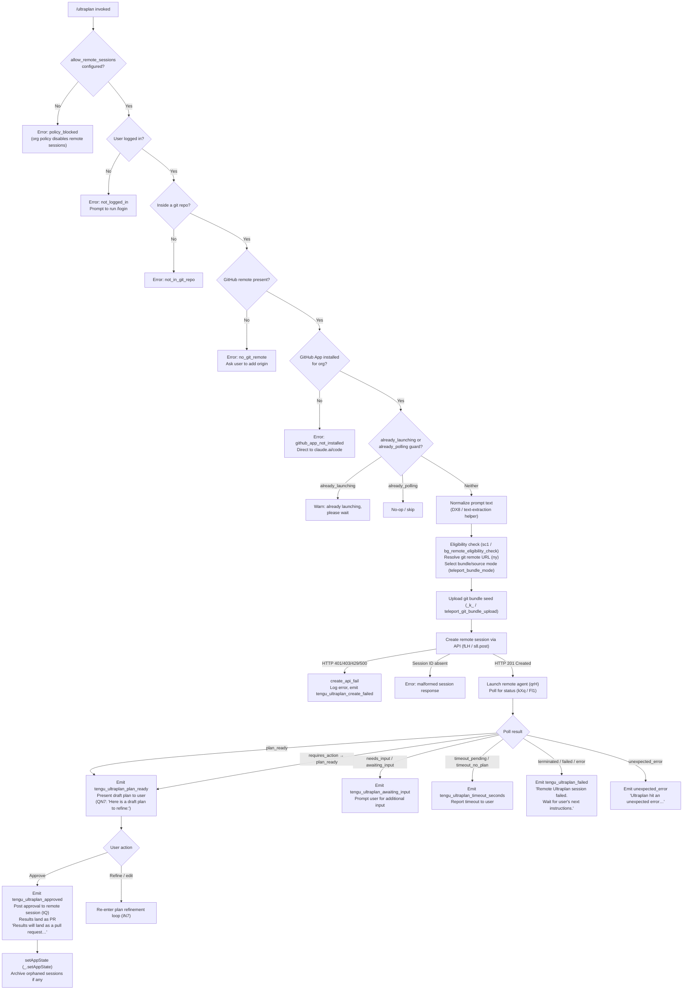

# `/ultraplan`

> Analysis basis: CC v2.1.145 bundle.js (AST extraction + Claude interpretation)
> Minimum version: v2.1.145

---

## Overview

`/ultraplan` is a remote-planning command that dispatches a background Claude Code session on the web (via Anthropic's cloud infrastructure) to draft an execution plan for the given prompt. The local CLI waits for the remote agent to produce a plan, then surfaces it for the user to review, edit, and approve before any code changes land as a pull request.

---

## Registration

| Field | Value |
|---|---|
| type | `local-jsx` |
| name | `ultraplan` |
| description | `… Claude Code on the web drafts a plan you can edit and approve. See …` |
| argumentHint | `<prompt>` |
| load_inline | `true` |
| load_ident | `rN7` |
| loc_byte | `11304452` |
| loc_byte_end | `11304696` |
| loc_line | `6753` |
| arbor_handler.name | `rN7` |
| arbor_handler.fqn | `claude-2.1.145::rN7` |
| arbor_handler.kind | `AsyncFunction` |
| arbor_handler.resolution_path | `load_ident` |
| arbor_handler.n_hits | `1` |

Analysis basis: CC v2.1.145 bundle.js:+11304452

---

## Input Branching

The command has many distinct branches (precondition failures, duplicate-launch guards, plan-ready vs. needs-input vs. timeout, approval flow, and error paths), so a Mermaid flowchart is used.



---

## Behavioral Spec

### 1. Handler Entry Point (`rN7`)

```
async function ultraplanHandler(inputText, context):
    // Check allow_remote_sessions config flag
    if not config.allow_remote_sessions:
        return error("policy_blocked", orgPolicyMessage)

    // Retrieve app state
    appState = _.getAppState()

    // Normalize prompt text
    normalizedPrompt = normalizePromptText(inputText)          // DX8

    // Check authentication
    authToken = resolveAuthToken(appState)                     // Uq
    if not authToken:
        return error("not_logged_in", loginMessage)

    // Dispatch main orchestration
    result = await launchOrchestration(normalizedPrompt, authToken, appState)  // hG6

    // Post-launch: update app state, archive orphaned sessions
    _.setAppState(updatedState)
```

Analysis basis: CC v2.1.145 bundle.js:+11302594

---

### 2. Prompt Text Normalization (`DX8`)

```
function normalizePromptText(rawInput):
    // Strip leading/trailing whitespace and slice to usable length
    clipped = rawInput.slice(...)                              // loc_byte 11288703
    // Apply regex substitution ($1$2 pattern, flags "gi")    // loc_byte 11288204, 11288800
    cleaned = clipped.replace(pattern, "$1$2")
    // Trim to max 5-word prefix heuristic                    // loc_byte 11288823
    return cleaned
```

Analysis basis: CC v2.1.145 bundle.js:+11288703

The string literal `"ultraplan"` appears in the pattern-matching helper (`RXq`) at byte +11288556, suggesting the helper detects whether the word "ultraplan" already appears in the prompt body so it can strip or pass through the prefix correctly.

---

### 3. Duplicate-Launch Guard (`hG6`)

```
function launchOrchestration(prompt, authToken, appState):
    // Guard 1: already polling
    if appState.status == "already_polling":
        return {skip: true}

    // Guard 2: already launching
    if appState.status == "already_launching":
        warn("ultraplan: already launching. Please wait for the session to start.")
        return

    // Set launching state
    appState.status = "already_launching"

    // Compute usage hint string
    usageHint = buildUsageHint()                              // JX8 / jX8
    // "Usage: /ultraplan <prompt>, or include 'ultraplan' anywhere in your prompt"
    // loc_byte 11300172, 11300238

    // Run precondition checks
    preconditionResult = checkPreconditions(prompt, authToken) // iN7
    if preconditionResult.error:
        appState.status = "idle"
        return preconditionResult

    // Start remote session
    sessionResult = await startRemoteSession(prompt, authToken) // cN7
    return sessionResult
```

Analysis basis: CC v2.1.145 bundle.js:+11299856, +11300108, +11300126, +11300172

---

### 4. Precondition Checks (`iN7` / `sc1`)

```
async function checkPreconditions(prompt, authToken):
    // Step A: bg_remote_eligibility_check
    eligibility = await bgRemoteEligibilityCheck(authToken)   // kIH → sc1
    // Checks: byoc flag, github.com remote, org UUID
    // Emits: tengu_ccr_bundle_seed_enabled

    if eligibility.error == "not_in_git_repo":
        return error("not_in_git_repo")

    if eligibility.error == "no_git_remote":
        return error("no_git_remote",
            "Background tasks require a GitHub remote. Add one with `git remote add origin REPO_URL`.")

    if eligibility.error == "github_app_not_installed":
        return error("github_app_not_installed",
            ". Please setup GitHub on https://claude.ai/code")

    if eligibility.error == "policy_blocked":
        return error("policy_blocked",
            "Remote sessions are disabled by your organization's policy. Contact your org admin.")

    // Step B: resolve git remote URL (ny)
    remoteURL = await resolveGitRemoteURL()
    // runs: git config --get remote.origin.url

    // Step C: resolve default branch (FV)
    defaultBranch = resolveDefaultBranch()
    // tries: symbolic-ref --short refs/remotes/origin/HEAD
    // falls back to "main", then "master"

    // Step D: select bundle/source mode (I, teleport_bundle_mode)
    bundleMode = determineBundleMode(remoteURL)
    // Modes: "bundle", "explicit_env_bundle", "git_repository",
    //        "explicit_source_url", "no_git_at_all"

    // Step E: generate task title (K67 / teleport_generate_title)
    taskTitle = generateTitle(prompt)
    // Truncates to 75 chars, fills template "{description}",
    // emits json_schema with fields: title, branch

    return {ok: true, remoteURL, defaultBranch, bundleMode, taskTitle}
```

Analysis basis: CC v2.1.145 bundle.js:+11300617, +8694187, +8761080, +8761240, +8761335, +8761512, +1051898, +1060631, +8751238, +8738875

---

### 5. Git Bundle Upload (`_k_`)

```
async function uploadGitBundleSeed(repoPath):
    // Emits: tengu_ccr_bundle_upload (loc_byte 8736028)
    // Emits: teleport_git_bundle_upload (loc_byte 8735735)

    if not inGitRepo:
        return error("empty_repo", "Not in a git repository")

    // Clean up prior seed refs
    git("update-ref", "-d", "refs/seed/stash")
    git("update-ref", "-d", "refs/seed/root")

    // Check for existing commits
    refCount = git("for-each-ref", "--count=1", "refs/")
    if refCount == 0:
        return error("empty_repo", "Repository has no commits yet")

    // Stash uncommitted changes
    stashOID = git("stash", "create")   // status 200

    // Verify HEAD
    git("rev-parse", "--verify", "HEAD")

    // Create bundle file: ccr-seed.bundle
    bundlePath = tempDir + "/ccr-seed.bundle"
    writeBundleFile(bundlePath)          // kBH / Cl1 / Sl1

    // Upload bundle (source seed)
    uploadResult = uploadFile("_source_seed.bundle", bundlePath)
    if uploadResult == "failed":
        return error("upload_failed")

    // Determine bundle strategy
    strategy = one of: "head" | "fallback_head" | "squashed" | "fallback_squashed"

    // Clean up temp file
    ArH.unlink(bundlePath)

    return {strategy, stashOID}
```

Analysis basis: CC v2.1.145 bundle.js:+8735735, +8735796, +8735836, +8735854, +8735887, +8736142, +8736874, +8737177, +8737322, +8737471

---

### 6. Remote Session Creation (`fLH`)

```
async function createRemoteSession(prompt, authToken, orgUUID, bundleInfo):
    // Policy guard
    if policyBlocked:
        throw "Remote sessions are disabled by your organization's policy."

    // Auth guard
    if not authToken:
        throw "No access token found for remote session creation"

    // Org UUID guard
    if not orgUUID:
        throw "Unable to get organization UUID for remote session creation"

    // Build request headers
    headers = {
        "Content-Type": "application/json",
        "anthropic-version": "2023-06-01",
        "anthropic-client-platform": <platform>,
        "anthropic-beta": "ccr-byoc-2025-07-29",
        "x-organization-uuid": orgUUID
    }

    // Build initial event payload
    payload = {
        event: "control_request",
        type: "set_permission_mode",
        user: <userDetails>
    }

    // Generate unique request ID
    requestID = crypto.randomUUID()    // ml1 / qk_.randomUUID

    // POST to session creation endpoint
    response = await s8.post(sessionEndpoint, payload, {headers})
    // Expected: HTTP 201
    // Error on: 401, 403, 429, 500 → create_api_fail

    if not response.data.session_id:
        throw "Server returned a malformed session response (no session id)"

    // Attempt to list / create default cloud environment (Yr / iiH)
    // Emits: teleport_environments_list, teleport_default_environment_create
    // Auto-creates "Default" env if none exists:
    //   { name: "Default - trusted network access", provider: "anthropic_cloud",
    //     home: "/home/user", python: "3.11", node: "20" }

    // Log: "[teleportToRemote] Auto-created default cloud env"

    // Select environment (prefer non-"bridge" type)
    selectedEnv = environments.find(e => e.type != "bridge")
    if not selectedEnv:
        throw "No environments available for session creation"

    return {sessionID: response.data.session_id, env: selectedEnv}
```

Analysis basis: CC v2.1.145 bundle.js:+8750071, +8750179, +8750489, +8750811, +8750828, +8750850, +8752070, +8752162, +8752221, +8752542, +8690000, +8690800, +8752736, +8753887

---

### 7. Remote Agent Polling & Plan Lifecycle (`qrH` / `Fl1` / `kXq`)

```
async function pollRemoteSession(sessionID, authToken):
    // Generate random token for remote_agent session  (TS / ORq.randomBytes, 8 bytes)
    // Open browser / web link to session (hO8 / qo.open)
    // Record start time (bW / Date.now)

    // Emit: tengu_ultraplan_launched  (loc_byte 11301564)

    // Poll loop (kXq): interval 1000 ms, max 1800000 ms (30 minutes)
    while elapsed < 1800000:
        status = await fetchSessionStatus(sessionID)  // s8.get

        switch status:
            case "pending":
                continue polling

            case "running":
                continue polling

            case "plan_ready":
                emit("tengu_ultraplan_plan_ready")
                planText = extractPlanFromResponse()
                displayPlanToUser("Here is a draft plan to refine:", planText)
                return waitForUserApproval(planText)

            case "needs_input" | "requires_action":
                emit("tengu_ultraplan_awaiting_input")
                userInput = await promptUser()
                postInputToSession(userInput)    // tQ / s8.post, timeout 10000 ms
                continue polling

            case "approved":
                emit("tengu_ultraplan_approved")
                // "Results will land as a pull request when the remote session finishes."
                return {outcome: "approved"}

            case "terminated" | "failed":
                emit("tengu_ultraplan_failed")
                return {outcome: "failed",
                        message: "Remote Ultraplan session failed. Wait for the user's next instructions."}

            case "archived" | "completed":
                // Session ended normally
                return {outcome: "completed"}

            case "timeout_pending" | "timeout_no_plan":
                emit("tengu_ultraplan_timeout_seconds")
                return {outcome: "timeout"}

        // Remote session timeout hard cap: 30 minutes
        // Report: "remote session exceeded 30 minutes"

    // If poll stops externally: "poll stopped by caller"
    // Network loss after retries: "Lost connection to the remote session after
    //   repeated retries — the session may still be running"
```

Analysis basis: CC v2.1.145 bundle.js:+8765668, +12257649, +8767259, +8767266, +11301564, +11286377, +11286392, +11296140, +11296208, +11296616, +11297489, +8769844, +8769885, +11285332, +11285685

---

### 8. Plan Presentation & Approval Loop (`iN7` / `QN7` / `dN7`)

```
function buildDraftPlanMessage(planLines):
    // Prepend header
    parts = ["Here is a draft plan to refine:"]    // loc_byte 11295837
    parts.push(...planLines)                        // QN7 → q.push / q.join
    // Timeout for session: 5400 seconds            // loc_byte 11295530
    return parts.join("\n")

async function handlePlanApproval(planText, sessionID, authToken):
    // Show plan in UI: label "Ultraplan" (loc_byte 11301720)
    // Offer actions: "Refine local plan" (loc_byte 11301017) or approve

    if userApproves:
        emit("tengu_ultraplan_approved")
        // POST approval event (tQ): HTTP POST, timeout 10000 ms, retry on 409
        await postApprovalEvent(sessionID, authToken)
        return "Results will land as a pull request when the remote session finishes."
    else:
        // User edits / refines → re-enter orchestration with updated plan text
        return refinePlan(updatedPlanText)
```

Analysis basis: CC v2.1.145 bundle.js:+11295530, +11295837, +11296208, +11296616, +11297102, +11301017, +11301720, +8758040, +8758241

---

### 9. Error-Path Finalization (`hG6` / `rN7`)

```
function finalizeOnError(error, sessionID):
    errorKind = classifyError(error)
    // Kinds: "precondition", "create_api_fail", "teleport_null",
    //        "unexpected_error", "policy_blocked", "not_logged_in", etc.

    if errorKind == "unexpected_error":
        emit("tengu_ultraplan_create_failed")  // or tengu_ultraplan_failed
        notifyAgent("Ultraplan hit an unexpected error during launch."
                    + " Wait for the user's next instructions.")
                    // loc_byte 11302131

    if orphanedSessionID:
        archiveSession(orphanedSessionID)
        // logs: "ultraplan: failed to archive orphaned session"  // loc_byte 11302279

    // Reset app state flags
    _.setAppState({status: "idle"})
```

Analysis basis: CC v2.1.145 bundle.js:+11299893, +11301253, +11301271, +11301973, +11302131, +11302279, +11303147

---

## State & Side Effects

| Item | Detail |
|---|---|
| Telemetry: `tengu_ultraplan_create_failed` | Fired when the remote session creation POST fails (loc_byte 11299893) |
| Telemetry: `tengu_ultraplan_prompt_identifier` | Fired to log how the prompt was classified/identified (loc_byte 11295663) |
| Telemetry: `tengu_ultraplan_launched` | Fired immediately after the remote agent is successfully started (loc_byte 11301564) |
| Telemetry: `tengu_ultraplan_timeout_seconds` | Fired when the poll loop detects a timeout state (loc_byte 11295496) |
| Telemetry: `tengu_ultraplan_awaiting_input` | Fired when the remote session reaches `needs_input` (loc_byte 11296140) |
| Telemetry: `tengu_ultraplan_plan_ready` | Fired when the plan draft is available (loc_byte 11296208) |
| Telemetry: `tengu_ultraplan_approved` | Fired when the user approves the plan (loc_byte 11296616) |
| Telemetry: `tengu_ultraplan_failed` | Fired on remote session failure/termination (loc_byte 11297489) |
| Telemetry: `tengu_ccr_bundle_seed_enabled` | Fired during eligibility check (loc_byte 8694582) |
| Telemetry: `tengu_ccr_bundle_upload` | Fired when git bundle upload begins (loc_byte 8736028) |
| Telemetry: `tengu_teleport_bundle_mode` | Fired to record which bundle/source strategy was selected (loc_byte 8751238) |
| Telemetry: `tengu_ccr_session_link` | Fired with the web session link (loc_byte 8745636) |
| Telemetry: `tengu_teleport_source_decision` | Fired to record the source-code delivery decision (loc_byte 8756239) |
| Telemetry: `tengu_teleport_environments_list` | Fired when listing available cloud environments (loc_byte 8690000) |
| Telemetry: `tengu_teleport_default_environment_create` | Fired when auto-creating a default cloud environment (loc_byte 8690800) |
| Telemetry: `tengu_teleport_generate_title` | Fired when generating the task title (loc_byte 8739179) |
| Telemetry: `tengu_slate_kestrel` | Fired during auth/account resolution (loc_byte 4644601) |
| Telemetry: `tengu_config_parse_error` | Fired on config-file parse errors (loc_byte 3169876) |
| Telemetry: `tengu_bg_dispatch_sigkill_escalate` | Background process escalation to SIGKILL (loc_byte 14655330) |
| Telemetry: `tengu_bg_low_mem_mb` | Low-memory event in background dispatch (loc_byte 12029322) |
| Telemetry: `tengu_bg_dispatch_low_mem` | Dispatcher detects low memory (loc_byte 14655909) |
| Telemetry: `tengu_bg_spare_enable/claim/spawn/claim_fail` | Background spare-slot lifecycle events |
| Telemetry: `tengu_bg_sendclaim_failed` | Background claim send failed (loc_byte 14636515) |
| Telemetry: `tengu_daemon_idle_exit` | Daemon exiting due to idle timeout (loc_byte 14674514) |
| Hook registration | `h9` calls `w6A.register` (loc_byte 57267) — task-notification hook registered during orchestration |
| appState changes | `_.getAppState()` read at +11302929; `_.setAppState()` written at +11303147; guards `already_launching` (+11300126) and `already_polling` (+11300108) stored in app state |
| Sound | Not found in depth-2 traversal <!-- TODO: not found in depth-2 traversal; needs --depth 4 --> |
| API endpoint (session creation) | `s8.post` to session endpoint, `anthropic-beta: ccr-byoc-2025-07-29`, HTTP 201 expected (+8752162) |
| API endpoint (status polling) | `s8.get` repeated at 1 000 ms intervals, up to 1 800 000 ms (+8767259, +8767266) |
| API endpoint (approval POST) | `s8.post` with 10 000 ms timeout, retry on HTTP 409 (+8758040, +8758241) |
| File I/O | Git bundle written to temp file (`ccr-seed.bundle` / `_source_seed.bundle`), deleted after upload via `ArH.unlink` (+8737810); config read via `q.readFileSync`, copied via `q.copyFileSync` |
| Org policy flag | `allow_remote_sessions` checked at +11302615; disables command entirely when absent/false |

---

## Version History

| Version | Change |
|---|---|
| v2.1.145 | Initial analysis |

---

## Common Mistakes

1. **Not logged in with a Claude.ai account.** The command requires OAuth via `/login` with a Claude.ai account, not an API key. API key authentication alone raises a `not_logged_in` error with the message "Please run /login and sign in with your Claude.ai account (not Console)." (bundle.js:+8761001).

2. **Missing GitHub remote.** The command requires a GitHub remote (`origin`) configured in the current git repository. Repos without a remote return `no_git_remote`. Fix: `git remote add origin REPO_URL` (bundle.js:+8761240).

3. **GitHub App not installed.** Even with a remote, the Anthropic GitHub App must be installed for the organization. Missing installation returns `github_app_not_installed` and directs users to `https://claude.ai/code` (bundle.js:+8761335).

4. **Organization policy block.** Enterprise or team organizations may have `allow_remote_sessions` disabled. The error `policy_blocked` is returned with a message to contact the organization admin (bundle.js:+8761512).

5. **Repository has no commits.** Attempting `/ultraplan` in a freshly initialized repository with no commits will fail at the bundle-upload stage with "Repository has no commits yet — run `git add . && git commit -m 'initial'` then retry" (bundle.js:+8736142, +8755676).

6. **Invoking the command while a session is already launching.** Issuing `/ultraplan` a second time before the first session starts returns the warning "ultraplan: already launching. Please wait for the session to start." (bundle.js:+11298720).

7. **Expecting immediate results.** The command is asynchronous. Results land as a pull request when the remote session completes; there is nothing to do locally while the session runs (bundle.js:+11297102).

---

## Appendix — Identifier Mapping

> For bundle debugging only. Identifiers change across versions.

| Identifier | Role |
|---|---|
| `rN7` | Main handler (AsyncFunction) — command entry point |
| `DX8` | Prompt text normalization helper |
| `YX8` | Sub-helper for text extraction within normalization |
| `RXq` | Regex-based prompt classification (detects "ultraplan" keyword) |
| `Uq` | Authentication token resolution / auth check |
| `Yi9` | Inner auth resolution helper |
| `k3_` | Auth config loader |
| `Nm` | Account/tier resolver (firstParty, enterprise, team) |
| `Oi9` | Config file reader (readFileSync / utf-8) |
| `Hq` | Token formatting helper |
| `JOA` | String normalization sub-helper |
| `xH` | Generic string coercion utility |
| `c0H` | Secondary string coercion / header builder |
| `MwH` | App-state mutation helper |
| `hG6` | Main orchestration launcher (duplicate-guard + preconditions + session start) |
| `d` | Logging / diagnostic sink |
| `L` | Async task tracker (add/delete/finally lifecycle) |
| `BXq` | Usage-hint builder |
| `JX8` | Usage-string assembly outer wrapper |
| `jX8` | Usage-string assembly inner helper |
| `Z6` | Feature-flag / capability checker |
| `BN7` | Prompt-identifier sub-helper |
| `iN7` | Precondition-check + plan lifecycle orchestrator |
| `kIH` | Background remote eligibility check dispatcher |
| `sc1` | `bg_remote_eligibility_check` implementation |
| `QN7` | Draft-plan message builder ("Here is a draft plan to refine:") |
| `gN7` | Plan-lines formatter |
| `fLH` | Remote session creation (full HTTP flow, env resolution, bundle mode) |
| `b6` | HTTP client wrapper |
| `XM` | GA / analytics event emitter |
| `fk_` | Request header builder |
| `NH` | HTTP error handler / error-log helper |
| `SN` | Structured error builder |
| `K9` | Environment / endpoint resolver (local/staging/prod) |
| `Cz` | API client configurator (Content-Type, anthropic-version headers) |
| `_k_` | Git bundle seed uploader (`teleport_git_bundle_upload`) |
| `k6` | Internal version/flag accessor |
| `I` | Model/feature identifier helper |
| `ny` | Git remote URL resolver (`git config --get remote.origin.url`) |
| `ml1` | Control-request event builder (set_permission_mode) |
| `RH` | JSON serializer wrapper |
| `ul1` | Session-link logger (`tengu_ccr_session_link`) |
| `Yr` | Environment list fetcher (`teleport_environments_list`) |
| `iiH` | Default cloud environment creator (`teleport_default_environment_create`) |
| `GH` | String casting utility |
| `K67` | Task title generator (`teleport_generate_title`) |
| `DC` | Git capability / diff-context helper |
| `WIH` | GitHub App installation checker |
| `FV` | Default branch resolver (symbolic-ref / main / master) |
| `V1` | UI display component for plan presentation |
| `x_` | Error extraction / classification utility |
| `wc` | Cancel-detection helper |
| `$z` | Error-message formatter |
| `zD` | Claude.ai base-URL resolver (local/staging/prod) |
| `t_` | Module initialization / export helper |
| `YO_` | URL configuration object (localhost / staging / prod) |
| `lN7` | Plan-UI label builder ("Ultraplan") |
| `qrH` | Remote agent polling orchestrator |
| `TS` | Random token generator (randomBytes) |
| `hO8` | Browser/URL opener for web session |
| `bW` | Session start-time tracker |
| `w67` | Status-string formatter |
| `Fl1` | Poll-loop implementation (1 000 ms interval, 1 800 000 ms max) |
| `lk` | Task-state store / task manager |
| `G97` | Task-started event handler |
| `X97` | Task-updated event handler |
| `py_` | Task persistence helper |
| `T97` | Task timestamp updater |
| `E97` | Task metadata updater |
| `X6H` | Task UI state mapper (user_typed, active, aborted) |
| `dN7` | Plan-ready / awaiting-input / approval state machine |
| `kXq` | Low-level poll loop (Date.now, timeout, ingest, retry) |
| `pN7` | Session-timeout configurator (5400 s) |
| `nN7` | Plan-extraction marker helper |
| `sP6` | Temp-file cleanup helper (unlink) |
| `K` | Column formatter (padEnd) |
| `tQ` | Approval event POST handler (10 000 ms timeout, 409 retry) |
| `h9` | Hook registration (`w6A.register`) for task-notification |
| `cN7` | Post-launch cleanup / archive orphaned sessions |
| `h6` | App-config accessor with file-watch support |
| `U6` | Config path resolver |
| `a1_` | Config access guard |
| `R$H` | Config file reader and migrator |
| `u6` | JSON parser wrapper |
| `hR` | String prefix-stripping helper |
| `A8` | Config field accessor |
| `Wv9` | Config backup directory scanner |
| `qq_` | Config path builder (join + l8) |
| `$` | Utility set / collection helper |
| `w` | Background-process supervisor (spawn, kill, memory checks) |
| `C` | Child-process write helper |
| `CH` | Process health check ("bad" telemetry path) |
| `hH` | Process health check ("ok" telemetry path) |
| `bT6` | macOS memory pressure checker |
| `u` | Daemon idle-exit / timeout handler |
| `Is_` | IPC socket connection handler (pZ8.connect) |
| `Rs_` | Background session lifecycle manager (done/killed/stopped/crashed/blocked/working) |
| `D` | Background task disposer |
| `S` | Daemon state tracker |
| `YxL` | Config file watcher (watchFile / unwatchFile) |
| `cl` | Config change listener |
| `GsH` | Parallel precondition resolver (Promise.all over ny, DC, iL, b6, xH, WIH) |