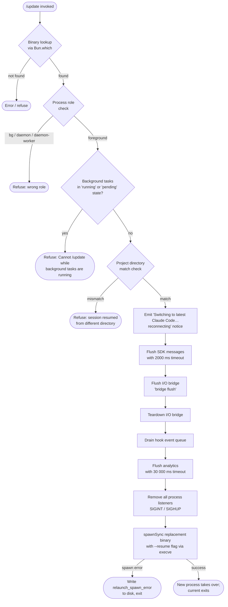

# `/update`

> Analysis basis: CC v2.1.145 bundle.js (AST extraction + Claude interpretation)
> Minimum version: v2.1.145

---

## Overview

The `/update` command performs an in-place hot-swap of the running Claude Code binary to the latest installed version while preserving the active conversation. It resolves the target binary, validates that preconditions are met (no running background tasks, matching project directory), tears down the current process's I/O bridge, relaunches itself via `execve`, and restores session state — all without requiring the user to restart manually.

---

## Registration

| Field | Value |
|---|---|
| type | `local` |
| name | `update` |
| description | `Switch to the latest version (conversation continues)` |
| loc_byte | `11704944` |
| loc_byte_end | `11705146` |
| loc_line | `7219` |
| supportsNonInteractive | `false` |
| isHidden | `true` |
| module_id | `PVq` |
| load_inline | `true` |
| arbor_handler.name | `NC7` |
| arbor_handler.fqn | `claude-2.1.145::NC7` |
| arbor_handler.kind | `AsyncFunction` |
| arbor_handler.resolution_path | `module_id` |
| arbor_handler.n_hits | `0` |

Analysis basis: CC v2.1.145 bundle.js:+11704944

---

## Input Branching

The handler contains five or more distinct guard branches before executing the hot-swap, so a Mermaid flowchart is used.



Analysis basis: CC v2.1.145 bundle.js:+11702739 – +11704267

---

## Behavioral Spec

### 1. Binary Resolution

```
function resolveBinary():
    candidatePath = Bun.which("claude")          // bundle.js:+11702739
    if candidatePath is null or empty:
        refuse and return
    return candidatePath
```

The handler calls the package-manager lookup helper (`D$` → `UDA` → `Bun.which`) to locate the `"claude"` executable on `PATH`.

Analysis basis: CC v2.1.145 bundle.js:+11702739

### 2. Installation Path Discovery

```
function discoverInstallPaths():
    // XDG-style path: ~/.local/share/versions
    homedir = os.homedir()                       // bundle.js:+7480018
    xdgPath  = path.join(homedir, ".local", "share", "versions")
    // Bin path: ~/.local/share/bin
    binPath  = path.join(homedir, ".local", "share", "bin")
    return { xdgPath, binPath }
```

The path-building helpers (`w38`, `nYH`, `d78`, `kHH`) assemble XDG-style directories using the string constants `".local"`, `"share"`, `"versions"`, and `"bin"`.

Analysis basis: CC v2.1.145 bundle.js:+7480018, +7480291, +7480300, +7480371

### 3. Process Role Guard

```
function checkProcessRole():
    role = getProcessRole()                      // bundle.js:+2173552
    forbidden = ["bg", "daemon", "daemon-worker"]
    if role in forbidden:
        emit telemetry "tengu_update_refused"
        refuse and return
```

The process-role check (`T1` → `ZMH`) reads the current role string and compares it against the literals `"bg"`, `"daemon"`, and `"daemon-worker"`. If the running process is not a foreground interactive session, the update is refused and `tengu_update_refused` is recorded.

Analysis basis: CC v2.1.145 bundle.js:+11702825, +2173475

### 4. Background-Task Guard

```
function checkBackgroundTasks(appState):
    tasks = Object.values(appState.backgroundTasks)  // bundle.js:+11703062
    for task in tasks:
        if task.status in ["running", "pending"]:    // bundle.js:+11703100, +11703122
            return Error(
                "Cannot /update while background tasks are running " +
                "— wait for them to finish, then try again."
            )                                        // bundle.js:+11703203
    return null
```

Analysis basis: CC v2.1.145 bundle.js:+11703062

### 5. Project Directory Guard

```
function checkProjectDirectory():
    currentDir = process.cwd()
    sessionDir = getSessionProjectDir()
    if currentDir != sessionDir:
        return Error(
            "Cannot /update — this session was resumed from a " +
            "different project directory. Restart manually with " +
            "--resume to continue on the latest version."
        )                                            // bundle.js:+11703444
    return null
```

Analysis basis: CC v2.1.145 bundle.js:+11703444

### 6. Pre-Swap Notice and State Mutation

```
function emitSwitchingNotice(outputBridge):
    // Append a text message to the conversation log
    messageId = generateUUID()                       // bundle.js:+11701812
    outputBridge.writeSdkMessages([{
        role: "assistant",
        content: [{
            type: "text",
            text: "Switching to latest Claude Code… reconnecting"
        }]                                           // bundle.js:+11703937
    }])
    appState = _.getAppState()                       // bundle.js:+11703691
    updatedState = applyUpdateMarker(appState)       // bundle.js:+11703770
    _.setAppState(updatedState)                      // bundle.js:+11703827
```

The prefix `"assistant-"` is used when building the synthetic assistant message ID.

Analysis basis: CC v2.1.145 bundle.js:+11703937, +11703745

### 7. I/O Bridge Flush and Teardown

```
async function flushAndTeardown(bridge):
    await Promise.race([
        bridge.flush(),
        timeout(2000)       // 2 000 ms — bundle.js:+11704017
    ])                      // label: "bridge flush" — bundle.js:+11704022
    await bridge.teardown() // bundle.js:+11704058
```

Analysis basis: CC v2.1.145 bundle.js:+11704007, +11704017

### 8. Analytics / Hook Drain

```
async function drainAnalyticsAndHooks():
    await hookQueue.drain()                          // bundle.js:+57310
    await Promise.race([
        flushAnalytics(),
        timeout(30000)      // 30 000 ms — bundle.js:+11436147
    ])                      // label: "flush timeout (relaunch)" — bundle.js:+11436153
    await Promise.race([
        cleanupTimeout(),
        timeout(/* cleanup timeout */)
    ])                      // label: "cleanup timeout" — bundle.js:+11436209
    await Promise.race([
        analyticsFlush(),
        timeout(500)
    ])                      // label: "analytics flush timeout" — bundle.js:+11436265
```

Analysis basis: CC v2.1.145 bundle.js:+11436139, +11436198, +11436254

### 9. Process Replacement (execve)

```
async function relaunch(binaryPath):
    process.removeAllListeners("SIGINT")   // bundle.js:+11436574
    process.removeAllListeners("SIGHUP")   // bundle.js:+11436593

    result = childProcess.spawnSync(
        binaryPath,
        ["--resume"],                      // bundle.js:+11436085
        { stdio: "inherit" }               // bundle.js:+11436695
    )

    // Handle beforeExit / exit lifecycle events
    on("beforeExit"):                      // bundle.js:+11436749
        ...
    on("exit"):                            // bundle.js:+11436790
        ...

    if result.error:
        writeFileSync(errorLogPath, "relaunch_spawn_error")  // bundle.js:+11436885
        process.exit(128)                                     // bundle.js:+11437022

    // On macOS, uses bun:ffi / libSystem execve
    // loads: /usr/lib/libSystem.B.dylib or libc.so.6
    // bundle.js:+11435198, +11435250, +11435279
    nativeExecve(binaryPath, args, env)
```

The native `execve` path uses Bun FFI (`bun:ffi`) to call the system `execve` symbol, replacing the current process image without forking. On macOS the library path is `"/usr/lib/libSystem.B.dylib"`; on Linux it falls back to `"libc.so.6"`.

Analysis basis: CC v2.1.145 bundle.js:+11435198, +11435206, +11435250, +11435279, +11436660

---

## State & Side Effects

| Item | Detail |
|---|---|
| Telemetry | `tengu_update_refused` (role guard or task guard fires); `tengu_scroll_summary` (scroll-state helper); `tengu_amber_creek`, `tengu_pewter_brook` (fullscreen/flicker detection); `tengu_bg_dispatch_sigkill_escalate`, `tengu_bg_low_mem_mb`, `tengu_bg_dispatch_low_mem`, `tengu_bg_spare_enable`, `tengu_bg_spare_claim`, `tengu_bg_spare_spawn`, `tengu_bg_spare_claim_fail`, `tengu_bg_sendclaim_failed`, `tengu_daemon_idle_exit`, `tengu_daemon_control` (background daemon helpers called during teardown); `tengu_feature_bad`, `tengu_feature_ok` (feature-flag accounting) |
| Hook registration | Removes all `SIGINT` and `SIGHUP` listeners before exec; hook event queue (`w6A`) is drained via `KSH` |
| appState changes | `_.setAppState` is called once to record the update marker before relaunch (bundle.js:+11703827) |
| SDK message write | One synthetic `"assistant"` role message with `"text"` content is written to the output bridge before teardown (bundle.js:+11703913) |
| File I/O | On spawn error, an error token (`"relaunch_spawn_error"`) is written to disk via `pX` → `SSH.writeFileSync` (bundle.js:+11436885); `--resume` flag file path is joined via `Sk8.join` (bundle.js:+189030) |
| Process replacement | `aWq.spawnSync` / native `execve` (FFI); the current process is completely replaced — no fork (bundle.js:+11436660, +11435605) |
| Sound | None detected in depth-2 traversal |

---

## Version History

| Version | Change |
|---|---|
| v2.1.145 | Initial analysis |

---

## Common Mistakes

1. **Invoking `/update` with active background tasks.** The command hard-refuses if any task is in `"running"` or `"pending"` state and prints an explicit message. Wait for all background tasks to complete first.
2. **Running `/update` inside a daemon or background worker process.** The role guard (`"bg"`, `"daemon"`, `"daemon-worker"`) blocks the command. It is only valid in a foreground interactive session.
3. **Resuming a session from a different project directory.** If the working directory at resume time differs from the original session directory, `/update` refuses with a `--resume` restart instruction. Use `claude --resume` in the correct directory instead.
4. **Expecting the command to be visible in `/help` output.** The registration sets `isHidden: true`, so `/update` does not appear in the standard command list.
5. **Using `/update` in non-interactive (`--print`) mode.** `supportsNonInteractive: false` means the command is disabled in scripted/piped invocations.
6. **Assuming an immediate restart.** The swap sequence includes several async drain steps (bridge flush 2 000 ms, analytics flush up to 30 000 ms) before the new binary takes over; the terminal may appear frozen briefly.

---

## Appendix — Identifier Mapping

> For bundle debugging only. Identifiers change across versions.

| Identifier | Role |
|---|---|
| `NC7` | Main async handler for `/update` (Arbor-resolved, `AsyncFunction`) |
| `P28` | Entry-point wrapper that calls binary-lookup (`D$`) and install-path builder (`db`) |
| `D$` | Binary lookup dispatcher; delegates to `UDA` → `Bun.which` |
| `UDA` | `Bun.which` wrapper for locating the `claude` executable |
| `db` | Install-path builder; assembles XDG version/bin paths |
| `w38` | Versions-directory path assembler |
| `nYH` | XDG base-dir resolver (`~/.local/share`) |
| `d78` | `os.homedir()` wrapper |
| `kHH` | Bin-directory path assembler (`~/.local/share/bin`) |
| `T1` | Process-role reader |
| `ZMH` | Role-string extractor (returns `"bg"`, `"daemon"`, etc.) |
| `d` | General async delay / deferred helper |
| `n0` | Current executable basename resolver (`sP.basename`) |
| `k6` | Child-process spawn helper (`IV`) |
| `IV` | Low-level process spawner |
| `RS` | File-system stat / path utility |
| `pF_` | Path-resolution helper used during relaunch setup |
| `q_` | Path utility wrapper (`IV`) |
| `aK` | Additional path helper (`IV`) |
| `z8H` | State-check helper used before swap |
| `sr` | Hook-type membership checker (`FW8`, `kF7.has`) |
| `FW8` | Hook-type set constant |
| `og_` | Hook log appender (`jL`, `_.appendEntry`) |
| `jL` | Hook event journal writer |
| `h9` | Hook event queue registrar (`w6A.register`) |
| `NH` | Error-logging / output-buffer writer |
| `x_` | Error constructor wrapper |
| `xH` | `String()` coercion utility |
| `Hq` | Output-buffer formatter (`JOA`) |
| `JOA` | Inner output-line builder |
| `mhK` | Rolling output-buffer manager (shift/push) |
| `wG` | App-state mutation helper called before relaunch |
| `O` | SDK output-bridge object (`writeSdkMessages`, `flush`, `teardown`) |
| `k8` | SDK bridge internals |
| `jVq` | UUID generator (`j28.randomUUID`) |
| `cf` | Promise-with-timeout helper (`setTimeout`, `Promise.race`, `clearTimeout`) |
| `mjH` | Full relaunch orchestrator (flush → drain → exec) |
| `pz6` | Interval-clear helper (`_j_`) |
| `_j_` | `clearInterval` wrapper |
| `ZZH` | Terminal teardown helper (unmount, write, restore cursor) |
| `H` | React/Ink root renderer (used by `ZZH` for unmount) |
| `Gh` | Post-unmount cleanup step |
| `us6` | Terminal restore helper (cursor-position escape sequences) |
| `bGH` | Terminal version/type detector (Ghostty, iTerm2) |
| `hGH` | Additional terminal cleanup step |
| `Q0` | tmux / screen multiplexer escape-sequence handler |
| `L98` | Scroll-summary renderer |
| `kV` | Scroll-summary sub-component |
| `Bq1` | Scroll-summary sub-component |
| `Uq1` | Scroll metrics calculator (`Date.now`, `Math.max`, `Math.round`) |
| `mq1` | Scroll metrics helper |
| `oA` | Ink render orchestrator for terminal output |
| `OCH` | Output-set membership checker (`VyK.has`) |
| `VK_` | Line-render helper (`lq`, `xH`) |
| `_n` | Inline-markup renderer (`imL`) |
| `I` | ANSI / markdown inline formatter |
| `ZK_` | Windows-platform fullscreen guard |
| `g_` | Fullscreen state helper (`Gu`) |
| `rmL` | Fullscreen restore helper |
| `Z6` | Ink render scheduler |
| `tZ` | Hook-event journal writer (teardown path) |
| `KSH` | Hook event queue drainer (`w6A.drain`) |
| `f98` | Analytics flush orchestrator |
| `g8` | Analytics send helper with abort logic |
| `K` | Analytics batch formatter |
| `q` | Analytics cleanup (unlink temp files) |
| `L` | Analytics request tracker (add/delete) |
| `rWq` | Native `execve` relaunch function (FFI, `process.chdir`, `process.execve`) |
| `f` | FFI library handle (dlopen) |
| `A` | Process/resource registry map |
| `$` | Active-request tracking set |
| `dvq` | Telemetry event emitter helper |
| `w` | Background-session supervisor loop |
| `C` | Background child-process controller |
| `CH` | Child-process stderr reader |
| `hH` | Child-process stdout reader |
| `bT6` | Low-memory threshold checker |
| `u` | Background-session idle-timeout manager |
| `Is_` | Background-session IPC connect helper |
| `Rs_` | Background-session lifecycle state machine |
| `D` | Background-session retry/dispose scheduler |
| `A8` | Background-session state accessor |
| `S` | Background-session spare-slot manager |
| `M` | MCP server manager (`execve` path, `nL5`, `ONH`, `y_K`) |
| `ONH` | MCP server connection orchestrator |
| `y_K` | MCP update applicator (`H.applyMcpUpdate`) |
| `nL5` | MCP client reconciler |
| `z` | Background daemon IPC channel |
| `oN` | First-party network traffic filter |
| `kx` | Daemon process launcher (`Promise.race`, `process.exit`) |
| `GH` | String coercion / error message builder |
| `pX` | Relaunch-error file writer (`SSH.writeFileSync`) |

---

Note: index built via Arbor fallback; some signals (telemetry, literals) may be missing — see arbor-fallback.js.