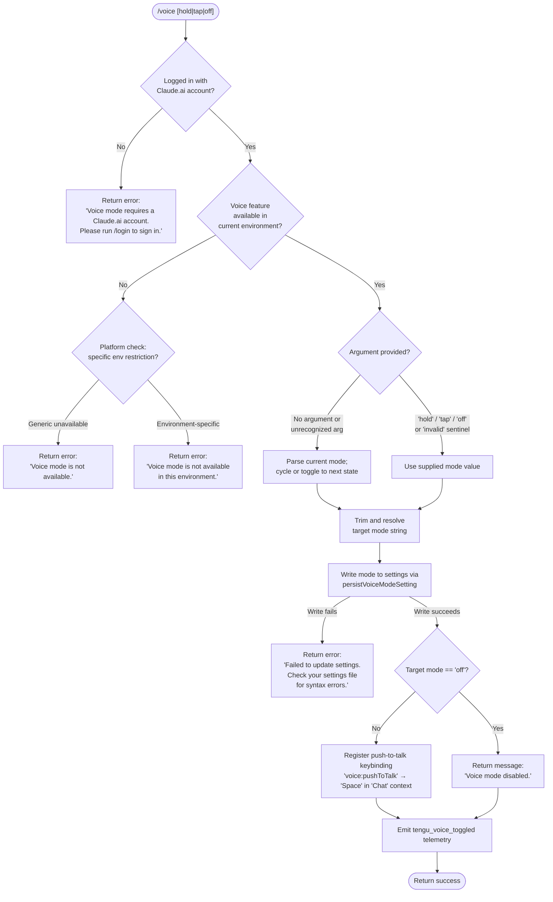

# `/voice`

> Analysis basis: CC v2.1.145 bundle.js (AST extraction + Claude interpretation)
> Minimum version: v2.1.145

---

## Overview

The `/voice` command toggles voice input mode in Claude Code, allowing users to switch between `hold`, `tap`, and `off` interaction styles. It validates account eligibility and environment support before modifying the voice-mode setting, and registers a push-to-talk keybinding when voice is enabled. The command persists the chosen mode to settings and emits a telemetry event on every state change.

---

## Registration

| Field | Value |
|---|---|
| type | `local` |
| name | `voice` |
| description | `Toggle voice mode` |
| argumentHint | `[hold\|tap\|off]` |
| supportsNonInteractive | `false` |
| isHidden | `null` |
| module_id | `tkq` |
| load_inline | `true` |
| loc_byte | `11988515` |
| loc_byte_end | `11988757` |
| loc_line | `7752` |
| arbor_handler.name | `wp7` |
| arbor_handler.fqn | `claude-2.1.145::wp7` |
| arbor_handler.kind | `AsyncFunction` |
| arbor_handler.resolution_path | `module_id` |
| arbor_handler.n_hits | `1` |

Analysis basis: CC v2.1.145 bundle.js:+11988515

---

## Input Branching

The handler has 5+ distinct paths based on account eligibility, environment availability, argument parsing, settings persistence success/failure, and current mode state; a Mermaid flowchart is used.



---

## Behavioral Spec

### Entry Point — Handler (`wp7`)

Analysis basis: CC v2.1.145 bundle.js:+11985969

```
async function voiceCommandHandler(args, context):

    // Step 1 — account gating
    accountInfo = loadAccountState(context)          // calls LD (loadDiskSettings)
    if not accountInfo.isClaudeAiAccount:
        return textResult("Voice mode requires a Claude.ai account. Please run /login to sign in.")

    // Step 2 — environment availability check
    voiceAvailability = checkVoiceEnvironmentSupport()  // calls g_ (getVoiceSupport)
    if voiceAvailability == UNAVAILABLE_GENERIC:
        return textResult("Voice mode is not available.")
    if voiceAvailability == UNAVAILABLE_ENV:
        return textResult("Voice mode is not available in this environment.")

    // Step 3 — argument parsing
    rawArg = args.trim()                              // calls Dp7 (parseVoiceArg)
    targetMode = resolveTargetMode(rawArg)            // 'hold' | 'tap' | 'off' | 'invalid'

    // Step 4 — if no valid arg, read current mode and cycle
    if targetMode == 'invalid' or rawArg == '':
        currentMode = readCurrentVoiceMode(context)   // reads from settings via Q_
        targetMode = cycleVoiceMode(currentMode)

    // Step 5 — persist setting
    writeOk = persistVoiceModeSetting(targetMode)     // calls Q_ (writeSettingsAndReload)
    if not writeOk:
        return textResult("Failed to update settings. Check your settings file for syntax errors.")

    // Step 6 — post-write actions
    emit telemetry: tengu_voice_toggled               // via 'd' telemetry call at +11986509 (bundle.js:+11986511)

    if targetMode == 'off':
        return textResult("Voice mode disabled.")

    // Step 7 — register keybinding for push-to-talk
    registerKeybinding(                               // calls IJ (registerKeybindingEntry)
        action  = "voice:pushToTalk",
        context = "Chat",
        key     = "Space"
    )

    // Step 8 — check microphone permission (macOS)
    // Guidance string references: "System Settings → Privacy & Security → Microphone"
    checkMicrophonePermission(context)                // calls $ (mcpStateManager) at +11987297

    return successResult()
```

Analysis basis: CC v2.1.145 bundle.js:+11985969, +11986010, +11986109, +11986194, +11986261, +11986330, +11986428, +11986509, +11986566, +11986626, +11986656, +11986735, +11986810, +11987085, +11987297, +11987776, +11987910, +11987928

---

### Sub-feature: Argument Normalization (`Dp7`)

Analysis basis: CC v2.1.145 bundle.js:+11985839

```
function parseVoiceArg(rawInput):
    trimmed = rawInput.trim()
    if trimmed == 'hold':   return 'hold'
    if trimmed == 'tap':    return 'tap'
    if trimmed == 'off':    return 'off'
    return 'invalid'            // sentinel for "no recognized argument"
```

Valid mode literals at: +11985886 (`hold`), +11985898 (`tap`), +11985909 (`off`), +11985930 (`invalid`).

---

### Sub-feature: Settings Read / Write (`Q_`)

Analysis basis: CC v2.1.145 bundle.js:+11986330

```
async function writeSettingsAndReload(targetMode, context):
    // Reads settings from disk paths:
    //   ~/.claude/settings.json        (userSettings)
    //   <project>/.claude/settings.json (projectSettings)
    //   <project>/.claude/settings.local.json (localSettings)
    currentSettings = loadSettingsFromDisk()    // calls Gu → yU8 → KfH
    updatedSettings = merge(currentSettings, { voiceMode: targetMode })
    ok = writeSettingsFile(updatedSettings)     // calls QC6 → g5H.writeFile
    if not ok: return false
    reloadSettingsInProcess()                   // emits KbH event at +1208513
    return true
```

Analysis basis: CC v2.1.145 bundle.js:+1207659 through +1208513

---

### Sub-feature: Voice Environment Check (`g_`)

Analysis basis: CC v2.1.145 bundle.js:+11986147

```
function checkVoiceEnvironmentSupport():
    support = getVoiceSupportInfo()    // calls Gu (loadSettingsFromDisk + platform checks)
    if support.available == false and support.reason == 'no_env':
        return UNAVAILABLE_ENV
    if support.available == false:
        return UNAVAILABLE_GENERIC
    return AVAILABLE
```

The string `"Voice mode is not available in this environment."` fires at +11986810 when an environment-specific block is detected. The string `"Voice mode is not available."` fires at +11986109 for generic unavailability.

---

### Sub-feature: Keybinding Registration (`IJ`)

Analysis basis: CC v2.1.145 bundle.js:+11987776

```
function registerKeybindingEntry(action, keyContext, key):
    // Loads keybindings.json from user config path
    existing = loadUserKeybindings()        // calls ft6 → XM6
    entry = { action: action, context: keyContext, key: key }
    // action  = "voice:pushToTalk"   (literal at +11987779)
    // context = "Chat"               (literal at +11987798)
    // key     = "Space"              (literal at +11987805)
    if entry already registered (dedup check via fu9.has):
        return   // no-op
    appendKeybinding(existing, entry)       // calls Mt6 → u7_
    persistKeybindings()                    // calls IJ internals
```

Analysis basis: CC v2.1.145 bundle.js:+11987779, +11987798, +11987805, +3762111, +3762122

---

### Sub-feature: Microphone Permission Guidance (`$`)

Analysis basis: CC v2.1.145 bundle.js:+11987297

When voice mode is being enabled (mode ≠ `off`) on macOS, the handler may surface guidance pointing users to **System Settings → Privacy & Security → Microphone** (literal at +11987317). This is surfaced via the MCP/state notification subsystem (`$` → `dvq`).

---

### Sub-feature: Settings Loader (`LD` / `loadDiskSettings`)

Analysis basis: CC v2.1.145 bundle.js:+11985980

```
function loadDiskSettings():
    // Reads layered settings in priority order:
    //   flagSettings, policySettings, userSettings,
    //   projectSettings, localSettings, SDK inline settings
    // Authentication check: requires ANTHROPIC_API_KEY or CLAUDE_CODE_OAUTH_TOKEN
    // Errors with: "ANTHROPIC_API_KEY or CLAUDE_CODE_OAUTH_TOKEN env var is required"
    //   (literal at +2917187)
    // 'firstParty' account type used for Claude.ai gating (literal at +2022785)
```

Analysis basis: CC v2.1.145 bundle.js:+2914813, +2914911, +2914932, +2914940, +2914966, +2915075, +2915179, +2916766, +2916860, +2916899, +2917187

---

## State & Side Effects

| Item | Detail |
|---|---|
| Telemetry | `tengu_voice_toggled` fired on every successful mode change (bundle.js:+11986511) |
| Settings mutation | Writes updated voice mode value to the user settings file (`~/.claude/settings.json`) |
| Keybinding registration | When mode ≠ `off`: registers `voice:pushToTalk` → `Space` in `Chat` context; deduplicated via a Set (`fu9`) |
| Event emission | `KbH.emit` fires after settings write to notify in-process listeners of settings reload (bundle.js:+1208513) |
| Account gating | Hard-stops if the logged-in account is not a Claude.ai account (no API-key-only path) |
| Environment gating | Hard-stops with a descriptive message when voice is unavailable in the current environment |
| Microphone permission | On macOS, may surface a guidance message referencing System Settings → Privacy & Security → Microphone |
| Sound | <!-- TODO: not found in depth-2 traversal; needs --depth 4 --> |

---

## Version History

| Version | Change |
|---|---|
| v2.1.145 | Initial analysis |

---

## Common Mistakes

1. **Running `/voice` without a Claude.ai account** — API-key-only sessions are blocked with an explicit error; users must run `/login` first.
2. **Calling `/voice` in an unsupported environment (e.g., certain remote/container setups)** — The environment check fires before any setting is written; the command returns an error without modifying state.
3. **Passing an unrecognized argument** — Any value other than `hold`, `tap`, or `off` is treated as the `invalid` sentinel, causing the command to fall through to the cycle-mode path rather than erroring, which may be surprising.
4. **Malformed settings file** — If `settings.json` has syntax errors, the write step fails and the command returns `"Failed to update settings. Check your settings file for syntax errors."` without changing voice state.
5. **Expecting a keybinding update when disabling voice** — The `voice:pushToTalk` keybinding is only registered when enabling voice (`hold` or `tap`); the `off` path skips keybinding registration entirely.

---

## Appendix — Identifier Mapping

> For bundle debugging only. Identifiers change across versions.

| Identifier | Role |
|---|---|
| `wp7` | Main async handler for `/voice` (arbor_handler) |
| `MtH` | Voice availability pre-check wrapper |
| `Wd_` | Inner check helper; calls `Boolean` to coerce availability flag |
| `LD` | Load disk settings (layered settings reader) |
| `RK` | Settings layer merger / resolver |
| `wv` | Auth-info reader (reads API key / OAuth token state) |
| `Q3` | Account type classifier (`firstParty` check) |
| `sj` | Settings value getter utility |
| `i$` | Auth validation: checks `ANTHROPIC_API_KEY` / `apiKeyHelper` / `none` |
| `S9H` | Sub-helper for auth state extraction |
| `vT6` | Voice feature flag reader |
| `g_` | Voice environment support checker |
| `Gu` | Settings-load orchestrator (start/end marks) |
| `OR` | Settings override resolver |
| `f1` | Performance/memory telemetry helper |
| `sx` | `require('perf_hooks')` wrapper |
| `yU8` | Core settings-from-disk loader; emits `settings_load_started` / `settings_load_completed` |
| `G8` | Settings file writer (appendFileSync / mkdirSync) |
| `lv6` | Settings log helper |
| `j16` | Flag-settings layer handler |
| `MJA` | Settings merge helper (Object.keys iteration) |
| `KfH` | Settings file path builder (`.claude/settings.json`) |
| `pB` | User-settings layer handler |
| `KJA` | SDK inline settings handler |
| `UB` | Settings object assembler |
| `q_` | Settings store getter |
| `q66` | Flag settings store |
| `DI8` | Policy settings store |
| `tH6` | User settings store |
| `WPH` | Project settings store |
| `K66` | Local settings store |
| `HfH` | SDK inline settings store |
| `_fH` | Settings override store |
| `TU8` | Settings cache store |
| `QjA` | Settings validation helper |
| `rc` | Settings result builder |
| `J16` | WSL / platform-specific settings loader |
| `cv6` | Settings completion notifier |
| `Dp7` | Voice argument parser (`hold` / `tap` / `off` / `invalid`) |
| `H` | Random-delay / setTimeout utility (also used as temp var in many places) |
| `Q_` | Settings write-and-reload function |
| `VO` | Settings persistence coordinator |
| `U6` | Path utilities |
| `kU8` | Settings snapshot builder |
| `GP` | File read guard |
| `dc` | File reader with encoding detection |
| `FM` | Filesystem stat / realpath helper |
| `I` | File-path normalizer / validator |
| `qC6` | File read utility with size limit (4096) |
| `KC6` | File content post-processor |
| `O8` | Async file helper |
| `A8` | Error-wrapping utility |
| `Rp8` | Settings timestamp recorder |
| `H2H` | Settings path resolver wrapper |
| `mb6` | Settings directory path builder |
| `y96` | Atomic file write helper (rename, fsync, fchmod) |
| `q` | Filesystem namespace (lstatSync, renameSync, unlinkSync, etc.) |
| `O` | Filesystem stat result wrapper |
| `k8` | Background session state sentinel (`stopped`) |
| `RH` | JSON serializer wrapper |
| `az` | Cache-clear utility (clears `dv6` and `eV8`) |
| `QC6` | Settings persistence implementation (mkdir, readFile, appendFile, writeFile) |
| `b6` | Async-local-storage context getter for settings |
| `AC6` | Settings store context accessor |
| `Pp8` | Git-ignore check initiator |
| `Tp8` | Git-ignore execution helper |
| `Y_` | Git check-ignore runner |
| `UCK` | Home-dir config path builder |
| `xR` | Settings path joiner (`.claude/settings.json`) |
| `NH` | Error logger / notification handler |
| `x_` | Error string formatter |
| `xH` | String coercion utility |
| `Hq` | Log entry formatter |
| `JOA` | Log string builder |
| `mhK` | Rolling log buffer manager |
| `d` | Telemetry event dispatcher |
| `M` | MCP server manager (top-level) |
| `ONH` | MCP server orchestrator |
| `Qe` | MCP config merger |
| `pqH` | MCP config layer processor |
| `ge` | MCP SDK entry builder |
| `DY6` | MCP SSE/HTTP config parser |
| `rv` | MCP result validator |
| `E3` | MCP error formatter |
| `lJ_` | MCP log helper |
| `e8` | MCP entry normalizer |
| `i26` | MCP dedup checker |
| `pf7` | MCP connection state checker |
| `qC_` | MCP needs-auth cache reader |
| `J18` | MCP server hash/ID builder |
| `ji` | MCP string identifier helper |
| `pJ` | MCP content hash (SHA-256) |
| `j18` | MCP server key builder |
| `bK` | MCP key normalizer |
| `_8` | MCP debug logger |
| `$R_` | MCP connection runner |
| `d77` | MCP connection initializer |
| `mB` | MCP transport factory |
| `y6H` | MCP OAuth server / SSE handler |
| `zoH` | MCP in-flight request tracker |
| `D` | Background session dispatcher |
| `RD8` | MCP reconnect-state cache reader |
| `qd` | MCP reconnect orchestrator |
| `Wu` | MCP transport layer |
| `Y` | MCP supervisor config updater |
| `O7` | MCP error logger |
| `GH` | String error formatter |
| `c77` | MCP connection timeout helper |
| `Q77` | SSH environment detector |
| `OR_` | MCP OAuth completion handler |
| `OoH` | MCP pending-connection getter |
| `YoH` | MCP in-flight getter |
| `A_q` | MCP async queue processor |
| `Q1` | Async-local-store getter |
| `_w8` | MCP needs-auth cache path builder |
| `fR_` | MCP request router |
| `FJ_` | MCP tool-list filter |
| `H8` | MCP tool schema builder |
| `A` | Platform string utility |
| `j` | Background process manager |
| `y` | Background worker write helper |
| `t8q` | MCP batch request processor |
| `mn` | Async-iterable / stream mapper |
| `r26` | MCP port parser (parseInt) |
| `KC_` | MCP port parser variant |
| `y_K` | MCP server update applier |
| `Aw8` | MCP update serializer |
| `vI` | MCP cleanup orchestrator |
| `VoH` | MCP cleanup state reader |
| `$` | MCP state manager / notification bus |
| `dvq` | Daemon status writer |
| `Jl` | Daemon log appender |
| `KT6` | Daemon status file path builder (`daemon.status.json`) |
| `nL5` | MCP remote server retry manager |
| `X18` | MCP server filter (D04 / w04 set checks) |
| `g8` | Daemon spawn-with-timeout helper |
| `IJ` | Keybinding registration entry point |
| `ft6` | Keybinding file loader |
| `XM6` | Keybinding config parser (reads `keybindings.json`) |
| `R7_` | Keybinding block normalizer |
| `Xm` | Keybinding context builder |
| `E1H` | Keybinding file path builder |
| `u6` | JSON.parse wrapper |
| `CH` | Conditional logger |
| `qt6` | Keybinding array validator |
| `_t6` | Keybinding entry iterator |
| `tx9` | Keybinding fallback logger |
| `h7_` | Keybinding duplicate detector |
| `S7_` | Keybinding block validator |
| `hH` | Conditional debug logger |
| `Mt6` | Keybinding entry appender |
| `u7_` | Keybinding action resolver (`lcL`) |
| `lcL` | Keybinding action lookup |
| `T3H` | Keybinding map transformer |
| `ghH` | Locale/language helper (`en` detection) |
| `h6` | Config file watcher setup |
| `a1_` | Config file path resolver |
| `R$H` | Global config reader/writer |
| `hR` | Config value prefix stripper |
| `Wv9` | Config backup directory handler |
| `qq_` | Config backup path builder |
| `w` | Background worker spawner |
| `C` | Child process manager |
| `bT6` | Platform memory / macOS helper |
| `u` | Background worker lifecycle manager |
| `Z6` | Background session initializer |
| `Is_` | Background session connection handler |
| `Rs_` | Background session roster manager |
| `S` | Background session state machine |
| `YxL` | Config file-watch installer |
| `cl` | Config change debouncer |
| `h9` | Native watcher registrar (`w6A.register`) |

---

Note: index built via Arbor fallback; some signals (telemetry, literals) may be missing — see arbor-fallback.js.