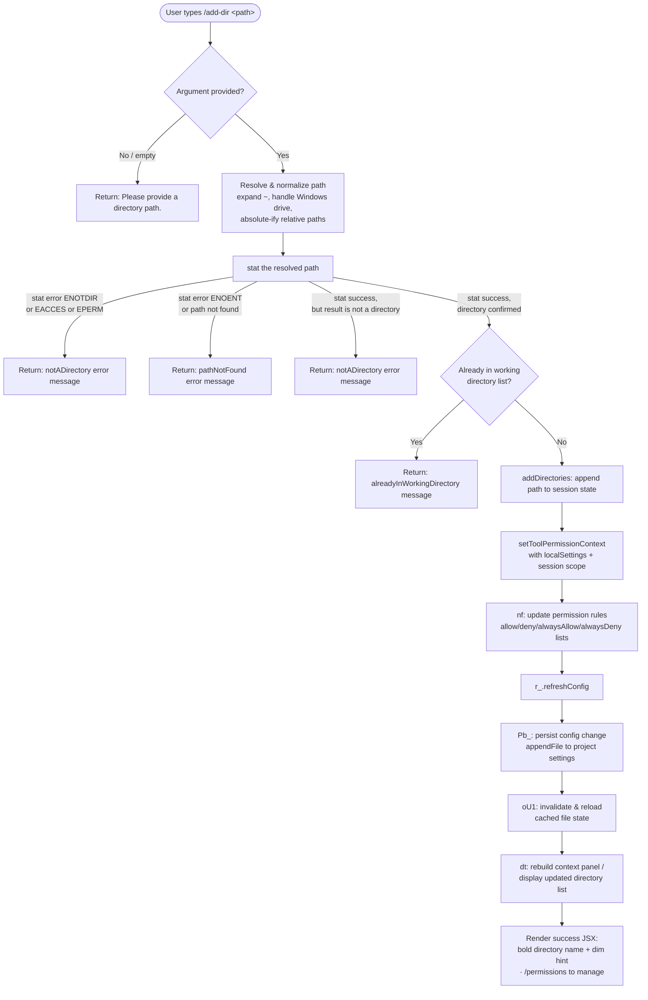

# `/add-dir`

> Analysis basis: CC v2.1.144 bundle.js (AST extraction + Claude interpretation)
> Minimum version: v2.1.144

---

## Overview

`/add-dir` allows the user to register an additional filesystem directory as a working directory for the current Claude Code session. It resolves, validates, and stats the supplied path before updating the session's working-directory list and refreshing the tool-permission context. The command provides rich inline feedback for all failure modes (empty input, not-a-directory, permission errors, path-not-found, already-registered).

---

## Registration

| Field | Value |
|---|---|
| type | `local-jsx` |
| name | `add-dir` |
| description | Add a new working directory |
| argumentHint | `<path>` |
| module_id | `Bqq` |
| load_inline | `true` |
| loc_byte | `10052277` |
| loc_byte_end | `10052425` |
| loc_line | `5555` |
| arbor_handler.name | `jz7` |
| arbor_handler.fqn | `claude-2.1.144::jz7` |
| arbor_handler.kind | `AsyncFunction` |
| arbor_handler.resolution_path | `module_id` |
| arbor_handler.n_hits | `0` |

Analysis basis: CC v2.1.144 bundle.js:+10052277

---

## Input Branching

The handler has 6+ distinct outcome paths, so a Mermaid flowchart is used.



Analysis basis: CC v2.1.144 bundle.js:+10051059 – +10051854

---

## Behavioral Spec

### 1. Entry Point — Handler (`jz7`)

The Arbor-resolved handler is `jz7` (AsyncFunction, `claude-2.1.144::jz7`, resolution via `module_id`).

```
async function handleAddDir(userInput, appContext):
    rawArg = userInput.trim()
    if rawArg is empty:
        return JSX { "Please provide a directory path." }

    resolvedPath = resolvePath(rawArg)          // see §2
    statResult   = await validateDirectory(resolvedPath)  // see §3

    if statResult.kind == "emptyPath":
        return JSX { "Please provide a directory path." }
    if statResult.kind == "notADirectory":
        return JSX { error message for non-directory }
    if statResult.kind == "pathNotFound":
        return JSX { error message for missing path }
    if statResult.kind == "alreadyInWorkingDirectory":
        return JSX { error message for duplicate }

    // statResult.kind == "success"
    appState = getAppState()
    appState.addDirectories([resolvedPath])      // loc +10051095

    setToolPermissionContext(
        scope      = "session",                  // loc +10051158
        settings   = "localSettings",            // loc +10051142
        path       = resolvedPath
    )

    updatePermissionRules(appContext)            // nf — see §4
    refreshConfig()                              // r_.refreshConfig loc +10051253
    persistConfigChange(resolvedPath)            // Pb_ — see §5
    invalidateFileCache()                        // oU1 — see §6

    return JSX {
        bold(resolvedPath),
        dim("· /permissions to manage")          // loc +10051623
    }
```

Analysis basis: CC v2.1.144 bundle.js:+10051059

---

### 2. Path Resolution (`q1` / `gUH` sub-path)

```
function resolvePath(rawInput):
    s = rawInput.trim()
    if s contains null bytes:
        throw TypeError("Path contains null bytes")   // loc +997024

    // Tilde expansion
    if s starts with "~/":
        homeDir = os.homedir()                        // BR6.homedir loc +997131
        s = join(homeDir, s.slice(2))                 // loc +997191

    // Windows drive-letter handling
    if platform == "windows":
        s = applyWindowsPathNormalization(s)          // loc +997260

    // Normalize and make absolute
    s = path.normalize(s)                             // RV.normalize loc +997080
    if not path.isAbsolute(s):
        s = path.resolve(s)                           // RV.resolve loc +997384

    // macOS /var → /private/var alias resolution (jS sub-path)
    s = resolveVarAlias(s)                            // loc +12208169 / +12208210

    return s
```

Analysis basis: CC v2.1.144 bundle.js:+996771

---

### 3. Directory Validation (`gUH`)

```
async function validateDirectory(resolvedPath):
    if resolvedPath is empty:
        return { kind: "emptyPath" }                  // loc +3728173

    try:
        stats = await fs.stat(resolvedPath)           // Fb1.stat loc +3728226
    catch err:
        if err.code in ["ENOTDIR", "EACCES", "EPERM"]: // loc +3728361/+3728376/+3728390
            return { kind: "notADirectory" }
        if err.code == "ENOENT" or path-not-found:    // loc +3728416
            return { kind: "pathNotFound" }
        return { kind: "pathNotFound" }               // fallback

    if not stats.isDirectory():
        return { kind: "notADirectory" }              // loc +3728271

    currentDirs = appState.workingDirectories         // y_/getAppState loc +10049670
    if currentDirs.includes(resolvedPath):
        return { kind: "alreadyInWorkingDirectory" }  // loc +3728527

    return { kind: "success" }                        // loc +3728603
```

Analysis basis: CC v2.1.144 bundle.js:+3728192

---

### 4. Permission-Rule Update (`nf`)

```
function updatePermissionRules(context):
    // Processes setMode requests; bypassPermissions is gated
    if mode == "bypassPermissions" and bypassPermissionsDisabled:
        log("Ignoring permission update: setMode 'bypassPermissions' rejected …")
        // loc +4595153
        return

    applyRuleSet(context, [
        { key: "addRules",          subkeys: ["allow","alwaysAllowRules",
                                               "deny","alwaysDenyRules",
                                               "alwaysAskRules"] },  // loc +4595429–4595679
        { key: "replaceRules" },    // loc +4595777
        { key: "removeRules" },     // loc +4596434
        { key: "removeDirectories" } // loc +4596818
    ])

    // Filter out rules already in active set (L.has check loc +4596759)
    // Delete stale entries (A.delete loc +4597046)
```

Analysis basis: CC v2.1.144 bundle.js:+4595151

---

### 5. Config Persistence (`Pb_`)

```
async function persistConfigChange(resolvedPath):
    // Locate project settings file (NFC normalisation for macOS)
    configPath = path.join(projectRoot, configFile)   // Nw.join loc +12140926
    normalized = resolvedPath.normalize("NFC")         // loc +12140777

    // In production environment: read → merge → write
    if ENV != "test":                                  // loc +12140513
        existing = await fs.readFile(configPath, "utf8")  // loc +12140969
        merged   = mergeConfig(existing, { addDirectories: [normalized] })

        // Atomic write: mkdir if needed, appendFile
        await fs.mkdir(dirname(configPath), {recursive: true})  // loc +12141051
        await fs.appendFile(configPath, merged,
            { mode: 0o700 })                           // octal 448 loc +12141093
        // mode 0o600 = 384 for sensitive variant      // loc +12141160

    logConfigChange(resolvedPath)                      // kH loc +12141028
```

Analysis basis: CC v2.1.144 bundle.js:+12140717

---

### 6. File-Cache Invalidation (`oU1`)

```
async function invalidateFileCache():
    clearCacheEntries()                // FX / y3H.delete loc +4028832
    entries = await loadDirectoryState()  // B9 loc +4032219
    for each entry in entries:
        stat = await fs.stat(entry.path)  // UX.stat loc +4028971
        if stat changed:
            invalidate(entry)
            reload via readFile          // UX.readFile loc +4029357
            parse JSON                   // b6/JSON.parse loc +4029462
            update cache                 // y3H.set loc +4029623
    // Guard numeric validity
    if not Number.isFinite(result):    // loc +4029735
        clearAllCache()                // y3H.clear loc +4029840
```

Analysis basis: CC v2.1.144 bundle.js:+4032201

---

### 7. CLI Flag Equivalent

The literal `"--add-dir"` at loc +10051283 indicates that the `/add-dir` slash command maps to the `--add-dir` CLI flag, allowing the same working-directory registration to be performed at startup without an interactive session.

Analysis basis: CC v2.1.144 bundle.js:+10051283

---

### 8. Success Rendering (`QUH`)

```
function renderSuccess(resolvedPath):
    dirName = path.dirname(resolvedPath)    // Ws6.dirname loc +3728824
    return JSX:
        bold(resolvedPath)                  // z6.bold loc +10051330
        dim("· /permissions to manage")     // z6.dim loc +10051616
```

The failure case emits the static string `"Did not add a working directory."` (loc +10051759) when the outcome is not `"success"`.

Analysis basis: CC v2.1.144 bundle.js:+10051810

---

## State & Side Effects

| Item | Detail |
|---|---|
| Telemetry | `tengu_daemon_config_reload` (loc +14556317) — fired when the daemon detects and applies the config reload triggered by the directory addition |
| appState changes | `addDirectories` key updated with the new resolved path (loc +10051095) |
| Tool permission context | `setToolPermissionContext` called with scope `"session"` and settings layer `"localSettings"` (loc +10051142, +10051158) |
| Config refresh | `r_.refreshConfig()` called after state update (loc +10051253) |
| Config file write | Project settings file appended/updated via `fs.appendFile` with mode `0o700` (448) or `0o600` (384) (loc +12141093, +12141160) |
| File-cache invalidation | All cached directory-state entries cleared and reloaded (loc +4032201) |
| Permission-rule update | `allow`, `deny`, `alwaysAllow`, `alwaysDeny`, `alwaysAsk` rule sets re-evaluated (loc +4595429–4596818) |
| Hook registration | `OHA.register` called inside write-through path (`h1`, loc +57049) |
| Sound | None detected in depth-2 traversal |

---

## Version History

| Version | Change |
|---|---|
| v2.1.144 | Initial analysis |

---

## Common Mistakes

1. **Supplying a file path instead of a directory path** — `stat` will succeed but `isDirectory()` returns false, producing a `notADirectory` error. Always pass the parent directory, not a file within it.
2. **Omitting the argument entirely** — the command returns `"Please provide a directory path."` immediately without opening any interactive prompt.
3. **Using a relative path when the cwd is unexpected** — the handler normalizes and resolves relative paths against the current process working directory, which may differ from the active project root. Prefer absolute paths or `~/`-prefixed paths.
4. **Adding a directory already in the session list** — the handler detects this with an `includes` check and returns `"alreadyInWorkingDirectory"` without duplicating the entry.
5. **Expecting instant tool availability** — after the command completes, tool-permission context is updated synchronously, but the full MCP/config reload (`tengu_daemon_config_reload`) is asynchronous; tools referencing the new directory may take a moment to become available.
6. **Assuming the command persists across sessions without project config** — persistence requires a writable project-settings file. If the file cannot be written (permissions, read-only filesystem), the in-session state is updated but the directory will not be present in a future session.

---

## Appendix — Identifier Mapping

> For bundle debugging only. Identifiers change across versions.

| Identifier | Role |
|---|---|
| `jz7` | Main handler for `/add-dir` (AsyncFunction, Arbor-resolved entry point) |
| `y_` | App-state accessor — retrieves current working directory list |
| `Xb_` | Working-directory list helper (reads `allowed_tools`, `avoid_prompts`, `effort`, `model` config fields) |
| `Y1` | Constant / sentinel used in directory-list logic |
| `nf` | Permission-rule updater — processes addRules / replaceRules / removeRules / removeDirectories |
| `v` | Low-level config read/write utility (handles debug, redaction, encoding) |
| `vfK` | Config-field accessor layer (calls `IV`, `IfK`, `YHA`) |
| `YHA` | Sub-config helper (calls `N4K`, `k4K`) |
| `CH` | JSON serialization helper (`JSON.stringify` wrapper) |
| `x4` | Path/extension utility (basename extraction, extension normalization) |
| `d8A` | File-extension map builder |
| `YhH` | Write helper for config output (`h8A` → `H.write`) |
| `h8A` | Raw write wrapper |
| `yfK` | Atomic write orchestrator (uses `kfK`, `s8A`, `a8A`, `Buffer.byteLength`) |
| `pSH` | Async write-queue / debounced flush (uses `clearTimeout`, `setTimeout`, `setImmediate`) |
| `z_H` | Path-join helper for config directories (`EXH.join`, `n8`, `I6`) |
| `kN8` | Config merge helper (`A8`) |
| `s8A` | Config path builder (`EXH.join`, `I6`) |
| `a8A` | Atomic rename helper (`av.stat`, `av.rename`, `av.unlink`) |
| `kfK` | Config write-through (mkdir + appendFile + merge) |
| `h1` | Hook registration wrapper (`OHA.register`) |
| `Pf` | Rule-string escape helper (`xRK` → `H.replaceAll`) |
| `xRK` | Regex-special-char escaper (`\\`, `\(`, `\)`) |
| `nv` | Current working directories accessor |
| `Y` | Supervisor / watcher manager (start/stop/updateConfig) |
| `dJH` | File-watch event handler (`ENOENT` guard, key iteration) |
| `n9` | Async-local-storage store getter (`viL.getStore`) |
| `A8` | Error-code helper |
| `LQ_` | Watch-event queue helper (`KQ_`) |
| `GH` | String coercion utility |
| `_Nq` | Key-width calculator for display (`Math.max`, `Object.keys`) |
| `T` | Input-event interceptor (`preventDefault`, `LW`) |
| `LW` | Config-reload trigger (`g_`) |
| `g_` | Full config load/merge orchestrator (reads policySettings, flagSettings, userSettings, projectSettings) |
| `Z` | Watcher instance (start/stop/updateConfig) |
| `vAK` | Heartbeat / watcher-start helper (`xs`) |
| `xs` | Heartbeat scheduler |
| `V` | Secondary watcher / display updater |
| `CH6` | Formatted-output helper used at success render |
| `Pb_` | Project-config persistence function (realpath, readFile, mkdir, appendFile) |
| `lJH` | Environment detector (`production`, `test`) |
| `xH` | String normalization wrapper |
| `jSq` | Config-path segment builder |
| `qR` | Config read helper |
| `O8` | Structured error builder (`A8`) |
| `FU` | Utility wrapper (`WV`) |
| `WV` | Core write-value helper |
| `q_` | Secondary write-value helper (`WV`) |
| `kH` | Audit log / change recorder (`b_`, `xH`, `Aq`, `bkK`, `HCH.push`, `Sc.logError`) |
| `b_` | Error-to-string converter |
| `Aq` | Diff/change record builder (`D3A`) |
| `D3A` | Deep-diff utility |
| `bkK` | Ring-buffer manager for change history (`ER6.shift`, `ER6.push`) |
| `oU1` | File-cache invalidation orchestrator (`FX`, `B9`, `v5`) |
| `FX` | Cache-clear helper (`y3H.delete`) |
| `B9` | Directory-state loader (stat + readFile + JSON parse + cache set/clear) |
| `b6` | JSON parse wrapper |
| `v5` | Cache-write helper (`fz`, `BX.join`, `CH`) |
| `fz` | Atomic file writer (randomBytes temp name, writeFile, rename, copyFile, unlink) |
| `dt` | Context-panel / directory-list renderer (Dl1, V8, g_) |
| `M$_` | Panel state initializer |
| `Dl1` | Directory-entry list builder (maps entries through V8, i84, jO, g_) |
| `z$6` | Entry formatter (`V8`) |
| `V8` | Visual label builder (`Lb6`, `kB`) |
| `i84` | Single-entry resolver (`XO`, `BM`, `m6`, `$X`, `f9`) |
| `XO` | Path-display formatter (`o5H`, `kB`) |
| `BM` | Symlink/device-type checker (`lstatSync`, `realpathSync`, isFIFO, isSocket, isCharacterDevice, isBlockDevice) |
| `$X` | Relative-path shortener (`Rc`) |
| `a84` | Additional entry metadata helper |
| `jO` | Rule-string formatter (`mRK`, `WE`, `pRK`, `uRK`) |
| `mRK` | Rule-prefix builder |
| `WE` | Object.hasOwn check wrapper |
| `pRK` | Rule-body extractor |
| `uRK` | Rule-string replacer (`H.replaceAll`) |
| `M` | MCP server map / tool-permission map accessor (`dvH`, `k6K`, `vq5`) |
| `dvH` | MCP connection handler (disabled/stdio/sse/http/sse-ide/ws-ide types) |
| `k6K` | MCP update applier (`applyMcpUpdate`, `cleanup`, `Pv`, `GJ`) |
| `$` | MCP value resolver (`NVq`) |
| `vq5` | MCP client filter/refresh (`getClients`, `dvH`, `k6K`) |
| `gUH` | Path validation orchestrator (`q1`, `Fb1.stat`, `$n`, `jS`) |
| `q1` | Path normalizer/resolver (tilde, Windows, null-byte, absolute) |
| `C6` | Context-store reader (`kR6`, `q_`) |
| `kR6` | Async-local-store accessor (`NR6.getStore`, `ad`) |
| `$n` | Already-registered check (`q_`) |
| `jS` | macOS /var alias resolver (`uW`, `xd_`, `qa`) |
| `uW` | Lowercase path helper |
| `xd_` | Platform-specific path alias table (`c6`, `bP`) |
| `qa` | Final path clean-up |
| `QUH` | Success JSX renderer (`z6.bold`, `Ws6.dirname`) |

---

Note: index built via Arbor fallback; some signals (telemetry, literals) may be missing — see arbor-fallback.js.