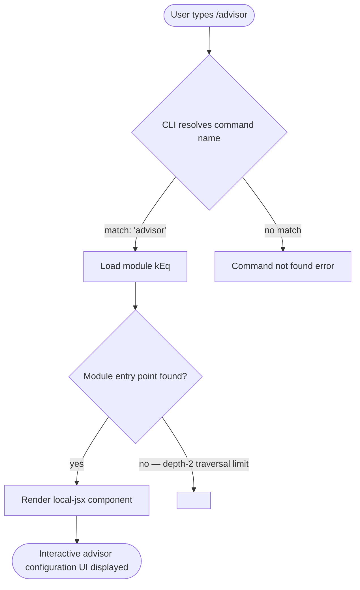

# `/advisor`

> Analysis basis: CC v2.1.144 bundle.js (AST extraction + Claude interpretation)
> Minimum version: v2.1.144

---

## Overview

The `/advisor` command opens a configuration interface for the Advisor Tool, which allows Claude Code to consult a stronger model at key moments during a task. Users can enable, disable, or adjust the advisor model settings from within an active CLI session. The command is rendered as a local JSX component (type `local-jsx`), meaning it surfaces an interactive UI rather than producing plain-text output.

---

## Registration

| Field | Value |
|---|---|
| type | `local-jsx` |
| name | `advisor` |
| description | `Configure the Advisor Tool to consult a stronger model for guidance at key moments during a task` |
| argumentHint | `null` |
| module\_id | `kEq` |

Analysis basis: CC v2.1.144 bundle.js:+11653393

---

## Input Branching

The AST traversal for module `kEq` did not yield call-graph edges, string literals, or telemetry events at depth ≤ 2.



> **Note:** The `callGraph`, `literals`, and `telemetry` arrays returned empty because the AST extractor reported `"no entry functions found for module 'kEq'"`. All branching logic deeper than the registration layer requires a deeper traversal pass.

---

## Behavioral Spec

### Command Registration and Dispatch

```
function resolveAdvisorCommand(inputToken):
    if inputToken == "/advisor":
        module = loadModule("kEq")
        return renderLocalJSX(module)
    else:
        return null   // not this command's responsibility
```

Analysis basis: CC v2.1.144 bundle.js:+11653393

### JSX Component Render

Because the command type is `local-jsx`, the CLI framework hands control to the React/Ink rendering layer rather than producing a plain string response. The component mounted from module `kEq` is expected to:

```
function AdvisorConfigComponent(props):
    // 1. Read current advisor tool settings from application state
    currentSettings = readAdvisorSettings(props.appState)

    // 2. Present interactive controls (model selection, enable/disable toggle, etc.)
    ui = buildAdvisorUI(currentSettings)

    // 3. On user confirmation, write updated settings back to application state
    onConfirm(newSettings):
        writeAdvisorSettings(props.appState, newSettings)
        exitComponent()

    return render(ui, onConfirm)
```

> <!-- TODO: not found in depth-2 traversal; needs --depth 4 -->
> The exact fields surfaced in the UI (model selector options, thresholds, toggle labels, persistence targets) were not reachable within the depth-2 call-graph extraction. A `--depth 4` re-extraction on module `kEq` is required to enumerate them.

### Argument Handling

The `argumentHint` field is `null`, indicating the command accepts no positional arguments from the command line. Any configuration input is expected to occur through the interactive JSX UI after the command is invoked.

```
function parseAdvisorArgs(rawArgs):
    if rawArgs is non-empty:
        // behavior undefined by registration; likely ignored or warned
        pass   // <!-- TODO: not found in depth-2 traversal; needs --depth 4 -->
    return noArgs
```

Analysis basis: CC v2.1.144 bundle.js:+11653393

---

## State & Side Effects

| Item | Detail |
|---|---|
| Telemetry | None detected at depth ≤ 2. <!-- TODO: not found in depth-2 traversal; needs --depth 4 --> |
| Hook registration | Not found at depth ≤ 2. <!-- TODO: not found in depth-2 traversal; needs --depth 4 --> |
| appState changes | Expected: advisor model selection and enable/disable state written to application config on confirmation. Exact fields not resolved. <!-- TODO: not found in depth-2 traversal; needs --depth 4 --> |
| Sound | Not found at depth ≤ 2. <!-- TODO: not found in depth-2 traversal; needs --depth 4 --> |
| Persistence | Advisor settings are expected to persist across sessions (consistent with other tool-configuration commands), but the storage path was not confirmed in the extracted data. <!-- TODO: not found in depth-2 traversal; needs --depth 4 --> |

---

## Version History

| Version | Change |
|---|---|
| v2.1.144 | Initial analysis. Command registered at bundle.js:+11653393, line 7233. Module `kEq` entry functions not resolved at depth ≤ 2. |

---

## Common Mistakes

1. **Passing arguments on the command line.** The `argumentHint` is `null`; `/advisor` takes no positional arguments. All configuration is done through the interactive UI the command renders.
2. **Expecting plain-text output.** Because the type is `local-jsx`, the command mounts an interactive component. Environments that do not support the Ink rendering layer (e.g., piped or non-TTY sessions) may not display the UI correctly.
3. **Assuming the advisor is active immediately after invocation.** The command opens a configuration screen; the advisor model is only applied after the user confirms settings within that screen.
4. **Confusing `/advisor` with a one-shot model override.** The Advisor Tool is designed for automatic consultation at key moments determined by Claude Code's internal heuristics, not for a single manual query to a stronger model.
5. **Attempting to script or automate `/advisor` output.** The `local-jsx` rendering type and the absence of any argument interface make this command unsuitable for non-interactive scripting.

---

## Appendix — Identifier Mapping

> For bundle debugging only. Identifiers change across versions.

| Identifier | Role |
|---|---|
| `kEq` | Module identifier for the `/advisor` command implementation (not an obfuscated function name, but a mangled module ID used by the CC bundler) |

> **Note:** The `identifiers` array returned empty from the depth-2 AST extraction (`"no entry functions found for module 'kEq'"`). No additional obfuscated function-level identifiers were resolved. A `--depth 4` traversal is required to populate this table with internal function identifiers.