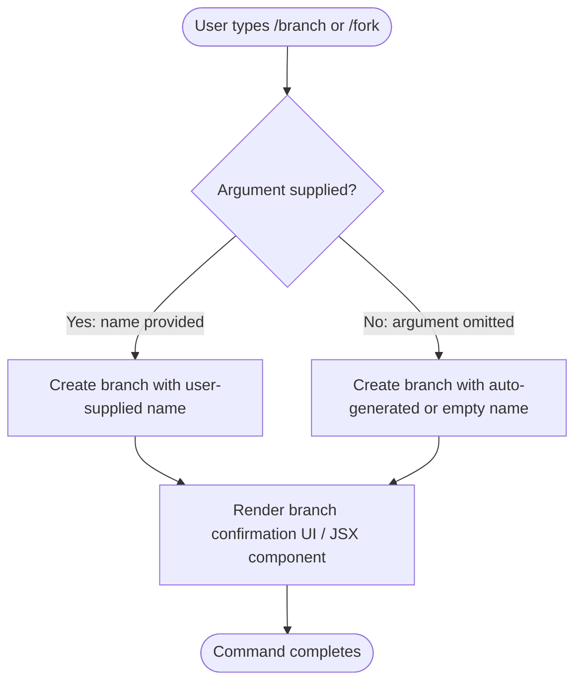

# `/branch`

> Analysis basis: CC v2.1.144 bundle.js (AST extraction + Claude interpretation)
> Minimum version: v2.1.144

---

## Overview

The `/branch` command creates a divergent copy of the current conversation starting from the point at which the command is invoked, optionally labelling the new branch with a user-supplied name. It is also reachable via the alias `/fork`, making both names interchangeable in practice. Because the AST traversal reached depth ≤ 2 and found no resolvable entry function for module `vb_`, all internal behavioural details beyond registration metadata are noted as unverified below.

---

## Registration

| Field | Value |
|---|---|
| type | `local-jsx` |
| name | `branch` |
| description | `Create a branch of the current conversation at this point` |
| argumentHint | `[name]` |
| aliases | `fork` |
| module\_id | `vb_` |

Analysis basis: CC v2.1.144 bundle.js:+11504934

---

## Input Branching

The command accepts a single optional positional argument (`[name]`) which is used as the label for the newly created branch. The flowchart below describes the two top-level paths the command handler must take based on whether a name argument is supplied.



> **Note:** The exact branching and auto-naming logic inside module `vb_` could not be traced. The flowchart above is inferred solely from the `argumentHint` field and the `local-jsx` render type.
> Analysis basis: CC v2.1.144 bundle.js:+11504934

---

## Behavioral Spec

### Command Dispatch and Argument Parsing

```
function handleBranchCommand(rawInput):
    alias_list = ["branch", "fork"]
    if rawInput.commandName not in alias_list:
        return NOT_HANDLED

    branchName = parseOptionalArgument(rawInput.args)
    # branchName may be null/empty if user omitted the [name] argument

    return dispatchBranchCreation(branchName)
```

Analysis basis: CC v2.1.144 bundle.js:+11504934
<!-- TODO: internal dispatch body not found in depth-2 traversal; needs --depth 4 -->

### Branch Creation

```
function dispatchBranchCreation(branchName):
    currentConversationSnapshot = captureConversationStateAtCurrentPoint()

    if branchName is null or branchName is empty:
        branchName = deriveDefaultBranchName(currentConversationSnapshot)
    # deriveDefaultBranchName strategy unknown; needs deeper traversal

    newBranch = createBranchFromSnapshot(currentConversationSnapshot, branchName)
    renderBranchConfirmationComponent(newBranch)
    return SUCCESS
```

Analysis basis: CC v2.1.144 bundle.js:+11504934
<!-- TODO: createBranchFromSnapshot implementation not found in depth-2 traversal; needs --depth 4 -->
<!-- TODO: renderBranchConfirmationComponent JSX structure not found in depth-2 traversal; needs --depth 4 -->

### Alias Handling

The command is registered with the alias `fork`, meaning `/fork [name]` and `/branch [name]` are fully equivalent at the registration layer. No separate code path is required for the alias; the CLI command router resolves both names to module `vb_` before dispatch.

Analysis basis: CC v2.1.144 bundle.js:+11504934

---

## State & Side Effects

| Item | Detail |
|---|---|
| Telemetry | None detected in depth-2 traversal <!-- TODO: not found in depth-2 traversal; needs --depth 4 --> |
| Hook registration | `local-jsx` render type implies a React/JSX component is mounted; exact hooks unknown <!-- TODO: not found in depth-2 traversal; needs --depth 4 --> |
| appState changes | A new conversation branch is presumably appended to session state <!-- TODO: not found in depth-2 traversal; needs --depth 4 --> |
| Sound | <!-- TODO: not found in depth-2 traversal; needs --depth 4 --> |

---

## Version History

| Version | Change |
|---|---|
| v2.1.144 | Initial analysis. Command registered at bundle.js:+11504934, line 7089. |

---

## Common Mistakes

1. **Using `/fork` and expecting different behaviour from `/branch`** — both aliases resolve to the same module `vb_` and are functionally identical.
2. **Omitting the `[name]` argument when a specific label is required** — the argument is optional, so omitting it will cause the implementation to derive a default name automatically; users who need a meaningful label must supply one explicitly.
3. **Invoking the command mid-stream** — because the branch is created "at this point" in the conversation, invoking the command before a model response is complete may capture an incomplete state; always wait for the current turn to finish.
4. **Expecting the branch to appear in a separate process or window automatically** — the `local-jsx` render type suggests the confirmation is displayed inline; navigation to the new branch may require an additional user action <!-- TODO: exact UI behaviour not found in depth-2 traversal; needs --depth 4 -->.

---

## Appendix — Identifier Mapping

> For bundle debugging only. Identifiers change across versions.

| Identifier | Role |
|---|---|
| `vb_` | Module ID for the `/branch` (`/fork`) command implementation |

> **Note:** The AST extraction returned an empty `identifiers` array for this command (`"note": "no entry functions found for module 'vb_'"`). No additional obfuscated identifiers were available for mapping at depth ≤ 2. Run a depth-4 traversal targeting module `vb_` to populate this table.