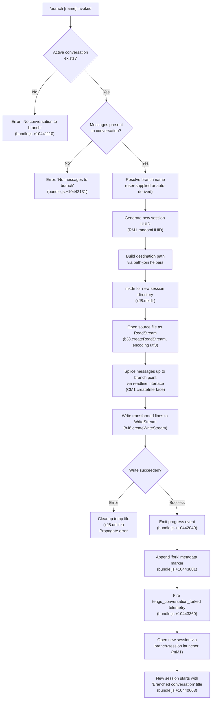

# `/branch`

> Analysis basis: CC v2.1.146 bundle.js (AST extraction + Claude interpretation)
> Minimum version: v2.1.146

---

## Overview

`/branch` (alias `/fork`) creates a divergent copy of the current conversation at the point it is invoked, capturing the existing message history and writing it into a new session file so the user can explore an alternative path without affecting the original. The command locates the current conversation's backing store, streams a snapshot of messages into a fresh file, then opens a new Claude Code session whose initial history matches the branch point.

---

## Registration

| Field | Value |
|---|---|
| type | `local-jsx` |
| name | `branch` |
| description | `Create a branch of the current conversation at this point` |
| argumentHint | `[name]` |
| aliases | `["fork"]` |
| module_id | `rm_` |
| load_inline | `true` |
| loc_byte | `11905989` |
| loc_byte_end | `11906183` |
| loc_line | `9800` |
| arbor_handler.name | `zW7` |
| arbor_handler.fqn | `claude-2.1.146::zW7` |
| arbor_handler.kind | `AsyncFunction` |
| arbor_handler.resolution_path | `module_id` |
| arbor_handler.n_hits | `0` |

Analysis basis: CC v2.1.146 bundle.js:+11905989

---

## Input Branching

The command has four distinct outcome paths based on the state of the current session and its message history:



---

## Behavioral Spec

### Top-Level Handler — `zW7`

The Arbor-resolved handler `zW7` is an `AsyncFunction` that serves as the command entry point. It delegates to the branch orchestrator `mM1`.

Analysis basis: CC v2.1.146 bundle.js:+10444145

```
async function branchCommandHandler(context):
    return await branchOrchestrator(context)
```

### Branch Orchestrator — `mM1`

`mM1` is the primary orchestration function. It coordinates conversation lookup, file copying, metadata tagging, and new-session launch.

Analysis basis: CC v2.1.146 bundle.js:+10443056

```
async function branchOrchestrator(context):
    // 1. Initialise session registry lookup
    sessionRegistry = getSessionRegistry()            // S6 call at +10443056

    // 2. Locate current conversation on disk
    conversationEntry = sessionRegistry.find(          // $.find at +10443227
        entry => entry matches current session id
    )
    if conversationEntry is null:
        raise Error("No conversation to branch")       // literal at +10441110

    // 3. Derive branch name
    branchName = normaliseBranchName(                  // xM1 at +10443223
        userSuppliedArgument or auto-generated label
    )

    // 4. Copy conversation history to new file
    newSessionFile = await copyConversationHistory(    // uM1 at +10443164
        source = conversationEntry.filePath,
        name   = branchName
    )

    // 5. Attach fork metadata marker
    appendMetadataLine(newSessionFile, "fork")         // literal at +10443881

    // 6. Record ISO timestamp of branch creation
    timestamp = (new Date()).toISOString()              // z.toISOString at +10443450

    // 7. Emit telemetry
    emit("tengu_conversation_forked")                  // at +10443360

    // 8. Resume / open new session
    openBranchedSession(newSessionFile)                // H.resume at +10443868
```

### Branch-Name Normaliser — `xM1`

`xM1` sanitises the optional user-supplied branch name, ensuring it is safe to use as a file-system path component.

Analysis basis: CC v2.1.146 bundle.js:+10440715

```
function normaliseBranchName(rawArg, existingEntries):
    // Look up whether a name collision exists
    collision = Array.find(existingEntries, e => e.name == rawArg)  // _.find +10440715

    // Replace any characters that are unsafe for path segments
    sanitised = rawArg.replace(unsafeCharsPattern, safeReplacement) // A.replace +10440793

    return sanitised
```

### Conversation-History Copier — `uM1`

`uM1` performs the streamed file copy that materialises the branched conversation. It reads the source JSONL conversation file line-by-line, applies any needed content transformation, and writes a bounded subset to the destination.

Analysis basis: CC v2.1.146 bundle.js:+10440902

```
async function copyConversationHistory(sourcePath, branchName):
    // 1. Generate a fresh session UUID
    newId = crypto.randomUUID()                            // RM1.randomUUID +10440902

    // 2. Compute destination paths using path helpers
    destDir  = buildSessionDirectory(newId, branchName)   // S6 +10440921, p3 +10440928
    destFile = buildSessionFilePath(destDir)              // D_ +10440931, fV +10440939

    // 3. Create destination directory
    await fs.mkdir(destDir, { recursive: true })           // xJ8.mkdir +10440964

    // 4. Open source as a ReadStream (utf8, buffer size ~448)
    readStream  = fs.createReadStream(sourcePath, {        // bJ8.createReadStream +10441013
        encoding: "utf8",
        highWaterMark: 448                                 // literal +10440995
    })

    // 5. Wait for "open" event before proceeding
    await once(readStream, "open")                         // im_.once +10441061, "open" +10441072

    // 6. Verify stream opened correctly; raise on error
    if streamError:
        raise Error("No conversation to branch")           // n_ +10441239

    // 7. Open WriteStream for destination (buffer size ~384)
    writeStream = fs.createWriteStream(destFile, {         // bJ8.createWriteStream +10441159
        highWaterMark: 384                                 // literal +10441205
    })

    // 8. Attach error listener to write stream
    writeStream.on("error", handleWriteError)              // O.on +10441218

    // 9. Process lines via readline interface
    rl = readline.createInterface({ input: readStream })   // CM1.createInterface +10441253

    processedLines = []
    for line in rl:
        parsedLine = parseJsonLine(line)                   // g6 +10441557, JSON.parse +182358
        // Content-replacement pass if needed
        // ("content-replacement" marker seen at +10441590)
        processedLines.push(transformedLine)               // j.push +10441630

    // 10. Write "Branched conversation" title metadata
    writeStream.write(                                     // O.write +10441442
        buildTitleRecord("Branched conversation", "text")  // literals +10440663, +10440736
    )

    // 11. Drain and finalise
    await streamFinished(writeStream)                      // bM1.finished +10442541
    writeStream.end()                                      // O.end +10442527

    // 12. On any error, delete the partial destination file
    on error:
        await fs.unlink(destFile)                          // xJ8.unlink +10441373

    return { id: newId, path: destFile }
```

#### Guard — "No messages to branch"

After the readline pass, if `processedLines` is empty the function raises before writing:

```
if processedLines.length == 0:
    raise Error("No messages to branch")   // literal +10442131
```

Analysis basis: CC v2.1.146 bundle.js:+10442131

### New-Session Launcher — `mM1` (continued)

After `copyConversationHistory` returns, `mM1` calls `openWorkspaceFromEntry` (`OW7`) to build the launch descriptor and starts the session.

Analysis basis: CC v2.1.146 bundle.js:+10443296

```
function buildLaunchDescriptor(entry, branchName):
    // Sanitise display name for the window title
    displayName = sanitiseDisplayName(entry)               // Pu +10442834
    // Track the new session id in the open-sessions set
    openSessions.add(newId)                                // K.add +10442928
    // Parse any numeric suffix in the branch name
    parseInt(suffixPart)                                   // parseInt +10442934
    // Guard against duplicate entry
    if openSessions.has(newId): return                     // K.has +10442981
    return descriptor
```

---

## State & Side Effects

| Item | Detail |
|---|---|
| Telemetry | `tengu_conversation_forked` (bundle.js:+10443360) — fired once on successful branch creation |
| Telemetry (indirect) | `tengu_session_renamed` (+12589215), `tengu_agent_name_set` (+12592244) — may fire if the new session title is set or renamed during launch |
| File system — read | Opens source conversation JSONL file as a `ReadStream` (utf8, highWaterMark 448) |
| File system — write | Creates a new session directory (`xJ8.mkdir`) and writes a new JSONL file (`bJ8.createWriteStream`, highWaterMark 384) |
| File system — cleanup | Calls `fs.unlink` on the partial destination file if any write error occurs |
| Session registry | Adds the new session UUID to the in-memory open-sessions `Set` (`K.add` at +10442928) |
| New session | Launches a new Claude Code session window/process with the branched conversation as its history; the session's initial title is `"Branched conversation"` |
| Progress event | Emits a `"progress"` event mid-copy (bundle.js:+10442049) |
| Fork marker | Appends a `"fork"` metadata line to the new session file (bundle.js:+10443881) |
| Timestamp | Records `(new Date()).toISOString()` for the branch creation time (bundle.js:+10443450) |
| appState changes | <!-- TODO: not found in depth-2 traversal; needs --depth 4 --> |
| Sound | <!-- TODO: not found in depth-2 traversal; needs --depth 4 --> |
| Hook registration | No hooks registered directly by this command |

---

## Version History

| Version | Change |
|---|---|
| v2.1.146 | Initial analysis |

---

## Common Mistakes

1. **Branching before any messages exist** — Running `/branch` immediately after starting a new session (before any user or assistant messages) triggers the "No messages to branch" error. You must have at least one exchange in the conversation history first.
2. **Branching with no active conversation** — If the session backing file cannot be located (e.g., an ephemeral in-memory session), the command raises "No conversation to branch". Ensure you are in a persisted session.
3. **Expecting the original session to change** — `/branch` is non-destructive; it does not modify the source conversation. Both the original and the new branch are independent from the branch point onward.
4. **Confusing `/fork` and `/branch`** — Both names are equivalent; `fork` is registered as an alias at the same registration object (bundle.js:+11905989).
5. **Supplying a name with path-separator characters** — The branch-name normaliser (`xM1`) strips or replaces characters that would break file paths, so the stored branch name may differ from what was typed.

---

## Appendix — Identifier Mapping

> For bundle debugging only. Identifiers change across versions.

| Identifier | Role |
|---|---|
| `zW7` | Top-level async handler for `/branch` (Arbor-resolved entry point) |
| `mM1` | Branch orchestrator — coordinates lookup, copy, metadata, and session launch |
| `xM1` | Branch-name normaliser — sanitises user-supplied name for file-system use |
| `uM1` | Conversation-history copier — streams source JSONL to new destination file |
| `OW7` | Launch-descriptor builder — constructs the new-session open descriptor |
| `xd` | Worktree / completion-suggestion helper used during session naming |
| `PyH` | Worktree detection helper (git `--porcelain` parsing) |
| `wm1` | Path-expansion and directory-listing helper for session file resolution |
| `ByH` | Binary-safe line buffer builder used in the copy pipeline |
| `hx` | Session-title setter — fires `tengu_session_renamed` |
| `WLH` | Agent-name setter — fires `tengu_agent_name_set` |
| `D7H` | Append-to-session-file helper (appendFileSync + mkdirSync) |
| `S6` | Session-registry / store accessor |
| `uV` | Underlying store primitive (used by `S6`, `D_`, `gy`) |
| `D_` | Session directory-path builder |
| `fV` | Session file-path builder |
| `Df` | Full session path composer (joins dir + file segments) |
| `gy` | Store getter helper used inside `Df` |
| `p3` | Session metadata accessor |
| `HR` | History-record constructor |
| `RM1` | `crypto` module reference (provides `randomUUID`) |
| `bJ8` | `fs` module reference (provides `createReadStream` / `createWriteStream`) |
| `xJ8` | `fs/promises` module reference (provides `mkdir` / `unlink`) |
| `CM1` | `readline` module reference (provides `createInterface`) |
| `im_` | Event-emitter helper (provides `once`) |
| `bM1` | Stream-utilities module (provides `finished`) |
| `Pu` | Display-name sanitiser (replaces special chars for window title) |
| `g6` | JSON-parse wrapper |
| `uq` | String-slice helper (indexOf + slice) |
| `ZO` | Session-store initialiser |
| `y4` | Store-schema factory |
| `c9` | Store registration helper (`c_A.register`) |
| `n_` | Error normaliser (wraps raw errors with code + message) |
| `mH` | String coercion helper |
| `SH` | Telemetry-aware logger / event emitter |
| `CH` | `JSON.stringify` wrapper |
| `ZH` | `String()` coercion wrapper |
| `N` | Log-level / message formatter |
| `lS` | <!-- TODO: not found in depth-2 traversal; needs --depth 4 --> |
| `SF` | Settings-file read/write helper (persists timestamps) |
| `l46` | File-based settings accessor (readFile / writeFile pair) |
| `Q6` | Settings schema validator |
| `yM` | <!-- TODO: not found in depth-2 traversal; needs --depth 4 --> |