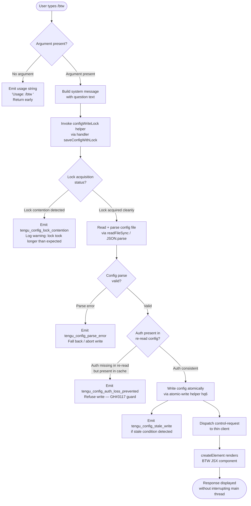

# `/btw`

> Analysis basis: CC v2.1.146 bundle.js (AST extraction + Claude interpretation)
> Minimum version: v2.1.146

---

## Overview

The `/btw` ("by the way") command lets the user inject a quick side question or aside into Claude Code without disrupting the main conversation thread. It is dispatched immediately as a `control-request` to the thin client, passing the user's question as a system-level message alongside a JSX-rendered UI component. The command is typed as `local-jsx`, meaning its output is rendered in the UI layer rather than through a plain-text prompt pipeline.

---

## Registration

| Field | Value |
|---|---|
| type | `local-jsx` |
| name | `btw` |
| description | Ask a quick side question without interrupting the main conversation |
| argumentHint | `<question>` |
| immediate | `true` |
| thinClientDispatch | `control-request` |
| module_id | `BM1` |
| load_inline | `true` |
| loc_byte | `10449940` |
| loc_byte_end | `10450179` |
| loc_line | `8299` |
| arbor_handler.name | `GW7` |
| arbor_handler.fqn | `claude-2.1.146::GW7` |
| arbor_handler.kind | `AsyncFunction` |
| arbor_handler.resolution_path | `module_id` |
| arbor_handler.n_hits | `0` |

Analysis basis: CC v2.1.146 bundle.js:+10449940

---

## Input Branching

The command has two distinct primary branches at the handler level: the user provides no argument (usage error path) versus the user provides a question string (normal dispatch path). A Mermaid diagram is used because the dispatch chain itself has multiple sub-branches inside the config-lock and background-session machinery.



Analysis basis: CC v2.1.146 bundle.js:+10449536, +10449538, +10449577, +10449600, +10449646

---

## Behavioral Spec

### 1. Argument Validation

When the command is invoked, the handler (`GW7`) first inspects whether a non-empty argument string was supplied.

```
async function btwHandler(userInput, context):
    if userInput is empty or absent:
        display "Usage: /btw <your question>"
        return  // early exit, no dispatch
    proceed to buildAndDispatch(userInput, context)
```

If no argument is provided, the usage hint literal `"Usage: /btw <your question>"` is returned to the UI immediately and no further processing occurs.

Analysis basis: CC v2.1.146 bundle.js:+10449538

---

### 2. Message Construction and Dispatch

After validation, the handler constructs a message tagged with role `"system"` and passes it to the thin-client dispatch mechanism.

```
async function buildAndDispatch(question, context):
    message = {
        role: "system",
        content: question
    }
    result = await configAndSessionHelper(context)   // K8
    element = createElement(BTWComponent, { message, context })
    dispatchControlRequest(element)
```

The role is fixed at `"system"` (literal at +10449577), ensuring the aside is framed as a system-level injection rather than a user turn.

Analysis basis: CC v2.1.146 bundle.js:+10449577, +10449600, +10449646

---

### 3. Config-Lock and Safe Write Path

The config-write helper chain (`K8` → `dK_`) implements a file-system lock with the following protocol:

```
function saveConfigWithLock(configPath, newData, cache):
    dirPath = path.dirname(configPath)
    ensure dirPath exists via mkdirSync
    timestamp = Date.now()
    try:
        acquireLock(dirPath)           // may delay; measured against threshold
    catch lockTimeout:
        emit telemetry("tengu_config_lock_contention")
        log warning: "Lock acquisition took longer than expected..."
    reReadConfig = readFileSync(configPath, "utf-8")
    parsed = JSON.parse(reReadConfig)
    if cache has auth AND reReadConfig is missing auth:
        emit telemetry("tengu_config_auth_loss_prevented")
        throw "saveConfigWithLock: re-read config is missing auth..."  // GH#3117
    if staleConditionDetected:
        emit telemetry("tengu_config_stale_write")
    atomicWrite(configPath, newData)   // via hq6
    releaseLock()
```

Lock contention threshold warning: `"Lock acquisition took longer than expected - another Claude instance may be running"` (bundle.js:+3168623).  
Auth-loss guard message references GH issue #3117 (bundle.js:+3169039).  
Config backup directory name: `"backups"` (bundle.js:+3170224).  
Maximum config backup rotation: 5 entries (bundle.js:+3169642).  
Config file permissions octal: 384 (0o600) (bundle.js:+3169924).

Analysis basis: CC v2.1.146 bundle.js:+3168412, +3168623, +3169039, +3168712, +3168848, +3169191

---

### 4. Atomic Config Write (`hq6`)

The atomic write helper ensures config changes are never partially applied:

```
function atomicWrite(targetPath, data):
    tmpPath = targetPath + "." + randomBytes(6).toString("hex")
    fd = fs.openSync(tmpPath, flags)
    try:
        fs.writeFileSync(fd, data)
        if originalFileExists:
            originalMode = fs.statSync(targetPath).mode
            fs.fchmodSync(fd, originalMode)
            log "Applied original permissions to temp file"
        fs.fsyncSync(fd)
    finally:
        fs.closeSync(fd)
    if targetIsSymlink:
        resolveSymlinkChain(targetPath)   // follows ELOOP / ENOTDIR guards
    fs.renameSync(tmpPath, targetPath)
    if tmpStillExists:
        fs.unlinkSync(tmpPath)
```

Random suffix length: 6 bytes → 12 hex chars (bundle.js:+1001906, +1001918).  
`fsync` is called before rename to guarantee durability (bundle.js:+1002450).

Analysis basis: CC v2.1.146 bundle.js:+1001890, +1002384, +1002450, +1002578

---

### 5. Background Session / Spare Pool Interactions

The `K8` helper also interacts with the background session daemon (via `w`) when bootstrapping the execution context. This is shared infrastructure used across multiple commands:

```
function ensureBackgroundSession(context):
    if memoryPressure (freemem low):
        emit telemetry("tengu_bg_dispatch_low_mem")
        skip spare pool
    elif spareSessionAvailable:
        emit telemetry("tengu_bg_spare_claim")
        claimSpareSession()
    else:
        emit telemetry("tengu_bg_spare_enable")
        spawnNewSession()
    if sigkillEscalationNeeded:
        emit telemetry("tengu_bg_dispatch_sigkill_escalate")
        process.kill(pid, "SIGKILL")
```

SIGKILL escalation grace period: 30 s initial, 15 s escalation window (bundle.js:+15060368, +15060379).  
Background session creation telemetry event: `"daemon_bg_session_create"` (bundle.js:+15060723).  
Duplicate retry exhausted event: `"dup_retry_exhausted"` (bundle.js:+15060750).

Analysis basis: CC v2.1.146 bundle.js:+15060413, +15060992, +15061631, +15061752, +15062015

---

### 6. Jitter Helper (`H`)

The call graph shows `GW7` → `H`, with `H` calling `Math.random` and `setTimeout`. This is a jitter/delay utility used to stagger concurrent operations:

```
function jitterDelay(baseMs):
    jitter = Math.random() * 2 - 1   // range: [-1, 1]  (literals: 2 at +13094831, 1 at +13094847)
    return new Promise(resolve => setTimeout(resolve, baseMs + jitter * baseMs))
```

Analysis basis: CC v2.1.146 bundle.js:+13094831, +13094833, +13094847, +13094870

---

## State & Side Effects

| Item | Detail |
|---|---|
| Telemetry — `tengu_config_lock_contention` | Fired when config lock acquisition exceeds expected threshold (bundle.js:+3168712) |
| Telemetry — `tengu_config_stale_write` | Fired when a stale-data condition is detected before writing config (bundle.js:+3168848) |
| Telemetry — `tengu_config_parse_error` | Fired when the re-read config file cannot be parsed as valid JSON (bundle.js:+3171293) |
| Telemetry — `tengu_config_auth_loss_prevented` | Fired when auth would be silently erased; write is aborted (bundle.js:+3169191) |
| Telemetry — `tengu_bg_dispatch_sigkill_escalate` | Fired when background process requires SIGKILL escalation (bundle.js:+15060413) |
| Telemetry — `tengu_bg_dispatch_low_mem` | Fired when system free memory is below threshold, skipping spare pool (bundle.js:+15060992) |
| Telemetry — `tengu_bg_spare_enable` | Fired when a new spare background session is enabled (bundle.js:+15061631) |
| Telemetry — `tengu_bg_spare_claim` | Fired when an existing spare session is successfully claimed (bundle.js:+15061752) |
| Telemetry — `tengu_bg_spare_claim_fail` | Fired when spare session claim fails (bundle.js:+15062015) |
| thinClientDispatch | Sends a `control-request` message; does not create a new conversation turn |
| appState changes | Config file may be updated atomically if a pending config write is triggered via the shared save path |
| JSX rendering | Calls `Y4.createElement` to render the BTW response component inline (bundle.js:+10449646) |
| File system | Config lock file created/released under config directory; backup rotation up to 5 entries; temp files cleaned via `unlinkSync` |
| Sound | <!-- TODO: not found in depth-2 traversal; needs --depth 4 --> |

---

## Version History

| Version | Change |
|---|---|
| v2.1.146 | Initial analysis |

---

## Common Mistakes

1. **Omitting the argument**: `/btw` with no text returns the usage hint `"Usage: /btw <your question>"` and does nothing else. Always supply at least one word after `/btw`.
2. **Expecting a new conversation turn**: Because `thinClientDispatch` is `"control-request"` and `immediate` is `true`, the aside is injected as a system message, not as a new user turn. The main thread context is not reset.
3. **Assuming the command is synchronous**: `GW7` is an `AsyncFunction`. In scripted or programmatic contexts, callers should await its resolution if they need to act on the result.
4. **Confusing `/btw` with a permanent context injection**: The system message produced by `/btw` is scoped to the current dispatch cycle. It does not persist to the global config or conversation history the way a `/memory` or project-level instruction would.
5. **Concurrent Claude instances causing lock contention**: If multiple Claude Code processes share the same config directory, the config-lock path inside the `/btw` dispatch chain may emit `tengu_config_lock_contention` and log a warning about another running instance.

---

## Appendix — Identifier Mapping

> For bundle debugging only. Identifiers change across versions.

| Identifier | Role |
|---|---|
| `GW7` | Main async handler for `/btw` command (arbor_handler) |
| `H` | Jitter/delay utility (Math.random + setTimeout) |
| `K8` | Config-and-session bootstrap helper called by GW7 |
| `dK_` | Config write-with-lock core implementation |
| `_` | Filesystem abstraction (readdirStringSync, statSync, etc.) |
| `Q6` | Path/file utility (used in multiple config helpers) |
| `L` | Filesystem module wrapper (mkdirSync, statSync, copyFileSync, etc.) |
| `q` | Secondary filesystem module (readFileSync, unlinkSync, statSync, etc.) |
| `f` | Promise/resource cleanup helper (close, finally chain) |
| `jA9` | Config object construction/merge helper |
| `os8` | Config initializer / defaults builder |
| `N` | Message or prompt formatting utility |
| `$wK` | Sub-formatter invoked by N (calls QV, MwK, n_A) |
| `CH` | JSON.stringify wrapper |
| `O4` | String replacement / redaction utility (uses `"[REDACTED]"`) |
| `NRH` | Formatting sub-helper (calls YqA) |
| `YwK` | File write pipeline (Buffer.byteLength, rk6, zwK, c9) |
| `c` | Generic utility / small helper |
| `L8` | Error construction or error-type helper |
| `Y$H` | Config read-and-parse helper (readFileSync, JSON.parse, backup) |
| `g6` | JSON.parse wrapper |
| `AC` | String prefix-strip utility (startsWith + slice) |
| `rI9` | Directory walker / config file locator |
| `SH` | Subprocess or child-process result handler |
| `cK_` | Path join utility (hY.join + i8) |
| `w` | Background session / process manager |
| `if6` | Config field accessor or condition checker |
| `A` | String normaliser (toLowerCase) |
| `Z` | String or path value with startsWith guard |
| `X` | MCP/SDK connection handler (Promise.all, SH, n_) |
| `Yv8` | MCP transport or session object |
| `n_` | Error wrapper (Error + String coercion) |
| `V` | Array/slice buffer |
| `hq6` | Atomic file write helper (randomBytes, rename, fsync) |
| `O` | lstat/symlink status object |
| `J8` | Error guard / error-type check |
| `bUH` | Config helper sub-routine |
| `iI9` | Object.entries iteration helper |
| `xUH` | Timestamp / Date.now utility |
| `QK_` | Config lock path builder (dirname, CH, hq6) |

---

Note: index built via Arbor fallback; some signals (telemetry, literals) may be missing — see arbor-fallback.js.