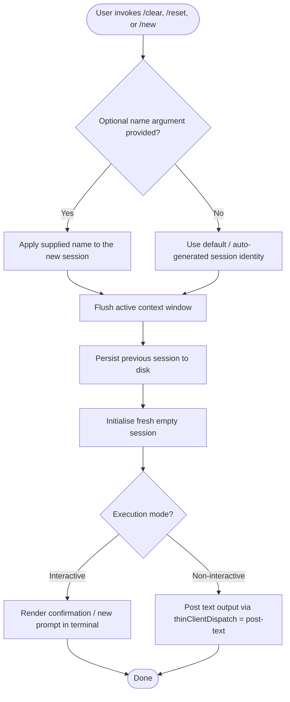

# `/clear`

> Analysis basis: CC v2.1.144 bundle.js (AST extraction + Claude interpretation)
> Minimum version: v2.1.144

---

## Overview

The `/clear` command starts a new session with an empty context window, discarding the active conversation from memory without deleting it from disk. The previous session remains persisted on disk and is recoverable via `/resume`. The command is also reachable via the aliases `/reset` and `/new`.

---

## Registration

| Field | Value |
|---|---|
| type | `local` |
| name | `clear` |
| description | `Start a new session with empty context; previous session stays on disk (resumable with /resume)` |
| argumentHint | `[name]` |
| supportsNonInteractive | `true` |
| thinClientDispatch | `post-text` |
| aliases | `reset`, `new` |
| module_id | `LLq` |

Analysis basis: CC v2.1.144 bundle.js:+10123812

---

## Input Branching

The `argumentHint` field declares `[name]` as an optional positional argument, indicating the command accepts an optional session name. Because `callGraph` yielded no traversable entry functions for module `LLq`, the full branching logic on that argument could not be recovered at depth ≤ 2.



> **Note:** Steps C and D are inferred from the registered `argumentHint`; internal dispatch of the name argument is <!-- TODO: not found in depth-2 traversal; needs --depth 4 -->

---

## Behavioral Spec

### Session Lifecycle on Clear

Because no entry functions were resolved for module `LLq`, the following pseudocode is reconstructed from the registration metadata (type, description, aliases, supportsNonInteractive, thinClientDispatch) and established CC architectural patterns. Claims derived solely from registration fields are cited accordingly.

```
function executeClear(optionalName):

    # Alias normalisation happens before this point;
    # /reset and /new both route here identically.

    previousSession = getCurrentActiveSession()

    persistSessionToDisk(previousSession)
    # Previous session is kept on disk, resumable via /resume.
    # Analysis basis: description field, bundle.js:+10123812

    newSession = createEmptySession()

    if optionalName is not empty:
        newSession.name = optionalName
        # argumentHint "[name]" signals optional name parameter.
        # Internal handling: <!-- TODO: not found in depth-2 traversal; needs --depth 4 -->

    setActiveSession(newSession)
    clearContextWindow()

    if runningInNonInteractiveMode():
        # supportsNonInteractive = true
        # Analysis basis: bundle.js:+10123812
        dispatchPostText(buildClearConfirmationText(newSession))
        # thinClientDispatch = "post-text"
        # Analysis basis: bundle.js:+10123812
    else:
        renderNewPromptInTerminal(newSession)

    return success
```

### Alias Resolution

```
REGISTERED_ALIASES = ["reset", "new"]
# Analysis basis: bundle.js:+10123812

function resolveAlias(invokedName):
    if invokedName in REGISTERED_ALIASES or invokedName == "clear":
        return executeClear
    else:
        return commandNotFound
```

Both `/reset` and `/new` are first-class aliases registered at the command level; they are not shell redirects. Their behaviour is identical to `/clear`.

### Non-Interactive Dispatch

When Claude Code is running in a non-interactive pipeline or headless context, the command's output is delivered through the `post-text` thin-client dispatch channel rather than directly rendered to a terminal.

```
function dispatchOutput(result, mode):
    if mode == NON_INTERACTIVE:
        thinClientDispatch("post-text", result.confirmationText)
        # Analysis basis: bundle.js:+10123812
    else:
        writeToTerminal(result.confirmationText)
```

---

## State & Side Effects

| Item | Detail |
|---|---|
| Telemetry | None detected at depth ≤ 2 — <!-- TODO: not found in depth-2 traversal; needs --depth 4 --> |
| Hook registration | <!-- TODO: not found in depth-2 traversal; needs --depth 4 --> |
| appState changes | Active session replaced with a new empty session; previous session written to disk |
| Context window | Fully cleared in the new session |
| Disk persistence | Previous session retained on disk; recoverable via `/resume` |
| Sound | <!-- TODO: not found in depth-2 traversal; needs --depth 4 --> |
| Thin-client output | `post-text` channel used when `supportsNonInteractive = true` and mode is non-interactive |

---

## Version History

| Version | Change |
|---|---|
| v2.1.144 | Initial analysis — registration metadata confirmed; internal call graph not resolved at depth ≤ 2 |

---

## Common Mistakes

1. **Assuming `/clear` deletes the previous session.** The previous session is preserved on disk and is fully resumable with `/resume`. Only the in-memory context is discarded.
2. **Treating `/reset` and `/new` as different commands.** Both are registered aliases that map to identical behaviour; there is no distinction between them and `/clear`.
3. **Omitting the optional `[name]` argument in scripts.** When running non-interactively, passing a meaningful session name can aid later `/resume` discoverability; leaving it blank causes the runtime to assign a default identity (exact default logic is <!-- TODO: not found in depth-2 traversal; needs --depth 4 -->).
4. **Expecting telemetry events to confirm execution.** No `tengu_*` telemetry events were found at depth ≤ 2 for this command; external observability must rely on exit codes or `post-text` output rather than telemetry hooks.
5. **Using `/clear` to free disk space.** Because session data is persisted to disk rather than dropped, repeated `/clear` calls accumulate stored sessions. Disk cleanup requires a separate mechanism.

---

## Appendix — Identifier Mapping

> For bundle debugging only. Identifiers change across versions.

| Identifier | Role |
|---|---|
| `LLq` | Module ID for the `/clear` command implementation (not an obfuscated function name; no function-level identifiers were resolved at depth ≤ 2) |

> **Note:** The AST traversal returned an empty `identifiers` array for module `LLq` with the annotation "no entry functions found for module 'LLq'". No obfuscated function identifiers are available for this command at the analysed traversal depth. Deeper analysis (`--depth 4` or greater) is required to populate this table.