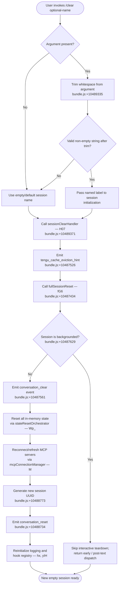

# `/clear`

> Analysis basis: CC v2.1.146 bundle.js (AST extraction + Claude interpretation)
> Minimum version: v2.1.146

---

## Overview

`/clear` starts a new conversation session with an empty context window while preserving the previous session on disk so it can be restored later with `/resume`. It also accepts the aliases `/reset` and `/new`, and supports an optional `[name]` argument to label the new session. The command triggers a full session-state teardown and re-initialization cycle, including MCP server reconnection and cache-eviction hints.

---

## Registration

| Field | Value |
|---|---|
| type | `local` |
| name | `clear` |
| description | `Start a new session with empty context; previous session stays on disk (resumable with /resume)` |
| argumentHint | `[name]` |
| aliases | `reset`, `new` |
| supportsNonInteractive | `true` |
| thinClientDispatch | `post-text` |
| module_id | `k31` |
| load_inline | `true` |
| loc_byte | `10489509` |
| loc_byte_end | `10489800` |
| loc_line | `8319` |
| arbor_handler.name | `H07` |
| arbor_handler.fqn | `claude-2.1.146::H07` |
| arbor_handler.kind | `AsyncFunction` |
| arbor_handler.resolution_path | `module_id` |
| arbor_handler.n_hits | `0` |

Analysis basis: CC v2.1.146 bundle.js:+10489509

---

## Input Branching

The command has 3+ distinct paths depending on the optional session name argument and whether the session is currently backgrounded, so a flowchart is used.



---

## Behavioral Spec

### 1. Entry Point — `clearCommandHandler` (H07)

The Arbor-resolved handler for `/clear` is the async function `H07`, reached via `module_id → k31`.

```
async function clearCommandHandler(args, appState):
    rawName = args.trim()                          // bundle.js:+10489335
    sessionName = rawName if rawName != "" else null

    emit telemetry: tengu_cache_eviction_hint      // bundle.js:+10487526
    await fullSessionReset(appState, sessionName)  // bundle.js:+10489371
    return                                         // no explicit return value
```

Analysis basis: CC v2.1.146 bundle.js:+10489335, +10489371

---

### 2. Full Session Reset — `fullSessionReset` (fG6)

The core teardown function called by `clearCommandHandler`.

```
async function fullSessionReset(appState, sessionName):
    // Check backgrounded state
    isBackgrounded = appState["isBackgrounded"]    // bundle.js:+10487629

    if not isBackgrounded:
        emit event: "conversation_clear"           // bundle.js:+10487561
        await stateResetOrchestrator(appState)     // bundle.js:+10487824

    // MCP reconnection regardless of background state
    await mcpConnectionManager(appState)           // bundle.js:+10487706

    // Abort any pending abort controllers
    clearPendingAbortControllers(appState)         // bundle.js:+10488268

    // Clear in-memory caches
    clearInMemoryCaches()                          // bundle.js:+10487842

    // Generate new session identity
    newSessionId = crypto.randomUUID()             // bundle.js:+10488773
    appState.sessionId = newSessionId

    // Emit reset signal
    emit event: "conversation_reset"               // bundle.js:+10488734

    if sessionName != null:
        applySessionName(appState, sessionName)

    // Reinitialize logging subsystem
    reinitLogging(appState)                        // bundle.js:+10489024 (yIH)
    reinitHookDispatch(appState)                   // bundle.js:+10489033 (hT)

    // Rebuild state metadata (cwd, worktree, etc.)
    rebuildContextMetadata(appState)               // bundle.js:+10489058 (VM), +10489068 (Ex)
```

Analysis basis: CC v2.1.146 bundle.js:+10487422, +10487561, +10487629, +10487692, +10487842, +10488773, +10488734

---

### 3. State Reset Orchestrator — `stateResetOrchestrator` (Wp_)

Called only for foreground (non-backgrounded) sessions. Clears all subsystem caches and resets runtime state.

```
function stateResetOrchestrator(appState):
    // Reset subagent/compact tracking
    clearSubagentRegistry()                   // bundle.js:+10486417 (wp_)
    resetSessionStartSignals()                // bundle.js:+10486433 (Nt9 → qZH)

    // Clear tool-call and hook caches
    clearToolCallCache()                      // bundle.js:+10486452 (tr)
    clearMcpDebugCache()                      // bundle.js:+10486465 (mIH)

    // Reset permission/filter queues
    clearPermissionQueues()                   // bundle.js:+10486638 (uQq)
    clearConversationCaches()                 // bundle.js:+10486647 (SCq)
    clearAbortControllerRegistry()            // bundle.js:+10486656 (aU8)
    clearEditCache()                          // bundle.js:+10486671 (EDq)
    clearNullableHandles()                    // bundle.js:+10486684 (UU8)

    // Resolve cwd for new session
    resolveWorkingDirectory(appState)         // bundle.js:+10487833 (UD)

    Promise.resolve()                         // bundle.js:+10486702
```

Analysis basis: CC v2.1.146 bundle.js:+10486417 through +10486702

---

### 4. MCP Connection Manager — `mcpConnectionManager` (M → `_kH`)

Runs MCP reconnection logic unconditionally (including for backgrounded sessions). At depth 2 this expands into the full MCP server lifecycle; key observable effects from the call graph:

```
async function mcpConnectionManager(appState):
    servers = Object.entries(appState.mcpConfig)   // bundle.js:+9937976

    for each server in servers:
        if server.status == "disabled":
            skip                                   // bundle.js:+9938075
        if server.type in ["stdio", "sse", "sse-ide", "ws-ide"]:
            connect(server)                        // bundle.js:+9938177..+9938312
        reconnect and update MCP tool registry     // bundle.js:+9938688 (x18)

    await Promise.all(connectionPromises)          // bundle.js:+9939198
```

Analysis basis: CC v2.1.146 bundle.js:+14788510, +9937976, +9938075, +9939198

---

### 5. Session Name Resolution — `sessionNameResolver` (ykH → IL)

Processes the optional `[name]` argument to produce a display-safe session label. Emits a `"SessionEnd"` event on the outgoing session before the new one starts.

```
function sessionNameResolver(previousSession, newName):
    emit event: "SessionEnd"                       // bundle.js:+12676663
    sessionLabel = buildContextLabel(newName)      // bundle.js:+12676636 (IL)
    effort = getEffortLevel(sessionLabel)          // bundle.js:+12687435
    return sessionLabel
```

Model identifier constants visible in the call graph at depth 2 (bundle.js:+4058234 through +4058429) include model strings such as `"claude-3-"`, `"claude-opus-4-0"`, `"claude-sonnet-4-5"`, and others — these are used by the effort/budget resolver, not by `/clear` directly.

Analysis basis: CC v2.1.146 bundle.js:+12676636, +12676663

---

### 6. Non-Interactive / Thin-Client Dispatch

When `supportsNonInteractive: true` and `thinClientDispatch: "post-text"`, the handler runs in headless mode (e.g., from a script or API). In that mode the `isBackgrounded` branch (bundle.js:+10487629) suppresses the interactive teardown but still generates a new session UUID and reconnects MCP.

---

## State & Side Effects

| Item | Detail |
|---|---|
| Telemetry — `tengu_cache_eviction_hint` | Fired at the start of every `/clear` call (bundle.js:+10487526) |
| Telemetry — `tengu_run_hook` | Fired when any hooks execute during reset (bundle.js:+12724572) |
| Telemetry — `tengu_repl_hook_finished` | Fired on hook completion (bundle.js:+12708658) |
| Telemetry — `tengu_session_renamed` | Fired if session label changes (bundle.js:+12589215) |
| Telemetry — `tengu_feature_ok` / `tengu_feature_bad` | Feature health signals (bundle.js:+955938, +955996) |
| Telemetry — `tengu_hook_plugin_metrics` | Hook plugin metrics (bundle.js:+12703250) |
| Telemetry — `tengu_hook_plugin_injected` | Plugin injection signal (bundle.js:+12722918) |
| Event: `conversation_clear` | Emitted on foreground clear (bundle.js:+10487561) |
| Event: `conversation_reset` | Emitted after new session UUID assigned (bundle.js:+10488734) |
| Event: `SessionEnd` | Emitted for the outgoing session (bundle.js:+12676663) |
| appState changes | `sessionId` replaced with new `crypto.randomUUID()` value; all subsystem caches cleared |
| Hook registration | Hook registry re-initialized via `reinitLogging` (yIH) and `reinitHookDispatch` (hT) |
| MCP reconnection | All configured MCP servers are reconnected/refreshed |
| Previous session | Preserved on disk — resumable with `/resume` |
| AbortControllers | All pending abort controllers cleared (bundle.js:+10488268) |
| Sound | No sound effects identified in depth-2 traversal |

---

## Version History

| Version | Change |
|---|---|
| v2.1.146 | Initial analysis |

---

## Common Mistakes

1. **Expecting context to be gone immediately in thin-client mode**: In non-interactive dispatch (`thinClientDispatch: "post-text"`), the backgrounded branch skips the interactive teardown; callers should not assume all caches are flushed synchronously.
2. **Confusing `/clear` with data deletion**: The previous session is persisted to disk and recoverable with `/resume`. `/clear` is not a destructive delete.
3. **Using `/clear` to change model**: The model-identifier constants in the call graph (e.g., `"claude-opus-4-0"`, `"claude-sonnet-4-5"`) belong to the effort resolver inside the context-label pipeline — they are not set by `/clear`. Use the appropriate configuration command instead.
4. **Expecting MCP servers to remain disconnected**: MCP reconnection runs unconditionally, including for backgrounded sessions. If you need to hold MCP state, `/clear` is the wrong tool.
5. **Omitting the name argument thinking the session is anonymous**: A session without a name still receives a new UUID and `conversation_reset` event; names are cosmetic labels only.

---

## Appendix — Identifier Mapping

> For bundle debugging only. Identifiers change across versions.

| Identifier | Role |
|---|---|
| `H07` | `clearCommandHandler` — async entry-point for `/clear` (Arbor handler) |
| `fG6` | `fullSessionReset` — core teardown and reinit orchestrator |
| `$G6` | `cacheEvictionHintEmitter` — emits cache eviction hints |
| `SY` | `policySettingsReader` — reads `policySettings` from app state |
| `x8` | `policySettingsAccessor` — low-level policy settings getter |
| `zu` | `uvResolver1` — utility resolver (calls `uV`) |
| `vm` | `contextKeyMapper` — maps context keys |
| `K4_` | `contextKeyBuilder` — builds context keys |
| `ykH` | `sessionNameResolver` — resolves and emits session name/end event |
| `IL` | `contextLabelBuilder` — builds session context label |
| `S6` | `stateEventEmitter` — generic state event emitter |
| `ly` | `uvResolver2` — secondary utility resolver |
| `G2` | `effortModelResolver` — resolves effort level by model string |
| `zZ` | `effortHighChecker` — checks for `"high"` effort setting |
| `fV` | `contextLabelFormatter` — formats the context label string |
| `x6` | `contextLabelNormalizer` — normalizes label (calls `Wb6`, `D_`) |
| `o2` | `sessionRunner` — main session execution loop |
| `mH` | `stringCoercer` — coerces values to `String` |
| `Vm` | `stateVmWrapper` — wraps `x8` for VM-like state access |
| `N` | `messageNormalizer` — normalizes messages (trims, uppercases, etc.) |
| `w7H` | `stateKeyPairReader` — reads `C_`/`y7` key pairs from state |
| `mi_` | `hookPluginFilter` — filters and classifies plugin hooks |
| `O` | `backgroundSessionChecker` — checks background session state |
| `hp1` | `hookPriorityResolver` — resolves hook priority |
| `ui_` | `thirdPartyHookFilter` — filters third-party hooks |
| `Rp1` | `hookRegistryReader` — reads hook registry |
| `c` | `genericCallback` — generic callback/closure utility |
| `CH` | `jsonStringifyWrapper` — wraps `JSON.stringify` |
| `SH` | `sessionHistoryWriter` — writes to session history/log |
| `uH` | `callbackInvoker` — invokes stored callbacks |
| `z2H` | `abortControllerCleaner` — cleans up abort controllers (`Ab6`) |
| `mZ` | `abortSignalManager` — manages abort signals and timeouts |
| `J` | `callbackRegistry` — callback registry object |
| `H_H` | `hookHandlerDispatch` — dispatches hook handlers |
| `EV` | `eventBroadcaster` — broadcasts events |
| `oG8` | `hookOutputProcessor` — processes hook output |
| `Ri_` | `mcpToolResultHandler` — handles MCP tool results |
| `eG8` | `hookOutputParser` — parses hook output JSON |
| `e6H` | `hookPluginMetricsCollector` — collects plugin metrics |
| `Si_` | `httpHookDispatcher` — dispatches HTTP hooks |
| `yp1` | `httpHookBodyParser` — parses HTTP hook response body |
| `rLH` | `hookErrorLogger` — logs hook errors |
| `HT8` | `shellCommandHookRunner` — runs shell command hooks |
| `_NH` | `hookNonBlockingErrorHandler` — handles non-blocking hook errors |
| `bH` | `callbackStore` — stores callbacks |
| `hNH` | `sessionHookNotifier` — sends session hook notifications |
| `n66` | `sessionIdGenerator` — generates session IDs |
| `M` | `mcpManagerOrchestrator` — top-level MCP manager |
| `_kH` | `mcpServerConnector` — connects individual MCP servers |
| `GHH` | `mcpTransportBuilder` — builds MCP transport objects |
| `zN` | `mcpNativeTransportResolver` — resolves native MCP transport |
| `K` | `mcpServerList` — list of MCP servers |
| `f_` | `mcpFilterHelper` — filters MCP server list |
| `z06` | `mcpStatusFilter` — filters by MCP status |
| `fD7` | `mcpVersionChecker` — checks MCP server version |
| `x18` | `mcpToolRegistryUpdater` — updates MCP tool registry |
| `C18` | `mcpCapabilityChecker` — checks MCP capabilities |
| `O8` | `mcpDebugLogger` — logs MCP debug messages |
| `yb_` | `mcpOAuthFlowHandler` — handles MCP OAuth flows |
| `hb_` | `mcpOAuthCallbackHandler` — handles MCP OAuth callbacks |
| `XK1` | `mcpConnectionStateManager` — manages MCP connection state |
| `Ib_` | `mcpConnectionInitializer` — initializes MCP connections |
| `SX_` | `mcpTransportTypeChecker` — checks MCP transport type |
| `j` | `activeProcessRegistry` — registry of active child processes |
| `y` | `outputStreamWriter` — writes to output streams |
| `v7` | `mcpErrorLogger` — logs MCP errors |
| `ZH` | `stringCoercerAlt` — alternative string coercer |
| `wK1` | `mcpMetricsCollector` — collects MCP metrics |
| `Y06` | `mcpRetryCountParser` — parses MCP retry counts |
| `vx_` | `mcpTimeoutParser` — parses MCP timeout values |
| `z4K` | `mcpUpdateApplier` — applies MCP config updates |
| `xj8` | `mcpUpdateSerializer` — serializes MCP updates |
| `A` | `mcpServerRegistry` — registry of all MCP servers |
| `FN` | `mcpCleanupHandler` — handles MCP cleanup |
| `L` | `mcpPromiseTracker` — tracks MCP-related promises |
| `q` | `mcpSocketCleaner` — cleans up MCP sockets |
| `f` | `mcpConnectionObject` — individual MCP connection |
| `$` | `mcpSessionEmitter` — emits MCP session events |
| `zS1` | `mcpSessionTimestamper` — timestamps MCP sessions |
| `_O5` | `mcpRemoteServerManager` — manages remote MCP servers |
| `_` | `genericUtility` — generic utility/helper |
| `m18` | `mcpAuthStateChecker` — checks MCP auth state |
| `r8` | `connectionRetryHandler` — handles connection retry logic |
| `NaH` | `mcpSerializationHelper` — serializes MCP data |
| `MP` | `mcpPingHandler` — sends MCP pings |
| `w` | `daemonWorkerManager` — manages background daemon workers |
| `C` | `daemonWorkerInstance` — individual daemon worker |
| `w5K` | `daemonFileStatHelper` — stats files for daemon worker |
| `vY5` | `daemonXzHelper` — Xz helper for daemon |
| `z` | `streamWriter` — generic stream writer |
| `rE6` | `memoryMonitor` — monitors free memory |
| `N6` | `memoryThresholdChecker` — checks memory thresholds |
| `x` | `daemonIdleTimer` — daemon idle timer |
| `S` | `daemonStateHolder` — holds daemon state |
| `b` | `daemonTimerRef` — timer reference for daemon |
| `AHA` | `daemonSpareClaimSender` — sends spare-claim frames |
| `Dr_` | `sessionPersistenceWriter` — writes session to disk |
| `tz5` | `claimTimeoutHandler` — handles claim send timeouts |
| `sz5` | `claimFrameBuilder` — builds claim frames |
| `L8` | `errorBoundaryHelper` — error boundary utility |
| `GU` | `binaryFrameEncoder` — encodes binary frames |
| `$HA` | `daemonSessionLifecycleManager` — manages daemon session lifecycle |
| `SK` | `sessionPathResolver` — resolves session file paths |
| `eq` | `sessionFileReader` — reads session files from disk |
| `bj` | `sessionStatusUpdater` — updates session status |
| `l5` | `sessionConfigLoader` — loads session configuration |
| `VsH` | `sessionWatchdogTimer` — session watchdog/heartbeat |
| `kLH` | `sessionRosterPathResolver` — resolves roster path |
| `wy` | `sessionRosterWriter` — writes session roster |
| `vU` | `sessionQueueWriter` — writes to session queue |
| `xG6` | `sessionDirectoryCreator` — creates session directory |
| `Y` | `daemonConfigWatcher` — watches daemon configuration |
| `D` | `daemonDispatcher` — dispatches daemon tasks |
| `_HA` | `daemonSpareSpawner` — spawns spare daemon processes |
| `xw` | `sessionStateUpdater` — updates session state flags |
| `Wp_` | `stateResetOrchestrator` — orchestrates full in-memory state reset |
| `wp_` | `subagentRegistryClearer` — clears subagent registry |
| `ir` | `reloadSignalDispatcher` — dispatches reload signals |
| `yHH` | `reloadSignal_yHH` — reload signal variant |
| `RD8` | `reloadSignal_RD8` — reload signal variant |
| `o81` | `reloadSignal_o81` — reload signal variant |
| `Kw8` | `reloadSignal_Kw8` — reload signal variant |
| `Nt9` | `sessionStartResetter` — resets session-start signals |
| `qZH` | `sessionStartSignalWriter` — writes session-start signals to disk |
| `Y86` | `agentStateResetter` — resets agent state |
| `tr` | `fullStateResetter` — full state reset (calls many subsystem clearers) |
| `U1H` | `mainThreadResetter` — resets main-thread state |
| `Sw8` | `subagentExitCleaner` — cleans up on subagent exit |
| `eO6` | `sessionStartEmitter` — emits `session_start` event |
| `wi` | `compactStateResetter` — resets compact state |
| `r6H` | `bkQkResetter` — resets bk8/Qk8 state |
| `xw8` | `hL1CacheClearer` — clears hL1 cache |
| `JWq` | `Kw6RWCacheClearer` — clears Kw6/RW_ caches |
| `BCq` | `BCqStateResetter` — resets BCq state |
| `gDH` | `gDHStateResetter` — resets gDH state |
| `Mw` | `outputTokenResetter` — resets output token counters |
| `nC_` | `nCStateResetter` — resets nC_ state |
| `mIH` | `vD8CacheClearer` — clears vD8 debug cache |
| `uQq` | `permissionQueueClearer` — clears permission queues (uNH/iI_) |
| `SCq` | `conversationCacheClearer` — clears conversation caches (tnH/BJ6) |
| `aU8` | `xbHCacheClearer` — clears xbH abort-controller cache |
| `Mc9` | `miscCacheResetter` — resets miscellaneous caches |
| `EDq` | `D18EditCacheClearer` — clears D18 edit cache |
| `hk8` | `hHasChecker` — checks `H.has` flag |
| `UU8` | `CbHCacheClearer` — clears CbH null-handle cache |
| `gA1` | `gA1StateResetter` — resets gA1 state |
| `bxq` | `wrDHCacheClearer` — clears Wr/rDH caches |
| `UD` | `cwdResolver` — resolves working directory for new session |
| `Q6` | `pathNormalizer` — normalizes filesystem paths |
| `J8` | `errorBoundaryWrapper` — wraps errors with boundary |
| `Fp8` | `cwdStoreReader` — reads cwd from async store |
| `F_H` | `pathNormalizerHelper` — normalizes paths via `H.normalize` |
| `D_` | `uvPrimitiveEmitter` — low-level `uV` emitter |
| `fEH` | `runningStateWatcher` — watches `"running"` state flag |
| `YN` | `clearTimeoutHelper` — helper that calls `clearTimeout` |
| `o$` | `pG8FlushHelper` — flushes pG8 buffer |
| `BG8` | `hm1PromiseTracker` — tracks promises in hm1 set |
| `ddH` | `w7qCacheClearer` — clears w7q cache |
| `w7q` | `w7qCache` — specific cache store |
| `I31` | `D5HResetter` — resets D5H state |
| `D5H` | `D5HStateStore` — D5H state storage |
| `ZO` | `zoContextEmitter` — context emitter for ZO |
| `y4` | `contextEventEmitter` — emits context events |
| `c9` | `contextRegister` — registers context via `c_A.register` |
| `HR` | `sessionHeaderWriter` — writes session header |
| `Df` | `subagentPathBuilder` — builds subagent paths |
| `gy` | `uvPrimitiveGy` — low-level uV primitive |
| `MG6` | `MG6ContextEmitter` — secondary context emitter |
| `QN8` | `sessionUuidEmitter` — generates UUID and emits via `YI6` |
| `ud` | `udContextEmitter` — context emitter for ud |
| `hx` | `loggingReinitializer` — reinitializes logging subsystem |
| `D7H` | `syncFileLogger` — synchronous file logger |
| `yIH` | `hookRegistryReinitializer` — reinitializes hook registry/symlinks |
| `Vi_` | `hookDirectoryCreator` — creates hook directories |
| `ziH` | `hookPathBuilder` — builds hook paths |
| `aM` | `hookSymlinkBuilder` — builds hook symlinks |
| `$rH` | `hookFileOpener` — opens hook files |
| `hT` | `hookDispatchReinitializer` — reinitializes hook dispatch |
| `df` | `dfStateResetter` — resets df state |
| `VM` | `worktreeStateResetter` — resets worktree state |
| `Ex` | `worktreeStateEmitter` — emits worktree state events |
| `X8H` | `isolationLatchResetter` — resets isolation latch |
| `zm1` | `asyncFileLogger` — async file logger |
| `rp` | `pluginHookLoader` — loads plugin hooks |
| `cK` | `pluginHookInitializer` — initializes plugin hooks |
| `BGH` | `pluginHookFilter` — filters plugin hooks |
| `RbH` | `pluginHookLogger` — logs plugin hook events |
| `h8` | `syncAppendFileLogger` — sync append-file logger |
| `qX6` | `sessionMainLoop` — primary session main loop |
| `g2` | `sessionExecutor` — full session execution function |
| `P9` | `randomUuidGenerator` — generates UUIDs via `v81.randomUUID` |

---

Note: index built via Arbor fallback; some signals (telemetry, literals) may be missing — see arbor-fallback.js.