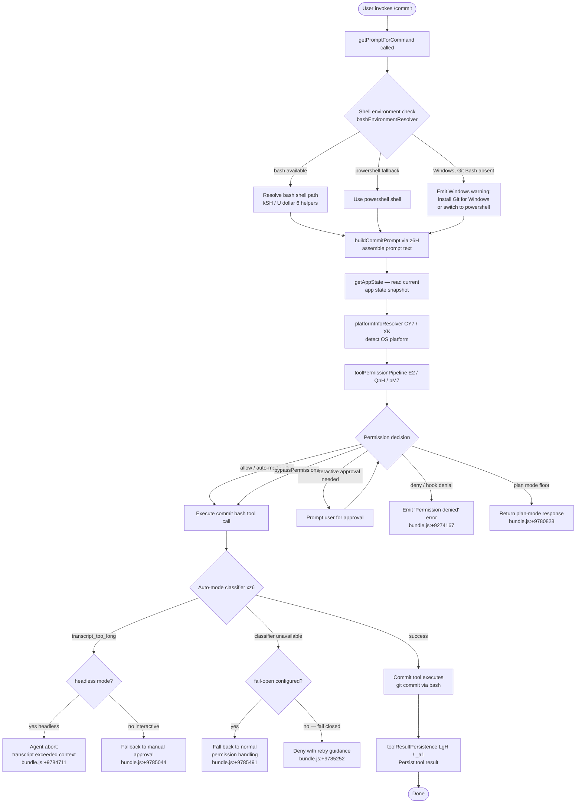

# `/commit`

> Analysis basis: CC v2.1.144 bundle.js (AST extraction + Claude interpretation)
> Minimum version: v2.1.144

---

## Overview

`/commit` is a prompt-type slash command that instructs Claude to create a git commit on behalf of the user. It invokes `getPromptForCommand` to construct a shell-aware prompt, resolves the correct shell environment (bash or PowerShell depending on the platform), and then dispatches the commit workflow through the standard agent/tool-permission pipeline.

---

## Registration

| Field | Value |
|---|---|
| type | `prompt` |
| name | `commit` |
| description | `Create a git commit` |
| loc_byte | `10128255` |
| loc_byte_end | `10128679` |
| loc_line | `5654` |
| handler_method | `getPromptForCommand` |
| handler_method_start | `10128402` |
| handler_method_end | `10128678` |
| prompt_body.length | `203` |
| prompt_body.trace | `call→z6H(...) (1 literals)` |
| arbor_handler.name | `getPromptForCommand` |
| arbor_handler.fqn | `claude-2.1.144::getPromptForCommand` |
| arbor_handler.kind | `Method` |
| arbor_handler.resolution_path | `direct` |
| arbor_handler.n_hits | `2` |

Analysis basis: CC v2.1.144 bundle.js:+10128255

---

## Input Branching

The command's dispatch path has more than three distinct branches (shell detection, permission check outcomes, auto-mode classifier outcomes, Windows/bash availability), so a Mermaid flowchart is used.



---

## Behavioral Spec

### 1. Handler Entry: `getPromptForCommand`

The Arbor handler `getPromptForCommand` is resolved via `direct` resolution path (falls inside the registration byte range `10128255`–`10128679`). This method is the sole entry point; the synthetic BFS node `__handler_commit` is bookkeeping only.

```
function getPromptForCommand(context):
    shellInfo      = resolveShellEnvironment(context)   // calls z6H
    promptText     = buildCommitPromptText(shellInfo)   // 203-char body via z6H + 1 literal
    appState       = context.getAppState()              // bundle.js:+10128508
    return { type: "text", content: promptText }        // literal "text" bundle.js:+10128458
```

Analysis basis: CC v2.1.144 bundle.js:+10128402

---

### 2. Shell Resolution: `bashEnvironmentResolver` (maps to `z6H`)

The prompt body is 203 characters long and is constructed via a call to the function mapped to `z6H`, which takes one literal argument. The logic checks whether a bash shell is available:

- If the platform is Windows and Git Bash is **not** found, a warning fragment referencing `https://git-scm.com/downloads/win` is injected and the user is advised to install Git for Windows or change the skill's `shell` frontmatter key to `powershell`.
- If bash is found, the standard bash path is used.
- If `powershell` is the active shell, the PowerShell fallback path is taken.

String constants involved: `"bash"` (bundle.js:+9273487), `"powershell"` (bundle.js:+9273733), `"windows"` (bundle.js:+3198575).

```
function bashEnvironmentResolver(platformInfo):
    if platformInfo.os == "windows":
        bashPath = locateBashExecutable()       // XK → platformLookup
        if bashPath is null:
            return buildWarningPrompt(
                shell="powershell",
                warning="Git Bash not found — install Git for Windows or use powershell"
            )
        else:
            return buildShellPrompt(shell="bash", path=bashPath)
    else:
        return buildShellPrompt(shell="bash")
```

The `"!`"` literal at bundle.js:+9273803 is used during prompt-text assembly, likely as a template boundary marker. The function also calls `matchAll`, `includes`, and `replace` on the intermediate prompt string (bundle.js:+9273774, +9273792, +9274329).

Analysis basis: CC v2.1.144 bundle.js:+9273496

---

### 3. Platform Detection: `platformInfoResolver` (maps to `CY7`)

Called from `__handler_commit` at bundle.js:+10128439, this function resolves OS-level details used by the shell resolver and tool permission pipeline.

```
function platformInfoResolver():
    osInfo = getPlatformDetails()    // XK → c6 + p_H (bundle.js:+3198568, +3198601)
    if osInfo.platform == "windows":
        tag = "windows"              // bundle.js:+3198575
    return osInfo
```

Emits the `tengu_cobalt_ridge` telemetry event (bundle.js:+3198526).

Analysis basis: CC v2.1.144 bundle.js:+10127582

---

### 4. Settings Loader: `settingsLoader` (maps to `B_` → `Du`)

Invoked transitively from the environment resolver path, this function loads persisted user settings from disk and emits telemetry bookends.

```
function settingsLoader():
    emit("loadSettingsFromDisk_start")   // bundle.js:+1205785
    settings = readSettingsFile()        // AR, j9 helpers
    checkPermissionRules(settings)       // mp8, kB, XI6
    emit("loadSettingsFromDisk_end")     // bundle.js:+1205841
    return settings
```

Analysis basis: CC v2.1.144 bundle.js:+1205452

---

### 5. Tool Permission Pipeline: `toolPermissionOrchestrator` (maps to `E2` → `QnH` → `pM7`)

The core gate that decides whether the underlying git-commit bash invocation is allowed.

```
function toolPermissionOrchestrator(toolCall, context):
    appState = context.getAppState()                       // bundle.js:+9779929

    // Fast-path checks
    if toolCall.permission == "deny":                      // bundle.js:+9776800
        return DENY
    if toolCall.permission == "rule":                      // bundle.js:+9776828
        return evaluateRule(toolCall)

    // Sandbox / auto-allow checks
    if sandboxingEnabled(context):                         // bundle.js:+9776942
        if autoAllowBashInSandbox(context):               // bundle.js:+9776968
            return ALLOW

    decision = runPermissionCheck(toolCall)                // H.checkPermissions bundle.js:+9777184

    switch decision:
        case "ask":           return promptUser()          // bundle.js:+9777031
        case "passthrough":   return ALLOW                 // bundle.js:+9777109
        case "bypassPermissions": return ALLOW             // bundle.js:+9777580
        case "plan":          return PLAN_MODE_RESPONSE    // bundle.js:+9777610

    if isDangerousRm(toolCall):
        warnUser("Dangerous rm operation")                 // bundle.js:+9777723
    if isDangerousRmdir(toolCall):
        warnUser("Dangerous rmdir operation")              // bundle.js:+9777770

    return finalPermissionDecision(decision)
```

Analysis basis: CC v2.1.144 bundle.js:+9779823

---

### 6. Auto-Mode Classifier: `autoModeClassifier` (maps to `xz6`)

When the agent runs in auto mode, a classifier call is made to determine whether the bash tool invocation should be approved without user interaction.

```
function autoModeClassifier(toolCall, transcript):
    if transcript.tokenCount > 4096:                        // bundle.js:+6504249
        return { result: "transcript_too_long" }

    classifierResult = invokeClassifier(
        toolCall,
        contextWindowMax = 500,                             // bundle.js:+6503898
        roundingPrecision = 4                               // bundle.js:+6503603
    )

    switch classifierResult.status:
        case "success":        return ALLOW                 // bundle.js:+6506266
        case "refusal":        return DENY                  // bundle.js:+6505162
        case "no_tool_use":
            log("Auto mode classifier: No tool use block found")  // bundle.js:+6505323
            return FALLBACK
        case "invalid_schema":
            log("Auto mode classifier: Invalid response schema")  // bundle.js:+6505757
            return FALLBACK
        case "interrupted":
            log("Classifier request aborted")              // bundle.js:+6506554
            return INTERRUPTED
        case "transcript_too_long":
            log("Classifier transcript exceeded context window")  // bundle.js:+6507089
            return TOO_LONG
        case "unavailable":
            log("Classifier unavailable - blocking for safety")   // bundle.js:+6507137
            return UNAVAILABLE
```

Analysis basis: CC v2.1.144 bundle.js:+6503080

---

### 7. Tool Result Persistence: `toolResultHandler` (maps to `LgH` → `_a1`)

After the git-commit tool completes, its result is persisted through a pipeline that validates content type and size.

```
function toolResultHandler(toolResult):
    mapped = mapToolResultToBlockParam(toolResult)   // H.mapToolResultToToolResultBlockParam
                                                     // bundle.js:+4868039
    if resultContainsNonTextContent(mapped):
        // images and documents cannot be persisted
        // "Cannot persist tool results containing non-text content"
        // bundle.js:+4867374
        raise PersistenceError

    truncated = truncateResult(mapped, Math.ceil)    // bundle.js:+4868917
    tokenCount = estimateTokens(truncated)           // eo1 → Math.min bundle.js:+4867043
    emit("tengu_tool_result_persisted")              // bundle.js:+4868786
    return truncated
```

If the result is empty, `tengu_tool_empty_result` is emitted (bundle.js:+4868546).

Analysis basis: CC v2.1.144 bundle.js:+4868039

---

### 8. Commit Prompt Assembly: `commitPromptBuilder` (maps to `wt9` / `Yq7`)

Joins the multi-part prompt text before handing it to the agent.

```
function commitPromptBuilder(parts):
    result = []
    for part in parts:
        trimmed = part.trim()          // H.trim bundle.js:+9274440
        if trimmed is not empty:
            result.push(trimmed)       // q.push bundle.js:+9274449
    joined = result.join(separator)    // q.join bundle.js:+9274558
    return joined
```

The `Yq7` wrapper calls `commitPromptBuilder` then passes through `GH` (a `String()` coercion helper at bundle.js:+171741) to normalise encoding.

Analysis basis: CC v2.1.144 bundle.js:+9274304

---

### 9. Model Resolution: `modelNameResolver` (maps to `zq` / `Mj`)

The commit prompt's execution context selects a backing model. The resolver normalises the model alias string and maps it to an API model ID.

```
function modelNameResolver(alias):
    normalised = alias.trim().toLowerCase()    // bundle.js:+2163756, +2163767

    // Alias → API ID mapping (representative subset from literals):
    // "opusplan"  → internal plan model      bundle.js:+2163852
    // "sonnet"    → sonnet family            bundle.js:+2163893
    // "haiku"     → haiku family             bundle.js:+2163932
    // "opus"      → opus family              bundle.js:+2163971
    // "best"      → highest capability model bundle.js:+2164008

    // Model ID strings found in traversal (examples):
    // "claude-opus-4-7"    bundle.js:+2163085
    // "claude-sonnet-4-6"  bundle.js:+2163288
    // "claude-haiku-4-5"   bundle.js:+2163507

    resolved = lookupModelId(normalised)
    return resolved
```

Analysis basis: CC v2.1.144 bundle.js:+2163756

---

## State & Side Effects

| Item | Detail |
|---|---|
| Telemetry: `tengu_cobalt_ridge` | Fired during platform/OS detection (bundle.js:+3198526) |
| Telemetry: `tengu_auto_mode_fallback_to_ask` | Fired when auto-mode classifier falls back to interactive approval (bundle.js:+9780754) |
| Telemetry: `tengu_auto_mode_decision` | Fired for every auto-mode permission decision (bundle.js:+9781462) |
| Telemetry: `tengu_bash_allowlist_strip_all` | Fired when the bash tool allowlist is fully stripped (bundle.js:+9782706) |
| Telemetry: `tengu_iron_gate_closed` | Fired when the classifier is unavailable and the fail-closed path is taken (bundle.js:+9785210) |
| Telemetry: `tengu_auto_mode_denial_limit_exceeded` | Fired when too many consecutive auto-mode classifier denials occur (bundle.js:+9774968) |
| Telemetry: `tengu_tool_empty_result` | Fired when the bash tool returns an empty result (bundle.js:+4868546) |
| Telemetry: `tengu_tool_result_persisted` | Fired after successful tool result persistence (bundle.js:+4868786) |
| `appState` read | `getAppState()` called at handler entry (bundle.js:+10128508) and within the tool permission orchestrator (bundle.js:+9779929) |
| `appState` write | `setAppState()` called via `zoH` during permission context updates (bundle.js:+9774534) |
| `q.setToolPermissionContext` | Tool permission context updated in `uM7` (bundle.js:+9773925) |
| Hook registration | `wy9` / `tYH` manage a set (`q.add` / `q.delete`) of hook registrations during the tool call lifecycle (bundle.js:+7770065, +7770197) |
| File system | `t_K.unlinkSync` called by the temp-file cleanup helper `q` (bundle.js:+14520889); settings file read via `Du` |
| Sound | <!-- TODO: not found in depth-2 traversal; needs --depth 4 --> |
| Literal `/commit` route tag | String `"/commit"` present at bundle.js:+10128665 (likely UI breadcrumb or routing label) |

---

## Version History

| Version | Change |
|---|---|
| v2.1.144 | Initial analysis |

---

## Common Mistakes

1. **Running `/commit` without a git repository initialised** — the bash tool will fail at the `git commit` invocation; the agent will surface the shell error rather than a friendly message.
2. **Using `/commit` on Windows without Git Bash installed** — the command will emit a warning and may fall back to PowerShell. The PowerShell shell path may not have `git` on PATH without extra configuration; install Git for Windows (https://git-scm.com/downloads/win) to avoid this.
3. **Expecting `/commit` to stage files** — based on the 203-character prompt body the command concerns itself with committing; staging (`git add`) is a separate concern and is not guaranteed to be automated unless the agent infers it.
4. **Invoking `/commit` in headless / non-interactive mode when the classifier transcript is too long** — the agent will abort with "Agent aborted: auto mode classifier transcript exceeded context window in headless mode" (bundle.js:+9784711). Run `/compact` first to reduce conversation size.
5. **Assuming `/commit` bypasses permission rules** — it goes through the full `toolPermissionOrchestrator` pipeline including `ask`/`deny` rules and hook-based denials. A matching deny rule will block the git commit.
6. **Confusing the `bypassPermissions` flag with general permission bypass** — `bypassPermissions` is an explicit context flag (bundle.js:+9777580), not something the user toggles from the slash-command interface.

---

## Appendix — Identifier Mapping

> For bundle debugging only. Identifiers change across versions.

| Identifier | Role |
|---|---|
| `__handler_commit` | Synthetic BFS entry node for the `/commit` command handler; not a real bundle symbol |
| `CY7` | Platform information resolver; detects OS and emits `tengu_cobalt_ridge` |
| `avH` | Environment/context assembler called from platform resolver |
| `kSH` | Bash shell path locator (depth-1 from environment assembler) |
| `U$6` | Utility helper shared between environment assembler and URL resolver |
| `$D` | Sub-environment builder; orchestrates temp-file and URL helpers |
| `t_` | Module initialisation / ES-module bootstrap helper |
| `q` | Temp-file cleanup helper; calls `unlinkSync` |
| `z3_` | URL environment resolver (localhost / staging / production) |
| `v9` | Conversation/context assembler called from environment assembler |
| `Ua` | Context object constructor |
| `zq` | Model alias normaliser (trim + toLowerCase + alias mapping) |
| `Mj` | Model resolution wrapper; calls `zq` and `BP` |
| `YMH` | Shell detection helper; checks string endings for shell type |
| `H` | Generic utility object / random/timeout helper (context-dependent) |
| `W9` | Application-inference-profile resolver |
| `Br8` | Shell type branching helper; delegates to `YMH` |
| `B_` | Settings load orchestrator |
| `Du` | Settings-from-disk loader; emits `loadSettingsFromDisk_start/end` |
| `XK` | Platform/OS lookup helper (used by `CY7` and `z6H`) |
| `z6H` | Commit bash-environment / prompt-body builder; central prompt assembly function |
| `su` | String-coercion and platform-string helper |
| `xH` | String wrapper/coercion (calls `String()`) |
| `Cq` | String coercion variant (calls `String()`) |
| `P6` | Permission token tracker / deduplication registry |
| `f56` | Permission token helper A |
| `M56` | Permission token helper B |
| `Cs` | Permission string builder |
| `Vr6` | Permission set membership manager (`m1_.has/add`, `T$H.get`) |
| `y6` | Permission timestamp recorder (`Date.now`) |
| `Y88` | String replace helper used in prompt assembly |
| `E2` | Tool permission pipeline entry |
| `QnH` | Tool permission orchestrator (main gate) |
| `pM7` | Permission evaluation core (sandbox, rules, ask/deny/allow) |
| `A` | App-state accessor object |
| `y_` | App-state reader with `allowed_tools` / `avoid_prompts` / `effort` / `model` keys |
| `h26` | Unknown helper called from orchestrator (depth-2 limit) |
| `zoH` | App-state writer (`Object.assign` + `setAppState`) |
| `yAq` | Permission pipeline sub-step A |
| `iQ` | Recursive permission iteration helper |
| `SD8` | Self-referential permission decision step |
| `IAq` | Permission pipeline sub-step B |
| `d` | Unknown shared utility (multiple call sites) |
| `x9` | MCP tool prefix checker (`Object.hasOwn`, `H.startsWith`, `"mcp__"`) |
| `kD8` | Permission pipeline sub-step C |
| `v` | Permission decision formatter (uppercase, trim, `debug` string) |
| `Ux` | Permission pipeline sub-step D |
| `kH` | Error logging helper (`Sc.logError`, `HCH.push`) |
| `Hj_` | Unknown orchestrator sub-step |
| `wy9` | Hook add helper (`q.add`) |
| `xz6` | Auto-mode classifier (classifier request, result routing) |
| `tYH` | Hook delete helper (`q.delete`) |
| `Hg6` | Unknown pipeline helper → `zMH` |
| `zH6` | Input-token counter (`TSH`, `Object.values`) |
| `qX` | Output-token counter |
| `YH6` | Cache-read-token counter |
| `DH6` | Cache-creation-token counter |
| `RE` | Permission re-evaluation helper |
| `hAq` | Pipeline sub-step E |
| `wAq` | Pipeline sub-step F |
| `mM7` | Auto-mode denial-limit checker |
| `SAq` | Pipeline sub-step G |
| `uM7` | Tool permission context setter |
| `kAq` | Pipeline sub-step H |
| `Fj` | Stop-sequence / message-type router |
| `z1q` | Stop-sequence handler |
| `$` | Stop-sequence sub-handler |
| `M` | Conversation map / model-list manager |
| `L` | Stream lifecycle manager (`q.add`, `f.finally`, `q.delete`) |
| `f` | Stream finaliser (`A.close`, `q.close`) |
| `LgH` | Tool result handler / mapper |
| `_a1` | Tool result persistence orchestrator |
| `Cq4` | Content-type validator (trim, `Array.isArray`, `every`) |
| `Ka1` | Non-text content detector (`some` over image/document types) |
| `La1` | Result reducer |
| `mOH` | Tool result content processor (EEXIST handling, image/document guard) |
| `UOH` | Unknown result sub-processor |
| `pOH` | Result sub-processor using `s9` |
| `eo1` | Token estimator (`Number.isFinite`, `Math.min`) |
| `wt9` | Commit prompt part joiner (trim + push + join) |
| `_` | Generic string/array placeholder (context-dependent) |
| `K` | Column padding helper (`L.map`, `f.padEnd`) |
| `Yq7` | Commit prompt final assembler; calls `wt9` then `GH` |
| `GH` | String coercion normaliser (calls `String()`) |

---

Note: index built via Arbor fallback; some signals (telemetry, literals) may be missing — see arbor-fallback.js.