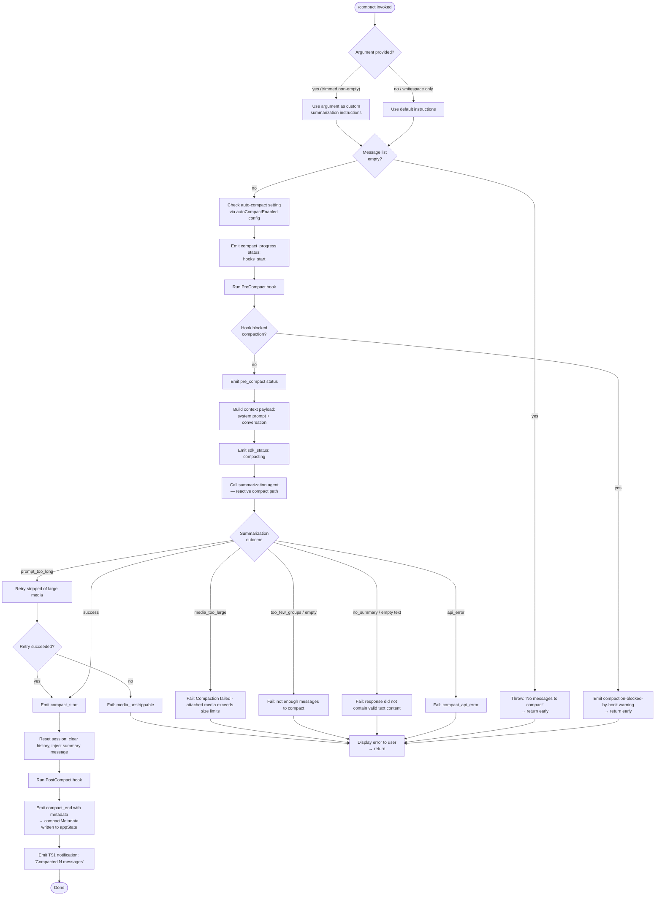

# `/compact`

> Analysis basis: CC v2.1.146 bundle.js (AST extraction + Claude interpretation)
> Minimum version: v2.1.146

---

## Overview

`/compact` frees up context window space by replacing the current conversation history with a single AI-generated summary. It accepts an optional argument providing custom summarization instructions, runs a `PreCompact` lifecycle hook before summarization and a `PostCompact` hook after, and then resets the session state so the summarized transcript becomes the new baseline. The command also supports fully automatic ("reactive") triggering by the runtime when the context approaches its limit.

---

## Registration

| Field | Value |
|---|---|
| type | `local` |
| name | `compact` |
| description | `Free up context by summarizing the conversation so far` |
| argumentHint | `<optional custom summarization instructions>` |
| supportsNonInteractive | `true` |
| thinClientDispatch | `post-text` |
| module_id | `Z$1` |
| load_inline | `true` |
| loc_byte | `10521321` |
| loc_byte_end | `10521634` |
| loc_line | `8448` |
| arbor_handler.name | `h07` |
| arbor_handler.fqn | `claude-2.1.146::h07` |
| arbor_handler.kind | `AsyncFunction` |
| arbor_handler.resolution_path | `module_id` |
| arbor_handler.n_hits | `0` |

Analysis basis: CC v2.1.146 bundle.js:+10521321

---

## Input Branching

The handler has more than three distinct branches depending on argument presence, guard conditions, and compaction outcome, so a Mermaid flowchart is used.



Analysis basis: CC v2.1.146 bundle.js:+10520308 (handler entry `h07`), +10520339 (no-messages guard), +9688178 (hook-blocked guard), +9707276 (prompt_too_long path), +9707341 (media_too_large path), +9708452 (too_few_groups path)

---

## Behavioral Spec

### Handler Entry — `compactCommandHandler` (`h07`)

```
async function compactCommandHandler(args, context):
    rawArg = args.trim()

    if conversationMessages.length == 0:
        throw Error("No messages to compact")
        # Analysis basis: CC v2.1.146 bundle.js:+10520339

    customInstructions = rawArg if rawArg != "" else undefined

    # Emit initial progress signal
    emitStatus("compact_progress", phase="hooks_start")
    # Analysis basis: CC v2.1.146 bundle.js:+10517715

    # Run PreCompact lifecycle hook
    hookResult = await runPreCompactHook(context)
    if hookResult.blocked:
        emitWarning("compaction-blocked-by-hook",
                    "compaction blocked by PreCompact hook")
        return
        # Analysis basis: CC v2.1.146 bundle.js:+9688178

    emitStatus("compact_progress", phase="pre_compact")
    # Analysis basis: CC v2.1.146 bundle.js:+10517738

    # Gather system prompt and conversation payload
    systemPrompt = await buildSystemPrompt(context)
    conversationPayload = buildContextPayload(context)

    emitStatus("sdk_status", value="compacting")
    # Analysis basis: CC v2.1.146 bundle.js:+10517800

    # Delegate to reactive-compact engine
    result = await reactiveCompactEngine(
        conversationPayload,
        customInstructions,
        mode="manual"  # literal found at +10517895
    )

    # Handle outcome
    if result.error == "prompt_too_long":
        result = await retryStrippedCompact(conversationPayload)
        # Analysis basis: CC v2.1.146 bundle.js:+9709898
        if result.error == "media_unstrippable":
            displayError("Compaction failed · attached media exceeds size limits")
            return

    elif result.error in ["media_too_large"]:
        displayError("Compaction failed · attached media exceeds size limits")
        # Analysis basis: CC v2.1.146 bundle.js:+10518569
        return

    elif result.error in ["too_few_groups", "empty"]:
        displayError("not enough messages to compact")
        return

    elif not result.summaryText:
        displayError("Failed to generate conversation summary - " +
                     "response did not contain valid text content")
        return
        # Analysis basis: CC v2.1.146 bundle.js:+9690388

    elif result.error == "api_error":
        displayError("unknown error")
        # Analysis basis: CC v2.1.146 bundle.js:+10518694
        return

    # --- Success path ---
    emitStatus("compact_start")
    # Analysis basis: CC v2.1.146 bundle.js:+10518242

    resetSession(summaryText=result.summaryText, context=context)
    # calls tr (post_compact_cleanup) at +10520656

    await runPostCompactHook(context)

    writeAppState("compactMetadata", result.metadata)
    # Analysis basis: CC v2.1.146 bundle.js:+10518778

    emitStatus("compact_end")
    # Analysis basis: CC v2.1.146 bundle.js:+10519322

    showNotification("Compacted " + result.messageCount + " messages")
    # Analysis basis: CC v2.1.146 bundle.js:+10519739

    return
```

### Reactive Compact Engine — `reactiveCompactEngine` (`aC_`)

```
async function reactiveCompactEngine(payload, customInstructions, mode):
    startTime = performance.now()
    # Analysis basis: CC v2.1.146 bundle.js:+9737603

    # Determine message groups for sliding-window summarization
    groups = buildMessageGroups(payload)      # uses HO / $P7 / hX

    if groups.length < 2:
        log("Reactive compact: fewer than 2 groups, nothing to compact")
        return { error: "too_few_groups" }
        # Analysis basis: CC v2.1.146 bundle.js:+9708452

    # Seed the summarizer request
    summarizeSet = selectSummarizeSet(groups)   # X91 slice math at +9708194

    if summarizeSet has no assistant messages:
        log("Reactive compact: no assistant messages in summarize set, bailing")
        return { error: "exhausted" }
        # Analysis basis: CC v2.1.146 bundle.js:+9709014

    # Invoke the summarization LLM call (V$7 at +9706381)
    summarizationResult = await callSummarizationAgent(
        summarizeSet,
        customInstructions,
        mode=mode
    )

    if summarizationResult.error == "prompt_too_long":
        # retry logic with stripped media
        return { error: "prompt_too_long" }

    if summarizationResult.error == "media_too_large":
        return { error: "media_too_large" }

    summaryText = extractSummaryText(summarizationResult)
    if not summaryText:
        log("Reactive compact: empty summary text in summarization response")
        return { error: "no_summary" }
        # Analysis basis: CC v2.1.146 bundle.js:+9707612

    emitTelemetry("tengu_compact", {
        mode: mode,
        durationMs: performance.now() - startTime
    })
    # Analysis basis: CC v2.1.146 bundle.js:+9691923

    return { summaryText, metadata: summarizationResult.metadata }
```

### Session Reset — `postCompactCleanup` (`tr`)

```
function postCompactCleanup(summaryText, context):
    # Emit sub-state event
    emitState("post_compact_cleanup")
    # Analysis basis: CC v2.1.146 bundle.js:+9733313

    # Clear ephemeral caches
    clearToolUseCache()          # xw8 at +9733386
    clearContextWindowCache()    # JWq at +9733392
    resetAutonomousLoopDelivered()   # Q$7 at +9733424

    # Reinitialize app state with compacted transcript
    setAppState({ conversationReset: true, summary: summaryText })
    # KZH → mO6.setState at +10518856

    # Rebuild output token metrics
    rebuildOutputMetrics()       # Mw at +9733474
```

### Summarization Agent System Prompt — `buildSummarizationSystemPrompt` (`P91`)

```
function buildSummarizationSystemPrompt(customInstructions):
    basePrompt = "You are a helpful AI assistant tasked with " +
                 "summarizing conversations."
    # Analysis basis: CC v2.1.146 bundle.js:+9701642

    if customInstructions:
        basePrompt += "\n" + customInstructions

    # Tool use is prohibited during compaction
    # denial message: "Tool use is not allowed during compaction"
    # Analysis basis: CC v2.1.146 bundle.js:+9699318
    # Compaction agent should only produce text summary
    # Analysis basis: CC v2.1.146 bundle.js:+9699398

    return basePrompt
```

### Context Payload Builder — `normalizeAttachmentForAPI` (`Xb_`)

```
function buildContextPayload(messages):
    # Normalizes each message type:
    # "assistant", "user", "api_system" → kept as-is
    # "attachment" → resolved to content blocks
    # "image", "text", "notebook", "pdf", "file" → typed content blocks
    # "mcp_resource" → Full contents block with do-not-re-read note
    # "task_status", "async_hook_response", "hook_success" → included
    # "deferred_tools_delta", "agent_listing_delta" → included
    # "mcp_instructions_delta", "memory_update" → included
    # "compaction_reminder", "current_session_memory" → included
    # Content type "compact_boundary" inserted as separator (literal at +10239011)
    # Analysis basis: CC v2.1.146 bundle.js:+10222931
    return normalizedPayload
```

### Auto-Compact Setting Check — `autoCompactSettingReader` (`mw8`)

```
function autoCompactSettingReader(config):
    # Reads "autoCompactEnabled" key from config
    # Analysis basis: CC v2.1.146 bundle.js:+9744236
    # Also parses numeric threshold (0–100 scale via parseFloat/parseInt)
    # "auto" string triggers automatic mode (literal at +9742059)
    # Threshold values: 1000 / 100 for normalization
    # Analysis basis: CC v2.1.146 bundle.js:+9742164, +9742200
    return { enabled: boolean, threshold: number }
```

### PreCompact Hook Execution — `runPreCompactHook` (`Ed`)

```
async function runPreCompactHook(context):
    # Hook type literal: "PreCompact" at +12672210
    hookResult = await executeHook("PreCompact", context)
    # Hooks can return block/allow decisions
    if hookResult.decision == "block":
        return { blocked: true }
    return { blocked: false }
    # Analysis basis: CC v2.1.146 bundle.js:+12672183
```

---

## State & Side Effects

| Item | Detail |
|---|---|
| Telemetry — compact attempt | `tengu_reactive_compact_attempt` (loc +9709175) |
| Telemetry — compact succeeded | `tengu_reactive_compact_succeeded` (loc +9740074) |
| Telemetry — compact failed | `tengu_compact_failed` (loc +9702921) |
| Telemetry — compact PTL retry | `tengu_compact_ptl_retry` (loc +9690020) |
| Telemetry — compact API error | `tengu_compact` (generic, loc +9691923) |
| Telemetry — compact cache prefix | `tengu_compact_cache_prefix` (loc +9689548) |
| Telemetry — cache sharing success | `tengu_compact_cache_sharing_success` (loc +9700195) |
| Telemetry — cache sharing fallback | `tengu_compact_cache_sharing_fallback` (loc +9700825) |
| Telemetry — reactive failed | `tengu_reactive_compact_failed` (loc +9737839) |
| Telemetry — precomputed discarded | `tengu_precomputed_compact_discarded` (loc +9716871) |
| Telemetry — post-compact file restore success | `tengu_post_compact_file_restore_success` (loc +9703403) |
| Telemetry — post-compact file restore error | `tengu_post_compact_file_restore_error` (loc +9703445) |
| Telemetry — compact_no_summary | (string literal `compact_no_summary` at +9690360) |
| Telemetry — compact_prompt_too_long | (string literal `compact_prompt_too_long` at +9689980) |
| Telemetry — compact_api_error | (string literal `compact_api_error` at +9690626) |
| Telemetry — compact_full | (string literal `compact_full` at +9691085) |
| Telemetry — compact_reactive | (string literal `compact_reactive` at +9738223) |
| Hook registration | Runs `PreCompact` hook before summarization; runs `PostCompact` hook after reset |
| appState changes | `compactMetadata` written; `conversationReset: true`; summary message injected |
| Tool-use cache | Cleared via `xw8` (loc +9733386) |
| Context-window cache | Cleared via `JWq` (loc +9733392) |
| Autonomous loop counter | Reset via `Q$7.resetAutonomousLoopDelivered` (loc +9733424) |
| Output token metrics | Rebuilt via `Mw` (loc +9733474) |
| Sound | None observed in depth-2 traversal |
| Progress events emitted | `compact_progress` → `pre_compact` → `sdk_status:compacting` → `compact_start` → `compact_end` |
| Keybinding registered | `app:toggleTranscript` / `ctrl+o` / scope `Global` (loc +10519600–10519632) |
| Non-interactive support | `supportsNonInteractive: true` — the command can run in `--non-interactive` mode |

---

## Version History

| Version | Change |
|---|---|
| v2.1.146 | Initial analysis |

---

## Common Mistakes

1. **Running `/compact` on an empty conversation.** The handler throws `"No messages to compact"` immediately (bundle.js:+10520339); there must be at least one conversation turn before invoking the command.
2. **Expecting tool calls during compaction.** The summarization agent is configured to produce text only; any response containing a tool use block is rejected as `"compaction agent should only produce text summary"` (bundle.js:+9699398).
3. **Assuming compaction always succeeds on first attempt.** If the assembled prompt exceeds context limits (`prompt_too_long`), the engine automatically retries with large media stripped. If that retry also fails (`media_unstrippable`), compaction aborts with an error message rather than silently succeeding (bundle.js:+9709898).
4. **Ignoring the `PreCompact` hook.** A registered `PreCompact` hook returning a block decision will silently cancel compaction and emit a `compaction-blocked-by-hook` warning instead of an error (bundle.js:+9688178).
5. **Treating `/compact` output as permanent history.** After compaction, `conversationReset: true` is written to app state and all caches are cleared; any subsequent `/clear` or model context switch will start from the injected summary, not the original transcript.
6. **Passing excessively long custom instructions.** The argument is trimmed but not length-limited at the registration layer; very long instructions may push the summarization request past token limits, triggering the `prompt_too_long` retry loop.

---

## Appendix — Identifier Mapping

> For bundle debugging only. Identifiers change across versions.

| Identifier | Role |
|---|---|
| `h07` | Main `/compact` async handler (arbor-resolved entry point) |
| `HO` | Message-group builder / conversation slicer |
| `$P7` | Group partition helper called by `HO` |
| `hX` | Low-level group utility called by `$P7` |
| `ALH` | Auto-compact orchestrator (calls `LjH`, `n0`, `IP`, `Eq`, `mw8`) |
| `LjH` | Token-counting / context-limit checker |
| `C_` | Context window state accessor |
| `N6` | Global conversation-message store accessor |
| `mw8` | Auto-compact setting reader (reads `autoCompactEnabled`) |
| `yG` | Setting value parser called by `mw8` |
| `eC_` | Numeric threshold normalizer (parseFloat/parseInt, 0–100 scale) |
| `S07` | High-level compact orchestrator (drives entire compact flow) |
| `EZ` | Context payload assembler |
| `IO7` | System-prompt serializer |
| `LQH` | Token-count formatter |
| `Xb_` | Message normalizer / `normalizeAttachmentForAPI` |
| `Ed` | PreCompact hook runner |
| `IL` | Hook dispatcher |
| `o2` | Hook execution engine |
| `HT8` | Subprocess hook spawner |
| `Si_` | HTTP hook runner |
| `E$1` | Session-state context builder |
| `vG` | Full system-prompt assembler |
| `ri_` | System-prompt fragment: agent intro |
| `yD8` | System-prompt fragment: environment info (static) |
| `e_` | System-prompt fragment: platform capability info |
| `dr7` | System-prompt fragment: coding style rule |
| `ti_` | System-prompt fragment: context-management section |
| `qo7` | System-prompt fragment: memory / schedule section |
| `OM6` | Memory-prompt builder (reads CLAUDE.md / team memory) |
| `zo7` | System-prompt fragment: worktree / env info |
| `Oo7` | System-prompt fragment: additional working directories |
| `Do7` | System-prompt fragment: output-style section |
| `wo7` | System-prompt fragment: background-session notice |
| `Po7` | System-prompt fragment: brief-mode check |
| `Go7` | System-prompt fragment: focus-mode section |
| `fo7` | System-prompt fragment: language/locale |
| `Ttq` | GrowthBook feature-flag fetcher for prompt fragments |
| `aC_` | Reactive-compact engine (sliding-window summarizer) |
| `Bj` | Conversation turn serializer |
| `Iw8` | Message-group selector with sliding-window math |
| `X91` | Math helper: `Math.max` / `Math.floor` for group offset |
| `V$7` | Summarization LLM caller (reactive-compact path) |
| `v$7` | Alternate/retry summarization caller |
| `KG` | API client builder for summarization |
| `QY` | App-state getter used during compact |
| `m91` | Compaction main loop (drives `P91`, `l$7`, `KjH`, etc.) |
| `P91` | Summarization agent main request loop |
| `Ew8` | File-reference attachment restorer (post-compact) |
| `kD8` | Single file-reference restore unit |
| `Nw8` | Local-agent task state restorer |
| `Zw8` | Plan-file reference restorer |
| `vw8` | Additional file-reference restore path |
| `Vw8` | Conversation message format converter |
| `d4H` | Tool-use permission-set rebuilder |
| `GR_` | Deferred-tool pool manager |
| `xIH` | MCP-instructions pool updater |
| `uIH` | User-tool list rebuilder |
| `rp` | Plugin-hook loader |
| `qX6` | Hook executor for plugin hooks |
| `g2` | Full agent query driver (used by compact summarization) |
| `tr` | Post-compact session cleanup (`post_compact_cleanup`) |
| `Sw8` | Precomputed-compact cache checker |
| `G91` | Cache-entry validator |
| `KZH` | App-state `setState` wrapper (`mO6.setState`) |
| `T$1` | Compact-end notification emitter |
| `CcH` | Model-display-name resolver |
| `kNL` | Model short-name table (opus, sonnet, etc.) |
| `BJ` | Action-registry dispatch (toggleTranscript keybinding) |
| `kzH` | OpenTelemetry metrics emitter for compaction |
| `V4` | OTEL span/event emitter |
| `de` | App-state `setState` caller (post-compact metadata) |
| `It9` | Alternate `setState` path |
| `RrH` | Compaction orchestrator (ties together PreCompact, summarization, reset) |
| `aoH` | Compact-mode flag accessor |
| `Pw8` | Whitespace trimmer for summary text |
| `T8` | UUID + session-ID generator |
| `w91` | Media-stripping retry helper |
| `aFH` | Media-block size checker |
| `DEH` | Array media-block detector |
| `S3_` | Media-size byte parser |
| `Qv` | Summary-text prefix checker (`<summary>` tag) |
| `J91` | Error-message formatter for compact failures |
| `ZH` | Generic `String()` coercer |
| `OS` | Output-queue manager |
| `Df` | Platform/process environment builder |
| `eP` | Output-format resolver |
| `_M6` | REPL-context accessor |
| `IW6` | User-prompt template expander |
| `Y$7` | Template variable replacer |
| `Pi` | Rate-limit / usage-state checker |
| `qb_` | Summary-header formatter |
| `mH` | `String()` primitive coercer (used throughout) |
| `fK` | `String()` wrapper with fallback |
| `SH` | Structured error logger |
| `uH` | No-op / stub util |
| `bH` | Weak-reference store helper |
| `CH` | `JSON.stringify` wrapper |
| `Eq` | Model-ID prefix matcher |
| `n0` | Context-window token-limit resolver |
| `bl` | Claude-3 model family detector |
| `mZ` | Abort-controller timeout helper |
| `z8` | Compact cancellation state accessor |
| `hW6` | UUID generator wrapper |
| `o6H` | Telemetry event emitter |
| `l$7` | Post-compact file-restore orchestrator |
| `KjH` | Compact-prompt assembler for summarization |
| `yC_` | Summary XML-tag extractor (`<summary>` parser) |
| `Dw8` | Token-count rounder |
| `Yw8` | Message-stat accumulator (humanMessages / assistantMessages) |
| `nC_` | Post-cleanup finalizer |

Note: index built via Arbor fallback; some signals (telemetry, literals) may be missing — see arbor-fallback.js.