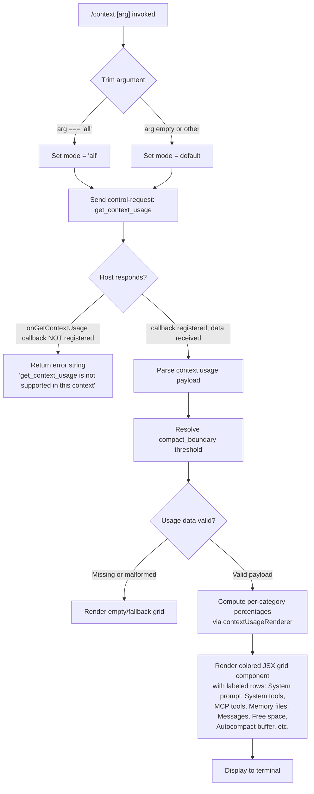

# `/context`

> Analysis basis: CC v2.1.146 bundle.js (AST extraction + Claude interpretation)
> Minimum version: v2.1.146

---

## Overview

`/context` visualizes the current session's context window usage as a colored grid displayed in the terminal. When invoked with the optional `all` argument, it requests complete context-usage data from the host environment via a `get_context_usage` control request and renders the result as a JSX component. This gives users a quick at-a-glance view of how much of their available context has been consumed across various categories (system prompt, tools, memory, messages, free space, etc.).

---

## Registration

| Field | Value |
|---|---|
| type | `local-jsx` |
| name | `context` |
| description | Visualize current context usage as a colored grid |
| argumentHint | `[all]` |
| thinClientDispatch | `control-request` |
| module_id | `tz1` |
| load_inline | `true` |
| loc_byte | `10919469` |
| loc_byte_end | `10919695` |
| loc_line | `8500` |
| arbor_handler.name | `yZ7` |
| arbor_handler.fqn | `claude-2.1.146::yZ7` |
| arbor_handler.kind | `AsyncFunction` |
| arbor_handler.resolution_path | `module_id` |
| arbor_handler.n_hits | `0` |

Analysis basis: CC v2.1.146 bundle.js:+10919469

---

## Input Branching

The command has 3+ distinct branches based on the optional argument, the response from the host, and the rendering path:



Analysis basis: CC v2.1.146 bundle.js:+10918103, +10918134, +10918169, +10918229, +10918339

---

## Behavioral Spec

### Handler Entry (contextCommandHandler / `yZ7`)

The Arbor-resolved handler is `yZ7` (an `AsyncFunction` in module `tz1`).

```
async function contextCommandHandler(args, clientInterface):
    trimmedArg = args.trim()                          // +10918109
    mode = resolveMode(trimmedArg)                    // "all" or default
    
    response = await clientInterface.sendControlRequest(
        "get_context_usage", { mode }
    )                                                  // +10918169
    
    if response is error or unsupported:
        return errorMessage(
            "get_context_usage is not supported in this context ..."
        )                                              // from literal +12073708
    
    usageData = parseControlResponse(response)        // via $nH +10918229
    renderedGrid = buildContextGrid(usageData)        // via IG6  +10918339
    
    return JSX(renderedGrid)                          // via kG6.createElement +10918233
```

Analysis basis: CC v2.1.146 bundle.js:+10918103

---

### Control Request Dispatch (`yZ7` → `K.sendControlRequest`)

The handler dispatches a `control-request` message (matching `thinClientDispatch: "control-request"`) with the opcode `"get_context_usage"`.

```
function dispatchGetContextUsage(client, mode):
    requestPayload = {
        type: "get_context_usage",
        mode: mode        // "all" or default
    }
    return client.sendControlRequest(requestPayload)  // +10918169
```

The literal `"get_context_usage"` is confirmed at bundle.js:+10918199.

---

### Response Listener (`$nH`)

After issuing the control request, the handler attaches a `"data"` event listener that receives the response string, converts it via `toString()`, and passes it to the renderer function (`Um`).

```
function attachResponseListener(emitter, onData):
    emitter.on("data", (rawBuffer) => {              // +7464488, +7464493
        text = rawBuffer.toString()                  // +7464525
        onData(text)
    })
    return renderResponseAsJSX(text)                 // via Um +7464552
```

Analysis basis: CC v2.1.146 bundle.js:+7464488

---

### Context Grid Renderer (`IG6`)

This function consumes the parsed usage payload and produces a colored grid.

```
function buildContextGrid(usagePayload):
    categories = usagePayload.filter(validCategory)   // +10916207
    
    // Identify special named regions
    freeSpaceEntry  = findByLabel("Free space")        // literal +10916242
    autoCompactEntry = findByLabel("Autocompact buffer")// literal +10916265

    for each category in [
        "System prompt",      // literal +9756055
        "System tools",       // literal +9756134
        "MCP tools",          // literal +9756198
        "MCP tools (deferred)",// literal +9756274
        "System tools (deferred)", // literal +9756360
        "Custom agents",      // literal +9756449
        "Memory files",       // literal +9756516
        "Skills",             // literal +9756578
        "Messages",           // literal +9757078
        "Free space",         // literal +10916242
        "Autocompact buffer"  // literal +10916265
    ]:
        pct = computePercentage(category.tokens, total)// via ka +10917942
        color = pickColor(pct, category.kind)

    compactBoundary = resolveCompactBoundary()         // literal "compact_boundary" +10239011
    
    return formatGrid(cells, compactBoundary)
```

Percentage thresholds referenced:
- `< 20` threshold string (bundle.js:+207148)
- Numeric thresholds: `20` (bundle.js:+207139), `10` (bundle.js:+207181)
- Auto-compact triggered at `80`% (bundle.js:+10918570)

Analysis basis: CC v2.1.146 bundle.js:+10916166, +10917942

---

### Compact Boundary Resolution (`kZ7` / `HO`)

The compact-boundary marker is derived from the session's auto-compact settings and rendered as a separator or marker within the grid.

```
function resolveCompactBoundary(sessionState):
    raw = sessionState.getCompactBoundary()      // via $P7 +10239141
    if raw:
        return raw.slice(...)                    // +10239164
    return null
```

Literal key: `"compact_boundary"` at bundle.js:+10239011.

Analysis basis: CC v2.1.146 bundle.js:+10918065

---

### Mode Resolver (`Q3`)

When the trimmed argument equals `"all"` (literal at bundle.js:+10918134), the resolver returns a flag to request the full context breakdown. Otherwise it defaults to the standard summary view.

```
function resolveMode(arg):
    if arg === "all":           // literal "all" +10918134
        return "all"
    return "default"            // literal "default" +3339783
```

Analysis basis: CC v2.1.146 bundle.js:+10918142

---

### App-State Mutation (`de` → `It9`)

After a successful response is rendered, the command optionally updates application state (e.g., storing the last context-usage snapshot) via `It9` → `mO6.setState`.

```
function updateAppState(contextSnapshot):
    stateManager.setState(contextSnapshot)           // via It9 +4792419
```

Analysis basis: CC v2.1.146 bundle.js:+10918538

---

## State & Side Effects

| Item | Detail |
|---|---|
| Telemetry | No `tengu_*` events are directly emitted in the top-level `yZ7` handler or `IG6` renderer at depth ≤ 2. Indirect telemetry may fire through `O9` sub-calls (e.g., `tengu_amber_creek` at +3339940, `tengu_pewter_brook` at +3339848) from shared session-state helpers. |
| Control request | Emits a `"get_context_usage"` control-request message to the host environment (literal +10918199). |
| Hook registration | `c9` → `c_A.register` (bundle.js:+57267) — registers a render callback for JSX output. |
| appState changes | `de` → `It9` → `mO6.setState` may persist the context snapshot to session state (bundle.js:+4792419). |
| Sound | None observed. |
| File I/O | None directly in handler; file-system calls are in deeper utility paths not specific to this command. |

---

## Version History

| Version | Change |
|---|---|
| v2.1.146 | Initial analysis |

---

## Common Mistakes

1. **Omitting the `[all]` argument**: Without `all`, the grid may show only a summary view; pass `/context all` to get the full per-category breakdown including deferred tool slots.
2. **Running in a client that does not support `get_context_usage`**: If the host has not registered an `onGetContextUsage` callback (e.g., certain streaming/non-interactive modes), the command returns an unsupported-context error message instead of a grid (literal: `"get_context_usage is not supported in this context ..."`, bundle.js:+12073708).
3. **Misinterpreting the auto-compact threshold**: The `80`% marker (bundle.js:+10918570) in the grid indicates the auto-compact trigger level, not the hard context limit. Context is still available above this line.
4. **Expecting real-time updates**: `/context` is a one-shot command; it does not subscribe to live token-count changes. Re-run the command to refresh.

---

## Appendix — Identifier Mapping

> For bundle debugging only. Identifiers change across versions.

| Identifier | Role |
|---|---|
| `yZ7` | Main async handler for `/context` command (Arbor-resolved entry point) |
| `O9` | Session context state accessor / shared context helper |
| `KbH` | Context feature-flag checker (`qxK.has`) |
| `zL_` | Context string utilities (`fK`, `mH`) |
| `fK` | String conversion helper A |
| `mH` | String conversion helper B |
| `Vn` | Fullscreen / terminal capability checker (iTerm2/tmux detection) |
| `IQ4` | Terminal type resolver |
| `NQ4` | Terminal prefix checker (`H.startsWith`) |
| `N` | Model/display-name formatter |
| `$wK` | Model identifier lookup |
| `n_A` | Model-alias resolver (`OzK`, `zzK`) |
| `CH` | JSON serializer wrapper (`JSON.stringify`) |
| `O4` | Path/string normalizer (`VqA`, `H.replace`, `A.lastIndexOf`, `A.slice`) |
| `VqA` | Model display-name map iterator (`AwK.map`) |
| `YwK` | Conversation log / transcript writer |
| `sSH` | Output batching scheduler (`clearTimeout`, `setTimeout`, `setImmediate`) |
| `KAH` | Log-flush coordinator |
| `kQ4` | Context-usage data pipeline entry |
| `N6` | Context message collection manager |
| `Tt` | Message formatter pair (`mH`, `qg`) |
| `Ga6` | Deduplication guard for context entries (`EK_.has/add`, `M$H.get`) |
| `m6` | Context record builder (`Date.now`, `cB4`) |
| `Q3` | Argument mode resolver (maps `"all"` → full mode) |
| `KXH` | Mode constant table |
| `$nH` | Control-response data event listener |
| `Um` | JSX response renderer dispatcher |
| `qf_` | React-like element factory (`Kp9.createElement`) |
| `_1H` | Rendering coordinator |
| `sBH` | Sub-renderer (routes to `O9`, `N6`, `mH`, `Vn`) |
| `IG6` | Context grid builder — main visualization function |
| `P1` | Percentage formatter (`YK`, `jwK`) |
| `YK` | Locale-aware number formatter |
| `jwK` | Compact decimal formatter |
| `ka` | Per-cell percentage calculator (`Math.round`) |
| `QbH` | Grid cell color picker |
| `ZH` | String coercion utility |
| `kZ7` | Compact-boundary lookup wrapper |
| `HO` | Compact-boundary slice extractor |
| `$P7` | Raw compact-boundary data accessor (`hX`) |
| `de` | App-state mutation dispatcher |
| `It9` | State-setter invoker (`mO6.setState`) |
| `Bw8` | Full system-prompt assembly pipeline |
| `IG6` | (same as above) context grid renderer |
| `mw8` | Auto-compact window resolver (`yG`, `C_`, `N6`, `eC_`) |
| `eC_` | Token-string parser (trim → endsWith → parseFloat/parseInt → Math.round) |
| `Zd` | Context-window breakdown calculator (`Math.max`, `Math.min`) |
| `Eq` | Model-name resolver |
| `Gj` | Model-string normalizer (lowercase, replace) |
| `n0` | Token-limit record builder |
| `bl` | Claude-3 model branch |
| `Z9H` | Capped-context record |
| `$r6` | Numeric token-limit finalizer |
| `ie` | Token-limit validator (`parseInt`, `isNaN`) |
| `IP` | Context limit passthrough |
| `vG` | System-prompt parts assembler |
| `OM6` | Memory/CLAUDE.md prompt loader |
| `yD8` | Tool-listing helper |
| `qo7` | Session-guidance assembler |
| `Oo7` | Environment-info block builder (`si_`, `tO`, `oi_`) |
| `si_` | OS info collector (`dyH.version/release/type`) |
| `fo7` | Agent-preamble builder (`mH`, `N6`, `N`) |
| `Ttq` | Feature-flag prompt injector |
| `gw8` | Prompt-parts collector for system prompt |
| `fy9` | Memory-prompt assembler |
| `cp1` | Prompt-section slicer |
| `MaH` | Message-history token counter |
| `rIH` | Token-count API caller |
| `Q91` | Conversation token-count recorder |
| `HO7` | History message processor |
| `_O7` | Message-list reducer (filters, maps) |
| `KO7` | Context-usage computation for messages |
| `LO7` | Tool-result token aggregator |
| `AO7` | MCP message token counter |
| `OO7` | Category breakdown finalizer |
| `fO7` | Freeform category token reporter |
| `MO7` | Message-block token reporter |
| `$O7` | System-section token reporter |
| `kG` | Full API request builder |
| `Xb_` | Message normalizer / attachment flattener |
| `pH` | HTTP header/session map |
| `S6` | Timeout utility |
| `h8` | File logger |
| `nH` | MCP session loop controller |
| `qH` | MCP client connection handler |
| `D6` | Core agentic-run loop |
| `VH` | Alternate run-loop variant (shares most callees with `D6`) |

Note: index built via Arbor fallback; some signals (telemetry, literals) may be missing — see arbor-fallback.js.