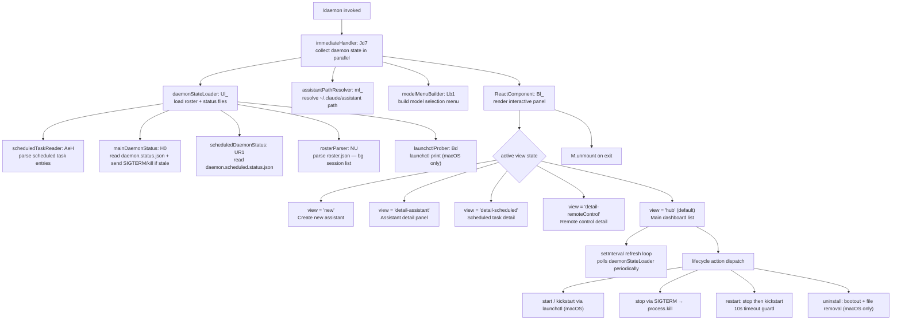

# `/daemon`

> Analysis basis: CC v2.1.146 bundle.js (AST extraction + Claude interpretation)
> Minimum version: v2.1.146

---

## Overview

`/daemon` is a local-jsx command that opens an interactive management panel for Claude Code's background service infrastructure. It renders a live dashboard covering three subsystems — AI assistants (background sessions), scheduled tasks, and remote-control endpoints — and provides lifecycle controls (start, stop, restart, uninstall) for each. The command executes `immediate: true`, meaning the UI panel is mounted synchronously on invocation without submitting a conversational turn to the model.

---

## Registration

| Field | Value |
|---|---|
| type | `local-jsx` |
| name | `daemon` |
| description | `Manage background services: assistants, scheduled tasks, and remote control` |
| immediate | `true` |
| module_id | `Fl_` |
| load_inline | `true` |
| loc_byte | `12350471` |
| loc_byte_end | `12350675` |
| loc_line | `10472` |
| arbor_handler.name | `Jd7` |
| arbor_handler.kind | `AsyncFunction` |
| arbor_handler.fqn | `claude-2.1.146::Jd7` |
| arbor_handler.resolution_path | `module_id` |
| arbor_handler.n_hits | `0` |

Analysis basis: CC v2.1.146 bundle.js:+12350471

---

## Input Branching

The command has five or more distinct UI view paths (new, detail-scheduled, detail-assistant, detail-remoteControl, plus the main hub panel) plus three lifecycle sub-commands (start/stop/restart/uninstall) and a launchctl platform branch, making a Mermaid flowchart the appropriate representation.



---

## Behavioral Spec

### Handler Entry — `Jd7` (AsyncFunction, Arbor-resolved)

The top-level handler resolves via `module_id` resolution path (Arbor symbol graph). On invocation it fires `Promise.all` over three parallel tasks:

```
async function daemonCommandHandler():
    [daemonState, assistantPath, modelMenu] = await Promise.all([
        loadDaemonState(),          // Ul_
        resolveAssistantPath(),     // ml_
        buildModelMenu()            // Lb1
    ])
    mountReactPanel(daemonState, assistantPath, modelMenu)
```

Analysis basis: CC v2.1.146 bundle.js:+12339230

---

### Daemon State Loader — `Ul_`

Collects all sub-system status concurrently, then aggregates for the panel:

```
async function loadDaemonState():
    results = await Promise.all([
        readScheduledTasks(),          // tC1 → AeH + SH + H0
        readMainDaemonStatus(),        // H0
        readScheduledDaemonStatus(),   // DS1
        readRemoteControlStatus(),     // UR1
        parseRoster(),                 // NU
        probeLaunchctl(),              // Bd
    ])
    return mergeState(results)         // Object.keys aggregation
```

Analysis basis: CC v2.1.146 bundle.js:+12338751

---

### Scheduled Task Reader — `AeH`

Reads scheduled task configuration from a JSON file, validates array shape, and produces task descriptors. File encoding: `"utf8"` (bundle.js:+12136735). The task type tag `"scheduled"` (bundle.js:+12227301) is stamped onto each entry. Stale lock files are removed via `unlinkSync`.

```
async function readScheduledTasks():
    rawJson = await fs.readFile(path, "utf8")
    parsed  = JSON.parse(rawJson.trim())
    if not Array.isArray(parsed):
        throw Error("expected array")
    tasks = filterAndTag(parsed, type="scheduled")   // Pl_ validates array shape
    cleanupStaleLocks(tasks)                         // q → p7K.unlinkSync
    return tasks
```

Analysis basis: CC v2.1.146 bundle.js:+12227289

---

### Main Daemon Status Reader — `H0`

Reads `daemon.status.json` (bundle.js:+12135939), extracts the PID, attempts `process.kill(pid, 0)` to probe liveness, and parses additional metadata. When a stale PID is detected it escalates via `jW` (process-kill helper). It also reads the PID file lines via `uU_` (splits on newline, slices relevant fields).

```
async function readMainDaemonStatus():
    statusPath = getStatusPath()               // GE6 → OS1.join
    raw = await Rx.readFile(statusPath)
    pid = parseJsonField(raw, "pid")           // hG6 → BjH, J8, Tq
    alive = probeProcessLiveness(pid)          // process.kill(pid, 0) — raises on dead
    if not alive:
        killProcess(pid)                       // jW → oI
    return { pid, alive, ...metadata }
```

The literal `"daemon"` (bundle.js:+10944541) and column slice index `4` (bundle.js:+10944529) are used when parsing `"claude daemon"` (bundle.js:+10944502) from process table lines.

Analysis basis: CC v2.1.146 bundle.js:+10944583

---

### Roster Parser — `NU`

Reads `roster.json` (bundle.js:+10951127), decodes background session entries, validates timestamps, and applies `TLH.test` regex validation to session identifiers. If the file is malformed, telemetry event `tengu_bg_roster_parse_failed` is fired (bundle.js:+10954789).

```
async function parseRoster():
    path = buildRosterPath()          // ILH → q$.join
    raw  = await ZsH.readFile(path)
    data = g6(raw)                    // JSON.parse
    validateTimestamp(data, nU_)      // Date.now comparison
    for entry in data:
        if not TLH.test(entry.id):
            throw Error("invalid roster entry id")
        if LV7(entry):                // validates array/object shape
            yield normalizedEntry
    on parse failure:
        emit("tengu_bg_roster_parse_failed")
        return []
```

Analysis basis: CC v2.1.146 bundle.js:+10954699

---

### macOS launchctl Prober — `Bd`

On macOS (darwin), probes the LaunchAgent service using `launchctl print` (bundle.js:+10948619) with a 5 000 ms timeout (bundle.js:+10948653). The platform check is performed by `SY1` which calls `process.getuid()`. The service is identified by the string `"launchctl"` (bundle.js:+10948606).

```
async function probeLaunchctl():
    if platform != "darwin":
        return null
    uid = process.getuid()            // SY1
    svcLabel = buildServiceLabel(uid) // W8 → x6
    output = await runWithTimeout(
        cmd   = ["launchctl", "print", svcLabel],
        timeout = 5000
    )
    return parseLaunchctlOutput(output)  // V_ → v2H, SH
```

Analysis basis: CC v2.1.146 bundle.js:+10948603

---

### Assistant Path Resolver — `ml_`

Resolves the local assistant data directory under `~/.claude/assistant` (bundle.js:+12323140). Uses `FC1.homedir()` (bundle.js:+12323119) and `pE6.stat` to test for existence. Returns a `ZH`-encoded path string.

```
function resolveAssistantPath():
    home = os.homedir()                          // FC1.homedir
    base = path.join(home, ".claude")            // K7H.join
    sub  = path.join(base, "assistant")
    exists = tryStatSync(sub)                    // pE6.stat + J8
    return exists ? sub : null
```

Analysis basis: CC v2.1.146 bundle.js:+12323080

---

### React Panel Component — `Bl_`

Mounts a live-refreshing Ink/React component. Uses `w1.useState` to manage the active view (`"hub"` default), a tick counter for refresh, and `w1.useEffect` + `setInterval` for polling. The panel tab names are:

- `"Scheduled"` (bundle.js:+12340980)
- `"Remote Control"` (bundle.js:+12341301)
- `"Claude Daemon"` (bundle.js:+12341586)

View routing is driven by string literals found in the implementation:
- `"new"` (bundle.js:+12340151)
- `"detail-scheduled"` (bundle.js:+12340053)
- `"detail-assistant"` (bundle.js:+12340211)
- `"detail-remoteControl"` (bundle.js:+12340332)
- `"remoteControl"` (bundle.js:+12340629)

```
function DaemonPanel(daemonState, assistantPath, modelMenu):
    [view, setView]  = useState("hub")
    [tick, setTick]  = useState(Date.now())

    useEffect(() => {
        interval = setInterval(() => {
            newState = loadDaemonState()
            setTick(Date.now())
        }, POLL_INTERVAL_MS)
        return () => clearInterval(interval)
    }, [])

    switch view:
        case "new":              render NewAssistantForm(...)
        case "detail-assistant": render AssistantDetail(...)
        case "detail-scheduled": render ScheduledDetail(...)
        case "detail-remoteControl": render RemoteControlDetail(...)
        default:                 render HubDashboard(...)
```

Analysis basis: CC v2.1.146 bundle.js:+12339441

---

### macOS Service Lifecycle — `GsH` / `bG6` / `FU_`

Manages install, uninstall, start, stop, and restart of the LaunchAgent:

| Action | Mechanism |
|---|---|
| `start` | `launchctl kickstart` (bundle.js:+10947527) |
| `stop` | `launchctl stop` (bundle.js:+10947552) |
| `restart` | stop → wait up to 50 polls (bundle.js:+10947820) → kickstart; if daemon does not exit within 10 s abort is logged (bundle.js:+10947849) |
| `uninstall` | `launchctl bootout` (bundle.js:+10947164); note: `"service uninstall not available on darwin"` is logged in some paths (bundle.js:+10947296) |
| LaunchAgent dir | `~/Library/LaunchAgents` (bundle.js:+10945391, +10945401) |

The `hY1.setTimeout` timer (bundle.js:+10947805) enforces the restart timeout.

Analysis basis: CC v2.1.146 bundle.js:+10947136

---

### MCP Server Management — `_kH` / `M` / `_O5`

The panel also surfaces MCP server state. The MCP subsystem manager resolves servers by type (`"stdio"`, `"sse"`, `"http"`, `"sse-ide"`, `"ws-ide"`, `"claudeai-proxy"` — bundle.js:+9938177..+9938584), handles OAuth flows (`f8H`), and reconnects stale connections (`vd`). Telemetry events fire on OAuth outcomes and reconnect attempts (see State & Side Effects).

```
function manageMcpServers(serverMap):
    for [name, config] in Object.entries(serverMap):
        if config.type == "disabled":
            skip
        connection = resolveConnection(config)   // yb_
        if connection.state == "needs-auth":
            if cachedNeedsAuth(name):
                logDebug("Skipping connection (cached needs-auth)")
                connection.status = "needs-auth"
                continue
        connectWithRetry(connection)             // vd → mcp_reconnect telemetry
```

Analysis basis: CC v2.1.146 bundle.js:+9938688

---

### Background Session Supervisor — `$HA` / `MY5` / `w`

The supervisor maintains a pool of background worker sessions. Key behaviors:

- Spawns spare workers (`dU.spawn`) and tracks them in a Map, filing `tengu_bg_spare_spawn` telemetry.
- Dispatches tasks to idle workers; escalates to SIGKILL if SIGTERM is not acknowledged (literal `"SIGKILL"` bundle.js:+15060461; telemetry `tengu_bg_dispatch_sigkill_escalate`).
- Workers communicate over a Unix-socket protocol (`MY5`) with message types: `"ping"`, `"nudge"`, `"yield"`, `"lease"`, `"leases"`, `"shutdown"`, `"dispatch"`, `"reply"`, `"attach"`, `"resize"`, `"snapshot"`, `"stream"`, `"subscribe"` (bundle.js:+15047883..+15056490).
- Roster entries are written to `roster.json` via `_.rosterEntry`.
- On low memory (checked via `vv8.freemem`), fires `tengu_bg_dispatch_low_mem`.
- Attach stall detection: if a session stalls at startup beyond threshold, fires `tengu_bg_attach_stall_respawn` and respawns.

```
function supervisorLoop(workerPool):
    loop:
        freeMemMB = os.freemem() / 1_000_000
        if freeMemMB < LOW_MEM_THRESHOLD:
            emit("tengu_bg_dispatch_low_mem")
            rejectNewDispatches()

        for worker in workerPool.values():
            worker.retireIfSettled()

        spawnSpareIfNeeded()   // AHA → dU.spawn
        processInboundMessages()   // MY5 protocol handler
        sleep(POLL_MS)
```

Analysis basis: CC v2.1.146 bundle.js:+15060295

---

## State & Side Effects

| Item | Detail |
|---|---|
| Telemetry: roster parse failure | `tengu_bg_roster_parse_failed` (bundle.js:+10954789) |
| Telemetry: MCP OAuth start | `tengu_mcp_oauth_flow_start` (bundle.js:+9796317) |
| Telemetry: MCP OAuth success | `tengu_mcp_oauth_flow_success` (bundle.js:+9801094) |
| Telemetry: MCP OAuth error | `tengu_mcp_oauth_flow_error` (bundle.js:+9802478) |
| Telemetry: spare session enabled | `tengu_bg_spare_enable` (bundle.js:+15059830) |
| Telemetry: spare session spawned | `tengu_bg_spare_spawn` (bundle.js:+15060190) |
| Telemetry: daemon config reload | `tengu_daemon_config_reload` (bundle.js:+15074596) |
| Telemetry: config auth-loss prevented | `tengu_config_auth_loss_prevented` (bundle.js:+3166049) |
| Telemetry: daemon yield | `tengu_daemon_yield` (bundle.js:+15078682) |
| Telemetry: config parse error | `tengu_config_parse_error` (bundle.js:+3171293) |
| Telemetry: forked agent default turns exceeded | `tengu_forked_agent_default_turns_exceeded` (bundle.js:+10414277) |
| Telemetry: fork agent query | `tengu_fork_agent_query` (bundle.js:+10414720) |
| Telemetry: feature bad/ok | `tengu_feature_bad` / `tengu_feature_ok` (bundle.js:+955996, +955938) |
| Telemetry: SIGKILL escalation | `tengu_bg_dispatch_sigkill_escalate` (bundle.js:+15060413) |
| Telemetry: daemon control | `tengu_daemon_control` (bundle.js:+15095752) |
| Telemetry: low memory (macOS) | `tengu_bg_low_mem_mb` (bundle.js:+12414219) |
| Telemetry: low-mem dispatch skipped | `tengu_bg_dispatch_low_mem` (bundle.js:+15060992) |
| Telemetry: daemon idle exit | `tengu_daemon_idle_exit` (bundle.js:+15079597) |
| Telemetry: send-claim failed | `tengu_bg_sendclaim_failed` (bundle.js:+15041598) |
| Telemetry: spare session claimed | `tengu_bg_spare_claim` (bundle.js:+15061752) |
| Telemetry: spare session claim failed | `tengu_bg_spare_claim_fail` (bundle.js:+15062015) |
| Telemetry: amber anchor | `tengu_amber_anchor` (bundle.js:+3162320) |
| Telemetry: bg protocol mismatch | `tengu_bg_proto_mismatch` (bundle.js:+15048838) |
| Telemetry: stale dispatch dropped | `tengu_bg_dispatch_stale_drop` (bundle.js:+15050077) |
| Telemetry: legacy attach auto-respawn | `tengu_bg_attach_legacy_autorespawn` (bundle.js:+15052153) |
| Telemetry: attach | `tengu_bg_attach` (bundle.js:+15052564) |
| Telemetry: attach stall ms | `tengu_bg_attach_stall_ms` (bundle.js:+15044788) |
| Telemetry: attach stall gave up | `tengu_bg_attach_stall_gave_up` (bundle.js:+15053476) |
| Telemetry: attach stall respawn | `tengu_bg_attach_stall_respawn` (bundle.js:+15053745) |
| Telemetry: attach kick | `tengu_bg_attach_kick` (bundle.js:+15054662) |
| Telemetry: voice circuit breaker tripped | `tengu_voice_circuit_breaker_tripped` (bundle.js:+13649865) |
| Telemetry: voice recording started | `tengu_voice_recording_started` (bundle.js:+13651417) |
| Telemetry: voice stream early retry | `tengu_voice_stream_early_retry` (bundle.js:+13652857) |
| File reads | `daemon.status.json`, `daemon.scheduled.status.json`, `roster.json`, `daemon.json`, `mcp-needs-auth-cache.json` |
| File writes | Roster entries written atomically; stale lock files removed via `unlinkSync` |
| Process signals | `process.kill(pid, 0)` for liveness probe; SIGTERM / SIGKILL for lifecycle management |
| macOS LaunchAgent | Reads/writes `~/Library/LaunchAgents/`; uses `launchctl kickstart`, `stop`, `bootout` |
| React panel mount | Ink JSX panel mounted via `M.render`; unmounted via `M.unmount` on exit |
| setInterval refresh | Panel polls daemon state on a recurring interval; `clearInterval` on unmount |
| appState changes | `H.getAppState` / `H.setAppState` are called during background session attach flows |
| Sound | None detected in depth-2 traversal |

---

## Version History

| Version | Change |
|---|---|
| v2.1.146 | Initial analysis |

---

## Common Mistakes

1. **Running `/daemon` expecting a conversational response** — the command is `immediate: true` and `local-jsx`: it mounts a terminal UI panel synchronously and does not send a prompt to the model.
2. **Assuming the restart action is instantaneous on macOS** — restart waits up to 50 poll intervals (~10 s) for the process to exit before calling `kickstart`; if the daemon does not exit in time, the restart is aborted and logged.
3. **Expecting launchctl controls on non-macOS platforms** — `Bd` / `GsH` / `bG6` / `FU_` gate all launchctl operations behind a `process.platform == "darwin"` check; on Linux only direct `process.kill`-based controls are available.
4. **Ignoring the `"uninstall"` literal limitation** — `"service uninstall not available on darwin"` (bundle.js:+10947296) is logged in some codepaths; the uninstall flow uses `bootout` rather than a generic uninstall command.
5. **Expecting roster entries to persist across supervisor restarts without a valid `roster.json`** — the roster parser (`NU`) returns an empty list and fires `tengu_bg_roster_parse_failed` on any parse error, so corrupt roster files silently drop all prior session records.

---

## Appendix — Identifier Mapping

> For bundle debugging only. Identifiers change across versions.

| Identifier | Role |
|---|---|
| `Jd7` | Top-level async command handler (Arbor-resolved via module_id) |
| `Vd7` | Inner render/mount orchestrator for the daemon panel |
| `Ul_` | Daemon state loader — aggregates all sub-system status |
| `Bl_` | React panel component (Ink JSX, setInterval refresh loop) |
| `tC1` | Concurrent sub-loader: schedules AeH + SH + H0 |
| `AeH` | Scheduled task reader (reads + validates scheduled task JSON) |
| `dc_` | Low-level JSON file reader (readFile + JSON.parse + Array.isArray) |
| `Pl_` | Array shape validator for task entries |
| `jl_` | Task entry normalizer |
| `H0` | Main daemon status reader (daemon.status.json + process liveness) |
| `hG6` | PID file parser (readFile + BjH + J8 + Tq) |
| `uU_` | Process table line splitter (readFile + split + slice) |
| `jW` | Process-kill helper (wraps oI) |
| `DS1` | Main daemon status resolver (M1 + GE6 + Tq + process.kill + jW) |
| `GE6` | Status file path builder (OS1.join + i8) |
| `UR1` | Scheduled daemon status reader (daemon.scheduled.status.json) |
| `pR1` | Scheduled status path builder (uR1.join + i8) |
| `NU` | Roster parser (roster.json → bg session list) |
| `ILH` | Roster file path builder (q$.join + nkH) |
| `nkH` | Roster base path builder (q$.join + i8) |
| `nU_` | Timestamp freshness checker (Date.now) |
| `FY1` | Roster atomic writer (ZsH.rename + ILH + Date.now + SH) |
| `LV7` | Roster entry shape validator (Array.isArray + Object.keys) |
| `Bd` | macOS launchctl prober (launchctl print + 5000ms timeout) |
| `W8` | launchctl command runner (V_ + x6) |
| `V_` | Process spawner helper (v2H + D + lpK + JI + N + L8 + SH) |
| `x6` | Process exec helper (Wb6 + D_) |
| `hP8` | launchctl UID helper (SY1 → process.getuid) |
| `SY1` | UID accessor (process.getuid) |
| `ml_` | Assistant path resolver (~/.claude/assistant) |
| `D_` | Path normalizer / homedir-relative resolver (uV) |
| `ub6` | Config file path helper (Q6 + J8) |
| `cC1` | MCP/connection state aggregator (mJH + AR + H0 + L7H.basename) |
| `mJH` | MCP server state loader (M1 + L8 + ul_ + ZH + Tq + xl_ + Object.keys) |
| `Lb1` | Model menu builder → OsH |
| `OsH` | Model selection options builder (IG7 + model literals + ys + hjH + NG7) |
| `IG7` | Model registry assembler (ZA + kF + eMH + YmH + MP8 + cP + NHH + dp_ + …) |
| `M` | Ink render/unmount handle (_kH + z4K + L.get + N + L.values + _O5) |
| `_kH` | MCP server manager per-entry processor (GHH + zN + fD7 + yb_ + hb_ + XK1 + Ib_ + SX_) |
| `yb_` | MCP server connect/reconnect handler (Dz7 + AF + f8H + YaH + vd + Fu + Y + v7 + Yz7) |
| `f8H` | MCP OAuth server and connection lifecycle handler |
| `vd` | MCP reconnect orchestrator (reconnect + tengu_mcp_reconnect telemetry) |
| `Yz7` | SSH-aware MCP URL handler (Q_.isSSH + mH + t_) |
| `hb_` | MCP server background-task tracker (AF + zz7 + zaH + DaH + L + ZH) |
| `$HA` | Background session supervisor (spawn, dispatch, roster, lifecycle) |
| `MY5` | Supervisor IPC protocol handler (ping/nudge/yield/lease/dispatch/reply/attach/…) |
| `w` | Worker process lifecycle manager (A.get + C.kill + setTimeout + dU.spawn + …) |
| `AHA` | Claim-send helper (dU.claim + Dr_ + tz5 + sz5 + Ev8.connect) |
| `Dr_` | Daemon working-directory writer (__H.mkdir + __H.writeFile + JSON.stringify) |
| `GsH` | macOS service stop/uninstall handler (BU_ + W8 + hP8 + k8H.unlink) |
| `bG6` | macOS service install/start handler (FU_) |
| `FU_` | macOS service start/restart sequencer (hP8 + W8 + hY1.setTimeout) |
| `SH` | Log/error emitter (n_ + mH + X1 + PuK + jbH.push + $l.logError) |
| `n_` | Error message formatter (Error + String) |
| `mH` | String coercer (String) |
| `PuK` | Log queue manager (Db6.shift + Db6.push) |
| `O8` | MCP debug logger (jbH.push + $l.logMCPDebug) |
| `v7` | MCP error logger (jbH.push + $l.logMCPError) |
| `I` | Away-summary trigger (N + Date.now + uz8 + mL5 + ge1 + Z + Sq8 + uH) |
| `Sq8` | Away-summary request handler ($VH + N + H.addEventListener + A.abort + CZ + T8) |
| `CZ` | Conversation-context builder for away summary |
| `yh_` | App-state read/write wrapper (H.getAppState + H.setAppState) |
| `zS1` | Daemon PID-file writer (ul + Date.now + M1 + GE6 + CH) |
| `z` | Background session stop handler (bH + uH + Mk + ix) |
| `ix` | Process exit sequencer (Promise.race + Promise.all + Ag + $g + r8 + process.exit) |
| `N6` | Notification/log routing helper (gf6 + Qf6 + Tt + M$H + Ga6 + Bf6 + Kg + m6) |
| `rE6` | macOS memory threshold reporter (s6 + N6) |
| `VsH` | Scheduled-task status writer (gY1.then + NU + H + Date.now + fV7) |
| `fV7` | Scheduled-task file writer (ILH + ZsH.mkdir + QY1.dirname + Qz + CH) |
| `Qz` | Atomic file writer (ts8.randomBytes + xs.writeFile + xs.rename + …) |
| `NU` | (see above — roster parser) |
| `M1` | Async-local-storage store getter (f6L.getStore) |
| `L8` | Logger/formatter helper |
| `ZH` | String encoder (String) |
| `J8` | Error-code classifier |
| `g6` | JSON.parse wrapper |
| `CH` | JSON.stringify wrapper |
| `AR` | Daemon JSON path builder (mU_.join + i8) |
| `Jd7` | (see top — Arbor-resolved handler) |

---

Note: index built via Arbor fallback; some signals (telemetry, literals) may be missing — see arbor-fallback.js.