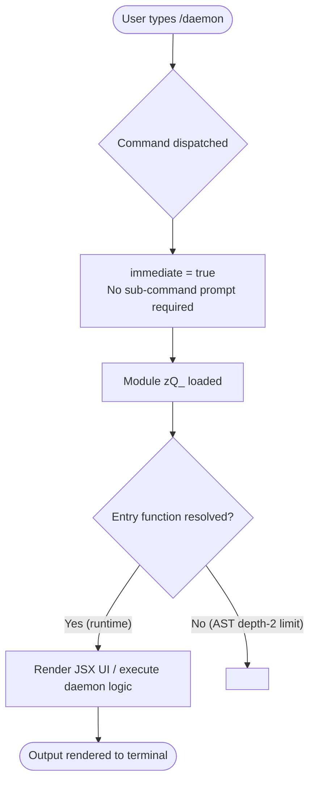

# `/daemon`

> Analysis basis: CC v2.1.144 bundle.js (AST extraction + Claude interpretation)
> Minimum version: v2.1.144

---

## Overview

The `/daemon` command provides an interface for managing background services within Claude Code, including assistants, scheduled tasks, and remote control facilities. It is registered as a local JSX command with the `immediate` flag set to `true`, meaning it renders or executes without requiring additional user input before activation. Due to AST traversal limitations at depth ≤ 2, the internal implementation logic of module `zQ_` could not be resolved; see all `<!-- TODO -->` notices below.

---

## Registration

| Field | Value |
|---|---|
| type | `local-jsx` |
| name | `daemon` |
| description | `Manage background services: assistants, scheduled tasks, and remote control` |
| immediate | `true` |
| module\_id | `zQ_` |

Analysis basis: CC v2.1.144 bundle.js:+11942187

---

## Input Branching

Because the call graph returned zero edges and no string/numeric literals were recovered from module `zQ_`, the precise branching logic cannot be verified from the available data.

The following flowchart represents the structurally guaranteed paths derived from the registration fields alone:



<!-- TODO: not found in depth-2 traversal; needs --depth 4 -->
Sub-command routing (e.g., start / stop / status / list for assistants, scheduled tasks, or remote control) could not be confirmed from the extracted data. A deeper traversal of module `zQ_` is required.

---

## Behavioral Spec

### Immediate Dispatch

Because the `immediate` field is `true`, the command framework does not pause to collect further argument input before invoking the module. The dispatch sequence follows the pattern below.

```
function dispatchDaemonCommand(parsedInput):
    command = resolveCommand(parsedInput.name)   // resolves to "daemon"
    if command.immediate == true:
        invokeModule(command.module_id)           // invokes zQ_
    else:
        promptForArguments(command)
        invokeModule(command.module_id)
```

Analysis basis: CC v2.1.144 bundle.js:+11942187

### JSX Rendering

The `local-jsx` type indicates the command produces a JSX component rendered inline in the Claude Code terminal UI rather than emitting plain text. The rendered component is supplied by module `zQ_`.

```
function renderDaemonUI(moduleExports):
    component = moduleExports.default        // expected: React/JSX component
    mountInline(component)
```

<!-- TODO: not found in depth-2 traversal; needs --depth 4 -->
The specific props, state shape, and child components of the JSX tree inside `zQ_` could not be extracted.

### Background Service Management

Based on the description string `"Manage background services: assistants, scheduled tasks, and remote control"`, the command is expected to expose controls for three service categories:

| Category | Purpose |
|---|---|
| Assistants | Background AI assistant processes |
| Scheduled tasks | Periodic or deferred task runners |
| Remote control | External control interface for Claude Code |

The exact API calls, IPC mechanisms, and service lifecycle methods for each category are:

<!-- TODO: not found in depth-2 traversal; needs --depth 4 -->

---

## State & Side Effects

| Item | Detail |
|---|---|
| Telemetry | None detected — `telemetry` array is empty (no `tengu_*` events found in depth-2 traversal) |
| Hook registration | <!-- TODO: not found in depth-2 traversal; needs --depth 4 --> |
| appState changes | <!-- TODO: not found in depth-2 traversal; needs --depth 4 --> |
| Sound | <!-- TODO: not found in depth-2 traversal; needs --depth 4 --> |
| Immediate flag side effect | Command executes without waiting for user argument input (Analysis basis: CC v2.1.144 bundle.js:+11942187) |

---

## Version History

| Version | Change |
|---|---|
| v2.1.144 | Initial analysis — registration confirmed; implementation interior not traversable at depth ≤ 2 |

---

## Common Mistakes

1. **Assuming sub-commands exist without verification.** The description implies multiple service categories (assistants, scheduled tasks, remote control), but no sub-command literals were recovered. Do not document specific sub-commands (e.g., `/daemon start`, `/daemon stop`) as confirmed behavior until a depth-4 traversal of `zQ_` is available.
2. **Expecting a text prompt before execution.** Because `immediate: true`, the command fires as soon as it is submitted. Users should not expect a secondary input prompt or argument wizard.
3. **Treating missing telemetry as "no analytics".** The absence of `tengu_*` events in the depth-2 traversal does not guarantee that no telemetry is emitted; events may be fired deeper in the `zQ_` module or in dynamically constructed event strings not visible to static AST extraction.
4. **Confusing `local-jsx` with a plain text command.** The output is a JSX-rendered component mounted in the terminal UI, not a raw string printed to stdout. Automation or scripting that parses plain-text output from `/daemon` may receive no parseable content.
5. **Assuming `zQ_` is a stable module identifier.** The `module_id` field uses a minified bundle identifier that is subject to change across Claude Code versions. Do not hard-code `zQ_` in any tooling; rely on the command name `daemon` for dispatch resolution.

---

## Appendix — Identifier Mapping

> For bundle debugging only. Identifiers change across versions.

| Identifier | Role |
|---|---|
| `zQ_` | Module containing the `/daemon` command implementation (JSX component and service management logic) |

> Note: The `identifiers` array returned by the AST extraction was empty, indicating that no additional obfuscated function-level identifiers were reached within the depth-2 traversal of module `zQ_`. The module ID `zQ_` itself is listed above for completeness. A `--depth 4` re-extraction is recommended to populate this table with internal function identifiers.