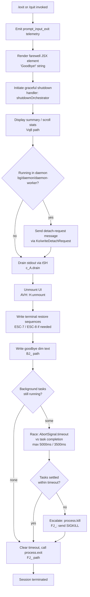

# `/exit`

> Analysis basis: CC v2.1.146 bundle.js (AST extraction + Claude interpretation)
> Minimum version: v2.1.146

---

## Overview

The `/exit` command (aliased as `/quit`) terminates the Claude Code CLI session. When invoked, it immediately triggers a graceful shutdown sequence: it renders a farewell JSX element, emits a `prompt_input_exit` telemetry event, and then orchestrates an orderly teardown of all active subsystems — draining output streams, retiring background tasks, unmounting the UI, and ultimately calling `process.exit`. The command is registered as `immediate`, meaning it bypasses normal command-queue processing and executes synchronously upon receipt.

---

## Registration

| Field | Value |
|---|---|
| type | `local-jsx` |
| name | `exit` |
| description | `null` |
| aliases | `["quit"]` |
| immediate | `true` |
| module_id | `Iy1` |
| load_inline | `true` |
| loc_byte | `12067806` |
| loc_byte_end | `12067967` |
| loc_line | `9947` |
| arbor_handler.name | `KB7` |
| arbor_handler.fqn | `claude-2.1.146::KB7` |
| arbor_handler.kind | `AsyncFunction` |
| arbor_handler.resolution_path | `module_id` |
| arbor_handler.n_hits | `1` |

Analysis basis: CC v2.1.146 bundle.js:+12067806

---

## Input Branching

The `/exit` handler has more than three distinct branching paths across its shutdown pipeline — covering daemon-process detection, background-task retirement, UI unmount paths, stream-drain race conditions, and process-kill escalation — so a Mermaid flowchart is used.



Analysis basis: CC v2.1.146 bundle.js:+12067055, +12067088, +12067102, +5271490, +5271570, +5271587, +5271707, +5270022, +5270047

---

## Behavioral Spec

### 1. Handler Entry — `exitCommandHandler` (KB7)

The Arbor-resolved handler `KB7` is an `AsyncFunction`. Upon invocation it performs the following in sequence:

```
async function exitCommandHandler(context):
    emitCheckpointIfNeeded(context)        // Cq → _3H
    playExitSound()                        // H (Math.random + setTimeout)
    sendDetachRequestIfDaemon(context)     // ELH
    renderFarewellComponent()             // jc_.createElement (JSX)
    scheduleShutdown(context)             // qB7 → EX
    runShutdownOrchestrator(context)      // n9 (main shutdown async chain)
    emitTelemetry("prompt_input_exit")   // literal at +12067243
```

Analysis basis: CC v2.1.146 bundle.js:+12067055, +12067067, +12067071, +12067132, +12067225, +12067238, +12067243

---

### 2. Daemon / Background-Process Detection — `sendDetachRequestIfDaemon` (ELH)

Before triggering full teardown, the handler checks whether the current process is running in a background context. The string literals `"bg"`, `"daemon"`, and `"daemon-worker"` control this branch.

```
function sendDetachRequestIfDaemon(context):
    mode = getCurrentProcessMode()          // Ld6
    if mode in ["bg", "daemon", "daemon-worker"]:
        payload = buildDetachPayload()      // _$1 → TjH, v8
        writeDetachMessage(payload)         // Ko → qo.write
        serializeMessage(payload)          // CH → JSON.stringify
    logDetachAttempt()                      // G8H
```

Literals: `"bg"` (+2174184), `"daemon"` (+2174194), `"daemon-worker"` (+2174208), `"detach-request"` (+10507435).

Analysis basis: CC v2.1.146 bundle.js:+10507401, +10507420, +10507426, +10507435, +10507481

---

### 3. Farewell UI Rendering — `renderFarewellComponent` (KB7 → jc_.createElement)

The handler renders a JSX component containing the string `"Goodbye!"` (literal at +12067019). This is a `local-jsx` type command so the return value is a React element displayed inline in the terminal UI before shutdown proceeds.

Analysis basis: CC v2.1.146 bundle.js:+12067019, +12067132

---

### 4. Shutdown Orchestrator — `shutdownOrchestrator` (n9)

This is the primary async shutdown function reached via `n9`. It coordinates all teardown steps:

```
async function shutdownOrchestrator(context):
    // Step 1: Resolve pending background tasks
    taskList = collectActiveTasks()         // oJ8 → G0, H.push, W07, hq

    // Step 2: Display session scroll/perf summary
    displayScrollSummary(context)          // Vq8 → yLq, O9

    // Step 3: Drain stdout
    drainOutputStream()                    // tSH → c_A.drain

    // Step 4: Race shutdown timeout vs task completion
    timeoutMs = Math.max(5000, 3500)       // literals +5271587, +5271594
    winner = await Promise.race([
        waitForAllTasks(vq8),              // vq8 → Promise.all, Promise.race, r8
        AbortSignal.timeout(timeoutMs)     // +5271849
    ])

    // Step 5: Unmount UI
    unmountUI()                            // AVH → H.unmount, YYH.writeSync

    // Step 6: Write terminal state restore
    writeTerminalRestoreSequences()        // tt6 → gt.writeSync (ESC-7/ESC-8)

    // Step 7: Write goodbye text (dim styled)
    writeGoodbyeText()                     // BJ_ → j6.dim, YYH.writeSync

    // Step 8: Finalize telemetry
    emitTelemetry("session_end")           // literal +5271958
    flushTelemetry()                       // n66

    // Step 9: Clear timeout and exit
    clearTimeout(pendingTimer)             // +5271784
    callProcessExit()                      // FJ_ → process.exit
```

Analysis basis: CC v2.1.146 bundle.js:+5271490, +5271520, +5271533, +5271541, +5271558, +5271564, +5271570, +5271578, +5271587, +5271594, +5271603, +5271683, +5271707, +5271761, +5271784, +5271832, +5271849, +5271885, +5271898, +5271910, +5271921, +5272001, +5272027

---

### 5. Task Collection — `collectActiveTasks` (oJ8)

Before exiting, the orchestrator enumerates all registered scheduled tasks and background sessions so they can be settled or force-killed.

```
function collectActiveTasks():
    tasks = []
    for task in globalTaskRegistry:        // G0 → uV
        tasks.push(task)                   // H.push (+10500933)
    formattedList = formatTaskList(tasks)  // W07 → GZ, HN
    truncatedDisplay = truncateForWidth(formattedList)  // hq → w8, Mq
    return tasks
```

The `"scheduled task"` string literal (+10500947) and `"task"` (+10502028) are used as task-type labels internally.

Analysis basis: CC v2.1.146 bundle.js:+10500928, +10500933, +10500974, +10500989, +10500947, +10502028

---

### 6. Force-Kill Escalation — `forceKillIfNeeded` (FJ_)

If the shutdown race times out before all tasks complete, `FJ_` escalates:

```
function forceKillIfNeeded(context):
    clearTimeout(shutdownTimer)            // clearTimeout +5269941
    activeProcess = getTrackedProcess()    // pL.get +5269974
    if activeProcess is alive:
        process.kill(activeProcess.pid)    // process.kill +5270047
    if still not exited:
        throw new Error("unreachable")     // literal "unreachable" +5270095
    process.exit(0)                        // process.exit +5270022
```

Analysis basis: CC v2.1.146 bundle.js:+5269941, +5269974, +5270022, +5270047, +5270089, +5270095

---

### 7. Sound on Exit — `playExitSound` (H)

A randomized exit sound (or animation) is triggered via `Math.random` and `setTimeout`. The numeric literals `2` (+13094831) and `1` (+13094847) suggest a two-variant random selection with a delay slot of 1 unit.

```
function playExitSound():
    variant = Math.floor(Math.random() * 2)  // +13094831, +13094833
    setTimeout(() => playVariant(variant), 1) // +13094847, +13094870
```

Analysis basis: CC v2.1.146 bundle.js:+13094831, +13094833, +13094847, +13094870

---

### 8. Terminal Restore Sequences — `writeTerminalRestoreSequences` (tt6)

Before final text output, the handler writes ANSI terminal save/restore escape sequences and handles multiplexer (tmux/screen) edge cases.

```
function writeTerminalRestoreSequences(context):
    gt.writeSync(ESC_SAVE)              // ESC-7 (\x1b7) +3674499
    gt.writeSync(ESC_RESTORE)           // ESC-8 (\x1b8) +3674510
    applyTerminalProfile(context)       // PTH: Ghostty ≥1.2.0, iTerm ≥3.6.6
    handleMultiplexerEscape(context)    // e0: tmux → \x1b\x1b, screen → replace
```

Supported terminal profiles: `"ghostty"` (≥`"1.2.0"`) (+3407452, +3407482), `"iTerm.app"` (≥`"3.6.6"`) (+3407521, +3407553). Multiplexer literals: `"tmux"` (+3331461), `"screen"` (+3331534).

Analysis basis: CC v2.1.146 bundle.js:+3674366, +3674499, +3674510, +3674519, +3674548, +3674569

---

### 9. Goodbye Text Rendering — `writeGoodbyeText` (BJ_)

After unmounting the UI, the orchestrator writes a plain-text farewell to the raw terminal stream, escaping backslashes and quotes as needed:

```
function writeGoodbyeText(context):
    text = buildGoodbyeString(context)  // pV, mR, S6
    text = text.replaceAll("\\", "\\\\")    // literal +5269733
    text = text.replaceAll('"', '\\"')      // literal +5269756
    YYH.writeSync(text)                     // +5269814
    writeDimSuffix(text)                    // j6.dim +5269830
    writeSessionPath(context)               // gY6, ZO
```

Analysis basis: CC v2.1.146 bundle.js:+5269645, +5269652, +5269667, +5269676, +5269696, +5269715, +5269733, +5269756, +5269782, +5269814, +5269830

---

### 10. Scroll / Session Summary — `displayScrollSummary` (Vq8)

Before the terminal is torn down, a brief performance/usage summary is displayed:

```
function displayScrollSummary(context):
    stats = buildScrollStats(context)       // yLq: Date.now, Math.max, Math.round
    renderDisplayMode(context)              // O9: KbH, zL_, Vn, OL_, N, N6
    emitTelemetry("tengu_scroll_summary")  // +5270890
```

Analysis basis: CC v2.1.146 bundle.js:+5270876, +5270882, +5270888, +5270917, +5270934

---

## State & Side Effects

| Item | Detail |
|---|---|
| Telemetry (direct) | `prompt_input_exit` (+12067243), `session_end` (+5271958) |
| Telemetry (transitive, background subsystem) | `tengu_bg_dispatch_sigkill_escalate` (+15060413), `tengu_bg_dispatch_low_mem` (+15060992), `tengu_bg_spare_enable` (+15061631), `tengu_bg_spare_claim` (+15061752), `tengu_bg_spare_claim_fail` (+15062015), `tengu_bg_spare_spawn` (+15060190), `tengu_daemon_config_reload` (+15074596), `tengu_startup_perf` (+211776), `tengu_scroll_summary` (+5270890), `tengu_amber_creek` (+3339940), `tengu_pewter_brook` (+3339848), `tengu_cache_eviction_hint` (+5271923) |
| stdout drain | `c_A.drain()` called via `tSH` before process exit (+57310, +5271683) |
| UI unmount | `H.unmount()` called via `AVH` (+5269422) |
| Timer management | A `setTimeout` is set for exit grace period; `clearTimeout` is called before final `process.exit` (+5271784) |
| Process kill | `process.kill(pid)` and `process.exit()` invoked by `FJ_` (+5270022, +5270047) |
| Terminal sequences | ANSI save/restore cursor sequences (`\x1b7`, `\x1b8`) written to raw stream (+3674499, +3674510) |
| Background task retirement | `x.retireIfSettled()` called per active task (+15061072); SIGTERM/SIGKILL escalation available (+15062250, +15060461) |
| File cleanup | `p7K.unlinkSync` available in task-cleanup path (+15039168) |
| appState changes | Session state transitions to ended; supervisor heartbeat stopped (`"heartbeat"` +15073025); display mode (`"fullscreen"`, `"default"`) may be reset (+3339757, +3339783) |
| Sound | Randomized exit sound played via `setTimeout` with 2-variant selection (+13094831, +13094847) |

---

## Version History

| Version | Change |
|---|---|
| v2.1.146 | Initial analysis |

---

## Common Mistakes

1. **Using `/exit` mid-task expecting immediate stop**: The command is `immediate` in registration, but the shutdown orchestrator still races a grace period of up to `Math.max(5000, 3500)` ms for active background tasks. The process may not exit instantaneously if background tasks are running.
2. **Expecting `/quit` to behave differently**: `/quit` is a registered alias for `/exit` and follows the exact same code path through handler `KB7`.
3. **Assuming no telemetry is sent on exit**: Both `prompt_input_exit` and `session_end` events are emitted, along with transitive telemetry from background daemon subsystems if those are active.
4. **Running in a daemon context and expecting clean UI teardown**: If the process mode is `"bg"`, `"daemon"`, or `"daemon-worker"`, a `detach-request` message is sent before the normal UI unmount path, which alters teardown ordering.
5. **Relying on stdout being flushed synchronously**: The shutdown path calls `c_A.drain()` asynchronously and uses `Promise.race` with a timeout; if the drain stalls, the process may be killed before all output is written.

---

## Appendix — Identifier Mapping

> For bundle debugging only. Identifiers change across versions.

| Identifier | Role |
|---|---|
| `KB7` | Main exit command handler (AsyncFunction); Arbor-resolved entry point |
| `Cq` | Checkpoint emitter (calls `_3H`) |
| `_3H` | Internal checkpoint sink |
| `H` | Exit sound player (uses `Math.random` + `setTimeout`) |
| `ELH` | Daemon-mode detach dispatcher |
| `Ld6` | Process-mode reader |
| `_$1` | Detach payload builder |
| `TjH` | Detach payload sub-constructor |
| `v8` | Detach payload sub-constructor (secondary) |
| `Ko` | Raw detach message writer (`qo.write`) |
| `CH` | JSON serializer wrapper (`JSON.stringify`) |
| `G8H` | Detach log emitter |
| `VM` | Shutdown scheduler / pre-exit hook |
| `oJ8` | Active-task collector |
| `G0` | Global task registry accessor |
| `uV` | Universal value resolver |
| `W07` | Task-list formatter |
| `GZ` | Task schedule parser (cron/interval strings) |
| `K` | Column formatter (uses `L.map`, `f.padEnd`) |
| `w` | Background process descriptor / worker state machine |
| `L` | Async task wrapper (add/finally/delete) |
| `j` | Worker kill helper (`A.values`, `y.kill`) |
| `D` | Daemon session disposer |
| `$` | Session stat accessor (`zS1`) |
| `J` | UTC date arithmetic helper |
| `HN` | Human-readable schedule label builder |
| `b5L` | Cron-field tokenizer |
| `A` | Locale-normalized string set |
| `fQH` | Next-occurrence time calculator |
| `_` | String / date utility alias |
| `O` | Date-mutation object |
| `f` | Close-pair handle (A.close / q.close) |
| `q` | Temp-file cleanup helper (`p7K.unlinkSync`) |
| `r9` | Duration formatter (`Math.floor`, `Math.round`) |
| `hq` | String width-aware truncator |
| `w8` | Grapheme-aware string-width measurer (`Bun.stringWidth`) |
| `Mq` | Multi-line truncation helper |
| `bz` | Truncation ellipsis helper |
| `qB7` | Farewell component scheduler (calls `EX`) |
| `n9` | Shutdown orchestrator (main async function) |
| `AVH` | UI unmount handler (`H.unmount`, `YYH.writeSync`) |
| `xh` | Post-unmount cleanup |
| `tt6` | Terminal restore sequence writer |
| `PTH` | Terminal profile applier (Ghostty, iTerm) |
| `DTH` | Secondary terminal-state handler |
| `e0` | Multiplexer escape handler (tmux/screen) |
| `mH` | String coercion utility (`String()`) |
| `BJ_` | Goodbye plain-text writer |
| `pV` | Session path resolver |
| `mR` | Message renderer |
| `S6` | Universal value emitter (`uV`) |
| `gY6` | Session directory writer |
| `gy` | Path joiner helper |
| `D_` | Directory existence checker |
| `Q6` | File stat helper |
| `ZO` | Session metadata formatter |
| `y4` | Config reader (`c9`) |
| `SLq` | Goodbye string localizer |
| `FJ_` | Force-exit / kill escalator (`process.exit`, `process.kill`) |
| `tSH` | stdout drain caller (`c_A.drain`) |
| `Y` | Supervisor lifecycle manager (stop/start/updateConfig) |
| `mJH` | Telemetry flush / session-end recorder |
| `M1` | Async-local store accessor (`f6L.getStore`) |
| `L8` | Session ID utility |
| `ul_` | Internal lifecycle helper (`xl_`) |
| `ZH` | String coercer for telemetry |
| `BC1` | Summary table renderer (`Object.keys`, `Math.max`, `lO`) |
| `W` | Input event stopper (`b.preventDefault`, `EW`, `Y`, `H`) |
| `b` | Keyboard event object |
| `EW` | User-settings updater (`HA`) |
| `V` | Config observer (stop/start/updateConfig) |
| `z5K` | Heartbeat stopper (`Zt`) |
| `Zt` | Heartbeat timer |
| `Z` | Restart-on-config-change watcher |
| `c` | Generic callback / continuation |
| `I_6` | Startup profiling reporter (`bh8`, `iqA`) |
| `bh8` | Performance mark collector (`Wu`, `Object.entries`) |
| `Wu` | Native `require` wrapper |
| `iqA` | Profiling log writer (`AAH`, `dqA`) |
| `aqA` | Profile output path builder |
| `AAH` | Sync file writer (`_AH.openSync` etc.) |
| `dqA` | Profile entry formatter |
| `N` | Telemetry event builder (`CH`, `NRH`) |
| `Vq8` | Scroll/session summary display |
| `hLq` | Summary section header |
| `yLq` | Scroll stats calculator (`Date.now`, `Math.round`) |
| `ILq` | Scroll stat sub-calculator |
| `O9` | Display-mode resolver |
| `KbH` | Terminal capability checker |
| `zL_` | Display-mode fallback handler |
| `Vn` | Fullscreen mode enabler (`IQ4`) |
| `OL_` | Fullscreen-disable guard (`s6`, `Boolean`) |
| `e_` | Environment variable reader (`gu`) |
| `kQ4` | Amber-creek telemetry helper |
| `N6` | Background-spare telemetry dispatcher |
| `n66` | Session-end telemetry flusher |
| `vq8` | Parallel task settler (`Promise.all`, `Promise.race`) |
| `r8` | Timeout-race primitive (`setTimeout`, `clearTimeout`) |