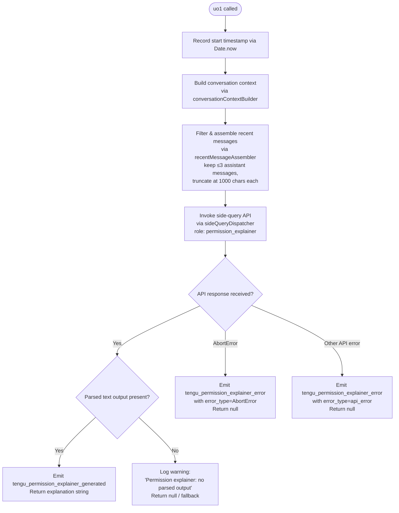

# `/explain_command`

> Analysis basis: CC v2.1.146 bundle.js (AST extraction + Claude interpretation)
> Minimum version: v2.1.146

---

## Overview

`/explain_command` is an internal tool-type command that generates a human-readable explanation of why Claude is requesting a particular permission or tool use. It operates as an async side-query, invoking the API with a dedicated `permission_explainer` sub-agent role and emitting structured telemetry events for both success and failure paths. The command is triggered programmatically (not by user text input) when Claude needs to surface the rationale behind a tool-call permission request.

---

## Registration

| Field | Value |
|---|---|
| type | `tool` |
| name | `explain_command` |
| description | `null` |
| loc_byte | `13561996` |
| loc_byte_end | `13562032` |
| loc_line | `12264` |
| arbor_handler.name | `uo1` |
| arbor_handler.fqn | `claude-2.1.146::uo1` |
| arbor_handler.kind | `AsyncFunction` |
| arbor_handler.resolution_path | `direct` |
| arbor_handler.n_hits | `1` |

Analysis basis: CC v2.1.146 bundle.js:+13561996

---

## Input Branching

The handler has four or more distinct branching paths (conversation history filtering, API call dispatch, parsed-output guard, abort/error distinction), so a Mermaid flowchart is used.



Analysis basis: CC v2.1.146 bundle.js:+13561691, +13561736, +13561901, +13562321, +13562479, +13562691, +13563149, +13563220

---

## Behavioral Spec

### Main Handler — `permissionExplainerHandler` (`uo1`)

```
async function permissionExplainerHandler(context):
    startTime = Date.now()

    # Step 1 — Build conversation context
    rawMessages = buildConversationContext(context)         # ws_ → m6

    # Step 2 — Assemble recent message window
    recentText = assembleRecentMessages(rawMessages)        # Qq5, dq5

    # Step 3 — Dispatch side-query to AI backend
    response = await sideQueryDispatch(                      # mq → bb
        role        = "permission_explainer",
        messages    = recentText,
        strategy    = "side_query"
    )

    # Step 4 — Validate and extract output
    if response has no parsed text content:
        log("Permission explainer: no parsed output in response")
        return null

    emit telemetry("tengu_permission_explainer_generated", {
        duration: Date.now() - startTime
    })

    return response.parsedText

  catch AbortError:
    emit telemetry("tengu_permission_explainer_error", { error_type: "AbortError" })
    return null

  catch other:
    emit telemetry("tengu_permission_explainer_error", { error_type: "api_error" })
    return null
```

Analysis basis: CC v2.1.146 bundle.js:+13561691, +13561715, +13561736, +13561754, +13561901, +13561914, +13562094, +13562321, +13562477, +13562529, +13562578, +13562773, +13563030, +13563185

---

### Conversation Context Builder — `conversationContextBuilder` (`ws_` → `m6`)

Reads the current project configuration (via config-access guard that raises `"Config accessed before allowed."` if called too early — Analysis basis: CC v2.1.146 bundle.js:+3170656), then resolves file-backed config state including backup management (`Y$H`).

```
function buildConversationContext(session):
    configState = readProjectConfig()       # m6 → Y$H → q.readFileSync (utf-8)
    if configState is null:
        throw Error("Config accessed before allowed.")
    return configState.messages
```

Analysis basis: CC v2.1.146 bundle.js:+13561567, +3167540, +3170656, +3170712, +3170739

---

### Recent Message Assembler — `recentMessageAssembler` (`Qq5` + `dq5`)

Filters conversation history to the most recent assistant turns, caps content length, and prepends a separator token.

```
function assembleRecentMessages(messages):
    # Keep only the last N=2 items from history (literal: 2 at +13561211)
    # Filter role == "assistant" (literal at +13561290)
    # Hard-limit: keep at most 3 assistant messages (literal: 3 at +13561310)
    # Truncate each message body to 1000 chars (literal: 1000 at +13561255)
    # Extract text blocks (literal: "text" at +13561393)
    # Reverse order, slice, prepend "..." separator (literal at +13561491)
    # Join and return assembled string

    filtered = messages.filter(m => m.role == "assistant")
    recent   = filtered.reverse().slice(0, 3)
    parts    = recent.map(m => truncate(firstTextBlock(m), 1000))
    parts.unshift("...")
    return parts.join("\n")
```

Analysis basis: CC v2.1.146 bundle.js:+13561201, +13561211, +13561227, +13561255, +13561267, +13561290, +13561310, +13561335, +13561393, +13561478, +13561491, +13561499, +13561532

---

### Side-Query Dispatcher — `sideQueryDispatch` (`mq` → `bb`)

Routes the assembled context through the main API client as a background sub-query, applying the `permission_explainer` role label. Uses the standard `Jm` (API request builder) and `bb` (main send loop) pipeline that handles OAuth token acquisition, retry, streaming, and telemetry.

```
async function sideQueryDispatch(role, messages, strategy):
    apiRequest = buildApiRequest({
        agentRole : role,           # "permission_explainer" (+13562054)
        strategy  : strategy,       # "side_query" (+12845591)
        messages  : messages
    })
    response = await sendApiRequest(apiRequest)   # bb → Jm pipeline
    return response
```

- The `bb` function records `performance.now()` at entry (Analysis basis: CC v2.1.146 bundle.js:+12846634) and emits `tengu_api_success` on completion (Analysis basis: CC v2.1.146 bundle.js:+12847042).
- Token/auth resolution goes through the full OAuth refresh pipeline (`Lq_`), including lock-acquire retry (up to 5 attempts — literal at +2932463) with a 30 000 ms timeout (literal at +1756155).
- The request timeout watchdog is 300 000 ms (literal at +2897224); the byte watchdog is 120 000 ms (literal at +2897333) with a 15 000 ms first-chunk threshold (literal at +2897315).

Analysis basis: CC v2.1.146 bundle.js:+13561901, +13561914, +12845559, +12845591, +12846634, +12847042, +2897224, +2897315, +2897333

---

### Permission-Type Guard — `permissionTypeCheck` (`lq`)

Called from the main handler to validate whether the input tool name qualifies as an `mcp_tool` sub-type before dispatching.

```
function permissionTypeCheck(toolName):
    if not Object.hasOwn(registry, toolName):
        return false
    if toolName.startsWith("mcp__"):          # literal "mcp__" checked here
        return "mcp_tool"                     # literal at +13562054, +3121894
    return "builtin"
```

Analysis basis: CC v2.1.146 bundle.js:+13562529, +3121814, +3121866, +3121894

---

## State & Side Effects

| Item | Detail |
|---|---|
| Telemetry — success | `tengu_permission_explainer_generated` (emitted with duration; +13562479) |
| Telemetry — no output | warning log `"Permission explainer: no parsed output in response"` (+13562826); no telemetry event |
| Telemetry — abort | `tengu_permission_explainer_error` with `error_type=AbortError` (+13562691, +13563149) |
| Telemetry — API error | `tengu_permission_explainer_error` with `error_type=api_error` (+13562691, +13563220) |
| Telemetry — API success (inner) | `tengu_api_success` fired by `bb` pipeline (+12847042) |
| Telemetry — OAuth refresh | Full `tengu_oauth_token_refresh_*` suite within `Lq_` pipeline (+2932659 … +2933840) |
| Telemetry — config parse error | `tengu_config_parse_error` if project config JSON is malformed (+3171293) |
| Sub-agent role label | `"permission_explainer"` set in request metadata (+13562054) |
| Strategy label | `"side_query"` set in request metadata (+12845591) |
| Config guard | Throws `"Config accessed before allowed."` if config read attempted prematurely (+3170656) |
| Config backup | `q.copyFileSync` writes timestamped backup under `backups/` dir (+3171801, +3170224) |
| Hook registration | `c9` calls `c_A.register` (config file watcher hook) (+57267); `cB4` sets up `Sa6.watchFile` / `Sa6.unwatchFile` (+3167052, +3167379) |
| appState changes | No direct appState mutation observed at depth ≤ 2 |
| Sound | None observed |

---

## Version History

| Version | Change |
|---|---|
| v2.1.146 | Initial analysis |

---

## Common Mistakes

1. **Assuming user-facing invocability**: `explain_command` is registered as `type: "tool"`, not `type: "prompt"`. It is invoked programmatically by the permission-check pipeline, not by a user typing `/explain_command` in the REPL.
2. **Expecting a description string**: The registration `description` field is `null`. Do not rely on it for discovery or help text generation.
3. **Ignoring the no-output branch**: The handler silently returns `null` (with only a log line, no telemetry event) when the API responds but contains no parseable text block. Callers must handle a `null` return.
4. **Conflating AbortError and api_error**: Both produce `tengu_permission_explainer_error`, but with distinct `error_type` values (`"AbortError"` vs `"api_error"`). Dashboards filtering on this event should split by that property.
5. **Missing the `mcp__` prefix gate**: The `permissionTypeCheck` function (`lq`) will short-circuit and not reach the explainer for tool names that do not pass `Object.hasOwn` or the `mcp__` prefix check. Ensure tool names are correctly namespaced.
6. **Underestimating timeout depth**: The effective end-to-end timeout is governed by multiple nested watchdogs (300 s stream, 120 s byte, 15 s first-chunk, 30 s OAuth helper). Monitoring should account for all layers.

---

## Appendix — Identifier Mapping

> For bundle debugging only. Identifiers change across versions.

| Identifier | Role |
|---|---|
| `uo1` | Main handler for `explain_command` (permissionExplainerHandler) — AsyncFunction |
| `ws_` | Conversation-context fetch wrapper (calls config reader `m6`) |
| `m6` | Project config loader / config-state manager |
| `Q6` | Config state constructor / initializer |
| `pK_` | Config path resolver |
| `Y$H` | Config file reader (readFileSync, backup, ENOENT handling) |
| `rI9` | Backup directory scanner / backup entry resolver |
| `cK_` | Backup path joiner |
| `AC` | Config string prefix stripper |
| `L8` | Config ENOENT handler |
| `SH` | Error logging / error-push utility |
| `c` | Generic async utility / promise wrapper |
| `cB4` | Config file watcher / watch lifecycle manager |
| `zn` | Config change debounce utility |
| `c9` | Config hook registrar (calls `c_A.register`) |
| `N` | Log-level dispatcher (debug/error/warn) |
| `w` | Background daemon session manager / spawn controller |
| `Qq5` | Recent-message string serializer (role + content stringify) |
| `CH` | JSON.stringify wrapper |
| `dq5` | Recent-message filter and assembler (reverse, slice, join) |
| `H` | Generic randomized-delay / setTimeout utility (various roles by context) |
| `A` | Array lowercase comparator / misc array utility |
| `mq` | Side-query top-level orchestrator (calls `ys`, `rq`, `yJ`) |
| `ys` | Query builder / model-selection coordinator |
| `mV` | Model version resolver |
| `Q_H` | Query configuration builder |
| `IF` | Model identifier normalizer / alias resolver |
| `M` | MCP server / config map accessor |
| `K` | Column formatter / pad utility |
| `Vg6` | Object-entries enumerator for model params |
| `$mH` | Allowed-model-list checker |
| `V_9` | Model index-of resolver |
| `lJ4` | Model inclusion checker with tier lookup |
| `T9H` | Model tier include-list checker |
| `rq` | Model alias resolver (opusplan, sonnet, haiku, opus, best) |
| `nJ4` | Model name normalizer with prefix check |
| `yJ` | Prompt/message formatter for side query |
| `M2` | Provider-context builder (ZA, kF, eMH, YmH) |
| `ZA` | First-party auth context assembler |
| `kF` | Max-tier auth context builder |
| `eMH` | Team-tier auth context builder |
| `YmH` | Enterprise-tier auth context builder |
| `jv` | Model+provider tuple builder |
| `cP` | Provider selector (firstParty, gateway, bedrock…) |
| `z3` | Provider descriptor builder |
| `hA` | Provider type classifier (bedrock, foundry, mantle, vertex…) |
| `pM` | Prompt assembly with system prompt injection |
| `Jv` | Alternate prompt builder path |
| `bb` | Main API send loop (streaming, retry, telemetry) |
| `Jm` | API request builder / full request lifecycle manager |
| `VD` | AsyncLocalStorage store getter (request context) |
| `lC4` | Header line parser (split, trim, indexOf, slice) |
| `Cq` | Session context resolver |
| `_3H` | Background/daemon session type classifier |
| `Kn` | Session ID extractor |
| `sQ6` | Session store getter |
| `S6` | UV async handle manager |
| `Es8` | URL encoder for session IDs |
| `mH` | String coercion utility |
| `u3` | OAuth token refresh orchestrator (calls `Lq_`) |
| `Lq_` | OAuth lock-acquire / token-refresh core |
| `S_9` | Boolean coercion wrapper |
| `ID` | Auth credential resolver / API key + OAuth dispatcher |
| `cK` | Auth string coercer |
| `Nv` | OAuth credential validator |
| `wO` | Credential provider type checker |
| `wJ` | Auth state accessor |
| `w$` | Auth strategy router (ANTHROPIC_API_KEY, apiKeyHelper, OAuth) |
| `zqH` | Auth field formatter |
| `dO` | Date/time utility |
| `dC4` | Request context injector (agent ID, parent agent ID headers) |
| `npH` | Request timestamp recorder |
| `C_` | Request cancellation token manager |
| `WU6` | Proxy auth helper invoker (30 000 ms timeout) |
| `zWH` | Proxy auth string formatter |
| `wuA` | Proxy URL parser |
| `Z94` | Port-number parser (parseInt + Number.isNaN) |
| `jC` | Proxy configuration resolver |
| `bP` | Proxy credential builder |
| `rC4` | HTTP request executor (streaming, watchdog, headers) |
| `O5` | Response header extractor |
| `oC4` | Response header sanitizer (redacts `authorization`, `x-anthropic-*`) |
| `iC4` | Request ID generator / tracker |
| `c9_` | Retry count calculator |
| `nC4` | Streaming byte watchdog / ReadableStream reader |
| `Jw` | Request method resolver |
| `Eg6` | Provider-specific endpoint builder |
| `wD4` | URL prefix checker |
| `Tg6` | HTTP method normalizer (toLowerCase, Object.values) |
| `gz` | Proxy integration layer (vl, Ku6, juA) |
| `vl` | Proxy URL string parser (https, port, path) |
| `Ku6` | Proxy socket connector (zh, cu) |
| `juA` | Proxy auth injector |
| `cC4` | Request pipeline wrapper (Lr6, UV, LXH, V9) |
| `Lr6` | Response decoder / content-type negotiator |
| `UV` | Response body reader utility |
| `_RH` | Response error classifier |
| `LXH` | Content-type header parser |
| `V9` | OAuth endpoint validator (staging/prod allowlist) |
| `f3H` | Refresh token HTTP POST executor |
| `Lk8` | Refresh token pre-flight check |
| `QP4` | Gateway JWT refresh logic (invalid_grant handling) |
| `yI6` | Token storage writer after refresh |
| `Kk8` | Token expiry timestamp recorder |
| `d56` | HTTP response header lowercaser |
| `o3H` | SDK error/warn/info/debug log forwarder to console |
| `C` | Supervisor file watcher (mtime check, SH error push) |
| `w5K` | Supervisor realpath + stat checker |
| `vY5` | Supervisor hash verifier |
| `z` | Daemon stop / daemon_stop telemetry emitter |
| `h` | Away-summary blur/focus lifecycle handler |
| `wg` | Away-summary session state checker |
| `I` | Away-summary generation function |
| `Z` | Away-summary cache writer |
| `ge1` | Away-summary rate-limit checker |
| `V` | Request abort signal tracker |
| `Xj` | Auth re-check on 401 retry path |
| `ZmH` | WIF (Workload Identity Federation) token exchanger |
| `Nd6` | WIF credential HTTP fetcher |
| `bH` | Feature flag gate — `tengu_feature_ok` path |
| `uH` | Feature flag gate — `tengu_feature_bad` path |
| `nP4` | WIF token include-list checker |
| `W` | Remote control / daemon config reload handler |
| `b` | Daemon config reload debounce target |
| `EW` | User settings remote-control dispatcher |
| `Y` | Daemon session lifecycle controller (start/stop/updateConfig) |
| `P` | IPC message framer / Buffer.concat reader |
| `J` | IPC socket wrapper |
| `Lf` | IPC response writer |
| `MY5` | Daemon worker session manager (full PTY lifecycle) |
| `$Y5` | Session state serializer |
| `$` | IPC write stream |
| `dz` | Background service descriptor |
| `LHA` | Lease record builder |
| `Q7K` | Lease timeout / heartbeat manager |
| `r8` | Promise-based timer with abort |
| `X` | Terminal repaint orchestrator |
| `OT` | PTY path joiner |
| `Y$` | PTY realpath resolver |
| `wfH` | PTY log file reader |
| `LY5` | PTY resize utility |
| `m` | Repaint debounce handler |
| `G8H` | Terminal state snapshot helper |
| `SK` | PTY socket path builder |
| `fY5` | Session lifecycle finalizer |
| `t` | Voice recording toggle silence timeout handler |
| `x` | Supervisor idle-exit timeout manager |
| `e` | Voice focus silence timeout handler |
| `G` | Skills/subagent event emitter (batch with debounce) |
| `g` | MCP tool-use filter (filters `mcp__`-prefixed names) |
| `F` | MCP tool filter tuple |
| `l` | Agent phase filter |
| `i` | PTY write stream wrapper |
| `d` | PTY process manager |
| `kv6` | IPC socket destroy/write helper |
| `T` | Terminal z06/Yv8 phase coordinator |
| `ZH` | String coercion for IPC fields |
| `fGH` | Request format validator (Eq, Jw, Gh) |
| `Eq` | Content-type model-format resolver |
| `Gj` | Model string cleaner (toLowerCase, replace) |
| `Bk8` | API format flag checker |
| `lP` | Response body string replacer |
| `Gh` | Provider presence checker |
| `Ka7` | Conversation history finder (H.find, A.find) |
| `Hr_` | SHA-256 hash builder (sp1.createHash) |
| `eQ6` | Session auth context builder |
| `fK` | String-coercion utility (second instance) |
| `ua6` | Provider auth header builder |
| `kVH` | Prompt cache 1h config builder |
| `uk8` | Cache config validator |
| `N6` | Config notification dispatcher (gf6, Qf6, Tt) |
| `gf6` | Config change notifier — subscriber A |
| `Qf6` | Config change notifier — subscriber B |
| `Tt` | Config change notifier — subscriber C |
| `Ga6` | Config change dedup guard (EK_ set) |
| `mk8` | Cache suffix matcher |
| `tE` | Request metadata tagger (a9_, mH) |
| `a9_` | Provider tag builder |
| `yU1` | Message batch utility |
| `Dr6` | Request format finalizer (ft, Eq) |
| `f2` | Message array mapper |
| `TOH` | Request envelope builder (Tq, Gm, y5, S6) |
| `Gm` | Random-bytes nonce generator for request ID |
| `K8` | Config save / global-config writer |
| `y5` | Auth + config combined request context builder |
| `z5H` | Duration formatter |
| `jZH` | Prompt cache telemetry emitter (n3L) |
| `n3L` | Cache presence checker |
| `wZH` | Cache entry reader |
| `zQ` | Agent-type prefix router (l3L, SH) |
| `l3L` | Agent name prefix parser (agent:builtin:, agent:custom:, agent:) |
| `TA8` | Built-in agent type resolver |
| `fY_` | Agent name substring extractor |
| `p1H` | `repl_main_thread` prefix checker |
| `i66` | Request finalization utility |
| `lq` | Permission type checker (Object.hasOwn + `mcp__` prefix) |
| `z8` | Async utility — `tengu_feature_sad` path |

---

Note: index built via Arbor fallback; some signals (telemetry, literals) may be missing — see arbor-fallback.js.