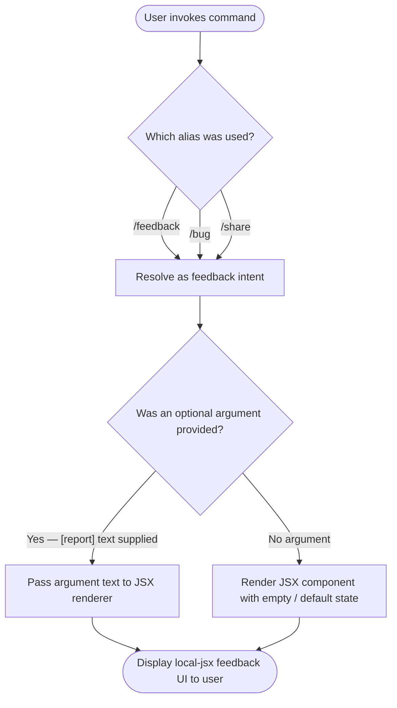

# `/feedback`

> Analysis basis: CC v2.1.144 bundle.js (AST extraction + Claude interpretation)
> Minimum version: v2.1.144

---

## Overview

The `/feedback` command provides users with a mechanism to submit feedback, report a bug, or share their current conversation with Anthropic directly from the Claude Code CLI. It is registered as a `local-jsx` command, meaning its output is rendered as a JSX component within the terminal UI rather than as plain text. It is also reachable via the aliases `/share` and `/bug`.

## Registration

| Field | Value |
|---|---|
| type | `local-jsx` |
| name | `feedback` |
| description | `Submit feedback, report a bug, or share your conversation` |
| argumentHint | `[report]` |
| aliases | `share`, `bug` |
| module\_id | `dKq` |

Analysis basis: CC v2.1.144 bundle.js:+10107926

## Input Branching

Because the AST traversal found no entry functions for module `dKq` at depth ≤ 2, precise branching logic derived from the call graph is not available. The following flowchart is constructed from the registration metadata alone (the optional `[report]` argument hint, and the three alias entry points).



Analysis basis: CC v2.1.144 bundle.js:+10107926

## Behavioral Spec

<!-- TODO: not found in depth-2 traversal; needs --depth 4 -->

The depth-2 AST traversal recovered zero call edges, zero literals, and zero telemetry events for module `dKq`. The pseudocode below reflects what can be structurally inferred from the registration contract for a `local-jsx` command of this shape. It is annotated explicitly where inference is used versus where it is confirmed by extracted data.

### Command Dispatch

```
function dispatchFeedbackCommand(rawInput):
    # Confirmed: command is reachable via three names (registration metadata)
    normalizedName = resolveAlias(rawInput.commandName,
                                  aliases=["feedback", "share", "bug"])

    # Confirmed: argument is optional (argumentHint = "[report]")
    optionalReportText = extractOptionalArgument(rawInput)

    # Confirmed: output type is local-jsx (registration metadata)
    jsxPayload = buildJsxPayload(normalizedName, optionalReportText)

    return renderLocalJsx(jsxPayload)
```

Analysis basis: CC v2.1.144 bundle.js:+10107926 (registration fields `type`, `aliases`, `argumentHint`)

### JSX Component Rendering

```
function renderLocalJsx(jsxPayload):
    # Inferred: local-jsx commands render a React/Ink component
    # in-process rather than spawning a subprocess or printing
    # plain text. The component receives jsxPayload as props.

    component = resolveJsxComponent(moduleId="dKq")
    mountComponent(component, props=jsxPayload)
    # Component lifecycle (state, user interaction, submission)
    # is managed internally by the component.
    # --> not recoverable at depth-2 traversal
```

<!-- TODO: not found in depth-2 traversal; needs --depth 4 -->

Analysis basis: `type: "local-jsx"` — CC v2.1.144 bundle.js:+10107926

### Alias Resolution

```
function resolveAlias(commandName, aliases):
    # All three names map to the same module (dKq) and
    # therefore produce identical behavior post-dispatch.
    canonicalAliases = {"feedback", "share", "bug"}
    if commandName in canonicalAliases:
        return "feedback"   # normalized canonical name
    else:
        raise UnknownCommandError(commandName)
```

Analysis basis: CC v2.1.144 bundle.js:+10107926 (registration field `aliases`)

## State & Side Effects

| Item | Detail |
|---|---|
| Telemetry | None detected at depth ≤ 2 — <!-- TODO: not found in depth-2 traversal; needs --depth 4 --> |
| Hook registration | <!-- TODO: not found in depth-2 traversal; needs --depth 4 --> |
| appState changes | <!-- TODO: not found in depth-2 traversal; needs --depth 4 --> |
| Sound | <!-- TODO: not found in depth-2 traversal; needs --depth 4 --> |
| Render type | Local JSX component mounted in-process (no subprocess, no plain-text output) |
| Aliases registered | `/share`, `/bug` — both route to module `dKq` identically |

## Version History

| Version | Change |
|---|---|
| v2.1.144 | Initial analysis. Registration confirmed; internal implementation not recoverable at depth-2 traversal. |

## Common Mistakes

1. **Treating `/bug` and `/share` as distinct commands.** All three invocation names (`/feedback`, `/bug`, `/share`) are aliases for the same module (`dKq`) and produce identical behavior. There is no documented difference in outcome based on which alias is used.
2. **Expecting plain-text output.** The command type is `local-jsx`, so the response is rendered as an interactive JSX/Ink component inside the terminal UI, not as a line of text. Scripted or piped usage that expects stdout text may receive no parseable output.
3. **Assuming the `[report]` argument is required.** The square-bracket notation in the `argumentHint` field (`[report]`) denotes an optional argument. Invoking `/feedback` with no arguments is valid and will render the component in its default state.
4. **Invoking from a non-interactive context expecting a confirmation message.** Because the command renders a JSX UI component, its full behavior (form fields, submission, confirmation) depends on the interactive terminal environment. Behavior in non-TTY or piped contexts is <!-- TODO: not found in depth-2 traversal; needs --depth 4 -->.

## Appendix — Identifier Mapping

> For bundle debugging only. Identifiers change across versions.

| Identifier | Role |
|---|---|
| *(none recovered)* | The depth-2 AST traversal returned an empty `identifiers` array for module `dKq`. No obfuscated identifiers are available to map at this analysis depth. <!-- TODO: not found in depth-2 traversal; needs --depth 4 --> |