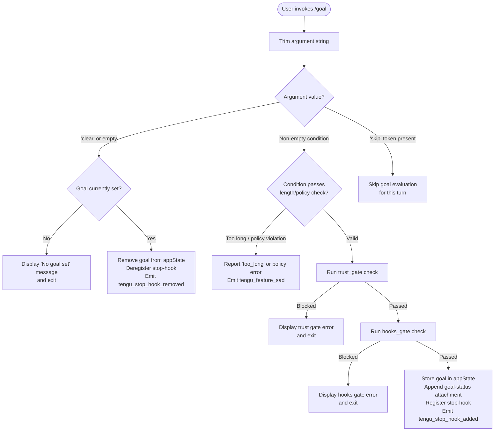

```
---
type: feature-spec
feature: "goal"
cc_version: "2.1.146"
updated: "2026-06-01"
tags: ["goal", "commands", "slash-commands"]
source: "bundle-analysis"
bundle_verified: true
inherited_from: "2.1.141"
analysis_basis: "CC v2.1.141 bundle.js (AST extraction + Claude interpretation)"
author: "ryujaeuk <ryujaeuk@gmail.com>"
repository: "https://github.com/MyLittleLuckyDog/cc-gnothi"
license: "AGPL-3.0-only"
---

# `/goal`

> Analysis basis: CC v2.1.141 bundle.js (AST extraction + Claude interpretation)
> Minimum version: v2.1.141

---

## Overview

The `/goal` command lets the user declare a persistent condition that Claude Code must satisfy before stopping. Once set, a stop-hook is registered that evaluates the condition after every agentic turn; the session continues autonomously until the goal is met or explicitly cleared. Invoking `/goal clear` (or `/goal` with no argument) removes the active goal and deregisters the stop-hook.

---

## Registration

| Field | Value |
|---|---|
| type | `local-jsx` |
| name | `goal` |
| description | Set a goal — keep working until the condition is met |
| argumentHint | `[<condition> \| clear]` |
| immediate | `true` |
| module_id | `mVq` |
| load_inline | `true` |
| loc_byte | `11814797` |
| loc_byte_end | `11815000` |
| loc_line | `7727` |
| arbor_handler.name | `GR7` |
| arbor_handler.fqn | `claude-2.1.141::GR7` |
| arbor_handler.kind | `AsyncFunction` |
| arbor_handler.resolution_path | `module_id` |
| arbor_handler.n_hits | `0` |

Analysis basis: CC v2.1.141 bundle.js:+11814797

---

## Input Branching

The command has four distinct runtime branches depending on the argument supplied and the current goal state, so a Mermaid flowchart is used.



Analysis basis: CC v2.1.141 bundle.js:+11813386 – +11813867

---

## Behavioral Spec

### 1. Argument Parsing (handler entry point)

The async handler `GR7` is the command's main entry point, resolved via module `mVq`.

```
async function handleGoalCommand(context):
    rawArg = context.argument
    trimmedArg = rawArg.trim()                      // +11813386

    if isSkipToken(trimmedArg):                     // +11813492
        return                                       // silently skip evaluation

    if trimmedArg is empty OR trimmedArg.toLowerCase() == "clear":
        return handleClearGoal(context)             // +11813520

    return handleSetGoal(context, trimmedArg)       // +11813754
```

Analysis basis: CC v2.1.141 bundle.js:+11813386

---

### 2. Skip-Token Detection

A helper (`Tj8`) checks whether the provided string matches the internal `"skip"` sentinel.

```
function isSkipToken(value):
    normalised = value.toLowerCase()               // +11352720
    return knownSkipTokens.has(normalised)         // +11352712
    // knownSkipTokens contains at least "skip"   // +11813492
```

Analysis basis: CC v2.1.141 bundle.js:+11813506

---

### 3. Clear-Goal Path (`iaH`)

When the argument is absent or `"clear"`, the current goal is removed.

```
async function handleClearGoal(context):
    currentState = context.getAppState()            // +11353912

    if currentState.goal is not set:
        displayMessage("No goal set")              // +11813545
        return

    // Remove goal attachment from conversation
    context.applyMessageOp("remove", goalAttachment) // +11354110

    // Update appState — clear goal field
    context.setAppState({ goal: null })             // +11354041

    // Generate UUID for hook record removal
    hookId = generateUUID()                         // +11354257 (XXq → JXq.randomUUID)

    // Deregister the stop-hook
    removeStopHook(hookId)                          // +11354167
    emitTelemetry("tengu_stop_hook_removed")        // +11354167

    renderFeedback(context)                         // +11354165 (Q)
```

Analysis basis: CC v2.1.141 bundle.js:+11813520

---

### 4. Set-Goal Path (`naH`)

When a non-empty, non-`"clear"` condition string is provided:

```
async function handleSetGoal(context, conditionText):

    // --- Gate checks ---
    policyResult = checkPolicySettings(conditionText)  // +11353413 (AU_ → Rm → I8 → policySettings +5311315)
    if policyResult.blocked:
        report("too_long" or policy error)             // +11813642
        emitTelemetry("tengu_feature_sad")             // +945699
        return

    trustResult = runTrustGate(conditionText)          // +11353363
    if trustResult.blocked:
        displayTrustError()
        return

    hooksResult = runHooksGate(conditionText)          // +11353309
    if hooksResult.blocked:
        displayHooksError()
        return

    // --- Persist goal ---
    timestamp = Date.now()                             // +11353662
    currentState = context.getAppState()               // +11353498

    context.setAppState({ goal: conditionText, goalSetAt: timestamp })  // +11353700

    // Append a goal-status attachment to the conversation
    attachment = buildAttachment({
        type:    "attachment",                         // +11354239
        subtype: "goal",                               // +11354198
        status:  "goal_status",                        // +11354326
        content: conditionText
    })
    context.applyMessageOp("append", attachment)       // +11353742 / +11354133

    // Register a stop-hook that re-evaluates the goal after each turn
    hookId = generateUUID()                            // (XXq → JXq.randomUUID +11354257)
    stopHookPayload = buildStopHook({
        id:        hookId,
        kind:      "Stop",                             // +11353121
        condition: conditionText,
        type:      "prompt"                            // +11353228
    })
    registerStopHook(stopHookPayload)                  // naH → Zj8 → A.push +11353494 / +11353237
    emitTelemetry("tengu_stop_hook_added")             // +11353799

    // Log outcome
    emitTelemetry("tengu_feature_ok")                  // +945566
    renderFeedback(context, "goal_set")                // +11813628 / +11813631

    // Kick off agentic loop with optional random delay
    scheduleAgentLoop(context)                         // GR7 → H → Math.random +12516058, setTimeout +12516095
```

Analysis basis: CC v2.1.141 bundle.js:+11813754

---

### 5. Stop-Hook Registration & Lifecycle (`Zj8` / `tYH`)

The stop-hook is stored in a persistent set managed by `tYH`. Each hook entry records its UUID so that `/goal clear` can delete exactly that entry.

```
function registerStopHook(payload):
    hookStore.set(payload.id, payload)    // tYH → K.set +8302095
    formatHookList()                      // K → L.map +14487598, f.padEnd +14487611

function removeStopHook(id):
    hookStore.delete(id)                  // Zj8 machinery
```

The agentic loop itself uses `L` (loop runner) which tracks active runs via a `Set` (`q`):

```
function runAgentLoop(context):
    activeRuns.add(runId)                  // L → q.add +14469373
    try:
        result = await executeLoop(context)
    finally:
        activeRuns.delete(runId)           // L → q.delete +14469396
        cleanupTempFiles()                 // q → n6K.unlinkSync +14444736
```

Analysis basis: CC v2.1.141 bundle.js:+11353113, +14469373

---

### 6. System Message Injection

After goal state is stored, a system-scoped context injection is performed so that Claude's model context is aware of the active goal constraint.

```
function injectGoalSystemMessage(conditionText):
    systemMessage = buildSystemMessage({
        role:    "system",               // +11813589
        content: conditionText
    })
    appendToConversation(systemMessage)
```

Analysis basis: CC v2.1.141 bundle.js:+11813589

---

### 7. Token Accounting

The output-token count of each agentic turn is tracked via `Uj`, which reads `outputTokens` from turn results to decide whether continuation is warranted.

```
function computeTurnTokens(turnResult):
    values = Object.values(turnResult)     // Uj → Object.values +40195
    return sum(values, key="outputTokens") // +40224
```

Analysis basis: CC v2.1.141 bundle.js:+11353687

---

## State & Side Effects

| Item | Detail |
|---|---|
| Telemetry — `tengu_stop_hook_added` | Fired when a new goal stop-hook is successfully registered (bundle.js:+11353799) |
| Telemetry — `tengu_stop_hook_removed` | Fired when a goal is cleared and its stop-hook deregistered (bundle.js:+11354167) |
| Telemetry — `tengu_feature_ok` | Fired on successful set-goal completion (bundle.js:+945566) |
| Telemetry — `tengu_feature_sad` | Fired on policy/length rejection (bundle.js:+945699) |
| appState changes | `goal` field set to condition string on `/goal <condition>`; cleared to `null` on `/goal clear` |
| Hook registration | A `"Stop"`-kind hook keyed by UUID is added to (or removed from) the persistent hook store |
| Conversation mutation | A `"goal_status"` attachment is appended or removed via `applyMessageOp` |
| System message injection | A `"system"`-role message bearing the goal text is injected into the conversation context |
| Agentic loop scheduling | A new autonomous agent loop is started via `setTimeout` with a small random delay (range 1–2 relative units, bundle.js:+12516056, +12516072) after goal is set |
| Temporary file cleanup | On loop completion, any temp files created during the run are removed via `unlinkSync` (bundle.js:+14444736) |
| Trust gate | The condition text is passed through the `trust_gate` policy before goal persistence (bundle.js:+11353363) |
| Hooks gate | The condition text is also checked through `hooks_gate` (bundle.js:+11353309) |
| Policy settings | Validated via `policySettings` (bundle.js:+5311315); violations produce `"too_long"` status (bundle.js:+11813642) |

---

## Version History

| Version | Change |
|---|---|
| v2.1.141 | Initial analysis |

---

## Common Mistakes

1. **Passing `clear` with extra whitespace** — the argument is trimmed before comparison (`A.trim`, bundle.js:+11813386), so `"  clear  "` is treated identically to `"clear"`. However, `"clearall"` is **not** treated as a clear action.
2. **Assuming the goal persists across sessions** — the goal is stored in `appState`; if the session terminates abnormally, the stop-hook may not fire its removal telemetry, and the goal may not persist to a fresh session depending on appState serialisation.
3. **Confusing `/goal` (no arg) with `/goal clear`** — both produce the clear-goal path. There is no "display current goal" query form; an empty argument clears the goal rather than showing it.
4. **Setting an excessively long condition** — conditions that exceed the policy-enforced length limit produce a `"too_long"` rejection (bundle.js:+11813642) and no goal is stored. Keep conditions concise.
5. **Expecting the agent to stop immediately** — after `/goal <condition>` the agentic loop is scheduled with a random delay via `setTimeout`; there may be a brief pause before the first autonomous turn begins.
6. **Ignoring trust/hooks gates** — in restricted or sandboxed environments the `trust_gate` or `hooks_gate` may block goal registration entirely with no fallback; the command exits silently after displaying the gate error.

---

## Appendix — Identifier Mapping

> For bundle debugging only. Identifiers change across versions.

| Identifier | Role |
|---|---|
| `GR7` | Main async handler for `/goal` command (arbor_handler, AsyncFunction, resolved via module_id `mVq`) |
| `A` | Argument string / intermediate string-processing variable |
| `f` | Agentic loop execution context / file handle abstraction |
| `q` | Active-run tracking Set; also used for temp-file cleanup |
| `L` | Agent loop runner; manages run lifecycle and `finally` cleanup |
| `H` | Random-delay scheduler; calls `Math.random` and `setTimeout` to defer loop start |
| `Tj8` | Skip-token detector; checks lowercased input against known skip-token set |
| `iaH` | Clear-goal handler; removes goal from appState and deregisters stop-hook |
| `V6` | Internal utility called by both clear and set paths |
| `Zj8` | Stop-hook list mutator; pushes new hook entries |
| `tYH` | Hook-store manager; calls `K.set` to persist hook entries |
| `K` | Hook-store Map; maps hook IDs to hook payloads |
| `Hm1` | Hook-list formatter helper; calls `H.map` over hook entries |
| `XXq` | UUID generator wrapper; delegates to `JXq.randomUUID` |
| `Q` | UI feedback renderer; used in both set and clear paths |
| `D8` | Secondary feedback/logging utility (set path) |
| `naH` | Set-goal handler; orchestrates gate checks, appState mutation, hook registration |
| `AU_` | Gate orchestrator; sequences policy, trust, and hooks checks |
| `Rm` | Policy-settings reader; delegates to `I8` |
| `I8` | Low-level settings accessor (reads `policySettings`) |
| `tY` | Trust-gate runner; delegates to `I8` and `zA` |
| `Z_` | Intermediate gate utility (hooks/trust path) |
| `L7` | Hooks-gate runner; delegates to `XhL` |
| `XhL` | Gate resolution dispatcher; fans out to `RH`, `khH`, `N1`, `h6`, `TpH`, `Uo`, `N6`, `dz.resolve` |
| `_` | App-state accessor used inside `naH` (getAppState / setAppState / applyMessageOp) |
| `Uj` | Turn token-accounting utility; aggregates `outputTokens` via `Object.values` |
| `hH` | Telemetry/logging helper for successful set path; calls `Q` |
| `Ej8` | Final step in handler (clean-up or return value wrapper) |
```