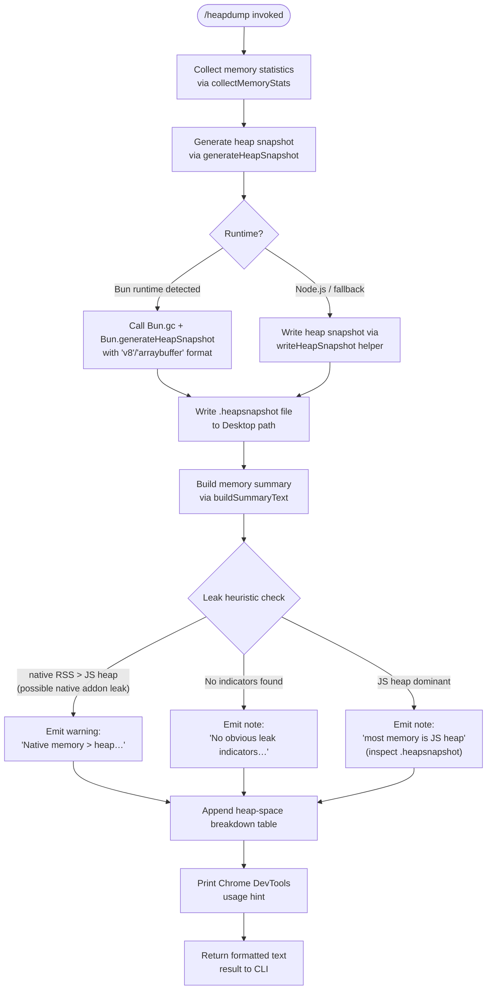

# `/heapdump`

> Analysis basis: CC v2.1.146 bundle.js (AST extraction + Claude interpretation)
> Minimum version: v2.1.146

---

## Overview

`/heapdump` is a hidden developer-diagnostic command that captures a JS heap snapshot and a rich set of memory-usage statistics, writes them to the user's Desktop, and prints a human-readable summary with leak-indicator heuristics. It targets Node.js/Bun runtimes and is intended exclusively for internal debugging; it is not surfaced in the normal command list.

---

## Registration

| Field | Value |
|---|---|
| type | `local` |
| name | `heapdump` |
| description | `Dump the JS heap to ~/Desktop` |
| supportsNonInteractive | `true` |
| isHidden | `true` |
| module_id | `aI1` |
| load_inline | `true` |
| loc_byte | `12001978` |
| loc_byte_end | `12002141` |
| arbor_handler.name | `Bp7` |
| arbor_handler.fqn | `claude-2.1.146::Bp7` |
| arbor_handler.kind | `AsyncFunction` |
| arbor_handler.resolution_path | `module_id` |
| arbor_handler.n_hits | `0` |

Analysis basis: CC v2.1.146 bundle.js:+12001978

---

## Input Branching

The command has four or more distinct execution paths depending on runtime environment and memory ratios, so a Mermaid flowchart is used.



---

## Behavioral Spec

### Top-Level Handler (`Bp7`)

`Bp7` is the async entry point resolved by Arbor via `module_id → aI1`.
It delegates immediately to the core dump orchestrator (`rI1`), then invokes the summary formatter (`Fp7`) and assembles the final output lines.

```
async function heapdumpHandler(args, context):
    rawResult   = await orchestrateDump(args, context)   // rI1
    summaryText = buildSummaryText(rawResult)             // Fp7
    lines = []
    lines.push(summaryText)
    lines.push("Open the .heapsnapshot in Chrome DevTools → Memory → Load to inspect retainers.")
    return lines.join("\n")
```

Analysis basis: CC v2.1.146 bundle.js:+12000847, +12000966, +12000993, +12001003, +12001115

---

### Dump Orchestrator (`rI1`)

`rI1` is the core async orchestration function. It:
1. Initialises the memory-stat collection trigger with mode `"manual"` and offset `0`.
2. Collects comprehensive memory statistics via `collectMemoryStats` (`pp7`).
3. Resolves the Desktop output directory via `resolveDesktopPath` (`lDA`).
4. Constructs the output file path by joining the Desktop directory with a timestamped filename using `ld_.join`.
5. Writes the snapshot JSON to the file via `gtH.writeFile` with file-mode `384` (octal `0600`).
6. Optionally calls `generateHeapSnapshotBun` (`Up7`) for Bun-specific snapshot generation.
7. Formats and streams partial results via `streamOutputLines` (`SH`).
8. Returns the combined result object.

```
async function orchestrateDump(args, context):
    trigger = { mode: "manual", offset: 0 }              // literals +11999485, +11999496
    memStats = await collectMemoryStats(trigger)          // pp7
    desktopPath = resolveDesktopPath()                    // lDA
    outputPath  = path.join(desktopPath, timestampedName)// ld_.join +11999914
    serialised  = JSON.stringify(memStats)                // CH +11999973
    await fs.writeFile(outputPath, serialised, { mode: 384 })  // gtH.writeFile +11999957; mode=384 (0o600)
    if isBunRuntime():
        await generateHeapSnapshotBun(outputPath)         // Up7 +12000048
    streamOutputLines(context, partialLines)              // SH +12000355
    return { outputPath, memStats }
```

Analysis basis: CC v2.1.146 bundle.js:+11999509, +11999568, +11999805, +11999817, +11999957, +11999973, +11999992, +12000048, +12000097, +12000268, +12000355

---

### Memory Statistics Collector (`pp7`)

`pp7` gathers a broad snapshot of process and V8 heap state. It reads from multiple sources:

| Source | API | Notes |
|---|---|---|
| JS heap | `process.memoryUsage()` | RSS, heapUsed, heapTotal, external |
| V8 heap | `v8.getHeapStatistics()` | via `mW8` |
| V8 heap spaces | `v8.getHeapSpaceStatistics()` | per-space breakdown |
| Resource usage | `process.resourceUsage()` | CPU time, etc. |
| Uptime | `process.uptime()` | seconds |
| Active handles | `process._getActiveHandles()` | internal |
| Active requests | `process._getActiveRequests()` | internal |
| Open file descriptors | `fs.readdir("/proc/self/fd")` | Linux only |
| Smaps rollup | `fs.readFile("/proc/self/smaps_rollup", "utf8")` | Linux only |
| JSC introspection | `require("bun:jsc")` module | Bun only |

Size conversion constant: `1048576` (bytes → MB). File-descriptor scan cap: `3600` entries.
Native-memory warning threshold: native RSS > JS heap, producing the message `"Native memory > heap - leak may be in native addons (node-pty, sharp, etc.)"`.
Ratio formatting uses `P.toFixed` at two decimal places, scaled by `100`.

```
async function collectMemoryStats(trigger):
    mem    = process.memoryUsage()
    heap   = v8.getHeapStatistics()           // mW8.getHeapStatistics
    spaces = v8.getHeapSpaceStatistics()      // mW8.getHeapSpaceStatistics
    res    = process.resourceUsage()
    up     = process.uptime()
    handles  = process._getActiveHandles().length
    requests = process._getActiveRequests().length

    fdCount = null
    if platform == "linux":
        try:
            entries = await fs.readdir("/proc/self/fd")
            fdCount = entries.length          // cap at 3600
        catch: fdCount = null

    smaps = null
    if platform == "linux":
        try:
            smaps = await fs.readFile("/proc/self/smaps_rollup", "utf8")
        catch: smaps = null

    jsc = null
    if isBunRuntime():
        jsc = require("bun:jsc")

    nativeBytes = mem.rss - mem.heapTotal - mem.external
    nativeMB    = nativeBytes / 1048576
    heapMB      = mem.heapUsed / 1048576
    ratio       = (heapMB / (nativeMB + heapMB) * 100).toFixed(2)

    warnings = []
    if nativeBytes > mem.heapUsed:
        warnings.push("Native memory > heap - leak may be in native addons (node-pty, sharp, etc.)")

    return { mem, heap, spaces, res, up, handles, requests, fdCount, smaps, jsc, ratio, warnings }
```

Analysis basis: CC v2.1.146 bundle.js:+11997010, +11997034, +11997060, +11997086, +11997111, +11997153, +11997190, +11997241, +11997253, +11997303, +11997316, +11997342, +11997401, +11997414, +11997542, +11997547, +11997694, +11997780, +11997903

---

### Bun Heap Snapshot Generator (`Up7`)

`Up7` handles Bun-specific snapshot generation. It calls `Bun.gc(true)` to force a full GC cycle before capturing, then calls `Bun.generateHeapSnapshot` with format `"v8"` / `"arraybuffer"`, and writes the result synchronously via `iI1.writeFileSync`.

```
function generateHeapSnapshotBun(outputPath):
    Bun.gc(true)                                          // force GC before snapshot
    snapshot = Bun.generateHeapSnapshot({ format: "v8", encoding: "arraybuffer" })
    fs.writeFileSync(outputPath, snapshot)                // iI1.writeFileSync
```

Analysis basis: CC v2.1.146 bundle.js:+12000527, +12000547, +12000572, +12000577, +12000604

---

### Summary Text Builder (`Fp7`)

`Fp7` constructs the human-readable output text. It computes the dominant memory type, prints per-space heap statistics in a columnar table padded to 8 characters, and appends advisory text.

```
function buildSummaryText(stats):
    lines = []

    heapMB   = stats.mem.heapUsed / 1048576
    rssMB    = stats.mem.rss      / 1048576
    totalMB  = Math.max(rssMB, heapMB + nativeMB)       // Fp7 +12001222

    if heapMB / totalMB > threshold:
        lines.push("— most memory is JS heap (inspect the .heapsnapshot)")   // +12001290
    else:
        lines.push("— most memory is native (NOT in the .heapsnapshot)")     // +12001350

    if stats.warnings.length == 0:
        lines.push("  (no obvious leak indicators)")                          // +12001487

    // Heap-space breakdown table (8-char column padding)
    for space in stats.spaces:                           // QtH +12001534
        row = space.spaceName.padEnd(8) + "  " + formatMB(space.spaceUsedSize)
        lines.push(row)

    return lines.join("\n")
```

Size threshold for "auto-1.5 GB" label: literal `"auto-1.5GB"` found at +12000165.
Column padding constant: `8` characters (bundle.js:+12001622).
Total-memory cap for ratio: `1073741824` bytes (1 GiB) (bundle.js:+12001896).

Analysis basis: CC v2.1.146 bundle.js:+12001222, +12001290, +12001350, +12001487, +12001534, +12001622, +12001896

---

### Desktop Path Resolver (`lDA`)

`lDA` resolves the output directory. On macOS/Darwin it uses `os.homedir()` + `"Desktop"`. On WSL/Windows it scans `/mnt/c/Users` and skips system accounts (`"Public"`, `"Default"`, `"Default User"`, `"All Users"`). The resolved path is passed through `Q6` for normalisation.

```
function resolveDesktopPath():
    home = os.homedir()                                   // op8.homedir +1005454
    if platform == "darwin":
        return path.join(home, "Desktop")                 // N5.join + "Desktop" +1005490, +1005500
    elif isWSL():
        users = fs.readdirSync("/mnt/c/Users")            // +1005722
        filtered = users.filter(u =>
            u not in ["Public","Default","Default User","All Users"])  // +1005766..+1005830
        return path.join("/mnt/c/Users", filtered[0], "Desktop")
    else:
        return path.join(home, "Desktop")
```

Analysis basis: CC v2.1.146 bundle.js:+1005447, +1005454, +1005490, +1005500, +1005630, +1005667, +1005722, +1005766, +1005785, +1005805, +1005830, +1005939

---

### Platform Detection (`s6` / macOS branch)

The `macos` literal at +11998634 and `darwin` at +11999053 confirm a dual-label platform check: the internal platform string `"macos"` is mapped from the Node.js `process.platform` value `"darwin"`. The macOS branch activates JSC-specific introspection and the smaps path is skipped.

Analysis basis: CC v2.1.146 bundle.js:+11998634, +11998899, +11999053

---

## State & Side Effects

| Item | Detail |
|---|---|
| Telemetry | `tengu_heap_dump` (loc +12000099) — fired on command invocation |
| File written | `<Desktop>/<timestamp>.heapsnapshot` (mode `0o600`, JSON) |
| Bun GC | `Bun.gc(true)` called before snapshot on Bun runtime |
| appState changes | None detected within depth-2 traversal |
| Hook registration | None detected within depth-2 traversal |
| Sound | None detected |
| Telemetry (infra, not heapdump-specific) | `tengu_bg_dispatch_sigkill_escalate`, `tengu_bg_dispatch_low_mem`, `tengu_bg_spare_enable`, `tengu_bg_spare_claim`, `tengu_bg_spare_claim_fail`, `tengu_bg_proto_mismatch`, `tengu_bg_dispatch_stale_drop`, `tengu_bg_attach_legacy_autorespawn`, `tengu_bg_attach`, `tengu_bg_attach_stall_gave_up`, `tengu_bg_attach_stall_respawn`, `tengu_bg_attach_kick` (background daemon infrastructure; reached via depth-2 call graph through shared modules) |

---

## Version History

| Version | Change |
|---|---|
| v2.1.146 | Initial analysis |

---

## Common Mistakes

1. **Running on a non-Desktop system**: The command resolves the output path to `~/Desktop` (or `/mnt/c/Users/<user>/Desktop` on WSL). If neither path is writable, the file write will fail silently or throw; no fallback path is constructed.
2. **Interpreting the snapshot on Node.js vs Bun**: On Bun, `Bun.generateHeapSnapshot` produces a V8-format `.heapsnapshot`; on Node.js a different write path is used. The resulting file format differs subtly — always open it in Chrome DevTools → Memory → Load, not a text editor.
3. **Expecting leak diagnosis**: The command only provides *heuristic indicators* (native-vs-heap ratio). The message `"No obvious leak indicators. Check heap snapshot for retained objects."` (+11998899) does not mean no leak exists — it means the ratio heuristic did not trigger.
4. **Using in production/non-debug builds**: The command is registered with `isHidden: true` and is intended for Anthropic engineering use. Its output references internal memory counters (`_getActiveHandles`, `/proc/self/smaps_rollup`) that may not be available in all environments.
5. **File permissions**: The snapshot file is written with mode `384` (`0o600`), making it readable only by the current user. Attempting to share it across users will require a `chmod`.

---

## Appendix — Identifier Mapping

> For bundle debugging only. Identifiers change across versions.

| Identifier | Role |
|---|---|
| `Bp7` | Top-level heapdump async handler (Arbor-resolved entry point) |
| `rI1` | Core dump orchestrator — coordinates stats collection, path resolution, file write |
| `pp7` | Memory statistics collector — gathers V8, process, and OS-level metrics |
| `Up7` | Bun-specific heap snapshot generator (calls `Bun.gc` + `Bun.generateHeapSnapshot`) |
| `Fp7` | Summary text builder — formats human-readable output with heuristic warnings |
| `lDA` | Desktop path resolver — handles macOS, Linux, and WSL paths |
| `S6` | Platform utility / environment detection helper |
| `uV` | Utility called by platform helper (depth-2) |
| `T` | Utility function used in stats collection (depth-2) |
| `z06` | Sub-utility reached via `T` (depth-2) |
| `Yv8` | Sub-utility reached via `T` and `X` (depth-2) |
| `X` | Output/stream helper called during stats collection |
| `SH` | Stream-output-lines helper — writes partial results to CLI context |
| `n_` | Error normalisation utility |
| `P` | Process/pipe abstraction (depth-2; shared infrastructure) |
| `J` | Buffer/stream index utility (depth-2) |
| `w` | Background process manager (depth-2; shared infrastructure) |
| `Lf` | Stream lifecycle helper (depth-2) |
| `MY5` | Background session message dispatcher (depth-2; shared infrastructure) |
| `ZH` | String conversion helper (depth-2) |
| `N` | Logging/debug output utility |
| `$wK` | Log sink helper (depth-2) |
| `n_A` | Log formatter (depth-2) |
| `H` | Random/timer utility (depth-2) |
| `CH` | `JSON.stringify` wrapper |
| `_` | General utility / string manipulation |
| `O4` | Path or string manipulation helper (depth-2) |
| `VqA` | Array-map utility (depth-2) |
| `q` | File cleanup / `unlinkSync` wrapper (depth-2) |
| `A` | String lowercasing / path utility (depth-2) |
| `NRH` | Write helper (depth-2) |
| `YqA` | Write stream wrapper (depth-2) |
| `YwK` | File write / log rotation orchestrator (depth-2) |
| `sSH` | Batched async write scheduler (depth-2) |
| `KAH` | Log-line assembler (depth-2) |
| `Q6` | Path normalisation utility |
| `z_6` | File path helper (depth-2) |
| `RqA` | Path-join helper (depth-2) |
| `SqA` | Stat + rename + unlink helper (depth-2) |
| `zwK` | Directory-create + appendFile helper (depth-2) |
| `c9` | Crash-reporter / unhandled-exception registration (depth-2) |
| `K` | Column formatter — generates padded table rows |
| `L` | Promise/queue tracker (depth-2) |
| `f` | Close/cleanup handler (depth-2) |
| `JI` | Error display / result emitter |
| `QtH` | Heap-space iteration helper used in summary formatter |
| `c` | General context/config accessor |