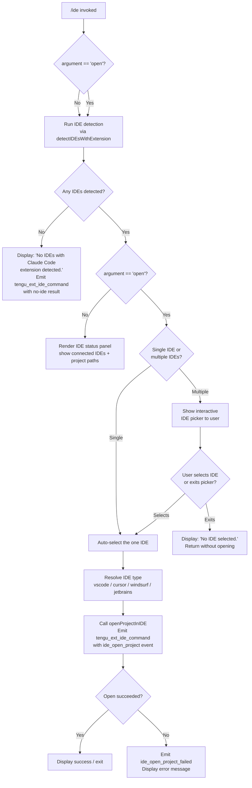

# `/ide`

> Analysis basis: CC v2.1.146 bundle.js (AST extraction + Claude interpretation)
> Minimum version: v2.1.146

---

## Overview

The `/ide` command manages IDE integrations for Claude Code, providing detection of running IDE processes (VS Code, Cursor, Windsurf, JetBrains family), status reporting, and — when the optional `open` sub-command is given — opening the current project in a detected IDE. It operates as a local JSX command, meaning it renders interactive output directly in the terminal UI rather than feeding text to the AI agent.

---

## Registration

| Field | Value |
|---|---|
| type | `local-jsx` |
| name | `ide` |
| description | `Manage IDE integrations and show status` |
| argumentHint | `[open]` |
| module_id | `Ow1` |
| load_inline | `true` |
| loc_byte | `11025528` |
| loc_byte_end | `11025684` |
| loc_line | `8555` |
| arbor_handler.name | `Iv7` |
| arbor_handler.fqn | `claude-2.1.146::Iv7` |
| arbor_handler.kind | `AsyncFunction` |
| arbor_handler.resolution_path | `module_id` |
| arbor_handler.n_hits | `0` |

Analysis basis: CC v2.1.146 bundle.js:+11025528

---

## Input Branching

The command distinguishes at least four execution paths based on: (a) no argument vs. `open` argument, (b) whether any IDE with the Claude Code extension is detected, and (c) user selection in the interactive picker. A Mermaid flowchart is used because there are more than three distinct branches.



Analysis basis: CC v2.1.146 bundle.js:+11021588 (handler `Iv7`), +11021696 (`"open"` literal), +11021805 (`"No IDEs…"` literal), +11021943 (`"No IDE selected."` literal)

---

## Behavioral Spec

### 1. Command Entry Point — `ideCommandHandler` (`Iv7`)

The Arbor-resolved handler for `/ide` is the async function `Iv7`. It is reached from module `Ow1` via the `load_inline` path.

```
async function ideCommandHandler(commandContext):
    emit telemetry("tengu_ext_ide_command", { ... })          // +11021590

    // Parse optional sub-command argument
    subCommand = commandContext.args  // e.g. "open" or empty

    // Resolve current working directory / project context
    projectContext = getProjectContext(commandContext)         // calls c, VM

    // Detect running IDEs that have the Claude Code extension loaded
    detectedIDEs = await detectIDEsWithExtension(projectContext)  // calls xdH

    if detectedIDEs is empty:
        display("No IDEs with Claude Code extension detected.")   // +11021805
        return

    if subCommand == "open":                                       // +11021696
        targetIDE = await pickOrAutoSelectIDE(detectedIDEs)       // calls W8, x6

        if targetIDE is null:
            display("No IDE selected.")                            // +11021943
            return

        await openProjectInIDE(targetIDE, projectContext)         // calls bJ_, tJ
    else:
        renderIDEStatusPanel(detectedIDEs)                         // calls H, bH, uH, bdH
```

Analysis basis: CC v2.1.146 bundle.js:+11021588–+11023199

---

### 2. IDE Detection — `detectIDEsWithExtension` (`xdH`)

Discovers running IDE processes and verifies each has the Claude Code extension active.

```
async function detectIDEsWithExtension(projectContext):
    // Gather candidate IDE socket/port entries
    rawEntries = await gatherIDESocketEntries()             // calls Xq8 → gJL
        // gJL searches .claude directory under home, handles WSL paths  +5250507
        // Skips system user directories: Public, Default, "Default User",
        //   "All Users"                                     +5250808–+5250872
        // Uses fs.realpath to canonicalise symlinks         +5251169

    // For each candidate entry, attempt handshake
    results = await Promise.all(rawEntries.map(entry =>
        verifyIDEEntry(entry)                               // calls BJL → Zs8 → V_
    ))                                                       // +5252686

    // Filter to only successfully verified IDEs
    verified = results.filter(r => r != null)

    // Report telemetry for detection result
    if verified.length > 0:
        emit("ide_detect")                                   // +5253966
    else:
        emit("ide_detect_failed")                            // +5254030

    return verified
```

Analysis basis: CC v2.1.146 bundle.js:+5252623

---

### 3. Socket-Entry Discovery — `gatherIDESocketEntries` (`Xq8`)

Enumerates the per-IDE lock/socket files left by the Claude Code extension in each IDE process.

```
async function gatherIDESocketEntries(searchRoots):
    candidates = []
    for each root in searchRoots:
        files = listFilesIn(join(root, "ide"))              // "ide" literal +5250429
        for each file in files:
            if file.endsWith(".lock"):                       // ".lock" +5249287
                candidates.push(parseEntry(file))

    // Parallel stat + realpath to verify liveness
    results = await Promise.all(candidates.map(gatherSingleEntry))  // +5249196

    return results.flat().filter(Boolean)
```

Analysis basis: CC v2.1.146 bundle.js:+5249177

---

### 4. Per-IDE Entry Verification — `verifyIDEEntry` (`BJL` → `Zs8`)

Validates that the process referenced by a socket/lock entry is still alive and speaks the expected protocol.

```
async function verifyIDEEntry(entry):
    pid = parseInt(entry.pid)                               // +2169964
    if isNaN(pid): return null

    // Check liveness with process.kill(pid, 0)
    isAlive = probeProcessLiveness(pid)                     // calls KLq → process.kill  +5248798
    if not isAlive: return null

    // Attempt protocol handshake (SSE or WebSocket)
    //   "sse-ide" +11019575   "ws-ide" +11019595
    connection = await handshakeWithIDE(entry)              // calls V_ → v2H

    return connection ?? null
```

Analysis basis: CC v2.1.146 bundle.js:+5248880

---

### 5. OS-Level IDE Process Scan — `scanRunningIDEProcesses` (`tJ`)

On Linux, falls back to a `ps aux` grep to enumerate IDE processes when socket files are absent.

```
function scanRunningIDEProcesses(platform):
    if platform == "linux":                                  // +5257474
        // Runs:
        // "ps aux | grep -E \"code|cursor|windsurf|idea|pycharm|…\" | grep -v grep"
        //                                                   +5257500
        output = execSync(psCommand)
        lines  = output.split("\n")
        return parseIDENames(lines)                         // calls uq (index/slice helpers)
    else:
        return []
```

Recognized IDE name tokens (string literals found in traversal): `vscode` (+11022003), `cursor` (+11022044), `windsurf` (+11022085), `jetbrains` (+5249073), `appcode` (+5257874).

Analysis basis: CC v2.1.146 bundle.js:+5258375

---

### 6. Open-Project Flow — `openProjectInIDE` (`bJ_` → `rJL`)

Sends an "open project" or "open worktree" request to the selected IDE over the established connection.

```
async function openProjectInIDE(ide, projectContext):
    // Determine open mode: worktree vs plain project
    mode = projectContext.isWorktree ? "worktree" : "project"  // +11022177, +11022188

    // Build the open-project payload via rJL
    payload = buildOpenProjectPayload(ide, mode, projectContext)
        // rJL iterates Object.entries of ide metadata  +5256914
        // Normalises paths, lowercases IDE name        +5257427
        // Filters to supported IDE types               +5257416

    result = await sendIDECommand(ide.connection, payload)   // calls v2H (connection handler)

    if result.ok:
        emit("ide_open_project")                              // +11022143
        display("Opened in IDE")
    else:
        emit("ide_open_project_failed")                       // +11022250
        display(result.error ?? "Exited without opening IDE")  // +11022540
        hint("restart your IDE")                               // +11022808
```

Analysis basis: CC v2.1.146 bundle.js:+11022673

---

### 7. IDE Status Panel Rendering

When no `open` argument is provided the handler renders a status panel using JSX primitives. Bold-formatted IDE names (`j6.bold` +11022204) and connection indicators are composed alongside per-session project paths. The panel uses the `bdH` component (+11022346) and the `aT`/`Tv7` helpers for layout (+11022655, +11023199). Active connections are listed with padding of 40 characters (literal +15085652) between columns.

Analysis basis: CC v2.1.146 bundle.js:+11022116–+11023199

---

### 8. NFC Path Normalisation in Socket Enumeration (`XB_`)

The socket-file loop normalises all candidate paths to NFC Unicode form before comparison.

```
function normaliseSocketPath(rawPath):
    return rawPath.normalize("NFC")   // "NFC" literal +11025133
```

Up to 3 socket paths are shown inline before a `", …"` truncation marker (literal `", …"` +11025304; comma-space separator `", "` +11025290; truncation threshold 3 +11025065).

Analysis basis: CC v2.1.146 bundle.js:+11025028–+11025208

---

## State & Side Effects

| Item | Detail |
|---|---|
| Telemetry — `tengu_ext_ide_command` | Fired at handler entry (loc +11021590); carries sub-command and detection outcome |
| Telemetry — `ide_detect` | String literal (+5253966); emitted when at least one IDE is detected |
| Telemetry — `ide_detect_failed` | String literal (+5254030); emitted when no IDEs are found |
| Telemetry — `ide_open_project` | String literal (+11022143); emitted on successful IDE open |
| Telemetry — `ide_open_project_failed` | String literal (+11022250); emitted when the open request fails |
| Telemetry — `tengu_config_parse_error` | Emitted if the `.claude` config file cannot be parsed (+3171293) |
| Telemetry — `tengu_daemon_control` | Emitted by the background daemon supervisor layer reached transitively (+15095752) |
| Telemetry — `tengu_bg_spare_*` | Background spare-PTY pool events reached via daemon infrastructure |
| Telemetry — `tengu_run_hook` | Hook execution events reached transitively (+12724572) |
| File-system reads | Reads `.claude/ide/*.lock` files under each home directory; uses `fs.statSync`, `fs.readdirStringSync`, `fs.readFileSync` |
| Process probing | `process.kill(pid, 0)` used to check IDE liveness without signalling (+5248798) |
| Network sockets | Establishes SSE (`sse-ide`) or WebSocket (`ws-ide`) connections to IDE extension endpoints (+11019575, +11019595) |
| appState changes | None observed at depth-2; status display is read-only |
| Sound | None observed |
| Hook registration | `_.onInstallIDEExtension` callback registered during handler execution (+11022717) |

---

## Version History

| Version | Change |
|---|---|
| v2.1.146 | Initial analysis |

---

## Common Mistakes

1. **Running `/ide open` with no IDE extension installed** — The command will report "No IDEs with Claude Code extension detected." rather than launching an IDE binary. The extension must already be installed and the IDE must be running.
2. **Expecting a JetBrains IDE to be auto-detected on macOS without running processes** — The `ps aux` grep fallback only runs on Linux (+5257474); macOS detection relies solely on socket/lock files in the `.claude/ide/` directory.
3. **Using `/ide open` when multiple IDEs are running** — An interactive picker is shown; pressing Escape or dismissing it without selecting returns "No IDE selected." without opening anything.
4. **WSL path confusion** — Paths under `/mnt/c/Users` are enumerated but system accounts (`Public`, `Default`, `Default User`, `All Users`) are explicitly excluded (+5250808–+5250872). Symlinked paths are resolved via `realpath` before matching.
5. **Stale lock files** — If an IDE crashes without cleaning up its `.lock` file, the liveness probe (`process.kill(pid, 0)`) will filter it out, but the detection step may be slower due to the failed handshake attempts.

---

## Appendix — Identifier Mapping

> For bundle debugging only. Identifiers change across versions.

| Identifier | Role |
|---|---|
| `Iv7` | Main IDE command handler (AsyncFunction, arbor-resolved) |
| `XB_` | Socket-file path enumeration and NFC normalisation loop |
| `xdH` | `detectIDEsWithExtension` — top-level IDE detection coordinator |
| `Xq8` | `gatherIDESocketEntries` — enumerates `.claude/ide/*.lock` files |
| `gJL` | `gatherSingleEntry` — per-root directory IDE lock-file walker |
| `BJL` | `verifyIDEEntry` — dispatches per-entry liveness + handshake check |
| `Zs8` | Low-level process/socket verification helper |
| `V_` | IDE connection handshake initiator |
| `v2H` | Connection protocol driver (SSE / WebSocket) |
| `bJ_` | `openProjectInIDE` — sends open-project command to selected IDE |
| `rJL` | `buildOpenProjectPayload` — constructs the IDE open payload |
| `tJ` | `scanRunningIDEProcesses` — `ps aux` grep fallback for Linux |
| `uq` | String index/slice utility used in process-name parsing |
| `KLq` | Process liveness prober (`process.kill` wrapper) |
| `c4q` | IDE-name regex matcher against process command lines |
| `W8` | IDE picker / auto-select helper |
| `x6` | Context/store accessor |
| `Wb6` | Store retrieval wrapper |
| `D_` | Utility reaching `uV` (context helper) |
| `VM` | Project context resolver |
| `xi` | IDE selection UI component |
| `bdH` | IDE status panel JSX component |
| `Tv7` | Layout/rendering helper for IDE status |
| `aT` | Text alignment / display helper |
| `N6` | Config/session normaliser (shared infrastructure) |
| `D` | Background daemon manager |
| `_HA` | Background daemon spawn / spare-PTY refill logic |
| `AHA` | Daemon session claim / attach logic |
| `$HA` | Background job lifecycle manager |
| `MY5` | Daemon supervisor protocol message processor |
| `w` | Daemon background session orchestrator |
| `C` | Supervisor connection manager |
| `z` | Supervisor write/stream handler |
| `Y` | Daemon heartbeat / roster manager |
| `SH` | Log/error reporting helper |
| `CH` | JSON serialisation helper (`JSON.stringify`) |
| `g6` | JSON parse helper (`JSON.parse`) |
| `mH` | String conversion utility |
| `ZH` | String coercion helper |
| `L8` | Error code / result helper |
| `N` | Logging / output formatter |
| `n_` | Error constructor wrapper |
| `bH` | Display render helper A |
| `uH` | Display render helper B |
| `SK` | Path join utility wrapper |
| `AG` | Path construction helper |
| `eq` | Job roster file reader |
| `VsH` | Roster file watcher |
| `NU` | Roster entry parser |
| `fV7` | Atomic roster file writer |
| `Qz` | Atomic file write utility |
| `GU` | Binary frame builder (Buffer utilities) |
| `r8` | Retry / timeout helper |
| `tz5` | Send-claim timeout wrapper |
| `ez5` | Claim socket connect helper |
| `sz5` | `buildClaimFrame` caller |
| `Dr_` | Auth/roster directory writer |
| `xG6` | Auth path resolver |
| `lU_` | Auth file path builder |
| `mY1` | Spare PTY socket path builder |
| `pY1` | Spare PTY host socket path builder |
| `Fd` | Socket path helper |
| `wy` | PTY-PID roster reader |
| `rkH` | PTY-PID file path builder |
| `kLH` | PTY-PID roster path helper |
| `vU` | PTY roster write helper |
| `QU_` | PTY queue helper |
| `EsH` | PTY path builder |
| `HY5` | Spawn argument validator |
| `FM` | Array.isArray utility wrapper |
| `az5` | Daemon spawn result handler |
| `gOH` | Hook dispatcher |
| `IL` | Hook runner (config-change hooks) |
| `o2` | Hook execution engine |
| `G` | Hook scheduler / debouncer |
| `ZgH` | Hook condition checker |
| `ir` | Hook type router |
| `mIH` | Hook cache clearer |
| `P` | Background daemon IPC frame parser |
| `MY5` | Daemon supervisor frame handler (see above) |
| `Lf` | IPC response framer |
| `kv6` | IPC stream destroyer |
| `Q7K` | Lease timeout manager |
| `LHA` | Lease store helper |
| `dz` | Background service label holder (`"background service"`) |
| `fY5` | Attach-phase job runner |
| `LY5` | Stall-detection helper |
| `X` | Terminal repaint coordinator |
| `OT` | Transcript path builder |
| `Y$` | Transcript real-path resolver |
| `wfH` | Transcript line reader |
| `I` | Away-summary generator |
| `t` | Voice toggle silence timer |
| `e` | Voice focus silence timer |
| `g` | MCP tool call filter |
| `F` | Message filter combiner |
| `l` | Output filter |
| `i` | Input stream writer |
| `d` | Permission response handler |
| `T` | Terminal render driver |
| `m` | Deferred write scheduler |
| `b` | Timer ref holder |
| `S` | Settle-state tracker |
| `K` | Connection formatter |
| `W` | Remote-control key handler |
| `V` | Config watcher |
| `Z` | Session start coordinator |
| `z5K` | Heartbeat scheduler |
| `mJH` | Daemon status reader |
| `BC1` | Status formatter |
| `zS1` | Daemon status file writer |
| `GE6` | Status file path builder |
| `ul` | Daemon uptime tracker |
| `M1` | Session store accessor |
| `rE6` | Memory stats collector |
| `s6` | Platform string (`macos`, `windows`, etc.) accessor |
| `Tq` | Config accessor |
| `AC` | Config value reader |
| `pK_` | Config path helper |
| `c` | App-state / context accessor |
| `z8` | Context wrapper |
| `Y$H` | Config file reader/writer |
| `cB4` | Config file watcher |
| `Ga6` | Experiment flag checker |
| `TK_` | Experiment enroller |
| `NK_` | Experiment notification sender |
| `m6` | Config migration helper |
| `Tt` | Config normaliser |
| `qg` | Config schema validator |
| `Mk` | MCP connection writer |
| `ix` | MCP session terminator |
| `lYA` | Log formatter helper |
| `PuK` | Log ring-buffer manager |
| `X1` | Log entry builder |

---

_Note: index built via Arbor fallback; some signals (telemetry, literals) may be missing — see arbor-fallback.js._