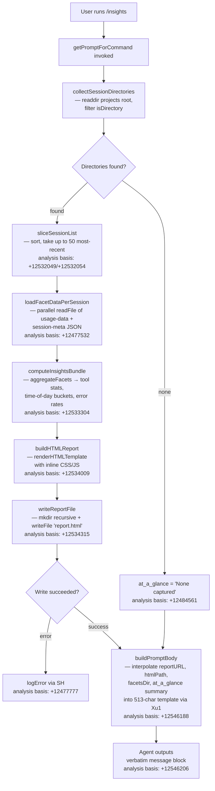

# `/insights`

> Analysis basis: CC v2.1.146 bundle.js (AST extraction + Claude interpretation)
> Minimum version: v2.1.146

---

## Overview

`/insights` generates a shareable HTML usage-report that analyses the user's Claude Code session history across all projects. The command collects per-session JSONL facet data, computes aggregate statistics (tool usage, response-time buckets, time-of-day patterns, error rates), writes a self-contained `report.html` file to disk, and finally instructs the agent to deliver the report URL verbatim inside a `<message>` block — so the user sees exactly one clean response with no additional commentary.

---

## Registration

| Field | Value |
|---|---|
| type | `prompt` |
| name | `insights` |
| description | `Generate a report analyzing your Claude Code sessions` |
| loc_byte | `12544982` |
| loc_byte_end | `12546286` |
| loc_line | `11602` |
| handler_method | `getPromptForCommand` |
| handler_method_start | `12545156` |
| handler_method_end | `12546285` |
| prompt_body.length | `513` |
| prompt_body.trace | `call→Xu1(...) (1 literals)` |
| arbor_handler.name | `getPromptForCommand` |
| arbor_handler.fqn | `claude-2.1.146::getPromptForCommand` |
| arbor_handler.kind | `Method` |
| arbor_handler.resolution_path | `direct` |
| arbor_handler.n_hits | `1` |

Analysis basis: CC v2.1.146 bundle.js:+12544982

---

## Input Branching

The command's data-collection pipeline involves four or more distinct branching paths (directory existence, JSONL file filtering, session slicing, report-generation success/failure), so a Mermaid flowchart is used.



---

## Behavioral Spec

### 1. Handler Entry — `getPromptForCommand`

The registration object carries the handler inline as an `ObjectMethod` named `getPromptForCommand` (Arbor resolution path: `direct`; `n_hits: 1`). When the user invokes `/insights`, the CLI resolves the method, executes it synchronously up to the first async call, then awaits the resulting Promise.

Analysis basis: CC v2.1.146 bundle.js:+12545156

### 2. Session Discovery — `collectSessionDirectories` (`mn7`)

```
async function collectSessionDirectories(baseDir):
    projectsRoot = path.join(baseDir, "projects")  // literal "projects" +3199473
    entries      = await fs.readdir(projectsRoot, {withFileTypes: true})
    dirs         = entries.filter(entry => entry.isDirectory())
    // concurrent capacity: batches of 10 async ops, queue depth 9
    // analysis basis: +12531907, +12531912
    sortedDirs   = dirs.sort(byMtime)
    return sortedDirs
```

The path component `"projects"` is a fixed literal. Analysis basis: CC v2.1.146 bundle.js:+3199473

### 3. JSONL Facet Enumeration — `enumerateFacetFiles` (`ZeH`)

```
async function enumerateFacetFiles(sessionDir):
    entries = await fs.readdir(sessionDir)
    files   = entries.filter(e => e.isFile() && matchesExtension(e, ".jsonl"))
    // extension literal ".jsonl" +12614250
    for each file:
        stats    = await fs.stat(path.join(sessionDir, file))
        basename = path.basename(file)
        result.push({path, basename, stats})
    return result
```

Only `.jsonl` files are collected. Analysis basis: CC v2.1.146 bundle.js:+12614250

### 4. Session Slice — `sliceSessionList` (inside `Pu1`)

```
function sliceSessionList(sortedDirs):
    // Hard limits: min 50, max 200 sessions considered
    // literals +12532049 (50) and +12532054 (200)
    selected = sortedDirs.slice(0, MAX_SESSIONS)
    return selected
```

Maximum sessions loaded in one report run: **200** (bundle.js:+12532054). The working slice target is **50** (bundle.js:+12532049).

### 5. Facet Data Loading — `loadFacetData` (`Vn7`)

```
async function loadFacetData(sessionDir):
    usageDataPath  = path.join(sessionDir, storePath("usage-data"))
    // "usage-data" literal +12471425
    sessionMetaPath = path.join(sessionDir, storePath("session-meta"))
    // "session-meta" literal +12471521
    raw  = await fs.readFile(usageDataPath, "utf-8")  // encoding +12477556
    parsed = safeJSONParse(raw)  // via g6 → JSON.parse +182358
    return {usageData: parsed, sessionMeta: ...}
```

Analysis basis: CC v2.1.146 bundle.js:+12477532

### 6. Aggregate Statistics — `computeInsightsBundle` (`un_` + `In7` + `yn7`)

```
function computeInsightsBundle(sessionFacets):
    toolStats    = aggregateToolUsage(sessionFacets)
    // categorised: WebSearch, WebFetch, Edit, Write, git commit, git push
    // literals +12472118 … +12472537
    timeBuckets  = buildResponseTimeBuckets(sessionFacets)
    // buckets: "2-10s","10-30s","30s-1m","1-2m","2-5m","5-15m",">15m"
    // literals +12488200 … +12488260
    todBuckets   = buildTimeOfDayBuckets(sessionFacets)
    // slots: Morning(6-12), Afternoon(12-18), Evening(18-24), Night(0-6)
    // literals +12489048 … +12489201
    errorRates   = computeErrorRates(sessionFacets)
    atAGlance    = buildAtAGlanceSummary(toolStats, timeBuckets, todBuckets)
    // key: "at_a_glance" +12485227
    // fallback: "None captured" +12484561
    return {toolStats, timeBuckets, todBuckets, errorRates, atAGlance}
```

Analysis basis: CC v2.1.146 bundle.js:+12533304, +12533998, +12533950

### 7. HTML Report Generation — `buildHTMLReport` (`xn7`)

```
function buildHTMLReport(insightsBundle):
    // Chart color palette (literals found in xn7 scope):
    //   #2563eb +12525865, #0891b2 +12526003
    //   #10b981 +12526175, #8b5cf6 +12526318
    //   #dc2626 +12529581, #16a34a +12529830, #eab308 +12530323
    htmlBody = renderSections([
        renderToolUsageSection(insightsBundle.toolStats),
        renderResponseTimeSection(insightsBundle.timeBuckets),
        renderTimeOfDaySection(insightsBundle.todBuckets),
        renderErrorRateSection(insightsBundle.errorRates),
    ])
    // Empty-state strings: "<p class=\"empty\">No data</p>" +12487691
    //   "<p class=\"empty\">No response time data</p>" +12488148
    //   "<p class=\"empty\">No time data</p>" +12488998
    //   "<p class=\"empty\">No tool errors</p>" +12529592
    // HTML escaping applied: &amp; &lt; &gt; &quot; &apos;
    // literals +4649559 … +4649682
    // Max chart width token: 8192 +12487369
    return htmlBody
```

Analysis basis: CC v2.1.146 bundle.js:+12534009

### 8. Report File Write — `writeInsightsReport` (`vn7` / `Zn7`)

```
async function writeInsightsReport(reportDir, htmlContent):
    await fs.mkdir(reportDir, {recursive: true})
    reportPath = path.join(reportDir, "report.html")  // literal +12534287
    await fs.writeFile(reportPath, htmlContent, encoding)
    // JSON metadata also written via Zn7 (CH → JSON.stringify +181618)
    return reportPath
```

Output filename is always `report.html`. Analysis basis: CC v2.1.146 bundle.js:+12534287, +12534315

### 9. Timestamp-Based Report Directory Naming — inside `Pu1`

```
function buildReportDirName(now: Date):
    // Components read: getFullYear +12534119, getMonth +12534140,
    // getDate +12534161, getHours +12534179,
    // getMinutes +12534197, getSeconds +12534217
    return path.join(baseDir, `${year}-${month}-${day}_${hh}-${mm}-${ss}`)
```

Analysis basis: CC v2.1.146 bundle.js:+12534088–12534237

### 10. Prompt Body Construction — `buildPromptString` (`Xu1`)

The handler calls `Xu1` (via `__handler_insights` → `Xu1` at +12546188) to interpolate the 513-character prompt template. The template instructs the agent to:

1. Acknowledge that the user just ran `/insights`.
2. Receive the full insights data payload, report URL, HTML file path, and facets directory path as context.
3. Receive a pre-computed at-a-glance summary labelled as **for agent context only** — the user has not yet seen any output.
4. Output **only** the text between `<message>` tags verbatim, confirming the report is ready and inviting the user to explore any section.

Key constraint enforced by the prompt: **"Do not omit any line."** This makes the agent's response fully deterministic for the delivery message.

Analysis basis: CC v2.1.146 bundle.js:+12546188, +12545156

### 11. At-a-Glance Math Helpers

```
function roundToNearest(value, decimals):
    // Math.round used at +12474249, +12527974, +12484146, +12482999
    return Math.round(value * 10^decimals) / 10^decimals

function computeMedian(sortedValues):
    // Math.floor at +12482820, q.at at +12482711
    mid = Math.floor(sortedValues.length / 2)
    return sortedValues.at(mid)
```

Analysis basis: CC v2.1.146 bundle.js:+12474249

### 12. Session Warmup Filter

A `"warmup_minimal"` session tag (literal +12533845) is excluded from statistics to avoid skewing aggregate counts with initialization-only sessions.

Analysis basis: CC v2.1.146 bundle.js:+12533845

---

## State & Side Effects

| Item | Detail |
|---|---|
| Telemetry | No `tengu_*` events fire directly from the `/insights` handler or its primary call chain (`__handler_insights` → `Pu1` → `mn7`/`ZeH`/`Vn7`/`xn7`/`vn7`). Telemetry events in the wider call graph relate to daemon, MCP, voice, and transcript subsystems reached via depth-2 expansion and are not triggered by this command's normal execution path. |
| File reads | `fs.readdir` on the `projects` root; `fs.stat` + `fs.readFile` per `.jsonl` facet file (via `ZeH` at +12614144, `Vn7` at +12477532) |
| File writes | Creates report directory (recursive `mkdir`) and writes `report.html` + JSON metadata sidecar (via `vn7`/`Zn7` at +12534315) |
| JSON parsing | `JSON.parse` invoked per session facet file via `g6` at +182358 |
| JSON serialisation | `JSON.stringify` called for metadata sidecar via `CH` at +181618 |
| appState changes | None identified in depth-2 traversal |
| Hook registration | None identified in depth-2 traversal |
| Sound | None identified in depth-2 traversal |
| Crypto | SHA-1 hash computed via `uW6.createHash` at +9768195 (reached through `iw8`/`cwH` report-generation sub-path; `"sha1"` literal +9768210, output `"hex"` +9768239, truncated to 6 chars +9768254) |

---

## Version History

| Version | Change |
|---|---|
| v2.1.146 | Initial analysis |

---

## Common Mistakes

1. **Running `/insights` in a fresh environment with no session history** — if the `projects` directory contains no subdirectories, the at-a-glance summary will be `"None captured"` (bundle.js:+12484561) and the HTML report will contain only empty-state placeholders.
2. **Expecting interactive input** — `/insights` is a fire-and-forget `prompt`-type command. The agent is instructed to respond with exactly one fixed message block; it will not ask clarifying questions before generating the report.
3. **Looking for the report in the current working directory** — the report is written to a timestamped subdirectory under the CC data root (not the project directory), with the fixed filename `report.html` (bundle.js:+12534287).
4. **Interpreting the at-a-glance summary as the full report** — the prompt explicitly marks the summary as *for agent context only*. The agent should not repeat it; the full detail lives in the HTML file.
5. **Assuming all sessions are analysed** — only up to **200** session directories are loaded, sliced to the **50** most-recent by default (bundle.js:+12532049, +12532054). Very large history sets are silently truncated.
6. **Expecting output beyond the `<message>` block** — the prompt template includes the instruction `"Do not omit any line"` and constrains the agent to reproduce only that block verbatim, so any additional analysis must be requested in a follow-up turn.

---

## Appendix — Identifier Mapping

> For bundle debugging only. Identifiers change across versions.

| Identifier | Role |
|---|---|
| `__handler_insights` | Synthetic BFS entry-point for the `/insights` command handler |
| `Pu1` | Main insights orchestrator — coordinates session discovery, data loading, report generation, and prompt assembly |
| `mn7` | `collectSessionDirectories` — reads and sorts project session directories |
| `Yg` | Path-join helper used to build the `projects` root path |
| `ZeH` | `enumerateFacetFiles` — lists `.jsonl` facet files within a session directory |
| `Qi` | JSONL extension matcher (regex test via `JvL.test`) |
| `Vn7` | `loadFacetData` — reads `usage-data` and `session-meta` JSON files for a session |
| `bn_` | Storage-path resolver for session data subdirectories |
| `fZ6` | Base storage directory locator (joins base path with `"facets"` / `"usage-data"`) |
| `g6` | `safeJSONParse` — wraps `JSON.parse` with error handling |
| `un_` | `aggregateFacetData` — computes per-session usage statistics |
| `ju1` | Inner session-data processor — classifies tool calls, time slots, errors |
| `jn7` | File-extension extractor (uses `path.extname`) |
| `PzH` | Diff utility caller (`At9.diff`) used for change detection |
| `CL` | Index-of helper for array searching |
| `yM` | Numeric rounding / normalisation helper |
| `xn_` | Session filter / warmup-exclusion helper |
| `vn7` | `writeInsightsReport` — creates report directory and writes `report.html` |
| `Zn7` | JSON metadata sidecar writer — serialises aggregate stats alongside the HTML report |
| `En7` | `loadPreviousReport` — reads and optionally deletes a prior report JSON |
| `wG8` | Storage-path builder for the report output directory |
| `Wu1` | Async unlink helper (removes stale report file) |
| `CH` | `JSONStringify` wrapper (`JSON.stringify` at +181618) |
| `Nn7` | `generateInsightsReport` — top-level report pipeline (calls `cwH`, `Tn7`, etc.) |
| `Tn7` | `parallelProcessSessions` — maps sessions through the processing pipeline with concurrency control |
| `Xn7` | `processSingleSession` — applies `aggregateFacetData` to one session |
| `cwH` | HTML template renderer — assembles the full self-contained HTML report |
| `iw8` | SHA-1 cache-key builder for report content hashing |
| `T8` | UUID generator helper used during report assembly |
| `EyH` | Report post-processor / assistant-message extractor |
| `xn7` | `buildHTMLReport` — renders all chart sections into final HTML |
| `Y7H` | Column/bar chart renderer for tool-usage and category sections |
| `Rn7` | Max-value calculator for chart scaling |
| `Cn7` | Generic chart row builder |
| `bn7` | `JSONStringify` inline helper used within HTML template literals |
| `DG8` | HTML string formatter / whitespace normaliser |
| `w5` | HTML entity escaper (replaces `&`, `<`, `>`, `"`, `'`) |
| `a7` | Core `replaceAll`-based HTML entity replacement |
| `In7` | `computeAggregateStats` — produces median, percentiles, and sorted distributions |
| `Ju1` | Distribution/histogram builder — sorts values and assigns percentile buckets |
| `yn7` | `buildAtAGlanceSummary` — assembles the at-a-glance context object for the prompt |
| `Du1` | Per-session HTML section renderer used within `yn7` |
| `zn7` | Path helper for individual session report sub-paths |
| `EeH` | Object-entries flattener for stat aggregation |
| `uq` | Slice-at-index helper |
| `pn7` | Object-keys enumerator for report metadata |
| `Jn7` | `Number.isNaN` guard helper |
| `LZ6` | Locale/language helper used during session classification |
| `SH` | Error logger / telemetry emitter (calls `$l.logError`) |
| `n_` | Error string formatter (wraps `Error` + `String`) |
| `Ki_` | Message content classifier (image / document type checks) |
| `Ji7` | Text-content validator (trim + array check) |
| `Pi7` | Attachment-type checker (array + `.some`) |
| `Ai_` | Compact-summary formatter (replaces tokens, slices content) |
| `FT6` | Text segment builder (handles array vs string content) |
| `TrH` | Message-map helper — maps conversation messages for display |
| `y4H` | Session-chain builder — reconstructs ordered message chains |
| `wi7` | NaN-safe session lookup helper |
| `ji7` | Full chain-sorting and deduplication logic |
| `Yi7` | Queue-based chain traversal helper |
| `$m1` | Chain accumulator — pushes resolved messages into the output list |
| `NG8` | Session-map getter/setter helper |
| `IG8` | Array-from-values converter for session maps |
| `jG8` | `buildSessionIndex` — constructs per-session lookup maps for chain resolution |
| `R6H` | `TranscriptStore` / session-index core: manages all session Maps (summary, last-prompt, tags, agent metadata, etc.) |
| `lu1` | Relink-walk helper — repairs broken parent references in transcript chains |
| `Ni7` | Binary JSONL parser — low-level byte-level JSONL reader |
| `Ii7` | Minimal sync JSONL reader (open/read/close with `fs.*Sync`) |
| `vi7` | Streaming JSONL parser — buffer-based incremental line parser |
| `R2H` | UUID codec helpers (`IUK`, `kUK`, `hUK`, `yUK`) |
| `hX` | Session-entry hydrator used in chain relinking |
| `en7` | Event/message type classifier |
| `lS` | Session-store lookup helper |
| `PqA` | Recursive object-path setter |
| `mH` | String coercion helper (`String(...)`) |
| `Xu1` | Prompt template interpolator — injects insights data into the 513-char prompt body |
| `Pu1` (also listed above) | See above — primary orchestrator |
| `M` | MCP client manager — manages MCP server connections (also reachable from `Pu1.push`) |
| `_kH` | MCP connection handler — manages individual MCP client lifecycle |
| `GHH` | MCP capability negotiator |
| `zN` | MCP transport selector |
| `yb_` | MCP OAuth flow handler |
| `hb_` | MCP OAuth callback handler |
| `XK1` | MCP reconnect logic |
| `Ib_` | MCP error/status reporter |
| `SX_` | MCP transport-type inclusion checker |
| `z4K` | MCP update applicator |
| `xj8` | MCP config serialiser |
| `FN` | MCP cleanup coordinator |
| `_O5` | MCP server reconciler — diffs desired vs active server set |
| `m18` | MCP filter helper (checks `eVL`/`HvL` sets) |
| `r8` | Generic async-with-timeout wrapper |
| `NaH` | MCP server namer / canonicaliser |
| `zS1` | Session timestamp helper |
| `fD7` | MCP retry-delay calculator |
| `x18` | MCP connection-status encoder |
| `C18` | MCP capability extractor |
| `O8` | MCP debug logger |
| `v7` | MCP error logger |
| `ZH` | String coercion helper (broader use) |
| `wK1` | MCP metrics aggregator |
| `Y06` | Integer parser (parseInt, base-10) |
| `vx_` | Integer parser variant |
| `Fj` | MCP teardown finaliser |
| `G6` | MCP tool-call filter predicate |
| `DH` | Orphaned-permission checker |
| `aH` | MCP message filter (assistant/tool_use roles) |
| `F` | Session-type classifier (MCP prefix check) |
| `l9` | Path-permission error classifier |
| `S` | Timeout/debounce wrapper |
| `s` | Scroll / UI state tracker |
| `o` | Voice recording session manager |
| `c` | Generic continuation / callback placeholder |
| `d` | Tool-approval tracker (`Ao_`) |
| `i` | Approval-session pair manager |
| `e` | Focus/timeout session handler |
| `G` | Skill/debounce event emitter |
| `W` | Remote-control latch handler |
| `I` | Away-summary generator |
| `h` | Away-summary scheduler |
| `EK` | Report template engine entry-point |
| `t0` | Report post-processing finaliser |
| `jv` | Path normaliser (`z3` + `pM`) |
| `jK` | Message-history filter |
| `wu1` | Async path-join wrapper |
| `z06` | MCP status-code classifier |

---

Note: index built via Arbor fallback; some signals (telemetry, literals) may be missing — see arbor-fallback.js.