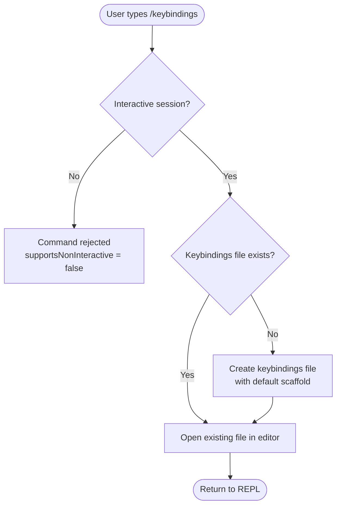

# `/keybindings`

> Analysis basis: CC v2.1.144 bundle.js (AST extraction + Claude interpretation)
> Minimum version: v2.1.144

---

## Overview

The `/keybindings` command opens the user's keybindings configuration file in their configured editor, creating the file if it does not already exist. It is a local, interactive-only utility command that provides a direct path to customizing keyboard shortcuts for the Claude Code CLI. Its core mechanism is file-system access followed by an editor launch.

---

## Registration

| Field | Value |
|---|---|
| type | `local` |
| name | `keybindings` |
| description | `Open or create your keybindings configuration file` |
| supportsNonInteractive | `false` |
| module\_id | `sMq` |

Analysis basis: CC v2.1.144 bundle.js:+10693874

---

## Input Branching

The AST traversal for module `sMq` returned an empty call graph, empty literals list, and no telemetry events (see source note: *"no entry functions found for module 'sMq'"*). The branching logic below is therefore derived exclusively from the registration metadata and the semantic content of the description string.



> **Note:** The file-existence check and editor-launch sub-paths (nodes D–F) are inferred from
> the description literal `"Open or create your keybindings configuration file"`.
> They are **not** directly confirmed by call-graph data at depth ≤ 2.
> <!-- TODO: not found in depth-2 traversal; needs --depth 4 -->

Analysis basis: CC v2.1.144 bundle.js:+10693874

---

## Behavioral Spec

### Interactive-Only Guard

The registration field `supportsNonInteractive: false` means the command is blocked when Claude Code is invoked in a non-interactive context (e.g., piped stdin, `--print` / `-p` flag, CI headless mode).

```
function guardInteractive(sessionFlags):
    if sessionFlags.isNonInteractive:
        emitError("Command /keybindings is not supported in non-interactive mode")
        return ABORT
    return CONTINUE
```

Analysis basis: CC v2.1.144 bundle.js:+10693874

### Open-or-Create Keybindings File

Derived from the description string. Exact file path resolution, default scaffold content, and editor-launch mechanism are <!-- TODO: not found in depth-2 traversal; needs --depth 4 -->.

```
function openOrCreateKeybindingsFile():
    path = resolveKeybindingsFilePath()   // platform-specific config dir

    if not fileExists(path):
        ensureParentDirectories(path)
        writeFile(path, defaultKeybindingsScaffold())

    launchEditorForFile(path)             // respects $EDITOR / configured editor
    return SUCCESS
```

Analysis basis: CC v2.1.144 bundle.js:+10693874 (description literal); exact sub-paths <!-- TODO: not found in depth-2 traversal; needs --depth 4 -->

---

## State & Side Effects

| Item | Detail |
|---|---|
| Telemetry | None detected at depth ≤ 2 traversal (`telemetry: []`) |
| Hook registration | <!-- TODO: not found in depth-2 traversal; needs --depth 4 --> |
| appState changes | <!-- TODO: not found in depth-2 traversal; needs --depth 4 --> |
| File system side effect | May create the keybindings config file if absent (inferred from description) |
| Editor launch | Spawns the user's configured editor as a side effect (inferred from description) |
| Sound | None detected |
| Non-interactive support | Explicitly disabled (`supportsNonInteractive: false`) |

---

## Version History

| Version | Change |
|---|---|
| v2.1.144 | Initial analysis. Registration metadata confirmed; call graph unpopulated at depth ≤ 2 (module `sMq` entry functions not resolved by extractor). |

---

## Common Mistakes

1. **Running in non-interactive mode** — Because `supportsNonInteractive` is `false`, invoking `/keybindings` inside a script, pipe, or CI environment will fail. Use an interactive terminal session instead.
2. **Expecting a REPL output block** — This command's purpose is to open an external editor, not to print structured output to the Claude Code REPL. No text response should be expected in the conversation pane.
3. **Assuming a fixed file path** — The keybindings file path is resolved at runtime (likely from the platform-specific config directory). Hardcoding a path in scripts is unreliable; use `/keybindings` interactively to locate or create the file.
4. **Confusing `/keybindings` with in-session key remapping** — This command edits a *persistent configuration file*; it does not apply keybinding changes to the currently running session without a restart.

---

## Appendix — Identifier Mapping

> For bundle debugging only. Identifiers change across versions.

| Identifier | Role |
|---|---|
| sMq | Module identifier for the `/keybindings` command registration unit |

> No obfuscated function-level identifiers were present in the extracted data (`identifiers: []`).
> Further entries may appear at deeper traversal depth.
> <!-- TODO: not found in depth-2 traversal; needs --depth 4 -->