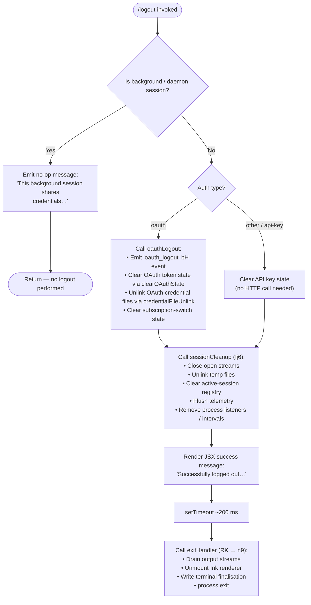

# `/logout`

> Analysis basis: CC v2.1.146 bundle.js (AST extraction + Claude interpretation)
> Minimum version: v2.1.146

---

## Overview

The `/logout` command signs the current user out of their Anthropic account by clearing OAuth credentials, purging in-memory auth state, removing credential files, and then exiting the CLI process with a short delay. It detects background/daemon sessions and emits an informational no-op message rather than performing a real logout in those contexts.

---

## Registration

| Field | Value |
|---|---|
| type | `local-jsx` |
| name | `logout` |
| description | Sign out from your Anthropic account |
| loc_byte | `11061010` |
| loc_byte_end | `11061198` |
| loc_line | `9039` |
| module_id | `Kkq` |
| load_inline | `true` |
| arbor_handler.name | `igL` |
| arbor_handler.fqn | `claude-2.1.146::igL` |
| arbor_handler.kind | `AsyncFunction` |
| arbor_handler.resolution_path | `module_id` |
| arbor_handler.n_hits | `0` |

Analysis basis: CC v2.1.146 bundle.js:+11061010

---

## Input Branching

There are four distinct execution paths based on session context and auth type, so a flowchart is used.



Analysis basis: CC v2.1.146 bundle.js:+7457445 (igL entry), +7457555 (background-session guard), +7457499 (auth-type branch), +7457817 (setTimeout), +7457833 (exitHandler call)

---

## Behavioral Spec

### Background-Session Guard

```
async function logoutHandler(context):
    sessionType = getSessionType(context)   // Cq → _3H
    if sessionType in ["bg", "daemon", "daemon-worker"]:
        renderMessage(
            "This background session shares credentials with other sessions; "
            "/logout here has no effect. Run /logout from your main terminal to sign out."
        )
        return                              // early exit, no state mutation
```

Analysis basis: CC v2.1.146 bundle.js:+7457445, +7457555; literals `"bg"` (+2174184), `"daemon"` (+2174194), `"daemon-worker"` (+2174208), no-op message string (+7457555)

---

### OAuth Logout Path

```
async function performOAuthLogout():
    emitEvent("oauth_logout")              // bH, loc +7457223

    // Clear OAuth credential files
    credentialFileUnlink()                 // iPq → pVH.unlink (+6651627)
    clearOAuthTokenStore()                 // iPq → oPq, o2_ (+6651563, +6651569)

    // Purge subscription-switch state
    clearSubscriptionSwitchState()         // literal "subscription-switch" (+7457071)

    // Flush remaining OAuth session data
    clearSessionTokenMap()                 // Tz_ → Jz_ → Ez_ (+4660084)
    clearTimeoutHandles()                  // Tz_ → clearTimeout (+4655041)
    unlinkOAuthSessionFile()               // Tz_ → fO6.unlink (+4660100)
```

Analysis basis: CC v2.1.146 bundle.js:+7457226 (`"oauth_logout"` literal), +6651627, +4660084, +4660100

---

### Session Cleanup (shared path)

```
async function sessionCleanup():
    // Close open I/O streams
    closeInputStream()                     // f → A.close (+15071107)
    closeOutputStream()                    // f → q.close (+15071117)

    // Remove temporary credential / lock files
    unlinkTempFiles()                      // q → p7K.unlinkSync (+15039168)

    // Clear active-session registry
    activeSessionSet.delete(sessionId)     // L → q.delete (+15064915)
    activeSessionSet.add / cleanup finalise // L → q.add, f.finally (+15064892, +15064901)

    // Tear down process event listeners and intervals
    clearAllIntervals()                    // kUH → kK_ → clearInterval (+3149903)
    process.removeListener("exit", ...)    // kK_ → process.removeListener (+3149938)
    process.off("beforeExit", ...)         // kUH → process.off (+3149246)

    // Clear in-memory caches
    clearCacheM$H()                        // kUH → M$H.clear (+3149365)
    clearCacheWa6()                        // kUH → Wa6.clear (+3149377)
    clearCacheBf6()                        // kUH → Bf6.clear (+3149389)
    clearCacheEK_()                        // kUH → EK_.clear (+3149401)
    clearCacheKg()                         // kUH → Kg.clear (+3149413)

    // Flush telemetry / metrics emitter
    emitShutdownEvent()                    // xGH → IUH.emit (+3149118)

    // Persist global config changes (with lock; safety check prevents auth loss)
    saveConfigWithLock()                   // K8 → dK_ (see literals +3169039, +3165921)
```

Analysis basis: CC v2.1.146 bundle.js:+7456657–+7456849 (Ij6 call sites), +3149096 (xGH), +3149236 (kUH)

---

### Keychain / Credential File Removal

```
function removeCredentialFiles():
    // Derive per-user keychain service name
    username = os.userInfo().username       // iE → ug6.userInfo (+2042419)
    serviceKey = sha256(
        normalize(username, "NFC")          // Dv → _.normalize (+2042221)
    ).slice(0, 8)                           // literal 8 (+2042317), "sha256" (+2042271)

    try:
        deleteKeychainEntry("claude-code-user", serviceKey)   // literal (+2042451)
    catch err:
        log("Failed to delete keychain entry")  // literal (+2043209)

    // Unlink plaintext credential fallback file
    unlinkFallbackFile()                   // iPq → pVH.unlink (+6651627)
```

Analysis basis: CC v2.1.146 bundle.js:+2043013 (Dv), +2042451, +2043147, +2043209

---

### Post-Logout Exit Sequence

```
async function exitAfterLogout():
    // Render success notification (JSX)
    render(createElement("system", {}, "Successfully logged out from your Anthropic account."))
    // literal (+7457754), "system" role (+7457707)

    // Brief delay to allow terminal render to flush
    await sleep(200)                       // setTimeout 200 ms (+7457817), literal 200 (+7457849)

    // Invoke exit handler
    exitHandler()                          // RK → n9 (+7457833)
        // n9 drains output streams (tSH → c_A.drain +57310)
        // n9 unmounts Ink renderer (AVH → H.unmount +5269422)
        // n9 writes terminal finalisation sequences (tt6 → gt.writeSync +3674366)
        // n9 calls process.exit (FJ_ → process.exit +5270022)
        //   or process.kill SIGKILL on timeout (FJ_ → process.kill +5270047)
        // Graceful drain window: max(5000, 3500) ms (+5271587, +5271594)
        // Hard abort timeout: 2000 ms (+5271772)
```

Analysis basis: CC v2.1.146 bundle.js:+7457729, +7457754, +7457817, +7457833, +5271587, +5271594, +5271772

---

## State & Side Effects

| Item | Detail |
|---|---|
| Telemetry — `tengu_config_lock_contention` | Fired when config-file lock acquisition takes longer than expected (bundle.js:+3168712) |
| Telemetry — `tengu_config_stale_write` | Fired when a stale config write is detected and aborted (bundle.js:+3168848) |
| Telemetry — `tengu_config_parse_error` | Fired when the on-disk config cannot be parsed during re-read (bundle.js:+3171293) |
| Telemetry — `tengu_config_auth_loss_prevented` | Fired when a write is refused because re-read config is missing auth present in cache (bundle.js:+3169191); see safety message literal +3169039 |
| Telemetry — `tengu_feature_ok` / `tengu_feature_sad` / `tengu_feature_bad` | Feature-flag outcome events emitted by credential store helper (bundle.js:+955938, +956073, +955996) |
| Telemetry — `tengu_daemon_config_reload` | Fired by daemon config-reload path reached via supervisor cleanup (bundle.js:+15074596) |
| Telemetry — `tengu_startup_perf` | Startup profiling report emitted during exit profiling flush (bundle.js:+211776) |
| Telemetry — `tengu_scroll_summary` | Scroll/render summary emitted at exit (bundle.js:+5270890) |
| Telemetry — `tengu_pewter_brook` | Environment-detection diagnostic emitted during terminal-mode resolution (bundle.js:+3339848) |
| Telemetry — `tengu_cache_eviction_hint` | Cache eviction hint emitted near session-end event (bundle.js:+5271923) |
| `oauth_logout` event | Internal event string emitted at the start of the OAuth credential-removal flow (+7457226) |
| Credential files unlinked | OAuth token file (`pVH.unlink` +6651627), OAuth session file (`fO6.unlink` +4660100) |
| Keychain entry deleted | Entry keyed by `"claude-code-user"` + 8-char SHA-256 hash of username (+2042451, +2042317) |
| In-memory caches cleared | Five named caches: M$H, Wa6, Bf6, EK_, Kg (+3149365–+3149413) |
| Process event listeners removed | `"exit"` (+3149304), `"beforeExit"` (+3149961), via `process.off` and `process.removeListener` |
| Config persisted | Global config saved with file lock; auth-loss guard prevents overwriting auth token with empty value (+3169039, +3165921) |
| Process exit | `process.exit` called after output drain; SIGKILL fallback after timeout (+5270022, +5270047) |
| Sound | None detected |

---

## Version History

| Version | Change |
|---|---|
| v2.1.146 | Initial analysis |

---

## Common Mistakes

1. **Running `/logout` inside a background or daemon session** — the command silently no-ops and prints an advisory message. Users must run `/logout` from a primary terminal session to actually clear credentials.
2. **Expecting an instant prompt return** — the command inserts a ~200 ms delay before calling the exit handler so the success message can render; the process then terminates entirely, so there is no prompt to return to.
3. **Assuming API-key configurations require a network call** — `/logout` for non-OAuth auth types clears local state only; no network request is made. Only OAuth auth triggers `oauth_logout` event handling.
4. **Concurrent Claude instances** — the config-lock contention guard (`tengu_config_lock_contention`) will fire a warning if another Claude instance holds the config lock during the logout write. The write may be delayed up to 60 000 ms (+3169393) before proceeding.
5. **Keychain deletion failures are non-fatal** — if the system keychain entry cannot be removed (e.g., permissions, no keychain daemon), the error is logged (`"Failed to delete keychain entry"` +2043209) but logout continues and the process exits normally.

---

## Appendix — Identifier Mapping

> For bundle debugging only. Identifiers change across versions.

| Identifier | Role |
|---|---|
| `igL` | Main async logout handler (Arbor-resolved handler for `/logout`) |
| `Ij6` | Session cleanup orchestrator (closes streams, unlinks files, tears down listeners) |
| `Nj6` | Auth/session state reset coordinator (clears OAuth state, token maps, session files) |
| `xGH` | Telemetry flush / shutdown-event emitter |
| `kUH` | Process-listener and in-memory cache teardown |
| `kK_` | Interval-clear and `process.removeListener` helper |
| `Cq` | Session-type classifier (returns `"bg"`, `"daemon"`, `"daemon-worker"`, etc.) |
| `_3H` | Session-type constant/resolver called by Cq |
| `xQH` | Error-type classifier used in OAuth network error handling |
| `V4` | OAuth token state manager (read/write/emit) |
| `bQH` | OTEL metrics attribute builder (user.id, session.id, app.version, etc.) |
| `Gm` | Metrics random-bytes / session-ID generator |
| `uD_` | Metrics helper accessing `mH` (string utility) |
| `iPq` | OAuth credential file unlink and token store clearer |
| `oPq` | OAuth token store primary clearer |
| `o2_` | OAuth token store secondary reset (`RXA`) |
| `RXA` | OAuth token store backing object |
| `BAH` | Credential path utility |
| `w16` | Credential path joiner (`SXA.join`, `i8`) |
| `Tz_` | Session-file / timeout handle cleanup |
| `Jz_` | Session-file inner cleanup helper |
| `Ez_` | Session state object reset |
| `L_8` | Session file path joiner |
| `Tq_` | Config load + persistence entry point (calls `uP9`, `K8`) |
| `uP9` | Config reader / writer (calls `FrA`, `N`, `ZH`) |
| `FrA` | Config file path resolver (NFC normalise, SHA-256, 8-char hash) |
| `Dv` | String normalise + hash helper |
| `iE` | OS user-info lookup (`ug6.userInfo`) |
| `bP` | Config value helper (`v2H`) |
| `K8` | Global config save-with-lock orchestrator |
| `dK_` | Config file write with lock, backup rotation, and auth-loss guard |
| `Y$H` | Config file backup-copy helper |
| `cK_` | Backup directory path builder |
| `QK_` | Config atomic-write helper (calls `hq6`) |
| `hq6` | Atomic file write via temp file + rename (with fchmod, fsync) |
| `if6` | Config field presence / validation check |
| `iI9` | Config entries iterator |
| `xUH` | Config timestamp recorder |
| `bUH` | Config write metadata helper |
| `jA9` | Config object merge helper (`os8`, `Object.assign`) |
| `iK` | Credential storage I/O dispatcher |
| `EA9` | Secure-storage read/write/delete orchestrator |
| `UWH` | Secure-storage async write context manager |
| `uP4` | Storage-write async local-storage (ALS) runner |
| `bH` | Feature-flag `tengu_feature_ok` emitter |
| `z8` | Feature-flag `tengu_feature_sad` emitter |
| `uH` | Feature-flag `tengu_feature_bad` emitter |
| `_XH` | Supplemental session state clearer |
| `Xa` | Auxiliary auth state clearer |
| `Tt` | String coerce / lowercase helper |
| `mH` | Low-level string constructor wrapper |
| `qg` | String template helper (`Tm`) |
| `SH` | Error queue / log-error dispatcher |
| `n_` | Error construction helper |
| `X1` | Essential-traffic label helper (`lYA`) |
| `PuK` | Error queue circular-buffer manager (`Db6.shift`, `Db6.push`) |
| `CE` | Error code / type classifier |
| `ZH` | String coercion utility |
| `N` | HTTP request helper (debug, retries, header building) |
| `$wK` | HTTP request builder (`QV`, `MwK`, `n_A`) |
| `H` | Random jitter / retry delay helper |
| `CH` | JSON.stringify wrapper |
| `O4` | URL path manipulator |
| `NRH` | Query-string helper (`YqA`) |
| `YwK` | File-write network request sender |
| `RK` | Exit orchestrator (calls `n9`, `AVH`, `BJ_`, `FJ_`) |
| `n9` | Core exit sequencer (drain, unmount, write, exit) |
| `AVH` | Ink renderer unmount + terminal finalisation writer |
| `tt6` | Terminal escape-sequence writer |
| `BJ_` | Pre-exit output flusher / logger |
| `FJ_` | Hard-exit enforcer (`process.exit`, `process.kill SIGKILL`) |
| `tSH` | Output drain helper (`c_A.drain`) |
| `Y` | Supervisor / renderer loop manager |
| `mJH` | Renderer state-map iterator |
| `BC1` | Renderer column-width calculator |
| `W` | Remote-control / key-input stop handler |
| `z5K` | Heartbeat helper (`Zt`) |
| `I_6` | Startup profiling reporter (`bh8`) |
| `bh8` | Performance mark collector / telemetry emitter |
| `iqA` | Startup-perf config path reader |
| `Vq8` | Scroll summary collector (`yLq`, `O9`) |
| `hLq` | Scroll summary secondary helper |
| `yLq` | Scroll metrics calculator (`Date.now`, `Math.round`, `Math.max`) |
| `O9` | Terminal/environment capability detector |
| `n66` | Session-end event emitter |
| `vq8` | Race-condition safe abort-signal helper |
| `r8` | Timeout-with-abort helper |
| `pD6` | Auth state field accessor (part of Nj6 reset) |
| `wr6` | Auth state secondary field accessor |
| `jr6` | NP9 cache clearer |
| `H$H` | Auth state tertiary field accessor |
| `S6` | Low-level UUID / identifier utility |
| `y5` | Metrics context accessor (`ID`, `m6`) |
| `uHq` | OTEL attribute pair builder (`a3L`, `o3L`) |
| `VA8` | OTEL resource descriptor builder (identity, groups, freeze) |
| `w86` | OTEL event attribute formatter |
| `gY6` | Plugin / extension directory stat helper |
| `ZO` | Plugin directory entry helper (`y4`) |
| `SLq` | Shell-escape helper for exit log |
| `K` | Line-padding formatter (`L.map`, `f.padEnd`) |
| `xh` | Terminal cursor restore helper |
| `pV` | Output stream reference |
| `mR` | Renderer instance reference |
| `NI` | Config field name normaliser |
| `Q6` | File exists / access check utility |
| `L8` | Log-level / logger reference |
| `c` | Low-level config cache accessor |
| `_t8` | Config schema validator |

---

Note: index built via Arbor fallback; some signals (telemetry, literals) may be missing — see arbor-fallback.js.