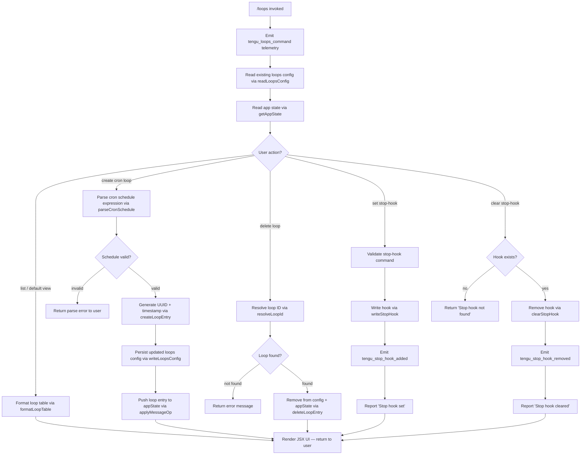

# `/loops`

> Analysis basis: CC v2.1.146 bundle.js (AST extraction + Claude interpretation)
> Minimum version: v2.1.146

---

## Overview

The `/loops` command provides an interactive management interface for Claude Code's recurring loop system and stop-hooks. It allows users to list active loops, create new scheduled (cron-based) loops, and delete existing loops or stop-hooks — all within the current session context. Internally the handler (`Wm7`) reads existing loop/hook configuration, renders a JSX-based UI, and applies state mutations through the app's message-op pipeline.

---

## Registration

| Field | Value |
|---|---|
| type | `local-jsx` |
| name | `loops` |
| description | `List, create, and delete recurring loops and stop-hooks` |
| immediate | `true` |
| module_id | `HN1` |
| load_inline | `true` |
| loc_byte | `11905765` |
| loc_byte_end | `11905947` |
| loc_line | `9800` |
| arbor_handler.name | `Wm7` |
| arbor_handler.fqn | `claude-2.1.146::Wm7` |
| arbor_handler.kind | `AsyncFunction` |
| arbor_handler.resolution_path | `module_id` |
| arbor_handler.n_hits | `0` |

Analysis basis: CC v2.1.146 bundle.js:+11905765

---

## Input Branching

The handler contains five or more distinct action branches (list, create cron loop, delete loop, set stop-hook, clear stop-hook) plus sub-branching on cron schedule parsing and daemon/spare-pool interactions, so a Mermaid flowchart is used.



Analysis basis: CC v2.1.146 bundle.js:+11904722, +11904769, +11904773, +11905008, +11905146, +11905370, +11905458

---

## Behavioral Spec

### Main Handler (`Wm7`)

```
async function loopsCommandHandler(context):
    emit telemetry("tengu_loops_command")              // +11904724
    config  = await readLoopsConfig(context)           // calls Ue → tEH
    appSt   = context.getAppState()                    // +11904773
    loopMap = buildLoopMap(config, appSt)              // calls iaH

    // Map over cron-type entries
    cronEntries = appSt.filter(e => e.type == "cron") // +11904819
    hooks       = appSt.filter(e => e.type == "stophook") // +11904905

    action = parseUserIntent(context.input)            // calls Xm7 for schedule math

    switch action:
        case "list":
            return renderLoopsTable(cronEntries, hooks) // calls formatLoopTable

        case "create":
            entry = await createLoop(context)          // calls zQH
            applyMessageOp("append", entry)
            return renderLoopsTable(...)

        case "delete":
            result = await deleteLoop(context)         // calls GZ
            return renderLoopsTable(...)

        case "set-stop-hook":
            result = await setStopHook(context)        // calls oaH
            emit telemetry("tengu_stop_hook_added")    // +10282958
            report("Stop hook set")                    // +11905482
            return renderLoopsTable(...)

        case "clear-stop-hook":
            result = await clearStopHook(context)      // calls oaH
            if not found:
                return "Stop hook not found"           // +11905164
            emit telemetry("tengu_stop_hook_removed")  // +10283326
            report("Stop hook cleared")                // +11905186
            return renderLoopsTable(...)

    return JSX element via Id_.createElement           // +11905525
```

Analysis basis: CC v2.1.146 bundle.js:+11904722

---

### Reading Loops Configuration (`readLoopsConfig` / `tEH`)

```
async function readLoopsConfig(context):
    dirPath  = buildConfigPath(context)     // B1H → x_8.join
    raw      = fs.readFile(dirPath, "utf-8") // +4735280, encoding "utf-8" +4735308
    if error.code in ["ENOENT","EACCES","EPERM","ENOTDIR","ELOOP","EROFS"]:
        return empty config                 // +172632 … +172701
    parsed   = parseLoopFile(raw)           // calls SH for schedule parsing
    validate = Array.isArray(parsed)        // +4735424
    if not valid:
        log error via logError              // SH → $l.logError +961432
    return normalized config                // calls N for model normalization
```

Analysis basis: CC v2.1.146 bundle.js:+4735261

---

### Cron Schedule Parsing (`parseCronSchedule` / `GZ`)

```
function parseCronSchedule(input):
    trimmed = input.trim()                  // +4733052
    // Check for human-readable aliases
    if trimmed matches "Every minute":      // +4733172
        return { minutes: "*", ... }
    if trimmed matches "Every hour":        // +4733389
        return { hours: "*", ... }

    // Parse numeric cron expression
    parts   = splitOnWhitespace(trimmed)
    minutes = parseInt(parts[0])            // +4733228
    hours   = parseInt(parts[1])

    // Validate ranges: minutes 0–59 (+11904489), hours 0–23 (+11904560),
    //   dom 1–31 (+11904613), seconds cap 60 (+11904455)
    if out of range:
        return parse error

    // Day-of-week adjustment uses UTC date math
    //   getUTCDay +4733929, setUTCDate +4733948, getUTCDate +4733961,
    //   setUTCHours +4733979, getDay +4734008
    next = computeNextFire(parts)

    return { expr, nextFire: next.toString() }  // +4733426, +4733597
```

Analysis basis: CC v2.1.146 bundle.js:+4733052

---

### Creating a Loop Entry (`createLoopEntry` / `zQH`)

```
async function createLoopEntry(context, scheduleExpr):
    id        = crypto.randomUUID()              // Vs9.randomUUID +4736608
    createdAt = Date.now()                       // +4736670
    meta      = buildEntryMeta(id, scheduleAt)  // AXH +4736716
    config    = await readLoopsConfig(context)   // tEH +4736760
    config.push(newEntry)                        // M.push +4736773

    // Ensure .claude directory exists
    ensureDir(".claude")                         // OQH → b_8.mkdir +4736428
                                                 // path literal ".claude" +4736449
    writeLoopsConfigFile(config)                 // OQH → b_8.writeFile +4736525

    // Encode config as JSON
    encoded = encodeJson(config)                 // OQH → CH +4736546

    // Emit to appState (type="system")          // +11905053
    applyMessageOp(context, "append", entry)

    return entry
```

Analysis basis: CC v2.1.146 bundle.js:+4736608

---

### Setting / Clearing a Stop-Hook (`setStopHook` / `oaH`)

```
async function manageStopHook(context, action):
    S6_result = initState()                    // S6 +10283060
    iaH_map   = buildLoopMap(context)          // iaH +10283067
    appState  = context.getAppState()          // +10283071

    if action == "set":
        hookId  = crypto.randomUUID()          // V51 → T51.randomUUID +10283416
        opType  = "append"                     // +10283292
        msgType = "prompt"                     // +10282387
        goalKey = "goal"                       // +10283357
        statusK = "goal_status"               // +10283485
        attachT = "attachment"                 // +10283398
        context.applyMessageOp(opType, hookPayload)  // +10283269
        context.setAppState(updatedState)      // +10283200
        emit telemetry("tengu_stop_hook_added") // +10282958
        return "Stop" indicator               // string "Stop" +10282280

    if action == "clear":
        // locate existing hook
        if not found:
            return "Stop hook not found"       // +11905164
        context.applyMessageOp("remove", hookId)
        emit telemetry("tengu_stop_hook_removed") // +10283326
        return "Stop hook cleared"             // +11905186
```

Analysis basis: CC v2.1.146 bundle.js:+10282272

---

### Loop Table Formatter (`formatLoopTable` / `iaH` + `PwH`)

```
function formatLoopTable(loopEntries):
    colWidths = computeColumnWidths(loopEntries)  // PwH → K.set +8480980
    rows = loopEntries.map(entry => {
        cells = mapCells(entry)                   // jQq → H.map +8480749
        return cells.map((c, i) => c.padEnd(colWidths[i], "  ")) // +15083681
    })
    result = []
    result.push(headerRow)                        // iaH → A.push +10282396
    result.push(...rows)
    return result
```

Analysis basis: CC v2.1.146 bundle.js:+10282272

---

### Cron Schedule Validator (`validateCronInput` / `Xm7`)

```
function validateCronInput(rawInput):
    match = rawInput.match(cronRegex)          // H.match +11904310
    if not match:
        return null
    minutes = parseInt(match[1])               // +11904347
    // Clamp: max(0, ...) +11904432, ceil +11904443, round +11904516
    // Valid ranges:  0–59 minutes, 0–23 hours, 1–31 dom, cap=60 +11904455
    // Range string example: "1-5" is a supported range literal +4734096
    normalized = normalizeScheduleParts(match)
    // Delegates day-of-week parsing to cronPartParser (HN +11904680)
    return normalized
```

Analysis basis: CC v2.1.146 bundle.js:+11904310

---

### Cron Part Parser (`cronPartParser` / `HN` + `b5L`)

```
function parseCronPart(part):
    trimmed = part.trim()                    // HN → H.trim +4731881
    tokens  = trimmed.split(separator)       // b5L → H.split +4731301
    for token in tokens:
        m = token.match(rangePattern)        // b5L → L.match +4731321
        if m:
            lo = parseInt(m[1])              // +4731366
            if lo > 10: clamp()              // number 10 +4731380
        K.add(value)                         // b5L → K.add +4731427
    // day-of-week mapping uses constants 3,6,7 +4731542/+4731578/+4731584
    return Array.from(K)                     // +4731829
```

Analysis basis: CC v2.1.146 bundle.js:+4731881

---

### Delete Loop (`deleteLoop` / `GZ` continued)

```
async function deleteLoop(context, loopId):
    config    = await readLoopsConfig(context)
    idx       = config.findIndex(e => e.id == loopId)
    if idx < 0:
        return error("loop not found")
    config.splice(idx, 1)
    writeLoopsConfigFile(config)
    // Also stops any running daemon for this loop
    bgProcess = getBgProcess(loopId)        // w → A.get +15060295
    if bgProcess:
        bgProcess.kill("SIGKILL")           // +15060454, "SIGKILL" +15060461
    return success
```

Analysis basis: CC v2.1.146 bundle.js:+4733052, +15060295

---

### Background Loop Lifecycle (`bgLoopRunner` / `w` + `$HA`)

The background daemon subsystem (`$HA`, `w`) handles the actual execution of recurring loops:

```
async function bgLoopRunner(loopEntry):
    // State machine; possible states:
    //   "done" +15065028, "killed" +15065046, "stopped" +15065055,
    //   "failed" +15065065, "crashed" +15065212, "blocked" +15065266,
    //   "working" +15065373, "bg" +15065537, "daemon" +15065857,
    //   "idle" +15065972, "resuming" +15066809

    q.add(loopEntry)                         // +15064892
    try:
        result = await executeLoop(loopEntry) // AHA → dU.spawn
        if lowMemory:
            freemem = os.freemem()           // vv8.freemem +15060822
            emit("tengu_bg_dispatch_low_mem") // +15060992
        retire if settled                    // x.retireIfSettled +15061072
    finally:
        q.delete(loopEntry)                  // +15064915
        // timeout 300000 ms (5 min) cleanup gate  +15066595
        if os == "windows":                  // +15066169
            zY.unlink(socketPath)            // +15066181

    // Spare pool refill telemetry
    emit("tengu_bg_spare_refill")            // +15040064
    emit("tengu_bg_spare_spawn")             // +15060190
    emit("tengu_bg_spare_enable")            // +15061631
    emit("tengu_bg_spare_claim")             // +15061752
```

Analysis basis: CC v2.1.146 bundle.js:+15064892

---

## State & Side Effects

| Item | Detail |
|---|---|
| Telemetry: `tengu_loops_command` | Fired at handler entry (+11904724) |
| Telemetry: `tengu_stop_hook_added` | Fired when a stop-hook is successfully registered (+10282958) |
| Telemetry: `tengu_stop_hook_removed` | Fired when a stop-hook is cleared (+10283326) |
| Telemetry: `tengu_bg_dispatch_sigkill_escalate` | Fired when a loop's background process requires SIGKILL escalation (+15060413) |
| Telemetry: `tengu_daemon_control` | Fired during daemon lifecycle transitions (+15095752) |
| Telemetry: `tengu_feature_ok` / `tengu_feature_bad` / `tengu_feature_sad` | Feature health events from inner subsystem (+955938, +955996, +956073) |
| Telemetry: `tengu_bg_low_mem_mb` | Fired on macOS when free RAM drops below threshold (+12414219); threshold 1024 MB +12414241 |
| Telemetry: `tengu_bg_dispatch_low_mem` | Low-memory dispatch guard (+15060992) |
| Telemetry: `tengu_daemon_idle_exit` | Daemon self-terminates on idle (+15079597) |
| Telemetry: `tengu_bg_spare_enable` / `tengu_bg_spare_spawn` / `tengu_bg_spare_claim` / `tengu_bg_spare_claim_fail` | Spare-pool lifecycle (+15061631, +15060190, +15061752, +15062015) |
| Telemetry: `tengu_bg_sendclaim_failed` | Daemon claim handshake timeout (+15041598); timeout 5000 ms +15042019 |
| Telemetry: `tengu_daemon_config_reload` | Daemon reloads config at runtime (+15074596) |
| Telemetry: `tengu_daemon_yield` | Daemon yields to foreground process (+15078682) |
| Telemetry: `tengu_bg_spare_refill` | Spare worker pool refill (+15040064) |
| appState changes | Creates/removes entries of type `"cron"` and `"stophook"` via `applyMessageOp` with op `"append"` |
| File I/O | Reads and writes loop configuration under `.claude/` directory (+4736449) using UTF-8 encoding (+4735308) |
| Hook registration | Stop-hooks stored as `prompt`-type entries with `goal` / `goal_status` / `attachment` metadata (+10283357, +10283485, +10283398) |
| Process management | Background daemon processes spawned via `Bun.spawn` (+15040303), killed via SIGKILL (+15060461) or SIGTERM (+15041836) |
| Timer | 300,000 ms (5-minute) cleanup gate for background loop workers (+15066595) |
| Daemon retry | Retry exhaustion event `dup_retry_exhausted` (+15060750); SIGKILL escalation after 30 s / 15 s intervals (+15060368, +15060379) |

---

## Version History

| Version | Change |
|---|---|
| v2.1.146 | Initial analysis |

---

## Common Mistakes

1. **Providing an invalid cron expression** — the parser strictly validates minute (0–59), hour (0–23), day-of-month (1–31) ranges and will return a parse error rather than silently accepting out-of-range values. Use the human-readable aliases `"Every minute"` or `"Every hour"` for common cases (+4733172, +4733389).
2. **Attempting to delete a loop by name when an ID is required** — the delete branch resolves entries by UUID. Passing a display name without the correct identifier will result in a "loop not found" error.
3. **Expecting stop-hooks to persist across workspaces** — hooks are written to the `.claude/` directory relative to the current working directory (+4736449). Switching projects means a different `.claude/` directory.
4. **Clearing a non-existent stop-hook** — if no hook is active, `/loops` will report "Stop hook not found" (+11905164) rather than treating the no-op as success.
5. **Assuming immediate execution** — even though the command registration sets `immediate: true`, newly created cron loops schedule their first fire at the computed `nextFire` time; they do not execute immediately upon creation.

---

## Appendix — Identifier Mapping

> For bundle debugging only. Identifiers change across versions.

| Identifier | Role |
|---|---|
| `Wm7` | Main `/loops` command handler (AsyncFunction) |
| `c` | Generic utility / context helper |
| `Ue` | Config reader orchestrator |
| `tEH` | Read-loops-config core (file I/O + parse) |
| `Q6` | Config path resolver helper |
| `B1H` | Config directory path builder |
| `$4` | Path utility (joins via `uV`) |
| `l9` | Line parser / normalizer (`L8`) |
| `L8` | String normalizer |
| `SH` | Loop list parser / schedule normalizer |
| `n_` | Error constructor wrapper |
| `mH` | String coercion helper |
| `X1` | Essential-traffic classifier (`lYA`) |
| `PuK` | Queue rotate (shift/push) |
| `N` | Model-normalization / message-format helper |
| `$wK` | Inner model formatter (`QV`, `MwK`, `n_A`) |
| `H` | Runtime config / random / setTimeout holder |
| `CH` | JSON.stringify wrapper |
| `O4` | Path/string manipulation (replace, slice, lastIndexOf) |
| `NRH` | Schedule human-label resolver (`YqA`) |
| `YwK` | File write + byte-length check |
| `HN` | Cron part tokenizer (trim + `b5L`) |
| `b5L` | Cron range set builder (split, match, parseInt, K.add) |
| `A` | Array / collection helper |
| `L` | Promise/resource lifecycle wrapper |
| `q` | Temp-file cleanup set |
| `f` | File handle / stream abstraction |
| `G0` | Config reader second path (`uV`) |
| `uV` | Low-level path join utility |
| `iaH` | Loop-map builder / table formatter |
| `PwH` | Column-width calculator (`K.set`, `jQq`) |
| `K` | Column-width map |
| `jQq` | Cell mapper (`H.map`) |
| `S6` | State initializer (`uV`) |
| `GZ` | Delete-loop / cron-schedule parser |
| `w` | Background loop process manager |
| `C` | Process container (`w5K`, `SH`, `vY5`) |
| `w5K` | Process realpath/stat resolver |
| `vY5` | Process PTY setup (`Xz8`) |
| `z` | Daemon write stream |
| `uH` | Feature-bad telemetry emitter |
| `bH` | Feature-ok telemetry emitter |
| `rE6` | Memory/platform check (`s6`, `N6`) |
| `N6` | macOS memory guard |
| `x` | Settle/retire timer for bg process |
| `S` | Timer state holder |
| `b` | Timer unref handle |
| `AHA` | Daemon spawn + claim orchestrator |
| `Dr_` | Config-write helper (mkdir + writeFile) |
| `tz5` | Send-claim timeout handler |
| `sz5` | Claim-frame builder (`dU.buildClaimFrame`) |
| `ZH` | String coercion (String()) |
| `GU` | Binary frame encoder (Buffer ops) |
| `$HA` | Background worker lifecycle state machine |
| `SK` | Socket path builder |
| `eq` | Stat-cache / config-file reader |
| `bj` | Active-state classifier |
| `l5` | Idle-loop handler (`Qz`, `OX`) |
| `VsH` | Hook execution runner (`fV7`, `NU`) |
| `kLH` | Hook path resolver (`q$.join`, `rkH`) |
| `wy` | Hook command reader |
| `vU` | Hook validation runner (`QU_`, `EsH`) |
| `xG6` | Hook directory initializer (`lU_`) |
| `Y` | Daemon config reload manager |
| `D` | Spare-worker spawn/retire driver |
| `$` | Dispose wrapper (`zS1`) |
| `_HA` | Spare-worker spawner (`Bun.spawn`) |
| `j` | Kill-all helper (`A.values`, `y.kill`) |
| `y` | Individual process kill wrapper |
| `J` | Next-fire date calculator |
| `pe` | Loop-list renderer / filter |
| `Ga` | Existence check (`_.has`) |
| `OQH` | Config file writer (mkdir + writeFile + encode) |
| `oaH` | Stop-hook set/clear handler |
| `V51` | UUID generator for hook IDs (`T51.randomUUID`) |
| `Xm7` | Cron-input validator (regex + range clamp) |
| `zQH` | Loop-entry creator (UUID + timestamp + write) |
| `AXH` | Loop entry metadata builder |
| `M` | MCP server update dispatcher |
| `_kH` | MCP connection driver |
| `GHH` | MCP config merger (`bQ`, `TKH`, `SYH`) |
| `zN` | MCP namespace builder (`n$`, `uX_`) |
| `f_` | Feature-flag checker |
| `z06` | MCP filter helper |
| `fD7` | MCP retry scheduler (`Vx_`, `b18`) |
| `x18` | MCP client factory (`b18`, `eJ`) |
| `C18` | MCP transport constructor (`iK`) |
| `O8` | MCP debug log emitter (`$l.logMCPDebug`) |
| `yb_` | OAuth flow initiator |
| `hb_` | OAuth callback handler |
| `XK1` | MCP post-connect setup (`Rj8.then`, `M1`) |
| `Ib_` | MCP initial tool lister |
| `SX_` | MCP include-filter checker |
| `v7` | MCP error log emitter (`$l.logMCPError`) |
| `wK1` | MCP connection-state tracker (`Mi`) |
| `Y06` | MCP timeout parser |
| `vx_` | MCP retry-count parser |
| `z4K` | MCP server apply-update driver |
| `xj8` | MCP update serializer (`CH`) |
| `FN` | MCP cleanup orchestrator (`NaH`, `K.cleanup`) |
| `_O5` | MCP full reconnect orchestrator |
| `m18` | MCP capability checker (`eVL.has`, `HvL.has`) |
| `r8` | Retry/timeout promise wrapper |
| `NaH` | MCP name resolver (`CH`) |
| `ul` | Trimmed-name extractor (`N9H`) |
| `N9H` | Name-trim helper (`oa`) |
| `oa` | Slice-trim-redact helper (`_JA`, `x6`) |
| `raH` | Set-stop-hook handler (goal-set flow) |
| `Lm_` | Policy gate (`Vm`, `SY`, `C_`) |
| `Vm` | Policy-settings reader (`x8`) |
| `x8` | Settings accessor (`ex6`, `KF`) |
| `SY` | Trust-gate checker (`WA`) |
| `C_` | Hooks-gate checker |
| `y7` | Message-block builder (`FB4`) |
| `FB4` | Rich-block factory (`mH`, `lSH`, `Cq`) |
| `z8` | Error-result builder (`c`) |
| `Mw` | App-state output-token mapper (`xSH`) |