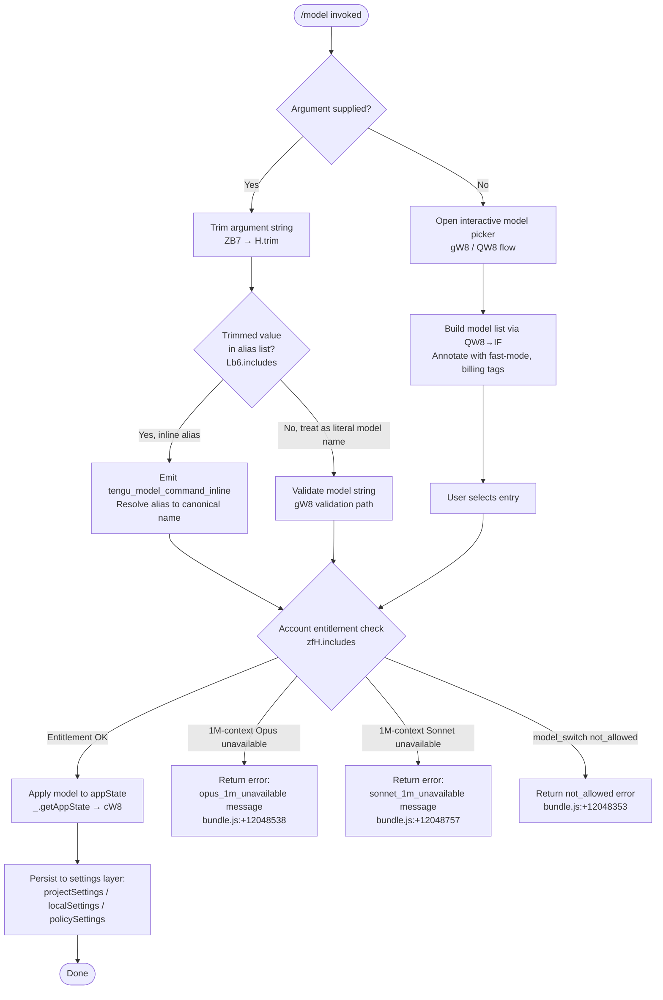

# `/model`

> Analysis basis: CC v2.1.146 bundle.js (AST extraction + Claude interpretation)
> Minimum version: v2.1.146

---

## Overview

The `/model` command allows users to switch the AI model used by Claude Code during a session. When invoked with a model name argument it validates the supplied name against known aliases and account entitlements, then applies the change to app state; when invoked without arguments it opens an interactive picker that lists all available models with contextual annotations such as fast-mode status and billing notes.

---

## Registration

| Field | Value |
|---|---|
| type | `local` |
| name | `model` |
| description | `Set the AI model for Claude Code` |
| argumentHint | `<model>` |
| supportsNonInteractive | `true` |
| module_id | `ry1` |
| load_inline | `true` |
| loc_byte | `12092273` |
| loc_byte_end | `12092447` |
| loc_line | `9951` |
| arbor_handler.name | `ZB7` |
| arbor_handler.fqn | `claude-2.1.146::ZB7` |
| arbor_handler.kind | `AsyncFunction` |
| arbor_handler.resolution_path | `module_id` |
| arbor_handler.n_hits | `0` |

Analysis basis: CC v2.1.146 bundle.js:+12092273

---

## Input Branching

The command exhibits four distinct top-level branches based on whether an argument is provided, whether the argument is an inline shorthand alias, and whether the chosen model requires an account-entitlement check.



Analysis basis: CC v2.1.146 bundle.js:+12084671, +12084687, +12084774, +12048322, +12048338

---

## Behavioral Spec

### 1. Handler Entry Point (`ZB7`)

The top-level async handler (Arbor-resolved as `ZB7`) is the authoritative entry point for the `/model` command.

```
async function modelCommandHandler(args, context):
    rawInput = args.trim()                         // H.trim @ +12084671

    if rawInput is in shortAliasSet:               // Lb6.includes @ +12084687
        emit telemetry("tengu_model_command_inline") // @ +12084829
        resolvedModel = resolveAlias(rawInput)
    else:
        resolvedModel = rawInput

    appState = context.getAppState()               // _.getAppState @ +12084710

    if resolvedModel is in extendedContextBlockList:  // zfH.includes @ +12084774
        return entitlementError(resolvedModel)

    result = applyModelToState(resolvedModel, appState)  // cW8 @ +12084754
    return result
```

Analysis basis: CC v2.1.146 bundle.js:+12084671

---

### 2. Short Alias Resolution

Several short alias tokens are recognised before any network or validation call. Known aliases found in literals:

| Alias token | Meaning |
|---|---|
| `sonnet` | Maps to current Sonnet generation (bundle.js:+2165107) |
| `haiku` | Maps to current Haiku generation (bundle.js:+2165146) |
| `opus` | Maps to current Opus generation (bundle.js:+2165185) |
| `best` | Maps to the highest-capability model available (bundle.js:+2165222) |
| `opusplan` | Opus in plan mode, else Sonnet (bundle.js:+2163641) |
| `[1m]` | Extended 1M-token context variant suffix (bundle.js:+2165092) |

```
function resolveAlias(token):
    switch token:
        case "sonnet"    → return canonicalSonnetId
        case "haiku"     → return canonicalHaikuId
        case "opus"      → return canonicalOpusId
        case "best"      → return bestAvailableModel
        case "opusplan"  → return opusPlanModeModel   // "Opus Plan" @ +2163932
        default          → return token               // pass through
```

Analysis basis: CC v2.1.146 bundle.js:+2165107, +2165146, +2165185, +2165222, +2163624

---

### 3. Interactive Model Picker (`QW8` / `IF` sub-flow)

When no argument is provided, the picker is built by `QW8` calling `IF` to enumerate available models, then rendered through `_y1` / `CU7`.

```
async function buildModelPicker(appState):
    modelList = enumerateAvailableModels()    // IF @ +12048322

    for each model in modelList:
        entry = {
            id:    model.id,
            label: formatLabel(model),       // xU7 / uU7 @ +12048468, +12048685
        }

        // Annotate fast-mode status
        if model supports fast mode AND fast mode is active:
            entry.label += " · Fast mode ON"   // literal @ +12049462

        // Annotate billing impact
        if model draws from usage credits:
            entry.label += " · Draws from usage credits"  // literal @ +12049513

        // Annotate fast-mode disabled
        if fast mode is explicitly off:
            entry.label += " · Fast mode OFF"  // literal @ +12049559

        modelList.append(entry)

    // Validate model name is non-empty before offering
    // "Model name cannot be empty" guard @ +12046573

    selectedModel = await promptUserSelection(modelList)  // _y1 @ +12048939
    return selectedModel
```

Analysis basis: CC v2.1.146 bundle.js:+12048322, +12048939, +12049462, +12046573

---

### 4. Model Validation (`gW8`)

Before applying any model—whether entered inline or selected via the picker—a validation step is performed.

```
async function validateModel(modelName, appState):
    trimmed = modelName.trim()                   // gW8→H.trim @ +12046536

    if trimmed is empty:
        return error("Model name cannot be empty")  // @ +12046573

    // Probe model against Anthropic API using a minimal test message
    // Uses "Hi" as probe text and "ephemeral" cache control
    // literals @ +12046981, +12047006

    try:
        response = await sendProbeRequest(trimmed)  // bb → Jm @ +12046862
        emit telemetry("model_validation")          // @ +12046912

    catch AuthError:
        return "Authentication failed. Please check your API credentials."
        // @ +12047272

    catch NetworkError:
        return "Network error. Please check your internet connection."
        // @ +12047374

    catch NotFoundError where error.type == "not_found_error"
                          AND error.message contains "model:":
        return error("invalid_model")   // @ +12049011

    catch other:
        emit telemetry("validate_exception")  // @ +12049119
        return error

    return success
```

Analysis basis: CC v2.1.146 bundle.js:+12046536, +12046912, +12047272, +12047493

---

### 5. Entitlement Gate — Extended Context (1M)

Two specific 1M-context model variants have account-entitlement guards:

```
function entitlementError(modelId):
    if modelId matches opus-with-1M-context pattern:
        // "opus_1m_unavailable" @ +12048500
        return {
            code: "opus_1m_unavailable",
            message: "Opus with 1M context is not available for your account. " +
                     "Learn more: https://code.claude.com/docs/en/model-config#extended-context-with-1m"
            // @ +12048538
        }

    if modelId matches sonnet-1M-context pattern:
        // "sonnet_1m_unavailable" @ +12048717
        // alias strings: "sonnet[1m]" @ +12050194, "sonnet-4-6[1m]" @ +12050220
        return {
            code: "sonnet_1m_unavailable",
            message: "Sonnet 4.6 with 1M context is not available for your account. " +
                     "Learn more: https://code.claude.com/docs/en/model-config#extended-context-with-1m"
            // @ +12048757
        }
```

Analysis basis: CC v2.1.146 bundle.js:+12048500, +12048538, +12048717, +12048757

---

### 6. Applying the Model to State (`cW8` / `wR`)

Once validated and entitlement-checked, the model is written to app state and persisted to the appropriate settings layer.

```
function applyModelToState(modelName, appState):
    // Determine settings layer precedence
    // Layers checked in order: policySettings, projectSettings,
    // localSettings, default  (literals @ +12049763, +12049719, +12049742)

    if policySettings lock model:
        display("Managed settings")   // literal @ +12049865
        return  // model change is blocked by policy

    // Write to local or project settings
    settingsLayer = determineWritableLayer(appState)
    settingsLayer.model = modelName   // key "model" @ +12049703

    // Settings file paths used during persist:
    //   .claude/settings.json        @ +1199546, +1199556
    //   .claude/settings.local.json  @ +1199618

    updateAppStateModel(appState, modelName)  // wR @ +12049345 via _y1
```

Analysis basis: CC v2.1.146 bundle.js:+12084754, +12049703, +12049763, +1199546

---

### 7. Known Canonical Model Identifiers

The following model ID strings appear as constants in the implementation:

| Model string | Source byte |
|---|---|
| `claude-opus-4-0` | +2906776 |
| `claude-opus-4-1` | +2906969 |
| `claude-opus-4-5` | +2906992 |
| `claude-opus-4-6` | +2906992 (also `opus-4-6` @ +2151797) |
| `claude-opus-4-7` | (`opus-4-7` @ +2151851) |
| `claude-sonnet-4-0` | +2906799 |
| `claude-sonnet-4-5` | +2907063 |
| `claude-sonnet-4-6` | +2907088 (also `sonnet-4-6` @ +10575143) |
| `claude-haiku-4-5` | +2907113 |

Analysis basis: CC v2.1.146 bundle.js:+2906776, +2907088, +2151797

---

### 8. Subscription / Billing Tier Checks

The model availability logic inspects account tier constants before presenting or confirming a model:

| Tier constant | Source byte |
|---|---|
| `max` | +2934577 |
| `team` | +2934648 |
| `default_claude_max_5x` | +2934663 |
| `enterprise` | +2934758 |
| `enterprise_usage_based` | +2934780 |

These are evaluated inside the model-list builder (`kF`, `eMH`, `YmH` sub-calls of `M2`) to determine which entries are presentable.

Analysis basis: CC v2.1.146 bundle.js:+2934577, +2934648, +2934758

---

## State & Side Effects

| Item | Detail |
|---|---|
| Telemetry: `tengu_model_command_inline` | Fired when the user supplies a short alias (e.g. `sonnet`, `opus`) as the inline argument (bundle.js:+12084829) |
| Telemetry: `tengu_feature_ok` | Fired on successful feature gate check (bundle.js:+955938) |
| Telemetry: `tengu_feature_bad` | Fired on failed feature gate check (bundle.js:+955996) |
| Telemetry: `tengu_prompt_cache_1h_config` | Fired when the 1-hour prompt cache configuration is active during the probe request (bundle.js:+12806676) |
| Telemetry: `tengu_api_success` | Fired when the validation probe request succeeds (bundle.js:+12847042) |
| appState changes | `model` field in app state is updated to the chosen canonical model string |
| Settings persistence | Writes to `.claude/settings.json` or `.claude/settings.local.json` depending on scope |
| Policy enforcement | If `policySettings` controls model, the change is blocked and "Managed settings" is displayed |
| Probe network request | A minimal (`"Hi"`, `ephemeral` cache control) request is sent to the Anthropic API to validate an unknown model name before accepting it |

---

## Version History

| Version | Change |
|---|---|
| v2.1.146 | Initial analysis |

---

## Common Mistakes

1. **Supplying a partial model name without a recognised alias**: model names that do not match any alias token and are not valid Anthropic model IDs will be rejected at the validation probe stage with an `invalid_model` error. Use a full canonical ID (e.g. `claude-sonnet-4-6`) or a known alias (`sonnet`).
2. **Expecting 1M-context variants to work on all account tiers**: `opus[1m]` and `sonnet[1m]` / `sonnet-4-6[1m]` are gated by account entitlement. Attempting to set them on an ineligible account returns `opus_1m_unavailable` or `sonnet_1m_unavailable`.
3. **Attempting to change the model under policy management**: when an organisation has locked the model via `policySettings`, `/model` will display "Managed settings" and silently decline to write. The command does not error — it just does not persist.
4. **Assuming non-interactive mode skips validation**: `supportsNonInteractive: true` means the command can be scripted, but the same entitlement and validation checks still execute; a bad model name will still produce an error exit.
5. **Confusing the `opusplan` alias**: `opusplan` selects Opus only when the session is in plan mode; otherwise it falls back to Sonnet. Do not use it as a synonym for plain `opus`.

---

## Appendix — Identifier Mapping

> For bundle debugging only. Identifiers change across versions.

| Identifier | Role |
|---|---|
| `ZB7` | Top-level async handler for `/model` (Arbor-resolved entry point) |
| `H` | Input argument variable / string helper (trim, toLowerCase, etc.) |
| `_` | App-state / utility accessor (getAppState, toLowerCase, etc.) |
| `cW8` | Apply-model-to-state function; writes resolved model into app state |
| `wR` | Settings-persistence coordinator called by `cW8` |
| `p46` | Sub-helper within settings persistence (calls `kJ`, `rq`) |
| `kJ` | Settings key resolver |
| `rq` | Model name normaliser / string transformation pipeline |
| `M2` | Model metadata builder; assembles model entry with tier/entitlement fields |
| `ZA` | Model attribute helper (ID, display name) |
| `kF` | Tier-check helper for `max` plan |
| `eMH` | Tier-check helper for `team` / `default_claude_max_5x` plans |
| `YmH` | Tier-check helper for `enterprise` / `enterprise_usage_based` plans |
| `jv` | Model display-string composer |
| `cP` | Model capability / context-window properties helper |
| `z3` | Utility: checks `firstParty` provider flag |
| `hA` | Provider-type classifier (anthropicAws, gateway, bedrock, etc.) |
| `pM` | Model presenter / formatter |
| `Jv` | Additional display-string variant builder |
| `c` | Feature-gate check function (emits `tengu_feature_ok` / `tengu_feature_bad`) |
| `QW8` | Picker orchestrator: coordinates `IF`, `_y1`, `uH`, `xU7`, `uU7`, `bU7`, `gW8`, `ZH` |
| `IF` | Available-model enumerator (builds list with annotations) |
| `A` | Iteration variable / array in picker loop |
| `f` | Sub-helper in list formatting (padEnd, toLowerCase) |
| `M` | MCP server / connection manager referenced during picker build |
| `_kH` | MCP connection initiator (stdio, sse, http, ws-ide transport types) |
| `z4K` | MCP update applier (`applyMcpUpdate`, cleanup) |
| `L` | Async task queue helper |
| `N` | Model name formatter (toUpperCase, trim, display helper) |
| `$` | Helper calling `zS1` |
| `_O5` | MCP client enumeration helper |
| `K` | List/array accumulator in picker |
| `q` | Filter / set helper in picker |
| `Vg6` | Validation entry-point helper (calls `e_`) |
| `e_` | Inner validation routine |
| `$mH` | Model-ID inclusion checker (`cJ4.includes`) |
| `V_9` | Model index lookup helper |
| `lJ4` | Alias/prefix check helper |
| `T9H` | Provider-tier gate checker |
| `nJ4` | Prefix-check helper for `claude-` model strings |
| `Z_9` | `startsWith` guard for model string patterns |
| `uH` | Usage-credits / billing annotation helper (emits `tengu_feature_ok/bad`) |
| `xU7` | Fast-mode-ON annotation builder |
| `NHH` | Model status classifier (out_of_credits, org_level_disabled, etc.) |
| `V9H` | Model availability status formatter |
| `gJq` | Status code resolver |
| `uU7` | Fast-mode-OFF annotation builder |
| `RKH` | Alternate model status classifier |
| `bU7` | Extended-context (`[1m]`) guard check |
| `_y1` | Interactive picker renderer (bold labels, wR call, NK, ZD, RjH, CU7 sub-calls) |
| `bH` | Feature-check wrapper used inside picker |
| `NK` | Display-name formatter for picker entries |
| `mH` | String conversion helper (wraps `String()`) |
| `aMH` | Additional model annotation helper |
| `ZD` | Picker entry decorator (fast-mode ON/OFF, credits annotation) |
| `Rl` | Render helper for model entry lines |
| `RjH` | Billing/credits annotation builder (`sonnet-4-6` fast-mode note) |
| `yJ` | Model metadata accessor used by `RjH` |
| `ET` | Model availability status helper |
| `CU7` | Settings-source display builder (projectSettings, localSettings, policySettings) |
| `F2H` | File path builder for settings display |
| `x8` | Settings file-path formatter |
| `MC` | Settings path joiner (`.claude/settings.json`) |
| `Cl` | Settings scope resolver |
| `gW8` | Model validation orchestrator (trim, empty check, probe request, error handling) |
| `bb` | Probe API request executor (fetch, hashing, token management) |
| `Jm` | API HTTP request builder (headers, auth, User-Agent, session IDs) |
| `P` | Response stream reader |
| `fGH` | Temperature / request-parameter helper |
| `T` | Transport helper / model ID set |
| `Ka7` | Request cache finder |
| `Hr_` | SHA-256 request hasher |
| `eQ6` | Response parser / error extractor |
| `ua6` | Error display helper |
| `kVH` | Cache-control / context-window helper (`repl_main_thread*`, `1h` TTL) |
| `tE` | Token-budget helper |
| `I` | Away-summary / rate-limit side-effect manager |
| `yU1` | Post-request cleanup helper |
| `lP` | String replacement utility |
| `Dr6` | Request decoration helper (temperature, model-specific params) |
| `f2` | Message-map helper |
| `TOH` | Tool-result handler |
| `z5H` | Timing / duration helper |
| `jZH` | Cache write helper (`n3L`, `SH`) |
| `zQ` | Cache read helper (`l3L`, `SH`) |
| `i66` | Post-request metrics recorder |
| `SU7` | Model-switch confirmation renderer |
| `RU7` | Confirmed-model display builder (toLowerCase, includes, pM) |
| `ZH` | String-conversion wrapper (wraps `String()`) |

---

Note: index built via Arbor fallback; some signals (telemetry, literals) may be missing — see arbor-fallback.js.