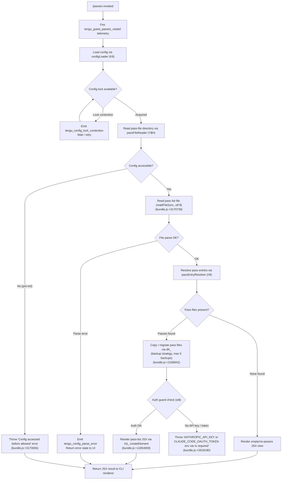

# `/passes`

> Analysis basis: CC v2.1.146 bundle.js (AST extraction + Claude interpretation)
> Minimum version: v2.1.146

---

## Overview

The `/passes` command allows users to share a free week of Claude Code with friends via "guest passes." When invoked, it renders a JSX-based UI component that displays guest pass information and sharing options. The command fires a dedicated telemetry event (`tengu_guest_passes_visited`) on execution and delegates the primary display logic to an async handler (`au7`) that orchestrates config access, pass-file management, and a React element render.

---

## Registration

| Field | Value |
|---|---|
| type | `local-jsx` |
| name | `passes` |
| description | `Share a free week of Claude Code with friends` |
| loc_byte | `11854787` |
| loc_byte_end | `11855109` |
| loc_line | `9706` |
| isHidden | `null` (not hidden) |
| module_id | `jv1` |
| load_inline | `true` |
| arbor_handler.name | `au7` |
| arbor_handler.fqn | `claude-2.1.146::au7` |
| arbor_handler.kind | `AsyncFunction` |
| arbor_handler.resolution_path | `module_id` |
| arbor_handler.n_hits | `2` |

Analysis basis: CC v2.1.146 bundle.js:+11854787

---

## Input Branching

The command has 3+ distinct execution paths based on config state, file-system pass availability, and pass-file integrity, so a Mermaid flowchart is used.



---

## Behavioral Spec

### 1. Command Entry — async handler (`au7`)

Analysis basis: CC v2.1.146 bundle.js:+11854470

```
async function passesCommandHandler(context):
    fire telemetry("tengu_guest_passes_visited")       // bundle.js:+11854610

    config = await loadConfig(context)                  // configLoader (K8)
    passStore = await readPassFiles(config)              // passFileReader (Y$H)

    element = createElement(PassesComponent, {
        config: config,
        passes: passStore
    })                                                   // Xd_.createElement, bundle.js:+11854659

    return element
```

### 2. Config Loading — `configLoader` (`K8`)

Analysis basis: CC v2.1.146 bundle.js:+3165714

```
function loadConfig(context):
    acquireLock()                                        // dK_, bundle.js:+3165714
    if lockTookTooLong:
        emit telemetry("tengu_config_lock_contention")  // bundle.js:+3168712
        log warning("Lock acquisition took longer than expected ...")
                                                         // bundle.js:+3168623

    configData = readConfigFromDisk()                    // L.statSync, L.readdirStringSync
    if configData.missingAuth and cacheHasAuth:
        emit telemetry("tengu_config_auth_loss_prevented") // bundle.js:+3169191
        log error("saveConfigWithLock: re-read config is missing auth ...")
                                                         // bundle.js:+3169039
        abort write

    applyBackupStrategy(configData, maxBackups=5)        // bundle.js:+3169642
        // backup files identified by ".backup." infix   // bundle.js:+3169509

    return configData
```

Configuration status values recognised at runtime (bundle.js:+3166353–3166580):

| Status string | Meaning |
|---|---|
| `"unknown"` | Status not yet determined |
| `"local"` | Locally installed |
| `"migrated"` | Migrated from earlier install |
| `"native"` | Natively installed |
| `"installed"` | Installed via package manager |
| `"disabled"` | Feature disabled |
| `"enabled"` | Feature enabled |
| `"no_permissions"` | Permissions not granted |
| `"not_configured"` | Not yet configured |
| `"global"` | Global-scope configuration |

### 3. Pass-File Reader — `passFileReader` (`Y$H`)

Analysis basis: CC v2.1.146 bundle.js:+3170650

```
function readPassFiles(config):
    if config.notYetAllowed:
        throw Error("Config accessed before allowed.")  // bundle.js:+3170656

    rawText = fs.readFileSync(passFilePath, "utf-8")    // bundle.js:+3170739
    parsed  = JSON.parse(rawText)                       // via jsonParser (g6), bundle.js:+182358

    if parsed has error:
        emit telemetry("tengu_config_parse_error")      // bundle.js:+3171293
        return errorState

    entries = resolvePassEntries(parsed)                // passEntryResolver (rI9)

    for each entry in entries:
        destDir = path.join(backupsDir, entry.basename) // "backups" dir, bundle.js:+3170224
        fs.mkdirSync(destDir, recursive)
        fs.copyFileSync(entry.source, destDir)
        if error.code == "ENOENT":                      // bundle.js:+3170886
            handle missing file gracefully

    return entries
```

### 4. Pass Entry Resolver — `passEntryResolver` (`rI9`)

Analysis basis: CC v2.1.146 bundle.js:+3170257

```
function resolvePassEntries(parsed):
    baseDir  = configDirFor(parsed)                     // cK_ -> path.join + i8
    entries  = []

    for each filename in fs.readdirStringSync(baseDir): // bundle.js:+3170297
        if not filename.startsWith(expectedPrefix):
            continue
        fullPath = path.join(baseDir, filename)
        parentDir = path.dirname(fullPath)

        if fullPath.startsWith(allowedRoot):             // $.startsWith, bundle.js:+3170473
            stat = fs.statSync(fullPath)                 // bundle.js:+3170573
            entries.push({
                path:     fullPath,
                basename: path.basename(fullPath),       // bundle.js:+3170264
                stat:     stat
            })

    return entries
```

### 5. Auth Guard — `authGuard` (`w$`)

Analysis basis: CC v2.1.146 bundle.js:+2917759

```
function checkAuth(config):
    if env["ANTHROPIC_API_KEY"] is set:                 // bundle.js:+2917759
        return { kind: "firstParty", key: env["ANTHROPIC_API_KEY"] }

    if config.apiKeyHelper is set:                      // bundle.js:+2917853
        return { kind: "apiKeyHelper", helper: config.apiKeyHelper }

    if authMode == "none":                              // bundle.js:+2917892
        throw Error(
            "ANTHROPIC_API_KEY or CLAUDE_CODE_OAUTH_TOKEN env var is required"
                                                        // bundle.js:+2918180
        )

    return resolvedAuth
```

### 6. JSX Render

Analysis basis: CC v2.1.146 bundle.js:+11854659

```
function renderPassesUI(passes, config):
    // Uses React-compatible createElement (Xd_.createElement)
    // Returns a JSX element consumed by the CLI's local-jsx renderer
    return Xd_.createElement(PassesComponent, {
        passes: passes,
        config: config
    })
```

The `local-jsx` command type means the returned element is rendered inline in the terminal UI, not piped to the agent prompt pipeline.

---

## State & Side Effects

| Item | Detail |
|---|---|
| Telemetry — `tengu_guest_passes_visited` | Fired once per invocation of `/passes` (bundle.js:+11854610) |
| Telemetry — `tengu_config_parse_error` | Fired when pass-list JSON cannot be parsed (bundle.js:+3171293) |
| Telemetry — `tengu_config_lock_contention` | Fired when config lock acquisition is slow (bundle.js:+3168712) |
| Telemetry — `tengu_config_stale_write` | Fired when a stale config write is detected (bundle.js:+3168848) |
| Telemetry — `tengu_config_auth_loss_prevented` | Fired when a write would erase cached auth (bundle.js:+3169191) |
| Telemetry — `tengu_bg_dispatch_sigkill_escalate` | Fired if a background-session process must be force-killed (bundle.js:+15060413) |
| Telemetry — `tengu_bg_spare_enable` | Fired when the spare background worker pool is enabled (bundle.js:+15061631) |
| Telemetry — `tengu_bg_spare_claim` | Fired when a spare worker is successfully claimed (bundle.js:+15061752) |
| Telemetry — `tengu_bg_spare_spawn` | Fired when a new spare worker is spawned (bundle.js:+15060190) |
| Telemetry — `tengu_bg_spare_claim_fail` | Fired when spare-worker claim fails (bundle.js:+15062015) |
| Telemetry — `tengu_bg_sendclaim_failed` | Fired on failed background send-claim (bundle.js:+15041598) |
| Telemetry — `tengu_bg_low_mem_mb` | Fired on low-memory condition in background worker (bundle.js:+12414219) |
| Telemetry — `tengu_bg_dispatch_low_mem` | Fired when low-memory causes dispatch deferral (bundle.js:+15060992) |
| Telemetry — `tengu_daemon_idle_exit` | Fired when daemon exits due to idle timeout (bundle.js:+15079597) |
| Telemetry — `tengu_feature_ok` | Fired on successful feature flag check (bundle.js:+955938) |
| Telemetry — `tengu_feature_bad` | Fired on failed feature flag check (bundle.js:+955996) |
| File I/O | Reads pass-list JSON; copies pass files into a `backups/` subdirectory inside the config dir |
| Config lock | Acquires an exclusive file lock before reading/writing config; contention is logged and telemetered |
| Auth-loss guard | Refuses config writes that would silently erase authentication credentials (GH #3117) |
| Maximum config backups | 5 (bundle.js:+3169642) |
| appState changes | None directly observed in depth-2 traversal |
| Sound | None observed |
| Hook registration | `c9` calls `c_A.register` (bundle.js:+57267); used for internal watcher registration during config watch setup |

---

## Version History

| Version | Change |
|---|---|
| v2.1.146 | Initial analysis |

---

## Common Mistakes

1. **Invoking `/passes` before authentication is configured** — if neither `ANTHROPIC_API_KEY` nor `CLAUDE_CODE_OAUTH_TOKEN` is set, the auth guard throws an error before the pass UI renders. Ensure at least one auth mechanism is in place.
2. **Corrupted pass-list JSON** — if the pass-file JSON is malformed, the command emits `tengu_config_parse_error` and returns an error state to the UI rather than crashing; users may see an empty or error-state UI rather than a useful message.
3. **Config-lock contention from parallel Claude instances** — running multiple Claude Code instances simultaneously can trigger `tengu_config_lock_contention` and delay the passes UI from loading. Close other sessions before invoking `/passes` if you observe hangs.
4. **Missing `backups/` directory permissions** — the command creates a `backups/` subdirectory inside the config folder. If the config directory is read-only, `mkdirSync` will fail with `EEXIST` or permission errors (bundle.js:+3171507).
5. **Assuming `/passes` sends a prompt** — the registration type is `local-jsx`, not `prompt`. The command renders a JSX component in the terminal UI; it does not invoke the AI agent or send any message to the model.

---

## Appendix — Identifier Mapping

> For bundle debugging only. Identifiers change across versions.

| Identifier | Role |
|---|---|
| `au7` | Async handler for `/passes` command (entry point) |
| `m6` | Config file watcher / change-propagation helper |
| `Q6` | Config directory path resolver |
| `pK_` | Config property accessor / merger |
| `Y$H` | Pass-file reader and backup orchestrator |
| `q` | Filesystem utility wrapper (readFileSync, statSync, copyFileSync, mkdirSync, readdirStringSync) |
| `g6` | JSON parser wrapper |
| `AC` | String prefix/slice utility (startsWith / slice on config keys) |
| `H` | Random / timer utility (Math.random, setTimeout) |
| `_` | Filesystem extended helper (statSync, readdirStringSync) |
| `L8` | Logger / output helper |
| `rI9` | Pass entry resolver (directory scan + stat) |
| `cK_` | Config directory path builder (path.join + base dir lookup) |
| `M` | MCP server / module registry lookup |
| `$` | Subprocess / service registry |
| `N` | API request executor / network call dispatcher |
| `$wK` | Request serialiser / queue helper |
| `CH` | JSON.stringify wrapper |
| `O4` | Response text formatter / redactor |
| `NRH` | Response post-processor |
| `YwK` | Streaming response handler (Buffer.byteLength, rk6, zwK) |
| `SH` | Shell / process spawn helper |
| `n_` | Error normaliser (Error + String coercion) |
| `mH` | String coercion utility |
| `X1` | Traffic-filter helper ("essential-traffic") |
| `PuK` | Request queue manager (shift / push on Db6) |
| `c` | State container / app-context accessor |
| `w` | Background-session process manager |
| `A` | Process registry map (get, set, values, toLowerCase) |
| `C` | Worker process wrapper (spawn, kill, write) |
| `uH` | Feature-ok signal emitter |
| `bH` | Feature-bad signal emitter |
| `rE6` | Memory pressure checker (macOS freemem, 1024 MB threshold) |
| `x` | Idle-timeout controller for daemon (clearTimeout, setTimeout) |
| `N6` | Background-session dispatcher / router |
| `AHA` | Daemon connection handler (dU.claim, Ev8.connect, f.on/once/write) |
| `$HA` | Background session lifecycle manager (spawn, retire, rm, unlink) |
| `L` | Pending-set tracker (q.add / f.finally / q.delete) |
| `D` | Session recycler / restart loop |
| `S` | Settled-session disposer |
| `cB4` | Config file watcher (Sa6.watchFile / unwatchFile) |
| `zn` | Config change debouncer |
| `c9` | Hook / watcher registrar (c_A.register) |
| `j28` | OAuth / auth-init helper |
| `y5` | Auth bootstrap orchestrator |
| `ID` | Auth-resolver dispatcher |
| `cK` | Auth credential builder |
| `Nv` | Token/key validation helper |
| `wO` | First-party auth handler |
| `wJ` | Auth-flow state machine |
| `w$` | Auth guard (API key / OAuth token check) |
| `zqH` | Auth error formatter |
| `K8` | Config loader with lock acquisition |
| `dK_` | Config write-with-backup orchestrator |
| `jA9` | Config schema merger (Object.assign) |
| `os8` | Config defaults provider |
| `if6` | Config integrity validator |
| `Z` | Config entry filter (startsWith check) |
| `X` | MCP SDK session handler (Promise.all, SH, n_) |
| `Yv8` | MCP transport factory |
| `V` | Config entry slice buffer |
| `hq6` | Atomic file writer (randomBytes temp file, fchmodSync, fsyncSync, renameSync) |
| `O` | Symlink / stat resolver (lstatSync, isSymbolicLink) |
| `J8` | File-write error handler |
| `f` | Socket / stream handle (A.close, q.close) |
| `bUH` | Config load-time feature-flag reader |
| `iI9` | Config entries enumerator (Object.entries) |
| `xUH` | Config timestamp recorder (Date.now) |
| `QK_` | Config path validator (hq6 caller, NI + CH) |