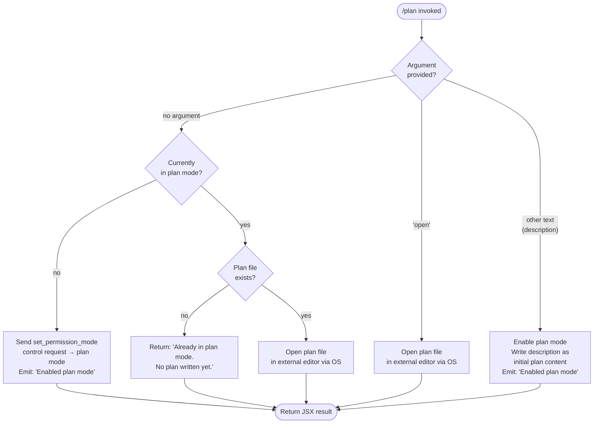

# `/plan`

> Analysis basis: CC v2.1.142 bundle.js (AST extraction + Claude interpretation)
> Minimum version: v2.1.142

---

## Overview

The `/plan` command enables "plan mode" for the current Claude Code session, or opens the existing session plan file for review and editing in an external editor. When invoked without arguments or with a description, the command transitions the session permission mode to a read-only planning state; when invoked with the `open` argument, it launches the session's plan document in the user's configured editor.

---

## Registration

| Field | Value |
|---|---|
| type | `local-jsx` |
| name | `plan` |
| description | `Enable plan mode or view the current session plan` |
| argumentHint | `[open\|<description>]` |
| module_id | `LXq` |
| load_inline | `true` |
| loc_byte | `11380742` |
| loc_byte_end | `11380941` |
| loc_line | `6977` |
| arbor_handler.name | `RV7` |
| arbor_handler.fqn | `claude-2.1.142::RV7` |
| arbor_handler.kind | `AsyncFunction` |
| arbor_handler.resolution_path | `module_id` |
| arbor_handler.n_hits | `0` |

Analysis basis: CC v2.1.142 bundle.js:+11380742

---

## Input Branching

The handler implements four distinct input paths based on the argument string and current session state, requiring a Mermaid flowchart:



Analysis basis: CC v2.1.142 bundle.js:+11379617 – +11380520

---

## Behavioral Spec

### Handler Entry Point (`RV7`)

The primary handler is the async function `RV7`, resolved via module `LXq` through Arbor's `module_id` resolution path.

```
async function planCommandHandler(args, sessionContext):
    rawArg = args.trim()                          // +11380123

    currentMode = getPermissionMode(sessionContext)
    isInPlanMode = (currentMode === "plan")

    if rawArg === "open":                         // +11380142
        openPlanInEditor(sessionContext)
        return renderResult()

    if rawArg === "" or rawArg is absent:
        if isInPlanMode:
            planFile = resolvePlanFilePath(sessionContext)
            if planFile exists:
                openPlanInEditor(sessionContext)
            else:
                return renderMessage("Already in plan mode. No plan written yet.")  // +11380301
        else:
            enablePlanMode(sessionContext)
            return renderMessage("Enabled plan mode")                               // +11379893

    else:  // rawArg is a non-empty description string
        enablePlanMode(sessionContext)
        writePlanContent(rawArg, sessionContext)
        return renderMessage("Enabled plan mode")                                   // +11379893
```

Analysis basis: CC v2.1.142 bundle.js:+11379617

---

### Enabling Plan Mode (`enablePlanMode`)

Sends a `set_permission_mode` control request through the session message channel. If the session is already in plan mode, the command short-circuits with the "Already in plan mode." message rather than re-sending the control request.

```
function enablePlanMode(sessionContext):
    sessionContext.sendControlRequest({         // +11379825
        type: "set_permission_mode",           // +11379855
        mode: "plan"
    })
    // Side effect: session permission mode transitions
    // to read-only planning state
```

Analysis basis: CC v2.1.142 bundle.js:+11379825

---

### Plan-Mode Already-Active Guard

When the session is already in plan mode and no `open` argument is provided:

```
function handleAlreadyInPlanMode(sessionContext):
    planFilePath = resolvePlanFilePath(sessionContext)

    if planFilePath exists on disk:
        openPlanInEditor(sessionContext)           // delegates to OS/editor subsystem
    else:
        return staticMessage(
            "Already in plan mode. No plan written yet."  // +11380301
        )
```

Analysis basis: CC v2.1.142 bundle.js:+11380205 – +11380301

---

### Opening the Plan File in an External Editor (`openPlanInEditor` / `OS`)

The editor-launch subsystem (`OS`) pauses the Ink rendering engine, suspends stdin, spawns the external process synchronously, then resumes rendering on return.

```
function openPlanInEditor(sessionContext):
    editorInfo = resolveEditorBinary(sessionContext)   // examines E4 map, statSync  +10575376
    if editorInfo is null:
        throw Error("Ink instance not found - cannot pause rendering")  // +10575417

    inkInstance = getInkInstance()
    inkInstance.enterAlternateScreen()                 // +10575570
    inkInstance.pause()                                // +10575600
    inkInstance.suspendStdin()                         // +10575610

    planFilePath = buildPlanFilePath(sessionContext)   // IW / XDH path joins      +11380259
    argv = buildEditorArgv(editorInfo, planFilePath)   // slice + split            +10575649

    result = spawnSync(editorBinary, argv, {           // +10575692
        stdio: "inherit"                               // +10575724
    })

    planContent = readFileSync(planFilePath, "utf-8")  // +10575994  +12137190

    inkInstance.exitAlternateScreen()                  // +10576072
    inkInstance.resumeStdin()                          // +10576101
    inkInstance.resume()                               // +10576117

    return planContent
```

Analysis basis: CC v2.1.142 bundle.js:+11380402 – +10576117

---

### Plan File Path Resolution (`IW` / `XDH`)

The plan file path is constructed by joining the session's working directory with a derived filename. The path cache (`q.get` / `q.set`) is consulted first to avoid redundant filesystem operations.

```
function resolvePlanFilePath(sessionContext):
    cached = pathCache.get(sessionContext.id)        // +12136742
    if cached:
        return cached

    baseDir = getSessionWorkDir(sessionContext)      // V6  +12137037
    segments = buildPathSegments(baseDir)            // ep.join  +12137056
    resolved = maybeMapToAlternateMode(segments)     // SO  +12137064
    pathCache.set(sessionContext.id, resolved)       // +12136888
    return resolved
```

Analysis basis: CC v2.1.142 bundle.js:+11380259

---

### Permission-Mode Control Request (`sendControlRequest`)

The control request uses the string literal `"set_permission_mode"` as the request type. The handler also reads back permission settings from `policySettings`, `userSettings`, `localSettings`, and `flagSettings` layers (via `XR` / `V8`) to validate whether the mode transition is permitted.

```
function validateAndSendModeRequest(sessionContext, mode):
    policyLayer   = sessionContext.settings["policySettings"]    // +1205547
    userLayer     = sessionContext.settings["userSettings"]       // +1205698
    localLayer    = sessionContext.settings["localSettings"]      // +1205745
    flagLayer     = sessionContext.settings["flagSettings"]       // +1205793

    if mode === "bypassPermissions":                              // +4021466
        if bypassPermissionsDisabled(policyLayer, flagLayer):
            log("Ignoring permission update: setMode 'bypassPermissions' rejected …")
            // +4021532
            return

    sessionContext.sendControlRequest({
        type: "set_permission_mode",                             // +11379855
        mode: mode
    })
```

Analysis basis: CC v2.1.142 bundle.js:+11379825 – +4021532

---

### Permission Rule Management (called from `Qf`)

The permission rule subsystem processes `addRules`, `replaceRules`, and `removeRules` operations on the `allow`, `deny`, and `alwaysAsk` rule sets, as well as `addDirectories` and `removeDirectories` for path-scoped permissions.

```
function applyPermissionRuleUpdate(operation, rules, sessionState):
    match operation:
        case "addRules":                          // +4021808
            for rule in rules:
                if rule.disposition === "allow":
                    sessionState.alwaysAllowRules.push(rule)   // +4021993 +4022001
                elif rule.disposition === "deny":
                    sessionState.alwaysDenyRules.push(rule)    // +4022033 +4022040
                else:
                    sessionState.alwaysAskRules.push(rule)     // +4022058

        case "replaceRules":                      // +4022156
            sessionState.alwaysAllowRules = rules.allow
            sessionState.alwaysDenyRules  = rules.deny

        case "removeRules":                       // +4022813
            sessionState.alwaysAllowRules = sessionState.alwaysAllowRules
                .filter(r => !rules.has(r))

        case "addDirectories":                    // +4022467
            for dir in rules:
                sessionState.allowedDirectories.push(dir)

        case "removeDirectories":                 // +4023197
            sessionState.allowedDirectories = sessionState.allowedDirectories
                .filter(d => !rules.has(d))
```

Analysis basis: CC v2.1.142 bundle.js:+4021808 – +4023197

---

### CCR Token and Session Marker

The literals `"ccr"` and `"plan"` appear in close proximity within the handler body, indicating the handler writes a session-type marker (role: `"ccr"`, value: `"plan"`) to internal session state when enabling plan mode.

```
function writeSessionMarker(sessionState):
    sessionState.markers.add({
        role:  "ccr",    // +11379668
        value: "plan"    // +11379682
    })
```

Analysis basis: CC v2.1.142 bundle.js:+11379668

---

### Transcript / Log Writing (`O7K` subsystem)

The `O7K` subsystem manages append-only transcript log files. It is invoked during plan mode activation to record the mode transition event.

```
function appendToTranscriptLog(sessionContext, entry):
    logDir  = path.dirname(sessionContext.transcriptPath)      // +200204
    logPath = path.join(logDir, derivedLogName)               // $6A  +200341

    if byteLength(entry) > rotationThreshold:                  // +200379
        rotateLogs(logPath)                                    // M6A  +200373

    ensureDir(logDir)                                          // $7K  +200438
    fs.appendFile(logPath, entry)                              // +199984

    trimOldLogFiles(logDir)                                    // M6A  +200373
```

Analysis basis: CC v2.1.142 bundle.js:+200196 – +200534

---

### Model Compatibility Check (`OmH`)

Before enabling plan mode, the handler verifies that the active model supports the plan workflow. Supported model families are checked against known prefixes and explicit model identifiers.

```
function isModelCompatibleWithPlanMode(modelId):
    if modelId.includes("claude-3-"):         return true    // +2897323
    if modelId === "claude-opus-4-0":         return true    // +2897341
    if modelId === "claude-opus-4-1":         return true    // +2897364
    if modelId === "claude-opus-4-5":         return true    // +2897387
    if modelId === "claude-sonnet-4-0":       return true    // +2897410
    if modelId === "claude-sonnet-4-5":       return true    // +2897435
    if modelId === "claude-haiku-4-5":        return true    // +2897460
    if modelId === "claude-opus-4-6":         return true    // +2897502
    if modelId === "claude-sonnet-4-6":       return true    // +2897525
    return false
```

Analysis basis: CC v2.1.142 bundle.js:+2897323 – +2897525

---

### JSX Rendering

The command is registered as `local-jsx` and renders its result via `iT.createElement` (Analysis basis: CC v2.1.142 bundle.js:+11380520). ANSI stripping is applied to output through the `g5` / `Bun.stripANSI` path before rendering to ensure clean display in non-ANSI terminals (Analysis basis: CC v2.1.142 bundle.js:+3708146).

---

## State & Side Effects

| Item | Detail |
|---|---|
| Telemetry | None detected in depth-2 traversal |
| Permission mode | Session permission mode set to `"plan"` via `set_permission_mode` control request (bundle.js:+11379855) |
| Plan marker | Session marker `{ role: "ccr", value: "plan" }` written to internal session state (bundle.js:+11379668) |
| Transcript log | Mode transition appended to session transcript log via `O7K` append subsystem (bundle.js:+200196) |
| File system | Plan file may be created or read under session working directory; log rotation (`M6A`) may rename/unlink `.txt` files (bundle.js:+199629) |
| Editor subprocess | `spawnSync` launched with `stdio: "inherit"` when `open` argument used or plan file already exists (bundle.js:+10575692) |
| Ink rendering | Ink instance paused / alternate screen entered during editor subprocess; resumed on return (bundle.js:+10575570) |
| Permission rules | `Qf` subsystem may mutate `alwaysAllowRules`, `alwaysDenyRules`, `alwaysAskRules`, allowed directories in session state (bundle.js:+4021808) |
| Path cache | Plan file path cached in `q` map keyed by session id (bundle.js:+12136742) |
| Sound | <!-- TODO: not found in depth-2 traversal; needs --depth 4 --> |

---

## Version History

| Version | Change |
|---|---|
| v2.1.142 | Initial analysis |

---

## Common Mistakes

1. **Invoking `/plan open` when no plan file exists yet** — the command will attempt to open a nonexistent file in the editor; the editor may create an empty file or error. Write a description first (e.g., `/plan implement OAuth flow`) to seed the plan content before opening.
2. **Assuming `/plan` always re-enables plan mode** — if the session is already in plan mode and a plan file exists, `/plan` (with no argument) opens the editor instead of resending the mode-activation control request. Use `/plan <description>` to append a new description even in an active plan-mode session.
3. **Using `/plan` in an IDE environment without a configured editor** — the `OS` subsystem resolves the editor binary via `cD`/`zx_`; if the `IDE` environment flag is set (bundle.js:+5200968) and no fallback editor is discoverable, the open operation will throw rather than silently no-op.
4. **Expecting `bypassPermissions` mode after `/plan`** — plan mode explicitly blocks bypass-permissions escalation; the guard at bundle.js:+4021532 logs a rejection and suppresses the mode change.
5. **Assuming immediate file persistence** — the transcript log append is buffered through the `O7K` / `$7K` subsystem with async flush; the plan marker may not be on disk if the process exits abruptly immediately after the command.

---

## Appendix — Identifier Mapping

> For bundle debugging only. Identifiers change across versions.

| Identifier | Role |
|---|---|
| `RV7` | Main async handler for `/plan` command (Arbor-resolved, module `LXq`) |
| `q` | File unlink / session marker set utility |
| `E$` | Session state accessor (reads current permission mode) |
| `xjH` | Internal state helper called by session state accessor |
| `wo` | Permission mode guard / check |
| `K` | Connection/channel map helper; also used for tab-padding display |
| `L` | Connection entry manager (add / delete / finally hooks) |
| `f` | Connection object (close, toLowerCase, push operations) |
| `A` | String/buffer utility (toLowerCase, lastIndexOf, slice, trim, set) |
| `Qf` | Permission rule manager (addRules, replaceRules, removeRules, addDirectories, removeDirectories) |
| `v` | Telemetry / logging event emitter |
| `f7K` | Logging subsystem initializer |
| `Zt_` | Logger configuration helper |
| `H` | General-purpose string variable (context-dependent) |
| `RH` | JSON serialization utility (wraps JSON.stringify) |
| `_` | Generic collection / string variable (context-dependent) |
| `H5` | Path/string fragment builder |
| `H6A` | Path map helper (H7K.map) |
| `BhH` | File write coordinator |
| `gHA` | Low-level write executor (H.write) |
| `O7K` | Transcript log append subsystem |
| `YhH` | Debounced flush scheduler (clearTimeout / setTimeout / setImmediate) |
| `i8H` | Log entry formatter (K6A, ojH.join, b8, V6) |
| `x6` | File existence / stat check utility |
| `Vv8` | Error-code classifier (wraps O8) |
| `$6A` | Log file path builder (ojH.join, V6) |
| `M6A` | Log rotation handler (stat, rename, unlink) |
| `$7K` | Log directory initializer and appender (mkdir, appendFile) |
| `C9` | Subscription / listener registry (fI8.add / delete, Object.assign) |
| `Df` | String escape normalizer (whK — replaceAll for backslashes/parens) |
| `whK` | Backslash/paren replaceAll helper |
| `pIH` | Permission-info builder (jR_, YE, uQ, pb, v) |
| `jR_` | Policy settings reader (XR, KG, um8) |
| `XR` | Policy settings extractor (V8, v) |
| `V8` | Settings layer reader (HC6, OB) |
| `KG` | Mode-disable flag checker (zR_, OmH, h1) |
| `zR_` | Disable-mode resolver (OA) |
| `OmH` | Model compatibility checker (I1, VA, bB) |
| `h1` | Additional settings flag reader (Ga, n1, QJ) |
| `um8` | Fallback policy reader (V8) |
| `YE` | Permission info field extractor |
| `uQ` | Permission entry enumerator (Object.entries, Qf, K.map) |
| `pb` | Permission rule collector (Object.entries, wO, MR_, v, Df, PAq) |
| `wO` | Rule formatter (jhK, ZE, PhK, H.substring, JhK) |
| `jhK` | Rule key formatter |
| `ZE` | Object.hasOwn wrapper |
| `PhK` | Rule value formatter |
| `JhK` | Rule value replaceAll sanitizer |
| `MR_` | Rule list builder (MAq, A.push, fR_, q.match) |
| `MAq` | Rule type classifier (YAq, DAq, wAq) |
| `fR_` | Rule path relativizer (uJ.includes, JO, OAq.relative, h6) |
| `PAq` | Allowed-tools cache manager (_f7, q.get, q.set, Qf) |
| `_f7` | Tool allowlist membership checker (wR.includes) |
| `M` | Message/conversation store (IvH, Peq, L.get, v, L.values, n_5) |
| `haH` | Plan-mode state reader (r4H, V6) |
| `r4H` | Raw mode-value accessor |
| `V6` | Promise-based async wrapper (JV) |
| `JV` | Core promise executor |
| `A2` | Editor-open orchestrator (IW, x6, $8, NH) |
| `IW` | Plan file path builder with mode mapping (XDH, V6, ep.join, SO) |
| `XDH` | Cached plan path resolver (V6, r4H, q.get, SO, mA_, lmH, Xi6, ep.join, x6, q.set) |
| `mA_` | Filename split helper (H.split) |
| `lmH` | Path segment formatter (I76) |
| `Xi6` | Path segment formatter variant (I76) |
| `$8` | Error code extractor (O8) |
| `O8` | Raw error property reader |
| `NH` | Read-file-with-fallback utility (k_, bH, $q, JvK, hRH.push, Yc.logError) |
| `k_` | Error constructor wrapper |
| `bH` | String coercion utility |
| `$q` | File read retry coordinator (NMA) |
| `NMA` | File content normalizer (bH) |
| `JvK` | Read-history queue manager (XS6.shift, XS6.push) |
| `OS` | External editor launcher (Ink pause/resume, spawnSync) |
| `mk` | Editor binary resolver (IJ, AJ7) |
| `IJ` | Editor binary validator |
| `KJ7` | Editor selection logic (zx_) |
| `zx_` | Editor candidate finder (Gw8.basename, u1, tw7.find, _.includes) |
| `u1` | Path index/slice helper |
| `cD` | IDE-environment editor resolver (u1, CI.basename, TEH) |
| `oE1` | Ink process output handler (gcH, g5) |
| `gcH` | Ink data-event listener (K.on, f.toString, cu, re.createElement) |
| `cu` | Ink render component factory (iK_, fL_, p9H) |
| `fL_` | React element creator (lR9.createElement) |
| `p9H` | Output string formatter (bH, MUH) |
| `g5` | ANSI strip wrapper (Bun.stripANSI) |

---

Note: index built via Arbor fallback; some signals (telemetry, literals) may be missing — see arbor-fallback.js.