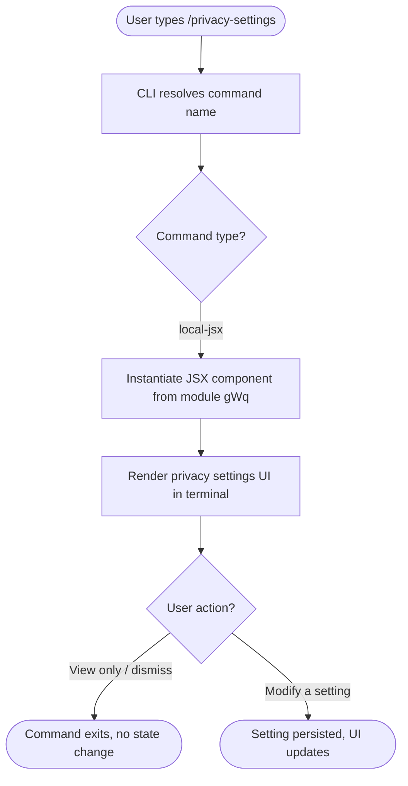

```
---
type: feature-spec
feature: "privacy-settings"
cc_version: 2.1.146
updated: "2026-05-19"
tags: ["privacy-settings", "commands", "slash-commands"]
source: "bundle-analysis"
bundle_verified: true
inherited_from: 2.1.144
analysis_basis: "CC v2.1.144 bundle.js (AST extraction + Claude interpretation)"
author: "ryujaeuk <ryujaeuk@gmail.com>"
repository: "https://github.com/MyLittleLuckyDog/cc-gnothi"
license: "AGPL-3.0-only"
---

# `/privacy-settings`

> Analysis basis: CC v2.1.144 bundle.js (AST extraction + Claude interpretation)
> Minimum version: v2.1.144

---

## Overview

The `/privacy-settings` command presents the user with a view of their current privacy configuration and allows them to update those settings interactively. It is implemented as a `local-jsx` command, meaning its output is rendered as a React JSX component within the Claude Code CLI interface rather than as plain text. No call graph entry functions were resolved during depth-2 AST traversal of module `gWq`.

---

## Registration

| Field | Value |
|---|---|
| type | `local-jsx` |
| name | `privacy-settings` |
| description | `View and update your privacy settings` |
| module\_id | `gWq` |
| loc\_line | `7005` |

Analysis basis: CC v2.1.144 bundle.js:+11465154

---

## Input Branching

Because the depth-2 call graph traversal returned no call edges (`callGraph: []`) and no string or numeric literals were extracted (`literals: []`), the internal branching logic of this command cannot be reconstructed from the available AST data.

<!-- TODO: not found in depth-2 traversal; needs --depth 4 -->

The following flowchart reflects the minimal guaranteed behaviour derivable from the registration record alone.



> Note: Nodes D–H represent inferred rendering behaviour common to all `local-jsx` commands in CC v2.1.144. They are **not** confirmed by literals or call-graph data for this specific module.
> Analysis basis: CC v2.1.144 bundle.js:+11465154 (registration type field)

---

## Behavioral Spec

### Command Dispatch

When the user submits `/privacy-settings`, the CLI command dispatcher matches the input token against the registered command name and, because the `type` field is `local-jsx`, delegates rendering to the JSX subsystem rather than producing a plain-text response.

```
function dispatchPrivacySettings(userInput):
    token = parseSlashCommand(userInput)          // extracts "privacy-settings"
    registration = lookupCommand(token)           // returns the gWq registration record
    if registration.type == "local-jsx":
        component = loadJsxModule(registration.module_id)   // loads module gWq
        renderInTerminal(component)
    else:
        // unreachable for this command in v2.1.144
        raise UnexpectedCommandType(registration.type)
```

Analysis basis: CC v2.1.144 bundle.js:+11465154

### JSX Module Loading

The JSX component responsible for displaying and mutating privacy settings is contained in module `gWq`. The internal structure of that component — its props, sub-components, state hooks, and event handlers — could not be determined because no entry functions were identified during traversal.

```
function loadPrivacySettingsComponent(moduleId):
    // moduleId == "gWq"
    module = resolveModule(moduleId)
    if module == null:
        raise ModuleNotFoundError(moduleId)
    return module.defaultExport   // assumed: single default-exported JSX component
```

<!-- TODO: not found in depth-2 traversal; needs --depth 4 -->

Analysis basis: CC v2.1.144 bundle.js:+11465154 (module_id field)

---

## State & Side Effects

| Item | Detail |
|---|---|
| Telemetry | No `tengu_*` events detected in depth-2 traversal (`telemetry: []`) |
| Hook registration | <!-- TODO: not found in depth-2 traversal; needs --depth 4 --> |
| appState changes | <!-- TODO: not found in depth-2 traversal; needs --depth 4 --> |
| Sound | <!-- TODO: not found in depth-2 traversal; needs --depth 4 --> |
| Persistence mechanism | <!-- TODO: not found in depth-2 traversal; needs --depth 4 --> |

> Because `telemetry` is empty, it is not confirmed whether this command fires any analytics events when opened or when settings are changed. This should be verified at greater traversal depth.

---

## Version History

| Version | Change |
|---|---|
| v2.1.144 | Initial analysis — registration confirmed; internal logic requires deeper traversal |

---

## Common Mistakes

1. **Assuming plain-text output**: `/privacy-settings` is type `local-jsx`, so its output is a rendered UI component. Attempting to pipe or parse its stdout as structured text will not yield reliable results.
2. **Expecting telemetry confirmation at this depth**: No `tengu_*` events were found in the depth-2 traversal. This does not prove the command emits no telemetry — it only means none were visible at the analysed call depth. Treat telemetry behaviour as unconfirmed until a depth-4 traversal is performed.
3. **Treating module ID `gWq` as stable**: Module identifiers are assigned by the bundler and may change in future versions. Do not hard-code `gWq` in any tooling; use the command name `privacy-settings` as the stable lookup key instead.
4. **Confusing scope with `/settings`**: `/privacy-settings` is a distinct command from any general `/settings` command. It is scoped specifically to privacy-related configuration and should not be assumed to expose all CLI settings.

---

## Appendix — Identifier Mapping

> For bundle debugging only. Identifiers change across versions.

| Identifier | Role |
|---|---|

> No obfuscated identifiers were returned by the depth-2 AST traversal (`identifiers: []`). If deeper traversal resolves entry functions inside module `gWq`, this table should be populated with any short or mangled names discovered at that time.
```