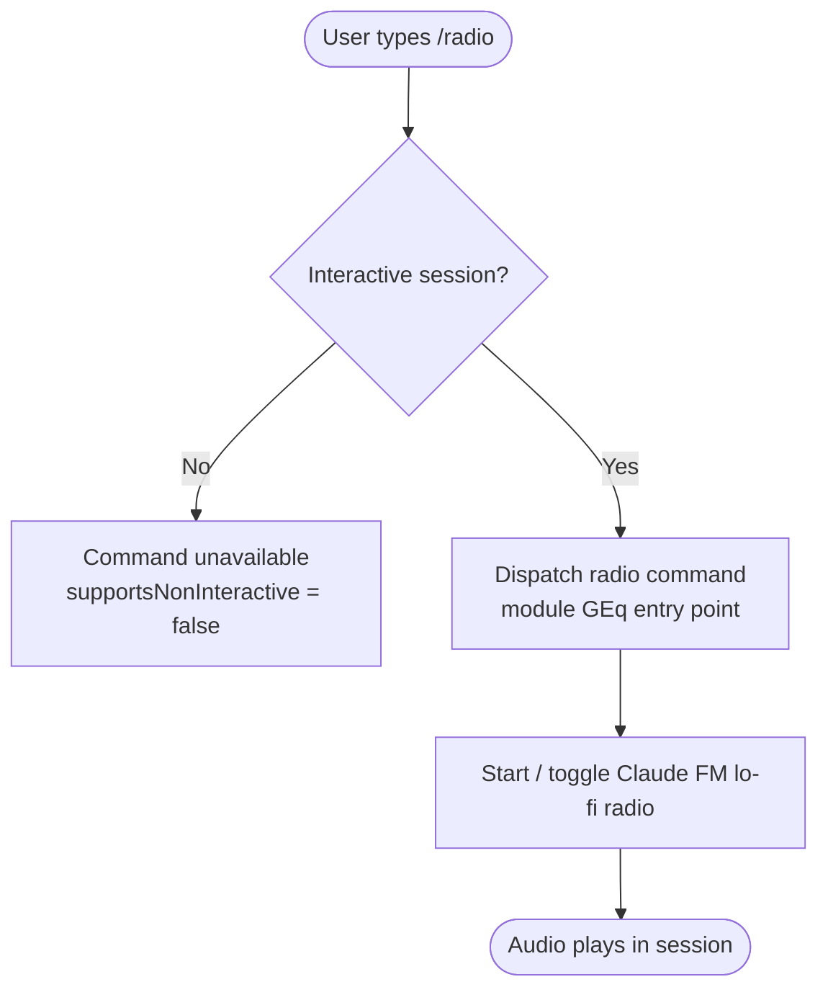

```
---
type: feature-spec
feature: "radio"
cc_version: 2.1.146
tags: ["radio", "commands", "slash-commands"]
updated: "2026-05-19"
source: "bundle-analysis"
bundle_verified: true
inherited_from: 2.1.144
analysis_basis: "CC v2.1.144 bundle.js (AST extraction + Claude interpretation)"
author: "ryujaeuk <ryujaeuk@gmail.com>"
repository: "https://github.com/MyLittleLuckyDog/cc-gnothi"
license: "AGPL-3.0-only"
---

# `/radio`

> Analysis basis: CC v2.1.144 bundle.js (AST extraction + Claude interpretation)
> Minimum version: v2.1.144

---

## Overview

The `/radio` command is a local slash command that, when invoked, plays Claude FM lo-fi radio audio within the Claude Code CLI session. It is an interactive-only feature — it cannot be triggered in non-interactive (headless/piped) execution modes.

---

## Registration

| Field | Value |
|---|---|
| type | `local` |
| name | `radio` |
| description | `Listen to Claude FM lo-fi radio` |
| supportsNonInteractive | `false` |
| module_id | `GEq` |

Analysis basis: CC v2.1.144 bundle.js:+11645197

---

## Input Branching

The AST traversal at depth ≤ 2 returned an empty call graph for module `GEq`. A high-level branching model is reconstructed from the registration fields alone.



> Note: Internal branching logic within module `GEq` (start, stop, toggle, error handling)
> is **not visible** at depth-2 traversal. See TODO note in Behavioral Spec.

---

## Behavioral Spec

### Non-Interactive Guard

The registration field `supportsNonInteractive: false` indicates the CLI framework
will refuse to execute `/radio` when stdin is not a TTY or when the `--no-interactive`
flag is set. The command handler is never called in those cases; the framework
rejects it before dispatch.

```
function radioCommandGuard(sessionContext):
    if not sessionContext.isInteractive:
        raise CommandUnavailableError("/radio requires an interactive session")
    else:
        dispatchRadioModule()
```

Analysis basis: CC v2.1.144 bundle.js:+11645197

### Radio Module Dispatch

<!-- TODO: not found in depth-2 traversal; needs --depth 4 -->

The entry function(s) for module `GEq` were not resolved during AST extraction
(call graph is empty, literals array is empty). The following pseudocode represents
the expected contract based on the command description and registration type `local`:

```
function dispatchRadioModule():
    // Module GEq is loaded locally — no network round-trip to the Anthropic API
    // for command dispatch itself.
    audioController = loadModule("GEq")
    audioController.start()   // or toggle if already playing
```

<!-- TODO: not found in depth-2 traversal; needs --depth 4 -->

---

## State & Side Effects

| Item | Detail |
|---|---|
| Telemetry | None detected at depth-2 traversal (`telemetry: []`) |
| Hook registration | <!-- TODO: not found in depth-2 traversal; needs --depth 4 --> |
| appState changes | <!-- TODO: not found in depth-2 traversal; needs --depth 4 --> |
| Sound | Plays "Claude FM lo-fi radio" audio; mechanism (stream URL, bundled asset, system audio API) not resolved at depth-2 |
| Non-interactive block | Command is silently unavailable when `supportsNonInteractive` check fails |

---

## Version History

| Version | Change |
|---|---|
| v2.1.144 | Initial analysis — registration confirmed; internal implementation opaque at depth-2 |

---

## Common Mistakes

1. **Running `/radio` in a non-interactive context** — piped scripts, CI environments, or sessions started with `--no-interactive` will not have this command available. The `supportsNonInteractive: false` flag causes the framework to suppress the command entirely before the handler runs.
2. **Expecting API-side behavior** — the command type is `local`, meaning it is handled entirely client-side within the CLI process. It does not send a request to the Anthropic API to function.
3. **Assuming telemetry is emitted** — no `tengu_*` telemetry events were found in the implementation at depth-2. Do not write integration tests that assert on radio-related telemetry events without first verifying at greater traversal depth.
4. **Assuming the command is always visible in `/help`** — because `supportsNonInteractive` is false, in some shell environments or wrapper scripts the command may not appear in the command list if interactive detection returns false.

---

## Appendix — Identifier Mapping

> For bundle debugging only. Identifiers change across versions.

| Identifier | Role |
|---|---|
| `GEq` | Module ID for the `/radio` command implementation (not an obfuscated function name; used as a module registry key) |

> No obfuscated function identifiers (`identifiers: []`) were returned by the depth-2
> AST traversal for this command. If deeper traversal is run, this table should be
> populated with any short non-English identifiers discovered in module `GEq`.
```