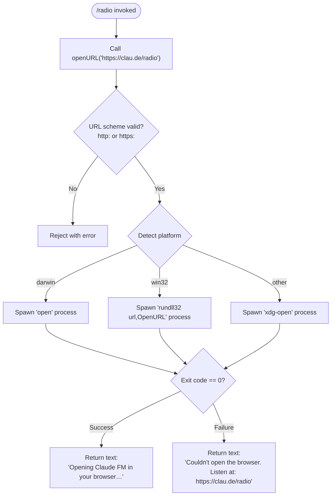

```markdown
---
type: feature-spec
feature: "radio"
cc_version: "2.1.146"
updated: "2026-06-01"
tags: ["radio", "commands", "slash-commands"]
source: "bundle-analysis"
bundle_verified: true
inherited_from: "2.1.145"
analysis_basis: "CC v2.1.145 bundle.js (AST extraction + Claude interpretation)"
author: "ryujaeuk <ryujaeuk@gmail.com>"
repository: "https://github.com/MyLittleLuckyDog/cc-gnothi"
license: "AGPL-3.0-only"
---

# `/radio`

> Analysis basis: CC v2.1.145 bundle.js (AST extraction + Claude interpretation)
> Minimum version: v2.1.145

---

## Overview

`/radio` is a local slash command that opens the Claude FM lo-fi radio stream (`https://clau.de/radio`) in the user's default system browser. It is a lightweight, non-interactive utility command: it delegates to the OS's URL-open mechanism, prints a confirmation message on success, and falls back to printing the URL directly if the browser cannot be launched.

---

## Registration

| Field | Value |
|---|---|
| type | `local` |
| name | `radio` |
| description | `Listen to Claude FM lo-fi radio` |
| supportsNonInteractive | `false` |
| module_id | `RZq` |
| load_inline | `true` |
| loc_byte | `11673040` |
| loc_byte_end | `11673245` |
| loc_line | `7210` |
| arbor_handler.name | `dR7` |
| arbor_handler.fqn | `claude-2.1.145::dR7` |
| arbor_handler.kind | `AsyncFunction` |
| arbor_handler.resolution_path | `module_id` |
| arbor_handler.n_hits | `0` |

Analysis basis: CC v2.1.145 bundle.js:+11673040

---

## Input Branching

The command takes no user-supplied arguments. All branching is driven by the runtime outcome of the URL-open call. There are three distinct outcome paths, so a flowchart is used.



Analysis basis: CC v2.1.145 bundle.js:+11672798, +6434319, +6434628, +6434644, +6434728, +6434594

---

## Behavioral Spec

### Handler Entry — `radioCommandHandler` (`dR7`)

The Arbor-resolved handler is `dR7`, an `AsyncFunction` reached via `module_id → RZq`.

```
async function radioCommandHandler(context):
    result = await openUrlInBrowser("https://clau.de/radio")
    if result.success:
        return { type: "text", content: "Opening Claude FM in your browser…" }
    else:
        return { type: "text", content: "Couldn't open the browser. Listen at: https://clau.de/radio" }
```

Analysis basis: CC v2.1.145 bundle.js:+11672798, +11672838, +11672851, +11672919

---

### URL Validation — `urlSchemeValidator` (`q04`)

Before the OS open call is attempted, the URL's scheme is verified.

```
function urlSchemeValidator(url):
    scheme = extractScheme(url)      // e.g. "http:" or "https:"
    if scheme not in ["http:", "https:"]:
        throw new Error("invalid URL scheme")
    return url
```

Analysis basis: CC v2.1.145 bundle.js:+6434269, +6434319, +6434341

---

### Platform-Aware URL Opener — `openUrlInBrowser` (`nq`)

```
async function openUrlInBrowser(url):
    validateUrlScheme(url)           // calls urlSchemeValidator
    platform = process.platform

    if platform == "darwin":
        command = "open"
        args    = [url]
    else if platform == "win32":
        command = "rundll32"
        args    = ["url,OpenURL", url]
    else:                            // Linux / other POSIX
        command = "xdg-open"
        args    = [url]

    exitCode = await spawnProcess(command, args)  // calls aj (spawn helper)

    if exitCode == 0:
        return { success: true }
    else:
        return { success: false }
```

Analysis basis: CC v2.1.145 bundle.js:+6434556, +6434569, +6434594, +6434628, +6434644, +6434677, +6434728, +6434740, +6434802, +6434809

---

### Subprocess Spawn Helper — `spawnAndWait` (`aj`)

```
async function spawnAndWait(command, args):
    proc = spawn(command, args)
    exitCode = await waitForExit(proc)
    return exitCode
```

Analysis basis: CC v2.1.145 bundle.js:+6434569

---

### Async Context Storage Accessor — `storeAccessor` (`b6` → `AC6`)

`b6` retrieves the current async-local store context and extracts the active configuration object via `AC6`. This is used by the URL-open pipeline to access environment settings.

```
function getActiveStore():
    store = asyncLocalStorage.getStore()   // _C6.getStore
    if store is null:
        return defaultConfig()             // Mc fallback
    return store
```

Analysis basis: CC v2.1.145 bundle.js:+1039271, +965908, +965929, +965959, +965978

---

### Process Lifecycle / Spare-Pool Management — `sparePoolManager` (`D`)

`D` is reached transitively through the `Y_` → `D` edge. It manages background spare-process slots, checks free memory (`FZ8.freemem`), and schedules 2000 ms deferred restarts.

```
function sparePoolManager():
    emit telemetry("tengu_bg_spare_enable")
    if freeMemory() is sufficient:
        dispose existing spare if present   // $.dispose
        spawnNewSpare()                     // bT6
        scheduleRetry(delay = 2000)         // setTimeout 2000 ms
        emit telemetry("tengu_bg_spare_spawn")
```

- Retry delay: **2000 ms** (bundle.js:+14655040)
- Free-memory check constant: present at bundle.js:+14654827

Analysis basis: CC v2.1.145 bundle.js:+14654744, +14654781, +14654813, +14654827, +14654903, +14654948, +14655016, +14655040, +14655105, +14655107

---

### Logger / Debug Sink — `debugLogger` (`I`)

`I` is a shared logger utility called from the URL-open subsystem.

```
function debugLogger(level, message):
    if level == "debug":
        formatAndEmit(message)
    else if level == "error":
        formatAndEmit(message, severity = ERROR)
```

- Log level strings observed: `"debug"` (bundle.js:+201601), `"error"` (bundle.js:+1040054)

Analysis basis: CC v2.1.145 bundle.js:+201601, +201625, +201643, +201665, +201683, +1040054

---

### Connection / Session Initializer — `sessionInitializer` (`QXH`)

`QXH` is reached via `Y_` → `QXH`. It sets up connection infrastructure reused across commands, including binding event handlers and resolving/rejecting connection promises.

```
function sessionInitializer(config):
    initTransport(VDA, Qm8, dm8, lm8)
    if errorCondition:
        return Promise.reject(...)
    registerHandlers(SYA, CYA)
    bindCallbacks(yYA, hYA)
    setupStateStore($YA)
    applyLimits(x96, limit = 1)       // constant 1 at bundle.js:+1035108
    return sessionHandle
```

- Observed limit constant: **1** (bundle.js:+1035108)
- Memory threshold constant: **1 000 000** bytes (bundle.js:+1039627)

Analysis basis: CC v2.1.145 bundle.js:+1034841 – +1035873

---

## State & Side Effects

| Item | Detail |
|---|---|
| Telemetry — `tengu_bg_spare_enable` | Fired when the background spare-process pool is activated (bundle.js:+14654747) |
| Telemetry — `tengu_bg_spare_spawn` | Fired when a new spare process is successfully spawned (bundle.js:+14655107) |
| Browser launch | Spawns an OS subprocess (`open` / `rundll32` / `xdg-open`) as a side effect |
| Return value (success) | `{ type: "text", content: "Opening Claude FM in your browser…" }` (bundle.js:+11672838, +11672851) |
| Return value (failure) | `{ type: "text", content: "Couldn't open the browser. Listen at: https://clau.de/radio" }` (bundle.js:+11672919) |
| supportsNonInteractive | `false` — command must run inside an interactive session |
| appState changes | None detected at depth ≤ 2 |
| Sound | None detected at depth ≤ 2 |
| Hook registration | <!-- TODO: not found in depth-2 traversal; needs --depth 4 --> |

---

## Version History

| Version | Change |
|---|---|
| v2.1.145 | Initial analysis |

---

## Common Mistakes

1. **Running in non-interactive mode**: `supportsNonInteractive` is `false`; invoking `/radio` in a headless or piped session will not function as expected.
2. **Expecting in-terminal audio**: `/radio` opens a browser URL — it does not stream audio directly inside the terminal. If no browser is detected, the fallback message provides the URL for manual navigation.
3. **Firewall / sandbox environments**: On systems where `open`, `rundll32`, or `xdg-open` are blocked, the command will fall back to the error message. Copy `https://clau.de/radio` from the output manually.
4. **URL scheme assumptions**: The opener validates that the URL starts with `http:` or `https:`. Any internal reconfiguration pointing to a non-HTTP scheme will hard-fail before the subprocess is spawned.

---

## Appendix — Identifier Mapping

> For bundle debugging only. Identifiers change across versions.

| Identifier | Role |
|---|---|
| `dR7` | Main async handler for `/radio` (Arbor-resolved entry point) |
| `nq` | Platform-aware URL opener — validates scheme, selects OS command, spawns subprocess |
| `q04` | URL scheme validator — rejects non-http/https URLs |
| `aj` | Subprocess spawn-and-wait helper |
| `Y8` | Intermediate dispatcher routing to session initializer and store accessor |
| `Y_` | Session/connection setup orchestrator |
| `QXH` | Session initializer — sets up transport, handlers, and connection promises |
| `D` | Spare-process pool / lifecycle manager; emits `tengu_bg_spare_*` telemetry |
| `YCK` | String conversion / formatting utility |
| `_N` | <!-- TODO: not found in depth-2 traversal; needs --depth 4 --> |
| `I` | Debug/error logger |
| `A8` | <!-- TODO: not found in depth-2 traversal; needs --depth 4 --> |
| `NH` | Error handler / log-error reporter (calls `gc.logError`) |
| `b6` | Async-local store accessor dispatcher |
| `AC6` | Inner store retrieval — calls `_C6.getStore` and `Mc` fallback |
| `q_` | <!-- TODO: not found in depth-2 traversal; needs --depth 4 --> |
```