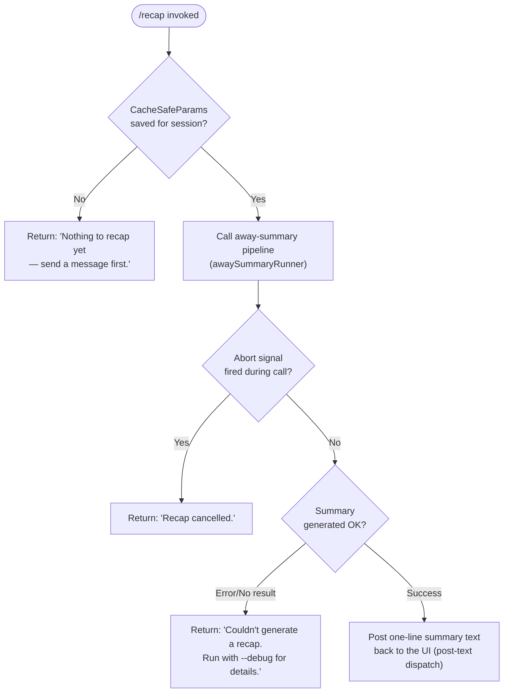

# `/recap`

> Analysis basis: CC v2.1.146 bundle.js (AST extraction + Claude interpretation)
> Minimum version: v2.1.146

---

## Overview

The `/recap` command triggers an immediate on-demand generation of a one-line session summary without waiting for the next automatic away-summary cycle. Internally it delegates to the same "away summary" pipeline (`Sq8`) that the periodic summarizer uses, but bypasses the idle-wait logic and runs synchronously at the user's request. If the session has no conversation turns yet, or if the recap generation fails, specific short error messages are returned to the user instead of a summary.

---

## Registration

| Field | Value |
|---|---|
| type | `local` |
| name | `recap` |
| description | `Generate a one-line session recap now` |
| loc_byte | `12363555` |
| loc_byte_end | `12363771` |
| loc_line | `10483` |
| supportsNonInteractive | `false` |
| thinClientDispatch | `post-text` |
| load_inline | `true` |
| load_ident | `_c7` |
| arbor_handler.name | `_c7` |
| arbor_handler.fqn | `claude-2.1.146::_c7` |
| arbor_handler.kind | `AsyncFunction` |
| arbor_handler.resolution_path | `load_ident` |
| arbor_handler.n_hits | `0` |

Analysis basis: CC v2.1.146 bundle.js:+12363555

The registration block spans bytes `(12363555, 12363771)`. The handler is loaded via an inline `Promise.resolve({call: _c7})` shape (`load_ident`); there is no separate `module_id`. Arbor resolved the handler as `_c7` via the `load_ident` path.

---

## Input Branching

Four distinct branches exist based on session state and the outcome of the away-summary sub-call, so a flowchart is used.



Analysis basis: CC v2.1.146 bundle.js:+12363305 (empty-session literal), +12363397 (cancelled literal), +12363455 (error literal), +5302668 (away-summary guard log literal)

---

## Behavioral Spec

### Handler entry — `recapCommandHandler` (`_c7`)

```
async function recapCommandHandler(commandContext):
    # Guard: verify that the session has at least one completed turn
    params = getCacheSafeParams(commandContext)   # reads persisted API params
    if params is null or undefined:
        return postText("Nothing to recap yet — send a message first.")

    # Delegate to the shared away-summary runner
    result = await awaySummaryRunner(params, commandContext.abortSignal)

    if commandContext.abortSignal.aborted:
        return postText("Recap cancelled.")

    if result is null or result indicates failure:
        return postText("Couldn't generate a recap. Run with --debug for details.")

    return postText(result.summaryLine)
```

Analysis basis: CC v2.1.146 bundle.js:+12363163 (`_c7` → `Sq8` call edge), +12363305, +12363397, +12363455

### Away-summary runner — `awaySummaryRunner` (`Sq8`)

```
async function awaySummaryRunner(cacheSafeParams, abortSignal):
    # Pre-flight check
    if cacheSafeParams is absent:
        log.debug("[awaySummary] no CacheSafeParams saved, skipping")
        return null                               # triggers "no-turn" path

    # Register abort listener to cancel in-flight model call
    abortSignal.addEventListener("abort", onAbort)

    # Build a minimal tool-deny context
    # (away summaries must not invoke tools)
    toolPolicy = buildToolDenyPolicy()            # "Away summary cannot use tools"

    # Invoke core query pipeline
    queryResult = await coreQueryPipeline(
        messages    = cacheSafeParams.messages,
        model       = cacheSafeParams.model,
        tools       = [],                         # no tools allowed
        toolPolicy  = "deny",
        category    = "away_summary",
        abortSignal = abortSignal
    )

    # Classify outcome
    match queryResult.status:
        case "ok":      return queryResult
        case "aborted": return { status: "aborted" }
        case "api-error" | "other": return null
```

Analysis basis: CC v2.1.146 bundle.js:+5302647 (`Sq8` → `$VH`), +5302666 (`Sq8` → `N`), +5302668 (debug log literal), +5302726 ("no-turn" literal), +5302782 ("abort" literal), +5302959 ("deny" literal), +5302974 ("Away summary cannot use tools" literal), +5303042 ("away_summary" literal), +5303186 ("aborted" literal), +5303275 ("api-error" literal), +5303336 ("ok" literal)

### Core query pipeline (depth-2 view) — `coreQueryLoop` (`N` / `h27`)

This is the shared agentic query engine reached via `Sq8 → N → h27`. For `/recap`, the pipeline is invoked with an empty tool list and the `deny` tool policy. Key sub-steps observed in the call graph:

```
function coreQueryLoop(params):
    # Compaction pre-checks
    if shouldMicrocompact(params):
        runMicrocompact()               # "query_microcompact_start/end"
    if shouldAutocompact(params):
        runAutocompact()                # "query_autocompact_start/end"

    # API streaming loop
    loop:
        streamResult = callModel(params)    # D.callModel
        processStreamEvents(streamResult)   # stream_event, message_delta
        if done: break

    # Post-loop classification
    return classifyStopReason(streamResult)
```

Analysis basis: CC v2.1.146 bundle.js:+201624 (`N` → `T_6`), +201642 (`N` → `$wK`), +10380629 (`h27` → `D.callModel`), +10377029 ("query_microcompact_start" literal), +10377162 ("query_autocompact_start" literal)

### Session-log / transcript writer — `sessionLogWriter` (`YwK`)

The away-summary pipeline uses `YwK` to persist the generated summary line to the on-disk transcript. The writer:

```
function sessionLogWriter(entry):
    targetDir  = path.dirname(logFilePath)
    logPath    = buildLogPath(targetDir)         # RqA
    byteLen    = Buffer.byteLength(entry)
    if currentFileSize + byteLen > maxFileSize:
        rotateLogs()                             # SqA: stat → rename → unlink
    mkdir(targetDir, { recursive: true })        # zwK
    appendFile(logPath, entry)                   # zwK → WI.appendFile
    registerShutdownHook()                       # c9 → c_A.register
```

Log rotation checks for `.txt` suffix (bundle.js:+200570) and keeps a rolling window with a 4-byte header offset (bundle.js:+200592). The `EISDIR` error code is handled specially during rotation (bundle.js:+172231).

Analysis basis: CC v2.1.146 bundle.js:+201112 (`YwK` → `sSH`), +201137 (`YwK` → `KAH`), +201145 (`YwK` → `TXH.dirname`), +201282 (`YwK` → `RqA`), +201314 (`YwK` → `SqA`), +201320 (`YwK` → `Buffer.byteLength`), +201379 (`YwK` → `zwK.bind`)

### Path sanitization — `sanitizePath` (`O4`)

Paths in the generated recap are sanitized before display:

```
function sanitizePath(rawPath):
    segments = splitIntoTokens(rawPath)         # VqA → AwK.map
    cleaned  = rawPath.replace(pattern, "[REDACTED]")   # sensitive segment redaction
    tail     = cleaned.at(-1)                   # q.at
    lastSep  = cleaned.lastIndexOf(separator)   # A.lastIndexOf
    return cleaned.slice(lastSep + 1)            # A.slice
```

The string `"[REDACTED]"` is substituted for matched sensitive path components (bundle.js:+193725).

Analysis basis: CC v2.1.146 bundle.js:+193646 (`O4` → `VqA`), +193673 (`O4` → `H.replace`), +193725 ("[REDACTED]" literal), +193783 (`O4` → `q.at`), +193809 (`O4` → `A.lastIndexOf`), +193835 (`O4` → `A.slice`), +201746 (`N` → `O4`)

---

## State & Side Effects

| Item | Detail |
|---|---|
| Telemetry (direct path) | None found attributed exclusively to the `/recap` handler (`_c7`) at depth ≤ 2 — all telemetry events below originate in shared infrastructure reached via delegation |
| Telemetry (shared pipeline) | `tengu_auto_compact_rapid_refill_breaker` (+10377487), `tengu_auto_compact_succeeded` (+10377948), `tengu_ptl_surfaced_to_user` (+10379992), `tengu_orphaned_messages_tombstoned` (+10382037), `tengu_model_fallback_triggered` (+10384679), `tengu_query_error` (+10385004), `tengu_model_response_keyword_detected` (+10385648), `tengu_malformed_tool_use_response` (+10389012), `tengu_stop_hook_block_count` (+10389966), `tengu_streaming_tool_execution_used` (+10391309), `tengu_streaming_tool_execution_not_used` (+10391412), `tengu_loop_dynamic_wakeup_ends_turn` (+10393540), `tengu_post_autocompact_turn` (+10393707), `tengu_query_before_attachments` (+10393821), `tengu_query_after_attachments` (+10396227), `tengu_mcp_tools_refreshed_mid_turn` (+10396530), `tengu_feature_ok` (+955938), `tengu_feature_bad` (+955996), `tengu_forked_agent_default_turns_exceeded` (+10414277), `tengu_fork_agent_query` (+10414720) |
| Hook registration | `c9 → c_A.register` (+57267) — a shutdown / process-exit hook is registered by the session log writer component (`YwK`) to flush pending log entries |
| appState changes | `H.getAppState` / `H.setAppState` accessed inside `yh_` (the agentic runner) during the model-call lifecycle (+10410508, +10411364) |
| Dispatch mode | `thinClientDispatch: "post-text"` — the recap result is posted back as plain text, not rendered as a rich component |
| Tool access | Explicitly denied during recap execution; the literal `"Away summary cannot use tools"` (+5302974) is used as the policy reason string |
| Abort handling | An `"abort"` event listener is attached to the `AbortSignal` (+5302782, +5302794); if fired, the result is discarded and `"Recap cancelled."` is returned |
| Non-interactive support | `supportsNonInteractive: false` — `/recap` cannot be invoked from a non-interactive / headless session |
| Sound | <!-- TODO: not found in depth-2 traversal; needs --depth 4 --> |

---

## Version History

| Version | Change |
|---|---|
| v2.1.146 | Initial analysis |

---

## Common Mistakes

1. **Running `/recap` before sending any message.** If no conversation turns exist yet, the command returns `"Nothing to recap yet — send a message first."` and does nothing further. Users sometimes expect it to summarize previously attached context or files — it requires at least one completed message exchange.

2. **Expecting tool actions during recap.** The away-summary pipeline is explicitly configured with `toolPolicy = "deny"`. Any expectation that `/recap` will read files or call MCP servers is incorrect; the model call is intentionally constrained to text-only output.

3. **Using `/recap` in non-interactive mode.** `supportsNonInteractive: false` means invoking this command from a script or CI pipeline (e.g., via `--print` flag) will not work as intended.

4. **Interpreting a cancelled recap as an error.** If the user or the runtime aborts the underlying model call (e.g., pressing Escape), the command returns `"Recap cancelled."` — this is a clean cancellation, not a failure, and the session state is unaffected.

5. **Expecting a long summary.** The command description (`"Generate a one-line session recap now"`) is accurate — the away-summary pipeline is specifically designed to produce a single-line synopsis, not a multi-paragraph report.

---

## Appendix — Identifier Mapping

> For bundle debugging only. Identifiers change across versions.

| Identifier | Role |
|---|---|
| `_c7` | Main handler for `/recap` (async function; resolved via `load_ident`) |
| `Sq8` | Away-summary runner — top-level orchestrator called by `_c7` |
| `$VH` | CacheSafeParams retrieval helper — checks whether prior API params exist |
| `N` | Core query loop entry point — dispatches to `h27` for agentic execution |
| `$wK` | Query context builder / pre-flight validator |
| `n_A` | Internal state initializer used by query context builder |
| `CH` | Serialization helper (wraps `JSON.stringify`) |
| `O4` | Path sanitization function |
| `VqA` | Token-splitting sub-helper used by path sanitizer |
| `NRH` | Output writer that calls `YqA` → `H.write` |
| `YqA` | Low-level write wrapper |
| `YwK` | Session log / transcript writer (handles file append, rotation, and shutdown hook) |
| `sSH` | Buffered log-line batcher (uses `clearTimeout`/`setTimeout`/`setImmediate`) |
| `KAH` | Log filename formatter / path joiner |
| `Q6` | Directory creation sub-helper inside session log writer |
| `z_6` | EISDIR-aware stat/mkdir helper |
| `RqA` | Log file path builder (joins directory and filename) |
| `SqA` | Log rotation handler (stat → endsWith → rename → unlink) |
| `zwK` | Append-to-file executor with recursive mkdir |
| `c9` | Shutdown hook registration helper (calls `c_A.register`) |
| `CZ` | Agentic session runner — manages model call lifecycle, abort, and state |
| `yh_` | Inner agent runner — reads/writes `appState`, calls model |
| `Ik` | Sub-agent initializer (sets up abort, binds callbacks) |
| `c1H` | Conversation state loader/dumper |
| `JOH` | Post-turn state handler |
| `OHq` | Pre-turn state handler |
| `aj8` | Agent configuration assembler |
| `bk` | Random-bytes generator (8 bytes, hex-encoded) |
| `T` | Turn list / session transcript container |
| `z06` | Turn entry constructor variant A |
| `Yv8` | Turn entry constructor variant B |
| `c6H` | Model response classifier / forked-agent dispatcher |
| `y4` | Shutdown hook accessor used by `c6H` |
| `nIH` | MCP tool filter (filters by provider tag `"ant"`) |
| `Xx` | Turn-dispatch coordinator |
| `h27` | Core agentic query engine (streaming API loop, tool execution, compaction) |
| `Sw8` | Subagent exit / ready-state handler |
| `bH` | "turn" event emitter |
| `uH` | Auxiliary turn-state helper |
| `N06` | Message-type presence checker (uses `SJ7.has`) |
| `NjH` | Notification formatter |
| `SJ8` | System-message builder |
| `j71` | Tool-use summary message builder |
| `D` | Background-process / daemon manager |
| `N6` | Background session spawner |
| `$` | Disposable resource wrapper |
| `rE6` | macOS memory-aware session launcher |
| `_HA` | Daemon background-spare refill spawner |
| `c` | Generic logging / telemetry sink |
| `SH` | Feature-flag reporter (`tengu_feature_ok` / `tengu_feature_bad`) |
| `Q27` | Forked-agent query executor |
| `T8` | Background session manager (UUID-keyed) |
| `J` | Background worker process wrapper |
| `w` | Worker lifecycle manager (spawn, kill, memory check) |
| `j` | Worker kill-all helper |
| `y` | Worker write/close helper |
| `_7q` | Message flat-mapper for dispatch |

---

Note: index built via Arbor fallback; some signals (telemetry, literals) may be missing — see arbor-fallback.js.