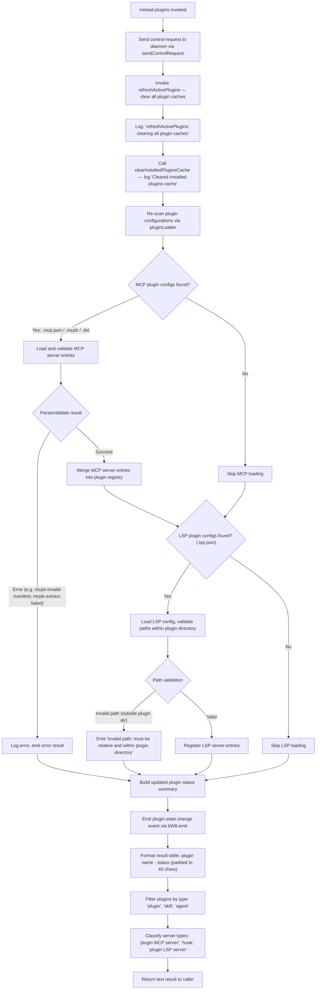

# `/reload-plugins`

> Analysis basis: CC v2.1.146 bundle.js (AST extraction + Claude interpretation)
> Minimum version: v2.1.146

---

## Overview

`/reload-plugins` activates pending plugin changes in the current Claude Code session without requiring a full restart. It does this by dispatching a control request to the daemon layer, clearing all plugin caches, re-scanning installed plugins and their MCP/LSP configurations, and emitting updated plugin state back into the running session.

---

## Registration

| Field | Value |
|---|---|
| type | `local` |
| name | `reload-plugins` |
| description | `Activate pending plugin changes in the current session` |
| supportsNonInteractive | `false` |
| thinClientDispatch | `"control-request"` |
| module_id | `gI1` |
| load_inline | `true` |
| loc_byte | `11996364` |
| loc_byte_end | `11996583` |
| loc_line | `9915` |
| arbor_handler.name | `bp7` |
| arbor_handler.fqn | `claude-2.1.146::bp7` |
| arbor_handler.kind | `AsyncFunction` |
| arbor_handler.resolution_path | `module_id` |
| arbor_handler.n_hits | `0` |

Analysis basis: CC v2.1.146 bundle.js:+11996364

---

## Input Branching

The command has 4+ distinct execution paths depending on what plugins are found and whether errors occur during cache refresh and re-initialization. A Mermaid flowchart is used.



Analysis basis: CC v2.1.146 bundle.js:+11995387, +11993272, +11995454, +11993270, +11995499

---

## Behavioral Spec

### Main Handler — `reloadPluginsHandler` (bundle: `bp7`)

The handler is an `AsyncFunction` resolved via `module_id` → `gI1`. The Arbor symbol graph identifies it as `bp7` (`claude-2.1.146::bp7`).

```
async function reloadPluginsHandler(context):
    // Step 1: Dispatch control-request to daemon
    requestId = generateRequestId()          // via Q3 → KXH
    sendControlRequest(context, requestId)   // bundle: A.sendControlRequest

    // Step 2: Refresh all plugin caches
    refreshActivePlugins()                   // via yJH; logs "refreshActivePlugins: clearing all plugin caches"

    // Step 3: Clear installed plugin cache
    clearInstalledPluginsCache()             // via P_1 → N; logs "Cleared installed plugins cache"

    // Step 4: Reload plugin loader state
    pluginLoader = getPluginLoader()         // via o3 → Df7
    clearPluginLoaderCache(pluginLoader)     // via mIH → vD8.clear

    // Step 5: Re-scan all plugin scopes
    pluginConfigs = loadAllPluginConfigs()   // via Bi → XX_, SDq, fY6
        // Scans for .mcp.json, .mcpb, .dxt files
        // Scans for .lsp.json files

    // Step 6: Build plugin-type sets
    mcpPlugins  = filterByType(pluginConfigs, ["plugin", "skill", "agent", "plugin MCP server"])
    lspPlugins  = filterByType(pluginConfigs, ["hook", "plugin LSP server"])
    // Rp7 handles "lsp-manager" and "plugin:" prefixed entries
    // Cp7 handles generic-error classifications

    // Step 7: Assemble dependency/status tree
    dependencyStatus = buildDependencyStatus(pluginConfigs)
        // Checks for: "dependency-unsatisfied", "not-found"
        // Validates install scopes (blocks "managed" scope installs)

    // Step 8: Emit state change
    emitPluginStateChange(bW8, dependencyStatus)

    // Step 9: Format and return result
    rows = pluginConfigs.map(p => p.name.padEnd(40) + " · " + p.status)
    return { type: "text", content: rows.join("\n") }
```

Analysis basis: CC v2.1.146 bundle.js:+11995387, +11995424, +11995499, +11995795, +11995827, +11995870

---

### Plugin Cache Refresh — `refreshActivePlugins` (bundle: `yJH`)

```
function refreshActivePlugins():
    log("debug", "refreshActivePlugins: clearing all plugin caches")
    // Clear each plugin-scope cache in turn
    for scope in ["user", "project", "local"]:
        clearScopeCache(scope)               // via N → T_6, $wK
    clearLogWriter()                         // via N → NRH → YqA
    clearFileLogger()                        // via N → YwK → sSH, KAH, zwK

    // Re-scan installed plugin directories
    installedPlugins = scanInstalledPlugins()  // via Bi
    lspConfigs       = scanLSPConfigs()        // via fNH

    // Build aggregate status
    for each plugin in installedPlugins:
        status = computeInstallStatus(plugin)
        // Possible values: "needs-config", "dependency-unsatisfied",
        //                  "blocked-by-policy", "resolution-failed"

    // Compute totals using reduce
    totals = installedPlugins.reduce(accumulateCounts, {})
    Object.values(totals)  // emit summary

    emitPluginStateEvent(bW8)
```

Analysis basis: CC v2.1.146 bundle.js:+11993270, +11993272, +11993379, +11993531, +11994359

---

### MCP Plugin Config Loader — `loadMCPPluginConfigs` (bundle: `Bi` → `XX_`, `SDq`, `fY6`)

```
function loadMCPPluginConfigs(scope):
    configPath = resolveConfigPath(scope)     // joins with ".mcp.json"

    // Attempt to read config file
    try:
        raw = readFile(configPath, "utf-8")
        parsed = JSON.parse(raw)
    catch ENOENT:
        return []                             // no config present

    entries = []
    for [name, definition] in Object.entries(parsed):
        status = validateDefinition(definition)
        // status types observed: "http", "download", "network",
        //   "mcpb-download-failed", "mcpb-invalid-manifest",
        //   "mcpb-extract-failed"
        if status in ["http", "download", "network"]:
            // Remote source: apply policy check
            if blockedByPolicy(definition):
                status = "marketplace-blocked-by-policy"
        entries.push({ name, definition, status })

    // Handle .mcpb/.dxt formats
    for entry where entry.name.endsWith(".mcpb") or ".dxt":
        manifest = extractAndValidateManifest(entry)
        if not manifest:
            log_error("No manifest.json found in MCPB file")
        else:
            entry.status = computeManifestStatus(manifest)

    return entries
```

Analysis basis: CC v2.1.146 bundle.js:+6424074, +6424085, +5108466, +5108487, +5114486, +5115782

---

### LSP Config Loader — `loadLSPConfigs` (bundle: `fNH`, `IoL`, `NoL`)

```
function loadLSPConfigs(pluginDir):
    configPath = path.join(pluginDir, ".lsp.json")
    try:
        raw  = readFile(configPath)
        data = JSON.parse(raw)
    catch:
        log_error("lsp-config-invalid")
        return []

    entries = []
    for item in data:
        if Array.isArray(item.paths):
            for p in item.paths:
                normalised = path.resolve(pluginDir, p)
                relative   = path.relative(pluginDir, normalised)
                if relative.startsWith(".."):
                    log_error("Invalid path: must be relative and within plugin directory")
                    continue
                entries.push({ path: normalised, config: item })
        else:
            entries.push({ config: item })

    return entries
```

Analysis basis: CC v2.1.146 bundle.js:+7883159, +7883175, +7883258, +7884375, +7883074

---

### Plugin Dependency Resolver — `resolvePluginDependencies` (bundle: `RLH` → `wY6`, `jX`, `nHq`, `zG`)

```
function resolvePluginDependencies(pluginRegistry):
    // Load known marketplaces list
    marketplaces = loadKnownMarketplaces()      // via ZQ → e5; reads "known_marketplaces.json"

    pluginEntries = Object.entries(pluginRegistry)
    resolved = []
    errors   = []

    for [name, spec] in pluginEntries:
        // Validate install scope
        if spec.scope == "managed":
            errors.push({ name, reason: "Cannot install plugins to managed scope" })
            continue

        // Check policy settings
        policyResult = checkPolicySettings(name, spec)  // via XZH → x8 → KF
        if policyResult.blocked:
            errors.push({ name, reason: "blocked-by-policy" })
            continue

        // Parse version range requirements
        versionResult = resolveVersionRange(spec)       // via Xz6
        if versionResult.conflict:
            errors.push({ name, reason: "range-conflict" })
            continue

        // Check for cross-marketplace conflicts
        if detectCrossMarketplace(name, marketplaces):  // via nHq
            errors.push({ name, reason: "cross-marketplace" })
            continue

        // Resolve dependency chain
        deps = resolveDependencyChain(spec)             // via jX → Lz6, HHq, Z3L
        if deps.hasCycle:
            errors.push({ name, reason: "cycle" })
            continue

        resolved.push({ name, spec, deps })

    return { resolved, errors }
```

Analysis basis: CC v2.1.146 bundle.js:+11176618, +11176780, +11176803, +11176855, +11176887, +4885112, +4885090

---

### Control Request Dispatch — `sendControlRequest` (bundle: `A.sendControlRequest`)

```
function sendControlRequest(context, requestId):
    // Dispatches via thinClientDispatch = "control-request"
    // Payload includes: { type: "reload_plugins", id: requestId }
    // The literal "ccr" (bundle.js:+11995405) is used as a request-type prefix
    // The literal "reload_plugins" (bundle.js:+11995454) is the operation name
    context.sendControlRequest({
        prefix: "ccr",
        operation: "reload_plugins",
        id: requestId
    })
```

Analysis basis: CC v2.1.146 bundle.js:+11995405, +11995424, +11995454

---

### Result Formatting (bundle: `K`, `te`)

```
function formatPluginResultTable(plugins):
    COL_WIDTH = 40       // bundle.js:+15085652

    rows = plugins.map(plugin =>
        plugin.name.padEnd(COL_WIDTH) + " · " + plugin.status
    )
    // Separator literal " · " at bundle.js:+11995637
    // Column pad width 40 at bundle.js:+15085652

    return rows.join("\n")
```

Plugin type classification strings used in result:

| Literal | Meaning | loc_byte |
|---|---|---|
| `"plugin"` | Standard plugin type | +11995519 |
| `"skill"` | Skill plugin type | +11995550 |
| `"agent"` | Agent plugin type | +11995578 |
| `"plugin MCP server"` | MCP server plugin | +11995610 |
| `"hook"` | Hook plugin type | +11996043 |
| `"plugin LSP server"` | LSP server plugin | +11996102 |

Analysis basis: CC v2.1.146 bundle.js:+15085652, +11995637, +11995519–11996102

---

## State & Side Effects

| Item | Detail |
|---|---|
| Telemetry | `tengu_daemon_control` (bundle.js:+15095752); `tengu_daemon_yield` (bundle.js:+15078682); `tengu_bg_dispatch_sigkill_escalate` (bundle.js:+15060413); `tengu_bg_dispatch_low_mem` (bundle.js:+15060992); `tengu_bg_spare_enable` (bundle.js:+15061631); `tengu_bg_spare_claim` (bundle.js:+15061752); `tengu_bg_spare_claim_fail` (bundle.js:+15062015); `tengu_session_resumed` (bundle.js:+14076605) |
| Cache clears | All installed-plugins cache entries purged via `vD8.clear`; file-logger cache reset via `sSH`/`KAH`/`zwK`; scope caches reset via `$wK` |
| Plugin registry | `bW8.emit` fires a plugin state-change event after reload completes (bundle.js:+11994359) |
| Settings reload | `loadSettingsFromDisk` is invoked during dependency resolution (traces `loadSettingsFromDisk_start` / `loadSettingsFromDisk_end` literals at +1206927 / +1206983) |
| File I/O | Reads `.mcp.json`, `.mcpb`, `.dxt`, `.lsp.json`, `manifest.json`, `known_marketplaces.json`, `marketplace.json`, `daemon.status.json` |
| Process dispatch | `thinClientDispatch: "control-request"` — command is routed through the thin-client control channel to the daemon, not executed inline in the UI process |
| Non-interactive | `supportsNonInteractive: false` — command cannot be used in headless/non-interactive sessions |

---

## Version History

| Version | Change |
|---|---|
| v2.1.146 | Initial analysis |

---

## Common Mistakes

1. **Running in non-interactive mode**: `supportsNonInteractive` is `false`. Invoking `/reload-plugins` from a script or CI pipeline (non-interactive mode) will fail or be silently ignored.
2. **Expecting immediate MCP tool availability**: The control request is dispatched asynchronously to the daemon. Newly loaded MCP servers may take a moment to become available as tool calls after the command returns.
3. **Plugin directory path escaping**: LSP plugin configs that reference paths with `..` components are rejected with "Invalid path: must be relative and within plugin directory". All paths in `.lsp.json` must be relative and contained within the plugin root.
4. **Managed-scope plugins**: Any plugin whose scope is `"managed"` cannot be installed or refreshed by this command. Attempting to do so yields a `"Cannot install plugins to managed scope"` error.
5. **Policy-blocked sources**: Plugins from marketplaces or remote sources blocked by admin policy will be classified as `"marketplace-blocked-by-policy"` or `"blocked-by-policy"` after reload, not silently skipped — check the output table for these status values.
6. **yarn/pnpm lockfiles**: Plugins that use `yarn.lock` or `pnpm-lock.yaml` are explicitly unsupported (resolution-time hooks bypass `--ignore-scripts`). Use `bun` or `npm`-based plugins instead (bundle.js:+4929020).

---

## Appendix — Identifier Mapping

> For bundle debugging only. Identifiers change across versions.

| Identifier | Role |
|---|---|
| `bp7` | Main handler — `reloadPluginsHandler` (AsyncFunction, arbor-resolved) |
| `Q3` | Request-ID generator (called before `sendControlRequest`) |
| `KXH` | Request-ID implementation helper |
| `A` | Control-request transport object (carries `sendControlRequest`) |
| `yJH` | `refreshActivePlugins` — master plugin-cache refresh coordinator |
| `N` | Logger / structured-log emitter |
| `$wK` | Scope cache clear helper |
| `n_A` | Inner scope cache invalidation (calls `OzK`, `zzK`) |
| `CH` | `JSON.stringify` wrapper used for log payloads |
| `O4` | Log-line path-redaction helper (emits `"[REDACTED]"`) |
| `NRH` | Log-writer clear helper |
| `YqA` | Low-level write-stream flusher |
| `YwK` | File-logger reset coordinator |
| `sSH` | Buffered-log flush and timer reset |
| `KAH` | Log-file rotation helper (calls `kqA`, `i8`, `S6`) |
| `z_6` | Log-level utility (`L8`) |
| `RqA` | Log-path join helper |
| `SqA` | Log-file stat and rename helper |
| `zwK` | Log mkdir/appendFile/rotate coordinator |
| `c9` | Hook/metric register (`c_A.register`) |
| `P_1` | `clearInstalledPluginsCache` — logs "Cleared installed plugins cache" |
| `o3` | Plugin-loader factory accessor |
| `Df7` | Plugin-loader initialiser (wraps `rT`, `RD8`, `qq8`, `IO8`, `sI_`, `SH`, etc.) |
| `rT` | Plugin-loader core resolver |
| `sI_` | Installed-plugin root scanner (reads `"pluginRoot"` key) |
| `SH` | Error-accumulator / error-push helper |
| `ir` | Plugin-loader cache accessor (`yHH`, `RD8`, `o81`, `Kw8`) |
| `MJ_` | Marketplace query helper (`qq8`) |
| `mIH` | Plugin-loader cache clear (`vD8.clear`) |
| `Bjq` | Dependency graph builder input |
| `Mxq` | Dependency graph builder input |
| `D_` | Async utility / promise combinator |
| `K` | Plugin-list formatter (calls `L.map`, `f.padEnd`) |
| `Bi` | Installed-plugin config loader (coordinates `XX_`, `EQ`, `SDq`) |
| `XX_` | `.mcp.json` file reader and parser |
| `J8` | Error-code normaliser (`L8`) |
| `g6` | `JSON.parse` wrapper |
| `EQ` | Extension-type classifier (checks `.mcpb`, `.dxt` endings) |
| `SDq` | Plugin-status aggregator (reads `"status"` key, filters source types) |
| `fY6` | MCPB/DXT archive extractor and `manifest.json` loader |
| `ZH` | `String()` coercion utility |
| `fNH` | `.lsp.json` config loader |
| `IoL` | LSP include-path expander and validator |
| `NoL` | LSP path resolver (`path.resolve`, `path.relative`) |
| `$` | Plugin-session-info accessor (calls `zS1`) |
| `zS1` | Session info builder (`ul`, `Date.now`, `M1`, `GE6`, `CH`) |
| `M1` | AsyncLocalStorage store accessor |
| `O` | Background-session status object |
| `Rp7` | Plugin-filter for `"lsp-manager"` / `"plugin:"` prefixed entries |
| `Cp7` | Plugin-filter for `"generic-error"` classification |
| `RLH` | Plugin dependency resolver (main entry for dependency tree) |
| `ZQ` | Marketplace list loader coordinator |
| `e5` | `known_marketplaces.json` reader |
| `mD8` | Config path builder (joins with `kL`) |
| `XZH` | Policy-settings entry iterator |
| `x8` | Policy-settings record builder |
| `ex6` | Plugin settings field builder (`W_A`, `wF8`, `G_A`) |
| `KF` | Full plugin-settings schema factory |
| `ZZ` | `Error` wrapper for dependency errors |
| `UA` | Path include/exclude splitter |
| `jX` | Dependency-chain resolver (local source) |
| `Lz6` | Dependency constraint validator (`hostPattern`, `pathPattern`) |
| `zA8` | Policy-settings record validator |
| `HHq` | Host-pattern checker (`ZD_`) |
| `_Hq` | Path-pattern checker |
| `Z3L` | Dependency constraint combiner (`EzH`, `te9`) |
| `ae` | Dependency entry point for managed-scope check |
| `E3L` | Dependency constraint leaf evaluator (`lO`) |
| `LKH` | Marketplace config reader (`.claude-plugin/marketplace.json`) |
| `$W6` | Marketplace config path builder + schema validator |
| `hR_` | Marketplace config schema safe-parser |
| `L8` | Error-code string utility (`"ENOENT"`, `"EISDIR"`) |
| `zG` | Marketplace-entry resolver (reads per-plugin config) |
| `sj_` | Per-plugin marketplace file reader |
| `EN7` | Installed-plugin membership checker (`q.has`) |
| `wY6` | Full plugin install/update orchestrator |
| `VZ` | Plugin scope validator |
| `r98` | Plugin install request builder (`UA`, `jX`) |
| `L16` | Local-source path prefix checker (`"./"`) |
| `x6` | AsyncLocalStorage context accessor |
| `Wb6` | Context store getter (`Xb6.getStore`, `yc`) |
| `iT` | Plugin version-info reader |
| `RR_` | Plugin JSON version file reader (`readFileSync`) |
| `CR_` | Plugin version entry iterator |
| `j` | Running-process registry (kills workers on reload) |
| `y` | Process write/close handler |
| `X` | MCP server connection manager |
| `Yv8` | MCP connection state accessor |
| `n_` | Error/String normaliser |
| `Wb` | Plugin-entry validator (`UA`, `GS`) |
| `yA8` | Semver validation helper (`YQ.valid`, `YQ.coerce`, `YQ.satisfies`) |
| `G` | Skill-set manager (adds/clears skills with debounce) |
| `z` | Background worker set |
| `gOH` | Config-change event emitter (`"ConfigChange"`) |
| `ZgH` | Skills-change detector (`"policy_settings"`) |
| `nHq` | Cross-marketplace / cycle conflict detector |
| `M` | Plugin-state map (get/set/values) |
| `HA` | Settings loader from disk |
| `oO` | Settings parser (`pfH`, `KF`) |
| `wF8` | Settings file path builder |
| `RP` | Settings validator (`zl`) |
| `XB8` | Settings cache timestamp setter |
| `U2H` | Settings loader with context (`tx6`, `KF`) |
| `hq6` | Atomic settings file writer (write-rename with `fchmodSync`/`fsyncSync`) |
| `jY` | Cache clear for settings caches (`KI6.clear`, `pN8.clear`) |
| `Lx6` | Project/local settings file logger |
| `MC` | Settings file path joiner (`.claude/settings.json`) |
| `gu` | `loadSettingsFromDisk` tracer (`xR`, `Wq`, `jF8`, `KF`, `LI6`) |
| `YY6` | Plugin install path validator (`Nb.resolve`, `A.startsWith`) |
| `F` | MCP tools registry (`g`, `$`) |
| `g` | MCP tool filter (filters `aH`, checks `DH.has`) |
| `Q` | Session-file I/O helper (read + unlink via `hG6`, `IY1`) |
| `hG6` | Session file reader |
| `IY1` | Session file unlinker |
| `KH` | Plugin-event queue push helper |
| `YH` | Queue enqueue logic (`R71`, `EC`, `y.enqueue`) |
| `w` | Daemon background-session worker pool manager |
| `l` | Session list filter |
| `o` | Voice / audio recording session manager |
| `Xz6` | Version-range parser and constraint deduplicator |
| `UD_` | Too-complex version constraint detector |
| `d98` | Git-subdir source type handler |
| `OKq` | Git-subdir type resolver (`SzH`) |
| `c98` | Git/npm/https remote source resolver |
| `W8` | Git ls-remote caller (`V_`, `x6`) |
| `DY6` | Full plugin download and install pipeline |
| `TdH` | Plugin archive download and extract |
| `a98` | Plugin install status recorder (`Uq6`) |
| `fHH` | Plugin hash/fingerprint generator (`sha256`) |
| `NS` | Plugin install status helper (`Hq8`, `yW`) |
| `CA8` | Node_modules / package.json inspector |
| `Dp` | Install-directory helper (`mH`) |
| `HYH` | Install-status propagator (`NS`) |
| `i98` | Temp-directory cleaner (`MjL`, `l98`, `OG.rm`) |
| `cj_` | Plugin registry update/add entry (`iT`, `L.findIndex`, `DW6`) |
| `h` | Away-summary blur/focus handler |
| `I` | Away-summary generator |
| `Z` | Rate-limit / token-bucket checker |
| `ge1` | Away-summary cache helper |
| `zH` | Main message-loop / conversation handler |
| `C` | Subprocess stdio writer |
| `U28` | Conversation turn accumulator |
| `ST` | Base64 / binary message decoder (`hj`, `WQ4`, `JQ4`, `jQ4`) |
| `yM` | Conversation state mutator |
| `I4H` | Live-session lister |
| `S6H` | Session resume/load coordinator |
| `AT` | Event emitter wrapper (`YI6.emit`) |
| `xV6` | Project-directory rename helper |
| `ud` | Conversation history accessor (`y4`) |
| `Nq8` | Conversation index builder (`iJ_`, `s66`) |
| `vkH` | Conversation metadata accessor (`y4`) |
| `ThH` | Conversation context builder (`vB`, `YPH`, `mV`, `rX`, `rq`) |
| `UV6` | Conversation context mapper (`mV`, `z3`, `ZrA.map`) |
| `SF` | Session-start timer (`l46`, `Date.now`) |
| `s8H` | Session-start metadata accessor (`y4`) |
| `BV6` | Working-directory chdir + init (`VM`, `Ex`, `x6`, `process.chdir`) |
| `a8H` | Session metadata re-appender (`y4`, `Df`, `H.reAppendSessionMetadata`) |
| `i` | Worker-pool item (`w`, `d`) |
| `d` | Worker-pool dispose wrapper (`Ao_`) |
| `R` | Plugin result formatter (`C`) |
| `e` | Voice silence timeout handler |
| `T` | Conversation-ref holder (`z06`, `Yv8`) |
| `$jL` | Plugin install pre-flight checker (`Wb`, `UA`, `VZ`, `r98`, `zG`) |
| `yk` | Case-insensitive tool-name checker (`As.has`, `H.toLowerCase`) |
| `gM` | Tool-error message builder (`mH`) |
| `mH` | `String()` wrapper |
| `V4` | OTEL metrics emitter for `"plugin_installed"` event |
| `RI8` | OTEL attribute builder |
| `bQH` | OTEL attribute set (user.id, session.id, app.version, etc.) |
| `w86` | OTEL metric recorder |
| `te` | Dependency chain display formatter (called from `bp7` at +11995870) |
| `ad` | Request-type builder (calls `v8`) |
| `v8` | Control-request type constant builder |
| `RLH` | Plugin dependency resolver (duplicate row for emphasis — see above) |

---

Note: index built via Arbor fallback; some signals (telemetry, literals) may be missing — see arbor-fallback.js.