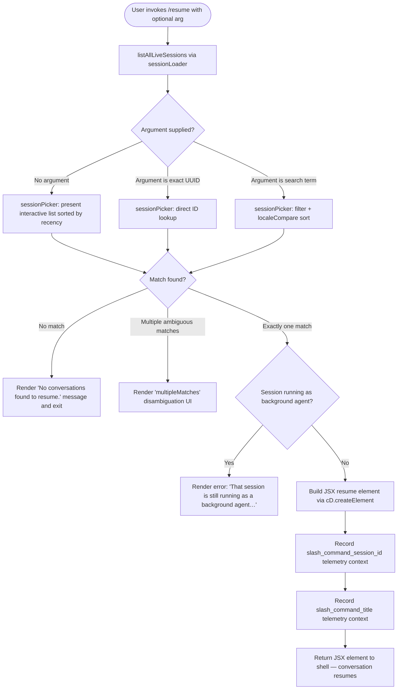

# `/resume`

> Analysis basis: CC v2.1.146 bundle.js (AST extraction + Claude interpretation)
> Minimum version: v2.1.146

---

## Overview

The `/resume` command (aliased as `/continue`) lets the user re-attach to a previous Claude Code conversation by supplying a conversation ID or a free-text search term. It queries all live sessions, matches the requested session, verifies it is not an active background agent, and then reconstructs the conversation context as a JSX element before handing control back to the main interaction loop.

---

## Registration

| Field | Value |
|---|---|
| type | `local-jsx` |
| name | `resume` |
| description | `Resume a previous conversation` |
| aliases | `["continue"]` |
| argumentHint | `[conversation id or search term]` |
| module_id | `TT1` |
| load_inline | `true` |
| loc_byte | `11615697` |
| loc_byte_end | `11615894` |
| loc_line | `9390` |
| arbor_handler.name | `iC7` |
| arbor_handler.fqn | `claude-2.1.146::iC7` |
| arbor_handler.kind | `AsyncFunction` |
| arbor_handler.resolution_path | `module_id` |
| arbor_handler.n_hits | `0` |

Analysis basis: CC v2.1.146 bundle.js:+11615697

---

## Input Branching

The handler has at least four distinct outcomes depending on session lookup results and the running state of the matched session, so a flowchart is used below.



Analysis basis: CC v2.1.146 bundle.js:+11614185 (session filter), +11614289 (session loader), +11614299 (background-agent error literal), +11614734 (no-conversations literal), +11614585 (createElement call), +11614995 (slash_command_session_id), +11615219 (slash_command_title)

---

## Behavioral Spec

### 1. Session Loading (`sessionLoader` / `I4H`)

```
async function sessionLoader():
    await Promise.resolve()
    sessions = await listAllLiveSessions()          // A.listAllLiveSessions
    filter each session through sessionFilter (GT1/H.filter)
    return filtered session array
```

`listAllLiveSessions` returns all persisted conversation records. Sessions are pre-filtered via `sessionFilter` (identifier `GT1`) using `H.filter` before being passed onward.

Analysis basis: CC v2.1.146 bundle.js:+8516114 (listAllLiveSessions), +11614185 (H.filter)

---

### 2. Session Picker (`sessionPicker` / `PyH`)

```
function sessionPicker(sessions, userArg):
    now = Date.now()
    worktrees = runGit(["worktree", "list", "--porcelain"])
        // emits tengu_worktree_detection telemetry
    if userArg starts with "worktree ":
        strip prefix (9 chars), normalize NFC
    candidates = sessions.split(...)
    if userArg:
        exact = candidates.find(s => s.id starts with userArg)
        if exact: return { kind: "found", session: exact }
        filtered = candidates.filter(s => s.id or title includes userArg)
        if filtered.length == 0: return { kind: "sessionNotFound" }
        if filtered.length > 1:  return { kind: "multipleMatches", sessions: filtered }
        return { kind: "found", session: filtered[0] }
    else:
        sorted = candidates.sort(localeCompare by recency)
        return { kind: "list", sessions: sorted }
```

The literal `"worktree "` (with trailing space, length 9) is stripped from the argument when the user references a Git worktree path.
(bundle.js:+11611327 "worktree ", +11611358 value=9, +11611371 "NFC", +11611752 "sessionNotFound", +11611823 "multipleMatches")

Analysis basis: CC v2.1.146 bundle.js:+11611064 (Date.now), +11611099 (worktree runner V_), +11611289 (A.split), +11611485 (H.startsWith), +11611545 (localeCompare)

---

### 3. Main Handler (`resumeHandler` / `iC7`)

```
async function resumeHandler(args, appState):
    sessions = await sessionLoader()                 // I4H
    randomDelay = H(Math.random, setTimeout)         // internal jitter

    result = sessionPicker(sessions, args.trim())    // PyH

    if result.kind == "sessionNotFound" or sessions empty:
        return renderMessage("No conversations found to resume.")

    session = result.session

    // Check whether session is an active background agent
    bgStatus = checkBgSessionStatus(session)         // SH + ZH
    if bgStatus == "running":
        return renderMessage(
            "That session is still running as a background agent. " +
            "Open `claude agents` to attach to it, or stop it there first to resume here."
        )

    // Build conversation context
    element = cD.createElement(resumeComponent, {
        session: session,
        timestamp: Date.now(),
        conversationData: buildConversationContext(session),   // PyH, D_, F28
        fullContext: buildFullContext(session),                 // zX6
        picker: renderSessionPicker(session),                  // xd, gLH
        boldTitle: XT1
    })

    // Attach telemetry context keys
    appState.set("slash_command_session_id", session.id)       // q / zX6
    appState.set("slash_command_title", session.title)         // XT1

    return element
```

Analysis basis: CC v2.1.146 bundle.js:+11614289 (I4H), +11614297 (H), +11614520 (SH), +11614549 (ZH), +11614585 (cD.createElement), +11614611 (Date.now), +11614656 (PyH), +11614660 (D_), +11614674 (F28), +11614835 (Qi), +11614853 (f.filter), +11614867 (yM), +11614961 (kr), +11614973 (h4H), +11614989 (q), +11615040 (zX6), +11615101 (gLH), +11615120 (xd), +11615269 (XT1)

---

### 4. Background-Agent Guard (`bgStatusChecker` / `SH`)

```
function bgStatusChecker(session):
    errorFormatter = n_()           // wraps Error + String
    messageFormatter = mH()         // wraps String
    history = X1(lYA(mH))
    queue = PuK(Db6)                // shift/push circular buffer
    push result to jbH
    on error: $l.logError("error", ...)
    return session status string
```

The guard checks whether the target session's daemon status is `"interactive"` (bundle.js:+8516205). If the session is an active background-agent session (status not `"stopped"` or `"idle"`), the user-visible error message is returned verbatim as described above.

Analysis basis: CC v2.1.146 bundle.js:+961032 (n_), +961045 (mH), +961291 (X1), +961374 (PuK), +961392 (jbH.push), +961432 ($l.logError), +8516205 ("interactive")

---

### 5. Conversation-Context Builder (`contextBuilder` / `F28` → `XZ6`)

```
async function contextBuilder(session, workdir):
    cwd = resolveCwd(N, D_)
    joined = paths.join(H.join, ", ")
    context = await fileContextBuilder(wm1, {
        session,
        worktrees: worktreeMap,
        fileHistory: ByH,
        entries: K.forEach
    })
    return context
```

`wm1` (fileContextBuilder) performs extensive file system traversal: it calls `qL.readdir`, `qL.realpath`, and `qL.stat`; resolves Git worktree paths via `in_`; deduplicates with a `Set` (`D.has` / `D.add`); and assembles structured context objects. File entries are filtered by `nn_.test` regex and size-checked.

Analysis basis: CC v2.1.146 bundle.js:+12607619 (XZ6), +12607754 (wm1), +12607847 (ByH), +12607865 (K.forEach), +12608128 (Promise.all), +12608593 (qL.readdir), +12609308 (qL.realpath)

---

### 6. Session-Data Store Hydration (`storeHydrator` / `h4H` → `R6H`)

On match, the conversation store is hydrated by `R6H` (storeHydrator), which reads and sets many keyed Map entries for the reconstructed session. Known metadata keys written include:

| Key constant | Meaning |
|---|---|
| `"summary"` | Compact conversation summary |
| `"last-prompt"` | Text of the last user prompt |
| `"custom-title"` | User-assigned title |
| `"ai-title"` | AI-generated title |
| `"tag"` | Session tag |
| `"agent-name"` | Sub-agent name |
| `"agent-color"` | Sub-agent colour code |
| `"agent-setting"` | Sub-agent settings blob |
| `"mode"` | Interaction mode |
| `"permission-mode"` | Permission level |
| `"isolation-latch"` | Isolation flag |
| `"worktree-state"` | Associated worktree state |
| `"pr-link"` | Linked pull-request URL |
| `"bridge-session"` | Bridge session flag |
| `"file-history-snapshot"` | Snapshot of file history |
| `"attribution-snapshot"` | Attribution metadata |
| `"content-replacement"` | Content replacement map |
| `"fork-context-ref"` | Fork context reference |
| `"marble-origami-commit"` | Internal snapshot commit ref |
| `"marble-origami-snapshot"` | Internal snapshot blob |
| `"compact_boundary"` | Compact boundary marker |

Analysis basis: CC v2.1.146 bundle.js:+12601245 through +12602849 (R6H key constants)

---

### 7. Session-Picker UI Component (`sessionPickerUI` / `xd`)

```
function sessionPickerUI(sessions, arg):
    candidates = filterSessions(sessions, PyH)
    lowered = H.toLowerCase(arg)
    filtered = f.filter(candidates, s => matchesLower(s, lowered))
    if D.includes(filtered, arg):
        exact = O.get(arg)
        O.set(arg, exact)
    sorted = z.sort(Array.from(O.values()))
    return z.slice(sorted, 0, MAX_DISPLAY)
```

The component caps the displayed candidate list. Sorting is stable via `z.sort`. The search is case-insensitive.

Analysis basis: CC v2.1.146 bundle.js:+12595375 (PyH), +12595379 (D_), +12595393 (wm1), +12595435 (H.toLowerCase), +12595460 (f.filter), +12595560 (D.includes), +12595708 (z.sort), +12595774 (z.slice)

---

### 8. Title Renderer (`titleRenderer` / `XT1`)

```
function titleRenderer(session):
    return j6.bold(session.title or session.id)
```

Wraps the session title in bold terminal formatting for display in the session list.

Analysis basis: CC v2.1.146 bundle.js:+11611787 (j6.bold), +11615269 (XT1 call)

---

## State & Side Effects

| Item | Detail |
|---|---|
| Telemetry — `tengu_worktree_detection` | Fired during worktree path resolution inside `sessionPicker` (bundle.js:+11611208) |
| Telemetry — `tengu_transcript_phantom_parent` | Fired when a transcript entry references a parent UUID that cannot be found (bundle.js:+12600085) |
| Telemetry — `tengu_transcript_parent_cycle` | Fired when a cycle is detected in the parent-UUID chain (bundle.js:+12603648) |
| Telemetry — `tengu_chain_parent_cycle` | Fired on cycle detection during chain building (bundle.js:+12582141) |
| Telemetry — `tengu_chain_timestamp_fallback` | Fired when timestamp ordering falls back to insertion order (bundle.js:+12582290) |
| Telemetry — `tengu_chain_parallel_tr_recovered` | Fired when a parallel tool-result message is re-linked (bundle.js:+12584156) |
| Telemetry — `tengu_relink_walk_broken` | Fired when the relink walk encounters a broken link (bundle.js:+12581651) |
| appState changes | `slash_command_session_id` set to the matched session ID (bundle.js:+11614995); `slash_command_title` set to the session title (bundle.js:+11615219) |
| Hook registration | None observed within depth-2 traversal |
| Sound | None observed within depth-2 traversal |
| File I/O | `qL.readdir`, `qL.stat`, `qL.readFile`, `qL.realpath` called during context reconstruction; transcript files read from disk via `Ni7` / `Vy.openSync` / `Vy.readSync` |
| Background-agent guard | Aborts resume with user-visible message if target session's daemon state is `"interactive"` (not stopped); user directed to `/agents` (bundle.js:+11614299) |

---

## Version History

| Version | Change |
|---|---|
| v2.1.146 | Initial analysis |

---

## Common Mistakes

1. **Supplying a partial ID that matches multiple sessions**: The command returns a disambiguation UI (`multipleMatches`) rather than picking the most-recent match. Provide a longer prefix or the full UUID to avoid ambiguity.
2. **Attempting to resume a background-agent session**: If the target session is currently running as a background agent, `/resume` is blocked. Use `/agents` to attach or stop the session first, then invoke `/resume`.
3. **Using `/continue` expecting different behaviour from `/resume`**: The two command names are pure aliases registered at the same handler; behaviour is identical.
4. **Omitting the argument expecting a default**: Without an argument, the command presents an interactive list sorted by recency. In non-interactive/pipe contexts this list may not be actionable — supply an explicit ID or search term.
5. **Expecting instant availability of very recent sessions**: `listAllLiveSessions` reads from the on-disk transcript store; sessions created within the current millisecond window may not yet be fully flushed.

---

## Appendix — Identifier Mapping

> For bundle debugging only. Identifiers change across versions.

| Identifier | Role |
|---|---|
| `iC7` | Main async handler for `/resume` (arbor_handler) |
| `GT1` | Session pre-filter function applied before picker |
| `I4H` | Session loader — calls `listAllLiveSessions`, returns filtered array |
| `PyH` | Session picker — matches user arg against session list, returns result kind |
| `V_` | Conversation-runner / context bootstrap |
| `v2H` | Sub-process / child-process spawner utility |
| `SH` | Background-agent status checker |
| `ZH` | Session status string formatter (wraps `String`) |
| `F28` | Conversation-context assembler entry point |
| `XZ6` | Context builder — resolves paths, calls `wm1` and `ByH` |
| `wm1` | File-context builder — `readdir`/`stat`/`realpath` traversal |
| `ByH` | File-history snapshot builder (Buffer ops) |
| `h4H` | Session-store hydrator dispatcher |
| `R6H` | Store hydrator — writes all metadata Map keys |
| `xd` | Session-picker UI component |
| `gLH` | Session-list rendering helper |
| `XT1` | Session title renderer (bold formatting) |
| `zX6` | Full-context assembler — reads all store Map entries |
| `Dm1` | Context-assembly coordinator (calls `ki7` + `R6H`) |
| `ki7` | Working-directory resolver for context assembly |
| `yM` | Utility used in session filtering and context building |
| `kr` | Conversation-chain reader |
| `Qi` | Regex-based session-ID validator (`JvL.test`) |
| `D_` | Path resolver utility |
| `uV` | Low-level path helper |
| `D` | Daemon spawn / process-pool manager |
| `N6` | Daemon-pool node initialiser |
| `_HA` | Background PTY host spawner |
| `w` | Worker/session lifecycle manager |
| `AHA` | Session claim + connect handler |
| `$HA` | Session teardown / roster cleanup |
| `N` | Logger / environment-info helper |
| `SU8` | Child-process stdio stream builder |
| `MjA` | Numeric validation helper (`Number.isFinite`) |
| `Rq6` | Child-process error handler |
| `fjA` | Timeout-race wrapper (`Promise.race`) |
| `$jA` | Process kill helper |
| `ujA` | Parallel-stream awaiter (`Promise.all`) |
| `bjA` | Pipe setup helper |
| `xjA` | Stream-sink adder |
| `lu1` | Transcript chain loader |
| `zi7` | Chain-walk helper |
| `y4H` | Chain builder — constructs ordered message list |
| `ji7` | Chain deduplication and sort helper |
| `Yi7` | Chain shift/merge helper |
| `$m1` | Chain map-set helper |
| `Ni7` | Low-level transcript binary parser (file I/O) |
| `vi7` | Transcript entry binary deserialiser |
| `Ii7` | Transcript header reader |
| `Ym1` | Transcript timestamp extractor |
| `TrH` | Transcript message mapper |
| `Ai_` | Compact-summary text transformer |
| `FT6` | Message-content block parser |
| `Ki_` | Message filter (image/document exclusion) |
| `ln_` | Combined context-enrichment pipeline |
| `NG8` | Store Map getter (H.get → q.get) |
| `IG8` | Store Map values extractor (`Array.from`) |
| `vG8` | Session date parser (`Date.parse`) |
| `f_` | Generic identity/passthrough helper |
| `lS` | Session-locking primitive |
| `en7` | Session event emitter |
| `hX` | Conversation-index helper |
| `PqA` | Markdown/text post-processor |
| `jqA` | Inline-code detector |
| `JqA` | Link-text replacer |
| `g6` | JSON-parse wrapper |
| `l9` | Logger level helper (`L8`) |
| `R2H` | Stream-protocol framer |
| `IUK` | Frame-type discriminator |
| `kUK` | Frame parser (indexOf / concat) |
| `hUK` | JSON-frame parser |
| `yUK` | Binary-frame parser |
| `mH` | String-coercion wrapper |
| `n_` | Error-string formatter |
| `X1` | History-list builder |
| `lYA` | History-entry formatter |
| `PuK` | Circular-buffer manager (shift/push) |
| `lpK` | String-padding helper |
| `JI` | Session-join helper |
| `$wK` | Environment / config reader |
| `CH` | JSON-stringify wrapper |
| `O4` | Path-redaction helper (`[REDACTED]`) |
| `NRH` | Worker-thread result handler |
| `YwK` | File-write pipeline |
| `in_` | Recursive directory reader |
| `$Z6` | Map get/set/values cache |
| `iO` | Path-normaliser (replace + slice) |
| `gJH` | Context-slice assembler |
| `W9` | Worktree-path filter |
| `p3` | Path existence checker |
| `gy` | Low-level path join helper |
| `$T` | Directory-listing helper |
| `Yg` | Projects-directory path builder |
| `G` | Skill/event bus manager |
| `K` | Column-padding formatter |
| `j` | Process-values iterator |
| `P` | Socket-buffer manager |
| `X` | MCP SDK connection handler |
| `J` | Stream wrapper |
| `T` | Tool-invocation wrapper |
| `Y` | Supervisor write handler |
| `W` | Remote-control event handler |
| `M` | MCP server manager |
| `_kH` | MCP client connector |
| `z4K` | MCP config applier |
| `_O5` | MCP server-list reconciler |
| `z` | Background-session controller |
| `bH` | Feature-flag "ok" reporter |
| `uH` | Feature-flag "bad" reporter |
| `Mk` | Daemon-control event emitter |
| `ix` | Graceful-shutdown race handler |
| `O` | Output-stream writer |
| `v8` | Output-stream helper |
| `C` | Worker write-stream |
| `x` | Retire-if-settled helper |
| `Q` | File-history queue |
| `hG6` | File-history read helper |
| `IY1` | File-history unlink helper |
| `I` | Away-summary trigger |
| `uz8` | Rate-limit state reader (`erH.getState`) |
| `mL5` | Away-summary metrics logger |
| `ge1` | Away-summary generator call |
| `Sq8` | Away-summary session watcher |
| `a71` | UUID generator (`qV.randomUUID`) |
| `F` | Message-slice accessor |
| `h` | Blur/focus session manager |
| `wg` | Focus-event helper |
| `d` | Tool-permission tracker |
| `Ao_` | Orphaned-permission cleaner |
| `i` | Permission-store entry |
| `g` | MCP-tool filter helper |
| `aH` | MCP-tool list accessor |
| `DH` | MCP permission-map reader |
| `rE6` | Memory / platform probe |
| `s` | Audio-stream WebSocket holder |
| `KH` | Audio-stream encoder |
| `o` | Voice-session manager |
| `e` | Voice-focus silence handler |
| `t` | Voice-toggle silence handler |
| `_H` | Voice-max-duration cap handler |