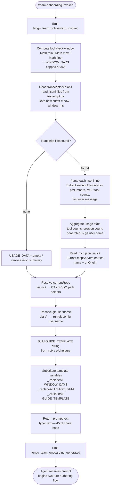

# `/team-onboarding`

> Analysis basis: CC v2.1.146 bundle.js (AST extraction + Claude interpretation)
> Minimum version: v2.1.146

---

## Overview

`/team-onboarding` is a `prompt`-type slash command that reads the invoking user's local Claude Code session transcripts (up to a configurable look-back window), synthesises a usage profile, and instructs the agent to co-author a personalised `ONBOARDING.md` guide that a teammate can paste directly into Claude Code for an interactive walkthrough. The command gathers transcript data, MCP server configuration, and repository context, then injects them into a structured prompt that drives a two-turn collaborative authoring flow.

---

## Registration

| Field | Value |
|---|---|
| type | `prompt` |
| name | `team-onboarding` |
| description | Help teammates ramp on Claude Code with a guide from your usage |
| isHidden | `false` |
| handler_method | `getPromptForCommand` |
| handler_method_start (byte) | 12397417 |
| handler_method_end (byte) | 12398127 |
| loc_byte | 12397079 |
| loc_byte_end | 12398128 |
| loc_line | 10625 |
| prompt_body.length | 4539 characters |
| prompt_body.trace | `identifier→$ (local→1 ext vars)` |
| arbor_handler.name | `getPromptForCommand` |
| arbor_handler.kind | Method |
| arbor_handler.fqn | `claude-2.1.146::getPromptForCommand` |
| arbor_handler.resolution_path | `direct` |
| arbor_handler.n_hits | 2 |
| `handler_method_start` | `12397417` |
| `handler_method_end` | `12398127` |

Analysis basis: CC v2.1.146 bundle.js:+12397079

---

## Input Branching

The handler executes more than three distinct data-gathering paths before constructing the final prompt string. A Mermaid flowchart is used to capture the branching shape.



Analysis basis: CC v2.1.146 bundle.js:+12397417

---

## Behavioral Spec

### 1. Handler Entry and Window Calculation

The `getPromptForCommand` method is the handler (resolved directly by Arbor). On invocation it immediately fires the `tengu_team_onboarding_invoked` telemetry event, then calculates the look-back window in days.

```
function getPromptForCommand(context):
    emit("tengu_team_onboarding_invoked")

    raw_days   = context.windowDays ?? DEFAULT_WINDOW
    window_days = Math.floor(Math.max(1, Math.min(raw_days, 365)))
    # Maximum window: 365 days (bundle.js:+12397666)
    cutoff_ms  = Date.now() - (window_days * 24 * 60 * 60 * 1000)

    usage_data = collectTranscripts(cutoff_ms)
    mcp_info   = readMcpConfig()
    repo_name  = resolveCurrentRepo()
    git_user   = resolveGitUser()
    guide_tmpl = buildGuideTemplate()

    prompt = substituteTemplateVars(
        BASE_PROMPT,
        window_days, usage_data, guide_tmpl
    )
    emit("tengu_team_onboarding_generated")
    return { type: "text", content: prompt }
```

Analysis basis: CC v2.1.146 bundle.js:+12397620 (Math.min/max/floor), +12397666 (365 literal), +12397677 (invoked event), +12397996 (generated event), +12398111 (type:"text")

---

### 2. Transcript Collection (`collectTranscripts` / `ab1`)

Reads all `.jsonl` files from the Claude Code transcript directory that fall within the computed time window.

```
function collectTranscripts(cutoff_ms):
    dir_entries = fs.readdir(transcriptDir)                 # async
    jsonl_files = dir_entries.filter(f => extname(f) == ".jsonl")
    # Extension filter: ".jsonl" (bundle.js:+12386030)

    results = []
    for file in jsonl_files:
        stat = fs.stat(join(transcriptDir, file))
        if not stat.isFile():
            continue
        raw = fs.readFile(join(transcriptDir, file))
        lines = raw.split("\n")
        # Line limit hint: up to 10 lines inspected per session (bundle.js:+12386426)
        for line in lines:
            if line includes known marker:
                parse session descriptor
                extract: title, prNumbers, firstUserMessage,
                         toolCounts, mcpToolCounts
        results.append(sessionSummary)

    # MCP tool detection: scans for "\"name\":\"mcp__" prefix
    # (bundle.js:+12386609)
    # Content block detection: scans for "\"content\":[" marker
    # (bundle.js:+12386959)
    # Minimum sessions for breakdown: ~3 sessions (bundle.js:+12387062)

    return aggregateSessionData(results, cutoff_ms)
```

Key time constants used in cutoff arithmetic:
- Hours per day: 24 (bundle.js:+12385915)
- Minutes per hour: 60 (bundle.js:+12385918)
- Milliseconds per second: 1000 (bundle.js:+12385924)

Analysis basis: CC v2.1.146 bundle.js:+12385902 (Date.now), +12385943 (readdir), +12386049 (Promise.all map), +12386286 (readFile), +12386400 (split lines)

---

### 3. MCP Configuration Reader (`lc7`)

Reads the workspace `.mcp.json` file to enumerate configured MCP servers.

```
function readMcpConfig():
    path = join(workspaceRoot, ".mcp.json")    # ".mcp.json" (bundle.js:+12388141)
    try:
        raw  = fs.readFile(path, "utf8")       # encoding "utf8" (bundle.js:+12388154)
        obj  = JSON.parse(raw)
        servers = obj["mcpServers"] ?? {}      # key "mcpServers" (bundle.js:+12388197)
        return servers   # { name → { urlOrigin?, ... } }
    catch:
        return {}
```

Analysis basis: CC v2.1.146 bundle.js:+12388117 (readFile), +12388130 (join), +12388164 (JSON.parse via g6), +12388293 (error guard via J8)

---

### 4. Repo and Git-User Resolution (`nc7` / `OT` / `V_`)

Determines the current repository name and the guide author's identity.

```
function resolveCurrentRepo():
    # OT: joins Claude projects dir with a 36-char UUID-derived segment
    # (bundle.js:+12388449, number 36 at bundle.js:+991828)
    # "projects" path component (bundle.js:+991981)
    projects_dir = join(claudeDataDir, "projects")
    repo_path    = oV(projects_dir)   # resolves symlinks / normalises
    return basename(repo_path)

function resolveGitUser():
    # V_ runs: git config user.name  (bundle.js:+12388780)
    # then:    git remote get-url origin  (bundle.js:+12388836, +12388845, +12388855)
    result = spawnSync("git", ["config", "user.name"])
    git_user = parseGitOutput(result)
    return git_user ?? null     # null → omit name from guide
```

Analysis basis: CC v2.1.146 bundle.js:+12388442 (D_ / uV), +12388449 (OT), +12388580 (lc7), +12388731 (cc7), +12388761 (V_), +12388764 ("git"), +12388771 ("config"), +12388780 ("user.name"), +12388952 (basename)

---

### 5. Template Variable Substitution

After all data is gathered, three placeholder tokens in the base prompt are replaced:

```
function substituteTemplateVars(base, window_days, usage_data, guide_tmpl):
    s = base.replaceAll("{{WINDOW_DAYS}}", String(window_days))
    # literal "{{WINDOW_DAYS}}" (bundle.js:+12397877)
    s = s.replaceAll("{{GUIDE_TEMPLATE}}", guide_tmpl)
    # literal "{{GUIDE_TEMPLATE}}" (bundle.js:+12397917)
    s = s.replaceAll("{{USAGE_DATA}}", JSON.stringify(usage_data))
    # literal "{{USAGE_DATA}}" (bundle.js:+12397952)
    return s
```

Analysis basis: CC v2.1.146 bundle.js:+12397864 (replaceAll), +12397895 (String cast), +12397877, +12397917, +12397952

---

### 6. Agent-Side Two-Turn Authoring Flow

The assembled prompt instructs the agent to execute a structured two-turn collaborative flow. The following is a paraphrase of the prompt's five-step task (4539-character prompt body; bundle.js:+12397079–12398127):

**Turn 1 — Immediate draft:**

```
Step 1: Output acknowledgment line immediately
        ("Looking at how you've used Claude over the last N days …")
        → No tool calls, no reasoning before this line.

Step 2: Classify sessions from sessionDescriptors into task types:
        build_feature | debug_fix | improve_quality |
        analyze_data  | plan_design | prototype | write_docs
        → Display top 3–5 with rough percentages.
        → Title-case in rendered output ("Build Feature", not "build_feature").
        → If ~0 sessions: leave breakdown as TODO.

Step 3: Gather remaining pieces:
        - Repos: start with currentRepo, check sibling directories.
        - MCP servers: derive access instructions from name + urlOrigin.
        - Team Tips and Get Started: leave as TODO placeholders.

Step 4: Write guide to ONBOARDING.md following the injected GUIDE_TEMPLATE.
        - Use real numbers from usage_data (no placeholders).
        - Use generatedBy for author name; omit if missing.
        - ASCII bar charts: █ filled, ░ empty, 20 chars wide.

Step 5: Render guide in a code block, then add --- and **Review** section.
        Ask exactly three numbered questions:
          1. Confirm or request team name.
          2. Starter task for newcomers (ticket / doc link — optional).
          3. Team tips not already in CLAUDE.md.
```

**Turn 2 — Incorporate feedback:**

```
After user answers Review questions:
    update ONBOARDING.md with: team name, tips, starter task
    close with exact line:
        "Saved to `ONBOARDING.md`. Drop it in your team docs …"
    apply any subsequent edit requests to the file.
```

Analysis basis: CC v2.1.146 bundle.js:+12397417–12398127

---

## State & Side Effects

| Item | Detail |
|---|---|
| Telemetry: `tengu_team_onboarding_invoked` | Fired once at handler entry (bundle.js:+12397677) |
| Telemetry: `tengu_team_onboarding_generated` | Fired after prompt assembly completes (bundle.js:+12397996) |
| Telemetry: `tengu_flint_harbor_prompt` | Fired from the N6 call-path at prompt-dispatch (bundle.js:+12397454) |
| Telemetry: `tengu_flint_harbor_share` | Fired from the yoH/N6 share path (bundle.js:+9224710) |
| Telemetry: `tengu_config_parse_error` | Emitted if config read fails inside Y$H (bundle.js:+3171293) |
| Telemetry: `tengu_config_lock_contention` | Emitted if config lock is slow to acquire (bundle.js:+3168712) |
| Telemetry: `tengu_config_stale_write` | Emitted on stale write detection (bundle.js:+3168848) |
| Telemetry: `tengu_config_auth_loss_prevented` | Emitted when auth-loss guard triggers (bundle.js:+3169191) |
| File writes | Agent writes `ONBOARDING.md` in the workspace during Turn 1 and updates it in Turn 2 |
| File reads | `.jsonl` transcript files (async, Promise.all), `.mcp.json`, config file |
| appState changes | None observed in depth-2 traversal |
| Hook registration | `c9` → `c_A.register` (bundle.js:+57267) — file-watch hook registration via `cB4` watcher path |
| Sound | None observed |
| Config lock | `dK_` acquires a file lock; warns if contention exceeds threshold |
| Backup rotation | `dK_` rotates config backups; retains last 5 (bundle.js:+3169642); uses `.backup.` infix (bundle.js:+3169509) |

---

## Version History

| Version | Change |
|---|---|
| v2.1.146 | Initial analysis |

---

## Common Mistakes

1. **Running in a directory with no transcript history.** If the transcript directory contains no `.jsonl` files within the window, the usage data will be empty and the generated guide will have a TODO placeholder for the work-type breakdown. Run `/team-onboarding` from a project directory where Claude Code has been actively used.

2. **Missing `git config user.name`.** The guide author name comes from `git config user.name`. If that is not set, the `generatedBy` field will be absent and the guide will omit the author name silently — not an error.

3. **No `.mcp.json` present.** If the workspace has no `.mcp.json`, the MCP server section of the guide will be empty. This is expected and not an error; the agent leaves it blank or omits it.

4. **Expecting instant classification questions.** The prompt explicitly instructs the agent to output the acknowledgment line and a full draft *before* asking any clarifying questions. Users who expect a Q&A first will find the command proceeds directly to a complete draft.

5. **Editing `ONBOARDING.md` externally between turns.** The guide file is written during Turn 1 and updated during Turn 2. External edits between the two turns may be overwritten when the agent applies Review answers.

6. **Window-day cap.** The look-back window is capped at 365 days (bundle.js:+12397666) regardless of the value passed. Requesting a longer window has no effect.

---

## Appendix — Identifier Mapping

> For bundle debugging only. Identifiers change across versions.

| Identifier | Role |
|---|---|
| `__handler_team-onboarding` | Synthetic BFS entry point for the handler; not a real bundle symbol |
| `N6` | Prompt-dispatch / harbor-prompt core function |
| `gf6` | Sub-helper called from prompt-dispatch (role unclear at depth-2) |
| `Qf6` | Sub-helper called from prompt-dispatch (role unclear at depth-2) |
| `Tt` | Template or token formatter called from prompt-dispatch |
| `mH` | String normalisation utility |
| `qg` | Session/conversation context accessor |
| `Tm` | Context resolution helper (calls kU4, dO, Zq6) |
| `Ga6` | Deduplication / caching gate for prompt dispatch |
| `TK_` | Prompt event emitter / session initialiser |
| `RGH` | Sub-helper inside TK_ (role unclear at depth-2) |
| `Gm` | Random-bytes / hex-token generator |
| `CH` | JSON serialiser wrapper (calls JSON.stringify) |
| `PB4` | Post-emit cleanup or state update in TK_ |
| `NK_` | Follow-up handler after dedup gate |
| `sP9` | Sub-helper in NK_ (calls HUH) |
| `e_` | Async helper in NK_ (calls gu) |
| `xI9` | Sub-helper in NK_ (role unclear at depth-2) |
| `KbH` | Set-membership checker (calls qxK.has) |
| `m6` | Transcript data loader / file orchestrator |
| `Q6` | Async queue or promise coordinator |
| `pK_` | Path or key helper |
| `Y$H` | Config file reader and parser |
| `q` | Filesystem module alias |
| `g6` | JSON.parse wrapper |
| `AC` | String prefix stripper (startsWith + slice) |
| `L8` | Logger utility |
| `rI9` | Directory scanner for sibling repos |
| `N` | Prompt/message formatter (multi-purpose) |
| `SH` | Error-safe executor / try-catch wrapper |
| `c` | General-purpose async context/config accessor |
| `cK_` | Path join helper (wraps hY.join + i8) |
| `w` | Daemon / background-process manager |
| `cB4` | File watcher setup (watchFile / unwatchFile) |
| `zn` | Sub-helper in cB4 (role unclear at depth-2) |
| `c9` | Hook registration caller (calls c_A.register) |
| `K8` | Top-level transcript collection orchestrator |
| `dK_` | Config file lock-and-write manager |
| `L` | Async lock / file-set manager |
| `f` | Session/connection object (close, finally) |
| `jA9` | Object merge helper (calls Object.assign) |
| `os8` | Sub-helper in jA9 (calls wA9) |
| `if6` | Sub-helper called from K8 and dK_ |
| `A` | Map/registry of active processes or connections |
| `Z` | String with startsWith check in dK_ |
| `X` | Multi-step async pipeline (Promise.all, SH, n_) |
| `Yv8` | Sub-helper in X pipeline |
| `n_` | Error/string coercion utility |
| `V` | Array slice target in dK_ |
| `hq6` | Atomic file-write helper (open/write/fsync/rename) |
| `O` | fs.Stats wrapper |
| `J8` | Error guard / fallback value helper |
| `H` | Random-delay / retry helper (Math.random + setTimeout) |
| `bUH` | Sub-helper in K8 (role unclear at depth-2) |
| `iI9` | Object.entries iterator in K8 |
| `xUH` | Timestamp accessor (Date.now) |
| `QK_` | Symlink-safe file writer (calls hq6) |
| `nc7` | Main data-collection coordinator for the handler |
| `D_` | Sub-helper in nc7 (calls uV) |
| `uV` | Base utility called from D_ |
| `OT` | Projects-dir path resolver |
| `oV` | Path normaliser (join + i8) |
| `iO` | Path segment transformer (replace + slice + euK) |
| `euK` | Absolute-value path helper (Math.abs + YbH) |
| `ab1` | Async transcript file reader and parser |
| `l9` | Logger/error reporter (calls L8) |
| `K` | Array map with padding (map + padEnd) |
| `$` | Top-level async context object (zS1, dispose) |
| `zS1` | Session-level async wrapper (Date.now, M1, GE6, CH) |
| `z` | Daemon-control composite (bH, uH, Mk, ix) |
| `bH` | Sub-component of daemon control |
| `uH` | Sub-component of daemon control |
| `Mk` | Event-push helper (qg, _g.push, RGH, GK_) |
| `ix` | Shutdown / race-condition handler (Promise.race, process.exit) |
| `D` | Background-process lifecycle manager |
| `rE6` | OS-detection helper (macos branch, bundle.js:+12414185) |
| `_HA` | Daemon spare-process spawner (Bun.spawn) |
| `lc7` | `.mcp.json` reader |
| `cc7` | Sub-step in nc7 data collection (role unclear at depth-2) |
| `V_` | Git command runner (spawns git config / git remote) |
| `v2H` | Child-process spawn library (execa-like) |
| `ejA` | Platform detection / command builder in v2H |
| `kU8` | Stream handler A in v2H |
| `yU8` | Stream handler B in v2H (stdout/stderr) |
| `SU8` | Stream initialiser in v2H |
| `MjA` | Numeric validator (Number.isFinite) |
| `Rq6` | Promise rejection classifier |
| `IU8` | Reflect.apply dispatcher |
| `pjA` | Process 'exit' event listener binder |
| `fjA` | Timeout race wrapper for child process |
| `$jA` | Kill-on-timeout handler |
| `KjA` | stdin write binder |
| `LjA` | SIGKILL sender |
| `ujA` | Parallel stream drainer (Promise.all) |
| `uq6` | Buffer accumulator (fU8) |
| `bjA` | Pipe connector (A.pipe) |
| `xjA` | AbortSignal / add listener |
| `DjA` | stdout/stderr stream binder (PU8) |
| `lpK` | String coercion helper in V_ |
| `JI` | Sub-helper in V_ (role unclear at depth-2) |
| `k2H` | Git output parser (trim, match, startsWith, toLowerCase) |
| `PUK` | URL/host extractor (indexOf + slice) |
| `uq` | String slice helper (indexOf + slice) |
| `yoH` | Guide-template builder (calls X1, oA, N6) |
| `X1` | Template string assembler (calls lYA) |
| `lYA` | Low-level string formatter (calls mH) |

---

Note: index built via Arbor fallback; some signals (telemetry, literals) may be missing — see arbor-fallback.js.