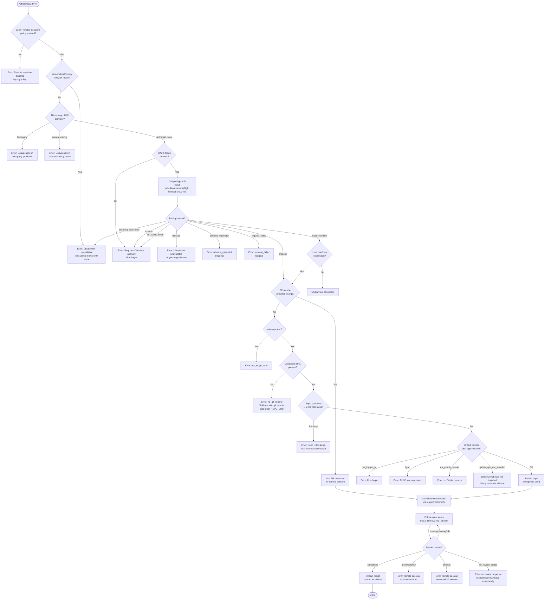

# `/ultrareview`

> Analysis basis: CC v2.1.145 bundle.js (AST extraction + Claude interpretation)
> Minimum version: v2.1.145

---

## Overview

`/ultrareview` is a cloud-powered bug-finding command that bundles the current git branch (or an explicitly referenced GitHub Pull Request), uploads the code to a remote Claude Code web session, and streams back verified bug findings. It runs entirely in Claude Code on the web — not locally — and requires a Claude.ai account, a GitHub remote, and organizational policy that permits remote sessions. Estimated cost is shown in the description as a USD range, and the expected runtime is approximately 10–20 minutes.

---

## Registration

| Field | Value |
|---|---|
| type | `local-jsx` |
| name | `ultrareview` |
| description | `" ... · Est. cost ... USD · Finds and verifies bugs in your branch. Runs in Claude Code on the web. See ..."` |
| loc_byte | `11315700` |
| loc_byte_end | `11315959` |
| loc_line | `6778` |
| module_id | `lXq` |
| load_inline | `true` |
| arbor_handler.name | `Ok7` |
| arbor_handler.fqn | `claude-2.1.145::Ok7` |
| arbor_handler.kind | `AsyncFunction` |
| arbor_handler.resolution_path | `module_id` |
| arbor_handler.n_hits | `1` |

Analysis basis: CC v2.1.145 bundle.js:+11315700

---

## Input Branching

The command has many distinct precondition branches (policy check, auth check, network mode check, provider check, data-residency check, git-repo check, remote-URL check, repo-size check, preflight API check, PR-number vs. full-bundle path, overage dialog, confirmation dialog) — a Mermaid flowchart is used.



Analysis basis: CC v2.1.145 bundle.js:+11313390 (handler entry), +11274037 (preflight logic), +11276432 (repo-size check), +11281226 (remote session launch/poll)

---

## Behavioral Spec

### 1. Policy and Network Precondition Check

Performed by the main handler (`Ok7`) immediately on invocation.

```
async function ultrareviewHandler(args, appState):
    # Check org remote-session policy
    if not appState.settings["allow_remote_sessions"]:
        display error: "Remote sessions are disabled by your organization's policy..."
        emit telemetry: tengu_review_remote_precondition_failed
        return

    # Check network mode (essential-traffic header)
    networkMode = resolveNetworkMode()   # checks "essential-traffic" / "no-telemetry" headers
    if networkMode == "essential-traffic-only":
        display error: "Ultrareview unavailable in essential-traffic-only mode"
        return
```

Analysis basis: CC v2.1.145 bundle.js:+11313393 (`allow_remote_sessions`), +11313427 (policy error string), +959942 (`essential-traffic` literal)

---

### 2. Provider / Auth Validation and Preflight API Call

Handled by the preflight sub-routine (`EXq`) reached through `HF_`.

```
async function runPreflight(context):
    # Provider gate
    if provider == "zdr" or feature flag "data-residency" active:
        return { status: "blocked", reason: "data_residency" }
    if provider is third-party (not Anthropic cloud):
        return { status: "blocked", reason: "Unavailable on third-party providers" }

    # Auth gate
    oauthToken = getOAuthToken()
    if not oauthToken:
        return { status: "no-auth", reason: "Ultrareview requires a Claude.ai account. Run /login." }

    # Call backend preflight
    response = HTTP.POST("/v1/ultrareview/preflight",
                         headers={"teleport-org": orgId},
                         timeout=5000)

    emit telemetry: api_ultrareview_preflight   # literal at +11274733

    match response.status:
        "blocked"               → return blocked error
        "essential-traffic-only"→ return ETM error
        "no_oauth_token"        → return auth error
        "schema_mismatch"       → log schema_mismatch, surface error
        "request_failed"        → log request_failed, surface error
        "needs-confirm"         → prompt cost confirmation dialog
        "proceed"               → continue

    emit telemetry: tengu_review_bughunter_config
```

Analysis basis: CC v2.1.145 bundle.js:+11274037 (`TXq`/preflight logic), +11274112 (`/v1/ultrareview/preflight`), +11274169 (timeout `5000`), +11273459 (`tengu_review_bughunter_config`)

---

### 3. Cost Confirmation Dialog

When the preflight response is `needs-confirm`, a dialog is shown before proceeding. Estimated cost range `$10-$20` and estimated time `~10–20 min` are displayed.

```
function showConfirmationDialog(preflightData):
    display dialog:
        cost_range = "$10-$20"         # literal at +11273576
        estimated_time = "~10–20 min"  # literal at +11273668
        action_buttons = ["confirm", "cancel"]

    if user selects "cancel":
        display: "Ultrareview cancelled."   # literal at +11314334
        emit telemetry: (no explicit cancel event observed at depth-2)
        return CANCELLED

    emit telemetry: tengu_review_overage_dialog_shown   # +11314029
    return CONFIRMED
```

Analysis basis: CC v2.1.145 bundle.js:+11278281 (`confirm`), +11278348 (`needs-confirm`), +11273576 (`$10-$20`), +11314029 (`tengu_review_overage_dialog_shown`)

---

### 4. Repository Eligibility Check (No-PR Path)

Executed by `sc1` (background eligibility checker) when no explicit PR number is given.

```
async function checkRepoEligibility(context):
    # Git repo check
    isGitRepo = runGitCommand("rev-parse", "--is-inside-work-tree")
    if not isGitRepo:
        return { reason: "not_in_git_repo" }

    # Remote URL check
    remoteUrl = runGitCommand("config", "--get", "remote.origin.url")
    if not remoteUrl:
        emit message: "No git remote URL found"
        return { reason: "no_git_remote",
                 hint: "Background tasks require a GitHub remote. Add one with `git remote add origin REPO_URL`." }

    # Auth + GitHub App check
    if not loggedIn:
        return { reason: "not_logged_in",
                 hint: "Please run /login and sign in with your Claude.ai account (not Console)." }
    if usingBYOC:
        return { reason: "byoc" }
    if not githubAppInstalled:
        return { reason: "github_app_not_installed" }

    emit telemetry: tengu_ccr_bundle_seed_enabled
    return ELIGIBLE
```

Analysis basis: CC v2.1.145 bundle.js:+8691947 (`rev-parse`, `--is-inside-work-tree`), +8694117 (`Uq` call in `sc1`), +8694304 (`not_logged_in`), +8694490 (`byoc`), +8694646 (`not_in_git_repo`), +8694739 (`no_git_remote`), +8694835 (`github_app_not_installed`), +8694582 (`tengu_ccr_bundle_seed_enabled`)

---

### 5. Repo Size Check and Git Bundle Creation

Handled by `xl1` → `bl1` → `Cl1` (size check) and `_k_` (bundle upload).

```
async function checkRepoSizeAndBundle(context):
    # Count loose objects
    objectStats = runGitCommand("count-objects", "-v")
    sizeKB = parseSize(objectStats)
    packBytes = sizeKB * 1024

    emit telemetry: tengu_ccr_bundle_max_bytes  # +8732651

    if packBytes > 5_000_000:   # literal at +8733177
        display error: "Repo is too large to bundle. Push a PR and use `/ultrareview <PR#>` instead."
        # Also surface: "Repo is too large. Push a PR and use `/ultrareview <PR#>` instead."
        return TOO_LARGE         # status "too_large" at +8751164

    # Check for empty repo (no commits)
    hasCommits = runGitCommand("for-each-ref", "--count=1", "refs/")
    if not hasCommits:
        display error: "Repository has no commits yet"
        return EMPTY_REPO

    # Create stash bundle
    stashRef = runGitCommand("stash", "create")
    # Upload seed bundle
    bundlePath = writeBundleFile("ccr-seed.bundle")
    uploadResult = uploadBundleToRemote(bundlePath)

    emit telemetry: tengu_ccr_bundle_upload   # +8736028

    match uploadResult.mode:
        "head"             → use HEAD bundle
        "fallback_head"    → use fallback HEAD bundle
        "squashed"         → use squashed bundle
        "fallback_squashed"→ use fallback squashed bundle

    emit telemetry: tengu_teleport_bundle_mode  # +8751238
    return { bundleMode: uploadResult.mode }
```

Analysis basis: CC v2.1.145 bundle.js:+8732736 (`count-objects`), +8733177 (`5000000`), +11276506 (too-large error string), +8735938 (`for-each-ref`), +8736220 (`stash`/`create`), +8736874 (`ccr-seed`), +8737471 (`success`), +8751238 (`tengu_teleport_bundle_mode`)

---

### 6. Remote Session Launch (teleportToRemote)

The core teleport function `fLH` orchestrates environment selection, session creation, and bundle upload.

```
async function teleportToRemote(bundleInfo, context):
    # Resolve cloud environment
    envList = fetchEnvironmentList()   # teleport_environments_list
    if envList is empty:
        # Auto-create default environment
        createDefaultEnv({
            name: "Default",
            runtime: { python: "3.11", node: "20" },
            workdir: "/home/user"
        })
        emit telemetry: teleport_default_environment_create  # +8690800
    env = selectEnvironment(envList)
    if no env:
        display warn: "Could not create a cloud environment. Set one up at https://claude.ai/code/onboarding?magic=env-setup"
        return

    # Set API headers for session request
    headers = {
        "anthropic-beta": "ccr-byoc-2025-07-29",   # +8750828
        "x-organization-uuid": orgUuid,              # +8750850
        "Content-Type": "application/json",
        "anthropic-version": "2023-06-01"
    }

    # POST session creation
    sessionResponse = HTTP.POST(sessionEndpoint, { envId, bundleInfo, ... })
    if sessionResponse.status not in [200, 201]:
        if status in [401, 403, 429]:
            handle auth/rate error
        return SESSION_CREATE_FAILED

    sessionId = sessionResponse.body.id
    if not sessionId:
        throw Error: "Server returned a malformed session response (no session id)"

    emit telemetry: tengu_ccr_session_link  # +8745636
    emit telemetry: tengu_teleport_source_decision  # +8756239

    return sessionId
```

Analysis basis: CC v2.1.145 bundle.js:+8750010 (`fLH` entry), +8690000 (`teleport_environments_list`), +8690800 (`teleport_default_environment_create`), +8750828 (`ccr-byoc-2025-07-29`), +8752542 (malformed session error), +8745636 (`tengu_ccr_session_link`), +8756239 (`tengu_teleport_source_decision`)

---

### 7. Session Polling and Result Streaming

Handled by `qrH` → `Fl1`.

```
async function pollRemoteSession(sessionId, context):
    startTime = Date.now()
    MAX_DURATION = 1_800_000   # 30 minutes in ms, literal at +8767266
    POLL_INTERVAL = 1_000      # ms, literal at +8767259

    loop:
        elapsed = Date.now() - startTime
        if elapsed > MAX_DURATION:
            emit error: "remote session exceeded 30 minutes"
            break

        status = fetchSessionStatus(sessionId)

        match status:
            "starting" | "running" | "idle" →
                wait POLL_INTERVAL
                continue
            "completed" →
                result = extractResult(status.messages, type="result")
                streamResultToLocalChat(result)
                emit telemetry: tengu_review_remote_launched  # +11281319
                break
            "archived" | error →
                emit error: "remote session returned an error"
                break
            no result message →
                emit error: "no review output — orchestrator may have exited early"
                break

        # Handle hook events during polling
        if event.type == "hook_progress":
            updateProgressDisplay(event)
        if event.type == "hook_response":
            processHookResponse(event)
        if event.type == "hook_started":
            notifyHookStarted(event)
```

Analysis basis: CC v2.1.145 bundle.js:+8766147 (`Fl1`/polling logic), +8767266 (`1800000` max duration), +8767259 (`1000` poll interval), +8769844 (error string), +8769885 (timeout string), +8769922 (no output string), +11281319 (`tengu_review_remote_launched`), +8768456 (`hook_progress`), +8768485 (`hook_response`)

---

### 8. PR-Number Path

When the user supplies a PR number argument, repository bundling is skipped; the PR reference is passed directly to the remote session payload.

```
function resolvePRArgument(rawArgs):
    trimmed = rawArgs.trim()
    if trimmed matches /^\d+$/:
        return { type: "pr", number: parseInt(trimmed) }
    else:
        return { type: "full_bundle" }
```

Analysis basis: CC v2.1.145 bundle.js:+11276377 (`pr` literal), +11276114 (`github.com` literal), +11313390 (handler branch)

---

### 9. Overage / Billing Guard

If the account would exceed usage limits, the handler emits an overage-blocked telemetry event and stops before displaying the session UI.

```
function checkOverage(preflightResult, userRole):
    validRoles = ["max", "pro", "admin", "billing", "owner", "primary_owner"]
    if preflightResult.overage_blocked and userRole not in validRoles:
        emit telemetry: tengu_review_overage_blocked   # +11313692
        display admin-settings link: "/admin-settings/"
        return BLOCKED
    return ALLOWED
```

Analysis basis: CC v2.1.145 bundle.js:+11313692 (`tengu_review_overage_blocked`), +11313814 (`/admin-settings/`), +2025311–2025417 (role literals: `max`, `pro`, `admin`, `billing`, `owner`, `primary_owner`)

---

### 10. Git Branch Discovery Helpers

Used to determine the default branch and the merge base for diffing.

```
function getCurrentBranch():
    result = runGitCommand("branch", "--abbrev-ref", "HEAD")
    return result.trim()   # literal "HEAD" at +1060474

function getDefaultBranch():
    # Try symbolic-ref first
    result = runGitCommand("symbolic-ref", "--short", "refs/remotes/origin/HEAD")
    if result succeeds:
        return result.trim()
    # Fall back to show-ref scan for "main" or "master"
    refs = runGitCommand("show-ref")
    if "main" in refs: return "main"
    if "master" in refs: return "master"

function getMergeBase(branch, defaultBranch):
    return runGitCommand("merge-base", branch, defaultBranch)

function getDiffStat(mergeBase):
    return runGitCommand("diff", "--shortstat", mergeBase)
```

Analysis basis: CC v2.1.145 bundle.js:+1060459 (`--abbrev-ref`), +1060474 (`HEAD`), +1060631 (`symbolic-ref`), +1060646 (`--short`), +1060656 (`refs/remotes/origin/HEAD`), +1060769 (`main`), +1060776 (`master`), +1060838 (`show-ref`), +11277037 (`merge-base`), +11277552 (`diff`/`--shortstat`)

---

## State & Side Effects

| Item | Detail |
|---|---|
| Telemetry: `tengu_slate_kestrel` | Fired during feature-flag/plan check (bundle.js:+4644601) |
| Telemetry: `tengu_review_remote_precondition_failed` | Fired when `allow_remote_sessions` policy blocks launch (+11275401) |
| Telemetry: `tengu_review_bughunter_config` | Fired after successful preflight (+11273459) |
| Telemetry: `api_ultrareview_preflight` | Fired when the preflight HTTP call completes (+11274733) |
| Telemetry: `tengu_review_overage_blocked` | Fired when billing overage blocks the session (+11313692) |
| Telemetry: `tengu_review_overage_dialog_shown` | Fired when the cost confirmation dialog is shown (+11314029) |
| Telemetry: `tengu_ccr_bundle_seed_enabled` | Fired after background eligibility check passes (+8694582) |
| Telemetry: `tengu_ccr_bundle_max_bytes` | Fired during repo size check (+8732651) |
| Telemetry: `tengu_ccr_bundle_upload` | Fired after git bundle upload (+8736028) |
| Telemetry: `tengu_teleport_bundle_mode` | Fired to record which bundle mode was selected (+8751238) |
| Telemetry: `tengu_ccr_session_link` | Fired when session ID is obtained (+8745636) |
| Telemetry: `tengu_teleport_source_decision` | Fired to record source/bundle decision (+8756239) |
| Telemetry: `tengu_review_remote_teleport_failed` | Fired on teleport launch failure (+11280835) |
| Telemetry: `tengu_review_remote_launched` | Fired when remote session completes and result is streamed (+11281319) |
| Telemetry: `tengu_ccr_session_link` | Also records the session link in telemetry (+8745636) |
| Telemetry: `tengu_bg_spare_enable` | Spare-session pool management (+14654747) |
| Telemetry: `tengu_bg_spare_spawn` | Spare-session spawning (+14655107) |
| Telemetry: `tengu_daemon_control` | Daemon lifecycle events (`daemon_stop`, `daemon_stop_failed`) (+14690669) |
| Telemetry: `tengu_daemon_config_reload` | Fired when daemon config is reloaded (+14669513) |
| Telemetry: `tengu_feature_ok` / `tengu_feature_bad` / `tengu_feature_sad` | Generic feature-gate outcomes (+955923, +955981, +956058) |
| Git side effects | Calls `git stash create`, `git update-ref` (seed refs), `git for-each-ref`, `git count-objects -v`; may leave temporary seed bundle files (`ccr-seed.bundle`, `_source_seed.bundle`) |
| Network calls | `POST /v1/ultrareview/preflight` (5 000 ms timeout); session creation and environment list endpoints on the Claude.ai cloud |
| appState changes | Records remote session ID, updates supervisor/daemon config, sets `remoteControlAtStartup` user setting |
| Sound | None observed in depth-2 traversal |
| Hook registration | Registers `hook_progress`, `hook_response`, `hook_started` event handlers during polling |
| Process lifecycle | May call `process.exit` via `kx` shutdown path if daemon fails to stop cleanly (+14685848) |

---

## Version History

| Version | Change |
|---|---|
| v2.1.145 | Initial analysis — full remote-review pipeline with PR-number path, repo bundling, preflight API, cost confirmation dialog, and 30-minute session polling |

---

## Common Mistakes

1. **Running without a GitHub remote.** The command requires `remote.origin.url` to be a GitHub URL. Plain git repos without a remote will hit the `no_git_remote` error. Fix: `git remote add origin <REPO_URL>`.
2. **Using an API key instead of a Claude.ai OAuth session.** API key authentication is explicitly rejected (`"Claude Code web sessions require authentication with a Claude.ai account. API key authentication is not sufficient."`). Run `/login` first.
3. **Invoking in a repo larger than 5 MB (packed).** The bundle path fails with "Repo is too large." Use `/ultrareview <PR#>` instead to reference an already-pushed PR.
4. **Running in essential-traffic-only mode.** Ultrareview makes non-essential outbound calls and is blocked when the `essential-traffic-only` network flag is active.
5. **Invoking inside a third-party or data-residency (ZDR) provider context.** These configurations explicitly block the command — contact the org admin if remote review is needed.
6. **Not having the GitHub App installed.** Even with a GitHub remote, the command requires the Claude Code GitHub App to be installed on the repository's organization. The error directs users to `https://claude.ai/code`.
7. **Expecting instant results.** The remote session can take up to 30 minutes (`1 800 000 ms`). Cancelling the local CLI session does not cancel the remote analysis.

---

## Appendix — Identifier Mapping

> For bundle debugging only. Identifiers change across versions.

| Identifier | Role |
|---|---|
| `Ok7` | Main async handler for `/ultrareview` (arbor_handler) |
| `Uq` | Git-repo detection / remote URL resolver |
| `Yi9` | Git command execution wrapper (outer) |
| `k3_` | Git command runner (builds args, invokes shell) |
| `Nm` | Feature-flag / plan-type checker (`firstParty`, `enterprise`, `team`) |
| `Oi9` | File-system reader (calls `Mi9.readFileSync`, UTF-8) |
| `Hq` | Network-mode resolver (`essential-traffic`, `no-telemetry`) |
| `JOA` | Traffic-mode string builder |
| `xH` | String coercion helper |
| `c0H` | Supplementary string formatter |
| `H` | Random delay / jitter helper (`Math.random`, `setTimeout`) |
| `eB_` | Ultrareview core orchestration function (repo checks → bundle → launch) |
| `$O8` | Git repo existence verifier (`rev-parse --is-inside-work-tree`) |
| `b6` | Async context / store accessor |
| `AC6` | App-store context reader (`_C6.getStore`) |
| `q_` | Generic async utility (`IV`) |
| `Y_` | Remote session initiator / teleport entry |
| `QXH` | Session state machine (running/idle/completed/archived transitions) |
| `D` | Spare-session pool manager (`tengu_bg_spare_enable/spawn`) |
| `YCK` | String-to-ID converter |
| `_N` | Internal name resolver |
| `I` | Log-level / debug flag checker (`debug`, `H.includes`) |
| `A8` | Auxiliary state updater |
| `NH` | Error reporter / telemetry emitter (`gc.logError`, `GCH.push`) |
| `A` | String lowercase normalizer |
| `f` | Stream/connection handle (close operations) |
| `d` | Persistent store / database accessor |
| `ny` | Git remote URL resolver (caches via `BCH`; `remote.origin.url`) |
| `yR` | Cached remote-URL getter (`Ap8`) |
| `Ap8` | Remote-URL cache lookup (`t_H.get`, key `remoteUrl`) |
| `K` | String padder / formatter |
| `L` | Async task set manager (add/delete/finally) |
| `FCH` | URL credential sanitizer (replaces `://***@` in URLs) |
| `e_H` | Remote URL parser / protocol extractor (`https`, `http`) |
| `BDA` | URL component splitter (`H.includes`, `H.split`) |
| `Z1` | String slicer (`H.indexOf`, `H.slice`) |
| `xl1` | Repo size checker (calls `count-objects -v`; 5 MB limit) |
| `bl1` | Pack-size calculator (`Number`, `1024` factor) |
| `Cl1` | Size-limit enforcer (emits `tengu_ccr_bundle_max_bytes`) |
| `Z6` | Feature-gate / subscription-type resolver |
| `Y8` | Session metadata builder |
| `z` | Daemon lifecycle controller (`daemon_stop`, `daemon_stop_failed`) |
| `hH` | Daemon-stop success handler |
| `CH` | Daemon-stop failure handler |
| `oN` | Daemon command emitter (`uF.push`, `r0H`, `C1_`) |
| `pF` | Daemon IPC sender (`su`) |
| `r0H` | Daemon response correlator (`YC`) |
| `C1_` | Daemon event dispatcher (`H.emit`, `randomUUID`) |
| `kx` | Process-exit sequencer (`Promise.race`, `Promise.all`, `process.exit`) |
| `mF` | MCP shutdown caller (`F9H.shutdown`) |
| `QF` | Timeout cleaner (`clearTimeout`, `$q_`) |
| `g8` | Abort-signal timeout helper (`aborted`, `abort`, `setTimeout`) |
| `FV` | Default-branch resolver via `refs/remotes/origin/HEAD` |
| `qp8` | Default-branch cache lookup (`t_H.get`, key `defaultBranch`) |
| `MJ` | Current-branch resolver (`git branch --abbrev-ref HEAD`) |
| `Hp8` | Branch-name cache lookup (`t_H.get`, key `branch`) |
| `$` | Session-state persister (`dvq`) |
| `dvq` | Daemon status file writer (`daemon.status.json`) |
| `Jl` | File-path joiner (`lAH`) |
| `Q1` | Async-local-storage reader (`yoL.getStore`) |
| `KT6` | Status file path builder (`Qvq.join`, `daemon.status.json`) |
| `RH` | JSON stringifier wrapper |
| `HF_` | Preflight orchestrator (calls `EXq` then `NkH`) |
| `EXq` | Preflight API caller (`POST /v1/ultrareview/preflight`, 5 000 ms) |
| `u6` | JSON parser wrapper |
| `sB_` | Preflight response error classifier |
| `K8` | Persistent config writer |
| `NkH` | Post-preflight session display builder (calls `PsH`) |
| `PsH` | Bughunter-config telemetry emitter (`tengu_review_bughunter_config`) |
| `SiH` | Subscription/billing-plan resolver |
| `fT` | Plan-type normalizer |
| `G$H` | Subscription-type dispatcher (`z5`) |
| `z5` | Session-type router (`LD`, `h6`) |
| `LD` | API-key / helper credential resolver |
| `h6` | Session record creator/updater |
| `$A` | Plan + auth combined checker |
| `cR` | Array/string plan membership tester |
| `dR` | Role-based access checker (`max`, `pro`, `admin`, `billing`, `owner`, `primary_owner`) |
| `B1` | Max/Pro plan gate |
| `ji8` | Max-plan identifier constant |
| `wi8` | Pro-plan identifier constant |
| `lr` | Config-reload trigger (calls `PsH`) |
| `$k7` | UI component orchestrator for `/ultrareview` (renders dialogs, calls `_F_`) |
| `_F_` | Core UI + execution coordinator (maps steps, calls `fLH`, `qrH`) |
| `kIH` | Step-runner / sequencer (calls `sc1`) |
| `sc1` | Background eligibility checker (policy/auth/git/GitHub App checks) |
| `T` | Key-press / event handler (preventDefault, config reload) |
| `x` | Input event target |
| `YW` | User-settings navigator (`Q_`) |
| `Y` | Supervisor writer / config updater |
| `MwH` | Progress display manager |
| `GXq` | Config string emitter (calls `PsH`) |
| `fLH` | teleportToRemote — environment selection, session creation, bundle upload |
| `XM` | Auth token acquirer (`GA_`) |
| `fk_` | Session-request formatter |
| `SN` | Session-record writer (`h6`, `mA`, `bE`, `na`) |
| `K9` | OAuth URL / environment validator (`local`, `staging`, `prod`) |
| `Cz` | HTTP client configurator (`Content-Type`, `anthropic-version`, etc.) |
| `_k_` | Git bundle creator / uploader (`teleport_git_bundle_upload`) |
| `k6` | Generic async executor (`IV`) |
| `ml1` | Control-request emitter (`event`, `control_request`, `set_permission_mode`) |
| `ul1` | Session-link recorder (`tengu_ccr_session_link`) |
| `Yr` | Environment list fetcher (`teleport_environments_list`) |
| `iiH` | Default environment creator (`teleport_default_environment_create`) |
| `GH` | String coercion display helper |
| `K67` | Session task-title generator (`teleport_generate_title`, `claude/task`) |
| `DC` | Feature-gate + subscription checker (overlaps with `Z6`) |
| `WIH` | GitHub App installation checker (`checkGithubAppInstalled`) |
| `V1` | Version / compatibility checker (`ea`, `n1`, `jJ`) |
| `x_` | Error-to-string coercer |
| `wc` | Cancel detection helper |
| `$z` | Abort-signal handler |
| `qrH` | Remote session launcher + poller (calls `Fl1`) |
| `TS` | Random-bytes token generator (`ORq.randomBytes`, 8 bytes) |
| `hO8` | Browser/web launcher (`qo.open`) |
| `bW` | Session-start timer (`Date.now`, `m$`) |
| `w67` | Status-string formatter |
| `Fl1` | Session status poller (1 000 ms interval, 1 800 000 ms max) |
| `hIH` | Hook / IPC bridge setup (`zD`) |
| `zD` | Terminal/pipe connector (`t_`, `q`, `YO_`) |
| `Mk7` | Args mapper for command invocation |
| `tB_` | Cancellation handler ("Ultrareview cancelled.") |