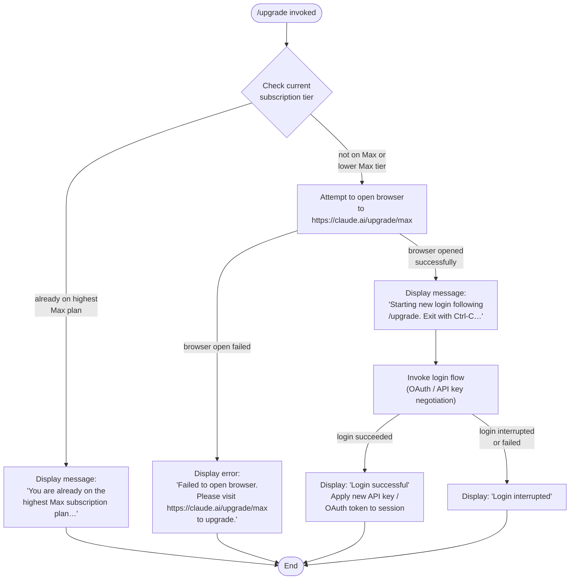

# `/upgrade`

> Analysis basis: CC v2.1.145 bundle.js (AST extraction + Claude interpretation)
> Minimum version: v2.1.145

---

## Overview

The `/upgrade` command guides the current user through upgrading their Claude account to the **Max subscription plan**, which provides higher rate limits and expanded access to Opus models. It checks whether the user is already on the highest Max tier, opens a browser to the upgrade URL when appropriate, and then initiates a fresh login flow to bind the new subscription to the active session.

---

## Registration

| Field | Value |
|---|---|
| type | `local-jsx` |
| name | `upgrade` |
| description | `Upgrade to Max for higher rate limits and more Opus` |
| loc_byte | `11725462` |
| loc_byte_end | `11725722` |
| loc_line | `7220` |
| module_id | `fQ_` |
| load_inline | `true` |
| arbor_handler.name | `aG6` |
| arbor_handler.fqn | `claude-2.1.145::aG6` |
| arbor_handler.kind | `AsyncFunction` |
| arbor_handler.resolution_path | `module_id` |
| arbor_handler.n_hits | `0` |

Analysis basis: CC v2.1.145 bundle.js:+11725462

---

## Input Branching

The command has four distinct execution paths depending on current subscription state, browser availability, and login outcome — a Mermaid flowchart is required.



Analysis basis: CC v2.1.145 bundle.js:+11724508 (handler entry `aG6`), +11724838 (already-on-Max message), +11724991 (upgrade URL), +11725063 (login-start message), +11725182 (login-success message), +11725201 (login-interrupted message), +11725255 (browser-fail message)

---

## Behavioral Spec

### 1. Subscription Tier Guard

Before doing anything else, the handler reads the current account's subscription plan identifier from application state.

```
function checkCurrentPlan(appState):
    currentPlan = appState.subscriptionPlan   // e.g. "claude_max"
    planVariant  = appState.planVariant       // e.g. "default_claude_max_20x"

    if currentPlan == "claude_max" AND planVariant indicates highest tier:
        displayStaticMessage(ALREADY_ON_MAX_MSG)
        return ABORT
    else:
        return PROCEED
```

- Subscription identifier literal `"claude_max"` — Analysis basis: CC v2.1.145 bundle.js:+11724737  
- Variant identifier literal `"default_claude_max_20x"` — Analysis basis: CC v2.1.145 bundle.js:+11724619  
- Tier value `"max"` — Analysis basis: CC v2.1.145 bundle.js:+11724594  
- Already-on-Max message begins with "You are already on the highest Max…" — Analysis basis: CC v2.1.145 bundle.js:+11724838

### 2. Platform-Aware Browser Launch

If the user is not already on the highest tier, the handler invokes the URL-opener utility (mapped to `openUrlHandler` below) targeting the upgrade page.

```
async function openUpgradeUrl():
    targetUrl = "https://claude.ai/upgrade/max"   // +11724991

    platform = process.platform
    if platform == "darwin":
        spawn("open", [targetUrl])
    else if platform == "win32":
        spawn("rundll32", ["url,OpenURL", targetUrl])
    else:
        spawn("xdg-open", [targetUrl])

    // Validate URL scheme before launching
    scheme = extractScheme(targetUrl)
    if scheme NOT IN ["http:", "https:"]:
        throw Error("invalid URL scheme")
```

- Platform strings `"darwin"`, `"win32"` — Analysis basis: CC v2.1.145 bundle.js:+6434628, +6434644  
- Windows launcher `"rundll32"` / `"url,OpenURL"` — Analysis basis: CC v2.1.145 bundle.js:+6434728, +6434740  
- macOS launcher `"open"` — Analysis basis: CC v2.1.145 bundle.js:+6434802  
- Linux launcher `"xdg-open"` — Analysis basis: CC v2.1.145 bundle.js:+6434809  
- Scheme validation literals `"http:"`, `"https:"` — Analysis basis: CC v2.1.145 bundle.js:+6434319, +6434341

### 3. Login Flow Initiation

After the browser launches, the handler waits briefly (via `setTimeout`) then starts a fresh login sequence — the same OAuth / API-key negotiation used by `/login`.

```
async function runPostUpgradeLogin(appState, onChangeAPIKey):
    displayMessage("Starting new login following /upgrade. Exit with Ctrl-C…")
    // setTimeout used before spawning login — +11724823

    result = await loginFlow(appState)   // invokes na → K9 → OAuth path

    if result.status == SUCCESS:
        displayMessage("Login successful")
        onChangeAPIKey(result.newKey)    // propagates new credential — +11725159
    else:
        displayMessage("Login interrupted")
```

- Start message literal — Analysis basis: CC v2.1.145 bundle.js:+11725063  
- Success message literal — Analysis basis: CC v2.1.145 bundle.js:+11725182  
- Interrupted message literal — Analysis basis: CC v2.1.145 bundle.js:+11725201  
- `onChangeAPIKey` callback wired at — Analysis basis: CC v2.1.145 bundle.js:+11725159  
- `setTimeout` call before login — Analysis basis: CC v2.1.145 bundle.js:+11724823

### 4. OAuth Profile Fetch (sub-step inside login flow)

The login helper `loginOrchestrator` (`na`) fetches the user's OAuth profile to confirm account identity after the browser round-trip.

```
async function fetchOAuthProfile(token, s8Cache):
    headers = { "Content-Type": "application/json" }
    timeout = 10000   // ms — +2026788

    try:
        response = await s8Cache.get(profileEndpoint, { headers, timeout })
        emitTelemetryEvent("oauth_profile_fetch")   // +2026804
        return response.data
    catch error:
        emitTelemetryEvent("oauth_profile_token_failed")   // +2026871
        logError("error", error)
        return null
```

- Timeout value 10 000 ms — Analysis basis: CC v2.1.145 bundle.js:+2026788  
- Content-Type header — Analysis basis: CC v2.1.145 bundle.js:+2026745  
- Telemetry events `oauth_profile_fetch` / `oauth_profile_token_failed` — Analysis basis: CC v2.1.145 bundle.js:+2026804, +2026871

### 5. API-Key / OAuth Token Credential Resolution

The authentication resolver (`credentialResolver`, `i$`) determines which credential type is active before or after the upgrade.

```
function resolveCredential(env, flagSettings):
    if env.ANTHROPIC_API_KEY is set:
        return { kind: "apiKey", value: env.ANTHROPIC_API_KEY }   // +2916766

    if flagSettings.apiKeyHelper is set:                          // +2916860
        return { kind: "apiKeyHelper", value: flagSettings.apiKeyHelper }

    if flagSettings.authType == "none":                           // +2916899
        throw Error("ANTHROPIC_API_KEY or CLAUDE_CODE_OAUTH_TOKEN env var is required")  // +2917187

    // Fall through to OAuth token file-descriptor path
    fdOAuth  = env.CLAUDE_CODE_OAUTH_TOKEN_FILE_DESCRIPTOR        // +2040828
    fdApiKey = env.CLAUDE_CODE_API_KEY_FILE_DESCRIPTOR            // +2040971

    if fdOAuth is set:
        return readCredentialFromFD(fdOAuth, "OAuth token")       // +2040894
    if fdApiKey is set:
        return readCredentialFromFD(fdApiKey, "API key")          // +2041033

    throw Error("no credential found")
```

- Error message literal — Analysis basis: CC v2.1.145 bundle.js:+2917187  
- `flagSettings` key — Analysis basis: CC v2.1.145 bundle.js:+2917707  
- FD env-var names — Analysis basis: CC v2.1.145 bundle.js:+2040828, +2040971

### 6. Provider Guard (upgrade command only available for first-party accounts)

The provider check (`providerChecker`, `wA`) confirms that the session is not running through a cloud-provider integration, as upgrades are only meaningful for direct Anthropic accounts.

```
function isFirstPartyProvider(currentProvider):
    nonUpgradeableProviders = [
        "bedrock",       // +2022501
        "foundry",       // +2022551
        "anthropicAws",  // +2022607
        "mantle",        // +2022661
        "vertex"         // +2022709
    ]
    if currentProvider in nonUpgradeableProviders:
        return false
    if currentProvider == "firstParty":   // +2022718
        return true
    return false
```

Analysis basis: CC v2.1.145 bundle.js:+2022501–+2022718

### 7. Browser-Open Failure Fallback

If the OS-level browser launch fails, the JSX component renders a static fallback message rather than aborting silently.

```
function renderBrowserFailureFallback():
    displayMessage(
        "Failed to open browser. Please visit https://claude.ai/upgrade/max to upgrade."
    )
    // +11725255
```

Analysis basis: CC v2.1.145 bundle.js:+11725255

---

## State & Side Effects

| Item | Detail |
|---|---|
| Telemetry — `tengu_feature_ok` | Fired on successful feature/capability probe during login sub-flow (Analysis basis: CC v2.1.145 bundle.js:+955923) |
| Telemetry — `tengu_feature_sad` | Fired on failed feature/capability probe during login sub-flow (Analysis basis: CC v2.1.145 bundle.js:+956058) |
| Telemetry — `tengu_bg_spare_enable` | Fired when background spare-process pool is enabled, triggered during login orchestration (Analysis basis: CC v2.1.145 bundle.js:+14654747) |
| Telemetry — `tengu_bg_spare_spawn` | Fired when a background spare process is actually spawned post-login (Analysis basis: CC v2.1.145 bundle.js:+14655107) |
| Telemetry — `oauth_profile_fetch` | Fired when OAuth profile HTTP request succeeds (Analysis basis: CC v2.1.145 bundle.js:+2026804) |
| Telemetry — `oauth_profile_token_failed` | Fired when OAuth profile HTTP request fails (Analysis basis: CC v2.1.145 bundle.js:+2026871) |
| `onChangeAPIKey` callback | Called with the new API key / OAuth token when login succeeds; propagates credential change into app state (Analysis basis: CC v2.1.145 bundle.js:+11725159) |
| Browser launch | Spawns OS-specific browser process (`open` / `rundll32` / `xdg-open`) pointing to `https://claude.ai/upgrade/max` |
| `setTimeout` delay | A short timer is inserted before starting the login flow after browser open (Analysis basis: CC v2.1.145 bundle.js:+11724823) |
| Log writing (`R$K` → `S$K`) | Login flow writes debug log entries via `LN.appendFile`; log rotation via `LN.rename` / `LN.unlink`; directory creation via `LN.mkdir` (Analysis basis: CC v2.1.145 bundle.js:+200867, +200926, +200623) |
| Credential log redaction | API key values are replaced with `"[REDACTED]"` before writing to debug log (Analysis basis: CC v2.1.145 bundle.js:+193726) |
| Error logging | Errors during OAuth profile fetch are forwarded to `gc.logError` (Analysis basis: CC v2.1.145 bundle.js:+961417) |
| appState changes | Subscription plan fields and active credential are updated in memory after successful login |
| Sound | <!-- TODO: not found in depth-2 traversal; needs --depth 4 --> |
| Hook registration | `h9` calls `w6A.register` during the login path, suggesting a lifecycle hook or cleanup handler is registered (Analysis basis: CC v2.1.145 bundle.js:+57267) |

---

## Version History

| Version | Change |
|---|---|
| v2.1.145 | Initial analysis |

---

## Common Mistakes

1. **Running `/upgrade` on a non-first-party provider** — If the active session uses Bedrock, Vertex, Foundry, Mantle, or Amazon-hosted Anthropic, the provider guard (`providerChecker`) will prevent meaningful action. Upgrade is only applicable to direct `firstParty` accounts.
2. **Expecting immediate rate-limit relief** — The command opens a browser and then runs the full login flow. Until the OAuth round-trip completes and `onChangeAPIKey` fires, the session still operates under the old credential and its associated limits.
3. **Already on the highest Max tier** — If the plan is `"claude_max"` at the `"default_claude_max_20x"` variant (or equivalent highest tier), the command exits immediately with an advisory message and does **not** open a browser. Users should run `/login` instead if they wish to switch to an API usage-billed account.
4. **Browser not available** — In headless or server environments where no OS browser launcher is present, the command falls back to printing the upgrade URL. The login flow is not started in this case.
5. **Ctrl-C during login** — If the user interrupts the post-browser login prompt, the session remains on the previous credential; a "Login interrupted" message is shown and no credential change is applied.

---

## Appendix — Identifier Mapping

> For bundle debugging only. Identifiers change across versions.

| Identifier | Role |
|---|---|
| `aG6` | Main handler for `/upgrade` command (AsyncFunction, Arbor-resolved via `module_id`) |
| `$A` | Top-level upgrade orchestration helper called from handler |
| `LD` | Authentication/session state loader |
| `RK` | React/JSX rendering primitive |
| `xH` | JSX element factory / component helper |
| `wv` | OAuth token state builder |
| `wF6` | OAuth token file-descriptor reader |
| `S9H` | OAuth token string formatter |
| `zl` | OAuth token environment variable accessor |
| `jv` | Flag-settings reader (`flagSettings`) |
| `Q3` | Provider type classifier |
| `wA` | First-party provider checker |
| `sj` | Session/config accessor |
| `i$` | Credential resolver (API key vs. OAuth) |
| `i76` | API-key helper resolver |
| `ohH` | VSCode environment detector |
| `OK6` | API key file-descriptor credential reader |
| `h6` | Audit/timestamp logger |
| `Lh` | Log history slicer (last 20 entries) |
| `cR` | Array-inclusion utility for provider lists |
| `H` | General utility / random/timer module |
| `na` | Login orchestrator (OAuth profile fetch + login flow) |
| `K9` | OAuth URL builder / endpoint resolver |
| `M3A` | OAuth environment selector |
| `kyK` | OAuth client-ID resolver |
| `hH` | Feature probe — success path (emits `tengu_feature_ok`) |
| `d` | Base application state store |
| `K8` | Feature probe — failure path (emits `tengu_feature_sad`) |
| `$z` | OAuth login state initializer |
| `I` | Debug log writer |
| `y$K` | Log file path resolver |
| `J6A` | Log directory path builder |
| `RH` | JSON serializer for log entries |
| `B4` | Log file name generator (with redaction) |
| `n_A` | Log path segment mapper |
| `q` | File system unlink helper |
| `A` | File name normalizer (lowercase) |
| `RSH` | Log write dispatcher |
| `x_A` | Low-level file write helper |
| `R$K` | Full log-write pipeline (mkdir + appendFile + rotate) |
| `qSH` | Async write queue / debounce scheduler |
| `I_H` | Log entry formatter |
| `U6` | Timestamp utility |
| `M86` | Log file size checker |
| `HAA` | Log path join helper |
| `e_A` | Log file rotation handler |
| `S$K` | Log append + rotate worker |
| `h9` | Lifecycle hook registrar (calls `w6A.register`) |
| `NH` | Network/HTTP request dispatcher |
| `x_` | HTTP error converter |
| `Hq` | HTTP response unwrapper |
| `JOA` | HTTP response JSX renderer |
| `mhK` | Request queue manager (shift/push) |
| `nq` | URL opener orchestrator |
| `q04` | URL scheme validator |
| `aj` | Browser process spawner |
| `Y8` | Login flow entry point |
| `Y_` | Login sub-flow handler (QXH pipeline) |
| `QXH` | OAuth exchange / token negotiation core |
| `D` | Background spare-process manager (emits `tengu_bg_spare_*`) |
| `YCK` | Login string converter |
| `_N` | Login state normalizer |
| `A8` | App state updater post-login |
| `b6` | AsyncLocalStorage context accessor |
| `AC6` | Store retriever (`_C6.getStore`) |
| `q_` | Internal value extractor (`IV`) |

---

Note: index built via Arbor fallback; some signals (telemetry, literals) may be missing — see arbor-fallback.js.