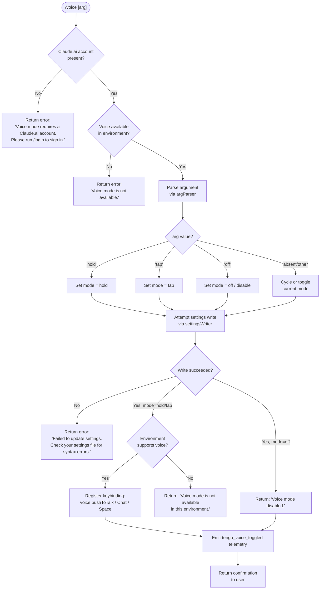

# `/voice`

> Analysis basis: CC v2.1.146 bundle.js (AST extraction + Claude interpretation)
> Minimum version: v2.1.146

---

## Overview

The `/voice` command toggles voice input mode in Claude Code, supporting three sub-modes: `hold` (push-to-talk), `tap` (toggle-on/off), and `off` (disable). It validates platform prerequisites (Claude.ai account, environment availability, microphone permission), persists the chosen mode to user settings, registers a keybinding for push-to-talk (`Space` in the `Chat` context), and emits a telemetry event on every mode change.

---

## Registration

| Field | Value |
|---|---|
| type | `local` |
| name | `voice` |
| description | `Toggle voice mode` |
| argumentHint | `[hold\|tap\|off]` |
| supportsNonInteractive | `false` |
| isHidden | `null` |
| module_id | `Gb1` |
| load_inline | `true` |
| loc_byte | `12362840` |
| loc_byte_end | `12363082` |
| loc_line | `10483` |
| arbor_handler.name | `td7` |
| arbor_handler.fqn | `claude-2.1.146::td7` |
| arbor_handler.kind | `AsyncFunction` |
| arbor_handler.resolution_path | `module_id` |
| arbor_handler.n_hits | `1` |

Analysis basis: CC v2.1.146 bundle.js:+12362840

---

## Input Branching

The command has 5+ distinct decision paths (account check → availability check → argument parsing → mode selection → settings update outcome), so a Mermaid flowchart is used.



Analysis basis: CC v2.1.146 bundle.js:+12360294 (handler entry `td7`), +12360305, +12360434, +12360753, +12360891, +12361135

---

## Behavioral Spec

### 1. Handler Entry Point (`td7`)

The primary handler is the `AsyncFunction` `td7`, resolved via `module_id` (`Gb1`) by the Arbor symbol graph.

```
async function voiceCommandHandler(args, context):
    // Step 1 — Account guard
    accountState = getAccountState(context)      // calls zeH → Ql_
    if not accountState.hasClaudeAiAccount:
        return textResult("Voice mode requires a Claude.ai account. Please run /login to sign in.")

    // Step 2 — Environment availability guard
    if not isVoiceAvailable(context):            // calls ID (config/environment check)
        return textResult("Voice mode is not available.")

    // Step 3 — Parse argument
    rawArg = args.trim()                         // calls sd7 → H.trim
    mode = parseVoiceMode(rawArg)                // calls argParser (uSH)

    // Step 4 — Apply mode change
    if mode == "off":
        writeResult = await updateVoiceSetting(context, "off")  // calls settingsWriter (HA)
        if writeResult.error:
            return textResult("Failed to update settings. Check your settings file for syntax errors.")
        emit("tengu_voice_toggled", {mode: "off"})
        return textResult("Voice mode disabled.")

    if mode in ["hold", "tap"]:
        writeResult = await updateVoiceSetting(context, mode)
        if writeResult.error:
            return textResult("Failed to update settings. Check your settings file for syntax errors.")
        if not environmentSupportsVoice():
            return textResult("Voice mode is not available in this environment.")
        registerKeybinding("voice:pushToTalk", context="Chat", key="Space")   // calls BJ
        emit("tengu_voice_toggled", {mode: mode})
        return confirmation(mode)
```

Analysis basis: CC v2.1.146 bundle.js:+12360294 (`td7`→`zeH`), +12360305 (`td7`→`ID`), +12360519 (`td7`→`sd7`), +12360586 (`td7`→`H.trim`), +12360655 (`td7`→`HA`), +12360834 (`td7`→`c`), +12360836 (telemetry), +12362101 (`td7`→`BJ`)

---

### 2. Account State Check (`zeH` / `Ql_`)

```
function checkAccountState(context):
    state = getLoginState(context)          // Ql_ reads auth state
    return Boolean(state.hasClaudeAiAccount)
```

Analysis basis: CC v2.1.146 bundle.js:+12350827 (`zeH`→`Ql_`), +12350753 (`Ql_`→`oA`), +12350765 (`Ql_`→`Boolean`)

---

### 3. Environment / Config Availability Check (`ID` and descendants)

`ID` is a multi-step config loader that reads user settings, flag settings, policy settings, project settings, and local settings from disk. It returns a combined configuration object indicating whether voice features are enabled for the current user and environment. Internally it calls:

- `Nv` — resolves environment-specific feature flags (Analysis basis: +2915881)
- `wO` — first-party auth validation (Analysis basis: +2915902, +2023417)
- `WA` — additional config merging (Analysis basis: +2915910)
- `wJ` — reads merged settings structure (Analysis basis: +2915936)
- `w$` — validates API key (`ANTHROPIC_API_KEY`) and auth helper (`apiKeyHelper`); throws if neither is present with message `"ANTHROPIC_API_KEY or CLAUDE_CODE_OAUTH_TOKEN env var is required"` (Analysis basis: +2916042, +2917759, +2918180)
- `zqH` — resolves additional config flags (Analysis basis: +2916172)

```
function loadConfigAndCheckVoice(context):
    config = mergeSettings(
        flagSettings,
        policySettings,
        userSettings,
        projectSettings,
        localSettings
    )
    validateAuth(config)         // throws if no API key / OAuth token
    return config.voiceEnabled   // boolean
```

Analysis basis: CC v2.1.146 bundle.js:+2915783, +2915881, +2915902, +2915910, +2915936, +2916042, +2916172

---

### 4. Argument Parser (`sd7` / `uSH`)

```
function parseVoiceMode(rawArg):
    trimmed = rawArg.trim()
    lower = trimmed.toLowerCase()
    if lower in validModes:     // {"hold", "tap", "off"} — literals at +12360211, +12360223, +12360234
        return lower
    if lower == "" or lower == "invalid":  // +12360255
        return cycleMode()      // returns next mode in rotation
    return "invalid"
```

The valid mode literals `"hold"`, `"tap"`, `"off"` are found at bundle bytes +12360211, +12360223, +12360234 respectively.

Analysis basis: CC v2.1.146 bundle.js:+12360164 (`sd7`→`H.trim`), +12360519, +12362235 (`td7`→`uSH`), +27077 (`uSH`→`H.toLowerCase`)

---

### 5. Settings Persistence (`HA` and its call tree)

`HA` is the settings-write coordinator. It:

1. Loads current settings from disk using `settingsLoader` (`wF8` → `mXA`, `pfH`, `qF`, `bXA`) (Analysis basis: +1208368)
2. Resolves the config path via `configPathResolver` (`KF`) (Analysis basis: +1208374)
3. Validates no pre-existing parse errors via `configValidator` (`RP` → `zl`) (Analysis basis: +1208404)
4. Reads and merges the settings file (`J8` → `L8`) (Analysis basis: +1208423)
5. Applies the voice mode value and writes atomically to disk via `atomicFileWriter` (`hq6`) (Analysis basis: +1208811); uses `rp8.randomBytes` for a temp-file name, `LM.writeFileSync`, `LM.fchmodSync`, `LM.fsyncSync`, and `q.renameSync`.
6. Clears in-memory settings caches (`jY` → `KI6.clear`, `pN8.clear`) (Analysis basis: +1208953)
7. Persists updated config via `persistConfig` (`Lx6`) (Analysis basis: +1208978)
8. Triggers a settings-reload event via `ebH.emit` (Analysis basis: +1209150)

```
async function writeVoiceSetting(context, mode):
    currentSettings = loadSettingsFromDisk()
    configPath = resolveConfigPath()
    if not configPath:
        return {error: "Failed to update settings..."}
    parsed = readAndParseSettingsFile(configPath)
    parsed.voice.mode = mode
    atomicWrite(configPath, parsed)
    clearSettingsCaches()
    persistConfig(parsed)
    emitSettingsReloadEvent()
    return {success: true}
```

Analysis basis: CC v2.1.146 bundle.js:+1208296, +1208368, +1208374, +1208404, +1208811, +1208953, +1208978, +1209150

---

### 6. Keybinding Registration (`BJ`)

When voice mode is enabled (hold or tap), the handler registers a push-to-talk keybinding:

- Action: `"voice:pushToTalk"` (literal at +12362104)
- Context: `"Chat"` (literal at +12362123)
- Key: `"Space"` (literal at +12362130)

Internally `BJ` calls:
- `Ne6` → `X36`: reads `keybindings.json` from the config directory (Analysis basis: +3757829), validates its `"bindings"` array structure (Analysis basis: +3758080, +3758257), parses keybinding blocks, and deduplicates entries.
- `Ie6` → `Zf_` → `Ef_`: builds the resolved keybinding table.
- `Rp9.has` / `Rp9.add`: deduplication set to prevent duplicate registrations (Analysis basis: +3764780, +3764791).

```
function registerPushToTalkKeybinding():
    bindings = loadKeybindingsJson()          // X36 reads keybindings.json
    validateBindingsStructure(bindings)
    resolvedTable = buildKeybindingTable(bindings)  // Ie6 → Zf_
    if not alreadyRegistered("voice:pushToTalk"):
        register(action="voice:pushToTalk", context="Chat", key="Space")
```

Analysis basis: CC v2.1.146 bundle.js:+12362101 (`td7`→`BJ`), +3764722, +3764732, +3764780, +12362104, +12362123, +12362130

---

### 7. MCP Update Side Effect (`M` → `_kH` / `z4K`)

After the voice mode update, the handler calls `M`, which triggers an MCP configuration reload (`_kH` then `z4K`). This re-applies any MCP server configurations relevant to voice, including connecting or reconnecting `claudeai-proxy` transport entries (literal at +9938584).

Analysis basis: CC v2.1.146 bundle.js:+12361410 (`td7`→`M`), +14788510 (`M`→`_kH`), +14788520 (`M`→`z4K`)

---

## State & Side Effects

| Item | Detail |
|---|---|
| Telemetry | `tengu_voice_toggled` (emitted on every successful mode change, +12360836) |
| Telemetry (indirect) | `tengu_keybinding_customization_release` (+3755355), `tengu_custom_keybindings_loaded` (+3755775), `tengu_keybinding_fallback_used` (+3764804) — fired during keybinding registration |
| Telemetry (indirect) | `tengu_config_parse_error` (+3171293) — if settings file is malformed |
| Settings write | Persists `voice.mode` (`"hold"`, `"tap"`, or `"off"`) to user settings JSON via atomic write |
| Keybinding registration | Registers `voice:pushToTalk` → `Space` in `Chat` context when enabling voice |
| Cache invalidation | Clears `KI6` and `pN8` in-memory settings caches after write (`jY`, +1208953) |
| Event emission | Fires `ebH.emit` to notify listeners of settings reload (+1209150) |
| MCP reload | Triggers MCP configuration re-evaluation via `_kH`/`z4K` (+12361410) |
| Sound | Not found in depth-2 traversal for this command |
| appState changes | Voice mode state is persisted to disk; in-memory state is updated via settings reload event |

---

## Error Messages

| Condition | Message | loc_byte |
|---|---|---|
| No Claude.ai account | `"Voice mode requires a Claude.ai account. Please run /login to sign in."` | +12360335 |
| Voice not available (general) | `"Voice mode is not available."` | +12360434 |
| Settings write failure | `"Failed to update settings. Check your settings file for syntax errors."` | +12360753 |
| Voice disabled confirmation | `"Voice mode disabled."` | +12360891 |
| Environment lacks voice support | `"Voice mode is not available in this environment."` | +12361135 |
| Microphone permission hint | `"System Settings → Privacy & Security → Microphone"` | +12361642 |

---

## Version History

| Version | Change |
|---|---|
| v2.1.146 | Initial analysis |

---

## Common Mistakes

1. **Running `/voice` without a Claude.ai account.** The command requires an authenticated Claude.ai account; using only an API key will trigger the "Please run /login" error. Use `/login` first.
2. **Passing an unrecognized argument.** Only `hold`, `tap`, and `off` are valid. Any other string causes the command to fall back to cycling/toggling behavior rather than setting an explicit mode.
3. **Corrupt settings JSON.** If `.claude/settings.json` contains syntax errors, the settings write will fail. The command reports this but does not repair the file automatically.
4. **Using `/voice hold` or `/voice tap` in unsupported environments.** Even if the account is valid, the environment must support voice capture. Remote/SSH sessions may return "Voice mode is not available in this environment."
5. **Expecting interactive prompts.** `supportsNonInteractive` is `false`, so `/voice` must be run inside an active interactive session; it cannot be used via `--print` or piped invocations.

---

## Appendix — Identifier Mapping

> For bundle debugging only. Identifiers change across versions.

| Identifier | Role |
|---|---|
| `td7` | Main async handler for `/voice` (Arbor-resolved entry point) |
| `zeH` | Account-state resolver — checks for Claude.ai login |
| `Ql_` | Low-level account state reader; returns Boolean login status |
| `ID` | Config loader and environment/feature-flag resolver |
| `cK` | Sub-config helper called by `ID` and `Nv` |
| `Nv` | Environment-specific feature flag evaluator |
| `wO` | First-party auth validator |
| `wJ` | Merged settings structure reader |
| `w$` | API key / OAuth token validator (throws on missing auth) |
| `zqH` | Supplemental config flag resolver |
| `BE6` | Secondary account state helper called from `zeH` |
| `e_` | Settings loader bootstrap (calls `gu`) |
| `gu` | Settings load orchestrator (`loadSettingsFromDisk` span) |
| `xR` | Internal helper within `gu` |
| `Wq` | Memory-usage and dedup tracker during settings load |
| `Wu` | Dynamic `require` wrapper inside `Wq` |
| `jF8` | Core settings-load function (reads all layers) |
| `h8` | File-append / log helper used during settings load |
| `fI6` | Helper within `jF8` |
| `J16` | Flag-settings set manager (`flagSettings` layer) |
| `mXA` | Settings merging utility |
| `pfH` | Path resolver for `userSettings` and `projectSettings` |
| `f` | File handle / stream abstraction |
| `qF` | Settings source resolver (resolves `userSettings` paths) |
| `bXA` | SDK inline settings handler |
| `KF` | Config path resolver (returns resolved config directory) |
| `D_` | Platform-detection utility |
| `sd7` | Argument trimmer / pre-parser for voice mode input |
| `H` | Generic utility object (Math.random, setTimeout, string ops) |
| `HA` | Settings write coordinator (full settings persistence flow) |
| `oO` | Helper within `HA` (combines `pfH` and `KF`) |
| `Q6` | Config base-path accessor |
| `wF8` | Settings loader called by `HA` at write time |
| `RP` | Settings validation entry point |
| `zl` | Settings file reader and encoding detector |
| `f3` | File-type checker (FIFO, socket, character device, etc.) |
| `N` | Platform/OS string normalizer |
| `Gb6` | Config-path sub-helper within `zl` |
| `Tb6` | File-slice helper within `zl` |
| `J8` | File reader (calls `L8`) |
| `L8` | Low-level file read utility |
| `XB8` | Timestamp recorder (`Dx6.set` / `Date.now`) |
| `U2H` | Helper combining `tx6` and `KF` |
| `tx6` | Path utilities for settings resolution |
| `hq6` | Atomic file writer (random temp name, fchmod, fsync, rename) |
| `q` | File-system operations bundle (lstat, readlink, rename, unlink, etc.) |
| `O` | Symbolic-link / stat result abstraction |
| `v8` | Background-session state object |
| `CH` | JSON serializer wrapper |
| `jY` | Settings cache invalidator (`KI6.clear`, `pN8.clear`) |
| `Lx6` | Config persistence writer (async file write to `.claude/settings.json`) |
| `x6` | Config store accessor |
| `Wb6` | Async-local-storage store getter |
| `_B8` | Config object validator (`Q4`) |
| `fB8` | gitignore / git-check-ignore integration |
| `V_` | gitignore rule evaluator |
| `XUK` | Config home-directory path builder |
| `MC` | Config directory path joiner (`.claude`) |
| `SH` | Shell/process executor (used for logging and sub-process calls) |
| `n_` | Error string normalizer |
| `mH` | String coercion helper |
| `X1` | Log entry appender |
| `lYA` | Log entry formatter |
| `PuK` | Rolling log buffer manager |
| `c` | Core application context / state object |
| `M` | MCP configuration update dispatcher |
| `_kH` | MCP server connection manager (iterates all configured servers) |
| `GHH` | MCP server group processor |
| `TKH` | Individual MCP server initializer |
| `WHH` | SDK-type MCP server handler |
| `jD6` | MCP server registry updater |
| `zN` | MCP notification dispatcher |
| `n$` | MCP message handler |
| `uX_` | MCP update helper |
| `f_` | MCP tool-list filter |
| `z06` | MCP server filter utility |
| `fD7` | MCP server connection attempt handler |
| `Vx_` | MCP connection state evaluator |
| `b18` | MCP tool schema validator |
| `x18` | MCP tool hash/identity checker |
| `eJ` | MCP tool hash generator (SHA-256) |
| `C18` | MCP tool identity key builder |
| `iK` | MCP tool key primitive |
| `O8` | MCP debug logger |
| `yb_` | MCP server lifecycle manager (connect/reconnect loop) |
| `Dz7` | MCP server bootstrap |
| `AF` | MCP auth flow initiator |
| `f8H` | MCP OAuth callback server and flow handler |
| `YaH` | MCP active-connection tracker |
| `D` | Background process / spare session manager |
| `Oj8` | MCP server state object constructor |
| `vd` | MCP reconnection orchestrator |
| `Fu` | MCP auth token accessor |
| `Y` | MCP supervisor / process pool manager |
| `v7` | MCP error logger |
| `ZH` | String normalizer for error messages |
| `wz7` | MCP connection timeout handler |
| `Yz7` | SSH-environment MCP connection handler |
| `hb_` | MCP auth cache handler |
| `zaH` | MCP pending-auth state getter |
| `DaH` | MCP active-auth state getter |
| `XK1` | MCP server start-up sequencer |
| `M1` | Async-local-storage context getter |
| `bj8` | MCP needs-auth cache path builder |
| `Ib_` | MCP tool capability validator |
| `SX_` | MCP server capability filter |
| `K8` | Global config reader/writer |
| `A` | Generic array/collection utility |
| `j` | Background worker process table |
| `y` | Background worker process handle |
| `wK1` | MCP worker pool size calculator |
| `Mi` | Concurrent mapper (Promise-based, `Mapper function is required`) |
| `Y06` | MCP port parser (parseInt) |
| `vx_` | MCP secondary port parser (parseInt) |
| `z4K` | MCP config re-applier (calls `applyMcpUpdate`) |
| `xj8` | MCP config serializer |
| `FN` | MCP cleanup orchestrator |
| `NaH` | MCP server cleanup helper |
| `$` | Session/daemon state object |
| `zS1` | Daemon status file writer |
| `ul` | Daemon status helper |
| `GE6` | Daemon status file path builder |
| `_O5` | MCP server-list iterator and updater |
| `m18` | MCP server capability set checker |
| `r8` | Async retry/timeout helper |
| `BJ` | Keybinding registration entry point |
| `Ne6` | Keybinding config loader (reads `keybindings.json`) |
| `X36` | Keybinding file parser and validator |
| `Xf_` | Keybinding block normalizer |
| `Fm` | Keybinding format validator |
| `L1H` | Keybinding config file path builder |
| `g6` | JSON.parse wrapper |
| `uH` | Feature-flag helper (calls `c`) |
| `Ze6` | Keybinding array type validator |
| `Ge6` | Keybinding entry iterator |
| `Zp9` | Keybinding default/fallback handler |
| `Jf_` | Keybinding duplicate-key detector |
| `Pf_` | Keybinding block builder |
| `bH` | Feature check helper (calls `c`) |
| `Ie6` | Keybinding table resolver |
| `Zf_` | Keybinding resolution helper |
| `Ef_` | Keybinding effective-binding builder |
| `it` | Keybinding map transformer |
| `uSH` | Voice argument parser (toLowerCase, set membership check) |
| `m6` | User config accessor |
| `pK_` | Config key path helper |
| `Y$H` | User config file reader/writer |
| `AC` | String prefix stripper |
| `rI9` | Config directory scanner |
| `cK_` | Config path joiner |
| `w` | Daemon/background session pool manager |
| `C` | Background worker process constructor |
| `rE6` | macOS memory reporting helper |
| `x` | Background session lifecycle manager |
| `N6` | Process pool slot manager |
| `AHA` | Background session claim handler |
| `$HA` | Background session spawn and lifecycle handler |
| `S` | Background session state machine |
| `cB4` | Config file watcher |
| `zn` | Config change debouncer |
| `c9` | Signal/cleanup registration helper |

---

Note: index built via Arbor fallback; some signals (telemetry, literals) may be missing — see arbor-fallback.js.