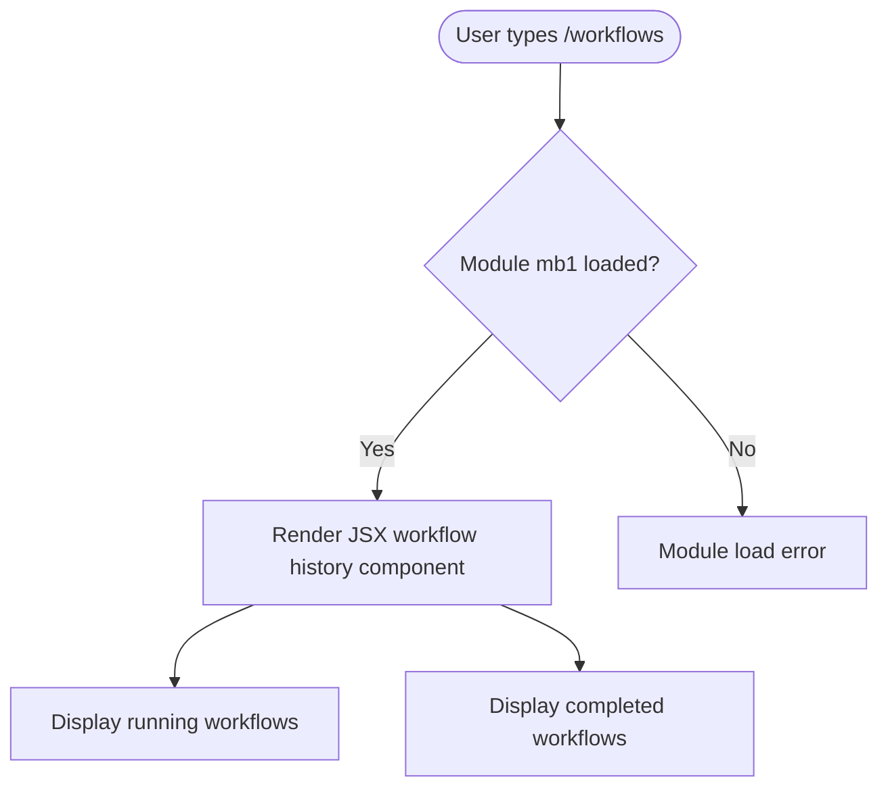

# `/workflows`

> Analysis basis: CC v2.1.146 bundle.js (AST extraction + Claude interpretation)
> Minimum version: v2.1.146

---

## Overview

The `/workflows` command opens a browsable view of workflow history within the Claude Code CLI, displaying both currently running and previously completed workflows. It is registered as a local JSX command (module `mb1`), meaning its output is rendered as an interactive UI component rather than plain text. Due to the depth-2 traversal limit of the AST extraction, internal implementation details are not available in this analysis.

---

## Registration

| Field | Value |
|---|---|
| type | `local-jsx` |
| name | `workflows` |
| description | `Browse workflow history (running and completed)` |
| aliases | *(none)* |
| module_id | `mb1` |

Analysis basis: CC v2.1.146 bundle.js:+12379665

---

## Input Branching

<!-- TODO: not found in depth-2 traversal; needs --depth 4 -->

The AST extraction returned an empty `callGraph` and empty `literals` arrays for module `mb1`, with the extractor note: `"no entry functions found for module 'mb1'"`. As a result, no branching logic can be verified from this data set.

Based solely on the registration metadata, the command accepts invocation with no required arguments (no argument schema was found in the registration object). The following flowchart reflects what can be stated with confidence:



> **Note:** The internal branching within the JSX component — for example, how running vs. completed workflows are distinguished, filtered, or sorted — cannot be specified without a deeper traversal. All nodes beyond the registration entry point are marked TODO below.

---

## Behavioral Spec

<!-- TODO: not found in depth-2 traversal; needs --depth 4 -->

Because `callGraph`, `literals`, `telemetry`, and `identifiers` are all empty and the extractor explicitly notes no entry functions were resolved for module `mb1`, no verified pseudocode can be written for the internal implementation.

The following pseudocode describes only the command dispatch boundary, which is inferable from the registration fields:

### Command Dispatch

```
function dispatchWorkflowsCommand(userInput):
    // Triggered when the user submits "/workflows" in the CLI
    command = resolveSlashCommand("workflows")   // type: local-jsx
    module  = loadModule(command.module_id)      // module_id: "mb1"

    if module is not available:
        reportModuleLoadFailure(command.module_id)
        return

    // Render the JSX component returned by the module
    component = module.render(userInput)
    mountComponentInCLIViewport(component)
    // Internal behavior of component: see TODO below
```

Analysis basis: CC v2.1.146 bundle.js:+12379665

### Workflow History Rendering

<!-- TODO: not found in depth-2 traversal; needs --depth 4 -->

The description string `"Browse workflow history (running and completed)"` confirms the component must present at minimum two categories of workflow entries: those that are currently running and those that have finished. The mechanism by which workflow state is read, how entries are sorted or paginated, what interaction gestures (keyboard navigation, selection, cancellation) are supported, and how the component signals results back to the shell are all unknown at this traversal depth.

```
function renderWorkflowHistoryComponent(state):
    // Category 1: running workflows
    runningWorkflows  = fetchRunningWorkflows(state)   // source unknown
    // Category 2: completed workflows
    completedWorkflows = fetchCompletedWorkflows(state) // source unknown

    display(runningWorkflows, completedWorkflows)
    // Further interaction handling: TODO
```

Analysis basis: description literal at CC v2.1.146 bundle.js:+12379665

---

## State & Side Effects

| Item | Detail |
|---|---|
| Telemetry | <!-- TODO: not found in depth-2 traversal; needs --depth 4 --> No `tengu_*` events were found in the depth-2 extraction. |
| Hook registration | <!-- TODO: not found in depth-2 traversal; needs --depth 4 --> |
| appState changes | <!-- TODO: not found in depth-2 traversal; needs --depth 4 --> |
| Sound | <!-- TODO: not found in depth-2 traversal; needs --depth 4 --> |
| Render mode | Local JSX component mounted in CLI viewport (inferred from `type: local-jsx`) |

Analysis basis: CC v2.1.146 bundle.js:+12379665

---

## Version History

| Version | Change |
|---|---|
| v2.1.146 | Initial analysis — registration confirmed; implementation details pending deeper traversal |

---

## Common Mistakes

1. **Expecting plain-text output.** Because the command type is `local-jsx`, `/workflows` renders an interactive component rather than printing a text list to stdout. Tooling that scrapes CLI output as plain text will not capture the workflow list correctly.
2. **Assuming arguments are supported.** No argument schema was found in the registration object. Passing arguments after `/workflows` may be silently ignored or may produce an error; behavior is unverified at this traversal depth.
3. **Treating the command as available in all contexts.** The `local-jsx` type implies a dependency on the CLI's JSX rendering layer. Invoking `/workflows` in a non-interactive or pipe mode where the JSX viewport is unavailable may fail to render the component.
4. **Relying on this spec for interaction details.** Keyboard navigation, selection actions, cancellation of running workflows, and any filtering controls are entirely undocumented here due to the traversal limit. Do not build automation against assumed interaction patterns.

---

## Appendix — Identifier Mapping

> For bundle debugging only. Identifiers change across versions.

| Identifier | Role |
|---|---|
| `mb1` | Module ID for the `/workflows` local-JSX command implementation (not an obfuscated function name, but an obfuscated module specifier) |

> No obfuscated function identifiers (`mw8`-style) were returned by the depth-2 AST extraction for this command. A deeper traversal (`--depth 4` or greater) targeting module `mb1` is required to populate this table.