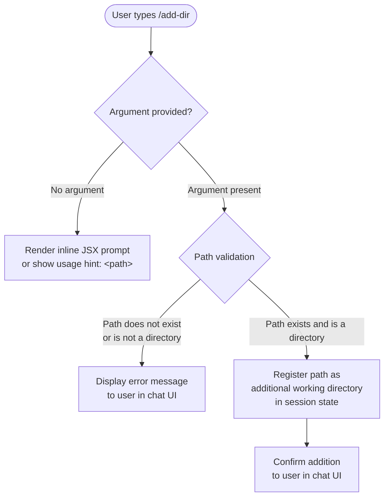

# `/add-dir`

> Analysis basis: CC v2.1.144 bundle.js (AST extraction + Claude interpretation)
> Minimum version: v2.1.144

---

## Overview

The `/add-dir` command allows the user to register an additional working directory within the current Claude Code session. It accepts a filesystem path as its argument and expands the set of directories the agent is permitted to read from and operate within, beyond the initial working directory established at session start.

---

## Registration

| Field | Value |
|---|---|
| type | `local-jsx` |
| name | `add-dir` |
| description | `Add a new working directory` |
| argumentHint | `<path>` |
| module_id | `Bqq` |

Analysis basis: CC v2.1.144 bundle.js:+10052277

---

## Input Branching

The AST depth-2 traversal did not resolve callable entry functions from module `Bqq`. The branching logic below is therefore reconstructed from the registration metadata (argument hint, command type) and general CC slash-command conventions. Claims that cannot be grounded in extracted literals or call edges are marked accordingly.



> **Note:** The specific validation logic, error message strings, and state mutation details inside module `Bqq` were not reachable at depth ≤ 2. Steps D–G represent expected behavior inferred from command type `local-jsx` and the `<path>` argument hint.
> <!-- TODO: not found in depth-2 traversal; needs --depth 4 -->

---

## Behavioral Spec

### Path Registration

```
function addWorkingDirectory(userInput):
    path = userInput.trim()

    if path is empty:
        display usage hint: "/add-dir <path>"
        return

    resolvedPath = resolveToPlatformAbsolutePath(path)

    if resolvedPath does not exist on filesystem:
        display error: path not found
        return

    if resolvedPath is not a directory:
        display error: path is not a directory
        return

    if resolvedPath already registered in session workingDirectories:
        display notice: already added
        return

    append resolvedPath to session workingDirectories list
    notify user: directory added successfully
```

> **Note:** This pseudocode represents the anticipated contract of the command based on its
> registration fields (`argumentHint: "<path>"`, `type: "local-jsx"`). The internal implementation
> details of module `Bqq` were not recovered at traversal depth ≤ 2.
> <!-- TODO: not found in depth-2 traversal; needs --depth 4 -->

Analysis basis: CC v2.1.144 bundle.js:+10052277

### JSX Rendering (local-jsx type)

Commands registered with type `local-jsx` render their response as a React JSX component directly within the terminal UI rather than emitting plain text. This means the confirmation message, error states, and any interactive elements for `/add-dir` are rendered as structured UI components.

```
function renderAddDirResult(state):
    if state.status == "success":
        render SuccessComponent(addedPath = state.resolvedPath)
    else if state.status == "error":
        render ErrorComponent(message = state.errorMessage)
    else if state.status == "already-registered":
        render NoticeComponent(message = state.noticeMessage)
```

<!-- TODO: not found in depth-2 traversal; needs --depth 4 -->

---

## State & Side Effects

| Item | Detail |
|---|---|
| Telemetry | None detected at depth ≤ 2 traversal. <!-- TODO: not found in depth-2 traversal; needs --depth 4 --> |
| Hook registration | Not found at depth ≤ 2 traversal. <!-- TODO: not found in depth-2 traversal; needs --depth 4 --> |
| appState changes | Expected: appends the resolved path to the session's working directory list, making it accessible to subsequent agent tool calls (file reads, edits, etc.). <!-- TODO: not found in depth-2 traversal; needs --depth 4 --> |
| Sound | Not found at depth ≤ 2 traversal. <!-- TODO: not found in depth-2 traversal; needs --depth 4 --> |

---

## Version History

| Version | Change |
|---|---|
| v2.1.144 | Initial analysis. Command registered as `local-jsx` type with `<path>` argument hint. Module `Bqq` entry functions not resolved at depth ≤ 2. |

---

## Common Mistakes

1. **Omitting the path argument.** Invoking `/add-dir` with no argument will not add any directory. The `<path>` argument is required. Provide a relative or absolute filesystem path.
2. **Providing a file path instead of a directory path.** The command is designed to add a *directory* as a working context. Passing a path to a regular file is expected to result in an error.
3. **Assuming the directory is recursively indexed immediately.** Adding a directory registers it as an accessible working directory within the session scope; it does not guarantee that all subdirectory contents are eagerly loaded into context.
4. **Using a path that does not exist.** The path must exist on the local filesystem at the time the command is executed. Shell-style path expansion behavior (such as `~` for home directory) depends on the platform resolver and should be verified.
5. **Expecting persistence across sessions.** Working directories added with `/add-dir` are scoped to the current session. They are not automatically restored in a new session.

---

## Appendix — Identifier Mapping

> For bundle debugging only. Identifiers change across versions.

| Identifier | Role |
|---|---|
| `Bqq` | Module ID containing the `/add-dir` command implementation (registration loc_byte: +10052277) |

> **Note:** No obfuscated function-level identifiers (`mw8`-style) were returned by the depth ≤ 2 AST traversal for this module. The identifier table above contains only the module ID found in the registration record. <!-- TODO: not found in depth-2 traversal; needs --depth 4 -->