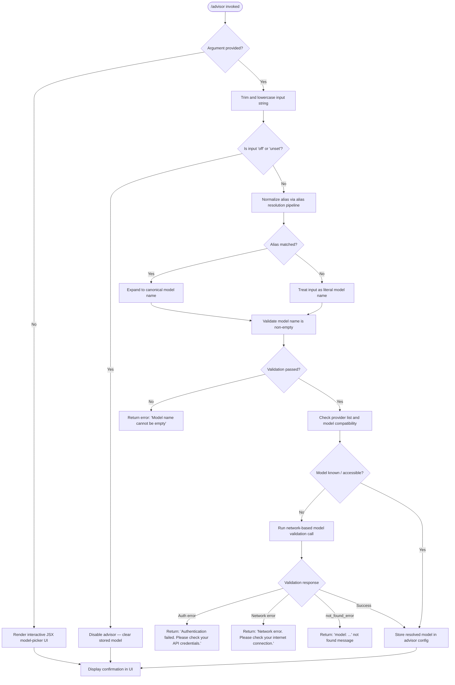

# `/advisor`

> Analysis basis: CC v2.1.147 bundle.js (AST extraction + Claude interpretation)
> Minimum version: v2.1.147

---

## Overview

The `/advisor` command configures the **Advisor Tool** — a facility that allows Claude Code to consult a stronger or specialist model at key decision points during a task. It presents a JSX-based interactive UI for selecting and validating a target model, then stores the selection so it can be used for mid-task guidance. The command resolves the chosen model identifier through a multi-tier normalization pipeline that handles short aliases, canonical API names, and provider-specific routing.

---

## Registration

| Field | Value |
|---|---|
| type | `local-jsx` |
| name | `advisor` |
| description | `Configure the Advisor Tool to consult a stronger model for guidance at key moments during a task` |
| module_id | `WS1` |
| load_inline | `true` |
| argumentHint | `null` |
| isHidden | `null` |
| loc_byte | `12101415` |
| loc_byte_end | `12101702` |
| loc_line | `9965` |
| **arbor_handler.name** | `Fg7` |
| **arbor_handler.fqn** | `claude-2.1.147::Fg7` |
| **arbor_handler.kind** | `AsyncFunction` |
| **arbor_handler.resolution_path** | `module_id` |
| **arbor_handler.n_hits** | `1` |
| `arbor_handler.name` | `Fg7` |
| `arbor_handler.kind` | `AsyncFunction` |
| `arbor_handler.resolution_path` | `module_id` |
| `arbor_handler.fqn` | `claude-2.1.147::Fg7` |
| `arbor_handler.n_hits` | `1` |

Analysis basis: CC v2.1.147 bundle.js:+12101415

---

## Input Branching

The command exhibits 4+ distinct paths: no-argument / alias resolution / model validation / state toggle. A Mermaid flowchart is used.



Analysis basis: CC v2.1.147 bundle.js:+12100871, +12100947, +12100958, +12093274

---

## Behavioral Spec

### 1. Handler Entry — `advisorCommandHandler` (`Fg7`)

The top-level handler is an `AsyncFunction` resolved via the `WS1` module export. It receives the command invocation context, trims the raw argument string, and branches on content.

```
async function advisorCommandHandler(context):
    rawInput = context.argument
    trimmedInput = rawInput.trim()

    if trimmedInput is empty:
        return renderModelPickerUI(context)
    else:
        return processModelArgument(trimmedInput, context)
```

Analysis basis: CC v2.1.147 bundle.js:+12100871, +12100907, +12101025, +12101039, +12101065

---

### 2. Model Argument Processing — `modelArgumentProcessor` (`F08`)

Handles a non-empty argument string. Normalizes it, checks an in-memory seen-set (`wS1`), validates it, and stores the result.

```
async function modelArgumentProcessor(rawModel, context):
    model = rawModel.trim()
    if model is empty:
        throw error("Model name cannot be empty")

    modelLower = model.toLowerCase()

    // Check provider exclusion list
    if providerExclusionList.includes(modelLower):
        return renderUnsupportedProviderMessage()

    // Check de-duplication / seen-set
    if seenModelSet.has(modelLower):
        return renderAlreadyConfiguredMessage()

    // Run alias resolution
    resolved = resolveModelAlias(model)

    // Validate resolved model
    validationResult = await validateModel(resolved, context)
    if validationResult.error:
        return renderValidationError(validationResult)

    // Persist
    seenModelSet.set(modelLower, resolved)
    return renderSuccessConfirmation(resolved)
```

Analysis basis: CC v2.1.147 bundle.js:+12093237, +12093274, +12093397, +12093416, +12093518, +12093563, +12093707, +12093726, +12093767

---

### 3. Alias Resolution Pipeline — `resolveModelAlias` (`lq`)

Converts short user-friendly aliases to canonical Anthropic model identifiers. The pipeline applies a sequence of checks:

```
function resolveModelAlias(input):
    normalized = input.trim().toLowerCase()

    // Short-alias table (in priority order):
    //   "opusplan"  → maps to bold/plan variant  (bundle.js:+2172032)
    //   "sonnet"    → maps to current sonnet      (bundle.js:+2172073)
    //   "haiku"     → maps to current haiku       (bundle.js:+2172112)
    //   "opus"      → maps to current opus        (bundle.js:+2172151)
    //   "best"      → maps to strongest available (bundle.js:+2172188)

    alias = lookupShortAlias(normalized)
    if alias found:
        return alias.canonicalName

    // Apply "[1m]" long-context marker normalization (bundle.js:+2172058)
    if input contains "[1m]" marker:
        input = stripLongContextMarker(input)

    // Replace non-standard separators (bundle.js:+2171975)
    input = input.replace(separatorPattern, standardSeparator)

    // Provider prefix check: if starts with "anthropic." keep as-is
    // (bundle.js:+2166178)
    if isAnthropicPrefixed(input):
        return input

    // Apply provider routing (bedrock, vertex, foundry, etc.)
    // (bundle.js:+2029601, +2029651, +2029809)
    routed = applyProviderRouting(normalized)
    return routed ?? input
```

Analysis basis: CC v2.1.147 bundle.js:+2171936, +2171947, +2171965, +2171975, +2172011, +2172032, +2172050, +2172073, +2172112, +2172151, +2172165, +2172188, +2172202, +2172220, +2172226, +2172234, +2172278

---

### 4. Model Validation — `validateModel` (`rb`)

Performs a lightweight API call to confirm the model is accessible. Uses the `side_query` request type with a 1024-token budget.

```
async function validateModel(modelName, context):
    // Build minimal messages array: role=user, content=text "Hi"
    // (bundle.js:+12891528, +12891626, +12893274)
    messages = [{ role: "user", content: [{ type: "text", text: "Hi" }] }]

    // Apply cache_control ephemeral header (bundle.js:+12093707, +12893898)
    cacheControl = "ephemeral"

    // Cap tokens at Math.min(budget, 1024) (bundle.js:+12891772)
    maxTokens = Math.min(userBudget, 1024)

    // Dispatch as "side_query" (bundle.js:+12891956)
    request = buildApiRequest(modelName, messages, maxTokens, "side_query")

    try:
        response = await callAnthropicAPI(request)
        recordTelemetry("tengu_api_success")   // bundle.js:+12893407
        return { ok: true, model: modelName }
    catch AuthError:
        return { error: "Authentication failed. Please check your API credentials." }
    catch NetworkError:
        return { error: "Network error. Please check your internet connection." }
    catch ApiError where error.type == "not_found_error":
        return { error: formatNotFoundMessage(modelName) }
```

Analysis basis: CC v2.1.147 bundle.js:+12891772, +12891956, +12892009, +12892050, +12892108, +12892611, +12892764, +12893176, +12893379, +12893392, +12893405

---

### 5. Model Alias Expansion Table — `modelAliasExpander` (`hg7`)

A secondary alias expansion step used inside the model-picker UI. Maps versioned short names (e.g. `opus-4-7`, `sonnet-4-5`) to full canonical strings.

```
function expandVersionedAlias(shortName):
    lower = shortName.toLowerCase()
    table = {
        "opus-4-7"   / "opus_4_7"   → canonical opus 4.7 name,
        "opus-4-6"   / "opus_4_6"   → canonical opus 4.6 name,
        "opus-4-5"   / "opus_4_5"   → canonical opus 4.5 name,
        "sonnet-4-6" / "sonnet_4_6" → canonical sonnet 4.6 name,
        "sonnet-4-5" / "sonnet_4_5" → canonical sonnet 4.5 name,
    }
    if lower in table:
        return table[lower]
    // Fall through to provider name resolver
    return resolveProviderName(shortName)
```

Analysis basis: CC v2.1.147 bundle.js:+12094495, +12094513, +12094532, +12094543, +12094567, +12094612, +12094636, +12094681, +12094705, +12094750, +12094776, +12094825, +12094851

---

### 6. Provider Routing — `providerModelResolver` (`gf` / `_Q6`)

Determines the API-level model string given the current provider context (Bedrock, Vertex, Foundry, first-party Anthropic, etc.).

```
function resolveForProvider(modelAlias, providerContext):
    provider = providerContext.toLowerCase()
    switch provider:
        case "bedrock"      // bundle.js:+2029601
        case "anthropicAws" // bundle.js:+2029707
            return bedrockModelName(modelAlias)
        case "vertex"       // bundle.js:+2029809
            return vertexModelName(modelAlias)
        case "foundry"      // bundle.js:+2029651
            return foundryModelName(modelAlias)
        case "mantle"       // bundle.js:+2029761
            return mantleModelName(modelAlias)
        case "gateway"      // bundle.js:+2030290
            return gatewayModelName(modelAlias)
        case "firstParty"   // bundle.js:+2029818
        default:
            return firstPartyModelName(modelAlias)
```

Analysis basis: CC v2.1.147 bundle.js:+2029561, +2029601, +2029651, +2029707, +2029761, +2029809, +2029818, +2030235, +2030797, +2030844, +2030847, +2031677

---

### 7. MCP Server State — `mcpServerInitializer` (`EkH` / `_D5`)

When `/advisor` is invoked inside a session that has active MCP servers, the command reads the current MCP state. Server connection statuses are categorized as `disabled`, `connected`, `needs-auth`, or `failed` before the model selection is finalized.

```
function collectMcpServerState(mcpConfig):
    servers = Object.entries(mcpConfig)
    results = []
    for each [name, serverDef] in servers:
        transport = serverDef.transport  // "stdio"|"sse"|"http"|"sse-ide"|"ws-ide"
        status = getConnectionStatus(name)
        if status == "needs-auth":
            log("Skipping connection (cached needs-auth)")
            continue
        results.push({ name, transport, status })
    return results
```

Analysis basis: CC v2.1.147 bundle.js:+9963664, +9963689, +9963728, +9963763, +9963865, +9963899, +9963931, +9963964, +9964000, +9964272, +9964458, +9964524, +9964626, +9965199

---

## State & Side Effects

| Item | Detail |
|---|---|
| Telemetry: `tengu_api_success` | Fired on successful model validation API call (bundle.js:+12893407) |
| Telemetry: `tengu_prompt_cache_1h_config` | Fired when 1-hour prompt cache configuration is applied to the validation request (bundle.js:+12854453) |
| Telemetry: `tengu_bg_dispatch_sigkill_escalate` | Fired by background dispatcher on SIGKILL escalation (bundle.js:+15117797) |
| Telemetry: `tengu_bg_dispatch_low_mem` | Fired when low-memory condition triggers dispatch pruning (bundle.js:+15118376) |
| Telemetry: `tengu_bg_spare_enable` | Fired when background spare session is enabled (bundle.js:+15119071) |
| Telemetry: `tengu_bg_spare_claim` | Fired when spare session is claimed (bundle.js:+15119192) |
| Telemetry: `tengu_bg_spare_claim_fail` | Fired on failure to claim spare (bundle.js:+15119455) |
| Telemetry: `tengu_bg_proto_mismatch` | Fired on background protocol version mismatch (bundle.js:+15106138) |
| Telemetry: `tengu_bg_dispatch_stale_drop` | Fired when stale dispatch entry is dropped (bundle.js:+15107377) |
| Telemetry: `tengu_bg_attach_legacy_autorespawn` | Fired on legacy job auto-respawn during attach (bundle.js:+15109453) |
| Telemetry: `tengu_bg_attach` | Fired on background session attach (bundle.js:+15109864) |
| Telemetry: `tengu_bg_attach_stall_gave_up` | Fired when attach stall recovery gives up (bundle.js:+15110776) |
| Telemetry: `tengu_bg_attach_stall_respawn` | Fired when stalled attach triggers respawn (bundle.js:+15111045) |
| Telemetry: `tengu_bg_attach_kick` | Fired when attach kicks an existing session (bundle.js:+15111962) |
| Seen-model set (`wS1`) | In-memory `Map`/`Set` keyed on lowercase model name; prevents duplicate registration during a session (bundle.js:+12093518, +12093726) |
| advisor config persistence | Resolved model name written to the session's advisor configuration store |
| API call side-effect | A minimal single-message request (`side_query` type, ≤1024 tokens, `cache_control: ephemeral`) is dispatched to validate the model before storing (bundle.js:+12891772, +12891956, +12093707) |
| JSX UI render | When invoked without arguments the command renders an interactive picker component via `LJ.createElement` (bundle.js:+12100907) |
| Sound | <!-- TODO: not found in depth-2 traversal; needs --depth 4 --> |

---

## Version History

| Version | Change |
|---|---|
| v2.1.147 | Initial analysis |

---

## Common Mistakes

1. **Passing an empty string as the model argument.** The handler explicitly checks for an empty string after trimming and returns `"Model name cannot be empty"` (bundle.js:+12093274). Always supply either a valid alias (`sonnet`, `opus`, `best`) or a full canonical model name.

2. **Using `off` when you mean a different model.** The string `"off"` (and `"unset"`) are treated as disable signals, not as model names (bundle.js:+12100947, +12100958). If your model name accidentally starts with those strings, prefix it with the provider namespace.

3. **Expecting instant confirmation for novel model names.** Unknown model names trigger a live API validation call. In offline environments or when credentials are wrong, this call fails and returns an error instead of storing the model.

4. **Confusing versioned alias separators.** The pipeline accepts both hyphen (`opus-4-5`) and underscore (`opus_4_5`) forms, but mixing them unpredictably (e.g. `opus-4_5`) may fall through to the raw literal path and fail validation.

5. **Assuming `/advisor off` persists across restarts.** The seen-model set (`wS1`) is in-memory only. After a process restart the advisor state reflects whatever is persisted in the on-disk configuration, not the in-session `off` toggle.

6. **Running `/advisor` in a provider context that excludes the chosen model.** Provider routing (Bedrock, Vertex, Foundry, etc.) is applied automatically, but if the resolved model is not available on the configured provider the validation call will return a `not_found_error`.

---

## Appendix — Identifier Mapping

> For bundle debugging only. Identifiers change across versions.

| Identifier | Role |
|---|---|
| `Fg7` | Top-level advisor command handler (`AsyncFunction`, arbor-resolved entry point) |
| `lq` | Model alias resolution pipeline |
| `F08` | Model argument processor (validates, normalizes, stores model name) |
| `FF` | Model name formatter / canonicalizer |
| `f` | MCP client accessor / state reader |
| `EkH` | MCP server initializer and connection state collector |
| `k7K` | MCP update applier |
| `N` | Display name / label formatter |
| `$` | Session state accessor |
| `_D5` | MCP server config diff/apply processor |
| `K` | Padding / display column formatter |
| `AQ6` | Model capability entry builder |
| `HA` | Hardware / provider context reader |
| `ImH` | Model inclusion checker |
| `_99` | Model index finder |
| `W24` | Model compatibility checker |
| `G24` | Model group resolver |
| `H99` | Model name prefix verifier |
| `rb` | Model validation API dispatcher (sends `side_query`) |
| `xm` | Core Anthropic API request builder |
| `bD` | AsyncLocalStorage store reader |
| `Wu4` | URL/path segment parser |
| `Rq` | Background/`bg` app type resolver |
| `jn` | Error detail formatter |
| `h6` | Output channel writer |
| `Nt8` | URI component encoder |
| `i$` | Session ID store reader |
| `$99` | Boolean flag coercer |
| `mD` | API key / auth credential resolver |
| `Hz` | Streaming handler |
| `Pu4` | Gateway request builder |
| `h_` | Header accumulator |
| `sU6` | Proxy auth helper invoker |
| `Eu4` | SSE/event-stream response handler |
| `RD` | Model display record builder |
| `tz` | OAuth token refresher |
| `Xu4` | Bedrock credential resolver |
| `v3H` | Request retry / back-off scheduler |
| `Ky8` | Timestamp utility |
| `DM6` | Header lowercase normalizer |
| `w$H` | SDK error logger |
| `Br6` | Request transport selector |
| `C` | Process supervisor / file-write handler |
| `h` | Away-summary blur/focus timer |
| `I` | Away-summary cache checker and generator |
| `V` | Request variant selector |
| `IXH` | Model ID prefix validator |
| `Vj` | Credential refresh trigger |
| `Uv` | Stream abort/cancel handler |
| `BmH` | Provider model name builder |
| `Lc6` | WIF credential / token exchange handler |
| `T` | Remote-control token accessor |
| `P` | IPC buffer / daemon protocol reader |
| `J` | IPC socket reference |
| `w` | Background daemon session manager |
| `KM` | IPC message finisher |
| `fj5` | Background daemon protocol dispatcher |
| `ZH` | String coercion utility |
| `SGH` | Provider-model compatibility filter |
| `jq` | Application inference profile checker |
| `Sh` | Provider context builder (gateway path) |
| `G` | Tool/feature flag set |
| `F06` | Feature flag evaluator |
| `YN8` | Feature flag name set |
| `st7` | User message finder |
| `Go_` | SHA-256 hash builder |
| `bd6` | Context-cache header builder |
| `r1` | String utility (primitive coercion) |
| `Rd6` | Request-store getter |
| `Ws6` | Provider context builder (general) |
| `tVH` | Token-budget / memory relevance annotator |
| `GA` | Model call orchestrator |
| `uy8` | Token budget applicator |
| `V6` | Tool-permission gate checker |
| `my8` | Memory-dir relevance scorer |
| `MZ` | Model name normalizer (UH wrapper) |
| `_1_` | Model name canonicalizer (hA wrapper) |
| `uF1` | Usage/metrics formatter |
| `eP` | Model display name sanitizer |
| `nr6` | Temperature / sampling parameter builder |
| `Y2` | Message mapper |
| `mOH` | Output message handler |
| `CH` | JSON serializer |
| `Um` | Random-byte nonce generator |
| `I5` | Inline tool-use handler |
| `y5H` | Retry delay calculator |
| `c` | Response stream consumer |
| `bZH` | Agent dispatch router |
| `aOL` | Agent ID parser |
| `RH` | Telemetry event recorder / log error sink |
| `GQ` | Agent routing dispatcher |
| `oOL` | Agent identifier resolver |
| `w86` | Final response writer |
| `yg7` | Advisor model alias expansion entry point |
| `hg7` | Versioned model alias table lookup |
| `fD6` | Model-picker include-list checker |
| `GW` | Provider name normalizer |
| `u9H` | Provider string coercer |
| `UH` | Low-level string coercion primitive |
| `C9H` | Provider exclusion list checker |
| `yv` | Model-provider pairing resolver |
| `W3` | Base model name builder |
| `hA` | Model record constructor |
| `gf` | Full model descriptor builder |
| `MRH` | Model metadata record |
| `dj4` | Model variant entry builder |
| `AaA` | Model capability aggregator |
| `_Q6` | Provider-specific model resolver |
| `kmH` | Model alias group expander |
| `kv` | Versioned model entry resolver |
| `A99` | Model set accumulator |
| `Sd6` | Supported transport type checker |
| `ymH` | Model display name formatter |

---

Note: index built via Arbor fallback; some signals (telemetry, literals) may be missing — see arbor-fallback.js.