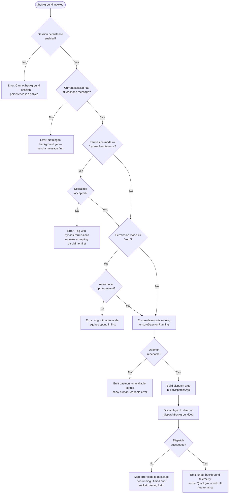

# `/background`

> Analysis basis: CC v2.1.147 bundle.js (AST extraction + Claude interpretation)
> Minimum version: v2.1.147

---

## Overview

The `/background` command (alias `/bg`) detaches the current interactive Claude Code session from the terminal and hands it off to the background daemon, which continues processing in a non-interactive worker process. The command performs a series of safety and state checks — including daemon liveness, permission-mode validation, and session-persistence eligibility — before dispatching a `cli-bg-dispatch` message to the daemon over its control socket. On success the terminal is freed; the job can be monitored or resumed later via daemon management commands.

---

## Registration

| Field | Value |
|---|---|
| type | `local-jsx` |
| name | `background` |
| description | `Send this session to the background and free the terminal` |
| aliases | `["bg"]` |
| argumentHint | `[prompt]` |
| immediate | `null` |
| module_id | `zp1` |
| load_inline | `true` |
| loc_byte | `12516659` |
| loc_byte_end | `12516899` |
| loc_line | `10725` |
| arbor_handler.name | `cr7` |
| arbor_handler.fqn | `claude-2.1.147::cr7` |
| arbor_handler.kind | `AsyncFunction` |
| arbor_handler.resolution_path | `module_id` |
| arbor_handler.n_hits | `0` |

Analysis basis: CC v2.1.147 bundle.js:+12516659

---

## Input Branching

The command has more than three distinct decision paths (persistence guard, prior-session check, permission-mode gate, daemon-liveness gate, dispatch, and error mapping), so a Mermaid flowchart is used.



Analysis basis: CC v2.1.147 bundle.js:+12516020 (handler entry `cr7`), +12516101 (persistence guard), +12516277 (empty-session guard), +12509741 (bypassPermissions gate), +12509903 (auto-mode gate), +12513105 (dispatch path), +12513113 (`tengu_background` event)

---

## Behavioral Spec

### 1. Handler Entry Point (`cr7`)

The Arbor-resolved handler is the async function `cr7` (FQN: `claude-2.1.147::cr7`), reached via `module_id = "zp1"` resolution.

```
async function handleBackgroundCommand(context):
    sessionPersistenceEnabled = checkSessionPersistenceEnabled(context)
    if not sessionPersistenceEnabled:
        return error("Cannot background — session persistence is disabled, …")

    if sessionHasNoMessages(context):
        return error("Nothing to background yet — send a message first.")

    permMode = getPermissionMode(context)
    if permMode == "bypassPermissions":
        if not disclaimerAccepted(context):
            return error("--bg with bypassPermissions requires accepting the disclaimer first. …")
    if permMode == "auto":
        if not autoModeOptInPresent(context):
            return error("--bg with auto mode requires opting in first. …")

    daemon = await ensureDaemonRunning(context)       // _B / gi_ path
    if daemon.status != "up":
        emitTelemetry("tengu_background_spawn_failed")
        return renderDaemonUnavailableError(daemon.status)

    dispatchArgs = buildDispatchArgs(context)          // Rr7 path
    result = await dispatchBackgroundJob(daemon, dispatchArgs)   // gi_ / YO path

    if result.error:
        emitTelemetry("tengu_background_spawn_failed")
        return renderDispatchError(result.errorCode)

    emitTelemetry("tengu_background")
    render("(backgrounded)")
    freeTerminal()
```

Analysis basis: CC v2.1.147 bundle.js:+12516020

---

### 2. Guard: Session Persistence (`cr7` inline check)

The handler reads application state to determine whether this session was started with persistence enabled. If persistence is absent (e.g., the session was launched in a mode that disables history), backgrounding is refused immediately.

```
function checkSessionPersistenceEnabled(context):
    appState = context.getAppState()
    return appState.sessionPersistenceEnabled == true
```

Error literal: `"Cannot background — session persistence is disabled, so the forked job would have nothing to resume."` (bundle.js:+12516101)

---

### 3. Guard: Non-Empty Session (`cr7` inline check)

The handler verifies at least one human or assistant message exists in the current conversation before attempting to background it.

```
function sessionHasNoMessages(context):
    messages = context.getMessages()
    return messages.length == 0
```

Error literal: `"Nothing to background yet — send a message first."` (bundle.js:+12516277)

---

### 4. Permission-Mode Gates (`gr7`)

Two separate gates are checked sequentially:

**bypassPermissions gate** (bundle.js:+12509741):

```
if permMode == "bypassPermissions":
    if not userHasAcceptedBypassDisclaimer():
        return error("--bg with bypassPermissions requires accepting the disclaimer first. Run `claude --dangerously-skip-permissions` once interactively.")
```

Flag constants observed: `"--dangerously-skip-permissions"` (bundle.js:+12509604), `"--allow-dangerously-skip-permissions"` (bundle.js:+12509650), `"bypassPermissions"` (bundle.js:+12509572).

**auto-mode gate** (bundle.js:+12509903):

```
if permMode == "auto":
    if not autoModeOptInRecorded():
        return error("--bg with auto mode requires opting in first. Run `claude --permission-mode auto` once interactively.")
```

Flag constant: `"--permission-mode"` (bundle.js:+12509541).

---

### 5. Argument Construction (`buildDispatchArgs` / `Rr7`)

The function `Rr7` assembles the CLI argument vector that the daemon worker will execute. Key behaviors observed:

```
function buildDispatchArgs(context):
    args = []

    // Session identity
    args.push("--agent")
    if context.sessionName:
        args.push("--name", context.sessionName)   // --name / -n

    // Resume / fork
    if context.resumeId:
        if context.resumeId startsWith "--resume=":
            args.push(context.resumeId)            // long form
        else:
            args.push("--resume", context.resumeId)
    if context.forkSession:
        args.push("--fork-session")

    // Continue / repl
    if context.continueSession:
        args.push("-c" / "--continue")

    // Permission passthrough
    if permMode == "bypassPermissions":
        args.push("--dangerously-skip-permissions")
    if permMode == "auto":
        args.push("--permission-mode", "auto")

    // Environment forwarding (subset)
    forwardEnvIfSet(args, "CLAUDE_CONFIG_DIR")
    forwardEnvIfSet(args, "CLAUDE_INTERNAL_FC_OVERRIDES")
    forwardEnvIfSet(args, "AWS_REGION", "AWS_DEFAULT_REGION", "AWS_PROFILE")
    forwardEnvIfSet(args, "GOOGLE_APPLICATION_CREDENTIALS",
                         "GOOGLE_CLOUD_PROJECT", "GCLOUD_PROJECT")

    // MCP / tool config
    addDirs   = collectAddDirs(context)        // --add-dir
    allowed   = collectAllowedTools(context)   // --allowed-tools
    disallowed = collectDisallowedTools(context) // --disallowed-tools
    model     = context.model                  // --model
    effort    = context.effort                 // --effort

    args.append(addDirs, allowed, disallowed, model, effort)

    // Prompt passthrough
    if context.prompt:
        args.push(context.prompt)

    return args
```

Analysis basis: CC v2.1.147 bundle.js:+12492980 (`--agent`), +12493007 (`--name`), +12508712 (`--resume=` prefix), +12493221 (`--fork-session`), +12493110 (`-c`), +12510519 (`CLAUDE_CONFIG_DIR`), +12512542 (`--add-dir`), +12512577 (`--allowed-tools`), +12512618 (`--disallowed-tools`), +12512649 (`--model`), +12512671 (`--effort`)

---

### 6. Daemon Lifecycle (`ensureDaemonRunning` / `_B`)

`_B` is the core daemon-readiness function. It orchestrates process lifecycle: health check → spawn if absent → poll for readiness.

```
async function ensureDaemonRunning(context):
    status = checkDaemonStatus()            // reads daemon.status.json
    emitTelemetry("tengu_bg_daemon_ensure_running")

    if status == "up":
        return daemon                       // already healthy

    if daemonServiceExecIsStale():
        emitTelemetry("tengu_bg_daemon_service_stale_exec")
        // fall back to transient spawn

    platform = detectPlatform()             // "macos" | "linux"
    mode = context.daemonMode              // "ask" | "run" | "no"

    if mode == "ask":
        answer = await promptUser("Install as a service now? [y/N/never, or 'once' just for now] ")
        emitTelemetry("tengu_bg_daemon_cold_start_ask_answer")
        // handle yes / once / never / no

    spawnResult = await spawnDaemon("--origin", "transient", "--spawned-by", ...)
    if spawnResult.error == "EACCES":
        emitTelemetry("tengu_bg_daemon_spawn_failed")
        return error

    // Poll for readiness: 30 000 ms short timeout, 60 000 ms long timeout
    pollResult = await pollDaemonReady(timeout_ms)
    if pollResult.timedOut:
        emitTelemetry("tengu_bg_daemon_ensure_transient_unreachable")
        return error

    return daemon
```

Timeouts: 30 000 ms (bundle.js:+12457533), 60 000 ms (bundle.js:+12457555).
Service-install prompt text: `"Install as a service now? [y/N/never, or 'once' just for now] "` (bundle.js:+12460352).

Analysis basis: CC v2.1.147 bundle.js:+12455825

---

### 7. Background Dispatch (`dispatchBackgroundJob` / `gi_`)

`gi_` constructs the dispatch message and sends it over the daemon's Unix domain socket via the IPC writer `YO`.

```
async function dispatchBackgroundJob(daemon, args):
    socketPath = buildSocketPath()           // wyH / Y$.join
    randomSuffix = generateRandom()          // sm1.randomBytes
    dispatchId = buildDispatchId(socketPath, randomSuffix)

    // Write dispatch file to jobs directory
    dispatchFile = path.join(jobsDir, dispatchId)
    await writeAtomicDispatchFile(dispatchFile, args)  // ez / $T8.mkdir + $T8.unlink

    // Connect to daemon control socket
    socket = await connectSocket(daemon.socketPath)    // YO / bX8.connect
    socket.setTimeout(/* connection timeout */)

    // Send cli-bg-dispatch message
    await socket.write({ type: "cli-bg-dispatch", dispatchId, args })
    emitTelemetry("tengu_bg_dispatch")

    // Await acknowledgement (6 000 ms window)
    ack = await waitForAck(socket, timeout=6000)
    if ack == null:
        emitTelemetry("tengu_bg_dispatch_fallback")
        return { error: "no ack" }

    // Retry logic on EALIVE / ESTALE / ESTARTING
    if ack.code == "EALIVE":
        return { error: "short_alive" }
    if ack.code == "ESTALE":
        return { error: "stale_short" }
    if ack.code == "ESTARTING":
        return { error: "estarting" }

    emitTelemetry("tengu_bg_dispatch_rescued")   // on successful re-try path
    return { ok: true, jobId: ack.jobId }
```

Ack timeout: 6 000 ms (bundle.js:+12488478).
Socket message key: `"cli-bg-dispatch"` (bundle.js:+12488237).
Dispatch subdirectory name: `"jobs"` (bundle.js:+4052736).

Analysis basis: CC v2.1.147 bundle.js:+12488042

---

### 8. Spare-Process Management (`w` / daemon side)

When the daemon receives a background dispatch it may service the request from a pre-warmed "spare" worker process to reduce cold-start latency.

```
function handleIncomingDispatch(dispatch):
    if spareWorkerAvailable():
        emitTelemetry("tengu_bg_spare_claim")
        worker = claimSpareWorker()
    else:
        emitTelemetry("tengu_bg_spare_claim_fail")
        worker = spawnNewWorker()          // KB.spawn

    if freemem() < LOW_MEM_THRESHOLD:
        emitTelemetry("tengu_bg_dispatch_low_mem")

    configureWorker(worker, dispatch)
    worker.start()

    scheduleSpareReplenishment()           // tengu_bg_spare_enable / tengu_bg_spare_spawn
```

Memory threshold signals: `tengu_bg_dispatch_low_mem` (bundle.js:+15118376).
Spare constants: `"spare"` (bundle.js:+15118567), `"exec"` (bundle.js:+15118681).

Analysis basis: CC v2.1.147 bundle.js:+15117679

---

### 9. Error Code → User Message Mapping (`OT8` / main handler render path)

After dispatch the main handler maps internal error codes to human-readable strings:

| Internal code | User-facing message |
|---|---|
| `daemon-unreachable` / `not running` | `"not running"` (bundle.js:+12499328) |
| `ack-timeout` / `timed out` | `"timed out"` (bundle.js:+12499366) |
| `dispatch-write` | `"couldn't write dispatch file"` (bundle.js:+12499405) |
| `enoconn` / socket missing | `"socket missing"` (bundle.js:+12499456) |
| `estarting` | `"service still starting"` (bundle.js:+12499495) |
| `EALIVE` / `short_alive` | `"Previous session is still shutting down — try again in a moment"` (bundle.js:+12496832) |
| `ESTALE` / `stale_short` | mapped via `stale_short` (bundle.js:+12496910) |

`daemon_unavailable` telemetry event emitted on entry to error path (bundle.js:+12497046).

Analysis basis: CC v2.1.147 bundle.js:+12512174

---

### 10. Daemon Worker Entry (`mLH` / `Mz1` / daemon side)

Once the daemon receives the job, `mLH` initialises the worker context. The worker type is `"task"` (bundle.js:+10545027). A `"detach-request"` lifecycle message is sent back to the spawning CLI process (bundle.js:+10550434) to signal that the terminal can be released. The worker writes output via `Jo` (which calls `jo.write`) and manages the `"daemon-worker"` origin marker (bundle.js:+2181174).

```
function initDaemonWorker(dispatch):
    workerContext = buildWorkerContext(dispatch, type="task")
    sendToSpawner({ type: "detach-request" })
    runAgentLoop(workerContext)       // xF1 main loop
```

Analysis basis: CC v2.1.147 bundle.js:+10550400

---

## State & Side Effects

| Item | Detail |
|---|---|
| Telemetry — primary | `tengu_background` (bundle.js:+12513113) — emitted on successful backgrounding |
| Telemetry — already backgrounded | `tengu_background_already_bg` (bundle.js:+12516034) — emitted when the session is already in background mode |
| Telemetry — spawn failed | `tengu_background_spawn_failed` (bundle.js:+12513044) |
| Telemetry — dispatch | `tengu_bg_dispatch` (bundle.js:+12490091) |
| Telemetry — dispatch fallback | `tengu_bg_dispatch_fallback` (bundle.js:+12490617) |
| Telemetry — dispatch rescued | `tengu_bg_dispatch_rescued` (bundle.js:+12495909) |
| Telemetry — daemon ensure | `tengu_bg_daemon_service_stale_exec`, `tengu_bg_daemon_install`, `tengu_bg_daemon_cold_start_ask`, `tengu_bg_daemon_cold_start_ask_answer`, `tengu_bg_daemon_spawn_failed`, `tengu_bg_daemon_service_poll_fallthrough`, `tengu_bg_daemon_ensure_transient_unreachable` |
| Telemetry — spare pool | `tengu_bg_spare_enable`, `tengu_bg_spare_claim`, `tengu_bg_spare_claim_fail`, `tengu_bg_spare_spawn` |
| Telemetry — low memory | `tengu_bg_dispatch_low_mem` (bundle.js:+15118376) |
| Telemetry — SIGKILL escalation | `tengu_bg_dispatch_sigkill_escalate` (bundle.js:+15117797) |
| Telemetry — daemon config reload | `tengu_daemon_config_reload` (bundle.js:+15132565) |
| Telemetry — rename (side path) | `tengu_rename_full_session_fork` (bundle.js:+11500642) |
| File system | Writes atomic dispatch file to `~/.claude/jobs/` directory; removes file on error or after ack |
| IPC socket | Opens Unix domain socket to daemon control endpoint; sends `"cli-bg-dispatch"` message; awaits ack within 6 000 ms |
| appState changes | Session state transitions to `"background session"` (bundle.js:+15153766); worker state transitions to `"stopped"` (bundle.js:+15153723) on exit |
| Terminal | Terminal is freed (detach-request message sent to spawning CLI) after successful dispatch |
| Sound | <!-- TODO: not found in depth-2 traversal; needs --depth 4 --> |
| Hook registration | No hook registration found in depth-2 traversal |
| Daemon process | May install or spawn a persistent daemon service; writes `daemon.status.json` (bundle.js:+12183634) |
| Config backups | Config-save path creates up to 5 backup copies (bundle.js:+3185789) in `backups/` subdirectory (bundle.js:+3186371) |

---

## Version History

| Version | Change |
|---|---|
| v2.1.147 | Initial analysis |

---

## Common Mistakes

1. **Invoking `/background` before sending any message.** The command requires at least one message in the conversation. Attempting to background an empty session immediately returns `"Nothing to background yet — send a message first."` (bundle.js:+12516277).

2. **Using `/background` in a session with persistence disabled.** If Claude Code was started in a mode that disables session history (e.g., certain non-interactive pipeline invocations), the command is blocked entirely because the resumed job would have no state to continue from (bundle.js:+12516101).

3. **Running `/background` with `--dangerously-skip-permissions` without prior interactive acceptance.** The disclaimer must be accepted once in an interactive session before the flag can be combined with backgrounding (bundle.js:+12509741).

4. **Running `/background` with `--permission-mode auto` without prior opt-in.** Similarly, auto-mode requires a one-time interactive opt-in before the background path is unblocked (bundle.js:+12509903).

5. **Expecting immediate job output in the terminal.** After a successful `/background`, the current terminal is freed and output is only available through daemon management commands (e.g., `claude daemon status`, job listing). There is no streaming back to the original terminal.

6. **Retrying immediately after `"Previous session is still shutting down"`.** The `EALIVE` / `short_alive` response (bundle.js:+12496832) indicates the prior job is still in teardown. A brief wait before retrying is required.

---

## Appendix — Identifier Mapping

> For bundle debugging only. Identifiers change across versions.

| Identifier | Role |
|---|---|
| `cr7` | Main handler for `/background` command (Arbor-resolved, AsyncFunction) |
| `OT8` | Top-level background command orchestrator (builds arg vector, calls daemon, renders result) |
| `Rr7` | Background dispatch argument builder (constructs CLI args for daemon worker) |
| `gr7` | Permission-mode gate checker (bypassPermissions / auto guards) |
| `gi_` | Core background dispatch function (writes dispatch file, connects socket, awaits ack) |
| `_B` | Daemon readiness ensurer (health check, spawn, poll) |
| `vZ6` | Daemon cold-start / service-install flow |
| `Bi_` | Dispatch fallback handler (no-ack / error path) |
| `xX8` | Daemon socket connection helper (low-level connect / event wiring) |
| `YO` | IPC socket writer (sends messages to daemon control socket) |
| `wyH` | Socket path builder |
| `am1` | Dispatch acknowledgement waiter |
| `Pc` | Session fork / job directory setup |
| `ai_` | Session state / UUID initialisation |
| `Xc` | Permission flag parser (`--permission-mode` value extractor) |
| `Lp1` | `--resume=` / `-r=` argument parser |
| `dr7` | `--dangerously-skip-permissions` flag checker |
| `Br7` | `--session-id=` argument parser |
| `Mp1` | Combined session-id / resume flag parser |
| `Fr7` | Fork-session flag (`--fork-session`) handler |
| `Sr7` | Shell command builder (platform-aware: `cmd.exe` / `/bin/sh`) |
| `qx6` | Windows / Git Bash availability checker |
| `mLH` | Daemon worker initialiser (sends `detach-request`) |
| `Mz1` | Task-type worker context builder |
| `Jo` | Daemon worker output writer |
| `w` | Daemon session manager (spare pool, SIGKILL escalation, spawn) |
| `Y` | Daemon job registry / supervisor (start/stop/config-update) |
| `LPH` | Daemon job state machine |
| `T` | Remote-control / `remoteControlAtStartup` handler |
| `ZtH` | Agent-loop context assembler |
| `gC7` | Agent abort / cleanup handler |
| `FW` | Main agent query loop |
| `xF1` | Core agent query executor (streaming, tool use, message normalisation) |
| `Rk` | Conversation context / compact-boundary builder |
| `Fj8` | Conversation file persistence writer |
| `FyH` | Conversation round-trip wrapper |
| `gG` | Tool schema builder |
| `OD7` | Tool schema formatter |
| `HX` | API client factory |
| `hA` | HTTP authentication header builder |
| `Vt8` | API key classifier (`sk-ant-` / managed-key) |
| `Bq` | HTTP client (foundry / mantle / vertex) |
| `kmH` | gRPC-style client wrapper |
| `ZC1` | Daemon status file reader (`daemon.status.json`) |
| `aE6` | Daemon status path builder |
| `M1` | Async-local-storage store accessor |
| `RK` | Jobs directory path resolver |
| `wG` | Jobs subdirectory builder |
| `dq` | Jobs directory scanner / state reader |
| `h5` | Atomic dispatch file writer |
| `ez` | Atomic file write utility |
| `Cw` | Dispatch file cache invalidator |
| `Ge` | Job state classifier (`working` / `active` / `daemon`) |
| `f4` | Path redaction utility (`[REDACTED]`) |
| `rm1` | Job list formatter |
| `ZH` | String coercion wrapper |
| `N` | Logger / debug emitter |
| `CH` | JSON serialiser wrapper |
| `B6` | JSON parser wrapper |
| `RH` | Error normaliser / telemetry error reporter |
| `n_` | Error constructor helper |
| `UH` | String normaliser |
| `V6` | Telemetry event emitter |
| `HY` | Amber-anchor / background-service tagger |
| `v$H` | Background service label builder |
| `ut` | Async telemetry utility |
| `mqH` | Telemetry queue flusher |
| `ROH` | Context-file / working-directory loader |
| `jG` | Working-directory basename resolver |
| `h6` | File-existence checker |
| `oV` | OS-level path helper |
| `zT8` | Background UI component renderer (JSX) |
| `CO` | Success UI sub-component |
| `xU` | Error UI sub-component |
| `NU` | Argument normaliser (Array.isArray guard) |
| `aJ8` | Tool-list `some` predicate |
| `nk` | Tool-list normaliser |
| `Rd` | Tool-list array builder |
| `MsH` | Tool-name prefix matcher |
| `OO` | Compact-boundary message extractor |
| `_W7` | Compact-boundary helper |
| `pX` | Compact-boundary marker |
| `R8H` | Config-file read wrapper |
| `M8` | Global config loader |
| `_L_` | Local config file writer (with backup rotation) |
| `n99` | Config schema validator |
| `AL_` | Config backup directory path builder |
| `sq6` | Atomic file write with permission preservation |
| `HL_` | Local config file reader |
| `Wf6` | Config schema migrator |
| `sUH` | Config source tagger (`local` / `migrated` / `native` / etc.) |
| `yy9` | Config entry iterator |
| `tUH` | Config timestamp stamper |
| `k$H` | Raw config file reader (with ENOENT / EEXIST handling) |
| `EQ4` | Config file watcher (watchFile / unwatchFile) |
| `x6` | Config hot-reload orchestrator |
| `o4_` | Config change event emitter |
| `Lm` | Settings layer merger (`userSettings` / `localSettings` / `flagSettings` / `policySettings`) |
| `m8` | Settings accessor |
| `JC` | Auto-mode consent checker |
| `b6` | Logger context accessor |
| `sb6` | Async-local-storage log store getter |
| `w_` | Log writer |
| `Nf` | Session message iterator |
| `aV` | Session map-to-array helper |
| `K` | Active-session registry |
| `Ek8` | Extra directories argument builder |
| `X` | MCP server connection handler |
| `G` | MCP tool list expander |
| `YN8` | MCP tool schema normaliser |
| `wD6` | UI render scheduling helper |
| `TVH` | Terminal title updater |
| `D` | Daemon child-process lifecycle manager |
| `j` | Worker process kill helper |
| `J` | Worker registry accessor |
| `ey` | Event emitter wrapper |
| `c` | React / Ink render helper |
| `Rq` | Daemon-worker thread initialiser |
| `T3H` | Thread startup helper |
| `$PH` | Environment / build-mode detector (`production` / `test`) |
| `wU1` | Test-mode flag reader |
| `dR` | Build-environment identifier |
| `v4` | UUID / crypto utility |
| `r9` | Service registration helper |
| `D9A` | Service registry |
| `HU_` | Agent-loop heartbeat |
| `D86` | Heartbeat interval manager |
| `BG7` | Forked-agent default-turns-exceeded handler |
| `H8H` | Subagent lifecycle reporter |
| `Cx` | Subagent exit-reason classifier |
| `HG6` | Remote-control tombstone checker |
| `PM1` | Remote-control tombstone producer |
| `G8` | Worker-process bootstrap |
| `e28` | Conversation context slice builder |
| `LK` | Tool-permission context filter |
| `yG1` | Session-name generator |
| `Wh` | String trimmer |
| `TK` | Conversation compact helper |
| `$G` | Compact-boundary tag |
| `fp1` | Fleet-mode flag parser |
| `UB` | Dispatch rescue / retry helper |
| `br7` | Status summary renderer |

Note: index built via Arbor fallback; some signals (telemetry, literals) may be missing — see arbor-fallback.js.