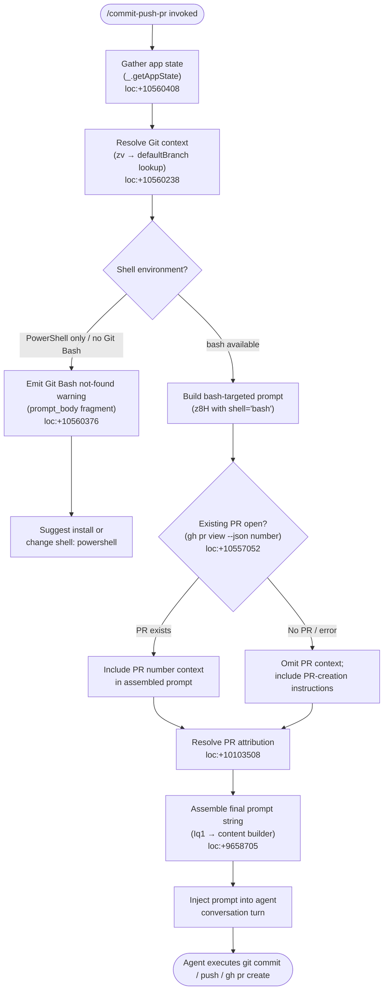

# `/commit-push-pr`

> Analysis basis: CC v2.1.147 bundle.js (AST extraction + Claude interpretation)
> Minimum version: v2.1.147

---

## Overview

The `/commit-push-pr` command is a `prompt`-type slash command that instructs the Claude Code agent to perform the full Git release workflow: stage and commit local changes, push the branch to a remote, and open a pull request via the GitHub CLI (`gh`). The command's handler (`getPromptForCommand`) assembles a context-aware prompt string at invocation time, incorporating repository state (current branch, remote configuration, existing PR status) and injects it directly into the agent conversation.

---

## Registration

| Field | Value |
|---|---|
| type | `prompt` |
| name | `commit-push-pr` |
| description | `Commit, push, and open a PR` |
| loc_byte | `10559975` |
| loc_byte_end | `10560587` |
| loc_line | `8463` |
| handler_method | `getPromptForCommand` |
| handler_method_start | `10560179` |
| handler_method_end | `10560586` |
| prompt_body.length | `203` |
| prompt_body.trace | `call→z8H(...) (1 literals)` |
| arbor_handler.name | `getPromptForCommand` |
| arbor_handler.fqn | `claude-2.1.147::getPromptForCommand` |
| arbor_handler.kind | `Method` |
| arbor_handler.resolution_path | `direct` |
| arbor_handler.n_hits | `3` |

Analysis basis: CC v2.1.147 bundle.js:+10559975

---

## Input Branching

The handler resolves multiple branches based on: (1) shell environment detection (bash vs. PowerShell), (2) whether an existing PR is already open, and (3) repository remote/default-branch resolution. This yields 4+ distinct paths, requiring a Mermaid flowchart.



---

## Behavioral Spec

### 1. Handler Entry and App-State Retrieval

`getPromptForCommand` is the sole handler method defined inline on the registration object. It is reached via `arbor_handler` (direct resolution at byte range `10560179`–`10560586`).

On invocation the handler immediately reads current application state via `_.getAppState` to obtain session context (model, allowed tools, shell configuration).

Analysis basis: CC v2.1.147 bundle.js:+10560408

### 2. Git Context Gathering (`zv`)

```
function resolveGitContext():
    defaultBranch = cacheGet("defaultBranch")          // lB8 → cAH.get  loc:+1055727
    if defaultBranch is cached:
        return defaultBranch
    // fall through to live resolution
    result = git("symbolic-ref", "--short",            // loc:+1066497, +1066512
                 "refs/remotes/origin/HEAD")            // loc:+1066522
    branch = result.trim()                             // loc:+1066592
    if not branch:
        // try known fallback names
        for candidate in ["main", "master"]:           // loc:+1066635, +1066642
            if git("show-ref", "--verify", "--quiet",  // loc:+1066704, +1066715, +1066726
                   "refs/heads/" + candidate") succeeds:
                branch = candidate
                break
    return branch
```

`Promise.all` is used at `+10560225` to parallelise this resolution alongside remote-info gathering (`o71`).

Analysis basis: CC v2.1.147 bundle.js:+10560238, +1066497

### 3. Shell Detection and Platform Branching (`z8H`)

The prompt body builder (`z8H`, called at `+10560376`) performs a two-step shell check:

```
function buildPromptBody(context):
    shell = context.shell                              // from app state / frontmatter
    if shell == "bash":                               // loc:+9657888
        // check Git Bash availability on win32
        if platform == "win32" AND gitBashNotFound:
            return errorFragment(
                "...requires bash ... Git Bash was not found..."
                // short fragment: "requires bash (`shell: bash`"
                // loc:+10560376 (prompt_body, length 203)
            )
        // proceed: assemble full commit-push-pr prompt
        return assembleFullPrompt(context)
    elif shell == "powershell":                       // loc:+9658134
        return assembleFullPrompt(context)
    else:
        return assembleFullPrompt(context)            // default: treat as bash
```

The 203-character prompt body is the error/guidance text for the Git Bash not-found case; the main workflow prompt is assembled separately by `assembleFullPrompt`.

Analysis basis: CC v2.1.147 bundle.js:+9657888, +9658134, +10560376

### 4. Existing PR Detection (`Ez1` → `O4`)

```
function detectExistingPR(shell):
    if shell == "powershell":
        cmd = "gh pr view --json number 2>$null; if (-not $?) { \"\" }"
                                                      // loc:+10557099
    else:
        cmd = "gh pr view --json number 2>/dev/null || true"
                                                      // loc:+10557052
    result = runCommand(cmd)
    prNumber = parseJSON(result).number               // may be null/absent
    return prNumber
```

`Ez1` (called at `+10560266`) orchestrates this detection and funnels the result into `Zz1` (string-replace helper at `+10559582`) to insert the PR number or a placeholder into the final prompt text.

Analysis basis: CC v2.1.147 bundle.js:+10560266, +10557052, +10557099

### 5. PR Attribution Resolution (`o71`)

```
function resolvePRAttribution(context):
    remotes = getRemotes(context)                     // git remote, loc:+10102735
    if no attribution data available:
        log("PR Attribution: returning default (no data)")
                                                      // loc:+10103508
        return defaultAttribution()
    // build attribution map from remote metadata
    keys = Object.keys(remotes)                       // loc:+10103177
    results = Promise.all(keys.map(fetchRemoteInfo))  // loc:+10103294
    return mergeAttributionResults(results)
```

The resolved attribution text — appended to the PR body — ends with the fragment `", ending with the attribution text shown in the example below"` (literal at `+10558235`).

Analysis basis: CC v2.1.147 bundle.js:+10103507

### 6. Memory/Context Injection (`o71` → memory fields)

```
function injectMemoryContext(promptParts):
    memoryField  = appState["memory"]                 // loc:+10103583
    memoriesField = appState["memories"]              // loc:+10103592
    if memoryField or memoriesField:
        prepend memory content to promptParts
    return promptParts
```

Analysis basis: CC v2.1.147 bundle.js:+10103583

### 7. Final Prompt Assembly (`Iq1`)

```
function buildFinalPromptString(parts):
    result = []
    for part in parts:
        trimmed = part.trim()                         // loc:+9658841
        if trimmed:
            result.push(trimmed)                      // loc:+9658850
    joined = result.join("\n")                        // loc:+9658959
    return joined
```

A `Nq1.randomUUID()` call at `+9658647` generates a unique invocation ID attached to the prompt turn.

Analysis basis: CC v2.1.147 bundle.js:+9658705, +9658841, +9658959

### 8. Permission and Tool Execution Pipeline (`arH` / `d2`)

Once the prompt is injected, the agent's tool execution loop (`d2` → `arH` → `L27`) governs every shell command issued:

```
function checkBashPermission(command, context):
    if isSandboxingEnabled():                         // loc:+10180764
        if isAutoAllowBashIfSandboxedEnabled():       // loc:+10180790
            return allow
    permissionOutcome = H.checkPermissions(command)   // loc:+10181006
    switch permissionOutcome:
        "deny"        → reject with message           // loc:+10180622
        "ask"         → prompt user                   // loc:+10180853
        "allow"       → proceed                       // loc:+10181782
        "passthrough" → proceed without logging       // loc:+10180931
    if dangerousRm(command):                          // loc:+10181545
        require explicit approval
    return outcome
```

Analysis basis: CC v2.1.147 bundle.js:+10180764, +10181006

---

## State & Side Effects

| Item | Detail |
|---|---|
| Telemetry | `tengu_bg_spare_enable` (loc:+15117130), `tengu_bg_low_mem_mb` (loc:+12461757), `tengu_bg_spare_spawn` (loc:+15117490), `tengu_daemon_config_reload` (loc:+15132565), `tengu_daemon_control` (loc:+15153889), `tengu_cobalt_ridge` (loc:+4775999), `tengu_auto_mode_fallback_to_ask` (loc:+10184576), `tengu_auto_mode_decision` (loc:+10185284), `tengu_bash_allowlist_strip_all` (loc:+10186528), `tengu_iron_gate_closed` (loc:+10189032), `tengu_auto_mode_denial_limit_exceeded` (loc:+10178790), `tengu_tool_empty_result` (loc:+4883900), `tengu_tool_result_persisted` (loc:+4884140) |
| Hook registration | `OPA` registers exit/error event listeners on the spawned subprocess (`H.on` at loc:+1037967); `CJA` uses `setTimeout`/`clearTimeout`/`Promise.race` for command timeout (loc:+1030872–1030947) |
| appState changes | `_sH` writes updated state via `H.setAppState` (loc:+10178356); `S_` reads `H.getAppState` (loc:+10458497); permission context updated via `q.setToolPermissionContext` (loc:+10177747) |
| Git side effects | Runs `git symbolic-ref`, `git show-ref`, `git diff --cached --name-status`, `git diff --stat`, `git commit`, `git push`, `gh pr create` / `gh pr view` as shell subprocesses |
| Sound | <!-- TODO: not found in depth-2 traversal; needs --depth 4 --> |
| Unique invocation ID | `Nq1.randomUUID()` at loc:+9658647 tags each invocation |
| Literal route tag | `/commit-push-pr` string literal present at loc:+10560565 (likely used for analytics routing) |

---

## Version History

| Version | Change |
|---|---|
| v2.1.147 | Initial analysis |

---

## Common Mistakes

1. **No `gh` CLI installed** — the command delegates PR creation to the GitHub CLI (`gh pr create`). If `gh` is absent or unauthenticated the agent will encounter a shell error; install and authenticate `gh` before using this command.
2. **Using on Windows without Git Bash** — when `shell: bash` is active (the default) and Git Bash is not installed, the command aborts with an error message referencing `https://git-scm.com/downloads/win`. Either install Git for Windows or set `shell: powershell` in project frontmatter.
3. **Dirty working tree with untracked files only** — the command stages tracked changes; entirely untracked files will not be committed unless explicitly added. Run `git add` first or confirm the agent is instructed to stage all files.
4. **Detached HEAD or no upstream remote** — `zv`'s `symbolic-ref` call requires an `origin/HEAD` pointer; a detached HEAD or missing remote yields a fallback to `main`/`master` guessing which may target the wrong base branch.
5. **Invoking in a non-git directory** — all Git sub-commands will fail immediately; the agent will surface shell errors rather than a user-friendly diagnostic.
6. **Permission rules blocking `Bash` tool** — if the session has restrictive `allowed_tools` or deny rules covering `Bash`, the agent will be blocked before any Git command runs. Check auto-mode classifier settings.

---

## Appendix — Identifier Mapping

> For bundle debugging only. Identifiers change across versions.

| Identifier | Role |
|---|---|
| `__handler_commit-push-pr` | Synthetic BFS entry point for the command handler; not a real bundle symbol |
| `zv` | Git context resolver — fetches default branch and remote HEAD info |
| `lB8` | Default-branch cache reader (`cAH.get`) |
| `T_` | Shell subprocess runner (top-level command executor) |
| `i2H` | Core subprocess spawn manager |
| `NPA` | Argument normaliser / platform path resolver (handles `.exe`, `cmd /q` on win32) |
| `hB8` | Subprocess option builder (stdout/stderr wiring) |
| `SB8` | Stdio-pipe setup helper |
| `CB8` | Output encoding handler (utf8) |
| `bJA` | Exit-code validator (`Number.isFinite` guard) |
| `eq6` | Buffered-data accumulator for subprocess stdout/stderr |
| `yB8` | Reflect-based subprocess proxy wrapper |
| `OPA` | Subprocess exit/error event listener registrar |
| `CJA` | Subprocess timeout enforcer (`setTimeout`/`Promise.race`) |
| `xJA` | Subprocess kill handler (`H.kill`) |
| `SJA` | Subprocess start handler |
| `RJA` | Subprocess SIGTERM sender |
| `fPA` | Parallel stdio stream reader (`Promise.all`) |
| `q16` | Subprocess result aggregator |
| `LPA` | stdout pipe connector (`A.pipe`) |
| `MPA` | stderr pipe connector (`A.add`) |
| `UJA` | Bound stdout-stream reader |
| `D` | Daemon/background-process manager |
| `V6` | Daemon registry / module-set manager |
| `$` | Disposable resource container (`$.dispose`, `ZC1`) |
| `sG8` | macOS low-memory daemon monitor |
| `V6A` | Background PTY spare-process spawner (`Bun.spawn`, `--bg-pty-host`) |
| `c` | Generic utility / constant holder |
| `Az` | App-state accessor alias |
| `N` | Log-level / debug-output dispatcher |
| `q8` | Queue or deferred-work scheduler |
| `RH` | Error reporter / log-error dispatcher (`Gl.logError`) |
| `JFK` | String coercion helper |
| `o71` | PR attribution and remote-info resolver |
| `$RH` | Remote-metadata fetcher |
| `eO6` | Environment/URL resolver (staging vs. production) |
| `FD` | Filesystem-backed daemon state manager |
| `l_` | Module-init / export-binder |
| `q` | Sync-file unlink helper (`HfK.unlinkSync`) |
| `jD_` | Daemon lock-file / PID-file manager |
| `rfL` | Lock-file path resolver |
| `HA` | Settings loader entry point |
| `Km` | Settings-from-disk orchestrator (`loadSettingsFromDisk_start/end`) |
| `gR` | Policy-settings parser |
| `Wq` | Memory-usage sampler during settings load |
| `Xg8` | Settings load pipeline (policy + flag settings) |
| `WF` | Flag-settings merger |
| `xI6` | Settings cache writer |
| `H` | Randomised exponential-backoff retry helper |
| `dP7` | Conversation-history context builder |
| `A` | Lowercase-normalisation utility |
| `M` | Stream/connection close manager |
| `WX_` | MCP / tool-list resolver with file-stat weighting |
| `uYH` | Tool-context builder (b6, m4, w_ inputs) |
| `h6` | Token/content-hash helper (`oV`) |
| `Y` | Server/MCP lifecycle manager (start/stop/updateConfig) |
| `z` | Daemon stop/control state machine |
| `X5q` | File-extension and content-type classifier |
| `t2L` | Staged-diff name-status runner (`git diff --cached --name-status`) |
| `G5q` | Diff-stat parser (`git diff --stat`, "file(s) changed" extraction) |
| `L` | Async-task set with finally-cleanup |
| `nP7` | Message-history compaction / boundary finder |
| `XM` | Path-join and working-directory builder |
| `sy` | Content hash via `oV` |
| `w_` | Content-hash alias |
| `$x6` | Binary file header / encoding detector (BOM, UTF-8) |
| `IUK` | Buffer-from-string factory |
| `SUK` | Line-delimiter scanner (indexOf + JSON.parse) |
| `RUK` | Multi-line chunk parser |
| `CUK` | Buffer copy/merge helper |
| `bUK` | Buffer allocate-and-copy helper |
| `xUK` | Kx6-based encoding finaliser |
| `_WH` | NDJSON / streaming-output parser |
| `HgK` | Stream-chunk header reader |
| `_gK` | JSON array accumulator (indexOf + concat) |
| `qgK` | Substring JSON extractor (indexOf + JSON.parse) |
| `AgK` | toString-based JSON line parser |
| `K` | Column-padded display formatter (`padEnd`) |
| `QP7` | Message-history filter (user/assistant roles) |
| `gP7` | Message content-type validator (text/image/document) |
| `lP7` | Tool-use message classifier (assistant + tool_use) |
| `Jm_` | Team-member file tester |
| `jq` | Model-ID normaliser and display-name mapper |
| `AQ6` | HA-delegating model-info fetcher |
| `Ij` | Model-ID family classifier (opus/sonnet/haiku, includes/replace) |
| `By8` | Model special-case handler |
| `eP` | Model display-name replacer |
| `Bq` | Bash/PowerShell prompt-part assembler |
| `ps` | Shell-invocation builder (aV, _AH, XA, FF) |
| `aV` | Shell argument validator |
| `_AH` | Shell argument escaper |
| `FF` | Full prompt formatter (trim, startsWith, ImH, _99, W24, C9H, lq, G24) |
| `lq` | Commit-message / PR-body formatter |
| `GW` | u9H-based commit context fetcher |
| `C9H` | R9H.includes-based content guard |
| `yv` | W3+gf branch-description builder |
| `kmH` | gf-based commit subject formatter |
| `kv` | W3+gf PR-title formatter |
| `A99` | kv-delegating attribution assembler |
| `W3` | hA-based base-branch resolver |
| `Sd6` | E24.includes-based scope checker |
| `ymH` | UH-delegating message sanitiser |
| `bJ` | lq+WW composite PR-body builder |
| `WW` | Full PR message assembler (GA, gs, W3H, hmH, kv, tP, W3, hA, gf, yv) |
| `Z5q` | Model-family includes-check (opus-4 family detection) |
| `Ez1` | Existing-PR detector and prompt-patch orchestrator |
| `ykH` | Claude Opus 4.7 model-context builder |
| `X3H` | endsWith + jq model-suffix validator |
| `Et8` | X3H-delegating model validator wrapper |
| `Zz1` | PR-number string-replace patcher |
| `O4` | o6+QAH config/env reader |
| `z8H` | Main prompt-body builder (shell check, matchAll, Promise.all) |
| `Xp` | o6+UH+r1+QAH+V6 environment-context assembler |
| `UH` | String-coerce helper (String constructor) |
| `r1` | String-coerce helper variant |
| `nA8` | H.replace-based text sanitiser |
| `d2` | Tool-call dispatch entry (arH orchestrator) |
| `arH` | Permission-check and tool-execution orchestrator |
| `L27` | Bash-tool permission evaluator (sandboxing, auto-allow, checkPermissions) |
| `S_` | App-state reader/writer (`getAppState`, `kP8`) |
| `t06` | Tool-result callback |
| `_sH` | App-state updater (`Object.assign` + `setAppState`) |
| `i51` | Tool-invocation recorder |
| `cd` | Recursive subcommand result accumulator |
| `iJ8` | Recursive permission-context handler |
| `d51` | Tool-output serialiser |
| `iq` | MCP-prefix ownership checker (`Object.hasOwn`, `startsWith`) |
| `lJ8` | Late-stage permission logger |
| `Ru` | Permission-risk classifier (`high` risk handler) |
| `PW_` | Allowlist-strip-all handler |
| `Wxq` | Auto-mode decision set manager (`q.add`) |
| `tD6` | Auto-mode classifier request/response handler |
| `OwH` | Auto-mode decision set deleter (`q.delete`) |
| `yd6` | P3H-based permission-denial formatter |
| `$86` | inputTokens accumulator |
| `Pw` | outputTokens accumulator |
| `O86` | cacheReadInputTokens accumulator |
| `z86` | cacheCreationInputTokens accumulator |
| `Xk` | V6-delegating tool-registry lookup |
| `o51` | Tool-not-found error builder |
| `C51` | Tool-schema validator |
| `K27` | Headless-mode denial counter and abort gate |
| `r51` | Tool-result formatter |
| `q27` | Hook-rewrite and permission-context setter |
| `n51` | Tool-execution finaliser |
| `YP` | Agent stop-sequence / message-end detector |
| `RM1` | Agent turn result aggregator |
| `f` | Agent model-state accessor (EkH, k7K, L.get/values) |
| `QQH` | Tool-result mapper (`mapToolResultToToolResultBlockParam`) |
| `q6q` | Tool-result content normaliser |
| `SOL` | Tool-result text trimmer and array-type guard |
| `M6q` | Array-type tool-result detector |
| `f6q` | Tool-result reducer |
| `UzH` | Tool-result content serialiser (text/image/document) |
| `FzH` | Tool-result error formatter |
| `BzH` | O1-delegating tool-result type coercer |
| `_6q` | Token-count limiter (`Number.isFinite`, `Math.min`) |
| `Iq1` | Final prompt-string builder (trim + join) |
| `Iz7` | Iq1+ZH prompt-string finaliser |
| `ZH` | String-constructor wrapper |

---

Note: index built via Arbor fallback; some signals (telemetry, literals) may be missing — see arbor-fallback.js.