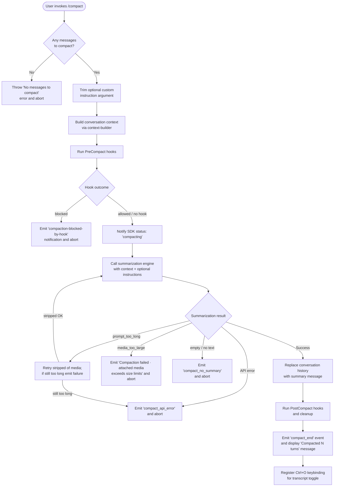

# `/compact`

> Analysis basis: CC v2.1.147 bundle.js (AST extraction + Claude interpretation)
> Minimum version: v2.1.147

---

## Overview

The `/compact` command summarizes the current conversation to free up context-window space, replacing the full message history with a compact summary. It supports an optional custom instruction argument that guides the summarization, and it may also be triggered automatically by the runtime (reactive compaction) when context usage exceeds a configured threshold.

---

## Registration

| Field | Value |
|---|---|
| type | `local` |
| name | `compact` |
| description | `Free up context by summarizing the conversation so far` |
| argumentHint | `<optional custom summarization instructions>` |
| supportsNonInteractive | `true` |
| thinClientDispatch | `post-text` |
| module_id | `kz1` |
| load_inline | `true` |
| loc_byte | `10564301` |
| loc_byte_end | `10564614` |
| loc_line | `8469` |
| arbor_handler.name | `IE7` |
| arbor_handler.kind | `AsyncFunction` |
| arbor_handler.fqn | `claude-2.1.147::IE7` |
| arbor_handler.resolution_path | `module_id` |
| arbor_handler.n_hits | `0` |

Analysis basis: CC v2.1.147 bundle.js:+10564301

---

## Input Branching

There are more than three distinct execution paths depending on message availability, hook outcome, and summarization result, so a flowchart is used.



---

## Behavioral Spec

### Entry point — handler (IE7)

Analysis basis: CC v2.1.147 bundle.js:+10563307

```
async function compactCommandHandler(appState, userArgument):

    # Guard: must have messages
    if conversationMessages is empty:
        throw Error("No messages to compact")       # bundle.js:+10563338

    # Normalise user instruction
    customInstructions = userArgument?.trim() ?? ""  # bundle.js:+10563370

    # Build summarization context (delegates to contextBuilder)
    context = buildContext(appState)                 # bundle.js:+10563416

    # Invoke the core compact worker
    result = await compactWorker(appState, context, customInstructions)
                                                     # bundle.js:+10563436

    # Post-compact: rebuild system prompt, update app state, display UI
    rebuildSystemPrompt(appState)                    # bundle.js:+10563473
    updateAppState(appState)                         # bundle.js:+10563497, +10563603
    runPostCleanup(appState)                         # bundle.js:+10563628

    # Display summary keybinding hint
    registerKeybinding("app:toggleTranscript", "Global", "ctrl+o")
                                                     # bundle.js:+10562599
    displayCompactedMessage(result.turnCount)        # bundle.js:+10562738

    if cancelled:
        display("Compaction canceled.")              # bundle.js:+10563908
```

### Core compact worker (kE7)

Analysis basis: CC v2.1.147 bundle.js:+10560820

```
async function compactWorker(appState, context, customInstructions):

    startTime = performance.now()                    # bundle.js:+10560820

    # Emit progress event
    emit("compact_progress")                         # bundle.js:+10560683

    # Run PreCompact hooks
    hookResult = await runHooks("pre_compact", context)
                                                     # bundle.js:+10560737
    if hookResult.blocked:
        emitNotification("compaction-blocked-by-hook",
                         "compaction blocked by PreCompact hook")
                                                     # bundle.js:+9713556
        return { blocked: true }

    # Notify SDK status
    emit("sdk_status", "compacting")                 # bundle.js:+10560779, +10560799

    # Gather system-prompt material, memory, MCP state
    [systemPromptParts, memoryContent] = await Promise.all([
        gatherSystemPromptContext(appState),         # bundle.js:+10560882
        gatherMemoryContext(appState)
    ])

    # Emit stream_mode / response_length markers
    emit("stream_mode", "requesting")                # bundle.js:+10561097, +10561116
    emit("response_length", "reset")                 # bundle.js:+10561154, +10561175

    emit("compact_start")                            # bundle.js:+10561241

    # Perform summarization API call
    summaryResult = await runSummarizationQuery(
        context, systemPromptParts, memoryContent, customInstructions
    )                                                # bundle.js:+10561272

    if summaryResult.error == "prompt_too_long":
        # Retry without media attachments
        strippedResult = await runSummarizationQuery(
            stripMedia(context), systemPromptParts, memoryContent, customInstructions
        )
        if strippedResult.error:
            emitError("Compaction failed · conversation could not be reduced below the context limit")
                                                     # bundle.js:+10561445
            return { error: "prompt_too_long" }
        summaryResult = strippedResult

    if summaryResult.error == "media_too_large":
        emitError("Compaction failed · attached media exceeds size limits")
                                                     # bundle.js:+10561568
        return { error: "media_too_large" }

    if summaryResult.error:
        emitError("unknown error")                   # bundle.js:+10561693
        return { error: summaryResult.error }

    # Store compactMetadata for later reference
    appState.compactMetadata = summaryResult.metadata # bundle.js:+10561777

    # Trigger post-compact cleanup (clear caches, reset autonomous-loop counters, etc.)
    runPostCompactCleanup(appState)                  # bundle.js:+10563628

    emit("compact_end", { success: true })           # bundle.js:+10562321, +10562522

    return summaryResult
```

### Context builder (XLH → kjH / hj8)

Analysis basis: CC v2.1.147 bundle.js:+9760085

```
function buildContext(appState):
    # Convert raw conversation turns into a normalised structure,
    # applying role tags ("assistant", "user", "api_system")
    # and attachment types ("image", "text", "file", "pdf", "notebook")
    messages = normaliseMessages(appState.messages)  # bundle.js:+9760014

    # Determine context-window token budget
    tokenBudget = computeTokenBudget(appState)       # bundle.js:+9760035

    # Flag the compact boundary position
    boundary = markCompactBoundary(messages)         # bundle.js:+10277345

    return { messages, tokenBudget, boundary }
```

### Reactive compaction engine (qx_ → Gj8 → YY7)

Analysis basis: CC v2.1.147 bundle.js:+9763298

The reactive path is invoked automatically by the runtime when context usage reaches a threshold (≥ 80 % by the `compact_reactive` literal at bundle.js:+9763967).

```
async function reactiveCompact(appState):

    emit("compact_reactive")                         # bundle.js:+9763967

    # Require at least 2 message groups; bail otherwise
    if groups.length < 2:
        log("Reactive compact: fewer than 2 groups, nothing to compact")
                                                     # bundle.js:+9734079
        emit("too_few_groups")                       # bundle.js:+9734169
        return

    # Slice messages for summarization (depth-3 grouping)
    summarizeSet = sliceGroupsForSummarization(groups, depth=3)
                                                     # bundle.js:+9734316

    # Guard: must have at least one assistant message in the set
    if not summarizeSet.hasAssistantMessage:
        log("Reactive compact: no assistant messages in summarize set, bailing")
                                                     # bundle.js:+9734641
        emit("exhausted")                            # bundle.js:+9734743
        return

    emit("tengu_reactive_compact_attempt")           # bundle.js:+9734802

    summaryResult = await runSummarizationQuery(summarizeSet)

    if summaryResult.error == "media_too_large":
        log("Reactive compact: summarize hit media-size error, retrying stripped")
                                                     # bundle.js:+9735525
        strippedResult = await runSummarizationQuery(stripMedia(summarizeSet))
        if strippedResult.error:
            emit("media_unstrippable")               # bundle.js:+9735640
            emit("tengu_reactive_compact_failed")
            return
        summaryResult = strippedResult

    if summaryResult.noAssistantMessage:
        log("Reactive compact: no assistant message in summarization response")
                                                     # bundle.js:+9732796
        emit("tengu_reactive_compact_failed")
        return

    if summaryResult.emptyText:
        log("Reactive compact: empty summary text in summarization response")
                                                     # bundle.js:+9733239
        emit("tengu_reactive_compact_failed")
        return

    applyReactiveCompactResult(appState, summaryResult)
    emit("tengu_reactive_compact_succeeded")         # bundle.js:+9765818
```

### Summarization model selection (AG → Tm)

Analysis basis: CC v2.1.147 bundle.js:+2909991

The summarization call uses a dedicated model selection path. Supported model name prefixes include `claude-3-`, `claude-opus-4-*`, `claude-sonnet-4-*`, and `claude-haiku-4-5`. Token-limit constants used during model selection:

- 64 000 tokens (bundle.js:+2910817)
- 128 000 tokens (bundle.js:+2910825)
- 32 000 tokens (bundle.js:+2910866)

The compaction agent is explicitly constrained from using tools; any tool-use attempt is denied with the message "Tool use is not allowed during compaction" (bundle.js:+9724949).

### Post-compact cleanup ($o)

Analysis basis: CC v2.1.147 bundle.js:+9758924

```
function postCompactCleanup(appState):
    # Finalize precomputed compact if present
    finalizePrecomputedCompact()                     # bundle.js:+9758934

    # Clear response-cache stores
    clearResponseCache()                             # bundle.js:+10160316
    clearAdditionalCaches()                          # bundle.js:+6503864, +6503876

    # Clear any pending state
    clearPendingState()                              # bundle.js:+7829250, +7828340

    # Reset autonomous-loop delivery counter
    resetAutonomousLoopDelivered()                   # bundle.js:+9759046

    # Finalise app state
    updateOutputTokenCount()                         # bundle.js:+9759096
    runEbCleanup()                                   # bundle.js:+9759202
```

---

## State & Side Effects

| Item | Detail |
|---|---|
| Telemetry — compact events | `tengu_compact` (bundle.js:+9717422), `tengu_reactive_compact_attempt` (+9734802), `tengu_reactive_compact_failed` (+9763564), `tengu_reactive_compact_succeeded` (+9765818), `tengu_compact_failed` (+9728547), `tengu_compact_ptl_retry` (+9715511), `tengu_compact_cache_prefix` (+9715039), `tengu_compact_cache_sharing_success` (+9725826), `tengu_compact_cache_sharing_fallback` (+9726456), `tengu_precomputed_compact_discarded` (+9742498) |
| Telemetry — hook events | `tengu_run_hook` (+12772747), `tengu_repl_hook_finished` (+12756826), `tengu_hook_plugin_metrics` (+12751418), `tengu_hook_plugin_injected` (+12771085) |
| Telemetry — supporting | `tengu_cobalt_raccoon` (+9760038), `tengu_amber_redwood2` (+9768195), `tengu_slate_harrier` (+12836896), `tengu_sparrow_ledger` (+12827383), `tengu_chair_sermon` (+10241271) |
| Pre-compact hook | `PreCompact` hook type fires before summarization; a `block` result aborts compaction and surfaces notification `"compaction-blocked-by-hook"` (bundle.js:+9713556) |
| Post-compact hook | `PostCompact` hook type fires after the new summary is installed (bundle.js:+12752575) |
| appState changes | `compactMetadata` field written after success (bundle.js:+10561777); response caches cleared; autonomous-loop counter reset; conversation messages array replaced with summary |
| Progress events | `compact_progress` → `sdk_status:compacting` → `compact_start` → `compact_end` (literals at +10560683, +10560799, +10561241, +10562321) |
| Keybinding registration | `app:toggleTranscript` bound to `ctrl+o` under "Global" after successful compaction (bundle.js:+10562599) |
| Sound | <!-- TODO: not found in depth-2 traversal; needs --depth 4 --> |
| Non-interactive support | `supportsNonInteractive: true` — command runs headlessly |
| thinClientDispatch | `post-text` — result is posted as text in thin-client mode |
| OTel span | `claude_code.compaction` span emitted (bundle.js:+9714263) |

---

## Version History

| Version | Change |
|---|---|
| v2.1.147 | Initial analysis |

---

## Common Mistakes

1. **Invoking `/compact` with no prior messages** — The handler immediately throws "No messages to compact" (bundle.js:+10563338). Ensure at least one conversation turn exists before running the command.
2. **Expecting tool calls during compaction** — The summarization agent denies all tool use with "Tool use is not allowed during compaction" (bundle.js:+9724949). Custom instructions must be plain text only.
3. **Assuming compaction always succeeds after a `prompt_too_long` error** — The handler retries once with media stripped; if the stripped payload is still too large, it surfaces "Compaction failed · conversation could not be reduced below the context limit" (bundle.js:+10561445) and does not retry further.
4. **Blocking a `PreCompact` hook unintentionally** — A hook returning `block` suppresses compaction silently from the user's perspective (only a notification is emitted). Verify hook scripts return the intended decision object.
5. **Relying on conversation history immediately after `/compact`** — Post-compact cleanup clears response caches and resets state counters. Any logic that inspects cached prior turns may find them unavailable until the next API round-trip.

---

## Appendix — Identifier Mapping

> For bundle debugging only. Identifiers change across versions.

| Identifier | Role |
|---|---|
| `IE7` | Main `/compact` command handler (AsyncFunction) |
| `OO` | Compact-boundary message builder |
| `_W7` | Message-boundary helper |
| `pX` | Boundary insertion utility |
| `XLH` | Conversation context builder (entry) |
| `kjH` | Message normalisation sub-routine |
| `h_` | Message-list accessor |
| `V6` | Context-token-budget calculator |
| `Df6` | Token budget sub-calculation A |
| `wf6` | Token budget sub-calculation B |
| `Ct` | Context-window size resolver |
| `As6` | Model-context cache accessor |
| `x6` | Token-count emitter |
| `AG` | Summarization model selector |
| `UH` | String coercion helper |
| `GW` | Model parameter builder |
| `u9H` | Model ID normaliser |
| `Tm` | Model token-limit table |
| `jq` | API model-includes checker |
| `Sh` | Provider classifier (firstParty etc.) |
| `RD` | Provider-type resolver |
| `x9H` | Message-trimming helper |
| `Qr6` | Chunked-prompt builder |
| `bP` | Context serialiser |
| `hj8` | Context-window config resolver |
| `QG` | Auto-compact-enabled flag reader |
| `C7` | Context-management config parser |
| `Mx_` | Token-percentage parser |
| `kE7` | Core compact worker |
| `CZ` | Summarization query dispatcher |
| `jD7` | API message formatter for summarization |
| `EzH` | Message-role tagger |
| `vx_` | Full API message normaliser |
| `ud` | System-prompt assembler |
| `hL` | System-prompt segment builder |
| `h6` | Base system-prompt getter |
| `Ah` | Effort-level injector |
| `Z2` | Tool-permission segment builder |
| `EZ` | Effort annotation inserter |
| `JV` | Joined-segment formatter |
| `b6` | Segment appender |
| `e2` | Hook executor for PreCompact / PostCompact |
| `Qm` | Policy-settings reader |
| `N` | Hook-type classifier |
| `k7H` | Hook-context builder |
| `Ho_` | Installed-hook loader |
| `O` | Background-session identifier |
| `FB1` | Hook-filter: first-party |
| `er_` | Hook-filter: third-party |
| `QB1` | Hook-batch runner |
| `c` | Shared constant store |
| `CH` | JSON serialiser wrapper |
| `RH` | Error logger for hooks |
| `mH` | Memory-hook helper |
| `C2H` | Hook-callback invoker |
| `iZ` | Abort-controller manager |
| `J` | Worker-process registry |
| `Y_H` | Hook-output parser |
| `SV` | Hook status emitter |
| `oT8` | Blocking-hook runner |
| `ar_` | MCP-hook runner |
| `eT8` | Hook-JSON output parser |
| `O8H` | Hook-entry-to-result mapper |
| `or_` | HTTP-hook executor |
| `BB1` | HTTP-hook body parser |
| `O7H` | Hook metadata store |
| `HE8` | Shell-hook executor (spawn) |
| `WNH` | Watch-path hook handler |
| `bH` | Boolean coercion helper |
| `K` | Promise-filter utility |
| `L` | Active-set tracker |
| `M` | Stream/process wrapper |
| `f` | MCP-server state manager |
| `EkH` | MCP connection handler |
| `k7K` | MCP update applier |
| `$` | MCP client registry |
| `_D5` | MCP tool-pool synchroniser |
| `Iz1` | System-prompt + memory gatherer |
| `UG` | Full system-prompt constructor |
| `wo_` | String-to-UH normaliser |
| `Tw8` | Tool-description mapper |
| `HA` | Kilometre-formatter |
| `zV` | System-prompt section joiner |
| `gs7` | Code-style guideline injector |
| `Qs7` | Context-management reminder builder |
| `Xo_` | Memory-mode resolver |
| `Pt7` | Memory-mode sub-resolver |
| `kW6` | Memory-content injector |
| `ds7` | Memory sub-dispatcher |
| `Ht7` | Schedule/routines injector |
| `bf6` | CLAUDE.md / memory-file loader |
| `ls7` | Language-settings injector |
| `ft7` | Environment-info builder (static) |
| `Mt7` | Environment-info builder (simple) |
| `ns7` | Output-style injector |
| `is7` | Background-session injector |
| `Ot7` | Working-mode injector |
| `zt7` | Scratchpad injector |
| `Dt7` | Brief-mode injector |
| `Jt7` | Focus injector |
| `qt7` | GrowthBook env injector |
| `KH1` | Tool-schema builder |
| `At7` | Ant-model-override injector |
| `rs7` | Reproduce-verify-workflow injector |
| `os7` | Doing-tasks instructions injector |
| `as7` | Tool-usage instructions injector |
| `ss7` | Memory-update instructions injector |
| `ts7` | Keybinding injector |
| `_t7` | Tone-and-style injector |
| `Nh9` | Team-memory prompt builder |
| `J$H` | MCP-instructions injector |
| `S_` | App-state allowed-tools reader |
| `kP8` | Allowed-tools sub-reader |
| `bx` | System-prompt cache buster |
| `TK` | Model identity checker |
| `iY` | System-prompt injector flag |
| `wj8` | Notification emitter |
| `mb_` | Message-batch helper |
| `qx_` | Reactive-compact orchestrator |
| `lj` | Compact-boundary marker |
| `LHH` | Cache-prefix set accessor |
| `IHq` | Cache-hit checker |
| `Ii` | Cache-control injector |
| `Gj8` | Reactive-compact group slicer |
| `PaH` | Message-push accumulator |
| `D11` | Group-depth calculator |
| `w` | Background-session process manager |
| `YY7` | Reactive-compact summarize caller |
| `j` | Sub-process registry |
| `DY7` | Depth-calculator wrapper |
| `JG` | Permission context builder |
| `eY` | App-state snapshot reader |
| `pw` | Progress-event emitter |
| `gb` | Path sanitiser |
| `P2L` | URL redactor |
| `j2L` | IP address redactor |
| `z2L` | Email redactor |
| `$2L` | Home-dir replacer |
| `W2L` | Tilde-path replacer |
| `X2L` | Generic path replacer |
| `K8` | Const-lookup helper |
| `C11` | Compaction-message assembler |
| `ZZH` | Zero-value sentinel |
| `Nz6` | Map-from-entries helper |
| `hEH` | Token-header builder |
| `pQ` | Usage-metric emitter |
| `xD6` | Cache-diagnosis helper |
| `KRH` | Cache-key builder |
| `GaH` | Model-version tag reader |
| `A` | Column-format utility |
| `K06` | UUID generator (wV-based) |
| `L8H` | Tool-set tracker |
| `bY7` | System-prompt segment collector |
| `IjH` | Full system-prompt assembler |
| `ub_` | Last-assistant-message extractor |
| `a4H` | Turn-counter helper |
| `Mj8` | Token rounding helper |
| `Lj8` | Token breakdown logger |
| `$o` | Post-compact cleanup runner |
| `Vj8` | Precomputed-compact finaliser |
| `Ej8` | Compact-ready state checker |
| `j11` | Compact-timing logger |
| `kz6` | History-event emitter |
| `HE` | History-event type |
| `K8H` | Hook-cache manager |
| `by8` | Hook-cache setter |
| `Qy8` | BI-event emitter |
| `kj8` | Response-cache clearer |
| `mJq` | Additional-cache clearer |
| `Txq` | Pending-state clearer |
| `$wH` | State-reset helper |
| `Pw` | Output-token counter updater |
| `eb_` | State-finaliser |
| `DkH` | App-state writer |
| `Nz1` | Compaction-result display |
| `scH` | Turn-count formatter |
| `jyL` | Model-name display helper |
| `lJ` | Keybinding registrar |
| `zH8` | Keybinding lookup |
| `YH8` | Keybinding installer |
| `QzH` | OTel-span emitter for compaction |
| `A4` | OTel attribute builder |
| `xZH` | OTel resource builder |
| `u86` | OTel event splitter |
| `orH` | Full reactive-compact runner |
| `oD6` | OTel span starter |
| `pKH` | Span-context getter |
| `nZ` | Span-name builder |
| `dk` | Active-span accessor |
| `JaH` | Pre-compact hook data builder |
| `zj8` | String-trim helper |
| `G8` | Session UUID generator |
| `Y11` | Summarization query runner |
| `v_1` | Rate-limit checker |
| `rD8` | Rate-limit store accessor |
| `V_1` | Rate-limit updater |
| `FW` | Main query-loop |
| `tY8` | App-state turn updater |
| `G` | Session-group store |
| `ck` | Random-bytes generator |
| `H8H` | Model-version reader |
| `Cx` | Turn-result handler |
| `HG6` | Tombstone-event checker |
| `ijH` | Away-summary trigger |
| `yP8` | Turn-result formatter |
| `PM1` | Tombstone-event emitter |
| `D` | Background-process descriptor |
| `BG7` | Fork-agent turn runner |
| `pb_` | Prompt-too-long handler |
| `JLH` | Max-output-tokens calculator |
| `j$H` | Token-limit lookup |
| `KHH` | Max-output-tokens parser |
| `LE` | Last-turn finder |
| `Oj8` | Summary-tag extractor |
| `$j8` | `<summary>` tag finder |
| `s8` | Empty-string sentinel |
| `I` | Away-summary manager |
| `VY8` | App-focus state reader |
| `xM5` | Away-summary cache reader |
| `s6K` | Away-summary state setter |
| `Z` | Away-summary result holder |
| `w18` | Away-summary query runner |
| `sM1` | Session-UUID generator (wV) |
| `B` | Sub-process state holder |
| `fY7` | Tool-use-denier for compaction |
| `lc` | Display-text helper |
| `q06` | Tool-search mode decision maker |
| `jXH` | Tool-search config reader |
| `UVH` | Tool-search model checker |
| `oIH` | Tool-availability checker |
| `Xx_` | Tool-search threshold evaluator |
| `MD7` | Standard-mode tool assembler |
| `xb_` | Message-content flattener |
| `KY7` | Array-guard helper |
| `LY7` | Message-list filterer |
| `MY7` | Tool-use block mapper |
| `A06` | Tool-block normaliser |
| `bb_` | Recursive-content mapper |
| `M11` | Surrogate-pair stripper |
| `moH` | Main-thread message handler |
| `Tx_` | Message-queue processor |
| `xF1` | Primary REPL main-loop |
| `gG` | Message-group builder |
| `k27` | Group-accumulator |
| `om_` | Orphan-message cleaner |
| `b27` | Group-deduplicator |
| `C27` | Content-block type classifier |
| `x27` | Thinking-block presence checker |
| `h` | Session-focus tracker |
| `aJ8` | Media-strip validator |
| `z` | Daemon-session holder |
| `n27` | UUID generator for groups |
| `K0` | Token-count aggregator |
| `SS_` | System-prompt section sorter |
| `sJ8` | Group-push helper |
| `BS` | Tool-search-filter runner |
| `Hp_` | Tool-reference injector |
| `y27` | Tool-listing injector |
| `V` | Message-group array |
| `h27` | Thinking-block extractor |
| `l27` | At-mention file expander |
| `j4` | Tool-name matcher |
| `Kf1` | Tool-ref string builder |
| `m27` | Message-deduplicator |
| `gM1` | Dedup-queue manager |
| `i27` | Path-normaliser for messages |
| `T` | Key-event handler |
| `u27` | Turn-boundary annotator |
| `UX6` | Orphaned-thinking-block filter |
| `qW7` | Message-at accessor |
| `pX6` | Trailing-thinking-block filter |
| `KW7` | Whitespace-only assistant filter |
| `p27` | Context-hint injector |
| `FM1` | System-reminder injector |
| `QM1` | Group-at accessor |
| `R27` | Media-rejection stripper |
| `q` | App-state accessor |
| `Y` | Supervisor / render loop |
| `LPH` | Render-loop state writer |
| `sx1` | Column-width calculator |
| `kfK` | Heartbeat helper |
| `NU` | Normalisation utility |
| `$11` | Pre-compact message slicer |
| `YgH` | Token-count estimator |
| `uEH` | Array-type checker |
| `x$_` | Token-count regex extractor |
| `HN` | Message-prefix checker |
| `jj8` | CLAUDE.md / file-context builder |
| `$Y7` | File-set tracker |
| `cs6` | File-path prefix checker |
| `J9` | Path resolver and validator |
| `zY7` | At-mention resolver |
| `DE` | File-read helper |
| `fTH` | CLAUDE.md file loader |
| `Gw8` | File-attachment builder |
| `toH` | File-read-mode setter |
| `Jx6` | File stat helper |
| `PBH` | MIME-type classifier |
| `F6` | File-system access helper |
| `RA1` | PDF-attachment builder |
| `JN` | OTel at-mention span emitter |
| `n2H` | Line-count estimator |
| `fL` | Index-of utility |
| `W9` | Message UUID generator |
| `i5` | Math-round wrapper |
| `Wj8` | Local-agent file-context builder |
| `A3` | Task-path formatter |
| `yiH` | Task-file content reader |
| `Jj8` | Plan-file context builder |
| `wE` | File-content wrapper |
| `J8` | q8-event helper |
| `p` | Transient-output writer |
| `S` | Output-stream holder |
| `b` | Process event helper |
| `Xj8` | Workspace-file context builder |
| `Pj8` | Local-agent context assembler |
| `yy8` | A.set helper |
| `OY7` | Agent-message slicer |
| `KLH` | Tool-permission context builder |
| `hC_` | Deferred-tools pool manager |
| `P` | Socket-buffer helper |
| `X` | MCP-tool connector |
| `L9` | MCP-client list getter |
| `W` | Skill-reload manager |
| `eIH` | MCP-instructions pool manager |
| `OX_` | Tool-permission string builder |
| `r1` | String cast helper |
| `NKH` | Tool-key builder |
| `QwH` | Tool-permission normaliser |
| `kLH` | FlatMap helper for MCP tools |
| `rY6` | Tool-name filter |
| `Fq8` | Case-insensitive tool matcher |
| `$X_` | Tool-list formatter |
| `p2L` | Permission-list stringifier |
| `q1` | Hook-registry accessor |
| `qa8` | Hook-list getter A |
| `Aa8` | Hook-list getter B |
| `mD` | Hook-runner dispatcher |
| `HkH` | Hook-start event emitter |
| `g_1` | MCP-instructions tracker |
| `$U` | Plugin-hook loader |
| `cK` | UH wrapper |
| `BY` | Policy-settings reader |
| `m8` | Model metadata accessor |
| `zTH` | Model-tag tracker |
| `abH` | Date-stamped logger |
| `C8` | File-append logger |
| `CX6` | Conversation-turn executor |
| `l2` | Full REPL conversation handler |
| `XM` | System-indicator formatter |
| `sy` | oV wrapper A |
| `oV` | Base output writer |
| `w_` | oV wrapper B |
| `CW` | CLI/remote context builder |
| `Og` | Context-mode getter |
| `UO6` | REPL-context accessor |
| `_06` | Compact-failure message builder |
| `ez7` | Summary-error formatter |
| `ki` | Cache-prefix injector |
| `z11` | Error-compacting display handler |
| `ZH` | String cast |
| `TS` | LRU-cache helper |
| `Su` | LRU-cache getter |
| `uML` | LRU-cache set/get wrapper |
| `uK8` | Compaction-status checker |
| `rVH` | SDK-status setter |
| `zx_` | Auto-compact-enabled config reader |

---

Note: index built via Arbor fallback; some signals (telemetry, literals) may be missing — see arbor-fallback.js.